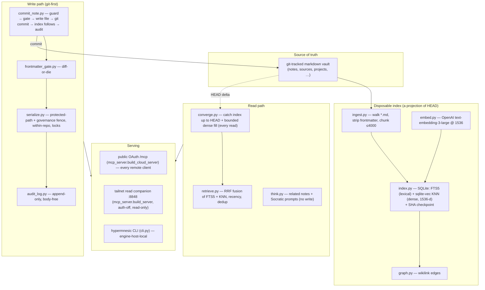

# Architecture

This document gives you an accurate mental model of hypermnesic without reading the
source. For the user-facing quick start see [`README.md`](README.md); for the exact
tool/CLI/config surfaces see [`docs/reference/`](docs/reference/).

## The one invariant

> **The git-tracked markdown files are the single source of truth. The search/graph
> index is a disposable, rebuildable projection of the committed tree.**

Everything else follows from this. There is no separate database of record. A reindex
can be run at any time and **never loses a committed write** — because writes go to git
first, and the index is rebuilt *from* git. This is what makes the system safe to drop
into any repo and safe to operate without backups of the index.

## Layers

### Retrieval (`retrieve.py`, `index.py`, `embed.py`, `graph.py`)

Hybrid: **SQLite FTS5** (lexical) fused with **sqlite-vec** KNN (dense; OpenAI
`text-embedding-3-large` at **1536 dims**) via **Reciprocal Rank Fusion**. The dense
channel degrades gracefully — if the embedding API is unreachable, lexical + graph
results still return, flagged `degraded_lexical_only`. Near-duplicate hits are collapsed
and a per-hit write-recency timestamp is attached (consumers derive their own forgetting
curve). The wikilink **graph** (`graph.py`) answers `build_context` and entity
`resolve`.

### Read-time convergence (`converge.py`)

Every read first runs `converge()`: it delta-replays the lexical index up to `HEAD`,
invalidates doc-surface vectors for changed markdown paths, closes a bounded slice of
the dense lag for both chunks and missing/stale doc surfaces (`CONVERGE_EMBED_BUDGET`),
and signals (never forces) a manual reindex when `HEAD` has jumped far past the
checkpoint (`CONVERGE_MAX_DELTA_FILES`). A debounce (`CONVERGE_DEBOUNCE_SECONDS`)
coalesces bursts. This is the correctness guarantee that lets the index stay a pure
projection while reads remain fresh — a just-committed or edited note is recall-able on
the next read with no manual reindex.

### Git-first write path (`commit_note.py`, `serialize.py`, `frontmatter_gate.py`, `audit_log.py`)

`commit_note` is the one sanctioned write. It is **git-first**: write file → `git
commit` (→ push) → the index follows as a projection. The agent never merges. It is
bounded by, in order: the **blocklist write guard** (`serialize.py` — protected-path
refusal for `.git/`, `.github/`, agent-instruction files, `scripts/`/`hooks/`/`skills/`,
plus a governance-file fence for build/CI/credential files; within-repo resolution,
no traversal/symlink escape; an optional allowlist to *narrow*); the **diff-or-die
frontmatter gate** (`frontmatter_gate.py` — any unrequested frontmatter change aborts
the write); single-writer **locks** (`serialize.py`); and an **append-only audit log**
(`audit_log.py` — summaries only, never bodies, never credentials). A refusal returns
`{committed: false, refused: …}` — never a silent success.

### Serving topology — two lanes (`mcp_server.py`, `auth.py`, `auth_cloud.py`)

1. **Public OAuth `/mcp`** (`build_cloud_server`) — the sole network lane for every
   remote client (ChatGPT/Claude connectors, the Claude Code / Codex plugin, the
   Obsidian companion). OAuth 2.1 with Dynamic Client Registration + PKCE; an
   operator-consent gate issues tokens; tokens are audience-bound (RFC 8707) and
   revocable. Read tools are always available; the gated `commit_note` write tool
   requires the `write` scope. Exposed via Tailscale Funnel (HTTPS + auto-TLS).
2. **Tailnet read companion** (`build_server`, `:8848`, auth-off, **read-only**) — for
   the Obsidian companion and the per-prompt recall hook on tailnet devices; tailnet
   membership is the boundary. A write-enabled serve requires auth
   (`write_enabled ⇒ auth-required`) unless the bounded `--allow-tailnet-write` opt-in
   is used on a CGNAT bind.

The server binds a specific Tailscale interface at the socket level and refuses
`0.0.0.0` at construction. The CLI (`cli.py`) is the engine-host-local surface and
skips the network entirely.

### Installer & roles (`install.py`)

`hypermnesic install --role={single|master|client}` and `hypermnesic setup` provision a
host: render service units, configure the funnel + OAuth discovery, install the
post-merge convergence hook, and verify the live HTTPS discovery chain before reporting
success (fail-closed: no partial state).

## Companion

The Obsidian companion (`obsidian-plugin/`, shipped as a separate GPL-3.0 repository) is
a strictly read-only recall surface that talks to the engine only over the MCP wire
(`search` / `build_context` / `think`). It is not a derivative of the engine — see the
license boundary in [`README.md`](README.md).
