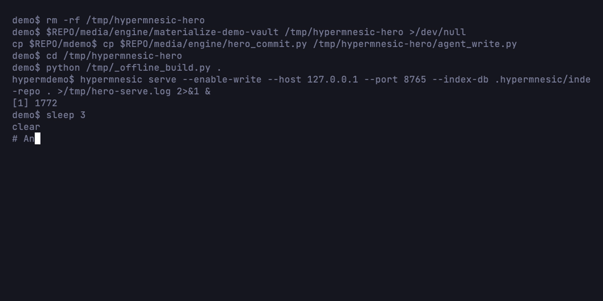
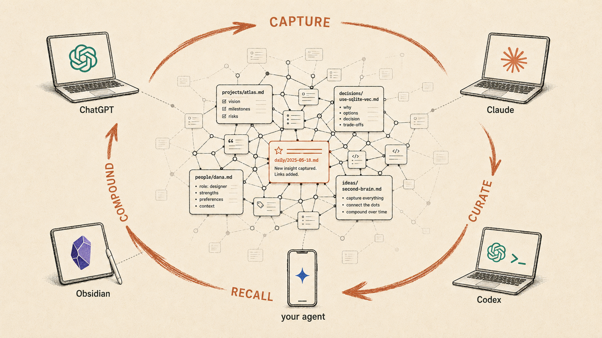
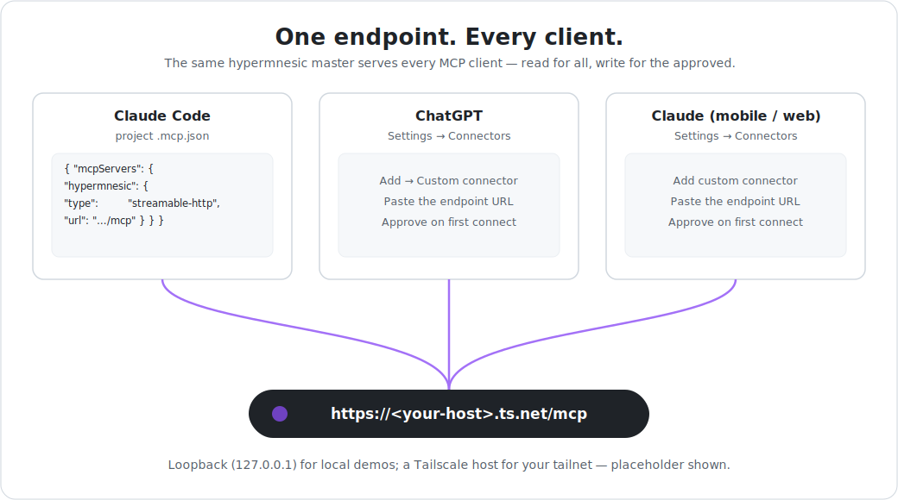
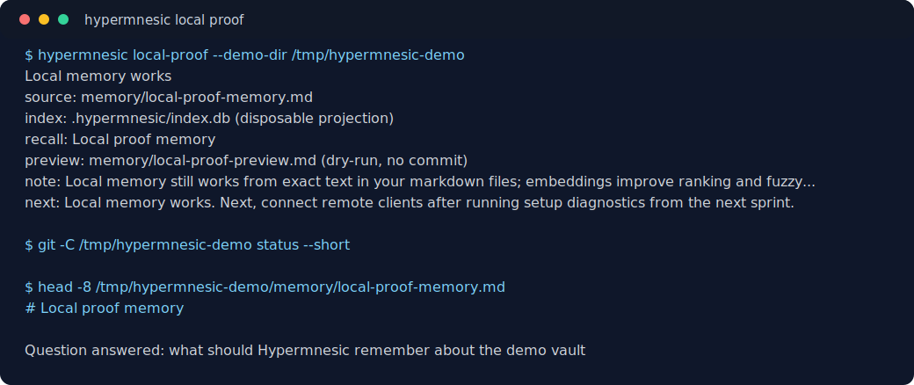

# hypermnesic

[](https://github.com/leonardsellem/hypermnesic/actions/workflows/ci.yml)
[](https://pypi.org/project/hypermnesic/)
[](LICENSE)

## One brain. Every AI. Yours.

Your second brain lives as plain Markdown in a Git repo **you** host. ChatGPT, Claude, and
your coding agents — on your laptop *and* your phone — all read and write that **same** brain
through one endpoint. Obsidian is how you browse it.

Here's the part that matters: because every AI keeps **curating** the same notes, your memory
doesn't just persist — it **compounds**. Every fact captured, every correction, every link
added makes the next answer from *every* assistant sharper. Per-app memory traps you in silos;
one shared brain gets smarter each day — and it's plain files you own, not rows in a vendor's
database.



**Every memory is a real Git commit** — reviewable, revertible, yours. The search index is a
disposable projection of your files; delete it and rebuild it any time. A reindex can never
lose a memory.

**Who it's for:** developers and power note-takers who want durable agent memory they *own* —
plain files in their own Git history, reachable by every assistant, with no vendor lock-in.

> **Status:** public v0.1.0 release. The engine is licensed under **AGPL-3.0-only**;
> the companion plugin ships from the separate GPL-3.0
> [`hypermnesic-companion`](https://github.com/leonardsellem/hypermnesic-companion)
> repository.

---

## Why it compounds



Per-app memory **fragments**: what you told ChatGPT is invisible to Claude, your phone's
assistant forgets what your laptop's agent learned, and none of it is yours to move. A shared
brain does the opposite — it turns every interaction into a flywheel:

- **Capture** — any AI writes a note: a decision, a fact, a person, a meeting.
- **Curate** — any AI links it, corrects it, or adds context the next time it's relevant.
- **Recall** — every other AI retrieves it on the next question.
- **Compound** — the brain grows denser and more useful with every turn, for all of them.

Because every write is a reviewable Git commit, one assistant's curation is safe, visible, and
revertible for all the others. The brain is shared **and** trustworthy.

---

## One endpoint, every client



Point any MCP-capable app at your endpoint URL and it just works — OAuth is automatic (log in
through the browser once, then silent refresh):

- **ChatGPT, Claude** (desktop, mobile, web) — add a custom connector.
- **Claude Code / Codex** — the bundled plugin.
- **Your own agents** — any MCP client, same URL.
- **Obsidian** — a read-only companion over your tailnet, for browsing and serendipity.

On the machine that holds the vault, skip the network entirely and use the `hypermnesic` CLI.
Setup details are in the [Quick start](#quick-start) below.

---

## How it's different

Most "agent memory" keeps your memories in *their* store. hypermnesic keeps them as **plain
Markdown in your Git repo**; the search index is a throwaway projection you can delete and
rebuild at will. Everything else follows from that one choice.

| Question | Hypermnesic | Hosted memory layers |
| --- | --- | --- |
| Source of truth | Markdown files in your Git repo | Service-managed memory store |
| Writes | Git-first commits — reviewable, revertible | API/app-managed writes |
| Reach | One self-hosted OAuth endpoint every client shares | Per-product API or app feature |
| Compounding | Every AI curates one shared brain | Memory siloed per app |

How it sits next to tools you may know:

- **mem0 / Zep** — memory APIs over a managed vector (and graph) store. Reach for them if you
  want a hosted memory *service*; reach for hypermnesic if you want **your files to be the
  memory**.
- **Hindsight** — also open-source agent memory, but it lives in its own vector store you run
  via Docker/cloud, and it posts a higher LongMemEval score on a more lenient judge axis.
  hypermnesic optimizes for **owned, auditable, compounding files**, not a leaderboard rank —
  read the honest comparability envelope in [`harness/BENCHMARKS.md`](harness/BENCHMARKS.md).
- **Honcho** — *complementary*, not competing. Honcho models **who you are** (preferences,
  style, theory-of-mind); hypermnesic holds **what you know**, in files. Use both.
- **A database-backed personal brain** — I built one before this. The database drifted from
  the files, and I couldn't fully trust or move it. hypermnesic is the rebuild: files are
  truth, the index is disposable.

Full tool-by-tool detail — including when hypermnesic is the *wrong* fit — is in
[**why hypermnesic**](docs/why-hypermnesic.md).

---

## Try it in under 5 minutes

```sh
uv tool install hypermnesic
hypermnesic local-proof --demo-dir /tmp/hypermnesic-demo
```

That creates a tiny Markdown git repo, projects it into the disposable index, recalls the
repo-relative source note, and previews the exact `commit_note` write diff **without** writing
it. No account, no service.



The demo source is an [asciinema cast](docs/assets/readme-local-proof.cast). It uses only a
generated `/tmp/hypermnesic-demo` vault and placeholder-safe paths.

---

## Quick start

### A. Prove local memory works

Start on the machine that holds the vault. You need only a **git repo** of markdown
notes. Dense embeddings improve ranking when `OPENAI_API_KEY` is configured, but the
proof also works offline in lexical mode.

```sh
# 1. install the engine from PyPI
uv tool install hypermnesic

# 2. prove recall from your own markdown files, with a dry-run write preview
hypermnesic local-proof /path/to/your/vault

# or try a tiny generated demo vault first
hypermnesic local-proof --demo-dir /tmp/hypermnesic-demo
```

The proof path validates a git-backed vault, projects committed markdown files into the
disposable `.hypermnesic/` index, asks a natural-language question, returns the
repo-relative source markdown path, and shows a `commit_note` dry-run diff without
creating a write commit. The success milestone is **Local memory works**.

### B. Self-host the endpoint

After the local proof succeeds, bring the shared endpoint online for remote apps. You need
[Tailscale](https://tailscale.com) installed and logged in (`tailscale up`); hypermnesic
uses Tailscale Funnel for public HTTPS + automatic TLS, so there is no reverse proxy or
cert to manage.

```sh
hypermnesic setup /path/to/your/vault \
  --public-url https://<your-host>.ts.net/mcp

# later, diagnose without changing services, secrets, funnel routes, or git
hypermnesic doctor /path/to/your/vault \
  --public-url https://<your-host>.ts.net/mcp
```

`setup` renders + starts a user service, generates an owner-only **consent secret**
(`~/.config/hypermnesic-cloud/cloud.env`, chmod 600), configures the Tailscale funnel
(the `/mcp` mount + the OAuth discovery well-knowns), then **verifies the live HTTPS
discovery chain** before reporting success. Re-running it converges to the same state.
It prints milestone checks, your endpoint URL, and login instructions. `--resource`
defaults to `--public-url`; pass it only when the OAuth resource identifier differs.
`doctor` and `status` report local index health, remote reach, OAuth discovery, auth
challenge, write availability, dense key source/state, vector coverage, and client-specific
next actions without mutating state. Read tools also expose `degraded_reason`; after an
embedding 429 they cool down provider calls while continuing to serve lexical/graph results.
Dense key lookup is repo-scoped: process
`OPENAI_API_KEY` wins, otherwise the target vault's gitignored `.env` is used even when the
command or MCP server starts from another working directory. Live OpenAI smoke checks stay
opt-in with `--check-dense-live`. Dense diagnostics keep credential state separate from
projection state: missing indexes point to initialization, and stale/absent vectors point to
`hypermnesic converge /path/to/vault --now --json` before a full reindex.
By default, new OAuth clients request `read`; admins can make new approvals request both
read and write with `--default-client-scopes read write` or
`HYPERMNESIC_DEFAULT_CLIENT_SCOPES=read,write`.

### C. Connect a client (any remote app)

Point the app's MCP server at your endpoint URL — that's it. OAuth is automatic:

- **Claude / ChatGPT (cloud connectors), Claude Code plugin, Codex:** add the MCP
  server URL `https://<your-host>.ts.net/mcp`. On first connect the app discovers the
  OAuth server, opens a browser once for you to authorize, then silently refreshes.
  The OAuth metadata supports both confidential clients and public clients registered
  without a client secret.
- **Read vs. write:** read access is the default unless the endpoint admin configures
  `--default-client-scopes read write` / `HYPERMNESIC_DEFAULT_CLIENT_SCOPES=read,write`.
  To grant the `commit_note` **write** tool, approve **write** on the consent page (type your
  approval token from `~/.config/hypermnesic-cloud/cloud.env`). The consent page shows exactly
  which scopes you're granting, lets you reject or cancel, and explains how to revoke later.
- **Client control:** after authorization, inspect or revoke known grants on the engine
  host with `hypermnesic clients list /path/to/vault` and
  `hypermnesic clients revoke /path/to/vault <grant-id> --apply`.
- **Claude Code / Codex plugin:** install the plugin in `plugin/` and set
  `HYPERMNESIC_MCP_URL` to your endpoint — the bundled `.mcp.json` is discovery-only and
  carries no host or token. See `plugin/README.md`.
- **Obsidian companion:** read-only over your tailnet — point it at the tailnet read
  route `http://<tailnet-ip>:8848/mcp` (no OAuth; tailnet membership is the boundary). It
  ships from the public
  [`hypermnesic-companion`](https://github.com/leonardsellem/hypermnesic-companion)
  repository under **GPL-3.0-or-later**; the first companion release is
  [`0.3.0`](https://github.com/leonardsellem/hypermnesic-companion/releases/tag/0.3.0).
  See [`obsidian-plugin/README.md`](obsidian-plugin/README.md) and the license boundary below.

### D. Use it locally (on the engine host)

The host that runs the engine skips the network entirely and uses the CLI:

```sh
hypermnesic local-proof /path/to/vault                           # first local value proof
hypermnesic retrieve /path/to/vault "what do we know about X"   # hybrid search
hypermnesic think    /path/to/vault "topic"                     # thinking-mode
hypermnesic resolve  /path/to/vault "Some Entity"               # name → page path
hypermnesic commit-note /path/to/vault notes/x.md --body "…"    # git-first write (dry-run preview)
hypermnesic memory list /path/to/vault                          # inspect/control memory
hypermnesic memory forget /path/to/vault notes/bad.md            # preview source removal
hypermnesic clients list /path/to/vault                         # inspect OAuth client grants
```

### E. Know what belongs in Hypermnesic

Hypermnesic is for **durable project memory**: source-grounded facts, decisions, procedures,
raw captures, generated summaries with citations, and current-state mirrors that should survive
the current session as markdown/git truth.

It is not the default home for short-lived session state or behavioural preferences. For example,
"user likes terse replies" belongs in Honcho or another adjacent behavioural memory layer by
default, not in Hypermnesic. Secrets, credentials, private keys, bearer tokens, and unreviewed
sensitive material should not be written at all.

Before writing, preserve raw evidence or cite source paths. If the destination is unclear, discover
writable locations first (`list_folders` / `hypermnesic list-folders`); that discovery also returns
direct root-local `AGENTS.md` guidance, or fallback `CLAUDE.md` guidance, for the requested root
when present, with local absolute paths and endpoint URLs redacted from the returned guidance.
See the [memory taxonomy guide](docs/guides/memory-taxonomy.md).

### F. Run the daily loop

For daily work, use the loop **capture -> triage -> recall -> write -> review -> clean up**.

```sh
hypermnesic capture /path/to/your/vault "raw observation"
hypermnesic daily-review /path/to/your/vault
```

The daily review is a generated, review-gated dashboard proposal that shows capture backlog,
recent writes, generated surfaces, recall-mode reminders, degraded/offline state, and cleanup next
actions. See [daily workflows](docs/guides/daily-workflows.md).

---

## How it works

A hybrid retrieval engine over a git-tracked markdown corpus, a git-first write path,
and the surfaces built on top:

- **Hybrid retrieval** — SQLite **FTS5** (lexical) fused with **sqlite-vec** KNN (dense;
  OpenAI `text-embedding-3-large` at **1536 dims**) via RRF, degrading gracefully to
  lexical-only when embeddings are down.
- **Read-time convergence** — every read first catches the index up to `HEAD`, invalidates
  doc-surface vectors for changed markdown files, and closes a bounded slice of the dense lag
  for chunks and doc surfaces, so recall stays fresh without a manual reindex.
- **Two serving lanes** —
  1. a single **public OAuth MCP endpoint** at `/mcp` (Tailscale-funnel'd HTTPS; OAuth 2.1
     with DCR + PKCE; **read tools always, the gated `commit_note` write tool by scope**),
     used by every remote client the same way;
  2. a **tailnet read companion** (`:8848`, auth-off) for the Obsidian companion and the
     proactive per-prompt hook on tailnet devices.

  By default a **write-enabled** serve requires OAuth (`write_enabled ⇒ auth-required`). The
  advanced `--allow-tailnet-write` opt-in accepts **tailnet membership itself as the write
  boundary** — permitting an auth-off, write-enabled serve, but **only** on a Tailscale CGNAT
  address (`100.64.0.0/10`). A non-tailnet bind is still refused (it would be a public write hole),
  and every `commit_note` guard (the blocklist write surface, protected-path refusal, diff-or-die
  gate, audit log) still applies. Use it only when the tailnet is your trust boundary and the
  public OAuth lane carries all untrusted traffic.
- **Write path** — `commit_note` takes a caller-supplied repo-relative path and commits it
  to git through a diff-or-die frontmatter gate and a **blocklist write guard**
  (write-anywhere-under-guards: a note may land anywhere in the vault *except* the protected
  classes — `.git/`, `.github/`, agent-instruction files like `CLAUDE.md`/`AGENTS.md`,
  `scripts/`/`hooks/`/`skills/`, and build/CI/credential files — which are refused regardless of
  any allowlist), single-writer locks, and an append-only audit log. An explicit allowlist is an
  opt-in way to *narrow* the surface, not the default guard. The index follows as a projection — a
  reindex never loses a write. Write requires auth (`write_enabled ⇒ auth-required`).
- **Memory control** — `hypermnesic memory` lists and inspects remembered files, exports
  markdown plus provenance, previews and applies git-backed forget/delete, reverts safe
  recent single-file writes, shows audit/refusal history, and answers what an agent may
  write using the same guard as `commit_note`.
- **Client control** — `hypermnesic clients` lists secret-free OAuth grant metadata and
  revokes grants without exposing bearer tokens, refresh tokens, approval credentials, or
  client secrets. The public cloud lane separately stores restart-survivable OAuth runtime
  state in owner-only `.hypermnesic/cloud-oauth-state.json`.
- **Security** — operator-consent gates the `write` scope at login; audience-bound tokens
  (RFC 8707); refresh rotation + whole-grant revoke; a per-request consent CSP. See
  `docs/2026-06-03-unified-write-anywhere-security-review.md`.
- **Human surfaces** — thinking-mode, salience + spaced-review digest, serendipity
  connections, an always-organized navigation surface, frictionless capture→triage,
  multi-format sidecar extraction (PDF/DOCX/XLSX/PPTX/PNG), and a read-only Obsidian companion.

## Benchmarks


On **LongMemEval V1** (the `_s` 500-question set), hypermnesic's end-to-end QA accuracy is
**88.6% overall / 90.2% task-averaged** with a GPT-4.1 reader, and **83.6 / 87.1** with a
GPT-4o reader — both graded by the canonical `gpt-4o-2024-08-06` judge. Session-level retrieval
`recall@10` is **0.949** (every gold session in the top-10 for 94.9% of questions).

**Read these honestly.** They are on the matched **GPT-4o-judge** axis — the only
apples-to-apples memory-system comparison — where hypermnesic sits **on par with Mastra
Observational Memory (84.2)**, **+12 over Zep (71.2)**, and **+23 over the no-memory
full-context floor (60.2)**. They are **not** comparable to the GPT-4.1-*judged* ~95%
leaderboard rows — that gap is judge leniency, not memory quality. The full methodology,
comparability envelope, per-ability tables, corrections log, and a re-runnable harness
(pinned dataset hash; `bench` extra required for the paid reader path) are in
[`harness/BENCHMARKS.md`](harness/BENCHMARKS.md).

LongMemEval measures retrieval quality. It does not prove setup, consent, memory control, or remote-client operability. Product operability is gated by the local product smoke
(`scripts/product_smoke.py`), offline remote-contract tests, the
[remote-client smoke checklist](docs/guides/remote-client-smoke-checklist.md), and the
[first-class product readiness checklist](docs/launch/first-class-product-readiness-checklist.md).

## Docs

Start with the [documentation index](docs/README.md). Highlights:

- [`ARCHITECTURE.md`](ARCHITECTURE.md) — how it works (the disposable-index invariant, retrieval, write path, serving lanes).
- [`docs/why-hypermnesic.md`](docs/why-hypermnesic.md) — the wedge and a tool-by-tool comparison (mem0, Letta, basic-memory, Hindsight, Honcho, Obsidian).
- [`docs/guides/getting-started.md`](docs/guides/getting-started.md) — local proof, setup diagnosis, and failure modes.
- [`docs/guides/memory-control.md`](docs/guides/memory-control.md) — inspect, export, forget/delete, revert, audit, and write-scope controls.
- [`docs/guides/consent-and-clients.md`](docs/guides/consent-and-clients.md) — consent scopes, reject/cancel, client grants, and revocation.
- [`docs/guides/remote-client-smoke-checklist.md`](docs/guides/remote-client-smoke-checklist.md) — real-client OAuth/read/write/revoke smoke evidence.
- [`docs/launch/first-class-product-readiness-checklist.md`](docs/launch/first-class-product-readiness-checklist.md) — first-class product readiness checklist.
- [`docs/reference/`](docs/reference/) — the MCP tool, CLI, and configuration references.
- [`docs/unified-oauth-mcp-deploy-runbook.md`](docs/unified-oauth-mcp-deploy-runbook.md) — the unified endpoint: topology, cutover, reverse.
- [`plugin/README.md`](plugin/README.md) — the Claude Code / Codex plugin (OAuth-discovery, distribution-generic).
- [`docs/plans/`](docs/plans/) — the per-phase execution plans (the authoritative scope of record).
- [`docs/threat-model-commit-note.md`](docs/threat-model-commit-note.md) + [`docs/2026-06-03-unified-write-anywhere-security-review.md`](docs/2026-06-03-unified-write-anywhere-security-review.md)
  — the write-path threat model and the public write-surface review.
- [`implementation-notes.md`](implementation-notes.md) — running log of decisions and deviations.

## Community

- [Welcome discussion](https://github.com/leonardsellem/hypermnesic/discussions/73) — project overview, support boundaries, and contribution entry points.
- [Public roadmap](https://github.com/leonardsellem/hypermnesic/discussions/74) — near-term launch work, contribution funnel, and current non-goals.

## Develop

```sh
uv sync --extra dev
uv run pytest
uv run ruff check .
uv run python scripts/license_scan.py   # zero AGPL/GPL/SSPL *dependency* gate
```

## Credentials

The OpenAI key is read from `OPENAI_API_KEY` (env var or a gitignored repo-root `.env`). It is
never written to the index, the audit log, or any output. The OAuth consent secret lives only in
an owner-only env file. Public-lane OAuth client/token runtime state is stored in owner-only
`.hypermnesic/cloud-oauth-state.json` so clients can refresh across service restarts; it is never
logged or committed.

## License

Hypermnesic is licensed under **AGPL-3.0-only**. See [LICENSE](LICENSE).

The `scripts/license_scan.py` "zero AGPL/GPL/SSPL" gate is **dependency-scoped**: it governs
hypermnesic's *third-party dependencies*, keeping the dependency tree copyleft-free. It does **not**
govern — and is not contradicted by — the engine's own AGPL license: the gate excludes the
project's own distribution before classifying, so it stays green when the engine itself is licensed
AGPL-3.0. Third-party dependencies are permissive and verified copyleft-free on every CI run.

**Engine ↔ companion license boundary.** The Obsidian companion ships from a separate repository
under **GPL-3.0**; the engine is licensed under **AGPL-3.0-only**. Neither is a derivative of the
other, and that holds **because** they are separate processes that communicate only at arm's
length over the MCP network protocol (`search` / `build_context` / `think`), with no shared or
statically-linked code. The boundary stays true only while the **companion does not vendor,
import, or statically link engine source** (the read-only-over-the-wire invariant). Keep that
condition and the two licenses remain independent.
