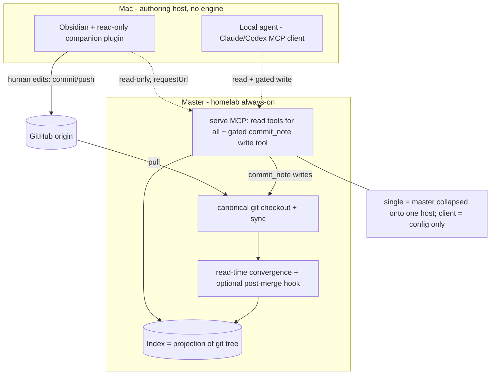

# Hypermnesic — Deployment Topology, Roles, and the Git-First Write Tool

> **ARCHIVED (2026-06-03).** An early topology/write-model brainstorm. The write model
> it describes (tailnet-membership auth, the note-zone allowlist) has since been
> superseded: the engine now serves one **public OAuth `/mcp`** endpoint + a tailnet read
> companion, and the default write surface is a **blocklist** (write-anywhere-under-guards),
> not a 4-prefix allowlist. Read [`../../ARCHITECTURE.md`](../../ARCHITECTURE.md) and
> [`../../SECURITY.md`](../../SECURITY.md) for the current model. Kept as history.

## Summary

A single installer provisions one of three roles — **single** (everything on one host; zero-infra solo), **master** (the always-on canonical engine + index + `serve` MCP, e.g. the homelab; owns the write path and convergence), and **client** (configuration only — an MCP client such as the read-only Obsidian companion or a write-capable agent, pointed at a master). Agents write through a **gated, git-first `commit_note` MCP tool** on the master — a single write target, so the index stays a rebuildable projection and no reconciliation cron is reintroduced. The MVP auth boundary is tailnet membership for both read and write; a later **MCP OAuth** upgrade (to reach mobile AI apps beyond the tailnet) raises auth for both and is the trigger point for the full write-surface threat model. The Obsidian companion stays strictly read-only and follows Obsidian's official plugin rules (`requestUrl`, native protocol-handler OAuth, no off-device send without opt-in).

---

## Problem Frame

The phase-2.5 work (read-time convergence + companion redesign) assumed a split deployment — companion on the Mac, engine + index on the homelab — but never specified how that split is installed, how writes happen across it, or how the client authenticates. Two questions forced this brainstorm:

- **Where do writes go, and does adding a write path re-create the thing hypermnesic exists to escape?** The operator's instinct was to "give the MCP write permissions, like gbrain." But gbrain's write model is DB-first `put_page` + an hourly restore cron — exactly the dual-write-target reconciliation machinery the kernel Problem Frame names as the pain to escape. Writing into the index directly would also break the index-as-projection invariant (R10): a `reindex` rebuilds from git and would silently delete any write that never reached git. So "MCP write" has to mean **git-first** (`commit_note` over MCP), not DB-first — otherwise hypermnesic collapses back into gbrain.

- **How does a Mac client reach a homelab master, and is SSH involved?** An earlier framing imagined a client engine reachable "through SSH." Investigating native primitives first (the operator's standing rule) dissolved it: the engine already exposes a tailnet-bound MCP server, and the future cross-network reach is **MCP OAuth** (needed for mobile ChatGPT/Claude apps), not SSH. A client therefore needs no local engine and no bespoke transport — it is a thin MCP client.

This doc settles the topology and write model so the phase-2.5 plan (and later phases) build against a fixed deployment shape, and grounds the client/plugin decisions in Obsidian's official developer rules.

---

## Key Decisions

- KD1 — Three roles, one installer; `client` is configuration, not an engine. `single` and `master` are the only roles that install an engine + index; a `client` is an MCP client (the read-only companion, or a write-capable agent) pointed at a master endpoint. This removes the need for a per-host client engine or an SSH transport.

- KD2 — Writes are git-first (`commit_note` over MCP), never DB-first. The MCP write tool runs `commit_note` on the master: it writes the markdown file, git-commits, and the index follows as a projection. Single write target preserved; index stays disposable/rebuildable (R10); no reconcile cron; no `reindex` data-loss footgun. This is the explicit rejection of replicating gbrain's `put_page` model.

- KD3 — The companion stays read-only; the write tool is an agent capability. The human authors in Obsidian directly; agents (Claude/Codex) use the gated write tool. The companion's read-only identity (its own KD1) is untouched — it is never granted the write tool.

- KD4 — MVP auth = tailnet membership for read and write; OAuth later upgrades both. For a single-operator tailnet, membership is the boundary for both capabilities (an accepted risk). When the MCP is exposed beyond the tailnet to mobile AI apps, MCP OAuth replaces it for read and write together. SSH is not part of the auth story.

- KD5 — The OAuth upgrade is the trigger for the full write-surface threat model. Tailnet membership is what makes deferring SEC-001 (prompt-injection reaching write-capable tools) / SEC-003 acceptable today. OAuth removes that boundary, so the write-surface threat model must land *with* the OAuth work, not drift past it.

- KD6 — Agent-write freshness is instant; human-edit freshness rides existing git sync. A `commit_note`-over-MCP write commits on the master and converges locally — instant. A human Obsidian edit reaches the master only via the existing Mac↔origin↔homelab git sync (then read-time convergence / the optional post-merge hook). This disk↔disk seam is inherent to "human edits on the Mac, engine on the homelab" and is accepted, not solved.

- KD7 — The Obsidian client follows Obsidian's official rules and native primitives. `requestUrl` (not `fetch`) for MCP calls; future OAuth via `registerObsidianProtocolHandler` + system browser + PKCE (public client, no bundled secret); network/account use disclosed in the README; no off-device transmission without explicit opt-in. (see Sources for official URLs)

---

## Actors

- A1. The operator / writer — authors in Obsidian on the Mac; runs the installer; sole approver of vault changes.
- A2. The read-only companion plugin — a thin MCP client; reads only; never writes.
- A3. A write-capable agent (Claude / Codex) — an MCP client that may call the gated `commit_note` write tool.
- A4. The master — always-on engine + index + `serve` MCP; owns the write path, convergence, and the canonical checkout + git sync.
- A5. Git / origin — the single source of truth and the sync fabric between the Mac authoring clone and the master.

---

## Roles & Topology

`single` is the master collapsed onto one host (the plugin/agent point at localhost). `client` adds no engine — it is an MCP-endpoint configuration.

---

## Requirements

### Roles & installer

- R1. One installer provisions exactly one of three roles: `single`, `master`, `client`.
- R2. `master` runs the engine, the index (projection), read-time convergence, the `serve` MCP (read tools for all clients + the gated write tool), and owns the canonical checkout and its git sync.
- R3. `single` is `master` collapsed onto one host for the zero-infra solo case; local clients point at localhost.
- R4. `client` installs no engine or index — it is configuration that points an MCP client (read-only companion or write-capable agent) at a master endpoint.

### Write model (git-first)

- R5. Agent writes go through a gated MCP tool that runs `commit_note` on the master (write file → git-commit → index follows as projection). Writes never target the index/store directly (no DB-first path).
- R6. The write tool reuses `commit_note`'s existing safeguards unchanged: the frontmatter diff-or-die gate, the write guard / protected-path refusal, an explicit path allowlist, and the append-only audit log.
- R7. An agent write converges on the master immediately (local commit → local convergence); there is no cross-host propagation step for agent writes.
- R8. The write tool is a distinct capability not exposed to read-only clients; the companion plugin is never granted it.

### Auth & security

- R9. MVP: tailnet membership is the auth boundary for both read and write tools (SEC-003 posture extended to writes), an explicitly accepted risk for the single-operator tailnet.
- R10. The write tool is registered as a distinct tool/capability from the read tools so a future per-identity auth can gate it separately.
- R11. Future: MCP OAuth upgrades auth for read and write together when the MCP is exposed beyond the tailnet (mobile AI apps); the full write-surface threat model (SEC-001 / SEC-003) lands with that work.

### Freshness per write path

- R12. Agent writes are instant-fresh on the master (R7).
- R13. Human Obsidian edits reach the master only via the existing Mac↔origin↔homelab git sync, then read-time convergence; their recall freshness lags that sync (accepted residual).
- R14. This doc does not re-specify convergence; it relies on the read-time convergence and optional `post-merge` hook defined in the phase-2.5 requirements doc.

### Obsidian client compliance (official rules)

- R15. The client uses `requestUrl` (not `fetch`) for all MCP calls; the master's MCP must return a single JSON body (non-SSE) on the client's request path, because `requestUrl` buffers and does not stream.
- R16. The plugin README discloses the remote MCP it contacts, that note text is transmitted as the search query, and — once OAuth lands — that an account is required, plus a privacy-policy link if the engine logs queries server-side (Obsidian Developer Policies).
- R17. The client ships with no hardcoded remote endpoint: the MCP URL defaults to empty and the plugin transmits nothing off-device until the operator configures it (opt-in). This replaces the current baked-in default address.
- R18. Future OAuth uses Obsidian-native primitives only: `registerObsidianProtocolHandler` + system browser + PKCE (public client, no bundled secret); tokens persisted via `loadData`/`saveData` with a preference for short-lived access + refresh (plugin `data.json` is plaintext).
- R19. `isDesktopOnly` is decided by the plugin's actual Node/Electron use, independent of the mobile-AI-app reach (which is outside Obsidian's plugin model and imposes no plugin constraint).
- R20. The companion follows Obsidian plugin lifecycle/UI hygiene: do not detach leaves in `onunload` (fix the current violation); reuse existing leaves via `getLeavesOfType` on activate; register any CM6 gutter/inline surfaces via `registerEditorExtension`; safe DOM (`createEl`, no `innerHTML`); no telemetry, no remote code, no bundled secrets. These constrain the companion-redesign units in the phase-2.5 doc.

---

## Key Flows

- F1. Agent write (git-first)
  - **Trigger:** A3 calls the gated `commit_note` MCP tool on the master.
  - **Steps:** gate (diff-or-die) → write guard / path allowlist → git-commit on the master → index converges locally → audit-log append.
  - **Outcome:** the new content is committed to git and densely recall-able after the master's bounded convergence; nothing is left un-materialized (a `reindex` cannot lose it).
  - **Covered by:** R5, R6, R7.

- F2. Human Obsidian edit → recall
  - **Trigger:** A1 edits a note in Obsidian on the Mac.
  - **Steps:** the read-only companion shows recall from the master's last-pulled state → A1 commits/pushes via the existing git workflow → master pulls + converges → subsequent recall reflects the note.
  - **Outcome:** human edits become recall-able after the git sync + convergence; in-progress uncommitted edits are not surfaced through the companion (no false freshness).
  - **Covered by:** R13, R14.

- F3. Future OAuth (deferred)
  - **Trigger:** the operator connects the companion (or a mobile AI app) to a master exposed beyond the tailnet.
  - **Steps:** plugin registers an `obsidian://` handler → opens the system browser to the authorization server with PKCE → operator consents → redirect returns the code via the protocol handler → plugin exchanges it via `requestUrl` → token stored via `saveData` → authenticated read/write.
  - **Outcome:** per-identity auth for read and write without a localhost listener or a bundled secret.
  - **Covered by:** R11, R18.

---

## Acceptance Examples

- AE1. Covers R5, R7. An agent `commit_note` over MCP commits on the master and the new content is densely recall-able after bounded convergence; the index holds no un-materialized write (a subsequent `reindex` does not lose it).
- AE2. Covers R8. The read-only companion's tool allowlist contains no write tool; an attempt to invoke one is refused client-side.
- AE3. Covers R15. With the master returning a single JSON body, a companion `search` over `requestUrl` returns hits with no CORS failure and no SSE hang.
- AE4. Covers R17. A fresh companion install with no configured URL transmits nothing off-device until the operator sets the endpoint.
- AE5. Covers R20. After the plugin updates, the companion's sidebar leaf retains its position (no `detachLeavesOfType` in `onunload`).
- AE6. Covers R9, R11. In the MVP, any tailnet peer can call read and write tools (documented, accepted); the OAuth upgrade is where per-identity auth and the write-surface threat model land.
- AE7. Covers R18, F3. The future OAuth callback arrives via the `obsidian://` protocol handler — not a localhost listener — and no client secret is bundled in `main.js`.

---

## Scope Boundaries

### Deferred for later

- MCP OAuth and reach to mobile AI apps beyond the tailnet; per-identity auth.
- The full write-surface threat model (SEC-001 / SEC-003) — lands with the OAuth work (KD5).
- A human-authoring-via-MCP path — humans keep editing Obsidian directly; only agents use the write tool.
- Community-plugin publication — the submission-compliance items (README disclosure, default-empty URL, no sample code) apply if/when the companion is published.

### Outside this product's identity

- DB-first / index-direct writes — would re-import gbrain's reconcile-cron pain and break the index-as-projection invariant (R10). The write tool is git-first or it does not exist.
- A bespoke SSH transport or per-host client engine — dissolved; the tailnet MCP serves reads + writes today and OAuth carries future reach.
- Auto-triggered full reindex — stays gated/manual (the OOM scar); unchanged from the phase-2.5 doc.

---

## Dependencies / Assumptions

- Builds on and amends the phase-2.5 requirements doc (`docs/brainstorms/2026-06-02-phase-2-5-fresh-recall-requirements.md`); convergence and the post-merge hook are specified there, not here.
- The master's existing git sync (Mac↔origin↔homelab, as already run for the gbrain vault) carries human edits to the master.
- The `serve` MCP can return a non-SSE single-JSON response on the client request path for `requestUrl` compatibility — verify against the FastMCP streamable-http configuration in `src/hypermnesic/mcp_server.py`.
- `commit_note`'s gate / guard / audit (`src/hypermnesic/commit_note.py`, `src/hypermnesic/serialize.py`, `src/hypermnesic/frontmatter_gate.py`) are reused unchanged for the MCP write tool.
- Plugin `data.json` is plaintext in the vault — relevant to future token storage (prefer short-lived access + refresh).

---

## Relationship to the Phase-2.5 Requirements Doc

This doc **amends** `docs/brainstorms/2026-06-02-phase-2-5-fresh-recall-requirements.md`:

- Its KD1 ("Recall-only v1; write-triggers deferred to Phase 3") is narrowed: the *companion* stays recall-only, but **agent writes are now in scope** via the gated git-first `commit_note` MCP tool under tailnet auth (KD2/KD4 here). The Phase-3 write-surface threat model is re-anchored to the OAuth upgrade (KD5).
- R15, R17, and R20 here are **Obsidian-official compliance constraints on the companion-redesign units** in that doc (build scaffolding, surfaces, settings, trust layer) — the planner applies them there.

A pointer to this doc is added at the top of the phase-2.5 doc so the planner does not work from the superseded write-deferral.

---

## Outstanding Questions

All deferred to planning; none block `ce-plan`.

- The MCP write tool's registration shape — a distinct tool name vs a capability flag — and exactly how it is withheld from read-only clients (separate registration vs server-side gate).
- The non-SSE single-JSON response configuration for `requestUrl` clients on the FastMCP server.
- Installer mechanics: how a role (`single` / `master` / `client`) is selected and packaged.
- Whether `isDesktopOnly` stays `true` (decide from the redesign's actual dependencies).
- Future-OAuth token hardening (short-lived + refresh; mitigating plaintext `data.json`).

---

## Sources / Research

- Conversation decisions (2026-06-02): write model (git-first remote `commit_note`), roles (`single`/`master`/`client`), MVP tailnet auth + future MCP OAuth, SSH dissolved.
- Code: `src/hypermnesic/commit_note.py`, `src/hypermnesic/mcp_server.py` (tailnet-bound FastMCP `serve`, `READ_TOOL_NAMES`), `src/hypermnesic/serialize.py` (gate/guard/locks), `src/hypermnesic/index.py` (projection / convergence primitives), `obsidian-plugin/main.ts`, `obsidian-plugin/manifest.json`.
- Kernel framing: R10 (index = projection of git tree), R13 (multi-writer git serialization), R16 (authoring-host overlay vs replica projection); the single-write-target thesis and the gbrain dual-write / restore-cron pain it escapes.
- Obsidian official developer documentation (2026):
  - requestUrl — https://docs.obsidian.md/Reference/TypeScript+API/requestUrl
  - Developer policies (network/account disclosure, telemetry, no remote code) — https://docs.obsidian.md/Developer+policies
  - Plugin guidelines (lifecycle cleanup, no leaf-detach on unload, safe DOM, no default hotkeys, settings style) — https://docs.obsidian.md/Plugins/Releasing/Plugin+guidelines
  - Submission requirements — https://docs.obsidian.md/Plugins/Releasing/Submission+requirements+for+plugins
  - Mobile development / isDesktopOnly — https://docs.obsidian.md/Plugins/Getting+started/Mobile+development
  - Views (registerView, getLeavesOfType) — https://docs.obsidian.md/Plugins/User+interface/Views
  - Editor extensions (CodeMirror 6) — https://docs.obsidian.md/Plugins/Editor/Editor+extensions
  - registerObsidianProtocolHandler (OAuth callback) — https://docs.obsidian.md/Reference/TypeScript+API/Plugin/registerObsidianProtocolHandler
