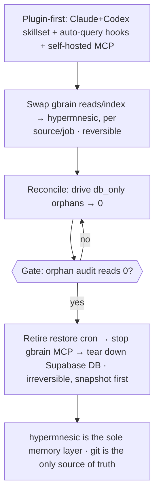

# Decommission gbrain — hypermnesic as the sole memory layer (cutover Phase 2)

## Summary

Retire gbrain entirely and make hypermnesic the single memory layer for the homelab + Mac agent stack. Ship a Claude+Codex plugin first (skillset + auto-query hooks + the self-hosted MCP) so agents reach for hypermnesic immediately, then swap gbrain's read/index role for hypermnesic across the Hermes jobs/scripts/skills, reconcile the historical DB-only orphans to zero, and switch off the restore cron + the gbrain Supabase DB + the gbrain MCP server.

---

## Problem Frame

Phase 1 (`docs/plans/2026-06-02-008-feat-homelab-dogfood-cutover-plan.md`) deployed hypermnesic as a *coexisting* disk-first committer on the shared vault `<home>/gbrain-brain`, leaving gbrain untouched. Coexistence is steady-state-stable but it is not the destination: the homelab now runs **two** memory layers over the same git tree — hypermnesic's git-projection index and gbrain's Supabase DB — and the agent stack still depends on gbrain for reads (entity resolution) and indexing.

That duplication carries ongoing cost. gbrain's DB→disk **restore cron** is a tombstone-respecting safety net that has repeatedly bitten (the 2026-05-30 rename-orphan-resurrection scar, the `manageGitignore` `db_only` rewrite scar), and every agent/operator touching the vault has to hold the DB-first lane, the tombstone discipline, and the `GBRAIN_NO_GITIGNORE` pins in their head. The DB also carries **336 DB-only orphans** today (pages in Supabase with no file on disk; ~249 are tombstone-zombies — deleted on disk, lingering in the DB), so the two stores are measurably out of sync.

Critically, the original "Phase 2 = migrate DB-first writers to disk-first" framing turns out to be mostly already done: a walk of the Hermes fleet (granola-sync, content-distill, readwise-ingest, x-bookmark-ingest, daily-worklog-enrichment) shows every job **already writes markdown disk-first and `git commit`/`push`** — none writes DB-first via `put_page`. What they actually use gbrain for is the **read/index role**: `gbrain search`/`get` for entity resolution and `gbrain sync`/`extract`/`embed` to index disk → DB. So the real blocker to a single memory layer is read parity + consumer cutover + reconciliation, not writer migration.

---

## Actors

- A1. hypermnesic — the git-native engine + tailnet MCP master; becomes the sole memory layer (search/recall + the gated `commit_note`).
- A2. gbrain — the outgoing layer: Supabase DB, the homelab MCP server (`https://homelab.<tailnet-host>.ts.net/mcp`), the `gbrain` CLI, the restore cron; decommissioned at the end.
- A3. Hermes ingest fleet — the cron jobs + their scripts + skills that write disk-first today but read/index via gbrain; the consumers to cut over.
- A4. Coding agents (Claude Code, Codex; homelab + Mac) — consume memory; the adoption target for the plugin.
- A5. Operator — approves the staged gates and runs the final, irreversible gbrain teardown.

---

## Key Flows

- F1. Agent recall via the plugin (adoption)
  - **Trigger:** an agent (A4) starts/continues work that would benefit from prior context.
  - **Actors:** A4, A1
  - **Steps:** the plugin's hook auto-queries hypermnesic for relevant notes → surfaces them to the agent → the agent reads/uses them, and writes back via `commit_note` or plain git as appropriate.
  - **Outcome:** agents reach hypermnesic by default, without a human remembering to query it; gbrain is not consulted.
  - **Covered by:** R3, R4

- F2. Ingest job after cutover
  - **Trigger:** a Hermes ingest job (A3) runs on schedule.
  - **Actors:** A3, A1
  - **Steps:** job resolves entities via hypermnesic search (not `gbrain search`) → writes markdown to its natural path + `git commit`/`push` (unchanged) → no explicit index step; hypermnesic converges on the next read.
  - **Outcome:** the job's output is recall-able through hypermnesic with no gbrain dependency and no `gbrain sync`/`extract`/`embed` step.
  - **Covered by:** R1, R2, R5

- F3. Decommission cutover (the program spine)
  - **Trigger:** Phase 2 begins.
  - **Actors:** A5, A1, A2, A3
  - **Steps:** plugin ships → consumers swap reads to hypermnesic per source/job → orphans reconciled toward zero → operator gate on a zero-orphan audit → restore cron retired → gbrain MCP stopped + Supabase DB torn down.
  - **Outcome:** one memory layer (hypermnesic); gbrain off; git remains the single source of truth.
  - **Covered by:** R6, R7, R8, R9, R10, R11

---

## Requirements

**Read parity & index swap**
- R1. hypermnesic must cover the load-bearing read surface — hybrid search/recall sufficient for the ingest jobs' **entity resolution** (resolve a name/phrase to an existing page/slug for wikilinking), at parity with how `gbrain search`/`gbrain get` are used today. The richer gbrain surfaces (timeline, salience, anomalies, contradictions, code intelligence, takes) are explicitly NOT required.
- R2. The explicit disk→DB index step (`gbrain sync` / `gbrain extract` / `gbrain embed`) is removed from the jobs and replaced by hypermnesic's automatic read-time convergence: a job that writes + commits, then queries hypermnesic, sees its own just-written content without an intervening index command.

**Plugin & adoption (ships first)**
- R3. A Claude + Codex plugin packages three things: (a) a hypermnesic skillset teaching agents when/how to use it (search/recall, `commit_note` writes, the disk-first model); (b) hooks that make hypermnesic querying automatic (auto-surface relevant context without an explicit human/agent call); (c) the self-hosted MCP server wiring pointing at the tailnet master.
- R4. The plugin makes hypermnesic the default memory layer agents reach for, installable on both Claude Code and Codex and reachable from where agents run today (homelab + Mac, both on the tailnet).

**Consumer cutover**
- R5. Every gbrain dependency in the Hermes cron jobs + their scripts + skills is replaced by the hypermnesic equivalent — reads (`gbrain search`/`get`) → hypermnesic search; index step (`sync`/`extract`/`embed`) → removed (convergence). After cutover, no scheduled job depends on the `gbrain` CLI or the gbrain MCP.
- R6. Cutover is **per-source / per-job and reversible**: each job migrates and is proven independently before the next; a failed migration reverts that one job to gbrain without blocking the others (strangler-fig).

**Reconciliation (the restore-retirement gate)**
- R7. Drive the orphan audit's `db_only` count to zero without losing real content: purge tombstone-zombies (deleted-on-disk, lingering-in-DB) from the DB; for the remaining genuine DB-only pages, either materialize them to disk (commit) or confirm-and-record them as deleted.
- R8. The restore cron is retired **only after** `gbrain_supabase_orphan_audit.py` reports `db_only = 0`, so retirement strands nothing (the Phase-1-defined gate, now binding).

**Decommission & safety**
- R9. Once consumers are cut over and reconciliation reads zero, gbrain is turned off: the restore + any remaining gbrain crons disabled, the gbrain MCP server stopped, and the Supabase DB decommissioned. This is the intended, irreversible end state.
- R10. The teardown is staged behind operator gates with a pre-teardown snapshot (DB dump + git tag), mirroring Phase 1's gated/auditable posture; each step is verifiable.
- R11. The program is reversible at every step up to the final DB teardown — the plugin, the read-swap, and per-job cutover can all roll back to gbrain. Only the zero-orphan-gated teardown is irreversible, and it runs last, with git history as the retained source of truth and a DB dump as the backstop.

---

## Acceptance Examples

- AE1. **Covers R2.** Given a cut-over ingest job, when it writes a new markdown note + commits and then queries hypermnesic for it, the note is recall-able with no `gbrain sync`/`extract`/`embed` having run.
- AE2. **Covers R6.** Given one migrated job fails its proof (e.g., entity resolution misses), when the operator reverts it, that job returns to using gbrain while every already-migrated job stays on hypermnesic.
- AE3. **Covers R8.** Given the orphan audit reads `db_only > 0`, when decommission is attempted, the restore cron is NOT retired and the program halts at the reconciliation gate.
- AE4. **Covers R1.** Given an ingest job needs the existing page for a named entity, when it queries hypermnesic, it gets a result good enough to wikilink to — without needing gbrain's graph/timeline/code tools.

---

## Success Criteria

- Agents (homelab + Mac, Claude + Codex) get relevant memory automatically via the plugin, and no human has to remember to query gbrain.
- No scheduled job, script, or skill references the `gbrain` CLI or MCP; the orphan audit reads `db_only = 0`; the restore cron, the gbrain MCP server, and the Supabase DB are off.
- Git remains the single source of truth; nothing depended on gbrain's DB after teardown (verified by a clean run of the agent stack with gbrain stopped *before* the irreversible teardown).
- A downstream planner can execute this from the doc without inventing the program's phase order, the reconciliation gate, or what "decommission" includes.

---

## Scope Boundaries

- Not rebuilding gbrain's richer read tools in hypermnesic — timeline, salience/anomalies/contradictions/trajectory, code intelligence (`code_def`/`refs`/`callers`/`blast`), and takes/calibration are out (not load-bearing; their loss is accepted).
- Not adding OAuth / per-identity auth / off-tailnet / mobile reach (Phase 1's deferred "Phase 3"). The plugin is assumed tailnet-only-reach; broader distribution is a separate effort.
- Not routing ingest through hypermnesic's `commit_note` as a gateway — the jobs already write disk-first via plain git; the write path does not change.
- Not migrating writers to disk-first as net-new work — they already are; the "migration" is the read/index swap.
- Not re-opening Phase 1 (the coexisting committer, the gated write path, the path-scoped commit) — that shipped.

---

## Key Decisions

- Sequence plugin-first, then supply-side (hybrid): the plugin (skillset + hooks + MCP) is the highest-leverage, lowest-risk, reversible piece and delivers adoption value immediately; the data migration + reconciliation run underneath, with the irreversible off-switch gated on the zero-orphan audit.
- Read parity is scoped to hybrid search/recall only — it is the single load-bearing read dependency; the richer surfaces are dropped rather than rebuilt, which is what makes full decommission tractable.
- Reconciliation is its own workstream, not a side effect of writer migration — the 336 DB-only orphans (~249 tombstone-zombies) are the real gate on retiring the restore.
- "Decommission" means turning off the Supabase DB + the gbrain MCP server, not just the restore cron — the intended, irreversible end state, run last behind a snapshot.
- Per-source strangler-fig is the cutover tactic — each job migrates and is proven independently and reversibly, never a big-bang.
- Plugin reach is tailnet-only (Mac + homelab agents are both on the tailnet); OAuth / per-identity / off-tailnet / mobile reach stays OUT of Phase 2 (008's deferred "Phase 3"). Confirmed in the brainstorm.

---

## Dependencies / Assumptions

- **Assumption (tailnet reach):** the Mac and the homelab agents are both on the tailnet, so hypermnesic at `100.64.0.55:8848` is reachable from every consumer that uses gbrain today. If any consumer is off-tailnet, the deferred OAuth/remote reach becomes a prerequisite.
- **Assumption (read parity holds):** hypermnesic's `search`/`build_context` (same embedding model + dims as gbrain) are good enough for the jobs' entity resolution. To be validated against the actual `gbrain search`→slug patterns the jobs rely on.
- **Dependency (reconciliation gate):** retiring the restore depends on `gbrain_supabase_orphan_audit.py` reading zero — a real data-reconciliation effort whose size depends on the tombstone-zombie vs genuine-DB-only breakdown.
- **Dependency (Phase 1 shipped):** builds on the live hypermnesic master (PR #10 merged) — read tools, convergence, and the gated `commit_note` are in place.

---

## Outstanding Questions

### Resolve Before Planning

- (none — the plugin distribution boundary is resolved: tailnet-only; see Key Decisions.)

### Deferred to Planning

- [Affects R5][Needs research] Pieces LTM is Mac-side (the only Pieces MCP hourly job): does it write disk-first or DB-first, and how does it cut over? Verify before assuming it matches the homelab fleet.
- [Affects R7][Needs research] Break down the 336 `db_only` orphans: how many are tombstone-zombies (safe to purge), genuine DB-only content (must materialize), vs case-mismatch noise (the 127 case-collisions / 157 phantom-pairs)? Sizes the reconciliation track.
- [Affects R1][Technical] Does hypermnesic's search return results in a shape the jobs' entity-resolution code can consume (resolve to a `.md`-stripped slug for a wikilink), or is a thin adapter/CLI verb needed?
- [Affects R3][Technical] Auto-query hook mechanism: Claude Code hooks + the Codex equivalent — how the plugin makes hypermnesic querying automatic without being noisy.
- [Affects R5][Needs research] Beyond the cron fleet, enumerate every gbrain consumer (the homelab remote MCP `homelab.<tailnet-host>.ts.net/mcp`, manual `gbrain` CLI use, the Mac) so cutover is complete before teardown.
