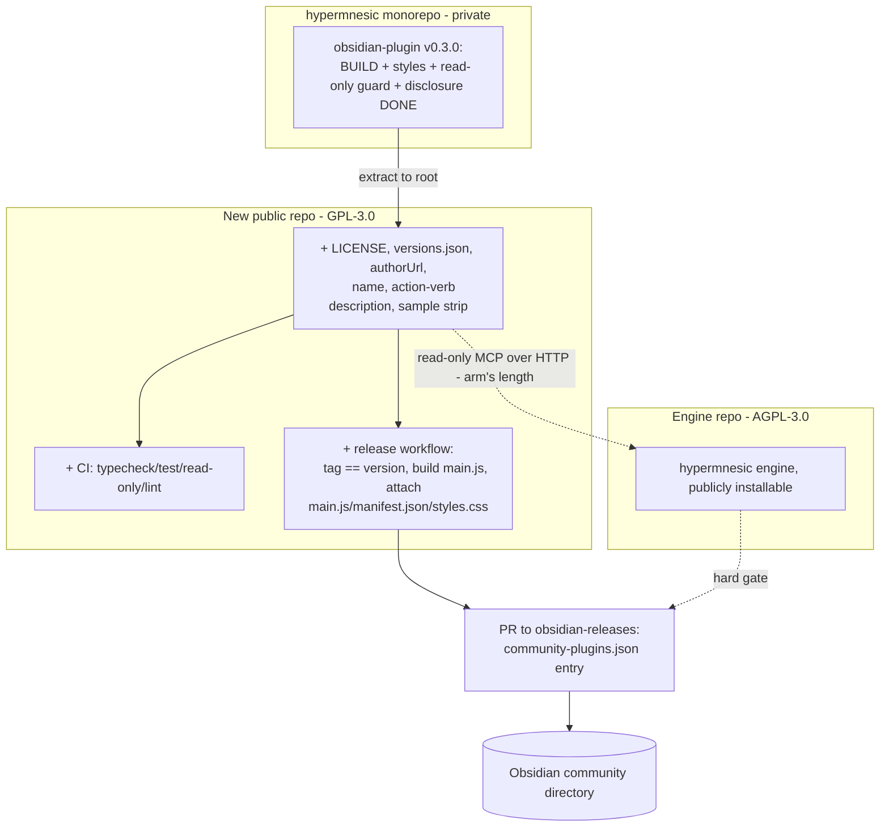

# Publish the companion plugin to the Obsidian community directory

## Summary

Extract the already-redesigned companion plugin (v0.3.0, on `origin/main`) into its
own public GitHub repo and close the residual gaps to a clean Obsidian
community-directory submission — a GPL-3.0 license, `versions.json`, a release +
CI workflow, manifest polish, a portable read-only check, and a sample-scaffolding
strip — while opening the engine under AGPL-3.0 so directory users have an engine
to point at.

---

## Problem Frame

The companion plugin is the most visible surface of hypermnesic, and the
**Phase-2.5 redesign already landed** (v0.3.0 on `origin/main`): a real build
(`package.json`, `esbuild.config.mjs`, `tsconfig.json`, lockfile), `styles.css`, a
modular `src/` tree, a vitest harness, the hard read-only allowlist in
`src/core.ts` (`search` / `build_context` / `think`), and — critically for
review — an **empty, opt-in default endpoint** (`mcpUrl: ""`, "never transmits
off-device until you set the endpoint") plus a thorough **network/privacy
disclosure** in the README and a settings "trust" panel listing the allowlisted
read tools. The plugin's own README already names the remaining work: *"would need
a sample-scaffolding strip and a submission pass."*

So this is **not** a build-it-from-scratch effort. Three things still block the
directory, and they are independent of the plugin's features:

- **It has no separate repo.** The plugin lives inside the private `hypermnesic`
  monorepo at `obsidian-plugin/`. Obsidian's automated check requires the
  *submitted* repo's root to contain `manifest.json`, so the plugin must become its
  own public repo.
- **It is licensed for nobody.** There is no `LICENSE` in the plugin tree, and
  `package.json` declares `"license": "UNLICENSED"` and `"private": true`. Obsidian
  requires a clear LICENSE, and a directory listing needs end users to have the
  right to use the plugin at all.
- **A directory user has nothing to run.** The plugin is a read-only client of a
  self-hosted hypermnesic MCP. With the engine private, the listing's audience
  can't get an engine — resolved by opening the engine under AGPL-3.0.

Plus a handful of mechanical packaging gaps the redesign did not need but the
directory does: no `versions.json`, no release/CI workflow in the plugin's own
repo, a lowercase display name, a missing `authorUrl`, and a read-only proof that
currently lives only in the monorepo's Python test.

### Already in place — do NOT re-plan these

- Build toolchain: `package.json` (scripts `build`/`dev`/`typecheck`/`test`),
  `esbuild.config.mjs`, `tsconfig.json`, `package-lock.json`.
- `styles.css` styling the plugin's emitted classes.
- Empty opt-in default endpoint (`src/types.ts` `mcpUrl: ""`); no network call
  until configured.
- Developer-policy disclosure: README "Network use & privacy" section + settings
  trust panel; no telemetry; one named remote service.
- Read-only invariant: hard allowlist in `src/core.ts`, no `innerHTML` (DOM via
  `createEl`), `requestUrl` (not `fetch`); statically scanned by
  `tests/test_obsidian_plugin.py` over `main.ts` + `src/`.

---

## Actors

- A1. **Owner / author (Leonard)** — extracts the plugin, sets the licenses,
  maintains the public repo, submits to the directory.
- A2. **The companion plugin** (new public **GPL-3.0** repo) — read-only MCP
  client; never writes the vault, never merges.
- A3. **The hypermnesic engine** (public **AGPL-3.0** repo) — the backend the
  plugin requires; must be publicly installable for the listing to be usable.
- A4. **Obsidian community directory** — the `obsidian-releases` automated review
  bot plus human reviewers that gate the listing and enforce the developer policy.
- A5. **End user** — an Obsidian writer who installs from the directory and
  self-hosts the engine.

---

## Key Flows

- F1. **Extraction & residual-gap close**
  - **Trigger:** owner creates the new public repo.
  - **Actors:** A1, A2
  - **Steps:** create `leonardsellem/<repo>` → move the v0.3.0 plugin to the repo
    root → add GPL-3.0 `LICENSE` and flip the `package.json` license/private
    fields → add `versions.json` → add CI + release workflows → port the read-only
    scan into the repo → manifest polish (name, `authorUrl`, description verb) →
    sample-scaffolding strip → `npm install && npm run build` succeeds from a clean
    clone.
  - **Outcome:** a public, buildable, directory-compliant plugin repo.
  - **Covered by:** R1, R2, R3, R5, R6, R8, R9, R10, R11

- F2. **Versioned release**
  - **Trigger:** owner tags a release.
  - **Actors:** A1, A2
  - **Steps:** version-bump keeps `manifest.json` + `versions.json` in lockstep →
    tag equals the manifest `version` (no leading `v`) → CI builds `main.js`
    (gitignored) and attaches `main.js` + `manifest.json` + `styles.css` as
    individual release assets.
  - **Outcome:** a GitHub release Obsidian can install from.
  - **Covered by:** R3, R4

- F3. **Directory submission**
  - **Trigger:** a release exists **and** the engine is publicly installable.
  - **Actors:** A1, A4
  - **Steps:** PR to `obsidianmd/obsidian-releases` adding a `community-plugins.json`
    entry (`id`, `name`, `author`, `description`, `repo`) → automated bot + human
    review → address feedback via incremented releases until it passes.
  - **Outcome:** the plugin is installable from the community directory.
  - **Failure/escape:** review feedback → fix → new release; the listing is a
    one-time slot-claim, later changes ship as ordinary releases.
  - **Covered by:** R7, R12

---

## Requirements

**Repository extraction**

- R1. The plugin lives in its own **public** GitHub repo with `manifest.json` at
  the repo root. Created as a fresh standalone repo under `leonardsellem/<repo>`;
  the current `obsidian-plugin/` contents (v0.3.0) move to the new root.
- R2. The monorepo's `obsidian-plugin/` is retired once the new repo is the source
  of truth — delete, or reduce to a one-line pointer (decided in planning).

**Packaging gaps for release**

- R3. Add a `versions.json` at the repo root mapping each released plugin version
  to its `minAppVersion`; a version-bump step keeps `manifest.json` + `versions.json`
  in lockstep on release.
- R4. Add a GitHub **release workflow**: the tag exactly equals the `manifest.json`
  `version` (semver, no leading `v`); CI **builds** `main.js` (it is gitignored)
  and attaches `main.js` + `manifest.json` + `styles.css` as individual binary
  assets.
- R5. Add **CI** in the plugin repo running on PR/push: `typecheck`, `vitest`, the
  read-only static check (R10), and lint.

**License conversion**

- R6. Add a **GPL-3.0** `LICENSE` to the plugin repo; change `package.json`
  `"license": "UNLICENSED"` → a GPL-3.0 SPDX id and remove `"private": true`;
  indicate the license in the README. Third-party code retains its own license with
  attribution where required.
- R7. The engine is released publicly under **AGPL-3.0** (reserving a separate
  commercial license later); the plugin↔engine boundary is documented as
  arm's-length (MCP / JSON-RPC over HTTP) so the two copyleft licenses stay
  independent and the plugin's GPL does not reach the engine.

**Manifest & metadata polish**

- R8. `manifest.json`: set `name` to **"Hypermnesic Companion"** (title case); add
  `authorUrl`; keep the unique `id` `hypermnesic-companion` (verify it is absent
  from the current community list); `fundingUrl` only if donations are accepted.
- R9. Rewrite the `description` to **open with an action verb** per the Obsidian
  style guide (the current text opens with "A strictly read-only recall surface…").
  Keep it ≤250 chars, ending in a period, retaining the read-only claim. *(Soft
  requirement — a likely reviewer style nudge, not a hard bot failure.)*

**Read-only proof portability**

- R10. The static read-only scan (today the monorepo `tests/test_obsidian_plugin.py`,
  which pins the `src/core.ts` allowlist and scans `main.ts` + `src/` for vault
  writes) **moves into the plugin repo's own CI** so the invariant stays proven
  where the code lives. The monorepo copy is retired with the directory in R2.

**Review-readiness sweep**

- R11. Strip any sample-plugin scaffolding / remnants and dead sample code (the
  README flags this as the remaining "sample-scaffolding strip"), and re-confirm
  the developer-policy code checklist (no hardcoded secrets, no obfuscation, no
  `innerHTML`, `requestUrl` over `fetch` — already largely true at v0.3.0).

**Submission**

- R12. After a GitHub release exists **and** the engine is publicly installable, a
  PR to `obsidianmd/obsidian-releases` adds a `community-plugins.json` entry (`id`,
  `name`, `author`, `description`, `repo` = `leonardsellem/<repo>`). Review feedback
  is addressed by publishing incremented releases, not by re-submitting.

---

## Visualization

Two public repos, one publishing pipeline, the engine gate on submission. Bold =
already shipped at v0.3.0; plain = residual publishing work.

The diagram is an on-ramp; R1–R12 stand alone in text.

---

## Acceptance Examples

- AE1. **Covers R1, R4.** Given a clean clone of the new repo, when `npm install &&
  npm run build` runs, then `main.js` is produced with no errors.
- AE2. **Covers R4.** Given a tag `0.3.0` matching the manifest `version`, when the
  release workflow runs, then the release has `main.js`, `manifest.json`, and
  `styles.css` attached as individual assets and the tag has no leading `v`.
- AE3. **Covers R10.** Given a change to any plugin source that calls a
  non-allowlisted tool or a `vault.*` write, when CI runs, then the read-only check
  fails.
- AE4. **Covers R6.** Given the new repo, when its `LICENSE` and `package.json` are
  inspected, then both declare GPL-3.0 and `package.json` is no longer `private`.
- AE5. **Covers R8.** Given the submission PR, when the `obsidian-releases`
  validation bot runs, then the `id` / `name` / `description` constraints pass.

---

## Success Criteria

- **Installable & honest (human outcome):** the plugin is installable from the
  community directory, and a first-time user — after self-hosting the engine — gets
  recall without editing code; the listing is upfront that the engine is required.
- **Compliant by construction:** every Obsidian automated-review check maps to a
  requirement here, so the submission passes the bot on the first complete attempt.
- **No regression in trust:** the read-only guarantee is statically verified in the
  plugin repo's own CI, not stranded in the private monorepo.
- **No redundant work:** the extraction preserves the v0.3.0 features and the
  already-shipped disclosure/default-endpoint/build work, rather than rebuilding
  them.
- **Clean handoff:** `ce-plan` can execute the extraction and residual gaps without
  inventing product behavior, the license choice, or the repo structure.

---

## Scope Boundaries

- **Plugin feature work** — the redesign (v0.3.0) is complete and merged; this doc
  changes no plugin behavior, only packaging/licensing/repo. Future feature work
  ships as ordinary version updates after the listing exists.
- The engine's **full open-sourcing** beyond the minimal public AGPL release the
  plugin needs (contributor guide, full docs, the commercial dual-license, any
  marketing) is its own effort — this doc only requires the engine be publicly
  installable so the plugin can point at it.
- **Mobile parity** stays deferred (`isDesktopOnly: true`), unchanged here.
- **MCP OAuth in the plugin** — only the protocol-handler seam exists; the
  implementation lands with the engine OAuth work (per the plugin's own "known
  gaps"), not this publishing pass.
- The plugin **never writes the vault and never merges** — an existing invariant,
  not re-litigated.

---

## Key Decisions

- **Plugin license: GPL-3.0.** The most restrictive *friction-free* OSI license
  Obsidian accepts — blocks proprietary forks; an Obsidian client gains nothing from
  AGPL's network clause, so GPL is the right tier.
- **Engine license: AGPL-3.0 (+ optional commercial dual-license).** Strongest OSI
  copyleft; closes GPL's SaaS loophole. Keeps the "open source" label and a
  monetization door.
- **Licenses stay independent across the MCP boundary.** Plugin (GPL) and engine
  (AGPL) communicate at arm's length over JSON-RPC/HTTP; per FSF guidance that is
  not a combined work, so neither copyleft infects the other. Consistent with
  `scripts/license_scan.py` (which bans copyleft *dependencies*, not a component's
  own license).
- **Fresh standalone repo, not a history-preserving subtree split.** Clean public
  slate over ongoing subtree-sync overhead.
- **Submit the redesigned v0.3.0 (not an older build).** The redesign is complete
  and merged (PR #12); the first directory release carries it. The earlier
  "publish-now vs redesign-first" fork is moot.
- **Display name "Hypermnesic Companion"** (title case) to match the Obsidian style
  convention and avoid a reviewer nudge.
- **Premise correction (recorded):** Obsidian does **not** require open-source —
  its policy permits closed source "case by case" and only mandates a clear LICENSE
  + dependency-license compliance. The copyleft choice here is deliberate
  protection, not an Obsidian obligation.

---

## Dependencies / Assumptions

- **Engine public before the directory PR (hard gate).** The AGPL engine must be
  publicly installable before R12, so the README links a real engine and
  reviewers/users can run the plugin.
- **Read-only MCP contract is stable** — `search` / `build_context` / `think` stay
  the read-only surface the plugin depends on.
- **`id` `hypermnesic-companion` is unique** in the current community list — verify
  against `community-plugins.json` before submission (unverified assumption).
- **Obsidian submission mechanics as researched 2026-06-02:** release tag ==
  manifest `version` (no leading `v`); `main.js` + `manifest.json` + optional
  `styles.css` as individual assets; `versions.json` at repo root;
  `community-plugins.json` uses `id` / `name` / `author` / `description` / `repo`.
  Re-confirm at implementation time.
- **`minAppVersion` `1.5.0`** — confirm against the Obsidian APIs the v0.3.0 plugin
  actually uses before release.

---

## Outstanding Questions

*(Both prior blocking questions are resolved: the redesign is complete → submit
v0.3.0; display name → "Hypermnesic Companion". Nothing blocks planning.)*

### Deferred to Planning

- [Affects R1][Needs decision] **Repo name** — e.g., `hypermnesic-companion` vs the
  `obsidian-<plugin>` convention.
- [Affects R6][Technical] Exact GPL SPDX id — `GPL-3.0-only` vs `GPL-3.0-or-later`.
- [Affects R2][Technical] Whether the monorepo keeps a thin pointer at
  `obsidian-plugin/` or deletes it outright.
- [Affects R10][Technical] Whether the ported read-only check is a vitest test or a
  small node/CI script, and whether the monorepo's Python copy is deleted or kept
  as a mirror until cutover.
- [Affects R9][Technical] Exact rewritten `description` wording (action-verb
  opening, ≤250 chars).
- [Affects R7][Needs research] The minimal shape of the engine's first public AGPL
  release (what must ship for the plugin's README to point at a working install).

---

## Sources / Research

- **Obsidian docs (fetched 2026-06-02):** *Submit your plugin*; *Submission
  requirements for plugins* (`description` ≤250 chars / ends with period /
  action-verb opening / no emoji; `id` unique + no "obsidian"; `name` no "Obsidian"
  / no trailing "Plugin"); *Developer policies* ("Include a LICENSE file and clearly
  indicate the license"; closed source "case by case"; client-side telemetry
  prohibited; "Network use. Clearly explain which remote services are used and
  why"; "An account is required for full access" allowed with disclosure); *Release
  your plugin with GitHub Actions* (tag == version, no leading `v`; upload
  `main.js`/`manifest.json`/`styles.css`).
- **`obsidianmd/obsidian-releases`:** `community-plugins.json` entry format
  (`id`/`name`/`author`/`description`/`repo`); `repo` is `user/repo` with
  `manifest.json` at root.
- **Current plugin @ v0.3.0 (`origin/main`):** `obsidian-plugin/manifest.json`
  (v0.3.0, lowercase name, no `authorUrl`), `package.json` (`UNLICENSED`,
  `private`), `src/types.ts` (`mcpUrl: ""`), `src/core.ts` (`READ_ONLY_TOOLS`
  allowlist), `README.md` (network/privacy disclosure + "sample-scaffolding strip"
  note), `tests/test_obsidian_plugin.py` (static read-only scan). No `versions.json`,
  no `LICENSE`, no plugin-repo CI/release workflow.
- **Licensing analysis:** GPL-3.0 vs AGPL-3.0 vs source-available (BSL 1.1 /
  Elastic v2 / SSPL) vs permissive; FSF position on arm's-length network/IPC
  boundaries; AGPL + commercial dual-license pattern.
- **Redesign lineage:** PR #5 (U35–U41) and PR #12 (U1–U8) "first-class read-only
  Obsidian UI"; `docs/plans/2026-06-02-009-feat-companion-first-class-ui-plan.md`.
