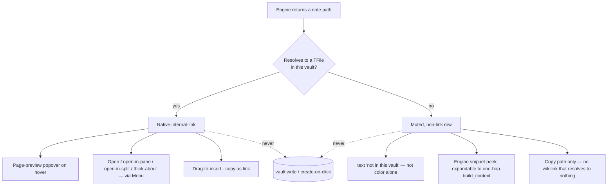

# hypermnesic companion — first-class Obsidian UI

## Summary

Bring every surface of the read-only hypermnesic companion to first-class,
showcase-worthy Obsidian quality. Every page reference becomes a real,
hover-previewable, navigable link — resolved per-hit (local notes get native
internal links + Page-preview + a right-click menu; non-local notes get an
honest muted row with an engine-snippet peek, never a broken or note-creating
link). Thinking-mode moves from a dead-end modal into a dockable panel; a
read-only-preserving drag/copy link-insertion affordance lands on every result;
the settings tab becomes a real surface; and the two divergent render paths are
unified — all without ever writing the vault.

---

## Problem Frame

The plugin's engineering bones are already guideline-clean — read-only by
construction, a single interaction-state machine, the persistent trust badge,
CSS variables throughout, `setIcon`, roving-tabindex accessibility, no
`innerHTML`, no leaf-detaching on unload. The gap is entirely in the
**interaction layer**, and it has one root cause: there are two rendering paths
and they diverge sharply.

`obsidian-plugin/src/surfaces/render.ts` (the status-bar popover and the sidebar)
builds navigable `internal-link` anchors with click handlers. But
`obsidian-plugin/src/thinking.ts` — the modal users see most — renders every
related note as plain `<li>` text via `relatedLabel()` and
`ul.createEl("li", { text: item })`. It has **zero links and zero navigation**:
the surface that invites the user to explore connections is the one surface they
cannot explore from. It is a dead-end overlay they must dismiss to act on.

Even the "good" path is not first-class. Nothing in the plugin uses Obsidian's
actual link primitives: links are `href="#"` stubs with manual handlers, so the
core Page-preview plugin never fires on hover; the reinvention nudge shows the
literal `[[full/path.md]]` wikilink syntax as display text; paths render raw
instead of as titles; there are no right-click actions; buttons are unstyled raw
`<button>` elements. And because the index lives remotely on the tailnet master,
some returned paths will not exist in the local vault at all — today the plugin
would hand those to `openLinkText` and silently create-on-click or preview
nothing.

The cost is a plugin that works but doesn't *feel* like Obsidian — and therefore
cannot be the showcase example it's meant to be.

---

## Key Decisions

- **Thinking-mode is a dockable panel, not a modal.** It becomes a registered
  `ItemView` leaf like Backlinks / Outline / Local Graph — persistent, dockable,
  navigable while open. This deliberately overrides the earlier "no new surfaces"
  steer because the modal's dead-end nature is the core defect, and a panel is
  the native idiom for an interrogable reference surface.

- **Per-hit path resolution.** Each returned path is resolved against the local
  vault. Resolvable hits render as native links with Page-preview hover and menu
  actions; unresolvable hits render as honest muted rows with an engine-snippet
  peek. The plugin never fakes a preview and never produces a link that 404s or
  creates an empty note.

- **Read-only is preserved end-to-end.** Link insertion is drag-to-insert /
  copy-as-link (the plugin supplies drag data or clipboard text; the user
  performs the drop/paste — the plugin never calls an editor or vault write).
  Non-local "preview" is the engine snippet, not a faked native preview.
  Navigation opens existing notes only.

- **One shared renderer for every surface.** The thinking panel's related list,
  the recall popover, the sidebar, the nudge, and the nudge context peek all
  render through a single hit/reference renderer, so links, hover preview,
  per-hit resolution, the menu, insertion, chips, staleness, and a11y are
  implemented once and inherited. This both fixes the headline divergence and
  lowers carrying cost.

- **Native primitives over bespoke UI.** Hover preview registers through
  `registerHoverLinkSource` + the `hover-link` event so it integrates with the
  core Page-preview plugin and the user's modifier-key preference; link format
  follows the user's vault setting via the native link-generation primitive;
  buttons, menus, icons, settings rows, and prose all use Obsidian helpers.

Per-hit resolution is the load-bearing branch — the picture carries it faster
than prose:

---

## Requirements

### Page references and navigation

- R1. Every surface that lists a note — the thinking panel's related list, the
  recall popover, the sidebar, the reinvention nudge, and the nudge's context
  peek — renders each note reference as an interactive element. No page reference
  anywhere is a non-navigable plain string.
- R2. When a path resolves to a file in the current vault, the reference is a
  native internal link: it carries the `internal-link` class and the resolved
  file reference, navigates on click and on Enter/Space, and triggers Obsidian's
  native Page-preview popover on hover so the user previews without leaving the
  current surface.
- R3. When a path does not resolve in the current vault, the reference renders as
  a visually-distinct muted, non-link row that (a) never 404s and never creates
  an empty note on interaction, (b) carries an accessible "not in this vault"
  indication in text, not color alone, and (c) offers an engine-backed peek (the
  existing `snippet`, expandable to a one-hop `build_context`) as the read-only
  stand-in for Page-preview.
- R4. Display text for a reference is the note's title/basename with the
  containing folder de-emphasized (the quick-switcher convention) — never a raw
  full path, and never the literal `[[path]]` wikilink syntax shown as text.
- R5. Each resolvable reference exposes a right-click context menu with at least:
  open, open in new pane, open in new split, and "think about this note." Menu
  items use native titles and icons.
- R6. All navigation opens existing notes only; no surface mutates the vault to
  navigate. The read-only invariant holds across every new navigation path.

### Thinking panel (modal → dockable view)

- R7. Thinking-mode renders into a dockable workspace leaf (a registered
  `ItemView`), not a transient modal. It persists while the user navigates, can
  be docked and moved like Backlinks/Outline, and is revealed/activated by the
  existing "Think about this note or selection" command.
- R8. Re-invoking thinking-mode updates the already-open panel in place — one
  panel, refreshed — rather than spawning duplicate leaves, and the panel
  survives note navigation.
- R9. The panel renders Related, Questions, and Tensions. The Related list
  renders through the shared reference renderer (R1–R5 hold inside it
  identically). Questions and Tensions render through Obsidian's
  `MarkdownRenderer` so any `[[wikilink]]`, path, or markdown in the Socratic
  prose becomes a live, hover-previewable link rather than inert text.
- R10. The panel carries the visible `wrote: false` proof badge and the
  persistent read-only trust badge, and presents no write affordance.
- R11. A result in the panel offers "think deeper" — re-running `think` on that
  note/topic and replacing the panel content in place, with a back affordance to
  the prior thinking result.
- R12. The panel has explicit loading, empty, degraded, and unreachable states,
  reusing the shared interaction-state machine and shown in-panel — not as
  transient Notices — so feedback is visible from the moment the command fires.
- R13. The panel matches the recall surfaces' keyboard and accessibility
  behavior: roving-tabindex arrow navigation across references, Enter/Space to
  open, region/list roles, and aria-live status.

### Read-only-preserving link insertion

- R14. Every resolvable reference is a drag source: dragging it into the editor
  inserts a link the user drops. The plugin supplies drag data only; the drop is
  the user's action — the plugin performs no editor or vault write.
- R15. The context menu (R5) includes "copy as link," placing a vault-correct
  link on the clipboard. Link format (wikilink vs markdown) follows the user's
  vault setting via the native link-generation primitive; the plugin does not
  hardcode a format.
- R16. For non-local references, insertion degrades honestly: no `[[wikilink]]`
  is offered (it would resolve to nothing); only "copy path" is available.

### Settings as a first-class surface

- R17. Bounded numeric settings (similarity threshold 0–1, staleness weight 0–1)
  render as sliders with visible current values; unbounded numerics (pause
  interval, result count, recency half-life) render as validated, clamped inputs.
- R18. Settings apply live wherever feasible — changing a value updates the
  running surfaces without a reload. Any setting that genuinely cannot hot-apply
  says so honestly, and the number of such settings is minimized.
- R19. The read-only tool allowlist renders as a real, styled read-only list of
  the allowlisted tools, not a disabled text input, consistent with the trust
  framing.
- R20. The settings tab holds to Obsidian conventions: sentence case throughout,
  `setHeading` sections, no `<h1>`/`<h2>` for headers, and descriptions that
  state the transmission/privacy posture where relevant.

### Native primitives and guideline compliance

- R21. All UI is built with Obsidian primitives: `setIcon` for icons,
  `ButtonComponent`/`setCta()` for buttons (replacing raw `<button>`),
  `Setting`/`PluginSettingTab` for settings, `Menu` for context actions, and
  `MarkdownRenderer` for prose. No `innerHTML`, `outerHTML`, or
  `insertAdjacentHTML`.
- R22. All styling lives in `obsidian-plugin/styles.css` via CSS classes and
  Obsidian CSS variables — no styles assigned from JavaScript or inline. The
  current hand-positioned popover's inline geometry is the known exception to
  remediate or explicitly justify.
- R23. The plugin passes the Obsidian plugin self-critique checklist for the UI
  in scope: no default hotkeys, no production `console.log`, sentence case, uses
  `this.app` (never the global `app`), and no deprecated methods.
- R24. Hover preview is registered through the supported native path
  (`registerHoverLinkSource` plus emitting the `hover-link` event with a stable
  source id) so it integrates with the core Page-preview plugin and the user's
  modifier-key preference rather than a bespoke popover.

### Shared rendering and consistency

- R25. One shared reference renderer backs every surface, so links, hover
  preview, per-hit resolution, the context menu, insertion, channel chips,
  staleness, and accessibility are implemented once and inherited — eliminating
  the current divergence where the recall path has links and the thinking path
  does not.

---

## Key Flows

- F1. Open thinking-mode
  - **Trigger:** The user runs "Think about this note or selection."
  - **Steps:** The panel reveals immediately in a loading state; the `think`
    call resolves; Related (shared renderer), Questions, and Tensions
    (`MarkdownRenderer`) populate in place. If the panel is already open, it
    refreshes rather than opening a second leaf.
  - **Outcome:** A persistent, navigable thinking panel.
  - **Covered by:** R7, R8, R9, R12.

- F2. Act on a reference row
  - **Trigger:** The user hovers, clicks, right-clicks, or drags a row.
  - **Steps:** Hover shows Page-preview (resolvable) or the engine-snippet peek
    (non-local); click/Enter navigates (resolvable only); right-click opens the
    menu (open / new pane / new split / think-about / copy as link); dragging
    yields drop-to-insert.
  - **Outcome:** The user explores or links a related note without the surface
    writing the vault.
  - **Covered by:** R2, R3, R5, R11, R14, R15.

- F3. Adjust a setting
  - **Trigger:** The user moves a slider or edits a value in settings.
  - **Steps:** The value validates/clamps; running surfaces re-render live; only
    genuinely-non-hot-applicable settings show a reload note.
  - **Outcome:** Tuning is immediate and legible.
  - **Covered by:** R17, R18.

---

## Acceptance Examples

- AE1. Resolvable vs non-local reference
  - **Covers R2, R3, R4.**
  - **Given** a related hit whose path is a file in this vault, **when** the user
    hovers it, **then** the native Page-preview popover appears and clicking
    opens the note.
  - **Given** a related hit whose path is not in this vault, **when** the user
    hovers it, **then** an engine-snippet peek appears (no native preview), the
    row reads "not in this vault" in text, and clicking neither navigates nor
    creates a note.

- AE2. Insertion, local vs non-local
  - **Covers R14, R15, R16.**
  - **Given** a resolvable row, **when** the user drags it into the editor or
    chooses "copy as link," **then** a vault-correct link in the user's
    configured format is inserted/copied and the plugin issued no write itself.
  - **Given** a non-local row, **when** the user opens its menu, **then** only
    "copy path" is offered — no wikilink.

- AE3. Thinking panel re-use and depth
  - **Covers R8, R11.**
  - **Given** the thinking panel is already open, **when** the user runs
    thinking-mode on a different note, **then** the same panel refreshes in place.
  - **Given** a thinking result, **when** the user chooses "think deeper" on a
    related note, **then** the panel replaces its content and offers a back
    affordance to the prior result.

- AE4. Live settings
  - **Covers R18.**
  - **Given** the recall surfaces are showing results, **when** the user changes
    the staleness-weight slider, **then** the visible ranking updates without a
    reload.

---

## Success Criteria

- No surface contains a plain-text, non-navigable page reference — verified by
  inspection of the thinking panel, recall popover, sidebar, nudge, and nudge
  peek.
- A resolvable reference behaves identically (link + Page-preview hover + menu +
  insertion) regardless of which surface it appears on — the shared-renderer
  guarantee is observable, not just internal.
- The plugin issues zero vault/editor writes across all new affordances,
  preserving the read-only static-test guarantee in
  `tests/test_obsidian_plugin.py`.
- The UI items in scope pass the Obsidian plugin self-critique checklist and the
  Plugin guidelines (no JS-assigned styles, no `innerHTML`, native primitives,
  sentence case, no default hotkeys).
- The thinking surface reads as a native reference panel a reviewer would
  recognize alongside Backlinks/Outline — persistent, dockable, navigable.

---

## Scope Boundaries

### Deferred for later

- A graph / connections mini-view and command-palette features beyond the
  existing commands.
- Mobile read-only recall and in-plugin MCP OAuth — already deferred in the
  plugin README; unchanged here.
- The community-directory *submission package*: listing screenshots, a demo GIF,
  the manifest `fundingUrl`, the version bump, and the submission PR. This
  brainstorm delivers code-level guideline *compliance*, not the publish chore.

### Outside this product's identity

- Any write or "open as proposal" affordance. The companion is read-only by
  construction; insertion is user-performed drag/clipboard, never a plugin write.
  Writes belong to agents through the engine's gated `commit_note`, never here.

---

## Dependencies / Assumptions

- Native Page-preview on hover requires the user's core "Page preview" plugin to
  be enabled; the hover-link registration is the supported integration point, and
  the muted/non-local path degrades gracefully when preview is unavailable.
- The non-local "preview" relies only on the already-available read tools
  (`search`'s `snippet`, `build_context`). There is no note-body read tool in the
  read-only allowlist (`search` / `build_context` / `think`), so a full remote
  note body is intentionally out of reach — the snippet/context peek is the
  ceiling. Any richer remote preview would require an engine-side read tool and is
  out of scope.
- Vault-correct link generation and format selection use the native
  link-generation primitive, which reads the user's wikilink-vs-markdown setting.
- Per-hit resolution assumes paths are vault-relative in a form resolvable by the
  workspace's link-resolution; normalization of engine paths to vault paths is a
  planning concern.

---

## Outstanding Questions

### Deferred to planning

- Whether the thinking panel is its own registered view type or a mode of a
  shared companion view — both satisfy R7/R8; pick during planning by which keeps
  the shared renderer cleanest.
- The exact "back" model for "think deeper" (single-level back vs a small history
  stack).
- Whether the hand-positioned status-bar popover (R22) is refactored onto a
  native menu/hover-editor pattern or retains justified inline geometry.
- Path normalization between the engine's returned paths and vault paths (R2/R3).

---

## Sources / Research

- Audited plugin files: `obsidian-plugin/src/thinking.ts` (the dead-end modal),
  `obsidian-plugin/src/surfaces/render.ts` (the linked path),
  `obsidian-plugin/src/nudge.ts` (raw `[[path]]` display text),
  `obsidian-plugin/src/surfaces/statusbar.ts` (hand-positioned popover),
  `obsidian-plugin/src/surfaces/gutter.ts`, `obsidian-plugin/src/state.ts`,
  `obsidian-plugin/src/settings.ts`, `obsidian-plugin/src/core.ts`,
  `obsidian-plugin/main.ts`, `obsidian-plugin/styles.css`.
- Obsidian developer docs — Plugin guidelines (avoid `innerHTML`, no JS-assigned
  styling, don't detach leaves on unload, sentence case, no `<h1>`/`<h2>` for
  settings headers): https://docs.obsidian.md/Plugins/Releasing/Plugin+guidelines
- Obsidian developer docs — `registerHoverLinkSource` + the `hover-link` event
  for native Page-preview integration:
  https://docs.obsidian.md/Reference/TypeScript+API/Plugin
- Obsidian developer docs — UI components (Modal, Menu, Setting, ButtonComponent),
  and the Obsidian October plugin self-critique checklist.
- Existing requirements lineage: `docs/brainstorms/2026-06-02-obsidian-companion-plugin-redesign-requirements.md`
  (the surface set and read-only framing this builds on).
</content>
</invoke>
