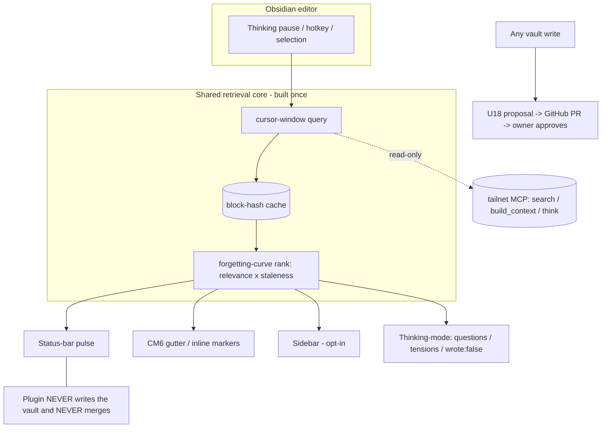

# Obsidian companion plugin — first-class read-only recall surface

## Summary

Redesign the hypermnesic Obsidian companion (U25) from a minimal always-on
related-notes sidebar into a **first-class but lightweight read-only recall
surface**: a single shared retrieval core fanning out to calm, glanceable
surfaces (status-bar + optional editor gutter, sidebar opt-in), in-editor
thinking-mode, an interrogable "reinventing [[X]]" nudge, selection-as-query
recall, a forgetting-curve ranking that resurfaces genuinely-forgotten notes, and
a visible trust/honest-degradation layer. v1 is **recall-only** — every write
still flows through the U18 git-proposal path; the plugin never writes the vault
and never merges.

---

## Problem Frame

The plugin is the **most visible user-experience surface** of hypermnesic — it is
where the owner actually meets the memory layer, in the app they already write in.
Today it is a ~200-line desktop sidebar that, on every keystroke, sends the **first
4000 characters of the file** to `search` and renders a flat related-notes list
plus an unfalsifiable "you may be reinventing [[X]]" warning. Three gaps make it
forgettable rather than first-class:

- **It is loud and shallow.** An always-on panel that reshuffles mid-sentence
  competes with writing for attention and gets tuned out; querying the file head
  means long, mature notes — exactly the ones with the richest connections —
  retrieve on their opening paragraph, never on the sentence being written.
- **It hides the engine's best capabilities.** The `think` tool (questions,
  tensions, `wrote: false`) — the differentiated R7 capability — is not even in
  the plugin's tool allowlist. The reinvention warning is a dead-end accusation
  with no snippet, no context peek, and no way to quiet it.
- **It asserts trust instead of showing it.** The read-only guarantee lives in a
  code comment and a Python test; the owner staring at the panel has no visible
  evidence the companion cannot touch their vault, and silent degradation (stale
  results when the tailnet drops, lexical-only when dense is down) quietly erodes
  the ownership-as-trust-floor (KD7) the whole product rests on.

The constraint that shapes every choice: the tailnet MCP is **strictly read-only**
and exposes no write path. Recall, thinking, and review can be first-class now;
anything that *changes* the vault must route through U18 — and the plugin may, at
most, link out to it.

---

## Key Decisions

- **KD1 — Recall-only v1; write-triggers are deferred, not improvised.** The MCP
  exposes only `search`/`build_context`/`think` (read-only, structural). Rather
  than bolt a write path onto the plugin, v1 ships only read/think/review verbs.
  Capture and "open this as a proposal" wait for a sanctioned write-trigger plus
  the Phase-3 write-surface threat model. This keeps the read-only invariant
  absolute and the plugin auditable.

- **KD2 — One shared retrieval core, many thin surfaces.** A single
  trigger→query→rank→cache pipeline is built once; status-bar, gutter, sidebar,
  thinking-mode, and selection-recall are thin renderers over its cached result.
  The cost of the N+1 surface trends to zero, and trust/accessibility/state
  handling are implemented once and inherited everywhere.

- **KD3 — Calm-primary, sidebar opt-in.** The default surface is glanceable and
  low-footprint (a status-bar indicator + optional editor-margin markers);
  retrieval fires on a *thinking pause*, not every keystroke, and is flow-aware
  (holds findings during sustained typing). The full sidebar becomes opt-in. The
  companion defers to the writer rather than competing with them.

- **KD4 — Forgetting-curve ranking is the differentiator.** Related results are
  ranked by relevance × staleness, down-weighting recently-touched notes so the
  surface preferentially reconnects the owner to genuinely *forgotten* material.
  This is the "hypermnesic" anti-amnesia thesis made visible, and what
  distinguishes it from similarity-only related-notes tools.

- **KD5 — Trust is shown, not asserted.** One explicit interaction-state machine
  (loading / results / stale / offline / degraded / error), per-result channel
  provenance, a persistent "read-only · tailnet · no text retained" badge, and an
  in-settings list of the allowlisted read tools make the guarantee legible in the
  UI — directly serving KD7/R10.

- **KD6 — Capability handshake decouples plugin from engine version.** On load the
  plugin probes which MCP tools/channels are available and lights surfaces up or
  degrades them accordingly, so the engine can grow (e.g., a future
  `list_proposals` endpoint) without forcing a lockstep plugin release.

- **KD7 — The Proposal Inbox is deferred, and when built reads a new engine
  endpoint.** Surfacing U18 proposals in-Obsidian is high-value but out of v1
  scope. When built, it sources from a **read-only `list_proposals` engine
  endpoint** (credentials stay server-side) rather than embedding a GitHub token
  in the plugin — consistent with the read-only-client model.

---

## Actors

- A1. **The writer (owner)** — reads and writes their vault in Obsidian; the sole
  approver of any change to it.
- A2. **The companion plugin** — a read-only MCP client; renders surfaces and
  navigates to existing notes; never writes the vault, never merges.
- A3. **The tailnet MCP / engine** — serves `search` / `build_context` / `think`
  read-only over a Tailscale-bound endpoint; later may add a read-only
  `list_proposals` endpoint (KD7).
- A4. **U18 / GitHub** — the review-gated write path; engine proposals become PRs
  the writer approves. In v1 the plugin only ever links out to it.

---

## Requirements

**Retrieval core**

- R1. All surfaces render from **one** retrieval pipeline; no surface issues its
  own redundant MCP query. A single trigger fires `search` (and, on demand,
  `build_context` / `think`).
- R2. Results are cached keyed by a normalized block/content hash (disposable and
  rebuildable, mirroring the engine's own index philosophy). Cache hits serve
  instantly and survive note re-open within a session; the cache is read-only.
- R3. Retrieval fires on a **thinking pause** (cursor idle past the configured
  interval, a paragraph boundary, or an explicit hotkey) — never on every
  keystroke. It never blocks typing and never moves the cursor.
- R4. The query is **cursor-windowed** (the active section/block around the
  cursor), not the file head, so long notes retrieve on what is being written now.
- R5. **Capability handshake:** on load the plugin probes which MCP tools and
  channels exist and enables or degrades surfaces accordingly, tolerating engine
  version drift.

**Surfaces & placement**

- R6. **Calm-primary:** the default surface is a low-footprint status-bar indicator
  (e.g., a related-count that expands to a switcher-style popover) plus optional
  CodeMirror gutter/inline markers anchored to the active block. The full sidebar
  panel is **opt-in**, not always-on.
- R7. **Flow-aware:** during sustained typing the plugin holds findings and does
  not reshuffle visible surfaces; it releases on the next pause.
- R8. Each related result shows **channel provenance** (lexical / dense / graph),
  is keyboard-navigable, and on activation opens the existing note — read-only
  navigation that never creates a note.
- R9. **Forgetting-curve ranking:** related results are ordered by relevance ×
  staleness, down-weighting recently-touched notes (KD4).

**Thinking-mode (R7 / H1)**

- R10. A "Think about this note / selection" command calls `think` and renders
  `related`, `questions`, and `tensions` read-only.
- R11. The think response carries a visible **`wrote: false`** proof badge; the
  think path exposes no write affordance.
- R12. `think` is added to the plugin's read-only tool allowlist (currently only
  `search` / `build_context`).

**Reinvention / connection nudge (view-only in v1)**

- R13. The "you may be reinventing [[X]]" warning is **interrogable**: it expands
  to the matched snippet and a one-hop `build_context` peek so the claim is
  checkable, not an unfalsifiable accusation.
- R14. The warning is **dismissable / mutable per-note**, persisted via plugin
  data; muting never alters the note (R10/no-surprise).
- R15. The nudge's "open as a proposal" action is **out of v1** (governed by KD1);
  in v1 the nudge is view/interrogate-only.

**Selection-as-query**

- R16. A "Recall about selection" command sends the highlighted text as an explicit
  query and renders results — intentional, high-signal retrieval alongside the
  ambient surfaces.

**Trust, states & accessibility**

- R17. **One explicit interaction-state machine** across all surfaces — idle /
  loading / results / stale / offline-tailnet / degraded (lexical-only) / error —
  each visibly distinct. A prior result is marked **stale with an as-of stamp**
  when a refresh fails, never silently frozen.
- R18. `degraded_lexical_only` is surfaced explicitly (e.g., "dense channel offline
  — lexical-only results").
- R19. A persistent, legible **"read-only · tailnet · no text retained"** badge;
  settings lists the exact allowlisted read tools. The guarantee is visible, not
  just in code.
- R20. **Accessibility:** `aria-live` on result updates, full keyboard navigation,
  and color is never the sole signal — provenance and staleness carry text/tooltip
  equivalents (colorblind-safe).

**Settings & footprint**

- R21. Settings cover: tailnet MCP URL, pause/debounce interval, result count,
  reinvention-warning threshold, and per-surface toggles (status-bar / gutter /
  sidebar), persisted via `loadData` / `saveData`.
- R22. Any credential (e.g., a future bearer) is read from env/settings, never
  echoed, never logged (SEC-003 posture: tailnet membership is today's boundary).
- R23. The plugin stays a **focused, auditable companion** — not a framework. The
  read-only tool allowlist and offline cache remain hard-enforced; total surface
  stays small enough to read in one sitting.

---

## Visualization

The shared retrieval core (KD2) and the read-only boundary (KD1):

The diagram is an on-ramp; R1–R23 stand alone in text.

---

## Key Flows

- F1. **Ambient retrieval-while-writing**
  - **Trigger:** writer pauses (cursor idle / paragraph boundary).
  - **Actors:** A1, A2, A3
  - **Steps:** plugin takes the cursor-window text → checks block-hash cache →
    on miss calls `search` → forgetting-curve ranks → renders calm surfaces.
  - **Covered by:** R1, R2, R3, R4, R6, R7, R9

- F2. **Selection recall**
  - **Trigger:** writer selects text and invokes "Recall about selection".
  - **Steps:** selection → explicit `search` → results rendered (provenance
    chips, keyboard-navigable).
  - **Covered by:** R8, R16

- F3. **Thinking-mode**
  - **Trigger:** writer invokes "Think about this note / selection".
  - **Steps:** `think(topic)` → render related + questions + tensions with a
    visible `wrote: false` badge; no write affordance present.
  - **Covered by:** R10, R11, R12

- F4. **Reinvention-nudge interrogation**
  - **Trigger:** top hit's similarity ≥ threshold for the current block.
  - **Steps:** show "reinventing [[X]]" → writer expands → snippet +
    `build_context` peek → writer opens the note OR mutes the nudge for this note.
  - **Covered by:** R13, R14, R15

- F5. **Degraded / offline**
  - **Trigger:** tailnet unreachable or dense channel down on a query.
  - **Steps:** plugin shows the explicit state (offline / degraded) with an as-of
    stamp; serves the last cached result clearly labeled stale; queues a refresh
    for reconnect.
  - **Covered by:** R17, R18, R2

---

## Acceptance Examples

- AE1. **Covers R3, R7.** While the writer types continuously, visible surfaces do
  not change; on the first pause past the configured interval, results update once.
- AE2. **Covers R4.** In a 2000-word note, editing a paragraph at the end produces
  related results reflecting that paragraph — not the note's opening.
- AE3. **Covers R11.** Invoking thinking-mode renders at least one question or
  tension and a visible `wrote: false` badge; the vault and git HEAD are unchanged
  afterward.
- AE4. **Covers R13, R14.** The reinvention warning expands to a snippet + context
  peek; choosing "mute for this note" suppresses it on that note across reloads and
  leaves the note's bytes unchanged.
- AE5. **Covers R17.** When a refresh fails after a prior successful result, the
  surface shows a "stale — as of HH:MM" state rather than silently keeping the old
  list as current.
- AE6. **Covers R18.** When the dense channel is unavailable, results render with an
  explicit "lexical-only" indicator rather than appearing authoritative.
- AE7. **Covers R8, R19.** Activating a result opens an existing note and never
  creates one; the "read-only · tailnet" badge is visible throughout.
- AE8. **Covers R20.** All result interactions are reachable by keyboard, and
  staleness/provenance are distinguishable without relying on color.

---

## Success Criteria

- **Felt value early (KD5/KD3):** within the first session, the owner gets useful
  related recall on a pause without configuring anything, and never experiences the
  panel reshuffling mid-sentence.
- **Non-blocking:** retrieval never janks typing or moves the cursor, even when the
  MCP is slow (skeleton/optimistic states; results arrive on pauses).
- **Trust is legible:** a first-time user can point to where the UI says the plugin
  is read-only and which tools it may call, without reading code.
- **Differentiated recall:** the forgetting-curve ranking demonstrably surfaces
  stale-but-relevant notes a similarity-only list would bury.
- **Lightweight:** the plugin remains a small, auditable surface; the read-only
  allowlist is statically verifiable (the existing scripted assertion still holds).
- **Resilient:** with the tailnet down, the plugin degrades to clearly-labeled
  cached recall rather than appearing broken.

---

## Scope Boundaries

**Deferred for later (valuable, not v1):**

- **Proposal Inbox** — an in-Obsidian view of open U18 proposals (digests /
  connections / MOCs / triage) with diff + managed-block preview, approve/merge
  deep-linking to GitHub (never merging in-plugin). When built, sourced from a new
  **read-only `list_proposals` engine endpoint** (KD7), not a GitHub token in the
  plugin.
- **Write-triggers** — frictionless capture (H6) and one-click "open as proposal"
  (the nudge's action, connection-accept, capture→triage). Gated on a sanctioned
  write-trigger path plus the Phase-3 write-surface threat model (KD1).
- **Mobile read-only recall** — a CM6-free recall subset over the tailnet for
  phone; desktop-first this phase (the editor-extension surfaces don't port).
- **Wikilink ghost-text** (Copilot-style inline `[[` completion to existing notes)
  — higher CM6 complexity; revisit after the calm surfaces land.
- **Ambient connection-density glyph** — a second always-on signal; deferred to
  avoid competing with the status-bar indicator until the core proves calm.

**Outside this product's identity (never):**

- The plugin **never writes the vault directly** and **never merges** — writes are
  U18 proposals the owner approves.
- **No silent rewrites or surprise mutations** (R10); muting/dismissing nudges is
  plugin-local state, never a note edit.
- Not an autonomous organizer, not a chat box, not an embeddings engine of its own
  — it is a thin read-only client over the existing tailnet MCP.

---

## Dependencies / Assumptions

- **Read-only MCP contract** (`search` / `build_context` / `think`) is stable and
  reachable over the tailnet; `think` must be added to the plugin allowlist (R12).
- **Forgetting-curve ranking (R9)** assumes a per-note recency/staleness signal is
  available to the plugin — either from result metadata or local note mtime;
  **resolve which before planning** (the engine's salience signal is write-recency,
  not access).
- **Cursor-window querying (R4)** assumes the Obsidian `Editor` cursor/selection
  APIs (confirmed available) and that block boundaries can be derived cheaply.
- **Capability handshake (R5)** assumes a lightweight probe of the MCP tool list is
  feasible; if not, fall back to a static assumed tool set with graceful per-call
  degradation.
- **Deferred Proposal Inbox** depends on a future engine `list_proposals` endpoint
  (does not exist yet) — explicitly out of v1.
- **Tailnet membership is the only auth boundary today** (SEC-003); a bearer token
  is only introduced if the tailnet widens.
- Build/tooling: esbuild `main.ts` → `main.js`; desktop-first (`isDesktopOnly`
  until the mobile subset is taken up).

---

## Outstanding Questions

**Resolve before planning:**

- **Staleness signal source for R9.** Does forgetting-curve ranking use a
  plugin-local note-mtime/access proxy, or does the engine expose a per-result
  recency field? This determines whether R9 is plugin-only or needs an engine
  change.
- **Pause-trigger definition.** Exact pause semantics (idle ms, paragraph-boundary
  detection, manual-only) and defaults — tune against real writing, but pick the
  initial model before planning.

**Deferred to planning:**

- Gutter/inline marker rendering specifics (CM6 editor-extension shape) and how
  markers degrade when CM6 inline widgets are unavailable.
- Exact cache eviction policy and size bound for the block-hash cache.
- Status-bar popover vs. command-palette switcher for the "expand related" gesture.
- Whether the sidebar, when opted-in, reuses the same renderer as the popover.

---

## Sources / Research

- **Current plugin:** `obsidian-plugin/main.ts`, `obsidian-plugin/manifest.json`,
  `tests/test_obsidian_plugin.py` (the scripted read-only assertion).
- **Engine contract:** `src/hypermnesic/mcp_server.py` (`search` / `build_context`
  / `think`, read-only, `readOnlyHint`), `src/hypermnesic/think.py`,
  `src/hypermnesic/retrieve.py` (Hit shape: path / heading / score / channels /
  snippet; `degraded_lexical_only`).
- **Write path:** `src/hypermnesic/propose.py` (U18 — branch + PR, never merges),
  and the Phase-2 plan `docs/plans/2026-06-01-005-feat-phase2-human-surface-plan.md`.
- **Obsidian API (2026):** Plugin lifecycle (`onload`/`onunload`); `ItemView` +
  `registerView` + sidebar leaves (`getRightLeaf`/`setViewState`/`revealLeaf`/
  `getLeavesOfType` — never cache view refs); `Editor` + `editor-change`;
  CodeMirror 6 editor extensions (inline widgets / gutter); `addCommand` (+ hotkeys)
  / `addRibbonIcon` / status-bar item; `PluginSettingTab` + `Setting` +
  `loadData`/`saveData`; `requestUrl`. (docs.obsidian.md, Build-a-plugin / Views /
  Editor / Commands / Settings.)
- **Prior art:** `obsidian-local-rest-api` (built-in streamable-HTTP MCP + bearer
  auth) for the local-HTTP-from-plugin pattern; Smart Connections (related-notes
  sidebar + on-device embeddings) for the surface baseline this redesign improves
  on (forgetting-curve ranking, calm surfaces, honest degradation).
- **Ideation:** ce-ideate pass 2026-06-02 — 6 frames (pain, inversion,
  assumption-breaking, leverage, cross-domain analogy, constraint-flipping), ~48
  candidates; survivors A–J carried into this brainstorm.
