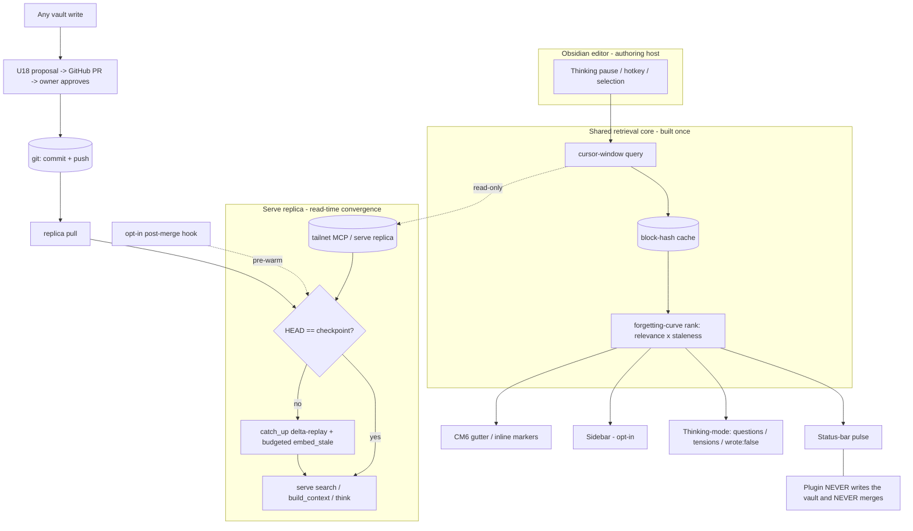

# Phase 2.5 — Fresh Recall: Automatic Index Convergence + Obsidian Companion Redesign

> **Amended 2026-06-02 by** `docs/brainstorms/2026-06-02-deployment-topology-write-model-requirements.md`. That doc settles the deployment topology (single/master/client roles) and **narrows KD1**: the companion stays recall-only, but **agent writes are now in scope** via a gated, git-first `commit_note` MCP tool under tailnet auth (the Phase-3 write-surface threat model is re-anchored to a future MCP-OAuth upgrade). It also adds Obsidian-official compliance constraints (`requestUrl`, no hardcoded remote default, no leaf-detach on unload, native protocol-handler OAuth) that apply to the companion-redesign units below. Plan against both docs.

## Summary

One phase increment that makes the human recall surface both **first-class** and **fresh**. The Obsidian companion (U25) is redesigned from a loud always-on related-notes sidebar into a calm, read-only recall surface — one shared retrieval core fanning out to glanceable surfaces, in-editor thinking-mode, an interrogable reinvention nudge, selection-recall, forgetting-curve ranking, and a visible trust/degradation layer. Underneath it, the index gains **automatic convergence on the read path**: every read first catches the lexical/graph index up to `HEAD` and closes a bounded slice of the dense-vector lag, so modifications made via `commit_note`, a direct Obsidian save, or a `git pull` become findable without anyone running `hypermnesic embed`/`reindex` by hand. The two halves meet at one seam: **the companion queries the tailnet replica, so its recall quality is exactly the replica's convergence freshness** — closed automatically on read and optionally pre-warmed by an opt-in git hook. v1 stays recall-only; every write still flows through the U18 git-proposal path.

---

## Problem Frame

Two gaps, one increment.

**The recall surface is loud, shallow, and asserts trust instead of showing it.** The companion is the most visible UX surface of hypermnesic — where the owner actually meets the memory layer, in the app they already write in. Today it is a ~200-line desktop sidebar that, on every keystroke, sends the first 4000 characters of the file to `search` and renders a flat related-notes list plus an unfalsifiable "you may be reinventing [[X]]" warning. It reshuffles mid-sentence and competes with writing; querying the file head means long, mature notes retrieve on their opening paragraph, never on the sentence being written; the differentiated `think` capability is not even in the plugin's tool allowlist; and the read-only guarantee lives in a code comment and a Python test rather than anywhere the owner can see it.

**The index does not re-capture modifications without manual action.** By design (R10) the index is a disposable projection of the git tree. `commit_note` keeps it fresh *lexically* and synchronously (`upsert_lexical`), so a written page is keyword-searchable the instant the commit returns — but dense vectors lag until `embed_stale` (U13) runs, and `embed_stale` is invoked only by the on-demand `hypermnesic embed` CLI. There is no file-watcher, git hook, cron, or daemon anywhere in the engine (verified absent), so every dense refresh today is manual. Between a write and the next manual embed, search underserves recent content; worse, `Index.note_vectors()` (behind U21 salience and U22 connections) only sees embedded chunks, so analytical features silently compute on a half-embedded corpus. Out-of-band edits — a direct Obsidian save, a not-yet-migrated cron, a `git pull` on the replica — are captured only on the next full reindex or, on the authoring host, via the working-tree overlay (which never advances the checkpoint, so a replica never sees uncommitted edits).

**Why one increment.** A first-class recall surface over a stale index is a worse lie than a plain one — it shows confident, well-ranked results that omit the work the owner did an hour ago. The companion's value is bounded by the freshness of what it reads. The kernel doc fixed the host-role split (R16) but explicitly left the convergence *trigger* open; this phase specifies that trigger and binds it to the surface that consumes it. The constraint that shapes every UX choice still holds: the tailnet MCP is strictly read-only and exposes no write path — recall, thinking, and review are first-class now; anything that *changes* the vault routes through U18.

---

## Key Decisions

Companion (KD1–KD7) preserved from the U25 redesign; convergence (KD8–KD14) from the automatic-convergence brainstorm; integration (KD15) is new to this merge.

- KD1 — Recall-only v1; write-triggers are deferred, not improvised. The MCP exposes only `search`/`build_context`/`think` (read-only, structural). v1 ships only read/think/review verbs; capture and "open this as a proposal" wait for a sanctioned write-trigger plus the Phase-3 write-surface threat model. The read-only invariant stays absolute and the plugin auditable.

- KD2 — One shared retrieval core, many thin surfaces. A single trigger→query→rank→cache pipeline is built once; status-bar, gutter, sidebar, thinking-mode, and selection-recall are thin renderers over its cached result. Trust/accessibility/state handling are implemented once and inherited everywhere.

- KD3 — Calm-primary, sidebar opt-in. The default surface is glanceable and low-footprint (status-bar indicator + optional editor-margin markers); retrieval fires on a thinking pause, not every keystroke, and holds findings during sustained typing. The full sidebar is opt-in. The companion defers to the writer.

- KD4 — Forgetting-curve ranking is the differentiator. Related results are ranked by relevance × staleness, down-weighting recently-touched notes so the surface preferentially reconnects the owner to genuinely forgotten material — the anti-amnesia thesis made visible.

- KD5 — Trust is shown, not asserted. One explicit interaction-state machine, per-result channel provenance, a persistent "read-only · tailnet · no text retained" badge, and an in-settings list of allowlisted read tools make the guarantee legible in the UI.

- KD6 — Capability handshake decouples plugin from engine version. On load the plugin probes which MCP tools/channels exist and lights surfaces up or degrades accordingly, so the engine can grow without forcing a lockstep plugin release.

- KD7 — The Proposal Inbox is deferred, and when built reads a new engine endpoint. Surfacing U18 proposals in-Obsidian is high-value but out of v1; when built it sources from a read-only `list_proposals` endpoint (credentials stay server-side), not a GitHub token in the plugin.

- KD8 — Convergence is a read-time projection refresh, not a background job. The plan already frames the index as self-healing via the SHA-checkpoint catch-up; the read path performs that self-heal. Nobody reading means nothing to converge; a query converges first, then serves. This is the load-bearing mechanism — no watcher, no cron, no daemon.

- KD9 — The write path stays lexical-only and inline. `commit_note` is not changed to embed synchronously; embedding is network-bound and would couple every write to OpenAI availability and latency, breaking fast/offline authoring. A write's dense lag closes on the next read-convergence.

- KD10 — Bounded effort per convergence; never an automatic full reindex. Each convergence does a delta catch-up plus a budgeted embed slice and never calls `reindex_isolated`; full rebuild stays a gated manual operation (the `--force` + cron + tight-RAM OOM scar holds). Bounded budget keeps first-read latency predictable and progress idempotent/resumable.

- KD11 — Staleness detection is host-aware, matching the fixed R16 split. Replica: `HEAD`-vs-checkpoint compare. Authoring host: that compare plus an `mtime` scan that refreshes the working-tree overlay for uncommitted edits. One routine, two host-conditional inputs.

- KD12 — The git hook is opt-in acceleration the user enables per use case. A `hypermnesic install-hooks` command installs a `post-merge` (and related) hook that pre-warms the index after a git event. It is never auto-installed; lazy read-convergence remains the correctness guarantee, so the hook only moves the cost earlier for hosts that want warm first reads (notably the always-on replica behind the companion).

- KD13 — Analytical reads force full convergence first. Salience (U21) and connections (U22) trigger an unbudgeted `embed_stale` before computing, trading latency for correctness, because `note_vectors()` on a partially-embedded corpus is silently wrong. Interactive search keeps the bounded budget; analytical reads do not.

- KD14 — "Read-only" means no tracked-file writes, not no index writes. Convergence on a serve/replica host writes only the disposable `.hypermnesic/` projection, never a tracked repo file — consistent with KTD8 and with the companion's read-only contract. Named explicitly because convergence-on-a-read-host can look like a read-only violation and is not.

- KD15 — The companion's recall freshness IS replica-convergence freshness; the overlay does not feed it. The plugin queries the remote tailnet replica, not a local engine, so the authoring host's working-tree overlay (which makes *local* uncommitted edits findable) does not surface those edits through the plugin. A note the owner just wrote becomes recall-able only after commit → push → replica pull → converge. The opt-in `post-merge` hook on the replica closes the last step; the forgetting-curve recency signal is surfaced by the converged read path rather than guessed plugin-side. The plugin must never imply freshness it does not have.

---

## Actors

- A1. The writer (owner) — reads and writes their vault in Obsidian; the sole approver of any change to it.
- A2. The companion plugin — a read-only MCP client; renders surfaces and navigates to existing notes; never writes the vault, never merges.
- A3. The tailnet MCP / serve replica (homelab) — serves `search` / `build_context` / `think` read-only over a Tailscale-bound endpoint; runs read-time convergence against its own projection; later may add a read-only `list_proposals` endpoint (KD7).
- A4. U18 / GitHub — the review-gated write path; engine proposals become PRs the writer approves. In v1 the plugin only links out to it.
- A5. The agent / `commit_note` writer — mutates tracked markdown through the single write primitive (lexical-inline), the dense lag of which convergence closes.
- A6. Git — both the event source (commit, merge, checkout) and the source of truth (`HEAD` vs the stored checkpoint).

---

## Requirements

### Companion — retrieval core

- R1. All surfaces render from one retrieval pipeline; no surface issues its own redundant MCP query. A single trigger fires `search` (and, on demand, `build_context` / `think`).
- R2. Results are cached keyed by a normalized block/content hash (disposable and rebuildable, mirroring the engine's index philosophy). Cache hits serve instantly and survive note re-open within a session; the cache is read-only.
- R3. Retrieval fires on a thinking pause (cursor idle past the configured interval, a paragraph boundary, or an explicit hotkey) — never on every keystroke. It never blocks typing and never moves the cursor.
- R4. The query is cursor-windowed (the active section/block around the cursor), not the file head, so long notes retrieve on what is being written now.
- R5. Capability handshake: on load the plugin probes which MCP tools and channels exist and enables or degrades surfaces accordingly, tolerating engine version drift.

### Companion — surfaces & placement

- R6. Calm-primary: the default surface is a low-footprint status-bar indicator (a related-count that expands to a switcher-style popover) plus optional CodeMirror gutter/inline markers anchored to the active block. The full sidebar panel is opt-in, not always-on.
- R7. Flow-aware: during sustained typing the plugin holds findings and does not reshuffle visible surfaces; it releases on the next pause.
- R8. Each related result shows channel provenance (lexical / dense / graph), is keyboard-navigable, and on activation opens the existing note — read-only navigation that never creates a note.
- R9. Forgetting-curve ranking: related results are ordered by relevance × staleness, down-weighting recently-touched notes (KD4), using the recency signal surfaced by the converged read path (R42).

### Companion — thinking-mode

- R10. A "Think about this note / selection" command calls `think` and renders `related`, `questions`, and `tensions` read-only.
- R11. The think response carries a visible `wrote: false` proof badge; the think path exposes no write affordance.
- R12. `think` is added to the plugin's read-only tool allowlist (currently only `search` / `build_context`).

### Companion — reinvention / connection nudge (view-only in v1)

- R13. The "you may be reinventing [[X]]" warning is interrogable: it expands to the matched snippet and a one-hop `build_context` peek so the claim is checkable, not an unfalsifiable accusation.
- R14. The warning is dismissable / mutable per-note, persisted via plugin data; muting never alters the note (R10 / no-surprise).
- R15. The nudge's "open as a proposal" action is out of v1 (governed by KD1); in v1 the nudge is view/interrogate-only.

### Companion — selection-as-query

- R16. A "Recall about selection" command sends the highlighted text as an explicit query and renders results — intentional, high-signal retrieval alongside the ambient surfaces.

### Companion — trust, states & accessibility

- R17. One explicit interaction-state machine across all surfaces — idle / loading / results / stale / offline-tailnet / degraded (lexical-only) / error — each visibly distinct. A prior result is marked stale with an as-of stamp when a refresh fails, never silently frozen.
- R18. `degraded_lexical_only` is surfaced explicitly ("dense channel offline — lexical-only results").
- R19. A persistent, legible "read-only · tailnet · no text retained" badge; settings list the exact allowlisted read tools. The guarantee is visible, not just in code.
- R20. Accessibility: `aria-live` on result updates, full keyboard navigation, and color is never the sole signal — provenance and staleness carry text/tooltip equivalents (colorblind-safe).

### Companion — settings & footprint

- R21. Settings cover: tailnet MCP URL, pause/debounce interval, result count, reinvention-warning threshold, and per-surface toggles (status-bar / gutter / sidebar), persisted via `loadData` / `saveData`.
- R22. Any credential (e.g., a future bearer) is read from env/settings, never echoed, never logged (SEC-003 posture: tailnet membership is today's boundary).
- R23. The plugin stays a focused, auditable companion — not a framework. The read-only tool allowlist and offline cache remain hard-enforced; total surface stays small enough to read in one sitting.

### Engine — convergence trigger and read path

- R24. Every read entrypoint converges before serving: the MCP `search` / `build_context` / `think` tools and the CLI read commands (`think`, `retrieve`) run a single shared convergence step before returning results.
- R25. Convergence is checkpoint catch-up plus a bounded dense fill: it runs `catch_up` delta-replay to `HEAD` (lexical + graph fresh, checkpoint advanced), then a budgeted `embed_stale` slice — reusing existing primitives, not new index machinery.
- R26. Convergence is debounced: it is skipped when it last ran within a configurable recency window, so back-to-back reads do not re-scan.
- R27. Convergence acquires the single-indexer lock non-blocking: if a writer or another converger holds it, the read serves current index state without waiting.

### Engine — write path and out-of-band capture

- R28. The write path is unchanged and lexical-only inline: `commit_note` keeps its synchronous `upsert_lexical` and does not embed inline; a write's dense vectors are closed by the next read-convergence.
- R29. The authoring host refreshes the working-tree overlay on read: when tracked/untracked markdown mtimes have advanced, convergence re-applies the overlay (R16) so uncommitted edits stay findable lexically *on that host*; the overlay never advances the checkpoint and uncommitted content is not embedded.
- R30. Replica capture is checkpoint-driven: on replica hosts, convergence detects out-of-band committed changes (`pull` / merge / checkout) purely by `HEAD`-vs-checkpoint, with no working-tree overlay.

### Engine — bounds, safety & degradation

- R31. Each convergence embeds at most a configurable budget of stale chunks and missing doc-surface vectors; the remainder is deferred to subsequent convergences. The pass is idempotent and resumable, so budget slices accumulate to full coverage.
- R32. Convergence never invokes `reindex_isolated`: full rebuild remains a gated manual operation, preserving the no-unattended-full-reindex (OOM) invariant.
- R33. Oversized-delta guard: when the checkpoint→`HEAD` delta exceeds a configurable size cap, convergence does not replay it unbounded inline — it applies lexical catch-up up to the cap and/or signals that a manual reindex is recommended.
- R34. Dense degradation is graceful: if the embedder is unavailable, convergence still completes lexical/graph catch-up and advances the checkpoint, serves lexical-only results, and resumes dense fill when the embedder returns — never blocking reads, never writing zero-vectors.
- R35. Convergence on a read/serve host writes only the disposable `.hypermnesic/` projection and never a tracked repo file (consistent with KTD8).

### Engine — opt-in git hook acceleration

- R36. Ship an explicit `hypermnesic install-hooks` command (and an uninstall path) that installs a git `post-merge` hook — and any related event hooks needed to cover `pull`/rebase/checkout edits — which runs convergence after the triggering git event, pre-warming the index before the next read.
- R37. Hooks are opt-in, idempotent, and non-destructive: never installed automatically; re-running the installer is safe; any pre-existing local hook content is preserved; the command documents which use case each host should choose (e.g., warm-first-read on the always-on replica vs lazy on the interactive author).
- R38. The hook is an accelerator, not a correctness dependency: with hooks absent or bypassed (`--no-verify`), read-triggered convergence still guarantees freshness; the hook only moves the convergence cost earlier.

### Engine — analytical correctness (salience / connections)

- R39. Salience (U21) and connections (U22) force a full, unbudgeted `embed_stale` before computing, so `note_vectors()` reads a fully-embedded corpus rather than a partial one.
- R40. Analytical outputs expose whether they ran on a fully-embedded corpus, so a caller can distinguish a complete result from a partial one when full convergence could not complete (e.g., embedder unavailable).

### Integration — fresh recall

- R41. The companion's reads are served by replica convergence: a query the plugin issues against the tailnet MCP triggers engine convergence (R24/R25) before results return, so the companion's recall reflects the latest committed-and-pulled state with no manual `embed`/`reindex`.
- R42. Forgetting-curve recency comes from an engine-surfaced field: the converged read path surfaces a per-result write-recency/staleness value on the `Hit`, which the plugin's forgetting-curve ranking (R9) consumes. When the field is absent (capability handshake, R5), the plugin falls back to local note mtime.
- R43. Degradation is end-to-end consistent: the engine's lexical-only / degraded state (R34) maps onto the plugin's explicit degraded / stale UI states (R17/R18), so a dense-channel outage shows the same honest signal at the surface that the engine produced.
- R44. The authoring host's working-tree overlay (R29) does not feed the remote read surface: in-progress local Obsidian edits become recall-able through the plugin only after commit → push → replica pull → converge; the plugin must not present them as already recall-able (no false freshness).

---

## Visualization

The shared retrieval core (KD2), the read-only boundary (KD1), and the convergence seam (KD15):

The diagram is an on-ramp; R1–R44 stand alone in text.

---

## Key Flows

- F1. Ambient retrieval-while-writing
  - **Trigger:** writer pauses (cursor idle / paragraph boundary).
  - **Actors:** A1, A2, A3
  - **Steps:** plugin takes the cursor-window text → checks block-hash cache → on miss calls `search` (which converges first, R41) → forgetting-curve ranks → renders calm surfaces.
  - **Covered by:** R1, R2, R3, R4, R6, R7, R9, R41

- F2. Selection recall
  - **Trigger:** writer selects text and invokes "Recall about selection".
  - **Steps:** selection → explicit `search` → results rendered (provenance chips, keyboard-navigable).
  - **Covered by:** R8, R16

- F3. Thinking-mode
  - **Trigger:** writer invokes "Think about this note / selection".
  - **Steps:** `think(topic)` → render related + questions + tensions with a visible `wrote: false` badge; no write affordance.
  - **Covered by:** R10, R11, R12

- F4. Reinvention-nudge interrogation
  - **Trigger:** top hit's similarity ≥ threshold for the current block.
  - **Steps:** show "reinventing [[X]]" → writer expands → snippet + `build_context` peek → writer opens the note OR mutes the nudge for this note.
  - **Covered by:** R13, R14, R15

- F5. Degraded / offline (surface)
  - **Trigger:** tailnet unreachable or dense channel down on a query.
  - **Steps:** plugin shows the explicit state (offline / degraded) with an as-of stamp; serves the last cached result clearly labeled stale; queues a refresh for reconnect.
  - **Covered by:** R17, R18, R2, R43

- F6. Read-triggered convergence (engine core)
  - **Trigger:** any read (MCP tool or CLI `think`/`retrieve`).
  - **Actors:** A3, A6
  - **Steps:** check debounce → acquire indexer lock non-blocking → on the authoring host, refresh the overlay if mtimes advanced → if `HEAD` ≠ checkpoint, `catch_up` delta-replay → budgeted `embed_stale` slice → release lock → serve.
  - **Covered by:** R24, R25, R26, R27, R29, R30, R31

- F7. Write, then read (dense-lag closure)
  - **Trigger:** A5 calls `commit_note`, then a read occurs later.
  - **Steps:** `commit_note` upserts lexical inline and commits (unchanged) → no inline embed → the next read's convergence embeds the new chunks within budget.
  - **Covered by:** R28, R25, R31

- F8. Authoring-host out-of-band edit (Obsidian / direct save)
  - **Trigger:** A1 saves markdown on the Mac without going through `commit_note`.
  - **Steps:** the next *local-engine* read's convergence detects advanced mtimes → refreshes the overlay (lexical only; no checkpoint advance; not embedded). Note: this does not surface through the companion until committed/pushed/pulled (R44).
  - **Covered by:** R29, R44

- F9. Replica receives a pull
  - **Trigger:** A3 is the target of a `git pull` / merge.
  - **Steps:** lazily, the next MCP read's convergence detects `HEAD` ≠ checkpoint and catches up; or, if the opt-in hook is installed, `post-merge` runs convergence immediately so the first post-pull read is warm.
  - **Covered by:** R30, R36, R37, R38

- F10. Analytical read (salience / connections)
  - **Trigger:** a caller requests U21 salience or U22 connections.
  - **Steps:** force a full (unbudgeted) `embed_stale` so `note_vectors()` sees the whole corpus → compute → report coverage completeness.
  - **Covered by:** R39, R40

- F11. Engine degradation (embedder down / oversized delta)
  - **Trigger:** convergence runs while the embedder is unreachable, or the delta is very large.
  - **Steps:** complete lexical/graph catch-up and serve lexical results; defer dense fill until the embedder returns. If the delta exceeds the cap, signal manual reindex rather than replaying unbounded inline.
  - **Covered by:** R32, R33, R34

- F12. Recently-written note becomes recall-able in the companion (the integration spine)
  - **Trigger:** A1 commits + pushes a new/edited note (via `commit_note` or an approved U18 PR).
  - **Actors:** A1, A6, A3, A2
  - **Steps:** git commit + push → replica pulls (cadence or `post-merge` hook) → convergence catches up + embeds within budget → the writer's next pause-retrieval in Obsidian surfaces the note with channel provenance, forgetting-curve ranked. Before convergence, the note is absent rather than misrepresented as present.
  - **Covered by:** R41, R30, R36, R9, R42, R44

---

## Acceptance Examples

- AE1. Covers R3, R7. While the writer types continuously, visible surfaces do not change; on the first pause past the configured interval, results update once.
- AE2. Covers R4. In a 2000-word note, editing a paragraph at the end produces related results reflecting that paragraph — not the note's opening.
- AE3. Covers R11. Invoking thinking-mode renders at least one question or tension and a visible `wrote: false` badge; the vault and git HEAD are unchanged afterward.
- AE4. Covers R13, R14. The reinvention warning expands to a snippet + context peek; choosing "mute for this note" suppresses it on that note across reloads and leaves the note's bytes unchanged.
- AE5. Covers R17. When a refresh fails after a prior successful result, the surface shows a "stale — as of HH:MM" state rather than silently keeping the old list as current.
- AE6. Covers R18, R43. When the dense channel is unavailable, the engine returns `degraded_lexical_only` and results render with an explicit "lexical-only" indicator rather than appearing authoritative.
- AE7. Covers R8, R19. Activating a result opens an existing note and never creates one; the "read-only · tailnet" badge is visible throughout.
- AE8. Covers R20. All result interactions are reachable by keyboard, and staleness/provenance are distinguishable without relying on color.
- AE9. Covers R25, R28, R31. Given a note written via `commit_note`, when an immediate search runs, then it returns a lexical hit right away; the dense hit appears once a read-convergence has spent enough budget to embed the new chunks.
- AE10. Covers R25, R30, R31. Given the replica has pulled N changed files, when the next MCP search runs, then it returns post-catch-up results; the first search pays the catch-up plus one embed budget; subsequent searches are fast (debounced).
- AE11. Covers R29, R30, R44. Given an uncommitted Obsidian save on the Mac, when the companion next retrieves, then the saved note is not surfaced (it is not on the replica); a local-engine read would find it lexically via the overlay, and the checkpoint does not advance.
- AE12. Covers R34. Given the embedder is unreachable during convergence, when a read runs, then it returns lexical-only results and the checkpoint still advances; dense fill resumes on a later read once the embedder is back.
- AE13. Covers R32, R33. Given an oversized delta (initial clone or large rebase), when a read triggers convergence, then it does not block the read on an unbounded inline rebuild and signals that a manual reindex is recommended.
- AE14. Covers R39, R40. Given many chunks are unembedded, when salience or connections is requested, then convergence forces a full embed first and computes on the complete corpus; if full embedding cannot complete, the result is flagged partial-coverage.
- AE15. Covers R36, R38. Given the opt-in hook is installed on the replica, when a `git pull` merges new commits, then `post-merge` runs convergence so the first post-pull read is already warm; uninstalling the hook leaves lazy convergence as the freshness guarantee.
- AE16. Covers R41, R42, F12. Given the writer commits + pushes a note and the replica converges (via hook or a subsequent read), when the writer next pauses on a related passage, then the companion surfaces the new note ranked by forgetting-curve using the engine-surfaced recency field; before convergence it does not appear (no false freshness).

---

## Success Criteria

- Felt value early (KD5/KD3): within the first session the owner gets useful related recall on a pause without configuring anything, and never experiences the panel reshuffling mid-sentence.
- Non-blocking on both sides: retrieval never janks typing or moves the cursor; read-convergence never blocks a read on the network or an unbounded rebuild (skeleton/optimistic states; bounded budget; lexical degradation).
- Trust is legible: a first-time user can point to where the UI says the plugin is read-only and which tools it may call, without reading code.
- Differentiated recall: forgetting-curve ranking demonstrably surfaces stale-but-relevant notes a similarity-only list would bury.
- Seamless freshness: after a commit + push (and a replica pull or the opt-in hook), the companion surfaces the new note on the next pause with no manual `embed`/`reindex` — and never shows confident results that silently omit it.
- Lightweight + bounded: the plugin remains a small, statically-verifiable read-only surface; convergence reuses existing primitives, never auto-triggers a full reindex, and degrades gracefully.

---

## Scope Boundaries

### Deferred for later (valuable, not v1)

- Proposal Inbox — an in-Obsidian view of open U18 proposals with diff + managed-block preview and approve/merge deep-linking to GitHub (never merging in-plugin). When built, sourced from a new read-only `list_proposals` engine endpoint (KD7).
- Write-triggers — frictionless capture (H6) and one-click "open as proposal". Gated on a sanctioned write-trigger path plus the Phase-3 write-surface threat model (KD1).
- Mobile read-only recall — a CM6-free recall subset over the tailnet for phone; desktop-first this phase.
- Wikilink ghost-text and the ambient connection-density glyph — higher CM6 complexity / a second always-on signal; revisit after the calm surfaces prove out.
- A local serve engine on the authoring host — would let the overlay (R29) surface in-progress edits through a locally-pointed companion, closing the KD15 seam for live edits. Out of scope now; the companion points at the replica this phase.
- A real file-watcher / `inotify` daemon and a periodic background convergence tick — read-triggered convergence plus the opt-in hook cover the same need without a standing loop.
- Inline embedding on the write path (write-then-immediately-dense) — revisit only if read-convergence latency proves insufficient.

### Outside this product's identity (never)

- The plugin never writes the vault directly and never merges — writes are U18 proposals the owner approves.
- No silent rewrites or surprise mutations (R10); muting/dismissing nudges is plugin-local state, never a note edit.
- Auto-triggered full reindex — stays a gated manual operation (OOM scar); convergence must never become a backdoor to it.
- A second always-on convergence daemon separate from the serve process — the cron/daemon-churn scar is exactly what the read-triggered model avoids.
- The companion is not an autonomous organizer, not a chat box, not an embeddings engine of its own — it is a thin read-only client over the tailnet MCP.

---

## Dependencies / Assumptions

- Read-only MCP contract (`search` / `build_context` / `think`) is stable and reachable over the tailnet; `think` must be added to the plugin allowlist (R12). See `src/hypermnesic/mcp_server.py`.
- Convergence builds on existing primitives: `catch_up` delta-replay (U9 / R10), `embed_stale` (U13), `apply_working_tree_overlay` (R16), the single-indexer `FileLock` (U12 / KTD9), and `reindex_isolated` (U14, manual only). See `src/hypermnesic/index.py` and `src/hypermnesic/serialize.py`.
- Embedding is remote OpenAI `text-embedding-3-large` @ 1536 dims (`src/hypermnesic/embed.py`, `src/hypermnesic/config.py`): network-bound and rate-limited, so dense work is always best-effort and degradable.
- The companion points at the homelab serve replica (current default `http://100.64.0.55:8848/mcp`), not a local engine — so KD15 holds: plugin recall reflects committed-and-pulled state, and live local edits are not surfaced through the plugin until they propagate. There is real latency between a local write and companion recall (commit → push → pull cadence → converge); the opt-in `post-merge` hook closes the pull→converge step but not the push cadence.
- Forgetting-curve recency (R9/R42) assumes the engine can surface a per-result recency value on the `Hit` (today: path / heading / score / channels / snippet; `degraded_lexical_only`). The engine's salience signal is write-recency, not access-recency; the plugin falls back to local note mtime when the field is absent.
- Cursor-window querying (R4) uses the Obsidian `Editor` cursor/selection APIs (available) and cheap block-boundary derivation; capability handshake (R5) assumes a lightweight MCP tool-list probe, falling back to a static assumed set.
- Tailnet membership is the only auth boundary today (SEC-003); a bearer token is introduced only if the tailnet widens.
- Read entrypoints are the convergence carrier — assumes reads flow through the MCP tools or CLI `think`/`retrieve`, not direct DB reads.
- Build/tooling: esbuild `main.ts` → `main.js`; desktop-first (`isDesktopOnly`).

---

## Outstanding Questions

All resolve-before-planning items from both source brainstorms have been converted to decisions (see Key Decisions and below); the remainder are answerable during planning or codebase exploration and do not block `ce-plan`.

### Resolved into this merge

- Forgetting-curve staleness source (was Doc B resolve-before-planning) → KD15 + R42: the converged read path surfaces a per-result recency field; the plugin falls back to local note mtime via the capability handshake. R9 therefore includes a small engine addition rather than a pure plugin proxy.
- Pause-trigger model (was Doc B resolve-before-planning) → R3: initial model is cursor-idle ≥ a configurable interval, paragraph boundary, or explicit hotkey; the initial idle default is a planning tuning value, refined against real writing.

### Deferred to planning

- Default embed budget per convergence and default debounce window (R26/R31) — pick sensible, configurable defaults (a budget near one embedding batch keeps first-read latency to roughly one API round-trip).
- Oversized-delta cap value and behavior (R33) — signal-only vs bounded lexical apply, and what the read surfaces to the caller.
- Lock-hold granularity during the budgeted embed (R27/R31) — hold for the whole slice vs release between sub-batches.
- The exact `Hit` recency field shape for R42 (single timestamp vs decayed score) and how the engine derives it (commit time vs salience).
- Gutter/inline marker rendering specifics (CM6 editor-extension shape) and degradation when CM6 inline widgets are unavailable.
- Cache eviction policy and size bound for the block-hash cache; status-bar popover vs command-palette switcher; whether an opted-in sidebar reuses the popover renderer.
- Hook set coverage: `post-merge` only vs also `post-rewrite`/`post-checkout` for rebase and branch-switch edges.

---

## Sources / Research

- Source brainstorms: `docs/brainstorms/2026-06-02-obsidian-companion-plugin-redesign-requirements.md` (companion R1–R23 / KD1–KD7 preserved here) and the automatic-index-convergence requirements doc in the gbrain project tree (`projects/hypermnesic/docs/brainstorms/2026-06-02-hypermnesic-automatic-index-convergence-requirements.md`, convergence requirements renumbered to R24–R40).
- Current plugin: `obsidian-plugin/main.ts`, `obsidian-plugin/manifest.json`, `obsidian-plugin/README.md`, `tests/test_obsidian_plugin.py` (the scripted read-only assertion).
- Engine contract: `src/hypermnesic/mcp_server.py` (`search` / `build_context` / `think`, read-only, `readOnlyHint`), `src/hypermnesic/think.py`, `src/hypermnesic/retrieve.py` (`Hit`: path / heading / score / channels / snippet; `degraded_lexical_only`).
- Convergence primitives: `src/hypermnesic/index.py` (`catch_up`, `embed_stale` (U13), `reindex_isolated` (U14), `apply_working_tree_overlay` (R16), `note_vectors` (U21/U22), `set_checkpoint`/`get_checkpoint`, `upsert_lexical`), `src/hypermnesic/serialize.py` (single-indexer `FileLock`, `preflight`), `src/hypermnesic/commit_note.py` (lexical-inline write, async dense / AE5 gap), `src/hypermnesic/cli.py` (`index`/`embed`/`reindex`/`think`/`serve`).
- Write path: `src/hypermnesic/propose.py` (U18 — branch + PR, never merges) and the Phase-2 plan `docs/plans/2026-06-01-005-feat-phase2-human-surface-plan.md`.
- Kernel framing: R10 (index = projection of git tree, SHA checkpoint), R16 (overlay on authoring host vs pure projection on replicas), R13 (multi-writer serialization), KTD9 (incremental-replay default, full reindex gated manual, OOM scar), and the explicit deferred-trigger note — "the host-role split is fixed by R16; the trigger mechanism is not."
- Obsidian API (2026): plugin lifecycle, `ItemView` + `registerView` + sidebar leaves, `Editor` + `editor-change`, CodeMirror 6 editor extensions (inline widgets / gutter), `addCommand`/`addRibbonIcon`/status-bar, `PluginSettingTab` + `loadData`/`saveData`, `requestUrl`. Prior art: `obsidian-local-rest-api` (local-HTTP MCP + bearer pattern), Smart Connections (related-notes baseline this redesign improves on).
