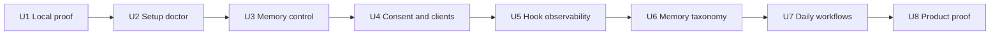

# Hypermnesic - First-Class Product Experience

## Summary

Make Hypermnesic first-class as a product, not only as a memory engine: a new user can prove
local value before network setup, connect agents with guided diagnostics, inspect and control
memory, understand consent and scope, observe plugin recall, and learn what belongs in this
long-term/project memory layer. The result should make the git-native architecture feel obvious,
trustworthy, and useful from the first session through daily use.

---

## Problem Frame

Hypermnesic already has the hard kernel of a serious LLM memory layer. It stores memory as
markdown in a git repository, treats the index as disposable, converges before reads, separates
read tools from a gated write tool, exposes typed MCP outputs, uses OAuth consent for write, and
commits through a guarded git-first path. Those are strong product foundations.

The experience wrapped around that kernel is not yet first-class. The README quick start asks a
new user to install, index, configure a public OAuth endpoint, provide a public URL and resource
URL, and understand remote client wiring before proving that memory recall works. The setup path
validates important infrastructure, but users do not have a single doctor/status surface that
explains the system state after setup. Consent exists and is security-aware, but it is a basic
form rather than a trust-building flow. Memory is controllable through files, git, OAuth, and
audit logs, but there is no product-level memory manager that answers "what is remembered, who
can use it, what changed, how do I remove it, and how do I prove it is gone?"

The deeper product risk is category confusion. Adjacent memory frameworks and products teach
memory as scoped and typed: short-term versus long-term, semantic versus episodic versus
procedural, user versus agent versus organization, hot-path versus background writes. Hypermnesic
has a crisp identity - durable long-term/project memory backed by owned files - but the product
does not yet teach that identity at the point where users and agents decide what to store. The
operator's own memory-stack lesson reinforces this: Hypermnesic should not absorb behavioural
and short-term preference memory that belongs in Honcho or another layer.

This brainstorm defines the product requirements that must be met before Hypermnesic can be
called first-class. It deliberately does not replace existing requirements for first-class docs,
unified OAuth setup, or the Obsidian companion UI. It sits above them and fills the missing
product layer: value proof, control, trust, diagnostics, agent guidance, daily workflows, and
evidence.

---

## Product Thesis

Hypermnesic should win by being the memory layer for people who already believe their durable
knowledge should live in files they own, not in a vendor memory database. It should feel like:

- Obsidian/plain-git ownership for humans.
- MCP recall and write for agents.
- Git history as memory provenance.
- Explicit consent and visible control for trust.
- Local proof first, remote client setup second.

It should not try to become:

- A hosted turnkey memory API.
- A full agent runtime.
- A generic chat-history warehouse.
- A behavioural preference store.
- A UI-heavy note-taking app that competes with Obsidian.

---

## Actors

- A1. **New self-hosting user:** A developer or power note-taker who has a markdown/git vault and
  wants durable agent memory they own. They need fast local proof before committing to endpoint
  setup.
- A2. **Daily operator:** The owner who runs Hypermnesic across agents and devices, reviews writes,
  diagnoses degraded recall, and governs which clients can read or write.
- A3. **Remote client user:** The same human acting through ChatGPT, Claude, Claude Code, Codex,
  or Obsidian. They need the client connection to feel predictable and understandable.
- A4. **Agent client:** An LLM agent or connector that searches, builds context, thinks, resolves
  entities, discovers writable folders, and may write through `commit_note`.
- A5. **Memory auditor:** The owner or future contributor checking what was remembered, why, where
  it lives on disk, which client wrote it, and how to remove or revert it.
- A6. **Planner/implementer agent:** A future agent using this requirements document to plan and
  ship the first-class product layer without inventing product behavior.
- A7. **Adjacent memory layer:** Honcho or another short-term/behavioural layer that should coexist
  with Hypermnesic rather than be replaced by it.

---

## Sprint Unit Overview

The recommended sprint units are ordered by the confidence they build:

- U1. Local first-run value proof.
- U2. Setup, doctor, and status.
- U3. Memory control center.
- U4. Consent, clients, and trust.
- U5. Plugin and hook observability.
- U6. Memory taxonomy and agent guidance.
- U7. Daily human workflows.
- U8. Product proof, examples, and launch readiness.

Each unit should ship as a coherent user-facing increment. If only U1 ships, a user can prove
Hypermnesic is valuable locally. If U1-U2 ship, setup stops being an OAuth/Tailscale debugging
exercise. If U1-U4 ship, users can control memory and trust clients. If U1-U8 ship, Hypermnesic
is first-class.

---

## Key Flows

- F1. **Local proof before endpoint setup**
  - **Trigger:** A new user wants to know whether Hypermnesic is worth setting up.
  - **Actors:** A1.
  - **Steps:** The user runs a local-first path, points at or creates a small markdown/git vault,
    captures or indexes a sample memory, asks a question, sees a result, opens the markdown file,
    and sees the git-backed provenance.
  - **Outcome:** The user understands the product value before configuring public reach.
  - **Covered by:** R1-R8.

- F2. **Guided endpoint setup and diagnosis**
  - **Trigger:** The user decides to connect remote clients.
  - **Actors:** A1, A2.
  - **Steps:** Setup chooses safe defaults, validates prerequisites, configures the endpoint, runs
    diagnostics, and prints client-specific next steps. A later doctor/status command explains
    the same checks without mutating state.
  - **Outcome:** The user knows whether local index, service, funnel, OAuth discovery, auth, and
    client connection are healthy.
  - **Covered by:** R9-R21.

- F3. **Connect and authorize a client**
  - **Trigger:** The user adds Hypermnesic to ChatGPT, Claude, Claude Code, Codex, or Obsidian.
  - **Actors:** A2, A3, A4.
  - **Steps:** The client discovers OAuth, the consent flow explains requested access, the user
    approves read or write intentionally, and the client appears in a client/control view.
  - **Outcome:** The user understands what the client can do and how to revoke it.
  - **Covered by:** R37-R48.

- F4. **Inspect and control memory**
  - **Trigger:** The user wants to know or change what Hypermnesic remembers.
  - **Actors:** A2, A5.
  - **Steps:** The user lists or searches memory, inspects source file and commit provenance,
    reviews recent writes, exports content, deletes/forgets or reverts a memory, and verifies
    recall behavior afterward.
  - **Outcome:** Memory is governable through first-class product verbs, not only through manual
    git/file operations.
  - **Covered by:** R22-R36.

- F5. **Agent recall with observable hook behavior**
  - **Trigger:** A coding or chat agent prompt appears memory-relevant.
  - **Actors:** A2, A4.
  - **Steps:** The hook decides whether to recall, runs a bounded search when configured, injects
    results when relevant, and records status that the owner can inspect.
  - **Outcome:** Proactive recall is useful without becoming invisible magic.
  - **Covered by:** R49-R56.

- F6. **Decide whether something belongs in Hypermnesic**
  - **Trigger:** A human or agent is about to write memory.
  - **Actors:** A2, A4, A7.
  - **Steps:** The product and skill guidance classify the candidate memory by durability, type,
    scope, source evidence, sensitivity, and target memory layer. The write proceeds only when it
    belongs in Hypermnesic.
  - **Outcome:** Hypermnesic compounds durable knowledge without swallowing behavioural/session
    memory that belongs elsewhere.
  - **Covered by:** R57-R66.

- F7. **Daily capture, triage, recall, and review**
  - **Trigger:** The daily operator is working across projects.
  - **Actors:** A2, A3, A4.
  - **Steps:** The user captures raw material quickly, triages later, recalls during work, expands
    around hits, writes durable notes, reviews recent changes, and cleans up or exports when
    needed.
  - **Outcome:** Hypermnesic feels like an everyday memory workflow, not a set of isolated tools.
  - **Covered by:** R67-R75.

---

## Requirements

**U1 - Local first-run value proof**

- R1. Hypermnesic provides a local-first first-run path that proves memory value without requiring
  Tailscale, public HTTPS, OAuth, MCP client setup, or remote plugin installation.
- R2. The first-run path supports both "use my existing markdown/git vault" and "create a tiny
  demo vault" so a curious user can try the product without risking their real notes.
- R3. The first-run path creates or identifies one durable memory, retrieves it from a natural
  question, and shows the repo-relative path of the source file.
- R4. The first-run path makes the files-as-truth model visible: the user can see that the memory
  is a markdown file and that the index is only a projection.
- R5. The first-run path includes one safe write demonstration that shows preview/commit behavior
  and makes clear what is dry-run versus what changes the vault.
- R6. The first-run path explains dense retrieval degradation in product language: lexical recall
  still works without embeddings, while dense recall improves quality when configured.
- R7. The first-run path ends with a clear milestone: "local memory works" and a next step to
  connect remote clients.
- R8. The README and getting-started guide are reorganized so the first practical path is local
  proof, with endpoint setup as the second milestone.

**U2 - Setup, doctor, and status**

- R9. `hypermnesic setup` minimizes required arguments by deriving safe defaults when a value is
  normally identical or can be inferred, while still allowing explicit override.
- R10. The setup output is milestone-based: local index, service, funnel, OAuth discovery,
  unauthenticated 401, consent secret, and next client action are each reported as pass/fail or
  skipped with reason.
- R11. A non-mutating doctor/status surface checks the same system after setup without changing
  services, funnel routes, secrets, or client configuration.
- R12. Doctor/status separates local health from remote reach: vault git status, index existence,
  index freshness, dense availability, service status, funnel status, OAuth metadata, unauth 401,
  read tool reach, write tool availability, and current degradation state.
- R13. Doctor/status reports the exact user-action category for failures: install missing,
  authenticate Tailscale, configure key, initialize index, start service, repair funnel, reconnect
  client, request write scope, or re-run setup.
- R14. Setup and doctor/status never print secrets, token values, raw private file bodies, or
  sensitive environment values.
- R15. Setup and doctor/status are useful in JSON mode so agent and CI checks can consume them.
- R16. Setup and doctor/status include copyable client-specific next steps for ChatGPT, Claude,
  Claude Code, Codex, Obsidian, and local CLI, without hardcoding operator-specific hostnames in
  distributable files.
- R17. Setup explicitly distinguishes local CLI usage from remote MCP usage so engine-host users
  do not route local work through OAuth unnecessarily.
- R18. Setup gives an honest state when it cannot proceed because Tailscale is not installed or
  logged in; it does not attempt to manage Tailscale's lifecycle.
- R19. Setup and doctor/status include a "what this means" summary written for a product user,
  not only low-level command output.
- R20. Getting-started docs include a troubleshooting table that maps doctor/status failure states
  to corrective actions.
- R21. The setup path preserves existing security invariants: write-enabled remote serving still
  requires auth unless an explicitly bounded tailnet-write opt-in applies.

**U3 - Memory control center**

- R22. Hypermnesic provides a memory management surface that lets the owner list remembered files
  and recently changed memory items without manually reading git logs.
- R23. The memory management surface lets the owner search and inspect an item, including
  repo-relative path, heading/title, snippet, last commit, write actor when available, and whether
  the item is generated, captured raw source, or authored content when that can be known.
- R24. The memory management surface explains provenance in terms of files and commits, not opaque
  database rows.
- R25. The owner can export memory or a selected subset using product-level commands that preserve
  markdown files and relevant provenance metadata.
- R26. The owner can delete/forget a memory through a git-backed, auditable flow that makes clear
  what file or content is being removed.
- R27. The delete/forget flow has a preview step before destructive change and a verification step
  after change.
- R28. The delete/forget flow explains the difference between removing the source file/content,
  removing generated/index state, and removing past mentions that still exist in git history or
  old chat contexts.
- R29. The owner can revert a recent memory write through a guided product-level flow when git can
  safely express the revert.
- R30. The owner can view recent writes and refusals in a human-readable audit view that excludes
  raw bodies and secrets.
- R31. The owner can filter memory management views by folder, writable/protected state, capture
  status, generated status, and recent activity.
- R32. The memory management surface exposes writable folders and protected paths in the same
  terms as `list_folders` and `commit_note`, so advertised writability matches actual writability.
- R33. The owner can ask "what would this agent be allowed to write?" and receive a scope and
  write-surface answer.
- R34. The memory management surface states when dense retrieval is degraded and whether a manual
  reindex is recommended.
- R35. The memory management surface supports machine-readable output for agents while preserving
  a readable human default.
- R36. Docs teach memory control as a first-class product capability, not as "use git manually if
  needed."

**U4 - Consent, clients, and trust**

- R37. The OAuth consent page explains read and write scopes in plain language before approval.
- R38. The consent page offers explicit choices for approve read, approve write when requested,
  and reject/cancel.
- R39. The consent page shows the requesting client name, redirect origin, requested scopes, and a
  short warning when the redirect or client identity is unfamiliar or generic.
- R40. The consent flow tells the user how to revoke access later before or immediately after
  approval.
- R41. After approval, the user receives a confirmation state that says what was granted and what
  the client can now do.
- R42. A client management surface lists currently known clients/grants when the underlying auth
  state can support it.
- R43. The owner can revoke a client/grant through a product-level action.
- R44. The owner can distinguish clients that have read-only access from clients that have write
  access.
- R45. A client lacking write scope receives a refusal that is understandable to the owner and the
  agent, not only a raw `insufficient_scope` string.
- R46. Consent and client docs explain that approving write does not bypass protected-path,
  frontmatter, dirty-tree, head-drift, audit, or git coordination guards.
- R47. The trust surface never displays the operator approval token after creation and never
  encourages copying token values into chat.
- R48. Consent page visual design is intentionally plain, accessible, and confidence-building:
  readable hierarchy, visible scope consequences, keyboard support, no script dependency, and no
  decorative distraction.

**U5 - Plugin and hook observability**

- R49. The plugin/hook has an owner-observable status surface covering configured endpoint,
  auth/token availability category, last recall time, last outcome, and current disabled/enabled
  state.
- R50. Hook status distinguishes off-topic prompt, unconfigured endpoint, missing credential,
  timeout, 401/expired auth, no hits, degraded lexical-only recall, and successful recall.
- R51. The hook remains silent and non-blocking during normal agent use, but its decisions are
  inspectable when the owner asks.
- R52. The owner can disable proactive recall per host or per plugin installation without
  uninstalling the whole plugin.
- R53. The owner can run a test recall from the plugin/hook status surface and see bounded,
  non-secret output.
- R54. Plugin docs explain the difference between MCP tool wiring, auto-recall hook wiring, local
  CLI use, and remote OAuth use.
- R55. Plugin status and docs avoid claiming a static token is required for the MCP tool path when
  OAuth discovery is the intended path.
- R56. Hook observability is designed so failures do not pollute prompts, but support/debugging
  does not require reading hook source code.

**U6 - Memory taxonomy and agent guidance**

- R57. Hypermnesic documents a memory taxonomy that distinguishes duration, type, scope, update
  strategy, and retrieval mode in product language.
- R58. The taxonomy explicitly positions Hypermnesic as durable long-term/project memory, not the
  default place for short-term session state or behavioural preferences.
- R59. The taxonomy explains semantic memories, episodic/source memories, procedural/policy
  memories, generated summaries, raw captures, and current-state mirrors with examples from a
  markdown/git vault.
- R60. The taxonomy teaches preserve-evidence-first behavior: raw source or episode records should
  not be overwritten by consolidated summaries without retaining evidence.
- R61. The bundled agent skill tells agents when to search, when to build context, when to think,
  when to resolve, when to list folders, and when to write.
- R62. The bundled agent skill tells agents what not to write to Hypermnesic, including ephemeral
  session facts, behavioural preferences better suited to Honcho, secrets, credentials, and
  unreviewed sensitive material.
- R63. Write guidance asks agents to discover writable locations before choosing a path when the
  correct folder is unclear.
- R64. Write guidance asks agents to preserve raw evidence or cite source paths when creating
  consolidated notes.
- R65. Write guidance treats refusals as useful control signals and tells agents not to retry
  protected paths by bypassing guards.
- R66. The README and getting-started docs include a short "what belongs in Hypermnesic" section
  before advanced write features.

**U7 - Daily human workflows**

- R67. Hypermnesic defines the daily capture -> triage -> recall -> write -> review -> clean-up
  loop as a product workflow.
- R68. Capture is positioned as a low-friction raw-source action with minimal organization burden
  at capture time.
- R69. Triage is positioned as a later review-gated action that suggests placement, connections,
  and questions without silently moving or rewriting the source.
- R70. Recall workflows teach the difference between direct search, context expansion, thinking
  mode, and entity resolution.
- R71. Review workflows show recent writes, generated surfaces, capture backlog, and suggested
  connections in a coherent owner-facing view or document set.
- R72. Clean-up workflows connect memory management actions to git-backed delete, revert, export,
  and audit behavior.
- R73. Obsidian companion docs align with the daily loop while preserving the companion's read-only
  boundary.
- R74. Daily workflows include degraded/offline behavior so users know which parts still work when
  embeddings or remote reach are unavailable.
- R75. Product docs include recipes for common jobs: "remember a project decision," "find prior
  context," "connect a new client," "revoke a client," "forget a bad memory," "recover from a
  stale index," and "capture now, triage later."

**U8 - Product proof, examples, and launch readiness**

- R76. Hypermnesic ships a product smoke path that proves capture, retrieve, write, inspect,
  delete/forget or revert, and recall-after-change on a small fixture vault.
- R77. Hypermnesic ships a remote-client smoke checklist that proves OAuth discovery, read access,
  write refusal without scope, write success with scope, and client revocation when supported.
- R78. Product proof distinguishes benchmark quality from product operability: LongMemEval proves
  retrieval quality; first-run and smoke flows prove user control and setup confidence.
- R79. Public docs surface both benchmark results and product proof flows without overstating what
  each proves.
- R80. The product has a concise "first-class readiness checklist" that future releases can run
  before claiming launch readiness.
- R81. The first-class product work updates `CHANGELOG.md` under `[Unreleased]` as user-visible
  behavior lands.
- R82. The docs index links to the review report, this requirements document, getting-started,
  memory control guide, memory taxonomy, and relevant reference docs.
- R83. No first-class product claim ships until automated checks, local smoke, and relevant docs
  updates pass.

---

## Acceptance Examples

- AE1. **Covers R1-R8.** Given a clean machine with Python/uv and a disposable git-backed
  markdown vault, when the user follows the local-first path, they can capture or index a memory,
  retrieve it with a natural question, open the source markdown path, and understand the next step
  to connect remote clients without having configured Tailscale or OAuth.
- AE2. **Covers R9-R21.** Given a partially configured endpoint, when the user runs doctor/status,
  the output clearly separates local index health, remote service/funnel health, OAuth discovery,
  auth state, write availability, and next corrective action without printing secrets.
- AE3. **Covers R22-R36.** Given a memory that was written by an agent, when the owner inspects it
  through the memory management surface, they can see where it lives, when it changed, who/what
  wrote it when available, export it, preview deletion, delete/forget it through a git-backed
  action, and verify the result.
- AE4. **Covers R37-R48.** Given a new client asks for write, when the consent page appears, the
  owner can tell what write permits, reject safely, approve intentionally, and later find the
  client in a revoke/control surface.
- AE5. **Covers R49-R56.** Given the auto-recall hook is installed but not injecting context, when
  the owner checks hook status, they can tell whether it was off-topic, unconfigured, missing
  credentials, timed out, unauthenticated, degraded, or simply found no hits.
- AE6. **Covers R57-R66.** Given an agent wants to store "the user likes terse replies," when it
  applies the taxonomy guidance, it treats that as behavioural preference memory and does not
  route it to Hypermnesic by default.
- AE7. **Covers R67-R75.** Given the daily operator captures raw text during work, when they return
  later, Hypermnesic offers a triage path that suggests placement and links without silently
  moving the raw source.
- AE8. **Covers R76-R83.** Given a release claims first-class product readiness, when reviewers run
  the product proof checklist, they see passing evidence for local value, remote connection,
  consent, write refusal/success, memory inspection, memory removal/revert, and docs coverage.

---

## Success Criteria

- A new target user can explain Hypermnesic's value after a local proof run without mentioning
  OAuth, Tailscale, or MCP.
- A user can connect a remote client and diagnose common failures without source-code inspection.
- A user can answer "what does Hypermnesic remember and how do I remove it?" from a first-class
  surface.
- A user can tell exactly which clients can write and how to revoke them.
- An agent can use the bundled skill without routing short-term behavioural/preferences memory
  into Hypermnesic by default.
- The daily loop feels coherent: capture, triage, recall, write, review, clean up.
- A future planner can turn each sprint unit into implementation work without inventing product
  behavior, scope boundaries, or success criteria.

---

## Scope Boundaries

### Deferred for later

- Hosted/cloud Hypermnesic. This effort assumes self-hosted ownership remains the product
  identity.
- Multi-user/team RBAC beyond read/write client grants and owner controls.
- A full graphical web app. CLI/docs plus Obsidian/local status surfaces are enough for the
  first-class bar unless planning discovers a small status UI is cheaper.
- Automatic LLM consolidation of all raw memories. Evidence preservation and explicit
  consolidation guidance come first.
- Enterprise compliance programs, legal review workflows, and organization-wide audit dashboards.

### Outside this product's identity

- Replacing Honcho or behavioural memory. Hypermnesic should coexist with behavioural/session
  memory layers, not absorb their jobs.
- Becoming a note-taking app that competes with Obsidian. Hypermnesic can enrich Obsidian, but
  the owned markdown vault remains the common substrate.
- Becoming an agent runtime like Letta. Hypermnesic is a shared memory layer, not an orchestration
  framework.
- Becoming a hosted memory API like Mem0/Zep Cloud. Hypermnesic may learn from their UX, but its
  wedge is owned files and git history.
- Hiding memory provenance behind opaque summaries. The product should preserve and expose
  evidence.

---

## Key Decisions

- **Local proof before network setup:** The first user milestone is memory recall over owned
  files, not a working public endpoint.
- **Controls are product, not implementation escape hatches:** Git/files remain the substrate, but
  users need memory management verbs.
- **Consent is a trust surface:** The OAuth page must explain consequences, support rejection,
  and point to revocation.
- **Doctor/status owns operational confidence:** Users should not manually infer setup state from
  scattered commands and docs.
- **Hypermnesic owns durable/project memory:** Short-term, behavioural, and preference memory
  should be explicitly routed elsewhere unless deliberately promoted.
- **Evidence preservation is part of quality:** Raw captures and source episodes are first-class
  material, not temporary scaffolding to be overwritten by summaries.
- **Sprint units are product increments:** Each sprint must leave a user-visible improvement, not
  only internal refactoring.

---

## Dependencies / Assumptions

- `docs/brainstorms/2026-06-03-first-class-documentation-requirements.md` remains the source for
  public documentation readiness and should be cross-linked rather than duplicated.
- `docs/brainstorms/2026-06-03-unified-oauth-endpoint-and-setup-requirements.md` remains the
  source for endpoint consolidation and setup architecture.
- `docs/brainstorms/2026-06-02-obsidian-companion-first-class-ui-requirements.md` remains the
  source for companion UI polish and read-only interaction.
- The current files-as-truth invariant remains non-negotiable.
- Honcho remains the preferred behavioural/session/preference memory layer in the operator's
  stack.
- Product proof flows should use placeholder hosts and disposable fixture vaults, never real
  operator hostnames, tokens, or private file bodies.
- Planning may decide whether specific surfaces are CLI-only, Obsidian, local web/status, or
  generated markdown, but it must preserve the product behaviors defined here.

---

## Outstanding Questions

### Resolve Before Planning

- None. The product direction is intentionally explicit enough to plan.

### Deferred to Planning

- [Affects R22-R36][Technical] Which memory-control actions are safest as direct commands versus
  guided proposal/review flows?
- [Affects R42-R44][Technical] What persistent auth/grant metadata is available or should be
  added so client management is truthful after service restarts?
- [Affects R49-R56][Technical] Where should hook status live so it is inspectable across Claude
  Code, Codex, and local hosts without leaking prompts or secrets?
- [Affects R76-R83][Needs research] Which subset of product proof can be automated in CI versus
  kept as a documented manual smoke checklist?
