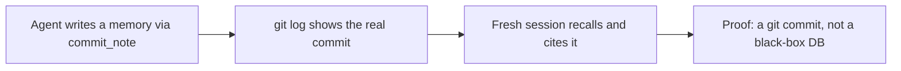

# Launch Demo Assets — Requirements

## Summary

A receipts-first set of promotion assets for the two already-public repos. The engine
set leads with a short, silent, scripted terminal GIF that proves the git-native claim
no competitor can show — an agent writes a memory, `git log` shows the real commit, a
fresh session recalls it. The companion set targets the Obsidian audience, where the
receipt is an agent-written note appearing live in a vault the user controls. A benchmark
chart and per-community carousels support both. The cinematic narrated video is a
deliberate follow-on, not part of this set.

## Problem Frame

Both repos (`hypermnesic` engine and `hypermnesic-companion`) are public but unpromoted.
The "AI memory" / MCP space they launch into is crowded and skeptical — mem0, Letta, Zep,
basic-memory, Supermemory and others all assert "persistent memory for your agents," and
recent AI-flavored Show HN posts underperform precisely because the audience has learned
to distrust the claim. The first comment on a memory-tool launch is some version of "is
this just a vector DB with a wrapper, or is the data actually mine?"

hypermnesic has a single answer to that question that none of the competitors can show:
the memory is plain markdown in a git repo, so its history is a real `git log`. That one
artifact — not a UI, not a benchmark, not prose — is the differentiator. The campaign
fails if it buries that proof behind an architecture diagram, a chatbot "I remember you"
demo, or a long narrated video. It succeeds if a skeptic scrolling the README sees the
commit before they finish reading the tagline.

## Key Decisions

- **Receipts-first, not comprehensive.** Put the craft on the single git-native proof
  and ship it; coverage of every surface and client is explicitly not the goal. What
  converts on GitHub/HN/Reddit is one scroll-stopping proof, not a tour.
- **GIF hero over video hero.** GitHub READMEs only autoplay GIFs (MP4 needs a click);
  the hero is a ≤20s silent loop. The narrated cinematic video is deferred to a second
  wave.
- **Open on the receipt, not the architecture.** Box-and-arrow architecture diagrams are
  a flagged cliché in this space and read as a product pitch. The `git log` leads; any
  architecture explainer is secondary and comes after attention is earned.
- **Claude Code is the only hero client.** It maximizes audience recognition. Hermes is
  out (unknown to the launch audience, muddies "works with tools you already use"); live
  ChatGPT/Claude hosted-client recordings are out (fragile to capture, high leak risk).
- **Promote the benchmark, honestly.** The measured 88.6% on LongMemEval is the strongest
  trust signal for the skeptical reader; it is presented with its judge axis labeled so it
  survives "measured against which judge?" scrutiny.
- **Two distinct heroes, one per repo.** The engine receipt is `git log`; the companion
  receipt is a live note appearing in an Obsidian vault. Different audiences, different
  proofs — not one asset reused.
- **Scripted and reusable.** Terminal recordings are driven by committed VHS `.tape`
  files so every asset is deterministic, re-recordable as the product evolves, and
  auditable.
- **Two tailored fixture vaults.** A small dev-flavored vault for the engine (the
  git/commit proof barely needs content) and a richer PKM-flavored vault for the companion
  (the Obsidian graph and note bodies are the whole proof) — different proofs, different
  content.

## Target Surfaces & Primary Asset

| Surface | Primary asset | The receipt it shows |
|---|---|---|
| GitHub README (engine) | Hero "receipt loop" GIF | `git log` on a memory note |
| Show HN (engine) | The README hero (no separate asset) | same — HN reads what the README shows |
| r/programming, r/LocalLLaMA, r/selfhosted | Tailored 3–5 still carousel | local files / two clients on one endpoint |
| Obsidian community marketplace (companion) | README screenshots + companion demo GIF | agent-written note in a controlled vault |
| r/ObsidianMD (companion) | Vault + graph-view still | the note + its graph edge appearing live |

## Requirements

**Engine assets (GitHub / HN / dev-Reddit)**

- R1. A hero "receipt loop" GIF is the engine's primary asset: an agent writes a memory
  via `commit_note`, `git log --oneline` shows the resulting real commit, then a fresh
  session recalls the fact and cites it. Silent, looping, ≤20s.
- R2. The hero GIF leads the engine `README.md` above the fold and is the linked artifact
  for the Show HN post — no separate HN asset is produced.
- R3. A static benchmark chart presents the LongMemEval result (88.6% overall) with the
  reader model and judge model labeled in-frame.
- R4. A "destructive recovery" GIF proves files-are-truth: the index is deleted, the
  source markdown survives, the index rebuilds from `HEAD`.
- R5. A multi-client asset shows Claude Code calling the live MCP read/write tools, plus a
  short "same endpoint, other clients" montage built from plugin/connector config using a
  placeholder URL — with no live hosted-client recording.
- R6. Per-community image carousels tailor the proof to each sub: r/selfhosted (local
  vault files, `ls -la`, no cloud), r/LocalLLaMA (two clients sharing one endpoint),
  r/programming + HN (the receipt loop). Each carousel is 3–5 stills.

**Companion assets (Obsidian marketplace / r/ObsidianMD)**

- R7. The companion hero asset shows an agent-written note appearing live in an Obsidian
  vault the user controls, with the graph view updating to add the new note.
- R8. The companion assets prove read-only safety visibly: the companion reads
  (`search` / `build_context` / `think`) but a write attempt is refused by the guard
  on screen — not merely asserted in a caption.
- R9. The companion ships marketplace-conforming assets (README screenshots plus a demo
  GIF) for its primary distribution channel, the Obsidian community directory.

**Production, safety & reuse (both sets)**

- R10. Every terminal recording is driven by a VHS `.tape` file committed to its repo, so
  any asset is reproducible and re-recordable by someone other than the author.
- R11. Every asset runs against a disposable, committed demo fixture vault tailored to its
  set — a small dev-flavored vault for the engine, a richer PKM-flavored vault for the
  companion — with no real brain content, no real endpoint, and no secrets, using
  placeholders only (e.g., `<your-host>.ts.net`, redacted tokens, `/path/to/your/vault`).
- R12. Assets open on the proof; any architecture explainer is secondary and follows the
  receipt rather than leading.
- R13. Every asset passes a pre-publish leak scan (no real endpoint URL, no local absolute
  home paths, no OAuth secrets or tokens, no account details, no private note bodies)
  before it ships.

### The engine hero loop

## Acceptance Examples

- AE1. **Covers R1, R12.** In the hero GIF's first ~5 seconds, a write produces a visible
  commit. If the opening frames are an architecture diagram or a chatbot saying "I
  remember," it fails.
- AE2. **Covers R11, R13.** A reviewer scrubbing any frame of any asset finds only
  placeholders — no real endpoint, token, absolute home path, or private note body.
- AE3. **Covers R3.** The benchmark chart names the reader model and judge model in-frame;
  a reader cannot mistake it for a GPT-4.1-judged leaderboard number.
- AE4. **Covers R4.** The destructive-recovery GIF shows the index actually removed (e.g.,
  `ls` before/after) with the markdown files still present, then a successful rebuild.
- AE5. **Covers R8.** The companion asset shows a write attempt being refused on screen,
  not a caption claiming read-only over a passive UI.

## Success Criteria

- The skeptic's "is this hardcoded / just a vector DB?" question is pre-answered on screen
  by a real git artifact, so it cannot be the top HN/Reddit comment.
- The README hero GIF is ≤20s, ~15fps, under 5 MB, loops cleanly, and stays legible at
  mobile width.
- Each asset proves exactly one claim; no asset tries to show everything.
- Any asset can be regenerated from its committed `.tape` file by someone who is not the
  original author.
- Zero secret / host / PII leakage across the full set, verified before publish.

## Scope Boundaries

**Deferred for later**

- The ~100s narrated cinematic video (HyperFrames composition) — a second wave once the
  receipts set is live.
- A live ChatGPT/Claude hosted-client OAuth + tool-call recording — revisit once the flow
  is clean and redaction is proven safe.
- A fuller companion asset set beyond marketplace minimums — as the companion's own
  community presence grows.

**Outside this set's identity**

- Hermes as a public-facing client — an internal tool the launch audience does not know.
- Autonomous / agent-driven "wander and capture" demos — precision is the whole point.
- Consumer-app-style UI mockups (memory-count badges, pastel "your memories" timelines) —
  they signal cloud-hosted data, the opposite of the positioning.

## Dependencies / Assumptions

- VHS (charmbracelet) for scripted terminal GIFs; asciinema + agg for any copy-along
  tutorial; HyperFrames for the later cinematic composition.
- A committed disposable demo fixture vault exists (content TBD) — every asset depends on
  it.
- The 88.6% LongMemEval result is reproducible from `harness/` and is presented on the
  gpt-4o judge axis only, consistent with `harness/BENCHMARKS.md`.
- Both repos are public now; no code release or license flip gates this work. The engine's
  AGPL flip is independent of asset production.
- The CLI and MCP surface is verified real against `src/hypermnesic/cli.py` and
  `src/hypermnesic/mcp_server.py` — every command in the original draft exists. Note: the
  `commit-note` CLI is a dry-run preview; real writes happen only via the MCP `commit_note`
  tool. `scripts/product_smoke.py` exists; `tests/test_product_remote_smoke.py` does not —
  remote verification uses the checklist at `docs/guides/remote-client-smoke-checklist.md`.

## Outstanding Questions

**Deferred to planning**

- Where generated assets and their `.tape` sources live in each repo (e.g., a `media/`
  directory, or under `docs/launch/`).
- Exact VHS theme and window chrome (e.g., Dracula / Tokyo Night, font size, padding) to
  match a world-class CLI aesthetic.
- Whether destructive-recovery (R4) is its own GIF or a tail segment of the hero loop (R1).
- Carousel frame counts and per-subreddit captions.

## Sources / Research

- **External.** VHS is the consensus tool for scripted README GIFs; GitHub autoplays GIFs
  but not MP4 (10 MB cap, target <5 MB). basic-memory's "show the `.md` file on disk" is
  the closest receipts analog in the space. The `git log` proof is the open visual angle
  no competitor (mem0, Letta, Zep, basic-memory, Supermemory) currently shows. Flagged
  clichés to avoid: "never forgets," chatbot "I remember you told me X," box-architecture
  diagrams, memory-count badges, consumer-app aesthetics. HN rewards show-don't-tell and a
  try-it-yourself repo over a slick landing page.
- **Internal.** CLI + MCP surface verified against `src/hypermnesic/cli.py` and
  `src/hypermnesic/mcp_server.py`; companion read-only is enforced by a static test in the
  companion repo; the deterministic local gate is `scripts/product_smoke.py`; benchmark
  detail and judge-axis caveat live in `harness/BENCHMARKS.md`.
