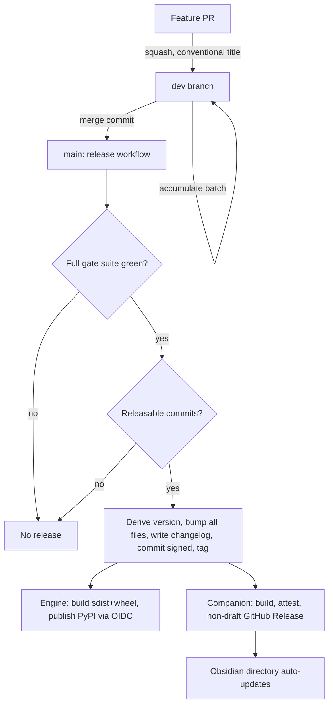

# Automated CD: release + publish on merge to main

## Summary

Give each repo (`hypermnesic` and `hypermnesic-companion`) a continuous-delivery
pipeline where merging the accumulated `dev` branch into `main` automatically derives
the next version from Conventional Commits, bumps every version-carrying file, updates
the changelog, tags, and publishes — engine to PyPI, companion to a GitHub Release the
Obsidian directory auto-picks-up — with no human approval step. The Conventional
Commits rules are written into and enforced from each repo's governance files.

## Problem Frame

Both repos are public and already have *tag-triggered* release workflows: pushing a
version tag builds and publishes (engine → PyPI via OIDC Trusted Publishing, live
today; companion → a draft GitHub Release). What is still manual is everything that
*produces* the tag — deciding the next number, editing every version-carrying file,
promoting the changelog `[Unreleased]` section, and creating the tag.

That manual step is both friction and a defect source. The engine must keep five
files plus `__init__` and CITATION in lockstep or `scripts/check_version_consistency.py`
fails the build. The companion has no equivalent gate, and it has already drifted:
`package.json` is `0.3.0` while `manifest.json` / `versions.json` / CHANGELOG are
`0.3.2`. Every release is a hand-assembled ritual across two different ecosystems with
two different tag conventions (engine `v0.1.0`; companion `0.3.2`, no `v`).

The goal is to remove the ritual entirely: a merge to `main` is the only action a
maintainer takes, and the pipeline does the rest.

## Key Decisions

- **Conventional Commits as the version authority.** A semantic-release-family tool
  derives the bump from commit messages (`feat` → minor, `fix` → patch, `!` /
  `BREAKING CHANGE` → major). This removes manual version selection and makes commit
  messages the single source of version intent. The consequence is that messages are
  load-bearing.

- **Fully automatic, no approval gate.** A merge to `main` flows straight through to a
  published PyPI version and GitHub Release with no human in the loop. This is a
  deliberate choice for velocity over the manual-approval `pypi` environment the earlier
  [pypi-publication-decision.md](docs/launch/pypi-publication-decision.md) recommended;
  that recommendation is superseded. The trade-off is that the CI gate suite becomes the
  *only* thing between a merge and an irreversible PyPI publish.

- **`dev → main` batched releases.** Feature work accumulates on `dev`; a `dev → main`
  merge cuts one release covering the whole batch. The merge is the batching dial, not a
  human approval gate — the publish still fires automatically once it lands. Several PRs
  ship as one version increment.

- **Enforce the convention, don't just document it.** Because the convention is
  load-bearing and there is no human gate to catch a malformed message, CI rejects
  non-conforming PR titles. Documentation alone is insufficient.

- **Auto-generated changelog.** The changelog is generated from Conventional Commits at
  release time, replacing manual `[Unreleased]` curation. Commit bodies must carry the
  detail that previously lived in curated entries so generated entries stay informative.

- **Two independent pipelines, not one shared one.** The engine (Python → PyPI) and the
  companion (Node/Obsidian → GitHub Release) have different build tools, tag formats, and
  changelogs, and version independently. They share a *design*, not a workflow.

- **Publishing moves into the release job.** A bot-created tag does not trigger a
  separate downstream workflow under GitHub's default token, so the release step must
  perform the publish itself (or carry an elevated credential). This reworks the existing
  release workflows rather than layering on top of them.

## Actors

- A1. Contributor (human or coding agent) — opens feature PRs into `dev`, authors
  Conventional Commits.
- A2. Release automation (CI) — on `dev → main`, computes the version, bumps all files,
  writes the changelog, tags, and publishes.
- A3. PyPI Trusted Publisher — receives the engine package via OIDC, no stored token.
- A4. GitHub Releases — hosts companion assets and build-provenance attestations.
- A5. Obsidian community directory — auto-updates from each new companion GitHub Release.

## Requirements

### Release trigger and versioning

- R1. The release workflow runs on push to `main` in each repo and produces a release
  only when commit analysis since the last release yields a bump.
- R2. The next version is derived automatically from Conventional Commits since the last
  release: `feat` → minor, `fix` → patch, `!` / `BREAKING CHANGE` → major.
- R3. When no releasable commits exist since the last release, no version, tag, release,
  or publish is produced.
- R4. Each repo versions independently; there is no version lock-step between engine and
  companion.

### Branch and merge model

- R5. Both repos adopt a `main` + `dev` topology; `dev` is the default base for feature
  PRs and `main` receives only `dev → main` promotions.
- R6. Feature PRs squash-merge into `dev` as one Conventional Commit each; `dev → main`
  uses a merge commit that preserves the underlying commits for bump computation.
- R7. A single `dev → main` promotion batches all accumulated commits into one release.

### Convention, enforcement, and governance

- R8. Conventional Commits is documented in each repo's governance files: the type → bump
  mapping, allowed types and scopes, the `!` / `BREAKING CHANGE` rule, that PR titles into
  `dev` are the release-driving message, and that `dev → main` is a merge commit.
- R9. The convention is enforced in CI: a required check validates each PR title (into
  `dev`) against Conventional Commits, and squash-merge is required for feature → `dev`.
- R10. The companion gains a governance file (it currently has none) carrying these
  conventions; the engine's existing soft references in
  [CONTRIBUTING.md](CONTRIBUTING.md) and [AGENTS.md](AGENTS.md) are formalized into the
  full mapping.
- R11. Existing governance rules that assume manual versioning and changelog curation —
  the engine [AGENTS.md](AGENTS.md) version-bump row and the `[Unreleased]` anti-drift
  rule — are reconciled with the automated flow in the same change.

### Version-file integrity

- R12. The automated bump updates every version-carrying file atomically so the
  version-consistency gate stays green — engine: `pyproject.toml`,
  `src/hypermnesic/__init__.py`, the three plugin manifests, `plugin/hermes/plugin.yaml`,
  and CITATION; companion: `manifest.json`, `versions.json`, `package.json`.
- R13. The companion gains an engine-style version-consistency gate, run in CI; the
  `0.3.0`-vs-`0.3.2` drift is the proof it is missing.
- R14. The companion's `versions.json` `version → minAppVersion` mapping is maintained by
  the automated bump, preserving today's `version-bump.mjs` behavior.

### Safety and gates

- R15. The release/publish job runs only after the full gate suite passes — engine: ruff,
  version-consistency, pytest, `license_scan`, `preflight_public_scan`; companion:
  typecheck, test, lint, build. With no human gate and no branch protection today, this
  ordering is the only safety net.
- R16. No human approval step gates any publish.
- R17. The bot's version-bump commit on `main` carries a DCO sign-off (engine
  requirement) and does not re-trigger the release loop.

### Engine publish (PyPI)

- R18. On release, the engine builds sdist + wheel and publishes to PyPI via OIDC Trusted
  Publishing with no stored token and no manual `pypi` approval environment.
- R19. The release mechanism must actually reach PyPI despite GitHub suppressing
  workflow-triggering for bot-created tags — by performing the publish within the release
  job or using an elevated credential (mechanism chosen in planning).

### Companion publish (Obsidian)

- R20. On release, the companion builds, attests build provenance, and creates a
  *non-draft* GitHub Release carrying `main.js` / `manifest.json` / `styles.css` under a
  tag with no `v` prefix equal to the manifest version (Obsidian's install requirement);
  the Obsidian directory auto-updates from it.
- R21. Release notes are generated for each release from the changelog/commits, preserving
  today's attestation-verification note.

### Changelog

- R22. The changelog in each repo is generated automatically from Conventional Commits at
  release time, superseding manual `[Unreleased]` curation; commit bodies carry the detail
  that used to live in curated entries.

## Key Flows

- F1. Engine release on `dev → main`
  - **Trigger:** a `dev → main` merge lands on `main`.
  - **Actors:** A2, A3
  - **Steps:** Full gate suite runs; commit analysis derives the bump; all version files
    + changelog are updated and committed back (signed off); a `v*.*.*` tag is created;
    sdist + wheel build; publish to PyPI via OIDC.
  - **Outcome:** A new `uv tool install hypermnesic` version, a GitHub Release, zero human
    steps.
  - **Covered by:** R1, R2, R12, R15, R17, R18, R19, R22
- F2. Companion release on `dev → main`
  - **Trigger:** a `dev → main` merge lands on `main`.
  - **Actors:** A2, A4, A5
  - **Steps:** Full gate suite runs; bump derived; `manifest.json` / `versions.json` /
    `package.json` updated and committed; a no-`v` tag equal to the manifest version is
    created; build + provenance attestation; a non-draft GitHub Release is published.
  - **Outcome:** Obsidian users receive the update via directory auto-refresh, zero human
    steps.
  - **Covered by:** R1, R2, R12, R13, R14, R20, R21, R22
- F3. No-op promotion
  - **Trigger:** a `dev → main` merge whose commits are all non-releasable (`chore`,
    `docs`, `ci`, `test`, `style`, `refactor`).
  - **Actors:** A2
  - **Steps:** Commit analysis finds no bump; the pipeline exits without tagging,
    releasing, or publishing.
  - **Outcome:** `main` advances; no version is burned.
  - **Covered by:** R3

## Acceptance Examples

- AE1. **Covers R3.** Given a `dev → main` merge whose commits are only `chore:` /
  `docs:`, when the release workflow runs, then no version, tag, release, or publish is
  produced and `main` simply advances.
- AE2. **Covers R2, R7, R12, R18.** Given a batch on `dev` containing one `feat:` and two
  `fix:`, when promoted to `main`, then exactly one minor release is cut, every
  version-carrying file is updated together, and the new version is published.
- AE3. **Covers R2.** Given a commit with `feat!:` or a `BREAKING CHANGE:` footer, when
  released, then the version takes a major bump.
- AE4. **Covers R12, R13, R15.** Given a bump that leaves any version-carrying file
  un-synced, when the consistency gate runs, then it fails and no publish occurs.
- AE5. **Covers R9.** Given a PR into `dev` whose title is not a valid Conventional
  Commit, when CI runs, then the required check fails and the PR cannot merge.
- AE6. **Covers R20.** Given a companion release for manifest version `0.4.0`, when the
  GitHub Release is created, then its tag is `0.4.0` (no `v` prefix) and equals the
  manifest version.

## Success Criteria

- A maintainer merging a `feat` from `dev → main` results, within one CI run and with
  zero further actions, in an installable new PyPI version (engine) or an Obsidian-visible
  GitHub Release (companion).
- The version-consistency gate is green on every release; the companion's `package.json`
  / `manifest.json` / `versions.json` never diverge again.
- Docs-only or chore-only promotions cut no release.
- The conventions are documented in both repos' governance files, and a malformed commit
  message is rejected by CI rather than silently mis-releasing.

## Scope Boundaries

### Deferred for later

- MCP Registry entry auto-update on engine release.
- The Obsidian community directory *first* submission (separate in-flight effort,
  LS-1795 / LS-1796); CD only produces the GitHub Release the directory consumes.

### Outside this change

- Any human approval gate or draft-then-promote step (explicitly rejected).
- Consolidating the two repos into a monorepo.
- License or public-flip changes (both repos are already public; the engine is already
  `AGPL-3.0-only`).
- Retroactively releasing past versions.
- Publishing the Claude Code / Codex plugin — it is git-distributed via the in-repo
  marketplace and only needs its version bumped, which R12 already covers.

## Dependencies / Assumptions

- The PyPI Trusted Publisher for `leonardsellem/hypermnesic` is configured and live —
  verified: the package resolves on PyPI (HTTP 200) and `v0.1.0` is published. The
  publish path works today; this change automates what feeds it.
- Release automation needs write access to `main` and the ability to publish. Neither
  repo has branch protection today, so writes are unblocked — but enforcing the
  convention (R9) means *adding* branch protection / rulesets where there are none.
- The engine's DCO sign-off requirement applies to the bot's release commits.
- Obsidian requires the release tag to equal the manifest version with no `v` prefix, so
  the tool's default `v${version}` tag format must be overridden for the companion.
- The two repos remain separate repositories with separate release tooling.

## Outstanding Questions

### Deferred to planning

- Exact tooling: semantic-release vs `release-please` vs a thin custom GitHub Action, and
  the multi-file version updater (a plugin, an `exec` bump script, or extending the
  existing consistency script to also *write*).
- The credential/mechanism that lets a bot-created tag reach PyPI: collapse engine
  build + publish into the release job, or use a GitHub App / PAT to trigger the existing
  publish workflow.
- Branch-protection / ruleset specifics for `dev` and `main` (required checks, required
  squash, linear history).
- Where the PR-title / commit lint configuration lives, and which tool enforces it.
- Pre-1.0 bump policy: whether `feat` continues to mean a minor bump while both projects
  are `0.x`, or maps to patch until `1.0`.

## Sources / Research

- Existing engine workflows: [.github/workflows/release.yml](.github/workflows/release.yml),
  [.github/workflows/ci.yml](.github/workflows/ci.yml).
- Existing companion workflows: `hypermnesic-companion/.github/workflows/release.yml`,
  `hypermnesic-companion/.github/workflows/ci.yml`, and its `version-bump.mjs`.
- Engine version authority + gate:
  [scripts/check_version_consistency.py](scripts/check_version_consistency.py).
- PyPI rationale (note its manual-gate recommendation is now superseded):
  [docs/launch/pypi-publication-decision.md](docs/launch/pypi-publication-decision.md).
- External: the Conventional Commits spec; semantic-release / release-please docs; the
  Obsidian plugin release + `versions.json` requirements (tag must equal manifest version,
  no `v` prefix).
