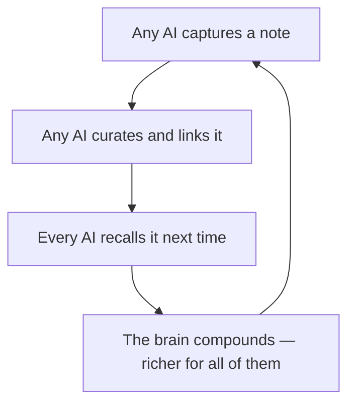

# README rewrite — "One brain, every AI" with a compounding USP

## Summary

Rewrite the README to lead with the scenario hypermnesic was built for — one
git-tracked brain that every AI you use shares and curates, so it **compounds** — proven
by the existing git-log receipt, illustrated by one new flywheel image, and differentiated
honestly from adjacent memory tools. Restructure the top of the file; preserve the accurate
quick-start, how-it-works, and benchmark depth below.

---

## Problem Frame

The current README is technically complete but story-poor. It opens with a category label
("The git-native memory layer for AI agents") and then marches through a feature tour —
Quick start A–F, How it works, Benchmarks. The vivid use case it was actually built for —
every AI on every device sharing one brain you own — is buried in a connector config list
in section C. A stranger scrolling the repo cannot tell, in the first screen, what this is
for or who it is for. That is the engagement gap.

The raw narrative already exists; it is just not on the front door. `docs/why-hypermnesic.md`
carries the wedge and the comparisons, and `docs/launch/launch-narrative-drafts.md` carries
the voice and the approved claims. The space is also crowded and skeptical — mem0, Letta,
Zep, basic-memory, Hindsight all assert "persistent memory for your agents," and one of them
(Hindsight) posts a higher LongMemEval number than hypermnesic does. Competing on the
benchmark is a losing frame; the durable, honest frame is ownership plus a compounding
flywheel no per-app memory silo can match.

---

## Key Decisions

- Scenario-led hero, compounding as the headline USP. The first screen leads with the
  lived use case, not the architecture; the architecture becomes the proof underneath.
- Story leads in words; the receipt leads the visuals. The existing git-log "receipt loop"
  GIF stays the first image (the proof the skeptical audience demands); one new evocative
  flywheel illustration sits below it. This upholds the June-15 "receipts-first, no
  architecture-diagram cliché" decision while adding engagement through copy and non-cliché art.
- Compete on ownership + compounding + reviewable writes, not on benchmark score. Hindsight
  scores higher on LongMemEval (on a more lenient judge axis); the README reports hypermnesic's
  number honestly and wins on "files you own that compound," never on the leaderboard.
- Honcho is complementary, not a competitor. It models *who the user is* (theory-of-mind,
  preferences, style); hypermnesic holds *what you know* in files. The README/why-doc says
  they compose.
- gbrain and Hermes are private and stay out of the public surface. gbrain becomes a brief
  first-person origin beat (a database-backed brain that drifted from its files); bespoke
  agents are referred to generically as "your own agents."
- Deep comparison lives in `docs/why-hypermnesic.md`; the README keeps a tight, linked
  version so it stays scannable.
- Keep the authentic, opinionated voice; sharpen the USP without tipping into hype-marketing.
- Restructure only the top; preserve the existing accurate reference content.

---

## The compounding flywheel (the USP)

The one idea a reader should leave with: per-app memory **fragments** (what ChatGPT knows
about you is invisible to Claude); a shared brain **compounds**, because every AI that touches
it curates it for every other AI.



This is grounded, not hype: it follows from one shared brain plus reviewable git-commit
writes, so curation by any surface is visible, revertible, and safe for every other surface.

---

## Requirements

**Narrative and hero**

- R1. The README opens with a scenario-led hero (e.g., "One brain. Every AI. Yours.") that
  lets a cold reader grasp the use case within the first screen, before any feature list or
  install command.
- R2. The hero subhead states the USP in one breath: every AI you use shares one git-tracked
  brain you own, and each one curates it, so it compounds.

**The compounding USP**

- R3. The README presents the compounding flywheel as the central, unequivocal USP —
  capture (any AI) → curate (any AI) → recall (every AI) → the brain compounds — and contrasts
  it with per-app silos that fragment.
- R4. The compounding claim is grounded in the mechanism (one shared brain plus reviewable
  git-commit writes), not asserted as a slogan.

**Multi-surface scenario**

- R5. The README dramatizes the multi-surface reality: the same brain reachable from every AI
  (ChatGPT, Claude, coding agents) across devices (laptop, phone) through one endpoint, with
  Obsidian as the human navigation client. Only recognizable surfaces are named; bespoke agents
  are "your own agents."
- R6. The existing "one endpoint, every client" connector montage is reused to support the
  multi-surface pillar; no new montage is produced.

**Differentiation**

- R7. The README differentiates on the ownership + compounding + reviewable-writes axis, not on
  benchmark score, and says plainly that other systems may post higher leaderboard numbers while
  hypermnesic optimizes for owned, auditable, compounding memory.
- R8. The README carries a tight, scannable comparison and links to an expanded
  `docs/why-hypermnesic.md` for the full tool-by-tool treatment.
- R9. `docs/why-hypermnesic.md` is expanded to cover Honcho (complementary — models who the
  user is; composes) and Hindsight (own vector store, Docker/cloud; higher LongMemEval on a
  different judge axis), alongside the existing mem0 / Letta / basic-memory / Obsidian entries.
- R10. gbrain appears only as a brief first-person origin beat (a database-backed brain that
  drifted from its files, rebuilt git-first), never as a public competitor row; Honcho is never
  framed as a competitor.

**Structure and preserved reference depth**

- R11. The rewrite restructures the top (hero → proof → flywheel → multi-surface →
  differentiation → quick start) while preserving the existing accurate reference content
  (quick start, How it works, Benchmarks, Docs, License), tightening prose the new top makes
  redundant.
- R12. The benchmark section keeps its honest judge-axis framing and link to
  `harness/BENCHMARKS.md`; no new or inflated benchmark claims are introduced.

**Voice and honesty**

- R13. The rewrite keeps the authentic, personal, opinionated voice while making the use case
  vivid and the USP unequivocal, and stays inside the approved claim set in
  `docs/launch/launch-narrative-drafts.md` (no hosted-SaaS, official-registry-listed, or
  companion-can-write claims).

**Visuals**

- R14. Story leads in words; the existing git-log "receipt loop" GIF
  (`media/engine/hero-receipt-loop.gif`) remains the first visual, under the hero copy.
- R15. One new conceptual illustration depicts the compounding flywheel, placed below the
  receipt — evocative editorial style with loose, hand-drawn flywheel arrows (not a mechanical
  circle), no literal-brain or neural-net cliché, not a box-and-arrow architecture diagram.
  Each named surface is shown via its real brand logo in its brand color (ChatGPT, Claude,
  Codex, Obsidian; "your agent" stays a generic spark). Purposeful, correctly-spelled text is
  embedded: the four stage labels (Capture / Curate / Recall / Compound) ring the loop, and
  placeholder-safe note filenames sit on the central cards.
- R16. The new image follows the `media/` placeholder and two-gate leak conventions (no real
  endpoint, host, token, or absolute home path) and is signed off in `media/.review-log.md`
  before it is embedded.

---

## Reader journey (the README outline)

- F1. The above-the-fold-first scroll path the rewrite must produce.
  - **Trigger:** a stranger lands on the repo from a link, search, or directory listing.
  - **Steps:** (1) hero headline + subhead — scenario + compounding USP; (2) the git-log
    receipt GIF — proof it is real git, not a black-box DB; (3) the flywheel illustration +
    one-line "each AI curates it, so it compounds"; (4) the multi-surface line + reused
    connector montage; (5) a tight, honest differentiation block linking
    `docs/why-hypermnesic.md`; (6) the condensed quick start (try it in two commands);
    (7) preserved How it works / Benchmarks / Docs / License.
  - **Outcome:** within the first screen the reader can say what hypermnesic is for and who
    it is for; by the quick start they can try it.
  - **Covers:** R1, R2, R3, R5, R7, R11, R14, R15

---

## Acceptance Examples

- AE1. **Covers R1, R2.** A reader who sees only the first screen can restate, in their own
  words, what hypermnesic is for and who it is for. If they cannot, the hero failed.
- AE2. **Covers R3.** The compounding idea is on the page as a flywheel the reader can restate
  (each AI curates → every AI benefits), not merely implied.
- AE3. **Covers R7, R12.** A skeptic who knows Hindsight scores higher does not catch the README
  hiding or contradicting that; the benchmark is framed honestly on its judge axis.
- AE4. **Covers R10.** gbrain and Hermes never appear as public competitor entries or in any
  visual; gbrain appears only as an origin beat.
- AE5. **Covers R14, R15.** The first visual under the hero is the git-log receipt; the flywheel
  image is evocative with hand-drawn (not mechanical) arrows, shows each named surface via its
  real brand logo in brand color, and any embedded text (stage labels, note filenames) is
  correctly spelled and legible.
- AE6. **Covers R16.** A reviewer scrubbing any frame of the new image finds only placeholders —
  no real endpoint, host, token, or home path — and a signed row in `media/.review-log.md`.

---

## Success Criteria

- A stranger grasps the use case and the USP within the first screen (5–10 seconds).
- The compounding flywheel is the single thing a reader remembers.
- Differentiation is accurate and honest: no benchmark arms race, Honcho framed as
  complementary, private tools kept out of the public surface.
- Reference depth is preserved with no accuracy regressions in quick-start / how-it-works /
  benchmarks.
- Every claim stays within the approved set; nothing on the claims-to-avoid list appears.
- The new image and copy pass the leak scan and frame-review gates.
- A downstream writer or planner can execute the rewrite from this doc without inventing the
  narrative, the USP, the comparison stance, or the visual placement.

---

## Scope Boundaries

**Deferred for later**

- The narrated cinematic video — already a second-wave item.
- A standalone landing or marketing site.
- A refreshed social-preview / OG card matching the new flywheel art (optional follow-on; a
  prompt sketch is included below).
- Additional per-community carousels beyond those that already exist.

**Outside this product's identity**

- Don't chase the benchmark leaderboard or make a score the headline claim.
- Don't name or illustrate private surfaces (Hermes) or the decommissioned gbrain as public
  competitors.
- No consumer-app aesthetics (memory-count badges, pastel "your memories" timelines), no
  "never forgets" clichés, no box-and-arrow architecture hero.
- No hosted-SaaS, managed-cloud, official-registry-listed, or companion-can-write claims.
- No product, CLI, or benchmark changes — this is positioning and docs only.

---

## Visual assets to produce

The user runs these in ChatGPT Image Generation 2 (GPT-Image). Labels are added as markdown
captions, not baked into the image.

### Primary — the compounding flywheel illustration (required, R15)

```text
Create a wide 16:9 editorial illustration for a software project's README banner.
Render all text crisply and correctly spelled, in a clean modern style.

Concept: a single shared "second brain" that many AI assistants read from and write to
in a continuous loop, so it compounds — growing richer every time any AI uses it.

CENTER — the brain as a knowledge graph, not an organ: a constellation of small
interconnected note-cards (rounded rectangles, like markdown notes) joined by thin clean
lines into a web. A few cards carry small, legible filenames to prove these are plain
files: "projects/atlas.md", "decisions/use-sqlite-vec.md", "people/dana.md",
"ideas/second-brain.md". Cards near the center are denser and brighter; cards toward the
edges are sparser and fainter — the web has been accreting over time. It must read as a
living vault of linked notes, NOT a literal human brain and NOT a blue neural network.

AROUND IT — the AIs on their devices: five surfaces, each on a simple device silhouette
(include laptops and a phone). On each device screen show that surface's REAL brand logo in
its brand color, with the name as a small caption beneath: ChatGPT (the OpenAI "blossom"
six-fold knot/flower mark), Claude (the Anthropic spark in coral-orange), Codex (a terminal
caret or small OpenAI mark), Obsidian (the purple crystal/gem), and "your agent" (a simple
four-point spark). Render each logo crisply and recognizably.

MOTION — the flywheel: draw the loop as four loose, hand-drawn sweeping arcs — one between
each stage label — confident marker strokes with slightly varied curvature and tapering
weight, energetic and sketched, NOT a perfect mechanical circle or oval. Keep one clear
clockwise direction so it reads as a flywheel gaining momentum, plus a thin subtle connector
from each device into the central web. Around the loop, set four stage labels in order,
following the curve, in small caps: "CAPTURE", "CURATE", "RECALL", "COMPOUND".

STYLE: premium hand-illustrated editorial look — confident flat line work, flat shapes,
subtle paper grain. Calm, warm, human; not corporate, not sci-fi. Generous negative space,
slightly asymmetric and organic — not a rigid symmetrical flowchart. Typography: a clean
humanist sans-serif for the labels, well-kerned and correctly spelled, in charcoal.

COLOR: warm cream / paper background (around #F7F1E6) and charcoal ink, with a warm
terracotta-amber accent (around #C8633A) on the flywheel arrows, the stage labels, and the
brightest central cards. The surface brand logos carry their own brand colors as small pops;
keep everything else restrained so paper, charcoal, and terracotta still dominate.

MOOD: "the memory is yours, and every AI you use makes it smarter."

AVOID: a literal anatomical brain; glowing-blue neural-network imagery; neon/sci-fi glow; a
boxy architecture-diagram aesthetic; perfectly geometric or mechanical arrows; stock-art
people; clutter.
```

Operator knobs: swap the two hex values to match the final house palette; swap the surface
name-tags to your exact set (e.g. `Claude Code`, `Hermes`, `ChatGPT mobile`); render a 1:1
square variant for social cards; add an optional in-image headline ("One brain. Every AI.
Yours.") in a warm editorial serif if you want the banner to carry the hero line itself. The
Capture / Curate / Recall / Compound labels now live in the image, so a markdown caption is
optional. If the generator renders a brand logo imperfectly, composite the official SVG logos
(from each brand's press/brand kit) onto the generated background for fidelity.

### Optional — matching social-preview / OG card (deferred)

```text
A minimal social-preview banner in the same warm-paper editorial style: cream background
(#F7F1E6), charcoal type, one terracotta accent (#C8633A). Left two-thirds: a small, simple
version of the note-web-with-flywheel-arrows motif. Right third: clean negative space
reserved for a wordmark and tagline (added later in design, not in the image). No logos, no
embedded body text, no UI chrome. 1200×630, flat, uncluttered.
```

---

## Dependencies / Assumptions

- Reused assets exist: `media/engine/hero-receipt-loop.gif`,
  `media/engine/connector-montage/one-endpoint-many-clients.svg`,
  `media/engine/benchmark-longmemeval.svg`.
- `docs/why-hypermnesic.md` is the home for the deep comparison; the README links to it.
- Approved claims and voice come from `docs/launch/launch-narrative-drafts.md`; the PyPI
  one-command install and the Glama A-grade are usable proof points.
- The new image is produced by the operator in ChatGPT Image Generation 2 and must clear the
  `media/` leak conventions plus the frame-review checklist
  (`docs/guides/demo-asset-frame-review-checklist.md`), logged in `media/.review-log.md`.
- Differentiation facts: Hindsight (Vectorize, MIT) ~91.4% LongMemEval on a more lenient
  judge axis, memory in its own vector store with Docker/cloud; Honcho (Plastic Labs)
  builds theory-of-mind peer representations; mem0 is a vector+graph store behind an API;
  gbrain is the author's decommissioned Supabase-DB brain.
- The documentation-drift rule applies: touching the README or why-doc must keep cross-references
  consistent in the same PR (`AGENTS.md` "Documentation must not drift").

---

## Outstanding Questions

**Deferred to planning**

- Exact hero headline and subhead wording — draft two or three variants and pick on read.
- Whether the README comparison renders as a small table or a three-bullet prose block.
- Final aspect ratio and placement of the flywheel image, and whether to refresh the
  social-preview card in the same pass.
- Whether to keep all of quick start A–F or condense to "Try it / Self-host / Connect" with
  details linked.

---

## Sources / Research

- **Internal.** Current `README.md`; `docs/why-hypermnesic.md` (the wedge + comparisons);
  `docs/launch/launch-narrative-drafts.md` (voice, approved claims, claims-to-avoid);
  `docs/brainstorms/2026-06-15-launch-demo-assets-requirements.md` (receipts-first decision,
  clichés to avoid, Hermes out of the launch surface);
  `docs/brainstorms/2026-06-02-gbrain-decommission-requirements.md` (gbrain is the author's
  decommissioned DB-backed brain); `media/README.md` and
  `media/engine/connector-montage/connectors.md` (asset inventory + leak/placeholder conventions).
- **External.** Hindsight — open-source agent memory (Vectorize, MIT), ~91.4% LongMemEval,
  memory in its own store with Docker/managed-cloud options. Honcho (Plastic Labs) —
  theory-of-mind personalization / peer representations; managed or self-hosted; complementary
  to a file-backed knowledge layer.
