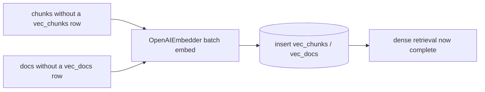
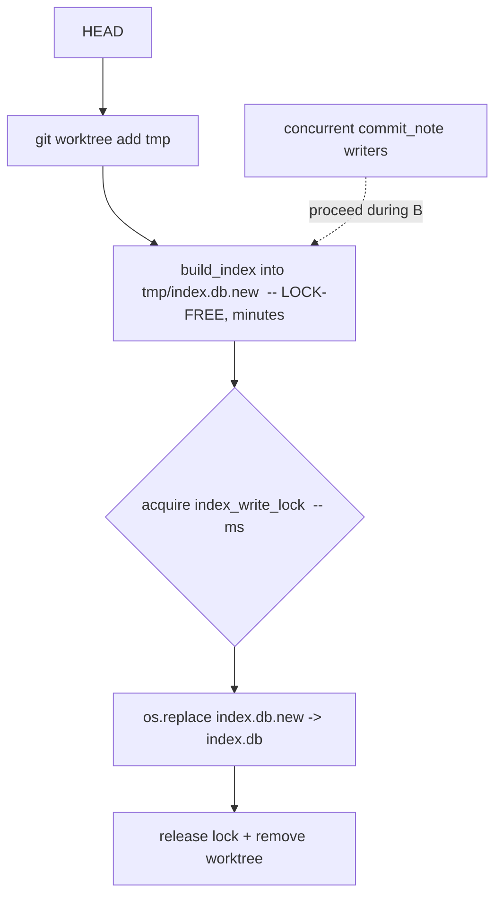

# feat: Phase-0/1 follow-ups — async embed, worktree isolation, dogfood preview

**Target repo:** `hypermnesic` (`/path/to/dev/hypermnesic`). Paths are
repo-relative unless prefixed `gbrain-brain:` (the read-only corpus). Builds on
the completed kernel **U1–U12** (Phase 0 validated, U5 parity PASS; Phase 1
write kernel shipped). **U-IDs continue the kernel sequence (U13+)** so `ce-work`
can reference units unambiguously across both plans.

## Summary

Three bounded follow-ups close the documented gaps left by the Phase-1 kernel,
before any Phase-2 work begins:

1. **Async embed-stale pass (U13)** — `commit_note` writes are findable
   *lexically* immediately but their dense vectors lag (AE5: embedding is
   async). A standalone, idempotent `embed` pass fills only the missing vectors,
   so dense retrieval catches up without ever blocking a write.
2. **Worktree-isolated broad reindex (U14)** — a full reindex currently holds the
   single-indexer lock for its entire (minutes-long) duration, blocking narrow
   `commit_note` writers. Build the new index in an isolated git worktree and take
   the lock only for a millisecond atomic swap.
3. **Dry-run + dogfood preview (U15–U16)** — give `commit_note`/`rename_note` a
   side-effect-free `dry_run` mode, and a harness that previews what repointing one
   ingest writer onto `commit_note` *would* do (read-only, safe even against the
   live vault). The **actual live cutover stays deferred and gated** on an explicit
   per-action go-ahead (threat-model sign-off proviso).

Nothing here writes the live `gbrain-brain`; all units are TDD'd against temp
repos, and the dogfood preview is read-only.

---

## Problem Frame

The kernel is code-complete but carries three known gaps recorded in
`implementation-notes.md`:

- **Dense lag (AE5).** `commit_note` extracts lexical + graph synchronously and
  defers embeddings. `catch_up` *can* embed if handed an embedder, but there is no
  standalone "fill the vectors that are missing" job — so a freshly written page
  is dense-invisible until a full rebuild.
- **Reindex blocks writers.** `build_index` and `catch_up` acquire
  `serialize.index_write_lock` for their whole run (KTD9 single-indexer). Correct,
  but a broad reindex of a 3,500-doc corpus holds that lock for minutes, during
  which `commit_note` blocks. The plan's U12 named worktree isolation as the fix.
- **Dogfood not exercised.** U7's in-scope "repoint one existing ingest cron onto
  `commit_note`" was deliberately not done — it is a live write to the canonical
  shared vault. We still want a safe *preview* of that cutover.

---

## Requirements Traceability

| Origin requirement / gap | Unit(s) |
|---|---|
| AE5 — dense vectors catch up after an async write | U13 |
| R10/R16 — index stays a complete projection of the committed tree | U13, U14 |
| KTD9 / U12 — single-indexer correctness without blocking narrow writers | U14 |
| U7 — "repoint one ingest cron onto `commit_note`" (preview half; live half deferred) | U15, U16 |
| R7/R9/R17 — gate + guard still enforced on the preview path | U15 |

---

## Key Technical Decisions

- **KTD-A. Embed-stale is a separate, idempotent pass keyed on *missing vector
  rows*, not a re-embed-all.** It selects chunks with no `vec_chunks` row (and docs
  with no `vec_docs` row), embeds those in batches, and inserts the vectors.
  Re-running with nothing stale is a no-op. Cheap, resumable, and safe to schedule.
- **KTD-B. A broad reindex builds in an isolated `git worktree` at HEAD; only the
  final index-db swap takes the write lock.** The long build runs lock-free against
  a clean checkout; `os.replace` swaps the finished `index.db` into the live state
  dir atomically while the lock is held for milliseconds. Narrow `commit_note`
  writers proceed throughout the build. Falls back to in-place locked rebuild if
  `git worktree` is unavailable.
- **KTD-C. The dogfood is dry-run-first and read-only; the live cutover is a
  separate gated action.** `dry_run=True` threads through `commit_note`/`rename_note`:
  the diff-or-die gate and protected-path guard **still run** (so a preview surfaces
  a real abort), but no file write, commit, index mutation, or log append occurs.
  A dry-run against the live `gbrain-brain` is therefore read-only and safe.
- **KTD-D. Embeddings use the pinned `OpenAIEmbedder`
  (`text-embedding-3-large` @ 1536) with a fail-loud smoke check.** No new model;
  consistent with the index. The embed pass holds the single-indexer write lock
  (it mutates `vec_chunks`/`vec_docs`).

---

## High-Level Technical Design

**Async embed-stale pass (U13):**

**Worktree-isolated reindex + atomic swap (U14):**

---

## Implementation Units

### U13. Async embed-stale pass

- **Goal:** Fill dense vectors for chunks/docs that have none (the AE5 lag), as a
  standalone idempotent command.
- **Requirements:** AE5, R10/R16.
- **Dependencies:** U2, U7, U9.
- **Files:** `src/hypermnesic/index.py` (add `embed_stale`), `src/hypermnesic/cli.py`
  (add `embed` subcommand), `tests/test_index_projection.py` (extend) or
  `tests/test_embed_stale.py`.
- **Approach:** `Index.stale_chunk_ids()` / `stale_doc_paths()` select rows in
  `chunks`/`docs` lacking a matching `vec_chunks`/`vec_docs` row. `embed_stale(idx,
  embedder, *, batch=128)` batches their text (chunk text; doc *surface* via
  `ingest.doc_surface`) through the embedder and inserts vectors. Acquire
  `serialize.index_write_lock` for the duration (single-indexer). CLI: `hypermnesic
  embed <repo|--index-db>` runs `embed.smoke_embed_or_die()` first (fail loud),
  then `embed_stale`; `--json` reports counts.
- **Patterns to follow:** `index.build_index` doc-lane embed loop;
  `index.catch_up`'s optional-embedder vector insert; `embed.smoke_embed_or_die`.
- **Test scenarios:**
  - `Covers AE5.` A page written by `commit_note` (lexical-only) is **not** in
    `dense_search`; after `embed_stale`, its chunk **is** returned by `dense_search`.
  - Idempotent: a second `embed_stale` with nothing stale embeds 0 and is a no-op.
  - Only-stale: an already-embedded chunk is not re-embedded (vector row count
    rises by exactly the stale count).
  - Doc lane: a doc with no `vec_docs` row gets its surface embedded.
  - Fail-loud: with a missing/invalid key the CLI exits non-zero before inserting
    anything (no partial vectors).
- **Verification:** after a `commit_note` write + `embed_stale`, the page is
  findable by both lexical and dense channels.

### U14. Worktree-isolated broad reindex

- **Goal:** Run a full reindex without blocking narrow writers; swap the result in
  atomically.
- **Requirements:** KTD9/U12, R10.
- **Dependencies:** U2, U12.
- **Files:** `src/hypermnesic/index.py` (add `reindex_isolated`),
  `src/hypermnesic/cli.py` (add `reindex --isolated`), `tests/test_index_projection.py`
  (extend) or `tests/test_reindex_isolated.py`.
- **Approach:** `reindex_isolated(repo, embedder, *, state_dir)`: create a temp
  `git worktree add` at HEAD (detached), `build_index` into a sibling
  `index.db.new` under the live state dir (the long, **lock-free** phase), then
  acquire `serialize.index_write_lock` and `os.replace(index.db.new, index.db)`
  (atomic on POSIX same-filesystem), release, and `git worktree remove`. If `git
  worktree` is unavailable, fall back to the existing in-place locked
  `build_index` (with a logged note). The new DB is built from the **committed
  tree** in the worktree, so it is a clean projection.
- **Execution note:** characterize the "narrow write proceeds during build" behavior
  with a test that holds the build phase open (inject a slow/blocking embedder) and
  asserts a concurrent `commit_note` is not blocked.
- **Patterns to follow:** `index.build_index(state_dir=...)`; `serialize.FileLock`;
  the U6 portability-probe worktree/temp-repo handling.
- **Test scenarios:**
  - A reindex produces a complete index (chunk + doc + vec counts match a direct
    `build_index`).
  - Atomic swap: the live `index.db` is the old one until the swap, the new one
    after; no truncated/partial DB is ever served.
  - A narrow `commit_note` write issued *while the build phase runs* (slow-embedder
    fixture) completes without `LockBusyError` (build holds no lock until swap).
  - The temp worktree is removed afterward; the target repo's tracked files are
    byte-unchanged; `.gitignore` untouched.
  - `git worktree` unavailable → falls back to in-place rebuild, still correct.
- **Verification:** a full reindex on a fixture repo yields the same index as
  `build_index`, with the lock held only across the swap.

### U15. Dry-run mode for `commit_note` / `rename_note`

- **Goal:** A side-effect-free preview that still runs the gate and guard.
- **Requirements:** U7, R7/R9/R17.
- **Dependencies:** U7, U8, U10, U12.
- **Files:** `src/hypermnesic/commit_note.py` (add `dry_run`), `src/hypermnesic/cli.py`
  (add `commit-note` / `rename-note` with `--dry-run`), `tests/test_commit_note.py`
  + `tests/test_rename.py` (extend).
- **Approach:** Add `dry_run: bool = False`. With `dry_run`, run
  `serialize.check` (guard) and `frontmatter_gate.gated_edit` (diff-or-die) exactly
  as live, compute the would-be `new_text` and a unified diff against the current
  file, and the **planned** audit entry — then return a `CommitResult(noop=True,
  dry_run=True, diff=...)` **without** writing, committing, extracting, or logging.
  No git mutation and no lock needed (read-only). Add a `dry_run` field to
  `CommitResult`.
- **Execution note:** test-first — the no-side-effect contract is the spec.
- **Patterns to follow:** existing `commit_note` ordering; `git diff --no-index`
  or an in-memory unified diff for the preview.
- **Test scenarios:**
  - Dry-run returns a non-empty diff + the planned audit entry; the file is **not**
    written, HEAD is unchanged, the index and log are unchanged.
  - Gate still aborts: a drifting frontmatter edit raises `FrontmatterDriftError`
    in dry-run (preview surfaces the real abort), no side effects.
  - Guard still refuses a protected path in dry-run.
  - `rename_note(dry_run=True)` previews the move (old→new) without `git mv`.
- **Verification:** dry-run output matches what a subsequent live call would do, with
  zero repo/index/log mutation.

### U16. Cron-repoint dogfood preview harness

- **Goal:** Preview what routing one existing ingest writer through `commit_note`
  would do, as a structured report for operator review — no live write.
- **Requirements:** U7 (preview half).
- **Dependencies:** U15.
- **Files:** `harness/dogfood_commit_note.py`, `tests/test_dogfood.py`.
- **Approach:** Given a target repo and one or more `{path, body|set_fields,
  summary}` inputs (representing what a chosen ingest writer would emit), run
  `commit_note(..., dry_run=True)` for each and emit a structured JSON report:
  per-input path, guard verdict, would-be diff summary, planned audit entry, and an
  overall "safe to cut over?" rollup. The harness **never** writes; pointing it at
  the live `gbrain-brain` is read-only (dry-run). The report is the artifact the
  operator reviews before authorizing the live cutover.
- **Trust boundary:** inputs are operator-supplied; the harness does not ingest
  arbitrary external content. The live cutover is **out of scope** (Scope Boundaries).
- **Patterns to follow:** `harness/portability_probe.py` (structured-report shape,
  `--json`, tracked-files-unchanged assertion).
- **Test scenarios:**
  - Produces a structured per-input report over a temp repo; tracked files
    byte-unchanged afterward (read-only).
  - A protected-path input is reported as refused (not crashed).
  - A drifting-frontmatter input is reported as gate-abort, with the diff.
  - The rollup flags "not safe" when any input is refused/aborted.
- **Verification:** a dry-run report over a fixture repo (and, on operator request,
  read-only against `gbrain-brain`) with the target unchanged.

---

## Scope Boundaries

**Deferred to Follow-Up Work (plan-local):**
- **Live cron cutover** — actually repointing an ingest writer to call
  `commit_note` (live) against `gbrain-brain`. Gated on operator per-action
  go-ahead after reviewing the U16 dry-run report; subject to the canonical-checkout
  / disk-first / branch rules in `gbrain-brain:AGENTS.md`.
- Scheduling/automation of `embed_stale` and `reindex_isolated` (cron/timer) — wire
  after the commands prove out manually.
- Bulk migration of *all* ingest writers beyond the first.

**Outside this plan (Phase 2/3, carried from origin):** the Obsidian read/visualize
lens, thinking-mode, salience resurfacing, multi-format sidecars (Phase 2); the
OAuth2.1/DCR gateway and cross-vendor/cloud reach (Phase 3). Each gets its own plan.

---

## Risks & Dependencies

- **Embedding cost/time (U13).** A large stale backlog = many embed calls. Mitigate
  with batching + the idempotent only-stale selection; the pass is resumable.
- **Atomic-swap filesystem assumption (U14).** `os.replace` is atomic only on the
  same filesystem; build `index.db.new` in the live state dir (same FS), not `/tmp`.
- **Worktree cleanup (U14).** A crashed reindex could leave a stale worktree; the
  command removes it in a `finally`, and a stale worktree is harmless (the live
  index is untouched until swap).
- **Dry-run fidelity (U15).** The preview must match live behavior; share the gate +
  guard code path exactly (no separate dry-run logic) so they cannot diverge.
- **Credential dependency (U13).** Needs `OPENAI_API_KEY` (env/.env); fail loud.

---

## Open Questions

- **Embed-stale trigger (deferred to implementation):** invoked manually now; the
  scheduling mechanism (post-`commit_note` hook vs periodic timer vs after
  `catch_up`) is an operational choice deferred until the command exists.
- **Worktree base dir:** reuse the homelab `~/worktrees/<repo>/<task>` convention vs
  a `.hypermnesic/worktrees/` scratch dir — decide at implementation against the
  target host's conventions.

---

## Sources & Research

- Origin: `docs/plans/2026-06-01-002-feat-retrieval-mrr-parity-plan.md` (doc-lane,
  parity PASS) and `gbrain-brain:projects/hypermnesic/docs/plans/2026-06-01-001-feat-hypermnesic-phase0-kernel-plan.md`
  (U1–U12, AE5, KTD9, U7 dogfood scope).
- In-repo: `implementation-notes.md` (recorded gaps + deviations),
  `docs/threat-model-commit-note.md` (sign-off proviso gating the live cutover),
  `src/hypermnesic/index.py` (`build_index`, `catch_up`, lock wiring),
  `src/hypermnesic/commit_note.py`, `src/hypermnesic/serialize.py`.
- No external research: the work extends well-established in-repo patterns built
  this session (strong local grounding; no new technology layer).
