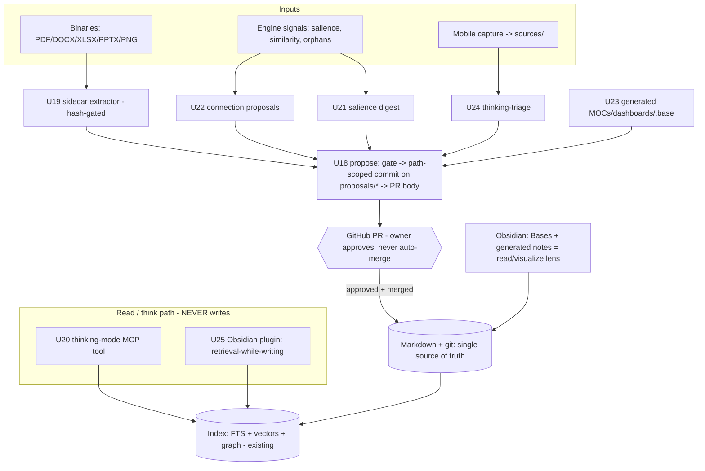

# feat: Phase 2 — the human/product surface

**Target repo:** `hypermnesic` (this repo, at the repo root). All `**Files:**`
paths are repo-relative to `hypermnesic`. The three `origin:` docs live in the
**`gbrain-brain` vault** (`projects/hypermnesic/...`) and are **read-only
grounding — never written by this work**. Builds on the completed Phase-0 +
Phase-1 kernel (U1–U17): `commit_note`, the diff-or-die frontmatter gate (incl.
U17 surgical scalar-set), the append-only audit log, the git-tree-projection
index, hybrid RRF retrieval, the body-wikilink graph, the write guard / locks /
worktree-isolated reindex, and the tailnet-only read-only MCP server
(`search` + `build_context`).

---

## Summary

Phase 2 turns hypermnesic from an agent-facing kernel into the **human/product
surface** the vision is built around: the Obsidian read/visualize lens (R6), a
thinking-partner mode (R7), and multi-format coverage (R13) — all under the trust
floor of **review-gated, no-surprise-rewrite maintenance** (R10/R11).

It is built **foundation-first**. The Phase-1 kernel writes by committing
directly; it has **no review-gated proposal mechanism**, yet R11 and every
proposal-emitting human feature (serendipity, always-organized nav, sidecar
re-extraction) depend on one. So Phase 2 first builds the **review-gated
proposal/PR queue (#12)** — a `propose()` primitive that lands narrow,
path-scoped, gate-checked diffs on `hypermnesic/proposals/*` branches and
surfaces them as GitHub PRs the owner approves, never auto-merging — then layers
on top:

- **Multi-format sidecars (#10/R13):** content-addressed extract-to-markdown for
  PDF/DOCX/XLSX/PPTX/PNG, routed Docling (MIT) ↔ MarkItDown (MIT), hash-gated.
- **The human-experience axis (H1–H6):** thinking-mode (H1), retrieval-while-writing
  (H2), serendipity connections (H3), salience resurfacing (H4), always-organized
  navigation (H5), frictionless capture→triage (H6).

The Obsidian surface ships **Hybrid** (the deferred R6 delivery decision,
resolved here): generated-markdown + native **Obsidian Bases** for the
nav/digest/connection surfaces in Phase **2a** (zero plugin code, maximally
honors ownership and no-surprise-rewrites), and a thin **desktop** companion
plugin for live retrieval-while-writing in Phase **2b**.

**Out of scope (Phase 3):** the authenticated gateway (R4/KD4), full LLM
knowledge-graph extraction (#7), schema-as-data (#14), and progressive activation
(#15). See Scope Boundaries.

---

## Problem Frame

The kernel proved the single-write-target thesis and a trustworthy write path,
but it is **agent-facing only**. The owner cannot yet *look at* the brain in
Obsidian as an always-organized graph (R6), cannot ask the brain to *help think
without writing* (R7), and the ~449 non-image binaries (210 PDF / 89 DOCX /
78 XLSX / 72 PPTX) + 445 PNGs in the reference corpus are invisible to
retrieval (R13). KD5 ("felt value comes early,
not in a late human layer") makes this the right next phase: the read-only index
already serves human *query* and the Obsidian read-lens, so only agent-*nurture*
waited for the kernel — which now exists.

The structural gap this phase must respect: **the human's files are the human's.**
Every organizing action — a new MOC, a salience digest, a "connect these two
notes?" nudge, a regenerated sidecar — is a *write* into a vault the owner reads
in Obsidian. R10 (no surprise rewrites) and R11 (maintenance is review-gated)
mean none of these may land silently. That is why the review-gated proposal queue
is the **foundation**, not an add-on: it is the structural property that makes
every other Phase-2 feature safe.

---

## Requirements

Traced to the origin product-vision doc (R*/KD*/AE*/F*) and the ideation
human-axis ideas (H1–H6, #10, #12).

| ID | Requirement | Advanced by |
|----|-------------|-------------|
| R6 | Human surface: read/visualize/navigate lens (MOCs/dashboards, what-changed, resurfaced-salient, suggested-connections), read-mostly | U21, U22, U23, U25 |
| R7 | Thinking-mode: a distinct no-write "help me think" tool; agent confirms no write occurred | U20 |
| R10 | No surprise rewrites — every write limited to the intended change; Obsidian view stays clean | U18 (gate already enforces; proposals keep generated content demarcated) |
| R11 | Maintenance is review-gated — agents propose diffs/PRs the owner approves; diff-legible | U18 (foundation), U19, U21, U22, U23, U24 |
| R13 | Multi-format coverage — non-markdown sources get indexed markdown sidecars | U19 |
| KD2 | Two co-primary surfaces with distinct jobs (agent nurture+query; Obsidian read/visualize) | U20 (query/think), U23/U25 (Obsidian) |
| KD5 | Felt value early — human surface sequenced now | whole phase |
| KD7 | Ownership is the trust floor — files intact even without hypermnesic | U18, U23 (generated content demarcated, never load-bearing) |
| F3 | "Look at the brain" flow (Obsidian shows organized graph/MOCs/changed/resurfaced) | U23, U21, U22 |
| F5 | Review-gated maintenance flow (detect → narrow proposal/PR → approve → merge) | U18 |
| AE3 | Single-field edit shows only that change, no frontmatter churn | upheld by the existing gate; U18 routes all proposal writes through it |
| AE4 | Obsidian navigation reflects new notes/connections without manual upkeep | U23 |
| #10 | Content-addressed universal sidecar ingestion | U19 |
| #12 | Review-gated maintenance as a git PR / proposal-branch queue | U18 |
| H1 | Thinking-mode gate ("help me think before you write") | U20 |
| H2 | Ambient retrieval-while-writing + duplicate warning | U25 |
| H3 | Active connection / serendipity proposals | U22 |
| H4 | Salience resurfacing / spaced-review digest | U21 |
| H5 | Always-organized human navigation surface | U23 |
| H6 | Frictionless mobile capture → deferred thinking-triage | U24 |

---

## High-Level Technical Design

The phase's spine is that **all organizing writes flow through one review-gated
front door** (U18). Read/think paths (U20, U25) never write. Generated content
(U21–U24) is *proposed*, never committed silently.



Key shape facts the diagram encodes: (1) U18 is the only new write path and it
reuses the existing gate + worktree isolation + locks; (2) U20/U25 are strictly
read-only; (3) generated surfaces (U21–U24) emit *proposals*, closing the loop
back to the index only after human approval.

---

## Output Structure

New files this phase adds (per-unit `**Files:**` remain authoritative):

```
src/hypermnesic/
  propose.py        # U18 review-gated proposal/PR queue
  sidecar.py        # U19 content-addressed multi-format extraction
  think.py          # U20 thinking-mode (or extend mcp_server.py)
  salience.py       # U21 salience scoring + digest
  connect.py        # U22 serendipity connection proposals
  nav_surface.py    # U23 generated MOCs/dashboards/.base
  capture.py        # U24 frictionless capture -> triage
tests/
  test_propose.py  test_sidecar.py  test_think.py
  test_salience.py test_connect.py  test_nav_surface.py  test_capture.py
obsidian-plugin/    # U25 (Phase 2b) — thin TypeScript desktop plugin
  manifest.json  main.ts  README.md
```

---

## Key Technical Decisions

- **KTD1 — One review-gated front door for all organizing writes.** Every
  generated artifact (sidecars, digests, connection nudges, MOCs, capture triage)
  is emitted by `propose()` (U18) as a narrow path-scoped diff on a
  `hypermnesic/proposals/*` branch, gate-checked by the existing diff-or-die gate,
  surfaced as a GitHub PR, never auto-merged. Rationale: R11 + R10 + KD7 make
  "propose, never impose" a *structural* property, not agent politeness. Reuses
  the existing worktree-isolated reindex + `FileLock`/`index_write_lock` +
  protected-path guard rather than inventing a parallel write path. (see origin:
  ideation #12; product-vision R11/F5)

- **KTD2 — Salience is never written into source-note frontmatter.** H4 salience
  scores live in the index and in *generated* digest/MOC notes only; source notes
  the human authored are never mutated to carry a `salience:` field. Rationale:
  writing a score into every note's frontmatter is exactly the churn R10/AE3
  forbid, and would dirty the Obsidian diff on every recompute. Trade-off: a
  pure-Bases view cannot sort source notes by salience — accepted; the digest note
  carries the ranking instead.

- **KTD3 — Connection suggestions (H3) use existing dense+graph similarity, not
  new LLM knowledge-graph extraction.** A "these two notes grapple with the same
  idea but aren't linked" nudge is computed from the existing dense vectors +
  body-wikilink graph proximity (high cosine similarity AND no existing edge).
  Rationale: full LLM KG extraction (#7) is Phase 3 and carries the ideation's
  "graph must earn its cost" warning; similarity+graph is already in hand.
  Trade-off: misses purely-semantic links a KG might surface — acceptable for a
  proposal-only nudge.

- **KTD4 — Sidecar tooling pins permissive MIT extractors and a permissive
  heuristic.** Docling (MIT) for complex/scanned/table/equation PDFs + image
  layout/caption; MarkItDown (MIT) for DOCX/PPTX and fast/simple PDF/XLSX. The
  scanned-vs-native + table-density routing heuristic uses a **permissive** lib
  (`pypdf`/`pdfplumber`, both MIT) — explicitly **not PyMuPDF (AGPL)** or **Marker
  (GPL + revenue-gate)**, which would trip `scripts/license_scan.py`. MinerU is
  Apache-2 as of v3.1 (2026-04) and is an allowed future option. Rationale: the
  repo's zero-AGPL/GPL/SSPL gate is load-bearing for the eventual public release.
  (see origin: research-synthesis §7 multi-format; ce-web-researcher 2026-06-01)

- **KTD5 — Content-addressed sidecar gate.** Each sidecar carries
  `extracted_from`, `extracted_at`, `source_sha256`, and `_extraction_quality`
  (`ok`/`partial`/`low`) in frontmatter. Re-extraction only fires on a source-hash
  mismatch or an extractor-version bump, and lands as a review-gated PR (KTD1) —
  sidecars never silently overwrite. Rationale: a stale sidecar is the
  multi-format analogue of disk↔DB drift; content-addressing closes it. Extraction
  is async and never blocks a write (the kernel's existing async-embed posture).

- **KTD6 — Obsidian surface is Hybrid: generated-markdown/Bases now, desktop
  plugin later.** Bases (core, 2026) reads frontmatter/metadata only — no HTTP/JS
  — so it covers MOCs/dashboards/what-changed at zero code (Phase 2a), but cannot
  do live retrieval-while-writing; that one capability needs a thin (~200-line)
  desktop TypeScript plugin calling the existing `search`/`build_context` MCP
  (Phase 2b). Generated `.base`/MOC files are demarcated (`generated_by:
  hypermnesic` + a managed-block marker) so they are never confused with
  hand-authored notes (KD7/R10). Plugin is **read-only** and desktop-first; mobile
  parity is a known gap. (see origin: product-vision R6; ce-web-researcher
  2026-06-01)

- **KTD7 — Thinking-mode is an observable no-write boundary.** H1/R7 ship as a
  distinct MCP `think` tool (and CLI mode) that has *no* write tools in scope and
  returns an explicit "no write occurred" assertion in its response — a checkable
  boundary, not an implied behavioral difference. Rationale: R7 demands the
  boundary be observable.

---

## Implementation Units

Grouped **Phase 2a** (foundation + surfaces, generated-markdown) and **Phase 2b**
(the live-editing plugin). Execution posture is **test-first** throughout — the
repo's established convention (every kernel unit shipped with failing-test-first
coverage); the trust-critical units (U18, U19) make the abort/no-silent-write
behavior the spec.

### Phase 2a

### U18. Review-gated proposal/PR queue (the foundation)

- **Goal:** A `propose()` primitive that turns a set of path-scoped changes into a
  narrow, gate-checked commit on a `hypermnesic/proposals/<slug>` branch and a
  GitHub PR with a structured body (what / why / which-source), and **never
  auto-merges**.
- **Requirements:** R11, R10, F5, KD7, #12.
- **Dependencies:** kernel U7 (`commit_note`), U8/U17 (gate), U4 (audit log),
  U12 (worktree-isolated reindex), serialize (`index_write_lock`, protected-path
  guard).
- **Files:** `src/hypermnesic/propose.py`, `tests/test_propose.py`; **substantial
  new** branch/worktree commit helpers in `src/hypermnesic/serialize.py` (this is
  net-new machinery, not a minor addition — see Approach).
- **Approach:** This unit is **heavier than a `commit_note` wrapper** and must be
  scoped as such (review-flagged). `commit_note` commits a **single path to the
  current HEAD**; it has no branch, no worktree-commit, and no multi-file atomic
  transaction. U18 must build a **branch+worktree commit transaction**: create the
  `hypermnesic/proposals/<slug>` branch inside an isolated worktree (reusing the
  U12 worktree + dirty-tree/head-drift preflight), stage a **set** of paths, and
  land them as **one atomic commit** on that branch **without touching the owner's
  live HEAD** (the branch the human reads in Obsidian). What U18 **reuses** is the
  diff-or-die **gate** (`frontmatter_gate.gated_edit`) per file — not the
  commit-to-HEAD path. AE3 byte-preservation must be **re-proven** on the
  branch-commit path (it is a different code path than the tested direct commit).
  - **Multi-file atomicity:** if any file in a multi-artifact proposal fails the
    gate, the whole proposal aborts and the branch is rolled back/never created —
    no partial branch, no half-built proposal.
  - **Path-scope allowlist (security):** `propose()` passes an **explicit
    allowlist** of the proposal's intended target paths to the gate/guard — never
    `allowlist=None` — so a proposal cannot write outside its declared scope or
    bypass the curated-zone gate (the denylist-only fallback is insufficient).
  - **Slug sanitization (security):** the `<slug>` is derived through one tested
    helper — alphanumeric + `-_/`, must not start with `-`, must not contain `..`,
    length-bounded — so a caller-supplied title can't inject a git option or ref
    traversal into the `git branch` / `gh` call.
  - **Zone tiers are net-new:** the immutable-free-append (`sources/`-style, new
    file only / no-overwrite) vs curated-propose→approve distinction does **not**
    exist in the kernel; U18 builds it as an explicit **config path-prefix list**
    (not a heuristic). U24's capture path depends on this.
  - **PR creation via `gh`** — a **new external runtime dependency** (`gh` is NOT
    currently used in this repo); document it as a system dependency with a
    minimum-scope GitHub token following the same env-var/gitignored-`.env`
    discipline as `OPENAI_API_KEY` (never logged, never in a PR body). The
    `gh`-unavailable path (today's normal state) produces the local branch + diff
    and reports the PR step skipped — and a later run with `gh` available **resumes
    PR creation** for an orphan branch (does not treat it as already-proposed).
  - The agent **never merges**; the audit log records the proposal (actor
    server-set, summary-only).
- **Execution note:** test-first — "never auto-merges" and "every proposal write
  passes the gate" are the spec.
- **Patterns to follow:** `commit_note` (gate→stage→commit→audit→diff),
  `reindex_isolated` (worktree + `os.replace` swap), `serialize.preflight`.
- **Test scenarios:**
  - `Covers F5.` A single-file proposal creates a `hypermnesic/proposals/<slug>`
    branch, commits exactly the intended path, and produces a PR body containing
    what/why/source — HEAD of the working branch is unchanged (no auto-merge).
  - A proposal whose diff would touch an unrequested frontmatter line **aborts**
    via the gate (no branch, no PR, no audit entry) — diff-or-die holds through
    the proposal path.
  - A protected path (`CLAUDE.md`, `.github/`, `skills/`) is **refused** before
    any branch is created (write-guard).
  - Free-append to an immutable `sources/`-style zone takes the fast path (commit,
    no proposal branch) while a curated-zone change takes the propose→approve
    path.
  - **Multi-file atomicity:** a 3-file proposal where file 2 fails the gate
    aborts the whole proposal — no branch is left behind, no file committed.
  - **Path-scope:** a proposal targeting a curated path outside its declared
    allowlist is rejected; a proposal cannot reach a curated zone via the
    free-append fast path.
  - **Slug sanitization:** an adversarial title (`../`, leading `-`, metachars)
    yields a safe bounded branch name — never a git option or ref traversal.
  - Idempotent: re-proposing identical content is a no-op (no duplicate branch/PR).
  - `gh` unavailable → the branch + diff are still produced locally and the
    function reports the PR step as skipped (no silent success claim); a later run
    **with** `gh` resumes PR creation for the orphan branch.
  - AE3 re-proven: a single-field frontmatter edit on the proposal branch leaves
    every other byte identical (byte-preservation holds on the branch-commit path).
  - Audit log records the proposal with a server-set actor and summary only (no
    page body).
- **Verification:** `uv run pytest tests/test_propose.py` green; a dry run against
  a temp repo shows a proposal branch + PR body and an untouched main branch.

### U19. Content-addressed multi-format sidecar extraction

- **Goal:** Generate indexed markdown sidecars for PDF/DOCX/XLSX/PPTX/PNG, routed
  by type+complexity, hash-gated, async, surfaced as review-gated PRs on change.
- **Requirements:** R13, #10, KD5 (governed by KTD4/KTD5; the gateway KD4 is out of scope — Phase 3).
- **Dependencies:** U18 (re-extraction PRs), `commit_note` (sidecar write),
  `ingest`/`index` (sidecars become indexed markdown), `config` (extractor pins).
- **Files:** `src/hypermnesic/sidecar.py`, `tests/test_sidecar.py`; add optional
  deps `docling`, `markitdown`, `pypdf`/`pdfplumber` to `pyproject.toml`
  (`[project.optional-dependencies]`), update `scripts/license_scan.py`
  expectations (all MIT/Apache-2; assert no Marker/PyMuPDF).
- **Approach:** A router keyed on `(extension, complexity_heuristic)` — a fast
  permissive-lib pass (`pypdf`/`pdfplumber`, **not** PyMuPDF) detects
  scanned-vs-native and table density, then routes: complex/scanned/table/equation
  PDFs + images → Docling; DOCX/PPTX/simple-PDF/XLSX → MarkItDown. Each sidecar
  carries `extracted_from` / `extracted_at` / `source_sha256` /
  `_extraction_quality`. The hash-gate skips unchanged sources; a hash or
  extractor-version mismatch fires a re-extraction proposal via U18. Extraction is
  async (never blocks a write). Honest fidelity flags: MarkItDown-on-PDF-with-tables
  → `low`; complex XLSX → `partial`; equations only attempted by Docling.
  - **Untrusted-content boundary (security, SEC-001):** sidecar text comes from
    arbitrary binaries and is read by write-capable agents via the index — a
    prompt-injection vector. Sidecar-sourced chunks carry a `source: sidecar` trust
    tag in the index; Phase-2 posture is accept (owner-controlled corpus, tailnet,
    gateway deferred) but the tag is added now so the Phase-3 threat model can
    restrict sidecar chunks from write-capable tools. Decide accept-vs-sanitize
    before U19 lands.
  - **Cold-start policy:** the one-time initial extraction over the ~449 binaries
    is committed via the free-append fast path (or one batched proposal), **not**
    one PR per file — avoiding a day-one PR flood (see Risks R-1/R-5).
- **Execution note:** test-first for the hash-gate and routing; extractor calls
  themselves can be fixture/mocked (the libs are heavy).
- **Patterns to follow:** `ingest.iter_chunks` / `doc_surface` (how markdown is
  chunked/indexed), the kernel's async-embed posture, `config` model pins.
- **Test scenarios:**
  - A new binary with no sidecar → produces a sidecar with the four provenance
    fields; `source_sha256` matches the file.
  - Unchanged source on re-run → hash-gate **skips** (no new extraction, no PR).
  - Source bytes change → re-extraction fires as a **review-gated PR** (U18), never
    a silent overwrite.
  - Routing: a table-dense PDF routes to Docling; a DOCX routes to MarkItDown
    (assert via the router decision, not the heavy extractor).
  - A MarkItDown PDF with detected tables stamps `_extraction_quality: low`.
  - The complexity heuristic uses a permissive lib — `scripts/license_scan.py`
    passes (no AGPL/GPL pulled in).
  - `Covers R13.` A generated sidecar is indexed and retrievable via the existing
    lexical search.
- **Verification:** `pytest tests/test_sidecar.py` green; `license_scan` clean; a
  sample PDF produces a retrievable sidecar with a correct hash.

### U20. Thinking-mode tool (no-write boundary)

- **Goal:** A distinct MCP `think`/`explore` tool (+ CLI mode) that surfaces
  related notes, asks Socratic questions, names tensions, and maps what's known —
  with **no write tools in scope** and an explicit "no write occurred" assertion.
- **Requirements:** R7, H1, KD2.
- **Dependencies:** `retrieve` (search/RRF), `graph` (`build_context`),
  `mcp_server`.
- **Files:** `src/hypermnesic/think.py` (or extend `src/hypermnesic/mcp_server.py`),
  `tests/test_think.py` (or extend `tests/test_mcp_server.py`),
  `src/hypermnesic/cli.py` (think subcommand).
- **Approach:** Compose existing retrieval + graph context into a thinking-partner
  response shape (related notes, open questions, contradictions/tensions surfaced
  from proximity). The tool is registered with `readOnlyHint` and is structurally
  incapable of writing (no `commit_note`/`propose` import in its path); its
  response carries `wrote: false`. CLI `think` mirrors the tool.
- **Execution note:** test-first — the observable no-write assertion is the spec
  (R7).
- **Patterns to follow:** `mcp_server.build_server` (tool registration,
  `readOnlyHint`), `retrieve.search`, `graph.build_context`.
- **Test scenarios:**
  - `Covers R7.` `think("topic")` returns related notes + at least one
    Socratic/tension prompt and an explicit `wrote: false`; the index and git HEAD
    are unchanged after the call.
  - The think tool exposes no write capability (assert the registered tool set
    excludes any write tool).
  - Empty/garbage query degrades gracefully (returns "nothing relevant", still
    `wrote: false`).
  - CLI `think` produces the same shape as the MCP tool.
- **Verification:** `pytest tests/test_think.py` green; MCP server lists `think`
  with `readOnlyHint` and no write tool.

### U21. Salience scoring + spaced-review digest

- **Goal:** Score salience (write-recency from the audit log, link-degree,
  embedding centrality) and emit a daily/weekly digest of salient-but-dormant
  notes as a **generated digest note** proposed via U18 — without mutating source
  notes (KTD2). **Note (feasibility):** the audit log is write-only — there is no
  read/access signal, so "recency" is recency-of-write, not recency-of-access;
  read-access logging is out of scope (it conflicts with the read-only-is-structural
  posture). **Prerequisite:** embedding centrality needs stored-vector access the
  index does not expose today (`dense_search` only does KNN against a supplied
  query vector) — U21 must first add an index method to read stored note vectors
  (or compute centrality via KNN-by-note-vector with a calibrated threshold).
- **Requirements:** R6, H4, F3.
- **Dependencies:** `index`/`retrieve` (vectors, centrality), `graph`
  (link-degree), `audit_log` (access/recency), U18 (digest-as-proposal).
- **Files:** `src/hypermnesic/salience.py`, `tests/test_salience.py`.
- **Approach:** A pure scoring function over signals already in the index + audit
  log; rank dormant-but-salient notes (high score, low recent access). Emit a
  generated digest markdown note (demarcated `generated_by: hypermnesic`) carrying
  the ranking, proposed via U18. **No `salience:` field is written to source
  notes** (KTD2). Down-rank invalidated/dormant facts at query time is a Phase-3
  concern; this unit only resurfaces.
- **Execution note:** test-first for the scoring determinism and the
  no-source-mutation guarantee.
- **Patterns to follow:** `retrieve` scoring, `audit_log.entries`.
- **Test scenarios:**
  - Scoring is deterministic for fixed inputs; a recently-created, well-linked,
    rarely-accessed note ranks above a stale orphan.
  - `Covers H4.` The digest note lists N salient-but-dormant notes and is emitted
    as a U18 proposal (not committed to main).
  - **No source note's frontmatter is modified** by a digest run (assert
    byte-equality of sampled source notes before/after).
  - Empty/small vault → digest degrades to "nothing dormant yet" without error.
- **Verification:** `pytest tests/test_salience.py` green; a digest proposal
  appears; sampled source notes are byte-identical.

### U22. Connection / serendipity proposals

- **Goal:** Propose non-obvious connections — "these two notes grapple with the
  same idea but aren't linked — connect them?" — as review-gated nudges (U18),
  using dense + graph similarity (KTD3), never auto-linking.
- **Requirements:** R6, H3, F3, AE4.
- **Dependencies:** `retrieve` (dense similarity), `graph` (existing-edge check),
  U18 (proposal). **Prerequisite (feasibility):** pairwise cosine between two
  *stored* notes is not exposed today (`dense_search` is query-vector KNN only) —
  shares U21's new stored-vector index method, or uses KNN-by-note-vector with a
  calibrated distance→"high cosine" threshold. Precision guards beyond a single
  threshold: length-normalize and exclude near-duplicate/boilerplate pairs (shared
  templates, raw captures) so serendipity nudges stay high-precision.
- **Files:** `src/hypermnesic/connect.py`, `tests/test_connect.py`.
- **Approach:** For candidate pairs with high cosine similarity AND no existing
  body-wikilink edge between them, emit a bounded, batched proposal (add a
  backlink / "related" note) via U18. Threshold-tuned to stay high-precision
  (noisy suggestions erode trust). Never writes the link directly.
- **Execution note:** test-first for the "similar AND unlinked" predicate and the
  no-auto-link guarantee.
- **Patterns to follow:** `retrieve` (vector similarity), `graph.from_index`
  (edge set).
- **Test scenarios:**
  - `Covers H3.` Two fixture notes with high similarity and no edge → a single
    connection proposal via U18; two notes already linked → **no** proposal.
  - Low-similarity pairs produce no proposal (precision floor honored).
  - No edge is ever written directly (assert the graph edge set is unchanged after
    a run; only a proposal exists).
  - Proposals are batched/bounded (a cap on suggestions per run to avoid PR noise).
- **Verification:** `pytest tests/test_connect.py` green; proposals appear only
  for similar-and-unlinked pairs.

### U23. Always-organized navigation surface (generated MOCs/dashboards + Bases)

- **Goal:** Auto-maintained (review-gated) MOC notes, dashboards, and Obsidian
  `.base` view configs that stay correct as content changes and give the human an
  organized entry point — proposed, never silent.
- **Requirements:** R6, H5, F3, AE4, KD7.
- **Dependencies:** U18 (generated files as proposals), U21 (salience field for
  resurfaced views — via the digest note, not source notes), U22 (suggested
  connections surfaced), `graph`/`index` (what-changed via audit/mtime).
- **Files:** `src/hypermnesic/nav_surface.py`, `tests/test_nav_surface.py`.
- **Approach:** Generate MOC/dashboard markdown + `.base` configs that read
  frontmatter/metadata (Bases can do this with no code). "What changed" via
  `file.mtime` / audit log; resurfaced-salient links to the U21 digest;
  suggested-connections links to U22 proposals.
  - **Output location (feasibility blocker):** `views/` is in the write guard's
    `_PROTECTED_DIRS`, so generated `.base`/view files **cannot** land there as
    written. Generated nav artifacts land in a **non-protected** location — a
    dedicated `dashboards/` dir and/or vault-root MOC notes — OR the guard carves
    an explicit `generated_by: hypermnesic`-only exception under `views/` (a
    guard-relaxation decision with its own test). Pick one before U23 lands.
  - **Demarcation (visible, not just frontmatter):** `generated_by: hypermnesic`
    frontmatter **plus** a rendered, human-visible managed-block marker — a
    callout/sentinel block (e.g. `> [!hypermnesic] generated — edits below the
    marker are overwritten`) so a reader in Obsidian's reading view (where
    frontmatter is collapsed) can tell generated from hand-authored content. The
    managed region's boundary is explicit so a human edit inside it is never a
    surprise overwrite (R10).
  - Every artifact is emitted via U18 — never a silent rewrite (KD7/R10);
    regeneration is idempotent and only re-proposes on real change.
  - **Graceful degradation:** if no U21 digest or U22 proposals exist yet, the MOC
    generates without those sections (don't block on upstream proposals).
- **Execution note:** test-first for the demarcation marker and the
  proposal-not-silent guarantee.
- **Patterns to follow:** existing MOC conventions in the corpus (auto-regenerated
  people/companies READMEs), `views/*.yml`/`.base` shape, U18.
- **Test scenarios:**
  - `Covers H5/AE4.` Adding notes/connections → a regenerated MOC proposal that
    reflects them; no change → no proposal (idempotent).
  - Every generated file carries the `generated_by: hypermnesic` marker and is
    emitted via U18 (never committed to main directly).
  - A generated `.base` config is valid Bases YAML (parses; filter root is a
    single `all:`/`any:` group per the vault convention).
  - A hand-authored note is never overwritten by generation (only `generated_by`
    files are touched).
- **Verification:** `pytest tests/test_nav_surface.py` green; opening Obsidian on
  the merged proposal shows updated MOCs/Bases; hand-authored notes untouched.

### U24. Frictionless capture → deferred thinking-triage

- **Goal:** Ultra-low-friction capture lands raw in `sources/` (free-append, zero
  organization demanded); later a thinking-mode triage proposes placement +
  connections + a one-line grapple prompt as a review-gated PR.
- **Requirements:** R6, H6, F5.
- **Dependencies:** U18 (free-append fast path + triage proposal), U20
  (thinking-triage reuses the think path), `commit_note`.
- **Files:** `src/hypermnesic/capture.py`, `tests/test_capture.py`,
  `src/hypermnesic/cli.py` (capture subcommand).
- **Approach:** Capture writes raw to `sources/` via U18's immutable-zone
  free-append fast path (no proposal friction in the moment). A separate triage
  pass (reusing U20's read-only think over the captured item) proposes a
  placement + connections + an optional grapple prompt via U18. Splits low
  capture-friction from generative processing-friction in time.
- **Execution note:** test-first for the two-step split (capture never blocks;
  triage always proposes, never auto-places).
- **Patterns to follow:** U18 free-append tier, U20 think, `commit_note`.
- **Test scenarios:**
  - `Covers H6.` Capture lands a raw note in `sources/` immediately (free-append,
    no proposal/PR required).
  - A later triage run proposes a placement + connections for the captured note as
    a U18 PR — and does **not** auto-move it.
  - Triage reuses the read-only think path (no write occurs during analysis).
- **Verification:** `pytest tests/test_capture.py` green; capture is immediate;
  triage produces a placement proposal without moving the file.

### Phase 2b

### U25. Obsidian companion plugin — retrieval-while-writing (H2)

- **Goal:** A thin **desktop** TypeScript Obsidian plugin that, on a debounce,
  sends the current note's content to the existing tailnet `search`/`build_context`
  MCP and renders a "related notes / you may be reinventing [[X]]" sidebar — **read
  only**; any write flows through the U18 git path.
- **Requirements:** R6, H2, KD2.
- **Dependencies:** the existing read-only MCP (`search`, `build_context`) — no
  Python changes required; U18 only for the (optional) "accept as proposal" action.
- **Files:** `obsidian-plugin/manifest.json`, `obsidian-plugin/main.ts`,
  `obsidian-plugin/README.md` (new TypeScript subtree, separate from the Python
  package).
- **Approach:** Register an editor-change listener (debounced) that calls the
  tailnet HTTP/MCP endpoint with the current note text and renders results in a
  leaf view; warn on high-similarity existing notes ("reinventing [[X]]").
  Desktop-first (CodeMirror 6 mobile parity is a known gap, not solved here).
  Strictly read-only — no vault writes from the plugin.
- **Execution note:** the plugin is TS, outside the Python test suite; verify by
  manual load in Obsidian + a scripted check that it issues only read calls. Keep
  it ~200 lines.
- **Patterns to follow:** prior art `obsidian-local-rest-api`, Smart Connections'
  related-notes panel; the existing MCP `search`/`build_context` contract.
- **Test scenarios:**
  - Editing a note triggers a debounced `search` call and renders related notes in
    the sidebar.
  - A near-duplicate existing note triggers a "you may be reinventing [[X]]"
    warning.
  - The plugin issues **only** read calls (no vault write); proposals route through
    git.
  - `Test expectation: manual + scripted read-only assertion` — the plugin is not
    covered by the Python pytest suite; verification is a manual Obsidian load plus
    a request-log check that only `search`/`build_context` are called.
- **Verification:** plugin loads in desktop Obsidian; the related-notes panel
  populates from the live index; no write call is observed.

---

## Scope Boundaries

**Deferred to Phase 3 (owned by the vision, sequenced — not abandoned):**
- The **authenticated gateway** (R4/KD4) — cross-vendor cloud/mobile reach. v1
  stays tailnet-only; the portability wedge is honestly a Phase-3 goal.
- **Full LLM knowledge-graph extraction (#7)** — H3 here uses dense+graph
  similarity only (KTD3).
- **Schema-as-data (#14)** and **progressive activation / ten-file drop-in (#15)**.
- **Advanced graph analytics** — contradiction/temporal-invalidation (#8),
  trajectory, query-time salience down-ranking.
- The **security/threat-model for the write surface** (R15–R19) — required before
  the gateway phase; the proposal path here respects only the existing
  protected-path guard.

**Deferred to follow-up work (plan-local sequencing):**
- **U25 mobile plugin parity** (CodeMirror 6) — desktop-first this phase.
- Second-agent reviewer / batching intelligence for the proposal queue beyond the
  basic batching cap in U22.

**Outside this product's identity:**
- Not savoir-être memory (stays in Honcho). Not a per-session scratch store. Not
  an autonomous re-organizer — **no silent file rewrites, ever** (every U21–U24
  output is a proposal).

---

## Risks & Dependencies

- **R-1 Proposal/PR flood — correlated cold-start burst (review-flagged).** A
  cold start can fire sidecar extraction + U21 digest + U22 connections + U23 MOCs
  at once; per-unit caps (batching U22, idempotent U23, hash-gate U19) do not bound
  the *aggregate*. If the queue floods, the owner rubber-stamps and review-gating
  decays to de-facto auto-merge — the exact failure that erodes KD7/R10.
  Mitigation: a **global proposal budget / coalescing policy** in U18 (one PR per
  run-cycle or a daily cap across all units) + the U19 cold-start free-append
  policy. The full second-agent-reviewer/batching intelligence stays deferred, but
  the global cap ships with U18.
- **R-2 Extraction cost.** A one-time Docling pass over ~210 PDFs is ~3.5h CPU
  (asserted, not measured on this hardware). Mitigation: async, hash-gated, run
  once; only deltas thereafter (KTD5).
- **R-3 Licensing regression.** Pulling in an AGPL/GPL extractor (PyMuPDF/Marker)
  would break the public-release gate. Mitigation: KTD4 + the `license_scan` test
  in U19 — **CI must install the optional extras** for the scan to be meaningful.
- **R-4 Generated-content trust.** A generated MOC/digest mistaken for a
  hand-authored note erodes KD7. Mitigation: visible managed-block marker + frontmatter
  `generated_by` demarcation + all generation via U18 (U23, KTD1/KTD6).
- **R-5 Plugin scope creep.** The TS plugin could balloon. Mitigation: read-only,
  ~200 lines, desktop-first, calls only the two existing MCP endpoints (U25).
- **R-6 Sidecar prompt-injection (security, SEC-001).** Untrusted binary content
  becomes index text read by write-capable agents. Mitigation: `source: sidecar`
  trust tag now; accept for Phase-2 (owner corpus, tailnet); Phase-3 threat model
  restricts sidecar chunks from write tools.
- **R-7 Plugin↔MCP access control (security, SEC-003).** The U25 plugin streams
  note text to the tailnet MCP, which has no per-request auth — any tailnet peer
  can query the index. Phase-2 posture: tailnet membership is the boundary (state
  it explicitly); revisit with a Tailscale ACL tag or bearer token if the tailnet
  widens. Confirm the plugin retains no note text locally between calls.
- **Dependency:** **`gh` CLI is a NEW runtime dependency** (not currently used in
  the repo) — needs a minimum-scope GitHub token under the `OPENAI_API_KEY`-style
  env/gitignored discipline; `docling`/`markitdown`/`pypdf` as optional extras
  (CI installs them); an Obsidian desktop install for U25 verification.
- **Dependency:** **Obsidian Bases availability** — KTD6 assumes Bases is a stable
  core feature in the owner's install; if unavailable, U23 falls back to generated
  MOC/dashboard markdown notes (no `.base`).

---

## Open Questions / Deferred to Implementation

**Sequencing (review-flagged — resolve before execution):**
- **Read-only-first vs strict foundation-first.** U20 (thinking-mode) and U25
  (retrieval-while-writing) are strictly read-only and have **no U18 dependency**;
  KD5 ("felt value early") is best served by letting them ship **first or in
  parallel** with U18, rather than behind the proposal-queue foundation. The plan
  is "foundation-first" for the *proposal-emitting* units (U19/U21/U22/U23/U24);
  the read-only units need not wait. Confirm the intended ordering.
- **Gateway two phases out (product-lens).** Deferring the gateway to Phase 3 while
  shipping a full second personal-only phase pushes wedge/thesis validation out;
  the vision frames gateway timing as the load-bearing decision. Is this the
  deliberate "reframe v1 as tailnet-personal" branch of KD4?
- **H5/H6 elevation (product-lens).** The ideation §C demoted H5/H6 to "after the
  kernel"; this plan pulls them into Phase 2. KTD3 justifies pulling H3 forward
  (removes the #7 dependency) — confirm/justify elevating H5/H6, or move them to a
  Phase 2.5 so the leaner upstream set (H1/H2/H4) ships first.

**Design decisions (resolve at/just before the relevant unit):**
- **KTD2 middle path (adversarial):** salience excluded from source frontmatter
  means Bases can't live-sort by salience — weigh writing `_salience` onto
  *generated mirror* notes Bases can read, vs accepting the static digest ranking.
- **Proposal discovery flow (design-lens):** how does the owner learn a PR is
  waiting — a generated "inbox" note/Base updated by U18, a digest entry? And what
  does each proposal's PR body contain (similarity score, per-note excerpts) so it's
  decidable on mobile without opening Obsidian?
- **U22 connection artifact form:** wikilink insertion into both note bodies vs a
  `related:` frontmatter entry vs a bridge stub — affects diff legibility/reversibility.
- **U21 digest + U23 MOC content format / IA:** per-entry data, layout, title,
  placement, replace-vs-append.
- **U24 mobile capture entry point:** the CLI subcommand is server-side; H6's
  primary use is mobile — name the actual trigger (Shortcuts→MCP, Telegram bot, …).
- **U25 sidebar interaction states** (loading/empty/error/offline-tailnet/stale)
  and the "reinventing [[X]]" warning behavior (threshold, presentation, dismissal,
  recurrence); reconcile its threshold with U22's. Plus basic plugin a11y (keyboard/SR).
- Whether the thinking-triage grapple prompt (U24) is always-on or opt-in.
- Whether `.base` generation emits one global dashboard or per-namespace MOCs first.

**Tuning (implementation-time):**
- Exact salience signal weights (write-recency vs link-degree vs centrality) — U21.
- The connection-proposal similarity threshold and per-run cap — U22.
- The debounce interval and result count for the U25 plugin — tune in Obsidian.

---

## Sources / Research

- Origin (read-only, in the `gbrain-brain` vault):
  `projects/hypermnesic/docs/brainstorms/2026-06-01-hypermnesic-product-vision-requirements.md`
  (R1–R19, KD1–KD7, A1–A3, F1–F5, AE1–AE6),
  `projects/hypermnesic/docs/ideation/2026-06-01-hypermnesic-feature-ideation.md`
  (ideas #10, #12, H1–H6; the §C build sequence placing these in Phase 2),
  `projects/hypermnesic/notes/research-synthesis.md` (the dual-write diagnosis,
  the design soul, the multi-format corpus shape).
- External (ce-web-researcher, 2026-06-01): Obsidian Bases is read-only over
  frontmatter (no HTTP/JS) → Hybrid surface; prior art `obsidian-local-rest-api`,
  Smart Connections, `aaronsb/obsidian-mcp-plugin`; sidecar tooling — Docling
  (MIT), MarkItDown (MIT), MinerU (Apache-2 as of v3.1, 2026-04); **Marker (GPL +
  revenue-gate) and PyMuPDF (AGPL) avoided**; content-addressed hash-gate is an
  orchestration-layer responsibility in all tools.
- Builds on: `docs/plans/2026-06-01-001-...-phase0-kernel-plan.md` (in the vault),
  and this repo's `docs/plans/2026-06-01-003-feat-phase01-followups-plan.md`,
  `docs/plans/2026-06-01-004-feat-gate-surgical-scalar-set-plan.md`,
  `docs/solutions/design-patterns/surgical-scalar-set-frontmatter-byte-preservation.md`.
