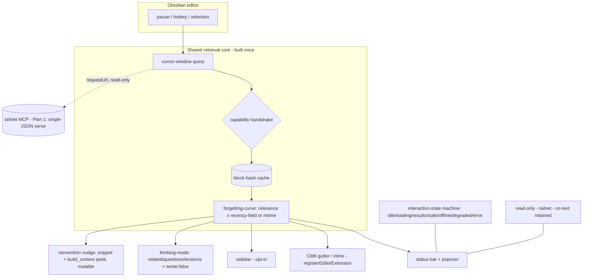

# feat: Phase 2.5 (Plan 2 of 2) — Obsidian companion redesign (calm read-only recall surface)

**Target repo:** `hypermnesic` (this repo, repo root). All `**Files:**` paths are repo-relative. This is **Plan 2 of 2** for Phase 2.5; **Plan 1** (`docs/plans/2026-06-02-006-feat-phase-2-5-engine-deployment-plan.md`) covers the engine (convergence, the git-first write tool, the installer, the per-`Hit` recency field, and the single-JSON serve). New units continue from **U35** (Plan 1 used U26–U34). The companion is **strictly read-only**: it reads the tailnet MCP and never writes the vault; any write is an agent calling Plan 1's gated `commit_note` tool. This plan touches one Python file only — the static read-only test — everything else is the TypeScript plugin.

---

## Summary

Redesign the Obsidian companion from a loud, always-on, file-head related-notes sidebar into a calm, read-only recall surface: one shared retrieval core (pause-triggered, cursor-windowed, cached) fanning out to glanceable surfaces (status-bar + optional editor gutter, opt-in sidebar), in-editor thinking-mode, an interrogable "reinventing [[X]]" nudge, selection-recall, forgetting-curve ranking, and a visible trust/degradation layer. Along the way it makes the committed plugin actually build (no scaffolding exists today), fixes the Obsidian guideline violations, and brings the plugin into line with Obsidian's official developer rules — staying strictly read-only throughout.

---

## Problem Frame

The companion is the most visible UX surface of hypermnesic, but today it is a ~250-line sidebar that, on every keystroke, sends the first 4000 characters of the file to `search` and renders a flat list plus an unfalsifiable "reinventing [[X]]" warning. It is loud (reshuffles mid-sentence), shallow (file-head query misses what is being written now), hides the engine's `think` capability (not in its tool allowlist), and asserts its read-only guarantee only in a code comment. Three structural facts compound this: the plugin **cannot build as committed** (no `package.json`/`tsconfig`/esbuild config — verified absent); it **violates** an Obsidian guideline by detaching leaves in `onunload`; and it ships a **hardcoded remote MCP URL**, so a fresh install transmits note text off-device with no user action.

This plan rebuilds the surface around one shared core, makes the read-only guarantee visible, and grounds every plugin decision in Obsidian's official developer documentation. It consumes — but does not build — Plan 1's freshness machinery: convergence makes the master's index fresh, the per-`Hit` recency field feeds forgetting-curve ranking, and the single-JSON serve makes `requestUrl` work.

---

## Grounding — Plan 1 shipped (2026-06-02; PRs #2 + #3 merged to `main`)

Plan 1 (U26–U34 + code-review follow-ups) is **complete and merged**, so its engine contract is now concrete rather than assumed. This plan consumes it directly — the capability handshake (KTD4) and mtime fallback (KTD3) remain, but now guard against an *older/read-only* serve, not an unshipped one:

- **`search` response shape** (shipped MCP tool): top-level `{ query, degraded_lexical_only, manual_reindex_recommended, hits }`; each hit is `{ path, heading, score (float), channels: string[] (sorted — `lexical`/`dense`/`doc`), snippet (≤280 chars), recency: float | null }`.
- **`recency` is epoch seconds** — the Unix committer-time of the most recent commit touching the path (`null` when untracked). The engine emits a **raw timestamp, not a pre-decayed score**; the companion derives its own forgetting curve from it (resolves the recency-representation open question).
- **`manual_reindex_recommended: bool`** is a NEW per-read signal on all three read tools (the oversized-delta / stale-index hint Plan 1's convergence surfaces). U41's state machine consumes it as an explicit "stale — reindex on the master" state, alongside `degraded_lexical_only`.
- **`degraded_lexical_only`** now reflects both query-embedding AND convergence-embedding degradation (dense channel down either way → lexical-only).
- **Read tools are exactly `{ search, build_context, think }`** (`READ_TOOL_NAMES`). The write tool `commit_note` is registered ONLY on a write-enabled master (`WRITE_TOOL_NAMES`), never reachable by this read-only client — so the plugin's allowlist mirrors the server's structural split.
- **Single-JSON serve is the default** (`build_server(..., json_response=True)`), so `requestUrl` (buffered, non-streaming) works without SSE.
- **The installer's `--role=client`** (Plan 1 U34) emits/patches an MCP-client config entry `{"mcpServers": {"hypermnesic": {"type": "streamable-http", "url": "<master>/mcp"}}}`. The plugin's settings URL (U41) is that same value: a provisioned client install pre-fills it, while a manual install starts **empty** (opt-in off-device send, DEP-R17). The plugin should read this shape if it auto-detects an installed client config.

---

## Requirements

Traced to the companion half of the fresh-recall doc (its R1–R23) and the deployment doc's Obsidian-compliance group (its R15–R20). The engine-side requirements live in Plan 1.

| ID (origin) | Requirement | Advanced by |
|---|---|---|
| FR-R1/R2/R3/R4/R5 | One shared retrieval core: pause-trigger, cursor-window, block-hash cache, capability handshake | U36 |
| FR-R9 | Forgetting-curve ranking (relevance × staleness) | U37 |
| FR-R6/R7/R8 | Calm surfaces: status-bar + gutter + opt-in sidebar; flow-aware; provenance; keyboard nav | U38 |
| FR-R10/R11/R12 | Thinking-mode (`think`) with `wrote:false`; add `think` to allowlist | U39 |
| FR-R16 | Selection-as-query recall | U39 |
| FR-R13/R14/R15 | Interrogable, per-note-mutable, view-only reinvention nudge | U40 |
| FR-R17/R18 | Interaction-state machine; `degraded_lexical_only` surfaced | U41 |
| FR-R19/R20 | Read-only badge + allowlist display; accessibility | U41 |
| FR-R21/R22/R23 | Settings; credential hygiene; small auditable surface | U41 |
| DEP-R15 | Client uses `requestUrl` (keep); relies on Plan 1's single-JSON serve | U36 |
| DEP-R16 | README network/account disclosure | U41 |
| DEP-R17 | Default-empty MCP URL (opt-in off-device send) | U41 |
| DEP-R18 | Structure for future protocol-handler OAuth (no OAuth impl now) | U41 |
| DEP-R19 | `isDesktopOnly` decided by actual deps | U35 |
| DEP-R20 | Lifecycle/DOM hygiene: no leaf-detach on unload; `getLeavesOfType`; `registerEditorExtension`; safe DOM | U35, U38 |

---

## Key Technical Decisions

- KTD1 — One shared retrieval core; surfaces are thin renderers. A single `trigger → cursor-window query → cache → rank` pipeline is built once; status-bar, gutter, sidebar, thinking-mode, and selection-recall render its cached result. No surface issues its own redundant MCP query. Rationale: trust/accessibility/state handling are implemented once and inherited; the N+1 surface cost trends to zero. (see origin: fresh-recall KD2)

- KTD2 — Calm-primary, sidebar opt-in, pause-triggered. The default surface is a low-footprint status-bar indicator (+ optional editor-margin markers); retrieval fires on a thinking pause (cursor idle / paragraph boundary / hotkey), never per-keystroke, and holds findings during sustained typing. Rationale: the companion defers to the writer. (see origin: fresh-recall KD3, R3, R7)

- KTD3 — Forgetting-curve ranking consumes the engine recency field, with a local-mtime fallback. Results rank by relevance × staleness using the per-`Hit` recency Plan 1 surfaces — now concretely an **epoch-seconds float (git committer-time), `null` when untracked**; the companion derives the decay. When the field is absent or `null` (older serve, or handshake reports it missing), fall back to the note's local mtime. Rationale: the anti-amnesia differentiator works independently of Plan 1's ship order. (see origin: fresh-recall KD4, R9; deployment KD7)

- KTD4 — Capability handshake decouples the plugin from the engine version. On load the plugin probes which MCP tools/channels and result fields exist (e.g. whether `think` is served, whether `Hit` carries recency) and lights surfaces up or degrades them accordingly. Rationale: the engine can grow without a lockstep plugin release. (see origin: fresh-recall KD6, R5)

- KTD5 — Trust is shown, not asserted. One explicit interaction-state machine (idle/loading/results/stale/offline/degraded/error with an as-of stamp), plus a distinct **"stale — reindex on master"** state driven by Plan 1's `manual_reindex_recommended` flag; per-result channel provenance, a persistent "read-only · tailnet · no text retained" badge, and an in-settings list of the allowlisted read tools. Rationale: the read-only guarantee must be legible in the UI, not just in code. (see origin: fresh-recall KD5, R17–R19)

- KTD6 — Modular TypeScript, with the read-only guarantee kept statically verifiable. The redesign splits the plugin into a shared-core module + surface modules (esbuild bundles to one `main.js`). Because the static read-only test scans source, the tool allowlist and the no-vault-write guarantee are kept in a scannable location and the test's scan target is updated in lockstep. Rationale: the surface count needs modularity, but the structural read-only proof must not regress. (see origin: deployment R20; this plan's confirmed modular-vs-single-file call-out)

- KTD7 — Read-only is structural; OAuth is a seam, not an implementation. The plugin keeps a hard tool allowlist (read tools only — `search`/`build_context`/`think`) and performs no `vault.modify/create/delete/append/trash` / `adapter.write`. Future MCP OAuth is left as a clean seam (where `registerObsidianProtocolHandler` + PKCE will attach) but is not implemented now. Rationale: writes belong to agents via Plan 1's gated tool; the companion never writes. (see origin: fresh-recall KD1; deployment KD3, R18)

---

## High-Level Technical Design



Prose is authoritative where it and the diagram disagree. The plugin never writes the vault; writes are agents via Plan 1's gated `commit_note` tool.

---

## Output Structure

The plugin moves from a single file to a small modular tree (esbuild bundles to one `main.js`). Per-unit `**Files:**` remain authoritative.

```
obsidian-plugin/
  package.json          # U35 (new) — build scripts + devDeps (obsidian, esbuild, typescript)
  tsconfig.json         # U35 (new)
  esbuild.config.mjs    # U35 (new)
  manifest.json         # existing — isDesktopOnly decision (U35)
  README.md             # existing — network/account disclosure (U41)
  main.ts               # plugin entry: lifecycle, command/surface registration
  src/
    core.ts             # U36 — shared retrieval core (trigger/query/cache/handshake)
    ranking.ts          # U37 — forgetting-curve
    surfaces/           # U38 — status-bar, gutter (CM6), sidebar renderers
    thinking.ts         # U39 — thinking-mode + selection-recall
    nudge.ts            # U40 — reinvention nudge
    state.ts            # U41 — interaction-state machine + trust badge
    settings.ts         # U41 — settings tab (default-empty URL, toggles)
tests/
  test_obsidian_plugin.py  # existing — scan target + allowlist assertion updated (U39, U35)
```

---

## Implementation Units

Execution posture: the TypeScript surfaces are verified by **manual Obsidian load** plus the **static read-only assertion** in `tests/test_obsidian_plugin.py` (the plugin is outside the Python behavioral suite); the allowlist/no-write/manifest invariants ARE covered by that pytest file and are updated test-first where they change.

### Phase A — Foundation

### U35. Build scaffolding + plugin shell lifecycle hygiene

- **Goal:** Make the committed plugin build, and fix the Obsidian lifecycle violations, before any redesign.
- **Requirements:** DEP-R19, R20; FR-R23.
- **Dependencies:** none.
- **Files:** `obsidian-plugin/package.json` (new), `obsidian-plugin/tsconfig.json` (new), `obsidian-plugin/esbuild.config.mjs` (new), `obsidian-plugin/main.ts` (lifecycle), `obsidian-plugin/manifest.json`, `tests/test_obsidian_plugin.py` (scan-target if entry splits).
- **Approach:** Add `package.json` with build scripts and devDeps (`obsidian`, `esbuild`, `typescript`) — license-gate-clean (all permissive); `tsconfig.json`; an esbuild config bundling `main.ts` (+ `src/`) → `main.js`. Fix the lifecycle violations: remove `detachLeavesOfType` from `onunload` (Obsidian handles teardown of registered views and preserves leaf placement on update); in the activate path, reuse an existing leaf via `getLeavesOfType` before creating one. Keep all listeners on `registerEvent`/`registerInterval` for auto-cleanup. Decide `isDesktopOnly` from actual deps (keep `true` unless mobile is intended; status-bar UI is unsupported on mobile, which the calm-primary surface relies on).
- **Execution note:** characterization-first — keep the existing read-only assertion green throughout the restructure.
- **Patterns to follow:** Obsidian Build-a-plugin esbuild setup; `implementation-notes.md` license-gate discipline.
- **Test scenarios:**
  - `npm run build` produces `main.js` from the TS sources (build smoke; CI/manual where node is available).
  - Covers DEP-R20. The read-only assertion in `tests/test_obsidian_plugin.py` still passes against the new file layout (scan target updated if the entry splits).
  - `license_scan` (or the devDep audit) confirms no AGPL/GPL pulled in.
  - Manual: after a simulated plugin update, an open companion leaf retains its position (no `onunload` detach).
- **Verification:** `uv run pytest tests/test_obsidian_plugin.py` green; `npm run build` emits `main.js`; manual leaf-placement check.

### Phase B — Core & ranking

### U36. Shared retrieval core

- **Goal:** One pipeline — pause-trigger → cursor-window query → block-hash cache → (handshake-gated) MCP `search` — that every surface renders from.
- **Requirements:** FR-R1, R2, R3, R4, R5; DEP-R15.
- **Dependencies:** U35.
- **Files:** `obsidian-plugin/src/core.ts` (new), `obsidian-plugin/main.ts` (wire trigger), `tests/test_obsidian_plugin.py` (no-write scan still holds).
- **Approach:** Replace the per-keystroke `editor-change` → file-head query with: a pause trigger (cursor idle past the configured interval, paragraph boundary, or explicit hotkey); a cursor-window extractor (the active block/section around the cursor, not the file head); a block-hash cache keyed on normalized content (hit → serve instantly, survives note re-open within a session, read-only); a capability handshake probing the MCP tool list and result fields on load. All MCP calls go through `requestUrl` (already compliant) against Plan 1's single-JSON serve. The pipeline never blocks typing and never moves the cursor.
- **Execution note:** test-first for the cursor-window extractor and cache-key logic (pure functions, unit-testable in TS even if outside pytest — or assert via the static no-write scan + manual).
- **Patterns to follow:** the existing `callTool`/`requestUrl` + `parseToolResult` in `main.ts`; Obsidian `Editor` cursor/selection API.
- **Test scenarios:**
  - Covers FR-R3, R7. Continuous typing produces no visible surface change; the first pause past the interval triggers exactly one query.
  - Covers FR-R4. Editing a paragraph at the end of a long note queries that paragraph's text, not the note opening.
  - Covers FR-R2. A repeat query for an unchanged block hits the cache (no new MCP call); editing the block invalidates it.
  - Covers FR-R5. With `think` absent from the probed tool list, the core marks thinking-mode unavailable rather than erroring.
  - The no-vault-write static assertion still holds (no write APIs introduced).
- **Verification:** manual load shows pause-triggered, cursor-windowed recall; `tests/test_obsidian_plugin.py` green.

### U37. Forgetting-curve ranking

- **Goal:** Rank related results by relevance × staleness, preferring genuinely-forgotten notes, using the engine recency field with an mtime fallback.
- **Requirements:** FR-R9.
- **Dependencies:** U36. Consumes Plan 1's per-`Hit` recency field (U29) when present.
- **Files:** `obsidian-plugin/src/ranking.ts` (new).
- **Approach:** A pure ranking function over the core's cached hits: combine relevance (score) with staleness (down-weight recently-touched notes). Staleness source = the per-`Hit` `recency` field from Plan 1 (an **epoch-seconds float**, `null` when untracked) when present and non-null; otherwise the note's local mtime (`vault.adapter` stat / metadata) as a fallback. Compute the decay client-side (the engine emits a raw timestamp, not a pre-decayed score). Threshold/weights are tunables.
- **Execution note:** test-first for the ranking function determinism and the fallback branch.
- **Patterns to follow:** the engine's relevance scoring shape (read-only consumption).
- **Test scenarios:**
  - Covers FR-R9. Given two equally-relevant hits, the staler one ranks higher.
  - With the recency field present, ranking uses it; with it absent, ranking falls back to mtime and still orders sanely (assert both branches).
  - A recently-touched, highly-relevant note is down-weighted relative to a stale-but-relevant one.
- **Verification:** manual load shows stale-but-relevant notes surfacing above recently-touched ones; ranking function unit-checked both branches.

### Phase C — Surfaces & features

### U38. Calm surfaces

- **Goal:** Render the core's ranked result through low-footprint surfaces: status-bar indicator + popover, optional CM6 gutter/inline markers, opt-in sidebar — flow-aware, provenance-tagged, keyboard-navigable.
- **Requirements:** FR-R6, R7, R8; DEP-R20 (CM6 via `registerEditorExtension`).
- **Dependencies:** U36, U37.
- **Files:** `obsidian-plugin/src/surfaces/` (new: status-bar, gutter, sidebar), `obsidian-plugin/main.ts` (register surfaces/commands).
- **Approach:** Default surface = a status-bar item showing a related-count that expands to a switcher-style popover; optional CM6 gutter/inline markers anchored to the active block, registered via `registerEditorExtension` (auto-cleaned). The full sidebar becomes opt-in and reuses the popover renderer. Flow-aware: hold findings during sustained typing, release on pause. Each result shows channel provenance (lexical/dense/graph), is keyboard-navigable, and on activation opens the existing note via `openLinkText(..., false)` — never creates one. Status-bar is desktop-only (unsupported on mobile), consistent with `isDesktopOnly`.
- **Patterns to follow:** Obsidian status-bar item API; `registerEditorExtension` for CM6; the existing read-only `openLinkText` navigation in `main.ts`.
- **Test scenarios:**
  - Covers FR-R6. Default install shows the status-bar indicator; the sidebar is not open unless opted in.
  - Covers FR-R8. Activating a result opens an existing note and never creates one (no-write scan holds); results are reachable by keyboard.
  - Covers FR-R7. During sustained typing, visible surfaces do not reshuffle; they update on the next pause.
  - Provenance chips render lexical/dense/graph distinguishably (not by color alone — see U41).
  - CM6 gutter markers register via `registerEditorExtension` and are removed on unload (no leaked decorations).
- **Verification:** manual load across status-bar/popover/gutter/sidebar; no-write assertion green.

### U39. Thinking-mode, selection-recall, and the `think` allowlist

- **Goal:** Add `think` to the read-only allowlist (with the lockstep test update), a "Think about this note/selection" command rendering related/questions/tensions with a `wrote:false` badge, and a "Recall about selection" command.
- **Requirements:** FR-R10, R11, R12, R16.
- **Dependencies:** U35, U36.
- **Files:** `obsidian-plugin/src/thinking.ts` (new), the allowlist location (e.g. `obsidian-plugin/src/core.ts` or `main.ts`), `obsidian-plugin/main.ts` (commands), `tests/test_obsidian_plugin.py` (allowlist assertion update).
- **Approach:** Add `think` to the `READ_ONLY_TOOLS` allowlist; **update the brittle exact-string assertion** in `tests/test_obsidian_plugin.py` in the same change (it currently pins `new Set(["search", "build_context"])`; update to include `think` and point at the allowlist's location if it moved). A "Think about this note/selection" command calls `think` and renders `related`/`questions`/`tensions` read-only with a visible `wrote:false` proof badge and no write affordance. A "Recall about selection" command sends the highlighted text as an explicit `search` query.
- **Execution note:** test-first — update the allowlist assertion and the no-write assertion together; they are the structural read-only proof.
- **Patterns to follow:** the `callTool` allowlist guard in `main.ts`; the engine `think` response shape (`related`/`questions`/`tensions`/`wrote:false`).
- **Test scenarios:**
  - Covers FR-R12. `tests/test_obsidian_plugin.py` asserts the allowlist now includes `think` (updated exact-string) and still excludes any write tool; the no-vault-write scan still passes.
  - Covers FR-R11. Thinking-mode renders at least one question or tension and a visible `wrote:false` badge; no write affordance is present.
  - Covers FR-R16. "Recall about selection" sends the selected text as the query and renders results.
  - `think` unavailable (handshake) → the command degrades gracefully (disabled or "thinking-mode unavailable"), no error.
- **Verification:** `uv run pytest tests/test_obsidian_plugin.py` green with the updated allowlist; manual thinking-mode + selection-recall.

### U40. Interrogable reinvention nudge (view-only)

- **Goal:** Turn the "reinventing [[X]]" warning from a dead-end accusation into a checkable, per-note-mutable, view-only nudge.
- **Requirements:** FR-R13, R14, R15.
- **Dependencies:** U36, U38.
- **Files:** `obsidian-plugin/src/nudge.ts` (new), `obsidian-plugin/main.ts` (persist mute state via `saveData`).
- **Approach:** When the top hit's similarity ≥ threshold for the current block, show the nudge; it expands to the matched snippet and a one-hop `build_context` peek so the claim is checkable. It is dismissable/mutable per-note, persisted via `loadData`/`saveData` — muting is plugin-local state and never edits the note. The nudge's "open as a proposal" action is explicitly out of v1 (view/interrogate-only).
- **Patterns to follow:** the existing similarity-threshold warning in `main.ts`; `loadData`/`saveData` for mute state.
- **Test scenarios:**
  - Covers FR-R13. The nudge expands to a snippet + `build_context` peek; the claim is inspectable.
  - Covers FR-R14. "Mute for this note" suppresses the nudge on that note across reloads (persisted) and leaves the note's bytes unchanged (no-write scan holds).
  - Covers FR-R15. The nudge exposes no write/"open as proposal" affordance in v1.
  - Below-threshold similarity produces no nudge.
- **Verification:** manual nudge interrogation + mute-persistence; no-write assertion green.

### Phase D — Trust & compliance

### U41. Trust/state machine, accessibility, settings, and Obsidian compliance

- **Goal:** One explicit interaction-state machine across surfaces, a visible read-only/trust layer, accessibility, the settings tab, and the remaining Obsidian-official compliance fixes.
- **Requirements:** FR-R17, R18, R19, R20, R21, R22; DEP-R16, R17, R18.
- **Dependencies:** U36 (states wrap the pipeline); cross-cuts U38.
- **Files:** `obsidian-plugin/src/state.ts` (new), `obsidian-plugin/src/settings.ts` (new), `obsidian-plugin/main.ts`, `obsidian-plugin/README.md`, `obsidian-plugin/manifest.json`.
- **Approach:** Implement one interaction-state machine — idle / loading / results / stale (with an as-of stamp when a refresh fails) / offline-tailnet / degraded (lexical-only) / reindex-recommended / error — each visibly distinct across all surfaces; surface `degraded_lexical_only` explicitly, and surface Plan 1's `manual_reindex_recommended` as the distinct "stale index — reindex on master" state. Add a persistent "read-only · tailnet · no text retained" badge and an in-settings list of the allowlisted read tools. Accessibility: `aria-live` on result updates, full keyboard nav, and never color-as-sole-signal (provenance/staleness carry text/tooltip equivalents). Settings (`PluginSettingTab`, sentence-case names, `setHeading`): MCP URL **defaulting to empty** (opt-in off-device send — removes the previously hardcoded homelab-IP default), pause/debounce interval, result count, reinvention threshold, per-surface toggles; persisted via `loadData`/`saveData`; any future credential read from settings, never logged. A provisioned `--role=client` install (Plan 1 U34) supplies the endpoint via its emitted `mcpServers.hypermnesic.url` config; a manual install starts empty until the user sets it — the empty default never transmits. Update `README.md` with the network/account disclosure (which remote service, that note text is transmitted, opt-in). Leave a clean seam for future protocol-handler OAuth (`registerObsidianProtocolHandler` + PKCE) without implementing it.
- **Execution note:** test-first for the default-empty-URL "no off-device send until configured" behavior.
- **Patterns to follow:** the existing `HypermnesicSettingTab` + `loadData`/`saveData`; Obsidian `PluginSettingTab`/`setHeading` conventions; `createEl` safe DOM (no `innerHTML`).
- **Test scenarios:**
  - Covers FR-R17. A failed refresh after a prior success shows "stale — as of HH:MM", not a silently-frozen list.
  - Covers FR-R18. Dense-channel-down → results render with an explicit "lexical-only" indicator (driven by `degraded_lexical_only`).
  - Covers DEP-R17. A fresh install with the default-empty URL transmits nothing off-device until the user sets the endpoint (assert no MCP call fires with an empty URL).
  - Covers FR-R19. The read-only badge is present and settings list the exact allowlisted read tools.
  - Covers FR-R20. Result updates are announced via `aria-live`; provenance/staleness are distinguishable without color; all interactions keyboard-reachable.
  - Covers DEP-R16. README states the remote service, the note-text transmission, and the opt-in.
- **Verification:** manual load across all states + a11y pass (keyboard + screen-reader); empty-URL no-send behavior confirmed; README updated.

---

## Risks & Dependencies

- **R-1 Read-only proof regresses during modularization (KTD6).** Splitting `main.ts` could move the allowlist out of the test's scan target, silently weakening the guarantee. Mitigation: update the test's scan target in lockstep (U35/U39); keep the allowlist + no-write guarantee in one scannable module.
- **R-2 Engine-version skew (Plan 1 has landed).** Plan 1 shipped (PRs #2/#3 merged), so forgetting-curve recency (U37), `think` over MCP, the `manual_reindex_recommended` signal, and the single-JSON serve are all available on a current master. The residual risk is *version skew* — a master running an older build, or a deliberately read-only serve. Mitigation: the capability handshake (KTD4) + mtime fallback (KTD3) keep the companion working against any engine version; the engine-fed fields light up when present and degrade cleanly when absent/`null`.
- **R-3 CM6 gutter complexity.** Inline/gutter widgets are the highest-complexity surface. Mitigation: status-bar is the calm-primary default; the gutter is optional and registered via the supported `registerEditorExtension` path; if it proves heavy, it can ship after the status-bar surface.
- **R-4 Off-device transmission is reviewer-sensitive.** Sending note text to a remote endpoint is the most scrutinized plugin behavior. Mitigation: default-empty URL (opt-in), README disclosure, read-only badge (U41); never transmit without a configured endpoint.
- **Dependency:** Obsidian desktop install for manual verification; node/esbuild for the build; the existing permissive-license gate applies to the new devDeps.
- **Dependency (Plan 1 — SHIPPED):** the per-`Hit` `recency` field (epoch-seconds float, `null`-safe), `think` in `READ_TOOL_NAMES`, the `manual_reindex_recommended` read-signal, the single-JSON serve (`json_response=True` default), and the `--role=client` MCP-config emitter — all merged to `main` and available to consume.

---

## Scope Boundaries

### Deferred for later (from origin)

- Proposal Inbox (in-Obsidian view of open U18 proposals) — sourced from a future read-only `list_proposals` endpoint, not a GitHub token in the plugin.
- Write-triggers (frictionless capture, "open as proposal") — gated on a sanctioned write path + the Phase-3 write-surface threat model.
- Mobile read-only recall (CM6-free subset); wikilink ghost-text; the ambient connection-density glyph.

### Deferred to follow-up work

- MCP OAuth in the plugin (`registerObsidianProtocolHandler` + PKCE) — only the seam is left here; the implementation lands with the engine OAuth work.
- Community-plugin publication (would require the README disclosure — done here — plus removing any sample scaffolding and a submission pass).

### Outside this product's identity

- The plugin never writes the vault and never merges — writes are agents via Plan 1's gated `commit_note` tool.
- No silent rewrites; muting/dismissing nudges is plugin-local state, never a note edit.
- Not an autonomous organizer, not a chat box, not an embeddings engine — a thin read-only client over the tailnet MCP.

---

## Open Questions / Deferred to Implementation

- Pause-trigger defaults (idle ms, paragraph-boundary detection) — pick an initial model, tune against real writing (origin resolved the model; values are tuning).
- Block-hash cache eviction policy and size bound.
- Status-bar popover vs command-palette switcher for "expand related"; whether the opted-in sidebar reuses the popover renderer (KTD1 leans yes).
- ~~Exact recency representation consumed from Plan 1's `Hit`~~ — **RESOLVED (U29 shipped):** it is an epoch-seconds float (git committer-time), `null` when untracked. The companion derives its own decay client-side.
- Whether to also consume Plan 1's new `manual_reindex_recommended` read-signal as a first-class surface state (this plan now says yes — KTD5/U41) vs treating it as advisory-only.
- Whether the gutter ships in this plan or as a fast-follow if CM6 cost is high (R-3).
- Forgetting-curve weights (relevance vs staleness).

---

## Sources / Research

- Origin docs: `docs/brainstorms/2026-06-02-phase-2-5-fresh-recall-requirements.md` (companion R1–R23), `docs/brainstorms/2026-06-02-deployment-topology-write-model-requirements.md` (R15–R20).
- Plan 1 (status: **completed**, merged to `main` via PRs #2/#3): `docs/plans/2026-06-02-006-feat-phase-2-5-engine-deployment-plan.md` (recency field, `think` exposure, single-JSON serve, convergence, role-aware installer). See the "Grounding — Plan 1 shipped" section above for the concrete consumed contract.
- Current plugin (ce-repo-research-analyst, 2026-06-02): `obsidian-plugin/main.ts` (file-head query, sidebar-only, `READ_ONLY_TOOLS` lacks `think`, hardcoded `mcpUrl` default (a homelab tailnet IP), `editor-change` debounce, `onunload` detach **violation**), `obsidian-plugin/manifest.json` (`isDesktopOnly: true`), build scaffolding **verified absent**; `tests/test_obsidian_plugin.py` (4 tests incl. the exact-string allowlist assertion `new Set(["search", "build_context"])` and the no-vault-write scan — both must stay green / update in lockstep).
- Obsidian official developer docs (2026, ce-framework-docs-researcher): `requestUrl` (not `fetch`); Developer Policies (network/account disclosure, no telemetry/remote-code/secrets); Plugin guidelines (no leaf-detach on unload, `getLeavesOfType`, auto-cleanup registrations, no default hotkeys, `setHeading`/sentence-case, safe DOM); `registerEditorExtension` for CM6; `registerObsidianProtocolHandler` + PKCE for OAuth; `isDesktopOnly` implications (status-bar unsupported on mobile). URLs in the deployment-topology requirements doc's Sources.
- Engine contract (shipped): `src/hypermnesic/retrieve.py` (`Hit` now carries `recency: float | None`; `git_commit_recency`), `src/hypermnesic/think.py`, `src/hypermnesic/mcp_server.py` (`READ_TOOL_NAMES` = `{search, build_context, think}`, `WRITE_TOOL_NAMES` = `{commit_note}` master-only; `search`/`build_context`/`think` responses carry `manual_reindex_recommended`; `build_server(json_response=True)`), `src/hypermnesic/install.py` (`--role=client` writes `mcpServers.hypermnesic` = `{type: streamable-http, url}`).
