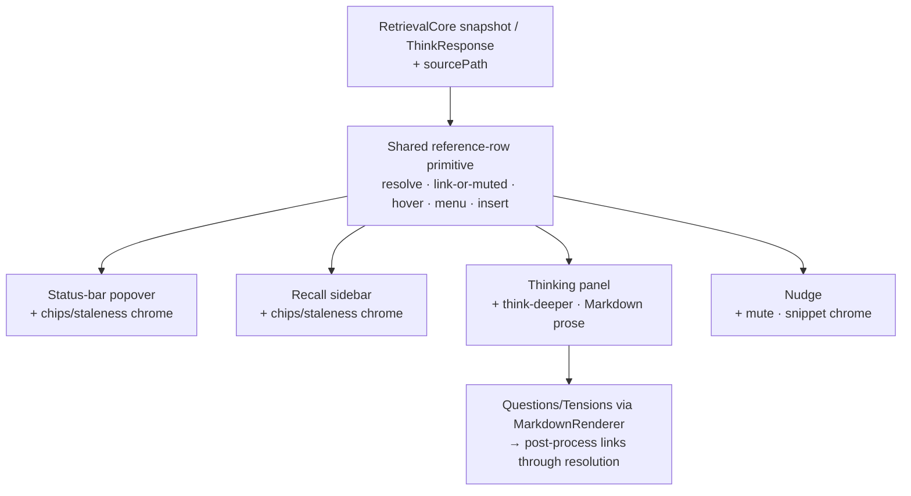
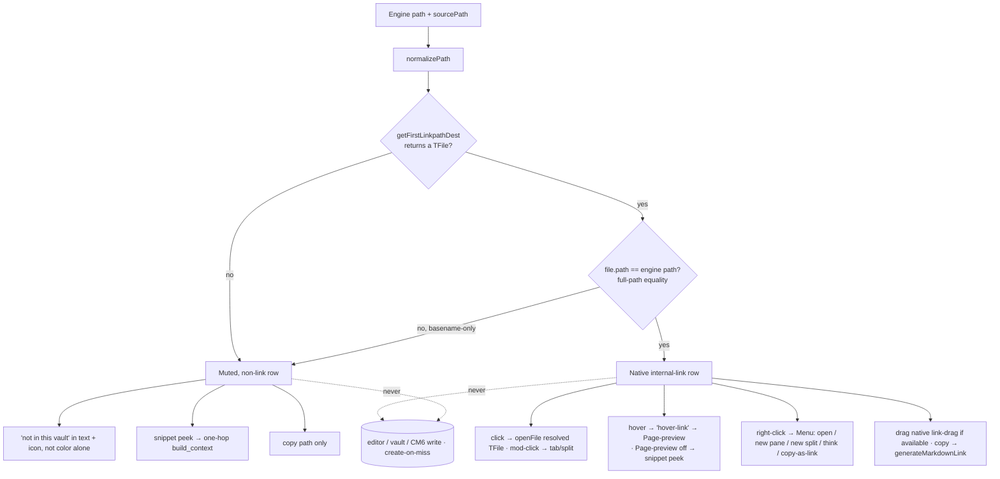

# feat: First-class Obsidian UI for the hypermnesic companion

## Summary

Bring every surface of the read-only hypermnesic companion to first-class
Obsidian quality through one shared reference-row primitive. Every page reference
becomes a per-hit-resolved navigable link — local notes get a native
`internal-link` with Page-preview hover and a right-click menu; non-local notes
get an honest muted row with an engine-snippet peek, never a broken,
wrong-target, or note-creating link. Thinking-mode moves from a dead-end modal
into a dockable `ItemView` panel; a read-only-preserving drag/copy link-insertion
affordance lands on every result row; and the settings tab becomes a real
surface — all without the plugin ever writing the vault, with the read-only
static proof widened to cover the full editor/CodeMirror mutation surface, not
just the calls that exist today.

---

## Problem Frame

The plugin's engineering is already guideline-clean (read-only by construction,
a single interaction-state machine, the trust badge, CSS variables, `setIcon`,
roving-tabindex a11y, no `innerHTML`, no leaf-detaching on unload). The defect is
in the interaction layer and has one root cause: two divergent rendering paths.
`obsidian-plugin/src/surfaces/render.ts` builds navigable links; but
`obsidian-plugin/src/thinking.ts` — the surface users see most — renders every
related note as plain `<li>` text via `relatedLabel()`, with zero links and zero
navigation. Even the linked path is not first-class: `href="#"` stubs mean the
core Page-preview plugin never fires; the nudge shows literal `[[full/path.md]]`
as display text; paths render raw; there are no right-click actions; buttons are
raw `<button>`. And because the index lives remotely on the tailnet master, some
returned paths will not exist in the local vault — today those would be handed to
`openLinkText` and silently create-on-click or preview nothing.

Two cross-cutting hazards shape the design and were sharpened during review.
First, the read-only promise ("never writes the vault, statically proven") is
only as strong as the static scan is wide — and adding an insertion surface plus
a `MarkdownRenderer` prose surface opens new write/create-on-click vectors the
current four-call scan does not cover. Second, the engine path-space and the
local vault path-space are not guaranteed identical, so resolution must guard
against *mis*-resolution (a basename collision presenting the wrong local note as
authoritative), not just *under*-resolution.

The brainstorm (`origin`) resolved WHAT to fix across all six surfaces plus the
settings tab. This plan defines HOW, sequenced so the fix is built once and
inherited everywhere.

---

## Key Technical Decisions

- KTD1. **Thinking-mode is its own registered `ItemView`** (a new
  `hypermnesic-thinking` view type), a sibling to the recall sidebar rather than
  a mode of it. The two surfaces render different result shapes (ranked hits vs.
  related/questions/tensions); a separate view keeps the shared primitive clean
  and gives thinking-mode a dockable, persistent leaf. Resolves origin
  "own view type vs mode" (see origin: `docs/brainstorms/2026-06-02-obsidian-companion-first-class-ui-requirements.md`).

- KTD2. **A shared reference-row primitive, not a God-renderer.** The shared
  module owns exactly the part that is genuinely identical across surfaces:
  resolve a reference, render it as a native link or an honest muted row, wire
  hover preview, the context menu, and insertion. It does NOT own surface chrome —
  channel chips and staleness (recall-only, absent from thinking's
  `ThinkResponse.related`), the "think deeper" affordance (thinking-only), the
  nudge's mute/snippet, or the panel's `MarkdownRenderer` prose. Each surface
  composes the primitive per reference and adds its own chrome. This deletes the
  divergent `relatedLabel()` plain-text path (origin R25) without forcing a
  union-of-all-needs options object, and it reconciles with KTD9 (prose
  legitimately bypasses the primitive).

- KTD3. **Per-hit resolution guards against mis-resolution, not just absence.**
  Each reference is resolved with `app.metadataCache.getFirstLinkpathDest(linktext, sourcePath)`
  after `normalizePath`. Because that API does shortest-path/basename matching, a
  returned `TFile` is accepted as a local link ONLY when its `file.path` equals
  the normalized engine path (full-path equality); a basename-only match resolves
  to a *different* note and is treated as non-local, never rendered as a confident
  link. The assumed path relationship is stated explicitly: engine paths are
  vault-root-relative (the master repo is the same corpus the vault mirrors); when
  roots diverge, references fall to the honest non-local branch rather than
  mis-linking (origin R2, R3; resolves origin "path normalization" question).

- KTD4. **Hover preview via the supported path, with a fallback when Page-preview
  is off.** The plugin calls `registerHoverLinkSource(id, { display, defaultMod })`
  once and emits the `hover-link` workspace event on row hover. Because
  `hover-link` is an untyped `trigger` convention (not a typed event), the payload
  is pinned behind a local typed interface so a field-name typo is caught at
  compile time, and each surface supplies a concrete `HoverParent` (the `ItemView`
  for the panel/sidebar; the status-bar popover has none, so its native preview is
  best-effort). The core Page-preview plugin is the only consumer of `hover-link`;
  when it is disabled, local rows fall back to the same engine-snippet peek
  non-local rows use, so no row is ever hover-dead (origin R24, R3).

- KTD5. **Read-only is preserved end-to-end and the proof is widened.** Insertion
  supplies drag data and clipboard text only; the plugin calls no `editor.*`,
  `vault.*`, `adapter.*`, or CodeMirror `view.dispatch` write. Navigation opens
  the resolved `TFile` via `workspace.getLeaf(...).openFile(file)` — never by
  re-passing the raw engine path to `openLinkText`, which creates-on-miss
  (closes a create-on-click seam). Link text is generated with
  `app.fileManager.generateMarkdownLink(file, sourcePath)`, respecting the user's
  link-format setting. Copy-as-link is the guaranteed path; drag-to-insert rides
  Obsidian's native `internal-link` drag (verified once) and is simply not offered
  if that can't carry it — the plugin never ships a `draggable` row that silently
  no-ops. The static read-only scan in `tests/test_obsidian_plugin.py` is widened
  from the current four `vault.*`/`adapter.*` forms to the full mutation surface —
  `editor.replaceSelection(`, `editor.replaceRange(`, `editor.setLine(`,
  `editor.transaction(`, `editor.exec(`, CodeMirror `.dispatch(`,
  `vault.process(`/`rename(`/`copy(`, `fileManager.processFrontMatter(`/`renameFile(` —
  kept method-qualified (so `Setting.setValue` is not a false positive), plus a
  structural assertion that the insertion module imports nothing from
  `@codemirror/view`/`@codemirror/state` and references no `Editor` mutator. The
  scan carries a comment requiring reviewers to extend the list as the API surface
  grows (origin R6, R14–R16).

- KTD6. **Think-deeper caches engine data and re-resolves on render.** "Think
  deeper" pushes the chosen topic onto a bounded stack (named depth constant) and
  re-runs `think` in place; "back" pops to the cached prior `ThinkResponse`. The
  stack caches engine *data only* — references are re-resolved against the live
  vault on every render, so a note created/renamed mid-chain reflects correctly on
  back. Closing the panel leaf clears the stack (a re-invoked panel starts fresh,
  never resurrecting a stale chain); at the cap, "think deeper" is disabled rather
  than dropping the root, so "back" always reaches the origin. Resolves origin
  "back model" (see origin).

- KTD7. **The status-bar popover keeps JS-driven dynamic positioning as a
  documented styling exception.** Anchor geometry is inherently runtime; all
  *static* styling moves to `obsidian-plugin/styles.css` while the dynamic
  geometry stays in JS. This satisfies origin R22's "remediate or explicitly
  justify." Resolves origin "popover refactor" question.

- KTD8. **Minimal TS unit-test harness for pure logic, behind an obsidian-free
  module boundary.** Add `vitest` as a single dev-dependency. The pure
  resolution/display/link-format logic lives in a leaf module that imports
  *nothing* from `obsidian` (so it is testable with no mock); the thin wrappers
  around `getFirstLinkpathDest`/`generateMarkdownLink`/`normalizePath` live in a
  separate edge module excluded from unit tests. DOM-bearing and Obsidian-API
  behavior stays verified by the Python static scans (widened per KTD5) plus a
  manual live-load checklist — consistent with the plugin's stated posture.

- KTD9. **Questions and Tensions render through `MarkdownRenderer.render`, then are
  resolution-guarded.** Rendering the Socratic prose as markdown makes embedded
  `[[wikilinks]]` live and previewable (origin R9). But `MarkdownRenderer` wires
  those links to native `openLinkText`, which creates-on-miss — and the engine
  prose references the *master* corpus, so a wikilink may not exist locally. After
  render, emitted `a.internal-link` nodes are post-processed through the KTD3
  resolution: unresolved ones are demoted to the muted non-link treatment, closing
  the second create-on-click seam (origin R6, R9).

- KTD10. **`sourcePath` is threaded from the query origin to the renderer.** Both
  `getFirstLinkpathDest` and `generateMarkdownLink` require the source note's path,
  which the codebase consumes in `core.run` and discards. `CoreResult` and the
  thinking response carry the originating note path; the render dependencies pass
  it through. The thinking panel uses the path the results were computed for (not
  the currently-active note) so resolution stays stable as the panel survives
  navigation (origin R8; required by KTD3, KTD5).

---

## High-Level Technical Design

Two shapes carry the design: the primitive fan-out (one row primitive, every
surface composes it with its own chrome) and the per-hit resolution branch (what
each reference becomes, including the mis-resolution and create-on-click guards).

**Reference-row primitive — shared core, per-surface chrome:**

**Per-hit resolution — what each reference becomes:**

---

## Requirements

Traceability to the origin requirements doc (origin R-IDs preserved). R26–R28 are
plan-local hardening surfaced during review. Grouped by capability.

### Page references and navigation

- R1. Every surface that lists a note renders each reference as an interactive
  element — no plain-text, non-navigable page reference anywhere (origin R1).
- R2. Resolvable paths render as native internal links: `internal-link` class,
  navigate on click and Enter/Space, native Page-preview on hover (origin R2, R24).
- R3. Non-local paths render as a muted, non-link row that never 404s or creates a
  note, carries "not in this vault" in text (not color alone), and offers the
  engine-snippet peek (origin R3).
- R4. Display text is the note title/basename with the folder de-emphasized —
  never a raw full path, never literal `[[path]]` text (origin R4).
- R5. Each resolvable reference exposes a right-click `Menu`: open, open in new
  pane, open in new split, think about this note, copy as link (origin R5).
- R6. All navigation opens existing notes only; no surface mutates or creates a
  vault file to navigate (origin R6).
- R27. Resolution and navigation target the *exact* note: a path that only
  basename-matches a different local note is treated as non-local, and navigation
  opens the resolved `TFile` (never re-resolving the raw engine path), so a hit
  never silently links to, previews, or creates the wrong note (plan-local;
  hardens origin R2/R3/R6).

### Thinking panel

- R7. Thinking-mode renders into a dockable `ItemView`, revealed/activated by the
  existing "Think about this note or selection" command (origin R7).
- R8. Re-invoking thinking-mode updates the open panel in place (one panel) and
  the panel survives navigation; resolution uses the path the result was computed
  for (origin R8).
- R9. Related renders through the shared primitive; Questions and Tensions render
  through `MarkdownRenderer` (origin R9).
- R10. The panel carries the `wrote: false` proof badge and the trust badge and
  presents no write affordance (origin R10).
- R11. A result offers "think deeper" — re-running `think` in place with a back
  affordance (origin R11).
- R12. The panel has explicit loading, empty, degraded, and unreachable states via
  the shared state machine, shown in-panel rather than as Notices (origin R12).
- R13. The panel matches the recall surfaces' keyboard/a11y behavior:
  roving-tabindex navigation, Enter/Space to open, region/list roles, aria-live
  status (origin R13).
- R28. Links embedded in rendered Questions/Tensions prose are subject to the same
  resolution guard as rows: an unresolved `[[wikilink]]` never creates a note on
  click (plan-local; hardens origin R6/R9).

### Read-only-preserving link insertion

- R14. Every resolvable reference offers insertion the user performs; the plugin
  issues no editor/vault/CodeMirror write. Drag-to-insert is offered only when
  Obsidian's native link-drag carries it; otherwise copy-as-link is the affordance
  (origin R14).
- R15. The context menu includes "copy as link," placing a vault-correct link
  (user's configured format) on the clipboard via the native primitive (origin R15).
- R16. Non-local references offer only "copy path" (origin R16).

### Settings as a first-class surface

- R17. Bounded numerics (similarity threshold, staleness weight) render as sliders
  with a visible live value to two decimals; unbounded numerics render as
  validated, clamped inputs (origin R17).
- R18. Settings apply live where feasible — ranking-affecting changes re-rank and
  re-render visible results without a reload; settings that cannot hot-apply say so
  in their description, and the count of such settings is minimized (origin R18).
- R19. The read-only tool allowlist renders as a real styled list, not a disabled
  text input (origin R19).
- R20. The settings tab holds Obsidian conventions: sentence case, `setHeading`
  sections, no `<h1>`/`<h2>` headers, privacy posture stated where relevant (origin R20).

### Native primitives, compliance, and consistency

- R21. All UI uses Obsidian primitives: `setIcon`, `ButtonComponent`/`setCta()`,
  `Setting`/`PluginSettingTab`, `Menu`, `MarkdownRenderer`; no `innerHTML`/
  `outerHTML`/`insertAdjacentHTML` (origin R21).
- R22. All styling lives in `obsidian-plugin/styles.css` via classes and CSS
  variables — no JS-assigned styles except the popover's justified dynamic
  geometry (origin R22, KTD7).
- R23. The plugin passes the Obsidian self-critique checklist for the UI in scope:
  no default hotkeys, no production `console.log`, sentence case, `this.app`, no
  deprecated methods (origin R23).
- R24. Hover preview is registered through `registerHoverLinkSource` + the
  `hover-link` event with a stable source id and a typed payload (origin R24).
- R25. The shared reference-row primitive backs every surface; the divergent
  thinking plain-text path is deleted (origin R25, KTD2).

### Read-only proof

- R26. The static read-only scan is widened from the current four `vault.*`/
  `adapter.*` forms to the full editor/CodeMirror/vault/fileManager mutation
  surface (method-qualified), plus a structural assertion that the insertion module
  imports no CodeMirror editor APIs — so the read-only guarantee cannot regress
  through an untested write door as the insertion and prose surfaces grow
  (plan-local; hardens origin R6).

---

## Implementation Units

Sequenced shared-primitive-first (Phase A), then surfaces consume it (Phase B),
then settings + compliance (Phase C).

### Phase A — Shared foundation

### U1. Reference resolution and display model

- **Goal:** A pure, obsidian-free module that derives a reference's display model
  (title/basename, de-emphasized folder) and insertable link text, plus a thin
  edge module that resolves paths and enforces full-path equality — so a basename
  collision never yields a confident local link.
- **Requirements:** R2, R3, R4, R15, R16, R27.
- **Dependencies:** none.
- **Files:**
  - `obsidian-plugin/src/surfaces/reference-model.ts` (new) — PURE logic only,
    zero `obsidian` imports: `path → { kind, title, folder }` derivation,
    full-path-equality classification given a resolved path, and wikilink-vs-markdown
    link-text selection given a "use markdown links" flag.
  - `obsidian-plugin/src/surfaces/reference.ts` (new) — edge wrappers around
    `metadataCache.getFirstLinkpathDest`, `normalizePath`, and
    `fileManager.generateMarkdownLink`; excluded from unit tests.
  - `obsidian-plugin/package.json` — add `vitest` dev-dependency, a `test` script,
    and a `vitest.config.ts` if an `obsidian` alias proves necessary for the edge
    module (KTD8).
  - `obsidian-plugin/test/reference-model.test.ts` (new) — unit tests for the pure
    module. Ensure `esbuild` excludes `test/**` from the bundle.
- **Approach:** Keep all Obsidian-API calls in `reference.ts`; the testable core in
  `reference-model.ts` has no `obsidian` import so vitest needs no mock. The edge
  resolver returns a `TFile` only when `file.path === normalizePath(enginePath)`;
  a basename-only match returns non-local (KTD3, R27). The active-note path is
  excluded (mirrors the existing `h.path !== activePath` filter in
  `obsidian-plugin/src/core.ts`).
- **Patterns to follow:** the pure, unit-checkable style of `cursorWindowFromLines`
  in `obsidian-plugin/src/core.ts`.
- **Test scenarios:**
  - `Covers AE1.` Full-path match → `kind: "local"` with the resolving `TFile`.
  - `Covers AE5.` Basename-only match (engine `archive/2021/meeting.md`, vault has
    only `inbox/meeting.md`) → `kind: "non-local"`, never a local link.
  - Unresolvable path → `kind: "non-local"`, never throws.
  - Divergent-root path (engine root ≠ vault root) → non-local, not mis-linked.
  - Display model: nested path → basename title + de-emphasized folder; root note →
    no folder segment.
  - Active-note path is excluded.
  - Link-text selection returns wikilink vs. markdown per the user-format flag.
- **Verification:** `npm run test` passes; `npm run typecheck` clean.

### U2. Shared reference-row primitive with native hover preview

- **Goal:** One row primitive — native link + Page-preview hover for full-path
  locals, muted row + snippet peek for non-local — with modifier-click semantics,
  accessible labels, and a Page-preview-off fallback, consumed by every surface.
  Surface chrome (chips, staleness) stays per-surface.
- **Requirements:** R1, R2, R3, R4, R13, R24, R25, R27.
- **Dependencies:** U1.
- **Files:**
  - `obsidian-plugin/src/surfaces/reference.ts` — add `renderReference(host, ref, deps)`
    and the roving-focus helper (moved from `render.ts`).
  - `obsidian-plugin/src/surfaces/render.ts` — re-point `renderHit` onto the
    primitive; keep the list/state shell and add chips/staleness as recall chrome
    around the primitive. Chip text uses the human-readable label from
    `CHANNEL_TITLE` ("keyword"/"meaning"/"document") with a matching `aria-label`,
    not the raw channel key.
  - `obsidian-plugin/main.ts` — `registerHoverLinkSource("hypermnesic", { display: "hypermnesic", defaultMod: true })`;
    thread `sourcePath` and a per-surface `HoverParent` into the render deps (KTD10).
  - `obsidian-plugin/src/state.ts` or a small typed module — the local `hover-link`
    payload interface (KTD4).
  - `obsidian-plugin/styles.css` — non-local muted row (`var(--text-faint)` title,
    a `setIcon` "not in vault" glyph, "not in this vault" label, collapsed snippet),
    focus-visible for non-link rows.
- **Approach:** Local rows get `internal-link`, navigate via the resolved `TFile`
  (U3 wires `openFile`), and a `mouseover` that emits `hover-link` with the typed
  payload and the surface's `HoverParent` (KTD4); a `metaKey/ctrlKey` click opens
  in a new tab/split, matching native Backlinks. When the core Page-preview plugin
  is disabled, local rows fall back to the snippet peek so hover is never dead.
  Non-local rows are muted, non-interactive for navigation, with an inline
  expandable snippet (reuse the nudge's `build_context` peek shape) and a
  hover/focus-revealed copy-path action. Chips/staleness are NOT in the primitive
  (KTD2) — `render.ts` adds them as recall chrome. Roving focus is preserved;
  chips and staleness get `aria-label`s (not just `title`), and the non-local
  marker is part of the row's accessible name.
- **Patterns to follow:** existing `renderHit`/`enableRovingFocus`/`CHANNEL_TITLE`/
  `stalenessLabel` in `obsidian-plugin/src/surfaces/render.ts`; the snippet/peek
  expansion in `obsidian-plugin/src/nudge.ts`.
- **Test scenarios:**
  - Pure: human-label mapping and row-model assembly are unit-tested where
    extractable.
  - `Covers AE1.` Manual: hovering a local row shows Page-preview; clicking opens
    it; mod-click opens in a new tab/split; hovering a non-local row shows the
    snippet peek and never a native preview; clicking a non-local row neither
    navigates nor creates a note.
  - `Covers AE6.` Manual: with the core Page-preview plugin disabled, hovering a
    local row shows the snippet peek (not dead hover).
  - Manual: arrow keys move focus; Enter opens; a screen reader reads the
    region/list roles, the human chip labels, staleness, and the "not in this
    vault" text.
- **Verification:** `npm run test` + `npm run typecheck` pass; manual checklist
  confirmed; the recall popover/sidebar still render local hits identically.

### U3. Context menu, link insertion, and the widened read-only guard

- **Goal:** Add the right-click `Menu`, navigate-by-`TFile`, and the
  read-only-preserving insertion affordances to every resolvable row, and widen the
  static read-only proof to the full mutation surface.
- **Requirements:** R5, R6, R14, R15, R16, R26, R27.
- **Dependencies:** U2.
- **Files:**
  - `obsidian-plugin/src/surfaces/reference.ts` — `contextmenu` handler building a
    `Menu` (open / open in new pane / open in new split / think about this / copy
    as link); navigation calls `workspace.getLeaf(<newLeaf>).openFile(resolvedFile)`
    — never `openLinkText` with the raw engine path. Insertion: offer drag only if
    native `internal-link` link-drag carries it (smoke-tested first); otherwise
    copy-as-link via `generateMarkdownLink` + `navigator.clipboard.writeText`.
    Non-local rows get copy-path only.
  - `obsidian-plugin/main.ts` — provide the menu/navigation/copy callbacks and the
    resolved `TFile` to the deps.
  - `tests/test_obsidian_plugin.py` — add a new sibling test
    `test_plugin_performs_no_editor_or_cm_writes` forbidding the widened
    method-qualified list (KTD5), plus an assertion that `reference.ts` imports
    nothing from `@codemirror/view`/`@codemirror/state`. Keep the existing
    `test_plugin_performs_no_vault_writes` intact.
- **Approach:** Open-in-pane/split pass the `newLeaf` argument to `getLeaf`. The
  guarantee that navigation cannot create-on-miss comes from opening the resolved
  `TFile` object (which cannot create), closing the seam where the renderer's
  verdict and a raw-path `openLinkText` call could disagree (R27). The widened scan
  documents that it mirrors the full Obsidian/CM6 mutation surface and must grow
  with the API.
- **Patterns to follow:** the Obsidian `Menu` + `showAtMouseEvent` pattern; the
  existing forbidden-call scan structure in `tests/test_obsidian_plugin.py`.
- **Test scenarios:**
  - `Covers AE2.` Static: the new scan asserts none of the widened mutation forms
    (`editor.replace*`/`setLine`/`transaction`/`exec`, CM6 `.dispatch(`,
    `vault.process/rename/copy`, `fileManager.processFrontMatter/renameFile`) and
    no CodeMirror import appear in `reference.ts`.
  - `Covers AE2.` Manual: copy-as-link on a local row places a correctly-formatted
    link (matches the vault's link-format setting); drag, when offered, inserts a
    rendered link; a non-local row's menu offers only "copy path."
  - `Covers AE5, AE7.` Manual: open / new-pane / new-split open the resolved file;
    a row whose underlying file was deleted after render does not create a note on
    open (navigation uses the `TFile`, not the raw path).
- **Verification:** `uv run pytest tests/test_obsidian_plugin.py` passes including
  the new and existing read-only assertions; manual insertion checklist confirmed.

### Phase B — Surfaces consume the foundation

### U4. Thinking panel (modal → dockable ItemView)

- **Goal:** Replace the thinking modal with a registered, dockable `ItemView` that
  renders Related through the shared primitive and Questions/Tensions through
  `MarkdownRenderer` (resolution-guarded), with a clear section hierarchy, in-panel
  states, and full a11y.
- **Requirements:** R7, R8, R9, R10, R12, R13, R28.
- **Dependencies:** U2, U3.
- **Files:**
  - `obsidian-plugin/src/thinking.ts` — replace `ThinkingModal` with a
    `ThinkingView extends ItemView` (view type `hypermnesic-thinking`); delete
    `relatedLabel` and the plain-text `section` path; adapt `ThinkResponse.related[i]`
    (which may carry `path`, `heading`, or neither) into the shared reference shape,
    rendering an item with no resolvable path as a non-local row rather than
    crashing; render Questions/Tensions via `MarkdownRenderer.render`, then
    post-process emitted `a.internal-link` nodes through the resolution guard so
    unresolved wikilinks are demoted to non-links (KTD9, R28).
  - `obsidian-plugin/main.ts` — `registerView("hypermnesic-thinking", …)`; the
    command reveals/activates the panel (like `activateSidebar`), passes the
    computed `sourcePath`, and renders the in-panel error state on `think` failure
    instead of a Notice.
  - `obsidian-plugin/styles.css` — panel layout; section hierarchy (Questions
    `var(--color-blue)` left-border, Tensions `var(--color-orange)`, matching the
    nudge idiom), section count badges.
- **Approach:** Mirror `RecallSidebarView` for lifecycle (no leaf-detaching on
  unload). Section order Questions → Related → Tensions (questions first frames the
  Socratic loop); zero-item sections hidden; each section shows a count. The view
  holds the current `ThinkResponse` and a loading/empty/degraded/unreachable state
  reusing `RecallStateMachine`/`bannerFor` where shapes align. Re-invoking the
  command updates the open leaf; the `wrote: false` and trust badges render at top.
- **Patterns to follow:** `RecallSidebarView`/`activateSidebar` in
  `obsidian-plugin/main.ts`; `renderTrustBadge` in `obsidian-plugin/src/state.ts`;
  the `wrote: false` badge and the defensive `related.path` handling in
  `obsidian-plugin/src/thinking.ts`.
- **Test scenarios:**
  - `Covers AE3.` Manual: the command opens the panel loading, then fills; a second
    run on another note refreshes the same leaf; the panel persists across
    navigation.
  - `Covers AE4 (no-create).` Manual: a `[[wikilink]]` in a Question that resolves
    locally is a live, hover-previewable link; one that does not resolve is demoted
    to a non-link and creates no note on click.
  - Manual: a related item with no `path` renders as a non-local row, not a crash;
    `think` unreachable shows the in-panel error; keyboard/aria parity with recall;
    badges present; no write affordance.
- **Verification:** manual checklist; `npm run typecheck` clean; read-only static
  suite passes.

### U5. Think-deeper with bounded, re-resolving history

- **Goal:** Let a result re-run `think` in place with a predictable back affordance
  whose cached views re-resolve against the live vault.
- **Requirements:** R11.
- **Dependencies:** U4.
- **Files:**
  - `obsidian-plugin/src/thinking.ts` — a bounded topic-history stack (named depth
    constant); a "think deeper" `ButtonComponent` (`setIcon("brain")`) visible
    inline on each Related row; a header "back" control (`setIcon("arrow-left")`)
    shown when depth > 1, with a faint breadcrumb of topic titles; re-render in
    place. Clear the stack on leaf close; disable "think deeper" at the cap.
  - `obsidian-plugin/main.ts` — expose the `think` call for re-runs.
- **Approach:** Cache engine `ThinkResponse` data on the stack (not rendered DOM);
  re-resolve references on every render so mid-chain vault changes reflect on back
  (KTD6). A `think` failure mid-chain shows the in-panel error and leaves the stack
  consistent.
- **Patterns to follow:** `runThinking`/`callTool` in
  `obsidian-plugin/src/thinking.ts` and `obsidian-plugin/src/core.ts`.
- **Test scenarios:**
  - `Covers AE3.` Manual: "think deeper" replaces content; "back" returns to the
    prior result; at root the back control hides; the breadcrumb shows depth.
  - `Covers AE8.` Manual: a note created between push and pop re-resolves correctly
    on back; closing and re-opening the panel starts fresh; at the cap "think
    deeper" is disabled and "back" still reaches the origin.
- **Verification:** manual checklist; `npm run typecheck` clean.

### U6. Recall surfaces and nudge adopt the primitive

- **Goal:** Point the status-bar popover, sidebar, and nudge at the shared
  primitive; fix the nudge's raw `[[path]]` display; move the popover's static
  styling to CSS while preserving its justified dynamic geometry (KTD7).
- **Requirements:** R1, R2, R3, R4, R22, R25, R27.
- **Dependencies:** U2, U3.
- **Files:**
  - `obsidian-plugin/src/nudge.ts` — render the reinvention link and the
    context-peek list through the primitive (resolved title, not literal
    `[[path]]`); keep the read-only mute and snippet chrome.
  - `obsidian-plugin/src/surfaces/statusbar.ts` — move static popover styling to
    `styles.css` while preserving the JS-driven dynamic geometry per KTD7; the
    body-appended popover's native hover-preview is best-effort (no `HoverParent`),
    so its rows still fall back to the snippet peek.
  - `obsidian-plugin/styles.css` — popover static styles; nudge link styles.
- **Approach:** The recall list already flows through `render.ts` → primitive after
  U2, so this unit is mostly the nudge and the popover-styling cleanup. The nudge's
  reinvention link and peek rows become standard references (local → link; non-local
  → muted + snippet).
- **Patterns to follow:** `renderNudge`/`renderPeek` in `obsidian-plugin/src/nudge.ts`;
  the popover lifecycle in `obsidian-plugin/src/surfaces/statusbar.ts`.
- **Test scenarios:**
  - Manual: the nudge link shows a resolved title and previews on hover (local) or a
    muted "not in this vault" row with snippet (non-local); peek rows behave like any
    reference row.
  - Manual: the popover still positions correctly; static appearance is in
    `styles.css`; the mute affordance still writes nothing.
- **Verification:** manual checklist; read-only static suite passes;
  `npm run typecheck` clean.

### Phase C — Settings and compliance

### U7. Settings as a first-class surface

- **Goal:** Sliders with a visible live value and live re-rank for bounded numerics,
  validated/clamped inputs for unbounded ones, and a real read-only tool list.
- **Requirements:** R17, R18, R19, R20.
- **Dependencies:** U2, U6 (live-apply re-renders the migrated surfaces).
- **Files:**
  - `obsidian-plugin/src/settings.ts` — `addSlider` for similarity threshold (0–1)
    and staleness weight (0–1) with a `createSpan` showing the value to two decimals
    in `controlEl` (updated in `onChange`, no `innerHTML`) and `setDynamicTooltip`;
    validated/clamped `addText` for pause interval, result count, recency half-life;
    render the allowlist as a styled read-only list; append "Changes take effect
    after reload." to the description of any setting that cannot hot-apply.
  - `obsidian-plugin/main.ts` — `onSettingsChanged` (or a new hook) RE-RANKS for
    ranking-affecting changes: re-run `core.run` for the last query against the
    cached `SearchResponse` (block-cache hit, no new MCP call), then `applySnapshot`
    the re-ranked result. `reinventThreshold` re-renders via repaint (the nudge reads
    it live); `stalenessWeight`/`recencyHalfLifeDays` require the re-rank.
  - `obsidian-plugin/styles.css` — the read-only tool-list and slider-value styling.
- **Approach:** Sliders bind to the persisted settings; on change, persist then
  re-rank+re-render so visible results update without reload (AE4 needs the
  re-rank, not just a repaint). Keep the transmission/privacy framing in descriptions.
- **Patterns to follow:** the `Setting`/`setHeading` structure and the
  `onSettingsChanged` hook in `obsidian-plugin/src/settings.ts` and
  `obsidian-plugin/main.ts`; `rankHits`/the block cache in `obsidian-plugin/src/core.ts`.
- **Test scenarios:**
  - `Covers AE9.` Manual: moving the staleness-weight slider re-ranks visible
    results without reload; the slider shows its live value to two decimals.
  - Manual: an out-of-range input clamps; the tool list renders as a styled
    read-only list showing the exact allowlist; reload-bound settings say so.
- **Verification:** manual checklist; `npm run typecheck` clean; the empty-default
  MCP URL guard test still passes.

### U8. Guideline-compliance sweep and styling

- **Goal:** A final pass bringing the touched surfaces to the Obsidian
  directory-guideline bar.
- **Requirements:** R21, R22, R23.
- **Dependencies:** U2, U3, U4, U5, U6, U7.
- **Files:**
  - `obsidian-plugin/src/nudge.ts` — replace raw `<button>` with `ButtonComponent`/
    `setCta()`; icons via `setIcon`.
  - `obsidian-plugin/styles.css` — absorb any remaining JS-assigned static styles;
    `cursor: grab` only on rows that are genuinely draggable.
  - `obsidian-plugin/main.ts`, `obsidian-plugin/src/**` — confirm `this.app`, no
    production `console.log`, no deprecated methods, sentence case in UI text.
  - `obsidian-plugin/manifest.json` — bump `version` if warranted.
- **Approach:** Run the Obsidian self-critique checklist over the touched files and
  remediate the in-scope UI items. No `innerHTML`/`outerHTML`/`insertAdjacentHTML`
  anywhere; all new buttons/icons use Obsidian helpers.
- **Patterns to follow:** the Obsidian plugin guidelines and self-critique checklist
  (see Sources); existing `setIcon` use in `obsidian-plugin/src/surfaces/statusbar.ts`.
- **Test scenarios:**
  - Static: a scan confirms no `innerHTML`/`outerHTML`/`insertAdjacentHTML` and no
    production `console.log` in the plugin tree.
  - Manual: buttons render as native Obsidian buttons; UI text is sentence case;
    the in-scope self-critique items are confirmed.
- **Verification:** `npm run build` succeeds; read-only + manifest static tests
  pass; manual self-critique checklist confirmed.

---

## Acceptance Examples

Carried from origin (AE1–AE4) and extended with the resolution/read-only cases
surfaced during review (AE5–AE9). Mapped to the units that satisfy them.

- AE1. Resolvable vs. non-local reference (origin AE1) — **Covered by:** U1, U2.
  - **Given** a hit whose full path is a vault file, **when** the user hovers,
    **then** Page-preview appears and clicking opens the note.
  - **Given** a hit whose path is not in the vault, **when** the user hovers,
    **then** a snippet peek appears (no native preview), the row reads "not in this
    vault," and clicking neither navigates nor creates a note.
- AE2. Insertion, local vs. non-local (origin AE2) — **Covered by:** U3.
  - **Given** a resolvable row, **when** the user copies as link (or drags, when
    offered), **then** a vault-correct link in the user's format is copied/inserted
    and the plugin issued no write.
  - **Given** a non-local row, **when** the user opens its menu, **then** only "copy
    path" is offered.
- AE3. Thinking panel re-use and depth (origin AE3) — **Covered by:** U4, U5.
  - **Given** the panel is open, **when** the user runs thinking-mode on another
    note, **then** the same panel refreshes in place.
  - **Given** a thinking result, **when** the user chooses "think deeper," **then**
    the panel replaces its content and offers a back affordance.
- AE4. Live settings (origin AE4) — **Covered by:** U7. **Given** results are
  showing, **when** the user changes the staleness-weight slider, **then** the
  visible ranking re-ranks without a reload.
- AE5. Mis-resolution guard — **Covered by:** U1, U3. **Given** an engine path whose
  basename collides with a different local note, **when** it is rendered, **then**
  it is non-local (or flagged), never a confident link to the wrong note.
- AE6. Page-preview disabled — **Covered by:** U2. **Given** the core Page-preview
  plugin is off, **when** the user hovers a local row, **then** the snippet peek
  shows (hover is never dead).
- AE7. Navigate-by-TFile — **Covered by:** U3. **Given** a row whose file was
  deleted after render, **when** the user opens it, **then** no note is created.
- AE8. Think-deeper edge cases — **Covered by:** U5. **Given** a note created
  mid-chain, **when** the user goes back, **then** the cached view re-resolves; at
  the cap, "think deeper" is disabled and "back" still reaches the origin.
- AE9. Embedded prose links — **Covered by:** U4. **Given** an unresolved
  `[[wikilink]]` in a Question, **when** the user clicks it, **then** no note is
  created.

---

## Scope Boundaries

### Deferred for later (origin)

- A graph/connections mini-view and command-palette features beyond the existing
  commands.
- Mobile read-only recall and in-plugin MCP OAuth (already deferred in the README).

### Outside this product's identity (origin)

- Any write or "open as proposal" affordance. The companion is read-only by
  construction; insertion is user-performed drag/clipboard, never a plugin write.

### Deferred to Follow-Up Work (plan-local)

- The community-directory submission package (listing screenshots, demo GIF,
  manifest `fundingUrl`, the submission PR). This plan delivers code-level
  guideline compliance only.
- A richer remote preview for non-local notes (full note body) — blocked on an
  engine-side read tool; the snippet/`build_context` peek is the ceiling today.

---

## Risks & Dependencies

- **Read-only proof is a static string scan.** Even widened (R26/KTD5), it proves
  the absence of named spellings, not a true capability bound. Mitigation: the
  structural "insertion module imports no CodeMirror/editor API" assertion plus the
  reviewer-extend comment make the bound legible and hard to regress; navigation is
  by `TFile` and insertion by clipboard/native-drag, so the insertion code has no
  reason to import an editor mutator at all.
- **Engine path ↔ vault path relationship.** Resolution assumes engine paths are
  vault-root-relative (KTD3). If roots diverge, references fall to the non-local
  branch (honest, but the "local link" path could feel empty in a mismatched vault).
  Mitigation: full-path equality prevents wrong-note mis-links; the assumption is
  stated so a divergent deployment is a known, testable condition.
- **Page-preview dependency.** Native hover requires the core Page-preview plugin
  and a held modifier (`defaultMod: true`). Mitigation: the snippet-peek fallback
  (AE6) means hover is never dead; the modifier expectation is surfaced.
- **Drag-to-insert API stability.** Native link-drag is the only drag path offered,
  smoke-tested before rows are made draggable; if it can't carry, drag is not
  offered and copy-as-link stands. Mitigation: no `draggable` row ever silently
  no-ops.
- **`vitest` dev-dependency (KTD8).** New tool in a statically-tested repo.
  Mitigation: scoped to the obsidian-free pure module; the edge module is excluded;
  the `esbuild` build path is unchanged.

---

## System-Wide Impact

- **Read-only proof surface grows with two new write/create vectors.** Insertion and
  `MarkdownRenderer` prose are the new doors; R26/R27/R28 close them (widened scan +
  navigate-by-`TFile` + prose link post-processing) so the trust-critical property
  stays machine-checked rather than review-dependent — the same R-1-style mitigation
  the existing scan embodies.
- **Single primitive, per-surface chrome.** Collapsing the divergent renderers into
  one reference-row primitive (U2, R25) means link/preview/menu/insertion behavior
  lands once and propagates, while surface-specific chrome (chips, think-deeper,
  mute, prose) stays where it belongs — avoiding both the original divergence and a
  union-of-needs God-renderer.

---

## Sources / Research

- Audited plugin files: `obsidian-plugin/src/thinking.ts`,
  `obsidian-plugin/src/surfaces/render.ts`, `obsidian-plugin/src/nudge.ts`,
  `obsidian-plugin/src/surfaces/statusbar.ts`, `obsidian-plugin/src/surfaces/gutter.ts`
  (the uncovered CM6 mutation path), `obsidian-plugin/src/state.ts`,
  `obsidian-plugin/src/settings.ts`, `obsidian-plugin/src/core.ts` (the discarded
  `activePath`; `ThinkResponse.related` untyped shape), `obsidian-plugin/main.ts`
  (the `openLinkText(rawPath, "", false)` seam), `obsidian-plugin/styles.css`,
  `obsidian-plugin/package.json`, `obsidian-plugin/esbuild.config.mjs`,
  `tests/test_obsidian_plugin.py` (the scan to widen).
- Origin requirements: `docs/brainstorms/2026-06-02-obsidian-companion-first-class-ui-requirements.md`.
- Obsidian developer docs — Plugin guidelines (avoid `innerHTML`, no JS-assigned
  styling, don't detach leaves on unload, sentence case, no `<h1>`/`<h2>` for
  settings headers): https://docs.obsidian.md/Plugins/Releasing/Plugin+guidelines
- Obsidian developer docs — `registerHoverLinkSource` + the `hover-link` event for
  native Page-preview integration: https://docs.obsidian.md/Reference/TypeScript+API/Plugin
- Obsidian developer docs — UI components (Menu, Setting, ButtonComponent,
  MarkdownRenderer, ItemView) and the Obsidian October plugin self-critique checklist.
- Obsidian `^1.5.0` API (per `obsidian-plugin/package.json`); `minAppVersion 1.5.0`
  — `registerHoverLinkSource`, `getFirstLinkpathDest`, `generateMarkdownLink`,
  `MarkdownRenderer.render`, `Menu`, `ButtonComponent`, `ItemView` are all available
  at that version; `hover-link` is an untyped `trigger` convention (see KTD4).
</content>
