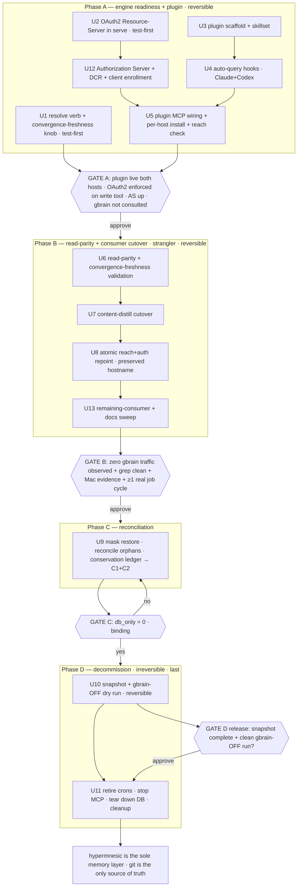

# feat: Decommission gbrain — hypermnesic as the sole memory layer (cutover Phase 2)

**Target repo:** `hypermnesic` (this repo, repo root). Engine + plugin `**Files:**`
paths are repo-relative. Operational units act on the **homelab**
(`homelab-hetzner-staging`, tailnet `100.103.0.55`) and the shared vault
`/home/ubuntu/gbrain-brain` (*the vault*) — those targets are written as `~/…` or
`gbrain-brain/…` (host/vault locations, not repo files). Execution pauses at **four
operator gates**. This is **Phase 2** — it builds on Phase 1
(`docs/plans/2026-06-02-008-feat-homelab-dogfood-cutover-plan.md`, completed), which
deployed hypermnesic as a coexisting disk-first committer with gbrain untouched.

---

## Summary

Make hypermnesic the single memory layer by shipping a Claude+Codex plugin first
(skillset + auto-query hooks + an OAuth2-authenticated self-hosted MCP), then swapping
gbrain's read/index role out of the one ingest job that uses it, repointing every
remaining gbrain consumer at hypermnesic, driving the DB-only orphan audit to zero, and
finally tearing down the restore cron + gbrain MCP + Supabase DB behind a snapshot.
Plugin-first and per-consumer cutover are reversible; only the zero-orphan-gated teardown
is irreversible, and it runs last.

---

## Problem Frame

Phase 1 left the homelab running **two** memory layers over one git tree: hypermnesic's
git-projection index and gbrain's Supabase DB. gbrain's DB→disk **restore cron** is a
tombstone-respecting safety net that has repeatedly bitten (the rename-orphan-resurrection
scar; the `.gitignore` `db_only` rewrite scar), the DB carries **DB-only orphans** out of
sync with disk, and every agent/operator must hold the DB-first lane, tombstone
discipline, and `GBRAIN_NO_GITIGNORE` pins in their head. The original "Phase 2 = migrate
DB-first writers to disk-first" framing is mostly moot — research confirms the ingest fleet
**already writes disk-first**; what actually blocks a single layer is read parity +
consumer cutover + reconciliation. (See origin for the full frame.)

Research sharpened the consumer surface: of the ingest fleet, **only `content-distill`**
reads/indexes gbrain; the other jobs are already gbrain-free. The real cutover targets are
content-distill, the auto-query hook (`gbrain_agent_hook.py`, Claude+Codex), the MCP
registrations, the healthcheck probe, and operator docs.

---

## Requirements

R-IDs R1–R11 mirror the origin requirements doc; R12 is **plan-added per user direction
(2026-06-02)** and deliberately supersedes origin's tailnet-only / OAuth-deferred boundary.

**Read parity & index swap**
- R1. hypermnesic covers the load-bearing read surface — hybrid search/recall sufficient
  for ingest **entity resolution** (resolve a name/phrase to an existing page/slug for
  wikilinking), at parity with how `gbrain search`/`gbrain get` are used today. Richer
  gbrain surfaces (timeline, salience, anomalies, code intel, takes) are NOT required.
- R2. The explicit disk→DB index step (`gbrain sync`/`extract`/`embed`) is removed from
  the job and replaced by hypermnesic's read-time convergence: write + commit, then query,
  sees the just-written content without an intervening index command.

**Plugin & adoption (ships first)**
- R3. A Claude + Codex plugin packages: (a) a hypermnesic skillset; (b) hooks that make
  hypermnesic querying automatic; (c) the self-hosted MCP wiring pointing at the tailnet
  master.
- R4. The plugin makes hypermnesic the default memory layer, installable on Claude Code
  and Codex, reachable from where agents run today (homelab + Mac, both on the tailnet).

**Consumer cutover**
- R5. Every gbrain dependency in the cron jobs + scripts + skills is replaced by the
  hypermnesic equivalent — reads → hypermnesic search/resolve; index step → removed
  (convergence). After cutover, no scheduled job depends on the `gbrain` CLI or MCP.
- R6. Cutover is **per-consumer and reversible**: each migrates and is proven independently;
  a failed migration reverts that one without blocking others (strangler-fig).

**Reconciliation (the restore-retirement gate)**
- R7. Drive the orphan audit's `db_only` count to zero without losing real content: purge
  tombstone-zombies from the DB; for genuine DB-only pages, materialize to disk or
  confirm-and-record as deleted.
- R8. The restore cron is retired **only after** `gbrain_supabase_orphan_audit.py` reports
  `db_only = 0`.

**Decommission & safety**
- R9. Once consumers are cut over and reconciliation reads zero, gbrain is turned off:
  restore + remaining gbrain crons disabled, gbrain MCP stopped, Supabase DB decommissioned.
  Irreversible end state.
- R10. Teardown is staged behind operator gates with a pre-teardown snapshot (DB dump +
  git tag + restic), mirroring Phase 1; each step verifiable.
- R11. Reversible at every step up to the final DB teardown — plugin, read-swap, per-consumer
  cutover all roll back to gbrain. Only the zero-orphan-gated teardown is irreversible.

**Authenticated reach (plan-added)**
- R12. hypermnesic's MCP is exposed as an **OAuth2-authenticated** endpoint (the engine as
  an OAuth 2.1 Resource Server, U2; a tailnet-internal Authorization Server, U12) and reachable
  at the preserved hostname `homelab.taildabf2.ts.net/mcp` via a **tailnet-internal
  `tailscale serve`** (not Funnel) pointed at hypermnesic on `100.103.0.55:8848`. The
  **write-enabled master must run auth-on** (engine invariant), the AS is **independent of
  gbrain's `--enable-dcr`**, and this supersedes the engine's "OAuth is a deferred seam"
  posture (`mcp_server.py` docstring; threat model — rewritten in U2, not merely annotated).

**Origin actors:** A1 (hypermnesic — becomes sole layer), A2 (gbrain — decommissioned),
A3 (Hermes ingest fleet — consumers to cut over), A4 (coding agents — adoption target),
A5 (operator — approves gates + runs teardown).
**Origin flows:** F1 (agent recall via the plugin), F2 (ingest job after cutover),
F3 (decommission cutover — the program spine).
**Origin acceptance examples:** AE1 (cut-over job: commit then recall, no gbrain index ran),
AE2 (one migrated job reverts; others stay migrated), AE3 (`db_only > 0` halts the program
at the reconciliation gate), AE4 (entity resolution good enough to wikilink, without
gbrain's graph/timeline/code tools).

---

## Scope Boundaries

- Not rebuilding gbrain's richer read tools in hypermnesic — timeline, salience/anomalies/
  contradictions/trajectory, code intelligence (`code_def`/`refs`/`callers`/`blast`),
  takes/calibration are out (not load-bearing; their loss is accepted).
- Not routing ingest through `commit_note` as a gateway — jobs write disk-first via plain
  git; the write path does not change.
- Not migrating writers to disk-first as net-new work — they already are; the "migration"
  is the read/index swap.
- Not re-opening Phase 1 (the coexisting committer, the gated write path, the path-scoped
  commit) — that shipped.
- Not adding off-tailnet / mobile reach or per-identity *authorization* policy beyond
  authenticating the endpoint. **OAuth2 authentication of the MCP is now IN scope (R12)**;
  what stays out is public/Funnel exposure and fine-grained per-user scopes beyond a single
  required scope.

### Deferred to Follow-Up Work

- **Retiring the repo-side `.gitignore` heal/lint guardrails** (`gbrain-repo-hygiene`,
  `heal_gbrain_gitignore.py`, `lint_gitignore.py`): keep them until the last `gbrain sync`
  caller is gone (after U7) and beyond — hypermnesic's threat model V7 also assumes
  `.gitignore` byte-stability. Their removal is optional cleanup, not part of teardown.
- **Capturing the decommission learnings** via `/ce-compound` after teardown lands.
- **Distributing the new hook/skills via chezmoi** as the durable cross-host mechanism, if
  the in-plugin hooks prove insufficient (see U4 Approach).

---

## Context & Research

### Relevant Code and Patterns

- `src/hypermnesic/graph.py` — `Graph._resolve` (`graph.py:70`) + resolution maps `_by_path`
  (`.md`-stripped, lowercased posix path → real path, `graph.py:46`) and `_by_stem`
  (lowercased stem → `list[path]`, `graph.py:47`). The exact name→page logic the `resolve`
  verb (U1) wraps; currently unexposed on CLI/MCP.
- `src/hypermnesic/cli.py` — `_cmd_retrieve` (`cli.py:135`, `--json`), the read twin of MCP
  `search`; `_cmd_converge` (`cli.py:187`); the `_cmd_*` + `set_defaults` argparse pattern.
  CLI `retrieve` currently **drops** `manual_reindex_recommended` (U1 surfaces it).
- `src/hypermnesic/mcp_server.py` — `build_server(...)` (`mcp_server.py:99`) builds
  `FastMCP("hypermnesic", host=, port=, streamable_http_path=, json_response=True)`; read
  tools `{search, build_context, think}`; write tool `commit_note` gated by `write_enabled`;
  `0.0.0.0` bind refusal. The OAuth2 params (U2) plumb here.
- `src/hypermnesic/converge.py` + `src/hypermnesic/config.py` — `converge(...)` is the
  shared read-path step (`converge.py:89`); `CONVERGE_DEBOUNCE_SECONDS = 5.0` (`config.py`)
  — the self-write-within-5s freshness caveat U1 addresses; `CONVERGE_MAX_DELTA_FILES = 200`
  → `oversized_delta`/`manual_reindex_recommended`; `EMBED_MODEL = "text-embedding-3-large"`,
  `EMBED_DIM = 1536` (held equal to gbrain — read-parity confirmed).
- `src/hypermnesic/install.py` — `_install_client` (`install.py:210`) writes
  `mcpServers.hypermnesic = {"type":"streamable-http","url":…}`; `render_systemd_unit`
  (master `ExecStart … serve --enable-write`). U2/U5 extend both for OAuth2.
- `obsidian-plugin/src/core.ts` — the proven MCP read-only client contract (JSON-RPC
  `tools/call`, read-tool allowlist, capability handshake, result-shape interfaces). The
  Claude+Codex plugin lifts this client pattern (U3/U5).
- `harness/parity_harness.py` + `harness/PARITY_VERDICT.md` + `harness/capture_gbrain_baseline.py`
  — French/English recall@10 / MRR vs a frozen gbrain baseline; the read-parity validation
  (U6) extends/reruns this against the entity-resolution patterns content-distill relies on.

### External operational surfaces (homelab / vault — read-only recon, 2026-06-02)

- **Ingest fleet** (`~/.hermes/cron/jobs.json`, Hermes scheduler): `content-distill`
  (`1d677f1a003a`) is the **only** ingest job touching gbrain — `gbrain search`/`gbrain get`
  (entity resolution) + `GBRAIN_NO_GITIGNORE=1 gbrain sync … && gbrain extract all … &&
  gbrain embed --stale` (the index step). granola-sync, readwise-ingest, x-bookmark-ingest,
  daily-worklog-enrichment are pure disk-first, zero gbrain calls.
- **Pieces LTM** (Mac, `~/.claude/skills/skillops-hourly-pieces-ltm-capture/`) — disk-first;
  *declares* the gbrain MCP in its `.omp/mcp.json` but the capture flow never calls gbrain
  (reads go to the Pieces MCP). Cutover = remove the stale declaration.
- **Reconciliation:** audit `gbrain-brain/scripts/ops/gbrain_supabase_orphan_audit.py`
  (outputs `db_only_true`/`db_only_slugs` after filtering `phantom_pairs`=157 Class-B case,
  `case_collision`=127, malformed, noncanonical); tombstones
  `~/.skillops/state/gbrain-supabase-restore/tombstones.json` (249 entries, key = `.md`-stripped
  slug); restore job `359ea3c94ec1` → `~/.hermes/scripts/gbrain-supabase-restore.sh` →
  `gbrain-brain/skills/gbrain-supabase-restore/scripts/gbrain_supabase_restore_wrapper.sh`
  (`gbrain export --restore-only`, tombstone-respecting).
- **gbrain serving:** `~/.config/systemd/user/gbrain-mcp-http.service` (`gbrain serve --http
  --port 3131 --enable-dcr`), exposed via **Tailscale Funnel** at
  `homelab.taildabf2.ts.net/mcp`. hypermnesic: `~/.config/systemd/user/hypermnesic.service`
  (`100.103.0.55:8848`, no auth, **not** behind the Funnel).
- **Other consumers:** Codex `~/.codex/config.toml` `[mcp_servers.gbrain]` (stdio) + Codex
  hooks `~/.codex/hooks.json` (`gbrain-agent-hook`); Claude project-scoped `gbrain serve` in
  `~/.claude.json`; chezmoi `~/.local/share/chezmoi/dot_codex/config.toml.tmpl` (a
  **duplicated** HTTP+stdio `[mcp_servers.gbrain]`) + `dot_codex/AGENTS.md.tmpl`; global
  `~/.claude/CLAUDE.md`; shell profiles (`GBRAIN_NO_GITIGNORE=1`, `OPENCLAW_WORKSPACE`);
  healthcheck `gbrain-automation-healthcheck` (`ff85e57bdf9d`, runs `gbrain stats`).
- **The auto-query reference:** `~/.claude/hooks/gbrain_agent_hook.py` (wrappers
  `~/.claude/hooks/gbrain-agent-hook`, `~/.codex/hooks/gbrain-agent-hook`, chezmoi-tracked):
  SessionStart → `additionalContext`; UserPromptSubmit → relevance gate → `gbrain search` →
  inject; PreToolUse → blocks dangerous `gbrain` commands. The gold reference for U4.
- **Claude plugin packaging:** `.claude-plugin/marketplace.json` + per-plugin
  `.claude-plugin/plugin.json` (+ `mcpServers`), `skills/<name>/SKILL.md`, `hooks/hooks.json`
  + `hooks/scripts/*` (`${CLAUDE_PLUGIN_ROOT}`, events SessionStart/UserPromptSubmit/PreToolUse/
  …), `.mcp.json`; Codex variant `.codex-plugin/plugin.json`. Verified against installed
  plugins under `~/.claude/plugins/`.

### Institutional Learnings

- `gbrain-brain/projects/homelab/learnings/2026-05-30-gbrain-rename-orphan-resurrection.md`
  — the restore cron actively resurrects deleted/moved slugs unless tombstoned; the orphan
  purge and the live restore are **mutually hostile** (mask the restore during U9).
- `gbrain-brain/projects/homelab/learnings/2026-05-31-gbrain-gitignore-db-only-guardrail.md`
  — every `gbrain sync`/`extract` rewrites `.gitignore` unless `GBRAIN_NO_GITIGNORE=1`;
  removing the index step (U7) removes a pollution source, but keep the heal/lint guardrails
  (deferred).
- `gbrain-brain/AGENTS.md` §5.1/§10 — the disk-first contract; the restore is a
  documentation-only safety net, so every DB-first writer must be off disk-first reliance
  **before** the cron dies (forces the teardown order).
- `gbrain-brain/projects/homelab/learnings/2026-05-29-skillops-to-hermes-cron-migration.md`
  — "decommission, don't delete" (disable, keep unit files for rollback); "parity = real
  output, not exit code" (verify each cutover produces a real recall-able page).
- `~/.claude/projects/-home-ubuntu-dev-hypermnesic/memory/homelab-gbrain-vault-multiwriter.md`
  — the vault is a hot multi-writer tree; the purge/materialize writer (U9) must be
  **path-scoped + tombstone-aware**, mirroring `commit_note`'s path-scoping (branch commit
  `02dd640`).
- `docs/threat-model-commit-note.md` — V1 protected-path denylist + `DEFAULT_WRITE_ALLOWLIST`
  (`notes/ sources/ dashboards/ captures/`): any consumer migrated onto `commit_note` whose
  target is outside the allowlist is refused (content-distill writes `sources/` + entity
  pages — verify targets). KTD5 "OAuth is a deferred seam" is the posture R12 supersedes.

### External References

- MCP Python SDK (`/modelcontextprotocol/python-sdk`, the engine's `mcp.server.fastmcp`):
  server-side OAuth 2.1 **Resource Server** pattern — `FastMCP(token_verifier=TokenVerifier(),
  auth=AuthSettings(issuer_url, resource_server_url, required_scopes))`, RFC 9728 Protected
  Resource Metadata discovery, RFC 8707 strict resource validation. The MCP server is the RS;
  a separate Authorization Server issues tokens and owns DCR. Grounds U2.
- FastMCP auth providers (`gofastmcp.com`) + `github.com/rb58853/mcp-oauth` — reference
  TokenVerifier / AS-glue implementations over streamable-http; informs the AS choice (U2
  deferred-to-impl).

---

## Key Technical Decisions

- **Plugin-first, then supply-side (hybrid sequence).** The plugin (skillset + hooks + MCP)
  is the highest-leverage, lowest-risk, reversible piece and delivers adoption immediately;
  the read-swap + reconciliation run underneath, with the irreversible off-switch gated on
  the zero-orphan audit. (see origin: Key Decisions)
- **Entity resolution gets a thin engine verb, not job-side post-processing.** gbrain's
  `get` (name→page) has no hypermnesic surface; `Graph._resolve` has the exact logic. A
  test-first `resolve --json` verb (and a small MCP read tool) is reusable and testable, vs.
  having content-distill scrape the `search` top-hit path. (U1) *(call-out, confirmed)*
- **OAuth2 = the engine becomes an OAuth 2.1 Resource Server (RS); the Authorization Server
  (AS) is its own unit.** Plumb `token_verifier` + `AuthSettings` into `build_server`/`FastMCP`
  (U2); the AS is **reused from the existing `honcho-oauth-proxy`** if it can mint audience-bound
  tokens for the `/mcp` resource, else built new (U12 — native-primitive-first). The AS is an
  always-on component every agent + the per-prompt hook depend on — its topology is pinned in
  planning, not deferred: tailnet-internal, gbrain-AS-independent (a SPOF for recall — see Risks);
  what OAuth buys over the existing tailnet bind is **per-identity attribution + a revocable write
  credential**, not a tighter trust boundary unless DCR is locked to static clients post-enrollment.
  The TokenVerifier internals stay deferred-to-impl. (U2, U12, R12)
- **`write_enabled ⇒ auth-required` is an engine invariant.** Auth is opt-in/additive so a
  read-only serve stays Phase-1-compatible — but a **write-enabled master refuses to start
  without auth configured**, mirroring the existing `0.0.0.0` bind refusal. This closes the
  footgun where a unit re-render or a Phase-1 rollback silently serves the write tool
  unauthenticated on the tailnet. (U2)
- **hypermnesic's AS is independent of gbrain's `--enable-dcr`.** No shared issuer/discovery/
  endpoint — otherwise U11 (which tears down gbrain's AS) would silently lock out hypermnesic
  after the irreversible delete. Proven at U10 (auth still works with gbrain's AS stopped). (U2, U12)
- **Preserve the hostname via tailnet-internal `tailscale serve`, not Funnel.** Keep
  `homelab.taildabf2.ts.net/mcp` resolving to hypermnesic:8848, tailnet-only (no public
  Funnel), OAuth2-fronted. Consumers keep their endpoint string; only the backend + auth
  change. (U8, R12) *(call-out, confirmed)*
- **The plugin lives in-repo as a marketplace.** A `plugin/` marketplace alongside
  `obsidian-plugin/`, versioned with the engine, installed per-host. Hooks ship inside the
  plugin; chezmoi cross-host distribution is the fallback. (U3) *(call-out, confirmed lean)*
- **Consumer cutover is narrow + strangler-fig.** Research found only content-distill reads/
  indexes gbrain; cutover = content-distill + the hook + MCP registrations + healthcheck +
  docs. Each flips independently and reverts to gbrain on failure. (U7, U13, R6)
- **Reconciliation is its own gated workstream.** Mask the restore cron (fail-closed), purge tombstone-
  zombies (`gbrain delete` + tombstone-first, path-scoped), materialize/record genuine
  DB-only, re-run the audit to zero — the binding gate on retiring the restore. (U9)
- **Teardown last, snapshot-first, dry-run-proven.** Stop the gbrain MCP and prove a clean
  agent-stack run with gbrain *stopped but not yet deleted* (reversible) before the
  irreversible Supabase teardown. (U10/U11)

---

## Open Questions

### Resolved During Planning

- *AS topology (pinned, not deferred)* → the Authorization Server is **tailnet-internal,
  co-located on the homelab**, independent of gbrain's AS; OAuth buys per-identity attribution
  + a revocable write credential (not a tighter trust boundary than the tailnet bind); the
  write-enabled master runs auth-on. The *specific AS product* and TokenVerifier internals stay
  deferred. (R12, U2, U12)
- *Consumer surface* → only content-distill reads/indexes gbrain; the rest of the fleet is
  gbrain-free (verified). The cutover also covers the hook, MCP registrations, healthcheck,
  and docs (success criterion: "no scheduled job/script/skill references gbrain CLI/MCP").
- *Entity-resolution shape* → a thin `resolve` verb wrapping `Graph._resolve` (U1); the job
  strips `.md` from the resolved path to wikilink. (origin Deferred-to-Planning, R1)
- *Pieces LTM* → disk-first, only *declares* the gbrain MCP; cutover is removing the stale
  declaration (U8). (origin Deferred-to-Planning, R5)
- *Orphan breakdown* → the audit already classifies `db_only_true` after stripping
  `phantom_pairs`/`case_collision`/malformed/noncanonical; the 249-entry tombstone set is the
  zombie cohort. U9 reruns the audit fresh for the current binding count. (origin, R7)
- *Auto-query hook mechanism* → Claude `SessionStart` (context) + `UserPromptSubmit`
  (`additionalContext` from a relevance-gated hypermnesic search) + `PreToolUse` guard;
  Codex via `~/.codex/hooks.json`. Modeled on `gbrain_agent_hook.py`. (origin, R3)
- *Reach + auth* → tailnet-internal `tailscale serve` preserving the hostname, OAuth2-fronted
  (R12, user-directed).

### Deferred to Implementation

- [Affects R12][Needs research] **Can `honcho-oauth-proxy` mint audience-bound (RFC 8707) tokens
  for `resource_server_url = homelab.taildabf2.ts.net/mcp` with the required scope?** If yes, U12
  is an *enrollment* unit (reuse); if no, it deploys a new minimal AS — settled by the U12
  native-primitive evaluation/spike before Gate A. Token lifetime ceiling + revocation values are
  tuned at impl.
- [Affects U8][Needs research] **The actual `tailscale serve` map:** gbrain serves at the hostname
  **root `/`** (not `/mcp`) with Funnel on and `honcho` co-tenant at `/honcho` + `.well-known/*`.
  U8 records the live map and confirms which exact endpoint string each consumer uses, so the
  repoint is a per-path serve change (point `/mcp`→hypermnesic, move gbrain off `/`) that leaves
  honcho's routes intact — not a hostname-wide Funnel toggle.
- [Affects R2/AE1] Whether content-distill needs the U1 force-converge knob for deterministic
  self-write recall, or read-time convergence + the post-merge hook suffice at its cadence.
- [Affects R7] The exact disposition of each genuine `db_only_true` page (materialize vs.
  confirm-deleted) — known only when U9 runs the fresh audit.
- [Affects R9] The Supabase teardown mechanism (gbrain's own teardown vs. Supabase
  dashboard/MCP vs. dropping the DB) and whether `~/.gbrain/config.json` `database_url` points
  at managed Supabase or self-hosted Postgres — confirm at U11 behind the snapshot.

---

## Output Structure

The plugin is the one greenfield directory hierarchy (engine + ops units modify existing
files / host state). Expected layout:

    plugin/                                    # Claude+Codex plugin marketplace (new)
      .claude-plugin/
        marketplace.json                       # lists the hypermnesic plugin
      plugins/
        hypermnesic/
          .claude-plugin/plugin.json           # Claude manifest (name, version, mcpServers)
          .codex-plugin/plugin.json            # Codex manifest (skills + interface)
          skills/
            hypermnesic-memory/SKILL.md        # the skillset (search/recall/commit_note/disk-first)
          hooks/
            hooks.json                         # SessionStart + UserPromptSubmit + PreToolUse
            scripts/
              hypermnesic_agent_hook.py        # the auto-query hook (Claude+Codex, --host)
          .mcp.json                            # self-hosted MCP wiring (OAuth2 client)
      README.md                                # install steps (both hosts), reach/auth notes

This is a scope declaration, not a constraint — the implementer may adjust layout if a better
shape emerges. The per-unit `**Files:**` sections remain authoritative.

---

## High-Level Technical Design

> *This illustrates the intended approach and is directional guidance for review, not
> implementation specification. Treat it as context, not code to reproduce.*



Gates A–C are review gates after autonomous work; Gate D *releases* the irreversible
teardown (U10→U11). On any gate HALT the agent stops autonomous progression, surfaces the
failing signal as the gate artifact, and awaits an operator decision.

---

## Implementation Units

Dependency shape: U1 and U2 are independent engine units; U2→U12 (the AS that issues the
tokens U2 validates); U3→U4→U5 build the plugin, and U5 also needs U12's enrolled client +
the authenticated endpoint. Phase B is a linear chain gated on U6's parity verdict; U8 (atomic
reach+auth repoint) precedes U13 (the per-consumer + docs sweep). Phase C is a single gated
unit. Phase D splits the reversible dry-run (U10) from the irreversible teardown (U11).

New U-IDs from the deepening pass (U12, U13) take the next unused numbers and sit with their
phase, not in document-linear order — U12 in Phase A (after U2), U13 in Phase B (after U8).

### Phase A — Engine readiness + plugin (ships first; reversible)

### U1. `resolve` entity-resolution verb + convergence-freshness knob (read-parity enablers)

**Goal:** Expose name→page resolution (gbrain's `get` role) and make a self-write recall-able
deterministically, so an ingest job can consume hypermnesic for entity resolution without a
thin job-side adapter.

**Requirements:** R1, R2.

**Dependencies:** None.

**Files:**
- Modify: `src/hypermnesic/cli.py` (add `_cmd_resolve`; surface `manual_reindex_recommended`
  in `_cmd_retrieve`; add a `--now`/`--debounce 0` knob to **`_cmd_retrieve` and `_cmd_converge`**,
  threading `debounce_seconds=0` into the `converge` call each makes)
- Modify: `src/hypermnesic/mcp_server.py` (optional read tool `resolve` wrapping
  `graph.Graph._resolve`)
- Modify (if needed): `src/hypermnesic/graph.py` (expose a small public `resolve(name)`
  returning the resolved `.md` path or `None`, wrapping `_resolve`/`_by_path`/`_by_stem`)
- Test: `tests/test_cli.py`, `tests/test_graph.py`, `tests/test_mcp_server.py`,
  `tests/test_converge.py`

**Approach:**
- `resolve <name>` returns the resolved repo-relative `.md` path (or `null`) — exact-path,
  `.md`-suffix, and unambiguous-stem matching, exactly as `_resolve` already does; ambiguous
  stems return `null` (or the candidate list) rather than guessing. The caller strips `.md` to
  wikilink. `--json` output, `ensure_ascii=False`, matching the existing `_cmd_*` convention.
- The convergence knob must thread into **`_cmd_retrieve`'s own internal `converge` call** (which
  today runs with the default 5 s debounce), not only `_cmd_converge` — so the deterministic
  self-write path is a single **`retrieve --now`**. A separate `converge --now` followed by a
  plain (debounced) `retrieve` does NOT close the window: the first converge writes a fresh
  debounce stamp, so retrieve's own converge short-circuits and won't catch a commit landing
  between the two commands. `_cmd_retrieve` additionally emits `manual_reindex_recommended` (today
  only the MCP path does), so a CLI consumer sees oversized-delta degradation.

**Execution note:** Test-first — name→path resolution (exact / suffix / unambiguous-stem /
ambiguous→null), the forced-converge freshness behavior, and the CLI `manual_reindex`
surfacing are the spec.

**Patterns to follow:** `Graph._resolve` + `_by_path`/`_by_stem` (`src/hypermnesic/graph.py`);
the `_cmd_*` + `set_defaults` + `--json` argparse pattern (`src/hypermnesic/cli.py`).

**Test scenarios:**
- `Covers AE4.` Happy path: `resolve "Hetzner"` → `infrastructure/hetzner.md` (or the real
  path); caller can strip `.md` to a wikilink target.
- Edge case: an unambiguous stem with one match resolves; an ambiguous stem (two pages share a
  stem) returns `null`/candidates, never a wrong guess.
- Edge case: a missing name → `null`, not an error; non-ASCII names resolve.
- `Covers AE1.` Integration: write + commit a new note, then a single **`retrieve --now`** within
  5 s returns it (its internal converge runs non-debounced) — and the default (no-`--now`)
  debounced path still skips (the existing contract is preserved).
- Edge case: `retrieve --json` includes `manual_reindex_recommended` (true on an oversized
  delta).

**Verification:** `uv run pytest tests/test_cli.py tests/test_graph.py tests/test_mcp_server.py
tests/test_converge.py` green; `resolve --json` returns the resolved path for a known entity
and `null` for an ambiguous/missing one; a forced converge makes a fresh self-write recall-able.

### U2. OAuth2 Resource-Server capability in `serve`

**Goal:** Let `hypermnesic serve` authenticate MCP requests as an OAuth 2.1 Resource Server,
so the endpoint can carry per-identity auth (replacing gbrain's bearer/DCR) without leaving
the tailnet.

**Requirements:** R12, R3, R4.

**Dependencies:** None.

**Files:**
- Create: `src/hypermnesic/auth.py` (a `TokenVerifier` implementation + `AuthSettings` glue)
- Modify: `src/hypermnesic/mcp_server.py` (`build_server` accepts `token_verifier` +
  `auth`/`AuthSettings`, passes them into `FastMCP`; auth is optional — omitting it preserves
  today's tailnet-only-no-auth build)
- Modify: `src/hypermnesic/cli.py` (`_cmd_serve` flags: `--auth-issuer-url`,
  `--auth-resource-url`, `--required-scope`; enabling auth requires the issuer + resource URLs)
- Modify: `src/hypermnesic/install.py` (`render_systemd_unit` renders the auth flags on the
  master `ExecStart`)
- Modify: `docs/threat-model-commit-note.md` (the RS threat-model section); `src/hypermnesic/mcp_server.py` docstring (KTD5)
- Test: `tests/test_mcp_server.py`, `tests/test_auth.py` (new), `tests/test_cli.py`,
  `tests/test_install.py`

**Approach:**
- Mirror the MCP Python SDK Resource-Server pattern: `FastMCP(..., token_verifier=…,
  auth=AuthSettings(issuer_url, resource_server_url, required_scopes=[…]))`. The MCP server
  validates tokens; the **AS that issues them is U12** (topology pinned: tailnet-internal,
  gbrain-AS-independent). Enforce **RFC 8707 strict resource validation** — a structurally
  valid token minted for a *different* RS on the tailnet must be rejected (audience binding).
- **`write_enabled ⇒ auth-required` invariant.** Auth is opt-in/additive for a *read-only*
  serve (no flags → the Phase-1 unauthenticated tailnet build), but a **write-enabled master
  refuses to start without auth configured** — a new startup guard mirroring the `0.0.0.0`
  bind refusal. This is the highest-leverage footgun-closer: a unit re-render or a Phase-1
  rollback can no longer silently serve `commit_note` unauthenticated.
- Unauthenticated/invalid/insufficient-scope requests are rejected before any tool runs;
  RFC 9728 Protected Resource Metadata is advertised for AS discovery.
- **Rewrite the RS threat-model section** in `docs/threat-model-commit-note.md` (not just an
  annotation): the new vectors are token-validation bypass, audience/issuer confusion (cross-RS
  token replay), AS-compromise blast radius, and the inverted failure mode where an auth bug
  *opens* the write surface. Update the `mcp_server.py` docstring (KTD5 superseded).

**Execution note:** Test-first, security-sensitive — the spec is: valid token → tool runs;
missing/invalid/expired token → rejected; wrong/insufficient scope → rejected; no-auth-flags →
unauthenticated build unchanged.

**Technical design:** *(directional)*

```python
# build_server(..., token_verifier=None, auth=None) → FastMCP
# CLI: serve --auth-issuer-url https://…/ --auth-resource-url https://homelab.taildabf2.ts.net/mcp
#               --required-scope memory
mcp = FastMCP("hypermnesic", host=host, port=port, streamable_http_path=path,
              json_response=True,
              token_verifier=verifier,          # hypermnesic.auth.TokenVerifier (or None)
              auth=auth_settings)               # AuthSettings(issuer_url, resource_server_url, [scope]) or None
```

**Patterns to follow:** `build_server` kwargs + the bind invariant (`src/hypermnesic/mcp_server.py`);
MCP Python SDK `mcp.server.auth.{provider.TokenVerifier, settings.AuthSettings}`; the
`render_systemd_unit` ExecStart interpolation (`src/hypermnesic/install.py`).

**Test scenarios:**
- Happy path: a request with a valid token + required scope reaches the tool; the response is
  unchanged from the no-auth shape.
- Error path: missing token → rejected (no tool run); invalid/expired token → rejected;
  valid token lacking the required scope → rejected.
- Error path (audience binding, RFC 8707): a structurally valid token whose audience is **not**
  this resource URL → rejected (no cross-RS token replay on the tailnet).
- Edge case: **`write_enabled=True` + no auth configured → startup refused** with a clear error
  (the new invariant, mirroring the `0.0.0.0` refusal); a read-only serve with no auth still
  builds (Phase-1 parity).
- Edge case: no auth flags on a read-only serve → `build_server` builds the existing
  unauthenticated tailnet server; `--auth-issuer-url` without `--auth-resource-url` → refused.
- Edge case: auth + a `0.0.0.0`/empty host → still refused (bind invariant first).
- Integration: the rendered master `.service` ExecStart carries the auth flags and the unit
  starts.

**Verification:** `uv run pytest tests/test_auth.py tests/test_mcp_server.py tests/test_cli.py
tests/test_install.py` green; an authenticated serve rejects an unauthenticated `tools/call`,
rejects a wrong-audience token, refuses to start write-enabled without auth, and serves an
authenticated one; a no-auth read-only serve behaves exactly as Phase 1.

### U12. Authorization Server + DCR + cross-host client enrollment

**Goal:** Provide the Authorization Server that issues/validates the tokens U2's Resource Server
checks, enroll all three agent identities (homelab Claude, homelab Codex, Mac), and own the
credential lifecycle — **reusing the existing homelab AS if it fits**, so OAuth2 is a complete,
operable system, not RS plumbing with no token issuer.

**Requirements:** R12, R4.

**Dependencies:** U2 (the RS that consumes its tokens). Feeds U5 (the plugin's enrolled client)
and Gate A (no Gate-A criterion is achievable without a live AS).

**Files:**
- Operational: an AS endpoint + its `tailscale serve` route on the homelab; the per-host client
  credentials (env/secret store, **never committed**)
- Possibly: `src/hypermnesic/auth.py` discovery/metadata glue if the AS is co-resident with the engine
- Mirror: `gbrain-brain/projects/homelab/services/` + `LOG.md`

**Approach:**
- **Native-primitive first (non-negotiable): evaluate reusing `honcho-oauth-proxy`.** An OAuth 2.1
  AS already runs on this homelab — `honcho-oauth-proxy.service` (127.0.0.1:8788) serving
  `/.well-known/oauth-authorization-server`, `/register` (DCR), `/authorize`, `/token`, `/revoke`,
  and read/write scopes on the same `homelab.taildabf2.ts.net` hostname (documented in
  `gbrain-brain/projects/homelab/services/honcho.md`). If it can mint **audience-bound** (RFC 8707)
  tokens for `resource_server_url = homelab.taildabf2.ts.net/mcp` with the required scope, **U12
  collapses to enrollment** (the three identities + a hypermnesic protected-resource discovery
  route) — no new server. Building a new AS is justified **only** if honcho cannot satisfy the
  audience/scope requirements, and that finding must be recorded. This also de-risks Gate A:
  reusing a running AS removes the "stand up an unknown AS product" item from the Gate-A critical
  path; if a new AS is unavoidable, a compatibility spike (issue a token → present to a local
  FastMCP RS build → confirm 200/401) runs in parallel with U1/U2/U3 before Gate A depends on it.
- Whichever AS is used, it must be **independent of gbrain's `--enable-dcr`** (no shared issuer/
  discovery/endpoint — otherwise U11 locks out hypermnesic; honcho's AS is already gbrain-independent).
  Pinned decisions: a token **lifetime ceiling** + a **revocation mechanism** (the master is
  write-enabled — a leaked long-lived token is a standing write primitive); and the **DCR policy**
  — DCR on a tailnet AS lets any tailnet node enroll, so to keep write access tighter than "any
  tailnet node" either gate enrollment on an out-of-band initial-access-token or **lock DCR to
  static clients after the three identities are enrolled** (recommended). State the chosen posture
  explicitly; bare DCR buys attribution, not a tighter trust boundary.
- **Bootstrap / chicken-and-egg:** define how the *first* client on each host obtains a credential
  (initial-access-token, pre-seeded static client, or open-on-tailnet DCR) — undefined bootstrap
  is the single most likely "agents can't authenticate" failure.
- **Credential lifecycle:** one documented mechanism provisions all three identities; credentials
  live in an env/secret store (never committed — extend threat-model V9); a named owner handles
  rotation + revocation. Decommission the old `GBRAIN_MCP_TOKEN` from the Mac's env/profile as an
  explicit cleanup (paired with U13/U11).
- **SPOF note:** a tailnet-internal AS that's down blackholes recall (the auto-query hook hits it
  every prompt) — record its availability posture in Risks + the post-teardown monitoring (U11).

**Execution note:** `Test expectation: none for the deploy act -- operational, verified by the
Gate-A checklist (authenticated round-trip from a second tailnet peer) + the credential-provisioning
checklist for all three identities.`

**Patterns to follow:** gbrain's `gbrain serve --http --enable-dcr` topology (as the shape to
replace, NOT to share endpoints with); the MCP Python SDK AS/RS split; the homelab service-doc shape.

**Test scenarios:**
- `Test expectation: none` (operational). The Gate-A checklist + the provisioning checklist are
  the verification.

**Verification:** rolls up into the **Gate-A checklist**: a live AS issues a token a second tailnet
peer uses to reach the RS; all three identities are provisioned by the documented mechanism;
revocation of a test token is demonstrated; the AS shares no endpoint with gbrain's AS.

### U3. Plugin scaffold + hypermnesic skillset

**Goal:** A greenfield in-repo Claude+Codex plugin marketplace whose skillset teaches agents
when/how to use hypermnesic (search/recall, `resolve`, `commit_note`, the disk-first model).

**Requirements:** R3 (a), R4.

**Dependencies:** None (the skill content references U1 verbs but the scaffold can land first).

**Files:**
- Create: `plugin/.claude-plugin/marketplace.json`
- Create: `plugin/plugins/hypermnesic/.claude-plugin/plugin.json`
- Create: `plugin/plugins/hypermnesic/.codex-plugin/plugin.json`
- Create: `plugin/plugins/hypermnesic/skills/hypermnesic-memory/SKILL.md`
- Create: `plugin/README.md`
- Test: `tests/test_plugin.py` (new, static validation — manifest shape, marketplace lists the
  plugin, skill frontmatter parses, no secrets)

**Approach:**
- `marketplace.json` lists the `hypermnesic` plugin (`source: ./plugins/hypermnesic`); the
  Claude `plugin.json` carries name/version/description/keywords; the Codex `.codex-plugin/
  plugin.json` adds `"skills": "./skills/"` + an `interface` block. Mirror the structure of
  installed plugins under `~/.claude/plugins/`.
- The SKILL teaches: search/recall via the MCP read tools; `resolve` for entity → wikilink;
  `commit_note` writes (git-first, allowlist `notes/ sources/ dashboards/ captures/`,
  protected-path refusals); the disk-first model (git is the source of truth, the index is a
  projection). It explicitly tells agents **not** to reach for gbrain.

**Execution note:** `Test expectation: static validation only` — the SKILL is prose; the test
asserts manifest/marketplace/frontmatter validity, not behavior.

**Patterns to follow:** installed plugin layout under `~/.claude/plugins/`
(`.claude-plugin/{marketplace,plugin}.json`, `.codex-plugin/plugin.json`, `skills/*/SKILL.md`);
the read-tool contract documented in `obsidian-plugin/README.md`; `tests/test_obsidian_plugin.py`
as the static-validation test shape.

**Test scenarios:**
- Happy path: `marketplace.json` parses and lists `hypermnesic` with a valid `source`; both
  manifests parse and carry required fields.
- Edge case: the SKILL.md frontmatter (`name`, `description`) parses; the body references the
  real tool names (`search`, `build_context`, `think`, `resolve`, `commit_note`) — not
  nonexistent ones.
- Edge case: no secrets/tokens committed in any plugin file (scan).

**Verification:** `uv run pytest tests/test_plugin.py` green; the marketplace + manifests are
installable shapes; the skill names only real tools.

### U4. Auto-query hooks (Claude + Codex)

**Goal:** Make hypermnesic querying automatic — surface relevant context on session/prompt
start without a human or agent remembering to ask — replacing the gbrain auto-query hook.

**Requirements:** R3 (b).

**Dependencies:** U3 (the hook ships inside the plugin), U1 (the hook calls `resolve`/`retrieve`).

**Files:**
- Create: `plugin/plugins/hypermnesic/hooks/hooks.json`
- Create: `plugin/plugins/hypermnesic/hooks/scripts/hypermnesic_agent_hook.py`
- Test: `tests/test_plugin_hook.py` (new — relevance gate, query construction, graceful timeout,
  no-noise behavior)

**Approach:**
- Port `gbrain_agent_hook.py` to hypermnesic: **SessionStart** → `additionalContext` orienting
  the agent to hypermnesic; **UserPromptSubmit** → a relevance gate (keyword/proper-noun) →
  bounded `hypermnesic retrieve`/`resolve` (short timeout) → inject hits as `additionalContext`;
  **PreToolUse** → guard the dangerous engine ops (no auto full-reindex, etc.). Keep it quiet —
  no injection when the relevance gate misses or the query times out.
- `hooks.json` wires the events with `${CLAUDE_PLUGIN_ROOT}`-relative script paths. The same
  script runs under Codex via `--host codex` (the existing wrapper pattern at
  `~/.codex/hooks/`).
- Calls hypermnesic, **never gbrain**; the existing gbrain hook wrappers are retired/repointed
  during U8 (and their chezmoi-tracked copies updated).
- **Steady-state token acquisition (specify, don't let the impl invent it):** post-cutover the
  endpoint is authenticated, and the hook fires every prompt — so it reads its token from the
  U12-provisioned source (e.g. a `HYPERMNESIC_MCP_TOKEN` env var), never logs the value, and on a
  missing/empty token degrades **identically to the 401/timeout path** (silent, non-blocking). Do
  not mint a token per prompt (a per-prompt AS round-trip would add latency + couple the hook to
  AS availability beyond the already-noted SPOF).

**Execution note:** Test-first — relevance-gated query, bounded-timeout graceful degradation,
and no-noise-on-miss are the spec.

**Patterns to follow:** `~/.claude/hooks/gbrain_agent_hook.py` (relevance gate, bounded lookup,
SessionStart context, `--host` switch); the `hooks/hooks.json` + `hooks/scripts/*` plugin
pattern from installed hook-shipping plugins.

**Test scenarios:**
- Happy path: a prompt naming an entity passes the relevance gate → the hook runs a bounded
  hypermnesic query → injects hits as `additionalContext`.
- Edge case: an off-topic prompt fails the relevance gate → no injection (no noise).
- Error path: the query times out / the endpoint is down → the hook returns cleanly with no
  injection, never blocking the turn.
- Error path (auth-cutover window): the endpoint is **up and returns 401/403** → the hook
  degrades **exactly like a timeout** (silent, no injection, never blocks the turn) — so the
  auth rollout in U8 can't turn the per-prompt hook into a turn-blocking 401 storm.
- Edge case: SessionStart returns the orientation context; PreToolUse blocks a guarded
  dangerous command.
- Integration: the same script under `--host claude` and `--host codex` produces the
  host-appropriate output shape.

**Verification:** `uv run pytest tests/test_plugin_hook.py` green; on a relevant prompt the hook
injects hypermnesic context, on an irrelevant one it stays silent, and a dead endpoint never
blocks the turn.

### U5. Plugin MCP wiring + per-host install + reach verification

**Goal:** Wire the plugin's self-hosted MCP at the authenticated tailnet endpoint, install on
both hosts, and verify agents reach hypermnesic over the tailnet.

**Requirements:** R3 (c), R4, R12.

**Dependencies:** U2 (authenticated endpoint), U12 (enrolled client / token), U3 (plugin),
U4 (hooks).

**Files:**
- Create: `plugin/plugins/hypermnesic/.mcp.json` (and/or `mcpServers` in the Claude
  `plugin.json`) — the OAuth2 client wiring to the master endpoint
- Modify: `src/hypermnesic/install.py` (`_install_client` emits the OAuth2 client config shape,
  not just a bare streamable-http URL)
- Test: `tests/test_install.py`
- (No repo source for the install act itself — operates on each host; verified by a checklist.)

**Approach:**
- **Resolve the dangling-target window:** the preserved hostname still resolves to gbrain until
  U8. So at Gate A the plugin points at the **authenticated direct endpoint**
  (`100.103.0.55:8848`), and U8 repoints both the hostname and the plugin's configured target to
  it — OR U8's atomic repoint is pulled forward as a Gate-A dependency so the hostname means
  hypermnesic from Gate A onward (preferred; the repoint is reversible). Either way the plugin
  never points at a hostname that still serves gbrain. `_install_client` grows an OAuth-aware
  variant of the `mcpServers.hypermnesic` entry while preserving other servers.
- Install per host: Claude via the in-repo marketplace; Codex via the `.codex-plugin` manifest
  (skills are symlink-shared). Each of the three identities is provisioned via U12's documented
  credential mechanism (single checklist — no per-host divergence). Verify a `tools/list` +
  `search` from a second tailnet peer (the Mac) returns hits over the **authenticated** endpoint,
  and the auto-query hook fires.
- **The emitted client config carries no secret material** — only the endpoint URL + the
  issuer/discovery reference and a *pointer* to how the token is obtained at runtime (e.g. a
  `HYPERMNESIC_MCP_TOKEN` env var, a `token_file` path, or the MCP client SDK's OAuth flow at
  connect time). MCP client config files (`~/.claude.json`, Codex `config.toml`, `.mcp.json`) are
  plaintext and chezmoi-tracked, so a client secret must never be inlined into them (extends
  threat-model V9). The exact client-config field shape per host is a dependency on the U12 AS
  choice — name it once U12 settles, don't let `_install_client` invent a secret-bearing variant.

**Execution note:** `Test expectation: none for the install act -- operational, verified by the
Gate-A checklist; the client-config-emission shape is covered by tests/test_install.py.`

**Patterns to follow:** `_install_client` (`src/hypermnesic/install.py`) + its existing
`tests/test_install.py` assertions; the plugin `mcpServers`/`.mcp.json` pattern.

**Test scenarios:**
- Happy path: `_install_client` writes an OAuth2-aware `mcpServers.hypermnesic` entry and
  preserves existing servers.
- Edge case: a malformed/absent client config is reset cleanly (existing behavior preserved).
- `Test expectation: none` for the per-host install act (operational; Gate-A checklist verifies).

**Verification:** rolls up into the **Gate-A checklist**; the emitted config is OAuth2-aware and
points at the preserved hostname.

→ **GATE A: plugin live, both hosts, OAuth2 enforced on the write tool, AS up, gbrain not
consulted by the plugin.**

PASS requires ALL of: a **live AS** (U12) issues a token a second tailnet peer uses; all three
identities (homelab Claude, homelab Codex, Mac) provisioned via the documented mechanism; the
plugin installed on Claude + Codex; a `tools/list` + `search` from the Mac over the
**authenticated endpoint** returns hits **with OAuth2 enforced** — specifically an
unauthenticated `tools/call` to **`commit_note`** is rejected (not just `search`), and a
wrong-audience token is rejected (RFC 8707); the write-enabled master is verified **auth-on**
(it would refuse to start auth-off); the auto-query hook injects context on a relevant prompt,
stays silent otherwise, and **degrades silently on a 401**; the SKILL is loadable on both hosts;
**the plugin path never calls gbrain**. HALT IF any item fails. *(Reversible: uninstall the
plugin; gbrain untouched.)*

### Phase B — Read-parity + consumer cutover (strangler; reversible)

### U6. Read-parity validation for entity resolution

**Goal:** Prove hypermnesic's search/`resolve` is good enough for the entity-resolution
patterns content-distill relies on, **before** flipping the job.

**Requirements:** R1.

**Dependencies:** U1, Gate A.

**Files:**
- Modify: `harness/parity_harness.py` (or a sibling) to add an entity-resolution query set
  derived from content-distill's actual `gbrain search`→slug patterns
- Modify/produce: `harness/PARITY_VERDICT.md` (the verdict artifact)
- Test: `tests/test_parity_harness.py`

**Approach:**
- Extend the existing French/English recall@10 / MRR harness with the resolve-to-slug cases
  the job needs (resolve a named entity to an existing page good enough to wikilink). Compare
  hypermnesic vs. the frozen gbrain baseline. The verdict gates U7.
- **Also validate the no-index-step freshness U7 bets on** (R2/AE1), not just resolution
  quality: commit a content-distill-sized delta, then `converge --now` + retrieve within the
  debounce window, and assert recall — so `safe_to_cut_over` covers both dimensions U7 flips
  simultaneously (resolution parity **and** index-freshness-without-gbrain). A content-distill
  delta near `CONVERGE_MAX_DELTA_FILES`=200 that trips `oversized_delta` is a verdict signal.

**Execution note:** Validation, not behavior change; reuses the harness's offline-deterministic
fixtures where possible.

**Patterns to follow:** `harness/parity_harness.py`, `harness/capture_gbrain_baseline.py`,
`harness/corpus_equivalence.py`; `tests/test_parity_harness.py`.

**Test scenarios:**
- `Covers AE4.` Happy path: for the entity-resolution query set, hypermnesic resolves to the
  correct existing page at parity with gbrain (recall@10 / MRR within the harness's verdict
  threshold).
- Edge case: an entity with no existing page → both layers miss (no false wikilink target).
- Integration (freshness): a committed content-distill-sized delta is recall-able via
  `converge --now` + retrieve with **no** `gbrain sync`/`extract`/`embed` — the convergence-only
  path U7 depends on.
- Error path: a parity regression beyond threshold **or** a freshness miss → `safe_to_cut_over:
  false`, U7 does not proceed.

**Verification:** a `PARITY_VERDICT` artifact exists showing entity-resolution parity; a
regression halts the cutover at Gate B.

### U7. content-distill cutover (the one ingest job that reads/indexes gbrain)

**Goal:** Swap content-distill's gbrain reads → hypermnesic and remove its `sync`/`extract`/
`embed` index step, proven recall-able and reversible.

**Requirements:** R2, R5, R6.

**Dependencies:** U6 (parity verdict).

**Files:**
- Modify: the content-distill job prompt/script in `~/.hermes/cron/jobs.json` (job
  `1d677f1a003a`) and any `gbrain-brain/skills/content-distill/scripts/*` it calls — swap
  `gbrain search`/`gbrain get` → `hypermnesic retrieve`/`resolve`; delete the Step-9
  `gbrain sync && gbrain extract && gbrain embed` block
- Mirror: `gbrain-brain/projects/homelab/services/` + `LOG.md` (homelab change discipline)

**Approach:**
- Reads: replace entity resolution with `hypermnesic resolve <name> --json` (strip `.md` to
  wikilink) + `hypermnesic retrieve` for semantic recall. Index step: **removed** — committed
  markdown is recall-able via read-time convergence (no `gbrain sync`/`extract`/`embed`).
- **Reversible (strangler):** keep the gbrain read/index path disabled-but-restorable (commented
  or behind a flag) so a failed proof reverts this one job to gbrain while every other consumer
  stays put. Verify a **real recall-able page**, not exit 0 (the "parity = real output" learning).
- Verify the write targets are inside the `commit_note` allowlist if any path routes through it
  (content-distill writes `sources/` + entity pages — confirm entity-page prefixes).

**Execution note:** Prove the disk-first/hypermnesic path produces a real recall-able result
before disabling the gbrain path; keep the revert one step away.

**Patterns to follow:** the existing content-distill job structure in `~/.hermes/cron/jobs.json`;
the "decommission, don't delete" rollback shape
(`gbrain-brain/projects/homelab/learnings/2026-05-29-skillops-to-hermes-cron-migration.md`).

**Test scenarios:**
- `Covers AE1.` Happy path: a content-distill run writes a new note + commits, then queries
  hypermnesic for it and resolves entities — recall-able with **no** `gbrain sync`/`extract`/
  `embed` having run.
- `Covers AE4.` Integration: entity resolution via `resolve` produces a wikilink to an existing
  page, without gbrain.
- `Covers AE2.` Error path: a parity miss / failed proof → revert this job to gbrain; other
  consumers unaffected.
- Edge case: an entity-page write target outside the allowlist is surfaced (refused), not
  silently dropped.

**Verification:** a content-distill run is recall-able through hypermnesic with no gbrain index
step; the revert path is proven to restore the gbrain lane for this job alone.

### U8. Atomic reach + auth repoint (the preserved hostname → hypermnesic)

**Goal:** Repoint `homelab.taildabf2.ts.net/mcp` from gbrain to the OAuth2-authenticated
hypermnesic backend in one atomic, reversible flip — and start observing gbrain so a missed
consumer becomes visible (zero-traffic proof), not silent.

**Requirements:** R12, R4, R6.

**Dependencies:** U2, U12, U5 (authenticated endpoint + enrolled clients + plugin), U7 (ingest
off gbrain).

**Files:**
- **Record the live serve map first** (`tailscale serve/funnel status`): today gbrain is at the
  hostname **root `/`** (→ `127.0.0.1:3131`, Funnel on), `honcho` co-tenants at `/honcho` +
  `.well-known/*`, and `/mcp` is currently free. The repoint is therefore a **per-path serve
  change** — point `/mcp` (or the path consumers actually use) → hypermnesic `100.103.0.55:8848`
  and move gbrain off `/` — **not** a hostname-wide Funnel toggle that would disrupt honcho's routes
- Instrument gbrain: enable an access log / request counter on `gbrain-mcp-http.service` (and,
  if cheap, log any request still arriving at `:3131` directly) for all of Phase B — the
  positive-evidence signal Gate B needs
- Mirror: `gbrain-brain/projects/homelab/services/` + `LOG.md`

**Approach:**
- **Confirm the exact consumer endpoint strings** against the recorded map: "consumers keep their
  endpoint string" only holds if they actually call the path being repointed. Gbrain answers at `/`
  today, so a consumer calling the bare hostname root must be repointed deliberately; pin per-path
  and verify, don't assume a uniform `/mcp`.
- **Pin the no-gap cutover order** (the auth window is the risk, not the serve flip's
  atomicity): AS up (U12) → the master serves **auth-required** on the new bind while gbrain's
  endpoint still answers → every consumer holds a valid token (U5/U12) and is verified → **then**
  flip the `tailscale serve` route. The window must never leave the write-enabled master reachable
  with auth off, and must never enable auth before consumers hold tokens (which would lock out the
  agents — and the per-prompt hook — driving the cutover).
- The repoint is a **single reversible inverse operation** (script it): flipping `tailscale
  serve` back + restoring gbrain's reach restores the prior state. This is what U10's rollback
  invokes.

**Execution note:** The one high-blast-radius infra flip; isolated from the per-consumer sweep
(U13) so "revert this one consumer" never means "revert the shared backend."

**Patterns to follow:** the Phase-1 client-config + tailnet-bind patterns; `tailscale serve` (not
Funnel) for tailnet-internal hostname mapping.

**Test scenarios:**
- Happy path: after the repoint, a call to `homelab.taildabf2.ts.net/mcp` reaches hypermnesic
  (OAuth2-authenticated), not gbrain.
- Error path: the flip fails / auth not ready → the inverse operation restores gbrain reach
  cleanly (no consumer stranded).
- Edge case: the gbrain request counter is live and readable (Gate B's zero-traffic signal).

**Verification:** the hostname resolves to hypermnesic with OAuth2; the reverse flip is proven
one-command; gbrain request-logging is capturing.

### U13. Remaining-consumer + docs sweep

**Goal:** Remove every remaining gbrain CLI/MCP reference from registrations, the healthcheck,
Pieces LTM, and operator docs — each flipped and reverted independently (strangler) — so no
scheduled job/script/skill/hook references gbrain.

**Requirements:** R5, R6.

**Dependencies:** U8 (consumers should hit the new backend before their registration strings
change).

**Files:**
- Registrations: `~/.codex/config.toml` `[mcp_servers.gbrain]` → hypermnesic; the project-scoped
  `gbrain serve` in `~/.claude.json`; the **duplicated** `[mcp_servers.gbrain]` in
  `~/.local/share/chezmoi/dot_codex/config.toml.tmpl`; the gbrain hook wrappers
  `~/.claude/hooks/gbrain-agent-hook` + `~/.codex/hooks/gbrain-agent-hook` (+ chezmoi
  `dot_claude/hooks`, `dot_codex/hooks`) → the plugin hook
- Pieces LTM: remove the stale gbrain MCP declaration in
  `~/.claude/skills/skillops-hourly-pieces-ltm-capture/.omp/mcp.json` (Mac-side)
- Healthcheck: `gbrain-automation-healthcheck` (`ff85e57bdf9d`) `gbrain stats` → a hypermnesic
  health check
- Docs: `gbrain-brain/projects/homelab/services/{gbrain.md,gbrain-autopilot.md,hypermnesic.md}`,
  the gbrain runbooks, `gbrain-brain/AGENTS.md` §5.1/§10, `~/.codex/AGENTS.md.tmpl`, global
  `~/.claude/CLAUDE.md` — rewrite the GBrain lookup order to hypermnesic

**Approach:**
- Each consumer flips independently and reverts independently (strangler). Shell-profile
  `GBRAIN_NO_GITIGNORE`/`OPENCLAW_WORKSPACE` stay until U11 (still referenced by the
  not-yet-stopped gbrain service + the retained `.gitignore` heal guardrail).
- **Mac-side targets** (Pieces, the Mac's HTTP-MCP registration, the chezmoi HTTP variant, the
  old `GBRAIN_MCP_TOKEN`) are **operator-applied with positive evidence**: the operator runs,
  from the Mac, an authenticated `tools/list`/`search` against the hostname + a `grep` of the
  Mac's registrations/hooks/`.omp/mcp.json`, and pastes the result into the Gate-B artifact. The
  homelab agent cannot verify the Mac filesystem — so Gate B does not PASS on homelab evidence
  alone; the gbrain request log (U8) is the second, host-independent net.
- **Close the chezmoi re-sync window before Gate B:** update the chezmoi *source* templates
  (`dot_codex/config.toml.tmpl` — incl. the duplicate `[mcp_servers.gbrain]` — and `dot_codex/AGENTS.md.tmpl`)
  and confirm the Mac's chezmoi auto-sync timer is disabled/absent, so an auto-sync during the
  Gate-B→U11 window can't re-materialize a stale gbrain registration the operator just removed.
  (U11 still re-verifies the *rendered* chezmoi output as the final check.)

**Execution note:** Per-consumer, reversible; verify each flip with a real call to hypermnesic
(real output, not exit 0) before considering it cut over.

**Patterns to follow:** the chezmoi cross-host sync (`dot_codex`/`dot_claude` + the auto-sync
timer); the "parity = real output, not exit code" learning.

**Test scenarios:**
- Happy path: each migrated consumer reaches hypermnesic (authenticated), not gbrain, proven by
  a real call.
- `Covers AE2.` Error path: a consumer flip that fails verification reverts to gbrain without
  affecting already-cut consumers.
- Edge case: a `grep` across registrations/hooks/cron/docs shows no remaining `gbrain` CLI/MCP
  reference for homelab consumers; Mac items carry operator-pasted positive evidence.

**Verification:** no scheduled job/script/skill/hook references gbrain; the docs point at
hypermnesic; Mac-side cutover is evidenced, not assumed.

→ **GATE B: zero gbrain *traffic observed*, not just grep-clean.**
PASS requires ALL of: content-distill + the hook + registrations + healthcheck + docs off gbrain
and verified by real calls; a `grep` sweep clean for homelab consumers; **the Mac operator
evidence pasted into the artifact**; **the gbrain request log shows zero non-baseline traffic**
over the observation window (positive evidence — catches a consumer the grep couldn't shape-match,
because a live gbrain would otherwise silently absorb the call); and **content-distill + the
healthcheck have each completed ≥1 real *scheduled* run on hypermnesic** (not just a manual
invocation). HALT IF any consumer still depends on gbrain. *(Reversible: gbrain is still alive;
flip any consumer — or the U8 backend — back.)*

### Phase C — Reconciliation (the restore-retirement gate)

### U9. Orphan reconciliation → `db_only = 0`

**Goal:** Drive the orphan audit to zero without losing real content, so retiring the restore
strands nothing.

**Requirements:** R7.

**Dependencies:** Gate B (consumers off gbrain; no job will re-create orphans mid-purge).

**Files:**
- Operates on the vault + gbrain DB via `gbrain-brain/scripts/ops/gbrain_supabase_orphan_audit.py`,
  `gbrain delete`, and a path-scoped materialize/commit; tombstones at
  `~/.skillops/state/gbrain-supabase-restore/tombstones.json`
- Produces a **conservation ledger** (the per-slug disposition record — the Gate-C artifact)
- Mirror: `gbrain-brain/projects/homelab/` + `LOG.md`

**Approach:**
- **Quiesce the restore, fail-closed.** Not just "pause": `systemctl --user stop` **and `mask`**
  the restore unit (so a chezmoi re-sync / reboot / healthcheck can't silently re-arm it — the
  exact scar), then **drain** any in-flight `gbrain export --restore-only` (confirm no running
  process / lock) before the first `gbrain delete`, and **re-assert "restore inactive" at the
  head of every batch** as a HALT guard. The restore stays masked into Phase D — it is retired
  in U11, never resumed here.
- **Conservation, not just difference.** Before any delete/materialize, snapshot the full DB-only
  slug set with content hashes. Every slug must end with a recorded disposition —
  `materialized→<disk path + content-hash match>` or `deleted→<justification>` — and
  `materialized + deleted` must equal the original count, **zero vanished without a decision**.
  `db_only=0` alone is an agreement metric; this ledger is the losslessness proof.
- **Preserve by default.** The default disposition for a genuine DB-only page is **materialize**;
  `deleted` requires a positive, recorded per-page justification (demonstrably empty/duplicate/
  superseded), adjudicated by **operator review at Gate C** (the ledger is the review surface) —
  never the reverse.
- **Tombstone-key validation.** For each `gbrain delete`, write the tombstone first, then run the
  **same `slug_for_path` canonicalization the restore uses** and assert the tombstone key matches
  what the restore would look up — blind `.md`-stripping is unsafe given 127 known case-collisions.
  An unverified tombstone does not count as protection.
- **Fleet-race-safe materialize.** Each materialize commit is path-scoped + preflighted
  (fetch+ff+preflight-that-the-target-path-is-unchanged+push); abort the batch if the fleet
  touched the target path since the last fetch (path-scoping protects *foreign* staged work but
  not a concurrent push to *your own* target path).
- **Idempotent + restartable.** On restart after a crash, reconcile tombstone↔DB-row consistency
  (a tombstone-without-delete or delete-without-tombstone is repaired) before resuming. Each
  materialized page is then confirmed **recall-able via `hypermnesic retrieve` after a converge**
  (disk-write actually became an index projection — not a silent file outside the index's view).

**Execution note:** Reversible (`gbrain delete` is 72 h-recoverable; the U10 DB dump is the
backstop) and **restartable from partial state**. The restore stays masked into Phase D — do not
unmask it here; it is retired in U11.

**Patterns to follow:** the audit script's `db_only_slugs` key + classification; the tombstone
format + `slug_for_path` membership (`gbrain-brain/projects/homelab/learnings/2026-05-30-…`);
the `commit_note` path-scoping (branch commit `02dd640`).

**Test scenarios:**
- `Covers AE3.` Happy path: after purge/materialize, `gbrain_supabase_orphan_audit.py --json`
  reports `db_only_true == 0` **and** the conservation ledger accounts for every original
  DB-only slug (materialized + deleted == original count).
- Edge case: a genuine DB-only page is materialized via a path-scoped commit (no foreign staged
  work swept) **and is recall-able via `hypermnesic retrieve`** after a converge.
- Edge case (tombstone key): a tombstone written for a deleted slug matches the restore's own
  `slug_for_path` canonicalization (validated, not assumed) — a case-collision slug is caught,
  not silently mis-keyed.
- Error path (crash): a crash between tombstone-write and `gbrain delete` is reconciled on
  restart (no delete-without-tombstone / tombstone-without-delete left).
- Error path: the audit reads `> 0`, OR a slug is unaccounted-for in the ledger, OR the restore
  unit is found active → the program **halts at Gate C** (does not proceed to teardown).

**Verification:** `db_only = 0`; the conservation ledger balances with operator sign-off on every
`deleted` page; every materialized page is recall-able; the restore is masked + verified inactive;
no foreign work swept; a re-run after ≥1 full ingest cycle (restore still masked) holds at zero.

→ **GATE C (binding, two invariants): C1 `db_only = 0` AND C2 conservation.**
**C1 (agreement):** `gbrain_supabase_orphan_audit.py` reads `db_only = 0`.
**C2 (losslessness):** the conservation ledger accounts for every original DB-only slug as
materialized (recall-able) or operator-justified-deleted, with count conservation; every tombstone
key is validated against the restore's canonicalization; the audit holds at zero after **≥1 full
ingest cycle** has elapsed with the restore masked (proving no consumer re-creates an orphan).
HALT IF C1 or C2 fails — the restore is NOT retired and the program halts at the reconciliation
gate (AE3). *Zero-while-masked is not losslessness; C2 is what proves nothing real was destroyed.*

### Phase D — Decommission + safety (gated; irreversible; last)

### U10. Pre-teardown snapshot + gbrain-OFF dry run (reversible safety check)

**Goal:** Capture a restorable checkpoint, then prove the stack runs clean with gbrain
**stopped but not deleted** — the reversible proof before anything irreversible.

**Requirements:** R10, R11.

**Dependencies:** Gate C.

**Files:**
- Snapshots: vault `git tag pre-gbrain-decommission` + the `origin/main` SHA, a restic snapshot,
  a **verified-restorable** gbrain DB dump (schema/migration version + pgvector embeddings +
  source rows + extensions/config), and the tombstone set
- Produces: the **DB-only data inventory + accepted-loss list** (the Gate-D sign-off artifact)
- Mirror: `gbrain-brain/projects/homelab/` + `LOG.md`

**Approach:**
- **Quiescence protocol for a consistent disk↔DB pair** (ordered, not a single clause): pause the
  committer fleet + `gbrain-pull`; drain in-flight work; confirm a stable `origin/main` SHA; then
  capture tag + DB dump + restic + tombstone set **in that frozen window**; record all IDs; resume
  the fleet. A skewed tag/dump reintroduces the very drift this plan removes.
- **The dump must be a verified backstop, not a hope:** enumerate its contents (schema+migration
  version, embeddings, source rows, extensions) and **restore-rehearse** it into a throwaway
  Postgres — assert row/embedding counts + a sample query — as part of the Gate-D artifact. (The
  `database_url` managed-Supabase-vs-self-hosted question is settled here, since it changes what
  the dump can capture.)
- **DB-only accepted-loss inventory:** enumerate every class of data that lives only in the DB and
  is NOT reconstructable from git — embeddings (regenerable at cost), and the explicitly
  out-of-scope derived surfaces (timeline, salience/anomalies, code-intel, takes). For each, record
  whether it is captured in the dump or **accepted as permanently destroyed**. The dry run proves
  *availability*; this inventory proves the operator consciously accepted the *data-destruction*
  scope — different claims, and Gate D requires both.
- **Timed gbrain-OFF soak, not a single pass.** `systemctl --user stop gbrain-mcp-http.service`
  (and **neuter the `/usr/local/bin/gbrain` CLI shim** so ad-hoc calls fail loudly, not silently)
  — but do **not** delete the DB. First **enumerate the actual cadence of every retained
  gbrain-touching path** from `~/.hermes/cron/jobs.json` (+ any systemd timers + known operator
  habits) — do **not** assume daily is the longest. Hold the OFF state for **≥ one full cycle of
  the empirically-longest cadence** (+ margin); if any path is weekly/monthly/on-demand, the soak
  must span it or the program records it as a known soak blind spot. During the soak: agents reach
  memory via hypermnesic only; **auth still works with gbrain's AS also stopped**; every scheduled
  consumer fires ≥1 real success against hypermnesic; the gbrain request log stays at **zero**.
- **The soak cannot prove a negative for conditional/on-error/manual callers** (a code path the
  recon never triggered, an on-error gbrain fallback, an operator CLI habit). The nets for *those*
  are the always-on gbrain request log (any call lights it up) + the neutered CLI shim (an ad-hoc
  `gbrain …` now fails loudly). State this limitation explicitly rather than treating the
  "only content-distill reads gbrain" enumeration as closed.
- If anything depends on gbrain, **restart it AND re-point reach** (the inverse of U8 — restarting
  the service alone won't unbreak a hostname consumer) and fix the miss (back to Phase B). The DB
  is intact, so this is fully reversible.

**Execution note:** `Test expectation: none -- operational; verified by snapshot completeness +
restore-rehearsal + the timed gbrain-OFF soak.` Fully reversible: restart the service + re-point
reach. Teardown (U11) must not start until the 72 h recovery window on the last U9 delete has
elapsed **or** those deleted pages are captured in the dump.

**Test scenarios:**
- Happy path: the snapshot is captured in a quiesced window, the DB dump restore-rehearses cleanly
  (row/embedding counts match), and the gbrain-OFF soak runs ≥1 full longest-cadence cycle with
  zero gbrain traffic, every scheduled consumer green, and auth working with gbrain's AS off.
- Error path: a consumer breaks during the soak, OR the dump fails to restore-rehearse, OR gbrain
  traffic is non-zero → restart gbrain + re-point reach (reversible), return to Phase B; do not
  release Gate D.

**Verification:** the snapshot is complete, recorded, and restore-rehearsed; the accepted-loss
inventory is signed off; the timed soak is green across the full window; auth survives gbrain's AS
being stopped — all captured as the Gate-D artifact.

### U11. Irreversible teardown + final cleanup

**Goal:** Turn gbrain off for good — retire the crons, stop the MCP, tear down the Supabase DB —
and reconcile the homelab live-state + learnings.

**Requirements:** R8, R9.

**Dependencies:** U10, Gate D release.

**Files:**
- Retire: the restore cron (`359ea3c94ec1`) + any remaining gbrain crons; disable + remove
  `~/.config/systemd/user/gbrain-mcp-http.service`; tear down the Supabase DB (mechanism per the
  deferred-to-impl question, behind the U10 snapshot)
- Cleanup: shell profiles (`GBRAIN_NO_GITIGNORE`, `OPENCLAW_WORKSPACE`) + the duplicate chezmoi
  template + the old `GBRAIN_MCP_TOKEN` + any residual registrations; the `gbrain` CLI shim
  `/usr/local/bin/gbrain`. **Verify chezmoi by rendering its output and grepping the *rendered*
  result** (not just the source) — so the next auto-sync can't re-materialize a `[mcp_servers.gbrain]`
- Standing guard: extend the (hypermnesic-repointed) healthcheck to **alert if any `gbrain`
  reference reappears** in registrations/hooks/cron/chezmoi-rendered configs or if the gbrain unit
  re-enables; add hypermnesic SPOF monitoring (reach over the hostname, OAuth2 token-verify
  failures, AS availability, `manual_reindex_recommended` rate) — there is no gbrain fallback now
- Mirror + learn: reconcile `gbrain-brain/projects/homelab/services/{gbrain.md,gbrain-autopilot.md,
  hypermnesic.md}`, `AGENTS.md` §5.1/§10, `LOG.md`; archive dead gbrain docs to
  `services/_archive/`; capture the decommission learning in `projects/homelab/learnings/`

**Approach:**
- Run **after** Gate C (C1+C2) and Gate D release. "Decommission, don't delete" for the reversible
  surfaces (disable crons/units, keep unit files briefly for rollback); the **Supabase DB teardown
  is the one irreversible act**, run last, with the restore-rehearsed U10 DB dump + git history as
  the retained source of truth.
- Verify the end state: one memory layer (hypermnesic), git the only source of truth; the
  restore/MCP/DB are off; the orphan audit is moot (DB gone). The single-layer state is then
  **continuously guarded** (the standing reappears-alert above), not just verified once. Update the
  homelab mirror + the learning before the session ends (homelab change discipline).

**Execution note:** `Test expectation: none -- operational; the irreversible step is gated (Gate
D) and snapshot-backed (U10).` The standing guard + SPOF monitoring persist after the unit completes.

**Patterns to follow:** the dual-repo-collapse teardown recipe (snapshot → reconcile → deploy →
archive) and the "promote the whole ownership system" learning
(`gbrain-brain/projects/homelab/learnings/2026-05-12-…`, `2026-05-paperless-…`); Phase-1's
homelab change discipline (R16 there).

**Test scenarios:**
- `Test expectation: none` (operational). End-state verification: `systemctl --user` shows no
  gbrain MCP; the restore cron is gone; the Supabase DB is decommissioned; chezmoi *renders* with
  no gbrain reference; a final agent-stack run is clean on hypermnesic alone; the standing
  reappears-guard + SPOF monitoring are live; the homelab mirror + learning are updated.

**Verification:** gbrain is off (crons + MCP + DB); chezmoi rendered output is gbrain-free; the
standing guard + SPOF monitoring are active; the homelab live-state docs + a decommission learning
are committed; the stack runs on hypermnesic as the sole layer.

→ **GATE D (release, irreversible):** approving releases U11. HALT before release IF the U10
snapshot is incomplete or not restore-rehearsed, the timed gbrain-OFF soak was not green across a
full longest-cadence cycle (zero gbrain traffic, every scheduled consumer succeeded, auth survived
gbrain's AS being stopped), or the **accepted-loss inventory is not operator-signed-off**. After
teardown, verify the single-layer end state and that the standing guard is live.

> **Autonomous-run rule:** on ANY gate HALT, the agent stops autonomous progression, surfaces the
> failing signal as the gate artifact, and awaits an operator decision. This is what makes the
> four gates safe to run autonomously between.

---

## System-Wide Impact

- **Interaction graph (what changes):** the preserved hostname `homelab.taildabf2.ts.net/mcp`
  moves backend from gbrain:3131 (Funnel) → hypermnesic:8848 (tailnet-internal `tailscale serve`,
  OAuth2). content-distill stops calling gbrain (reads → hypermnesic, index step removed). The
  auto-query hook (Claude+Codex) calls hypermnesic, not gbrain. The healthcheck probes
  hypermnesic. The restore cron is **masked** (U9) then retired (U11). A **new tailnet-internal
  AS** (U12) joins as an always-on dependency every agent + the per-prompt hook touch (a SPOF —
  monitored, U11). **Untouched:** granola-sync, readwise-ingest, x-bookmark-ingest,
  daily-worklog-enrichment (already gbrain-free); `gbrain-remote-sync` + `gbrain-repo-hygiene`
  (git-only, no gbrain CLI — they keep converging the shared `origin/main`).
- **Error propagation:** a parity/freshness regression (U6) or a failed consumer proof (U7/U13)
  → revert that consumer to gbrain (strangler), no cascade. Gate C fails (C1 or C2) → HALT. A
  broken gbrain-OFF soak (U10) → restart gbrain **+ re-point reach** (the inverse of U8), return
  to Phase B (DB intact). Auth rejections (U2) return before any tool runs; the per-prompt hook
  treats a 401 like a timeout (silent), so an auth-cutover window can't block turns.
- **State lifecycle risks:** the restore↔purge resurrection race is closed by **masking** the
  restore (fail-closed) + draining in-flight + tombstone-key validation (not just pausing);
  the multi-writer sweep risk is closed by path-scoped, preflighted commits; the 5 s self-write
  debounce is closed by U1's force-converge knob; the `.gitignore` rewrite source is removed when
  U7 drops the index step (heal guardrail retained). The conservation ledger (C2) closes the
  "agreement ≠ losslessness" gap.
- **API surface parity:** the MCP endpoint gains OAuth2 (R12) — clients present a token; the
  **write-enabled master must run auth-on** (engine invariant); the three identities (homelab
  Claude/Codex + Mac) are provisioned by one documented mechanism (U12) — the cross-host parity
  item. Read-tool result shapes are unchanged.
- **Unchanged invariants:** hypermnesic's index stays a git-tree projection (no Supabase, no
  dual-write); the `0.0.0.0` bind refusal holds (auth layers on top); git remains the single
  source of truth; the disk-first write path does not change (no `commit_note` ingest gateway).

---

## Risks & Dependencies

| Risk | Mitigation |
|------|------------|
| Auth bug **opens** the write surface, or write-enabled master served auth-off | U2 invariant **`write_enabled ⇒ auth-required`** (refuse startup, mirrors `0.0.0.0`); Gate A verifies an unauth `commit_note` is rejected; RS threat-model section + audience-binding (RFC 8707) test |
| AS is a new always-on tailnet SPOF (hook hits it every prompt); bootstrap/rotation unowned | U12 pins AS topology + credential lifecycle (bootstrap, storage-never-committed, rotation, revocation); SPOF monitored post-teardown (U11); hook degrades silently if AS down |
| Auth-cutover window: endpoint reachable-unauth, or locks out the running agents | U8 pins a no-gap order (AS up → auth-required while gbrain still answers → tokens provisioned+verified → flip); U4 treats 401 like timeout |
| Teardown removes gbrain's `--enable-dcr` AS, silently locking out hypermnesic | U2/U12 keep hypermnesic's AS **independent** of gbrain's; U10 soak asserts auth works with gbrain's AS stopped |
| Entity-resolution **or convergence-freshness** parity worse than gbrain | U6 verdict gates U7 on **both** dimensions; a regression → `safe_to_cut_over:false`, no flip |
| `db_only=0` reached by deleting real content (agreement ≠ losslessness) | Gate C **C2 conservation ledger**: every original DB-only slug materialized (recall-able) or operator-justified-deleted; preserve-by-default; count conservation |
| Restore resurrects purged orphans / silently re-arms mid-purge | U9 **masks** the restore (fail-closed), drains in-flight, re-asserts inactive per batch; **tombstone-key validated** against the restore's canonicalization (127 case-collisions) |
| Purge/materialize writer races a fleet push on its own target path | path-scoped + preflight-target-unchanged commits; abort batch on drift |
| A missed consumer silently absorbed by a live gbrain → breaks only after teardown | Gate B **positive evidence** (gbrain request log = zero traffic) not just grep; ≥1 real scheduled run; U10 **timed soak** ≥ longest cadence with the CLI shim neutered (fails loud) |
| Mac-side targets unverifiable by the homelab agent → no clean HALT | Gate B sub-gate: operator runs + **pastes positive Mac evidence**; the gbrain request log is the host-independent second net |
| Snapshot not actually restorable (data-loss on undo) | U10 enumerates dump contents (schema/migrations, embeddings, source rows) + **restore-rehearses** into a scratch Postgres; quiescence protocol for a consistent tag↔dump pair |
| Accepted-loss DB-only data (timeline/salience/takes) destroyed unacknowledged | U10 DB-only inventory + **operator accepted-loss sign-off** at Gate D (availability ≠ data-preservation) |
| Irreversible Supabase teardown | Gate C (C1+C2) + Gate D release + restore-rehearsed U10 dump + git history; teardown waits out the 72 h delete-recovery window |
| **Dependency:** Phase 1 shipped (live master, convergence, gated `commit_note`) | confirmed (008 completed) |
| **Dependency:** tailnet reach for every consumer | confirmed for homelab; Mac on the tailnet (origin assumption) — verified at Gate A |

---

## Documentation / Operational Notes

- **OAuth posture update:** U2 **rewrites the RS threat-model section** of
  `docs/threat-model-commit-note.md` (new vectors: token-validation bypass, audience/issuer
  confusion, AS-compromise blast radius, auth-bug-opens-write) and updates the `mcp_server.py`
  docstring — not merely an annotation that OAuth is "no longer deferred" (KTD5 superseded).
- **AS operations / post-teardown reliability:** after teardown hypermnesic + its AS are a SPOF
  with **no gbrain fallback** — the hook degrades silently (no recall) if the AS is down. U11's
  SPOF monitoring must carry an AS-availability alert + a one-line restart/recovery runbook, and a
  pre-teardown end-to-end recall-availability check (engine + AS + hook) so the single layer is at
  least as reachable as the dual layer it replaces. (Reusing `honcho-oauth-proxy` per U12 means the
  AS is an *already-relied-on* service, not a brand-new SPOF.)
- **Homelab change discipline:** every homelab change (the master auth flags, the AS deploy, the
  `tailscale serve` repoint, the cron retirements, the DB teardown) is mirrored into
  `gbrain-brain/projects/homelab/` (service/infra doc + `LOG.md`) and distilled into `learnings/`
  before the session ends. Dead gbrain docs move to `services/_archive/`.
- **Gate artifacts:** the Gate-A checklist (incl. the AS round-trip + provisioning checklist), the
  U6 parity+freshness verdict, the Gate-B grep sweep + **gbrain zero-traffic log** + Mac evidence,
  the U9 **conservation ledger** + audit-zero report, the U10 snapshot record + **restore-rehearsal**
  + accepted-loss sign-off + **timed-soak** log, and the U11 end-state verification are the
  reviewable artifacts; the run pauses for explicit approval and is resumable.
- **Rollback (per phase):**
  - **Phase A** — uninstall the plugin; the AS deploy is reversible (stop the unit).
  - **Phase B** — revert the flipped consumer to gbrain (strangler; gbrain still running). The U8
    reach repoint reverses via its one-command inverse (`tailscale serve` flip back + restore
    gbrain reach).
  - **Phase C** — undo an erroneous purge via gbrain's per-slug **72 h undelete** (restore-
    independent); **do NOT unmask/resume the restore** — it stays masked into Phase D (resuming it
    would resurrect the tombstone-zombies U9 just purged). A wrongly-deleted genuine page is
    re-materialized from disk/git or recovered from the U10 dump; re-tombstone anything that should
    stay gone.
  - **Phase D/U10** — restart `gbrain-mcp-http.service` **AND re-point reach** (the inverse of U8 —
    restarting the service alone won't unbreak a hostname consumer); DB intact, fully reversible.
  - **Phase D/U11** — the only irreversible step; restore from the **restore-rehearsed** U10 DB
    dump + git history if needed.

---

## Sources & References

- **Origin document:** [docs/brainstorms/2026-06-02-gbrain-decommission-requirements.md](docs/brainstorms/2026-06-02-gbrain-decommission-requirements.md)
- Predecessor (Phase 1, completed): `docs/plans/2026-06-02-008-feat-homelab-dogfood-cutover-plan.md`
- Engine map (ce-repo-research-analyst, 2026-06-02): `src/hypermnesic/{graph,cli,mcp_server,converge,config,install}.py`,
  `harness/parity_harness.py`, `obsidian-plugin/src/core.ts`
- Consumer + reconciliation recon (2026-06-02): `~/.hermes/cron/jobs.json` (content-distill
  `1d677f1a003a`, restore `359ea3c94ec1`, healthcheck `ff85e57bdf9d`),
  `gbrain-brain/scripts/ops/gbrain_supabase_orphan_audit.py`,
  `~/.skillops/state/gbrain-supabase-restore/tombstones.json`,
  `~/.config/systemd/user/{gbrain-mcp-http,hypermnesic}.service`, `~/.claude/hooks/gbrain_agent_hook.py`
- OAuth2: MCP Python SDK (`/modelcontextprotocol/python-sdk`) Resource-Server pattern
  (`TokenVerifier` + `AuthSettings`, RFC 9728 / RFC 8707); FastMCP auth providers (gofastmcp.com);
  `github.com/rb58853/mcp-oauth`
- Threat model / OAuth deferral: `docs/threat-model-commit-note.md`; `src/hypermnesic/mcp_server.py` docstring
- Learnings: `gbrain-brain/projects/homelab/learnings/{2026-05-30-gbrain-rename-orphan-resurrection,
  2026-05-31-gbrain-gitignore-db-only-guardrail,2026-05-29-skillops-to-hermes-cron-migration}.md`;
  `gbrain-brain/AGENTS.md` §5.1/§10
- Deepening pass (2026-06-02): security (AS pinning, `write_enabled⇒auth`, cutover-window),
  architecture (AS-as-unit U12, U8/U13 split, plugin dangling-target), data-integrity (conservation
  gate C2, restore mask/drain/key-validation, snapshot restore-rehearsal), deployment-verification
  (Gate-B zero-traffic probe, U10 timed soak, rollback inverses).
