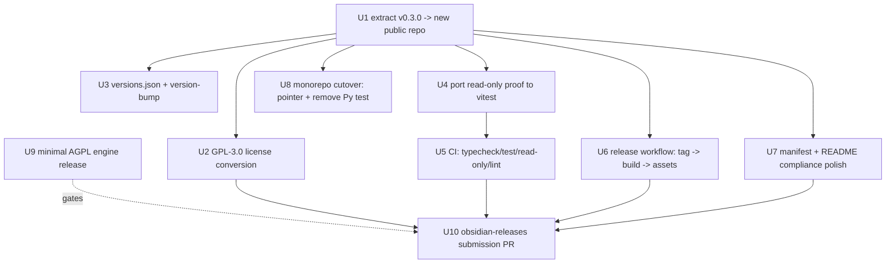

# feat: Publish the companion plugin to the Obsidian community directory

## Summary

Extract the already-redesigned companion plugin (v0.3.0) into its own public repo
and add the packaging the Obsidian directory requires — GPL-3.0 license,
`versions.json`, CI + a tag-driven release workflow, manifest/README polish, and
the read-only proof ported into the new repo's own test run — then open the engine
(this monorepo) under AGPL-3.0 and submit. No plugin behavior changes.

---

## Problem Frame

The Phase-2.5 redesign (v0.3.0) is merged and already carries a working build,
`styles.css`, the read-only allowlist, an empty opt-in default endpoint, and full
network/privacy disclosure. What blocks the community directory is packaging and
positioning, not features: the plugin has no separate public repo, no LICENSE
(its `package.json` says `UNLICENSED` / `private`), no `versions.json`, no
plugin-repo CI/release workflow, a lowercase display name, and a read-only proof
that lives only in the monorepo's Python test. See origin for the full situational
frame.

**Target repos:** this plan spans three. The **new plugin repo**
(`leonardsellem/hypermnesic-companion`) is where most units land; the **monorepo**
(`leonardsellem/hypermnesic`, which is the engine) is touched for the cutover and
the AGPL release; the **`obsidianmd/obsidian-releases`** repo receives the final
submission PR. All paths below are repo-relative to the unit's stated repo.

---

## Requirements

Carried from origin (`R1`–`R12`); this plan satisfies all of them.

- R1. Plugin in its own public repo with `manifest.json` at the repo root.
- R2. Retire the monorepo's plugin directory (single source of truth).
- R3. Add `versions.json` (version → `minAppVersion`), kept in lockstep on release.
- R4. Release workflow: tag == manifest `version` (no leading `v`); build `main.js`;
  attach `main.js` + `manifest.json` + `styles.css` as individual assets.
- R5. Plugin-repo CI on PR/push: typecheck, vitest, read-only check, lint.
- R6. GPL-3.0 `LICENSE`; flip `package.json` `license`/`private`; indicate license
  in README.
- R7. Engine released publicly under AGPL-3.0; document the arm's-length
  plugin↔engine boundary.
- R8. Manifest: `name` → "Hypermnesic Companion"; add `authorUrl`; keep unique `id`.
- R9. Action-verb `description`, ≤250 chars, period, read-only claim retained.
- R10. Port the read-only static scan into the plugin repo's CI.
- R11. Sample-scaffolding strip + developer-policy code checklist.
- R12. PR to `obsidian-releases` adding the `community-plugins.json` entry, after a
  release exists and the engine is publicly installable.

**Origin actors:** A1 (owner/author), A2 (the plugin — read-only client), A3 (the
hypermnesic engine), A4 (Obsidian directory + review bot), A5 (end user).
**Origin flows:** F1 (extraction & gap-close), F2 (versioned release), F3 (directory
submission).
**Origin acceptance examples:** AE1 (clean-clone build), AE2 (release assets + tag),
AE3 (read-only check fails on a non-allowlisted call), AE4 (LICENSE + non-private),
AE5 (manifest constraints pass the bot).

---

## Scope Boundaries

- **No plugin behavior changes.** v0.3.0 features are preserved as-is; this is
  packaging/licensing/repo only.
- **Mobile parity** and **MCP OAuth in the plugin** stay deferred (origin / plugin
  "known gaps").
- The plugin **never writes the vault and never merges** — unchanged invariant.

### Deferred to Follow-Up Work

- **Full engine open-sourcing** (contributor guide, full docs, the commercial
  dual-license, marketing, and the definitive public-history/secrets audit): its
  own effort. This plan depends only on the **minimal** AGPL engine release (U9)
  that unblocks submission. Mechanism (flip the existing repo public after a
  history scrub vs. a fresh clean-history public repo) is decided there.
- **eslint rule-set expansion** beyond the Obsidian-recommended baseline added in
  U5.

---

## Context & Research

### Relevant Code and Patterns

- `obsidian-plugin/` on `origin/main` (v0.3.0) — the extraction source: `main.ts`,
  `src/**`, `manifest.json`, `styles.css`, `package.json`, `package-lock.json`,
  `esbuild.config.mjs`, `tsconfig.json`, `test/reference-model.test.ts`, `README.md`,
  `.gitignore`.
- `obsidian-plugin/src/core.ts` — the `READ_ONLY_TOOLS = new Set(["search",
  "build_context", "think"])` allowlist + `callTool` refusal; the trust-critical
  surface the read-only proof pins.
- `obsidian-plugin/esbuild.config.mjs` — already externalizes `obsidian`, `electron`,
  `@codemirror/*`, `@lezer/*`, builtins; CJS, es2018. Reused unchanged.
- `tests/test_obsidian_plugin.py` (monorepo) — the current static read-only scan
  (scans `main.ts` + `src/` for vault writes; pins the `core.ts` allowlist string).
  Logic to port into the plugin repo (U4), then retire (U8).
- `.github/workflows/ci.yml` (monorepo) — Python/uv CI; the model for "CI exists,"
  not reused by the plugin repo.

### Institutional Learnings

- `docs/solutions/design-patterns/surgical-scalar-set-frontmatter-byte-preservation.md`
  — not directly applicable (engine frontmatter concern); no plugin-packaging
  learnings on file.

### External References

- Obsidian docs (fetched 2026-06-02): *Submit your plugin*, *Submission requirements
  for plugins*, *Developer policies*, *Release your plugin with GitHub Actions*.
- `obsidianmd/obsidian-sample-plugin` — canonical `version-bump.mjs` (hooked via the
  `package.json` `version` script), `versions.json` shape (`{"<plugin-version>":
  "<minAppVersion>"}`), `.github/workflows/release.yml` (tag-push → build → attach
  `main.js`/`manifest.json`/`styles.css`), and the recommended eslint baseline.
- `obsidianmd/obsidian-releases` — `community-plugins.json` entry
  (`id`/`name`/`author`/`description`/`repo`); `repo` is `user/repo` with
  `manifest.json` at root.

---

## Key Technical Decisions

- **Repo name `hypermnesic-companion`** (matches the manifest `id`): predictable,
  no "obsidian" prefix needed. Adjustable before creation.
- **SPDX `GPL-3.0-or-later`** for the plugin: standard, allows future GPL versions.
- **Port the read-only proof as a vitest test** (not a node script, not keeping
  Python): the plugin repo already runs vitest, so the proof rides the existing
  runner and the existing CI step. The Python original is then retired with the
  monorepo cutover.
- **Hard monorepo cutover:** the plugin repo becomes the single source of truth; the
  monorepo's plugin directory drops to a pointer and the Python read-only test is
  removed — no long-lived mirror to keep in sync.
- **Build `main.js` in CI for releases** (it is gitignored in the plugin repo):
  release and CI both run `npm run build`; no built artifact is committed.
- **Add the Obsidian-recommended eslint baseline** as part of CI (the repo has no
  eslint config today).

---

## Open Questions

### Resolved During Planning

- Repo name → `hypermnesic-companion`.
- License flavor → `GPL-3.0-or-later` (plugin), `AGPL-3.0-or-later` (engine).
- Read-only proof form → vitest test in the plugin repo.
- Monorepo plugin dir → thin pointer + remove the Python test (hard cutover).
- Display name → "Hypermnesic Companion" (origin decision).
- Plugin repo history → **fresh, no inheritance**; history-preserving export
  (`git subtree split`) is prohibited because monorepo history contains the
  pre-scrub homelab IP (see U1).

### Deferred to Implementation

- Exact rewritten `description` wording (action-verb opening, ≤250 chars) — drafted
  in U7, finalized against the live char count.
- The engine release mechanism (U9): flip the existing private repo public after a
  git-history secrets scrub, vs. publish a fresh clean-history repo — owned by the
  engine open-sourcing effort; this plan consumes its output.
- Whether the engine should add token/bearer auth (beyond Tailscale network trust)
  for self-hosters who expose it on non-Tailscale URLs — a security follow-up owned
  by the engine effort; the plugin mitigates via a README warning (U7).

---

## High-Level Technical Design

> *This illustrates the intended approach and is directional guidance for review,
> not implementation specification. The implementing agent should treat it as
> context, not code to reproduce.*

Unit dependency graph (which work unblocks which). Plugin-repo units land first;
the engine release and the directory PR are the gated tail.

---

## Output Structure

Expected layout of the new **plugin repo** after extraction + gap-close (a scope
declaration, not a constraint):

    hypermnesic-companion/
    ├── .github/workflows/
    │   ├── ci.yml              # U5  typecheck + test + read-only + lint
    │   └── release.yml         # U6  tag -> build -> attach assets
    ├── src/                    # (from v0.3.0, unchanged)
    │   ├── core.ts
    │   ├── nudge.ts  ranking.ts  settings.ts  state.ts  thinking.ts  types.ts
    │   └── surfaces/ …
    ├── test/
    │   ├── reference-model.test.ts   # (existing)
    │   └── read-only.test.ts         # U4  ported read-only proof
    ├── main.ts                 # (from v0.3.0)
    ├── manifest.json           # U7  name/authorUrl/description
    ├── styles.css              # (from v0.3.0)
    ├── versions.json           # U3
    ├── version-bump.mjs        # U3
    ├── esbuild.config.mjs  tsconfig.json   # (from v0.3.0)
    ├── package.json            # U2 license/private; U3 version script; U5 lint dep
    ├── package-lock.json
    ├── .eslintrc / eslint.config # U5
    ├── .gitignore              # (from v0.3.0: node_modules, main.js)
    ├── LICENSE                 # U2  GPL-3.0
    └── README.md               # U7  license + engine install pointer

---

## Implementation Units

### U1. Create the public repo and extract v0.3.0

**Goal:** Stand up `leonardsellem/hypermnesic-companion` as a public repo seeded
with the v0.3.0 plugin at the repo root, building from a clean clone.

**Requirements:** R1

**Dependencies:** None

**Files (new plugin repo, at root):**
- Create (copied from monorepo `obsidian-plugin/` @ v0.3.0): `main.ts`, `src/**`,
  `manifest.json`, `styles.css`, `package.json`, `package-lock.json`,
  `esbuild.config.mjs`, `tsconfig.json`, `test/reference-model.test.ts`, `README.md`,
  `.gitignore`.

**Approach:**
- Fresh standalone repo with **no inherited git history**. Do **not** use
  `git subtree split` or any history-preserving export: the monorepo history carries
  the pre-scrub homelab IP (`100.103.0.55`) in old plugin-source commits, and
  inheriting it would publish that private address irreversibly.
- Create the repo **private**, land U1–U5 together (extraction + license + packaging
  + read-only proof + green CI), then flip it public. This closes the window where a
  public repo would exist with the read-only invariant ungated by CI.
- No content edits in this unit beyond relocation — a clean `npm install && npm run
  build` is the baseline before compliance edits.

**Patterns to follow:** the v0.3.0 layout exactly; `obsidian-sample-plugin` repo
root shape.

**Test scenarios:**
- Covers AE1. Happy path: clean clone → `npm install` → `npm run build` exits 0 and
  emits `main.js`.
- Happy path: `npm test` (the existing vitest) passes unchanged.

**Verification:** the new public repo builds and tests green from a fresh clone with
no edits beyond relocation.

---

### U2. GPL-3.0 license conversion

**Goal:** License the plugin repo under GPL-3.0 and remove the proprietary/private
markers.

**Requirements:** R6

**Dependencies:** U1

**Files (plugin repo):**
- Create: `LICENSE` (full GPL-3.0 text).
- Modify: `package.json` — `"license": "GPL-3.0-or-later"`, remove `"private": true`.
- Modify: `README.md` — state the GPL-3.0 license (folded with U7's README pass if
  sequenced together).

**Approach:**
- Use the verbatim OSI GPL-3.0 text in `LICENSE`.
- The engine's AGPL choice is a *separate* repo (U9); document the arm's-length MCP
  boundary in the README so the two licenses read as intentional, not conflicting.

**Patterns to follow:** standard GPL-3.0 `LICENSE` placement at repo root.

**Test scenarios:**
- Covers AE4. Happy path: `LICENSE` exists and contains the GPL-3.0 text; `package.json`
  declares a GPL-3.0 SPDX id and has no `private` field.

**Verification:** a reviewer reading the repo root sees an unambiguous GPL-3.0 grant;
`package.json` is publishable (not `private`/`UNLICENSED`).

---

### U3. versions.json + version-bump automation

**Goal:** Add the `versions.json` compatibility map and the `npm version` →
`version-bump.mjs` hook that keeps it and `manifest.json` in lockstep.

**Requirements:** R3

**Dependencies:** U1

**Files (plugin repo):**
- Create: `versions.json` — seed with the current release, mapping `"0.3.0"` →
  `"1.5.0"` (the manifest `minAppVersion`).
- Create: `version-bump.mjs` — reads the target version, writes `manifest.json`
  `version`, and appends the `versions.json` entry.
- Modify: `package.json` — add a `"version"` script invoking `version-bump.mjs` and
  staging the two files.

**Approach:**
- Mirror the `obsidian-sample-plugin` version-bump script exactly; it is the
  canonical, reviewer-expected shape.
- `versions.json` values are minimum-Obsidian-version per plugin version, so older
  apps resolve a compatible release.

**Patterns to follow:** `obsidian-sample-plugin` `version-bump.mjs` + `versions.json`.

**Test scenarios:**
- Happy path: running the version bump for a new patch updates `manifest.json`
  `version` and adds the matching `versions.json` key.
- Edge case: the existing `0.3.0` entry is present and unchanged after a later bump.

**Verification:** `versions.json` exists with the current version mapped; a version
bump updates both files consistently.

---

### U4. Port the read-only proof to vitest

**Goal:** Reproduce the monorepo Python static read-only scan as a vitest test in
the plugin repo so the trust-critical invariant is proven where the code lives.

**Requirements:** R10

**Dependencies:** U1

**Files (plugin repo):**
- Create: `test/read-only.test.ts`.

**Approach:**
- Port the **full** `tests/test_obsidian_plugin.py` suite assertion-for-assertion —
  not a subset. The Python original carries **eight** assertion groups; all must be
  reproduced before U8 removes it, or read-only coverage *shrinks* at cutover
  (violating the no-coverage-gap invariant):
  1. `READ_ONLY_TOOLS` allowlist pinned in `src/core.ts` lists exactly `search` /
     `build_context` / `think`; no `"commit_note"` literal in `core.ts`.
  2. No vault-write call forms across `main.ts` + `src/`: `vault.modify(`,
     `vault.create(`, `vault.delete(`, `vault.append(`, `vault.trash(`,
     `adapter.write(`, `adapter.append(`, `adapter.remove(`.
  3. No editor / CodeMirror mutation call forms: `editor.replaceSelection(`,
     `editor.replaceRange(`, `editor.setValue(`, `editor.setLine(`,
     `editor.transaction(`, `editor.exec(`, `.dispatch(`, `vault.process(`,
     `vault.rename(`, `vault.copy(`, `fileManager.processFrontMatter(`,
     `fileManager.renameFile(`.
  4. `src/surfaces/reference.ts` imports no `@codemirror/view` or `@codemirror/state`
     (structurally incapable of an editor write).
  5. Empty opt-in default endpoint: `mcpUrl: ""` in `src/types.ts`, the `!url.trim()`
     guard in `src/core.ts`, and no `100.103.0.55` anywhere in source.
  6. UI guidelines: no `.innerHTML` / `.outerHTML` / `.insertAdjacentHTML(` /
     `console.log(` / `console.debug(` in source.
  7. Build scaffolding present (`package.json`, `esbuild.config.mjs`, `tsconfig.json`).
  8. Manifest well-formed (`id`, `isDesktopOnly: true`, `version`, `minAppVersion`).
- Static source scan (read files, assert on substrings) — no Obsidian runtime needed,
  same approach as the Python original.

**Execution note:** write the assertions test-first against the current (passing)
source, then add a deliberately-failing fixture check to confirm the guard bites.

**Technical design:** *(directional)* the test reads `src/core.ts` and the full
`main.ts` + `src/**` tree, then asserts allowlist-present / write-call-absent —
a 1:1 translation of the Python scan's logic into vitest.

**Patterns to follow:** `tests/test_obsidian_plugin.py` (assertion set);
`test/reference-model.test.ts` (vitest style in this repo).

**Test scenarios:**
- Covers AE3. Happy path: current source → all read-only assertions pass.
- Covers AE3. Error path: a fixture string containing `vault.modify(` or a
  non-allowlisted tool name makes the scan assert false (guard proven to bite).
- Edge case: prose mentions of the API names (in comments) do NOT trip the
  write-call check — only the trailing-`(` call form is forbidden.

**Verification:** `npm test` includes the read-only proof and it fails if the
allowlist regresses, a vault-write or editor/CM6 mutation call form appears, the
hardcoded IP returns, a forbidden CodeMirror import lands in `reference.ts`, or a
UI-guideline violation appears.

---

### U5. CI workflow (typecheck, test, read-only, lint)

**Goal:** Add a plugin-repo GitHub Actions workflow that gates every PR/push.

**Requirements:** R5, R11

**Dependencies:** U4 (the read-only test must exist to run)

**Files (plugin repo):**
- Create: `.github/workflows/ci.yml`.
- Create: eslint config (`.eslintrc` or `eslint.config.mjs`) + add eslint
  devDependencies to `package.json`.

**Approach:**
- CI steps: `npm ci` → `npm run typecheck` → `npm test` (includes U4) → `npm run
  lint`.
- Add the Obsidian-recommended eslint baseline (`@typescript-eslint` + the
  obsidian-sample lint config); keep the rule-set minimal (expansion deferred).
- Lint surfaces developer-policy code concerns (e.g., stray `console`, `innerHTML`),
  satisfying the R11 checklist mechanically rather than by hand.
- **R11 split:** U5 provides the *durable, automated* half (lint as a regression
  backstop); U7 performs the *one-time* sample-strip + developer-policy confirmation
  pass. Lint alone does not satisfy R11 at submission time.

**Patterns to follow:** `obsidian-sample-plugin` lint workflow + eslintrc.

**Test scenarios:**
- Happy path: CI passes on the extracted v0.3.0 source.
- Error path: a PR that breaks the read-only allowlist or introduces a lint error
  fails CI.
- Test expectation: none for the eslint config file itself (config, no behavior) —
  its effect is exercised by the lint CI step.

**Verification:** green CI on a clean PR; red CI when typecheck/test/lint fails.

---

### U6. Release workflow (tag → build → attach assets)

**Goal:** Automate directory-compatible releases on tag push.

**Requirements:** R4

**Dependencies:** U1 (build), and effectively U2/U3/U7 land before the *first* real
release (sequencing, not a hard code dependency)

**Files (plugin repo):**
- Create: `.github/workflows/release.yml`.

**Approach:**
- Trigger on tag push where the tag equals the `manifest.json` `version` with **no
  leading `v`**.
- Steps: `npm ci` → `npm run build` (produces the gitignored `main.js`) → create the
  GitHub release → upload `main.js`, `manifest.json`, `styles.css` as **individual**
  assets (not a zip).
- `manifest.json` lives both at repo root and as a release asset (Obsidian requires
  both).
- Scope the workflow's `GITHUB_TOKEN` to least privilege — an explicit
  `permissions: contents: write` block (the only scope release creation + asset
  upload need), per the `obsidian-sample-plugin` workflow.

**Patterns to follow:** `obsidian-sample-plugin` `.github/workflows/release.yml`.

**Test scenarios:**
- Covers AE2. Happy path: pushing tag `0.3.0` produces a release with `main.js` +
  `manifest.json` + `styles.css` attached and the tag carrying no leading `v`.
- Edge case: a tag that does not match the manifest `version` should be caught
  (documented expectation; the directory installer keys on exact match).

**Verification:** a tagged release exposes the three assets individually, installable
by Obsidian's release resolver.

---

### U7. Manifest + README compliance polish & sample-strip

**Goal:** Bring metadata to the Obsidian style bar and disclose the engine
dependency for a public audience; confirm no sample-scaffolding remnants.

**Requirements:** R8, R9, R11

**Dependencies:** U1

**Files (plugin repo):**
- Modify: `manifest.json` — `name` → "Hypermnesic Companion"; add `authorUrl`; keep
  `id` `hypermnesic-companion`; omit `fundingUrl` unless donations are accepted.
- Modify: `README.md` — open with the action-verb description; keep the
  network/privacy disclosure; add a clear **engine install pointer** (link to the
  public AGPL engine, from U9) and the GPL-3.0 license note (with U2). Also:
  (a) replace the dangling `tests/test_obsidian_plugin.py` self-reference with the
  ported `test/read-only.test.ts`; (b) rewrite the "Build & install" block to drop
  `cd obsidian-plugin` (the plugin is at the repo root now); (c) add a security note
  that the engine has **no token auth** — configuring a non-Tailscale URL removes all
  access control and exposes the vault index to any host that can reach it.
- Modify (if needed): `manifest.json` `description` rewrite to open with an action
  verb, ≤250 chars, ending in a period, retaining the read-only claim.

**Approach:**
- Draft description e.g. "Surface strictly read-only, pause-triggered related notes
  and an interrogable reinvention nudge from your tailnet hypermnesic index — never
  writes the vault." (finalize against the live char count in implementation).
- Sample-strip is a **confirmation pass**: the research scan found no
  `console.log`/`Sample*`/`TODO` remnants, so this is verify-and-attest, with lint
  (U5) as the durable backstop.
- README must satisfy the developer policy: one named remote service, what data
  leaves the vault, no telemetry, account/engine required — already present at
  v0.3.0; this unit adds the engine link and license note.

**Patterns to follow:** Obsidian *Submission requirements* description rules;
existing v0.3.0 README "Network use & privacy" section.

**Test scenarios:**
- Covers AE5. Happy path: `name` is "Hypermnesic Companion"; `description` opens with
  a verb and is ≤250 chars ending in a period; `id` unchanged.
- Test expectation: README/manifest prose changes are not unit-testable behavior —
  verified by the submission bot (AE5) and review, not a vitest.

**Verification:** manifest fields satisfy the documented constraints; README names
the engine dependency and links a real install; no sample remnants remain.

---

### U8. Monorepo cutover

**Goal:** Make the plugin repo the single source of truth and stop the monorepo from
carrying (and testing) plugin source.

**Requirements:** R2

**Dependencies:** U1 (the new repo must exist and be authoritative first)

**Files (monorepo `hypermnesic`):**
- Modify/Delete: `obsidian-plugin/` — reduce to a one-line pointer `README.md`
  linking to the new repo (or delete outright; pointer preferred for discoverability
  given docs reference it).
- Delete: `tests/test_obsidian_plugin.py` — its job moved to the plugin repo (U4).
- Modify: `.github/workflows/ci.yml` and any code/config references that resolve to
  `obsidian-plugin/`, so monorepo CI stays green. Historical `docs/` artifacts are
  left as-is.

**Approach:**
- Sequence **after** U4 lands in the plugin repo, so the read-only proof never has a
  coverage gap across the cutover.
- Fix only references that would otherwise **break monorepo CI** (the Python test
  removal, and any path/config that resolves to `obsidian-plugin/`). Do **not** sweep
  and rewrite historical `docs/brainstorms/` or `docs/plans/` artifacts — they are
  read-only records (scope stays at R2's structural cutover).

**Test scenarios:**
- Happy path: monorepo `pytest` + CI pass after the Python plugin test is removed and
  references are updated (no dangling import/path).
- Edge case: the pointer README resolves to the new repo URL.

**Verification:** monorepo CI is green with no plugin source/test; the new repo is
the only place the plugin builds and is proven read-only.

---

### U9. Minimal AGPL engine release (submission prerequisite)

**Goal:** Make the engine publicly installable under AGPL-3.0 so the plugin's README
points at a real engine and directory users can run it.

**Requirements:** R7

**Dependencies:** None (parallel track); **gates U10**. If the engine open-sourcing
effort has not decided the release mechanism when U9 begins, default to the fresh
clean-history repo path and proceed — do not block U10 on the full effort.

**Files (engine repo / monorepo):**
- Create/Modify: `LICENSE` → AGPL-3.0 (`AGPL-3.0-or-later`).
- Modify: engine `README.md` — public-facing install instructions the plugin can
  link to; note the optional future commercial dual-license.

**Approach:**
- **Minimal scope only**: license swap + public visibility + installable instructions.
  The *mechanism* (flip the existing private repo public after a git-history secrets
  scrub, vs. publish a fresh clean-history repo) and the full open-sourcing are owned
  by the engine effort (Deferred to Follow-Up Work) — this plan consumes the output.
- **Hard precondition (do not skip):** a git-history secrets/IP audit before any
  public flip. The audit must scan the **full object store across all refs** (e.g.,
  `gitleaks detect` or `trufflehog git` over `--all`), not a HEAD grep — the homelab
  IP and any secret can live in non-HEAD history. **Pass criterion:** zero live
  credentials and zero private IPs outside IANA documentation ranges.
  **Remediation:** a history rewrite via `git-filter-repo`, or prefer a **fresh
  clean-history repo** if the rewrite scope is large. Treat the flip as irreversible
  disclosure.

**Execution note:** treat the public-flip as irreversible disclosure — complete the
history audit and confirm no secrets/`.env`/private IPs remain before publishing.

**Test scenarios:**
- Happy path: the engine repo is publicly reachable, carries an AGPL-3.0 `LICENSE`,
  and its README install steps succeed on a clean machine.
- Error path (gate): if a secrets-audit finding exists, the public flip is blocked
  until resolved.
- Test expectation: licensing/visibility is not unit-testable — verified by audit
  checklist and a clean-machine install smoke.

**Verification:** a stranger can find, install, and run the engine under AGPL; the
plugin README's engine link resolves to it.

---

### U10. Directory submission PR

**Goal:** Get the plugin listed by adding it to the community directory.

**Requirements:** R12

**Dependencies:** U2, U5, U6, U7 (a compliant, released plugin repo) **and** U9 (a
publicly installable engine)

**Files (`obsidianmd/obsidian-releases` fork):**
- Modify: `community-plugins.json` — append the entry: `id`
  `hypermnesic-companion`, `name` "Hypermnesic Companion", `author` "Leonard Sellem",
  `description` (the U7 text), `repo` `leonardsellem/hypermnesic-companion`.

**Approach:**
- Pre-flight: confirm a GitHub release exists with the three assets (U6) and that
  `id` is unique in the current `community-plugins.json` (verify — unverified
  assumption in origin).
- Open the PR; the automated validation bot runs; address feedback by publishing
  **incremented releases** (U3 bump → U6 release), never by re-submitting.
- This is a manual, human-reviewed step — represented here as a checklist + the JSON
  entry, not automatable code.

**Patterns to follow:** `obsidian-releases` `community-plugins.json` entry format and
PR template.

**Test scenarios:**
- Covers AE5. Happy path: the bot's manifest/id/name/description checks pass on the
  PR.
- Error path: bot flags (e.g., name/description style) → fix in the plugin repo →
  new release → bot re-runs.
- Test expectation: none in this repo — verification is the directory bot + human
  review.

**Verification:** the PR passes automated review and the plugin becomes installable
from the community directory.

---

## System-Wide Impact

- **Interaction graph:** the plugin↔engine contract is unchanged (read-only MCP:
  `search` / `build_context` / `think`); extraction does not touch the wire format.
- **Trust invariant:** the read-only proof must have **no coverage gap** across the
  cutover — U4 (port) lands before U8 (remove the Python test). This ordering is
  load-bearing.
- **State lifecycle risks:** none in the plugin (no persistence change). The one
  irreversible action is U9's public flip — gated on a history/secrets audit.
- **API surface parity:** `manifest.json` must be byte-identical at repo root and as
  a release asset (R4); the version-bump (U3) is the mechanism that keeps them and
  `versions.json` consistent.
- **Unchanged invariants:** plugin behavior, the empty opt-in default endpoint, the
  network/privacy disclosure, and `isDesktopOnly` are all carried from v0.3.0
  untouched.

---

## Risks & Dependencies

| Risk | Mitigation |
|------|------------|
| Extracting the plugin via a history-preserving export would publish the pre-scrub homelab IP in old commits | U1 mandates a fresh repo with **no inherited history**; `git subtree split` / history export is prohibited. |
| Making the engine repo public leaks secrets/IPs from git history | U9 hard precondition: full-object-store secrets/IP audit (`gitleaks`/`trufflehog` over `--all`) before any public flip; remediate via `git-filter-repo` or prefer a fresh clean-history repo. Treated as irreversible. |
| Read-only proof coverage gap during cutover | Sequence U4 (port to vitest) strictly before U8 (remove Python test). |
| `id` `hypermnesic-companion` already taken in the directory | U10 pre-flight verifies uniqueness against `community-plugins.json` before the PR; rename `id` + repo if taken (cheap pre-submission, costly after). |
| Reviewer style nudge on `name`/`description` | U7 applies title-case name + action-verb description up front; lint + the bot catch the rest; fixes ship as incremented releases. |
| Directory rejects a plugin requiring an external engine | Allowed with disclosure (developer policy); the README network/account disclosure (v0.3.0 + U7 engine link) satisfies it. |
| Submission blocked because the engine isn't public yet | U9 explicitly gates U10; the plan sequences the engine release before the PR. |

---

## Documentation / Operational Notes

- The plugin README (U7) becomes the user-facing install + disclosure surface; it
  must link the public engine (U9) and state GPL-3.0.
- Monorepo docs that reference `obsidian-plugin/` are updated/annotated in U8 to
  avoid dangling references after cutover.
- Post-listing, all plugin changes ship as ordinary tagged releases (U3 bump → U6);
  the directory entry is a one-time claim.

---

## Sources & References

- **Origin document:** [docs/brainstorms/2026-06-02-obsidian-community-directory-publishing-requirements.md](docs/brainstorms/2026-06-02-obsidian-community-directory-publishing-requirements.md)
- Related plans: `docs/plans/2026-06-02-007-feat-phase-2-5-obsidian-companion-plan.md`,
  `docs/plans/2026-06-02-009-feat-companion-first-class-ui-plan.md`
- Plugin source @ v0.3.0: `obsidian-plugin/` on `origin/main` (esp. `src/core.ts`,
  `manifest.json`, `package.json`, `esbuild.config.mjs`, `README.md`,
  `tests/test_obsidian_plugin.py`)
- Obsidian docs (2026-06-02): Submit your plugin; Submission requirements; Developer
  policies; Release your plugin with GitHub Actions
- `obsidianmd/obsidian-sample-plugin` (version-bump.mjs, versions.json, release.yml,
  eslint); `obsidianmd/obsidian-releases` (community-plugins.json)
