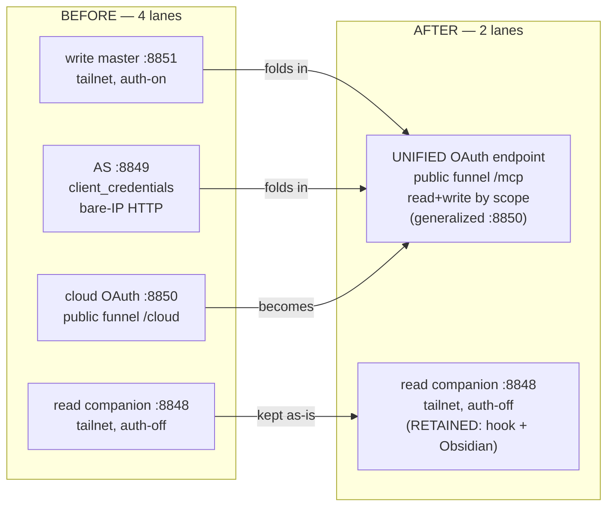
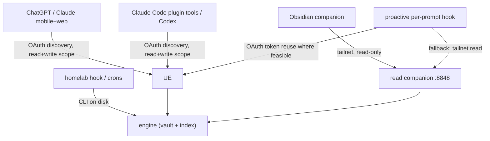

# feat: Unified OAuth MCP endpoint + `hypermnesic setup`

## Summary

Collapse hypermnesic's four serving lanes into **two**: one public, Tailscale-funnel'd OAuth
MCP endpoint (read+write by scope, browser-login-once + silent refresh) generalized from the
existing cloud server, plus the **retained** tailnet read-only route for the proactive hook and
the Obsidian companion. Add a one-command `hypermnesic setup` that stands the endpoint up over
Tailscale's native funnel. Rewrite the distributed plugin to OAuth-discovery-only (no hardcoded
host, no `auth` block). honcho is untouched; the gbrain decommission resumes afterward as a
downstream consumer of the new endpoint.

---

## Problem Frame

Hypermnesic serves one engine through four overlapping lanes that accreted one patch at a time
(see origin Problem Frame): a tailnet auth-off **read companion** (`:8848`), a tailnet auth-on
**write master** (`:8851`), a tailnet `client_credentials` **AS** published on a bare tailnet IP
over plain HTTP (`:8849`, `src/hypermnesic/auth_server.py`), and a **separate public cloud OAuth
server** (`:8850`, `src/hypermnesic/auth_cloud.py` → Tailscale Funnel `/cloud`). The two
public-vs-tailnet lanes exist only because the tailnet AS was never made public-HTTPS, so a second
self-contained OAuth server was bolted on for mobile clients.

The cost lands in three places: the distributed Claude Code plugin **hardcodes the operator's
homelab hostname** and carries a non-standard `auth`/`token_env` block (a stranger who installs it
points at the operator's brain and can't self-serve); four services are four things to run, secure,
and document; and standing the public lane up is a manual runbook (`docs/cloud-oauth-mcp-deploy-runbook.md`)
whose first deploy 404'd because a Funnel route was silently missing.

The public cloud lane already solved the hard parts — an OAuth 2.1 AS (DCR + authorization_code +
PKCE), a consent gate, read+write by scope, and a full pre-exposure security review. This plan
promotes that lane to the sole network endpoint, retires the redundant tailnet auth lanes, retains
the auth-off read route for the proactive hook + Obsidian, and makes bring-up a single command.

The work is sequenced **serving-first**: the unified endpoint supersedes the gbrain-decommission
plan's U8 reach/auth and the plugin's token-block auth, so building it first avoids doing that work
twice (see origin R18). The live homelab is currently in a partial U8 state — `tailscale funnel
/mcp` points at the write master `:8851` and an `nft` counter table `inet gbrain_watch` is live —
which the cutover (U8 below) accounts for explicitly.

---

## Requirements Traceability

Carried from `docs/brainstorms/2026-06-03-unified-oauth-endpoint-and-setup-requirements.md`
(R1–R20, KD1–KD9, F1–F5, AE1–AE6). Mapping to units:

- **Unified endpoint** (R1–R5) → U1, U2, U7, U8
- **Auth & scope** (R6–R11) → U1, U2, U5
- **`hypermnesic setup`** (R12–R15) → U3
- **Distribution** (R16–R17) → U4
- **Migration & coexistence** (R18–R20) → U7, U8, U9
- **Acceptance examples** AE1/AE2 → U1+U2; AE3 → U1; AE4 → U3; AE5 → U8; AE6 → U4

Two origin decisions were **revised in planning dialogue** (2026-06-03) and override the origin
where they conflict:

- The read companion (`:8848`) is **retained**, not retired (origin KD1 said retire). It serves
  the proactive hook's remote-device reads and Obsidian until the companion redesign. End state is
  4 lanes → 2.
- The proactive hook must work on **remote** devices, not engine-host-only: OAuth-token-reuse
  where feasible, else the retained tailnet read route (origin R11/F3 fallback made explicit).

---

## Key Technical Decisions

- **KTD1 — Promote `build_cloud_server` to the sole network lane; do not rebuild.** The unified
  endpoint generalizes `src/hypermnesic/mcp_server.py::build_cloud_server` + `auth_cloud.CloudAuthProvider`
  (SDK `OAuthAuthorizationServerProvider` + `create_auth_routes`). `build_server` is already the
  single server chokepoint both lanes pass through; the consolidation reshapes CLI/config around it,
  not the core (origin KD2; native-primitives rule). honcho-as-AS stays rejected (`docs/oauth-as-finding.md`).

- **KTD2 — A single read+write endpoint is safe only via per-tool write-scope enforcement.** The SDK
  applies one `required_scopes` list to all tools and cannot separate read from write clients (threat
  model V14, `docs/threat-model-commit-note.md`). `commit_note` self-enforces the `write` scope from
  the authenticated principal (`get_access_token()`), independent of the transport scope list. The
  endpoint's base required scope is `read`; `commit_note` rejects non-`write` principals. This is the
  mechanism that lets read clients and write clients share one endpoint — carry it forward unchanged.

- **KTD3 — Write-anywhere-under-guards replaces the `captures/` fence (origin KD5).** The unified
  lane defaults its write allowlist to `DEFAULT_WRITE_ALLOWLIST` (the master's surface) rather than
  `CLOUD_WRITE_ALLOWLIST = ("captures/",)`. `commit_note`'s existing guards (allowlist, protected-path
  refusal, diff-or-die, audit log, git-revertability) remain the write bound. This widens the public
  write blast radius, which **mandates a fresh security re-review** (U6).

- **KTD4 — Public-Host trust is wired from the start.** The loopback-behind-Funnel bind 421s on
  `tools/list` unless `public_hosts` is passed to `build_server` (FastMCP DNS-rebinding protection;
  commit `a8170fc`). The unified server derives `public_hosts` from `public_url`+`resource`. This is
  invisible to discovery/DCR smoke tests — it only bites on the first authed tool call, so it is
  verified with a real authed `tools/list` through the Funnel.

- **KTD5 — Discovery lives on a hypermnesic-scoped well-known path, funnel-routed.** The endpoint's
  `WWW-Authenticate` advertises `resource_metadata` at an HTTPS hypermnesic path (mirroring the
  cloud lane's `/.well-known/oauth-protected-resource/cloud/mcp` and honcho's `/honcho`-suffixed
  routes), and the AS metadata is reachable at the same HTTPS origin — never a bare-IP/plain-HTTP
  issuer (origin R2). `setup` funnel-routes those well-knowns alongside the MCP path so a remote
  client's discovery chain resolves over HTTPS (the gap that 404'd the first cloud deploy).

- **KTD6 — `setup` verifies real discovery output, not exit codes.** After starting the unit and
  configuring the funnel, `setup` curls the RFC 9728 + RFC 8414 well-knowns and an unauth `tools/list`
  (expect 401 + correct `WWW-Authenticate`) and asserts the responses resolve to hypermnesic — "parity
  = real output, not exit code" (`docs/cloud-oauth-mcp-deploy-runbook.md` RCA). Idempotent (AE4).

- **KTD7 — Plugin is discovery-only; the `auth` block is dropped.** Claude Code performs OAuth
  discovery from `{type, url}` alone and a static `Authorization` header would suppress the OAuth
  fallback (verified against current Claude Code docs). `.mcp.json` becomes
  `{ type: streamable-http, url: ${HYPERMNESIC_MCP_URL:-<placeholder>} }` with no `auth`/`token_env`
  (origin KD7/R16).

- **KTD8 — Retain `:8848`; the proactive hook reads over the tailnet, OAuth-token-reuse where
  feasible.** The hook is read-only; reads ride tailnet membership as the boundary on any tailnet
  device (homelab + remote laptops). A spike verifies whether the hook script can reuse Claude Code's
  stored OAuth token (R11); if not, the retained tailnet read route is the working path. `:8848`'s
  lifetime is governed by both this and the Obsidian redesign.

- **KTD9 — Cutover claims `/mcp` for the unified endpoint and retires the tailnet auth lanes behind
  it.** The live partial-U8 state (`/mcp` → `:8851`, the `inet gbrain_watch` nft counter) is the
  starting point; U8 repoints `/mcp` + well-knowns to the unified endpoint, retires `:8849`/`:8851`,
  preserves the `nft` counter (still the gbrain Gate-B signal), and keeps honcho + `/cloud`'s public
  reach without a gap.

---

## High-Level Technical Design

### Topology: 4 lanes → 2

### Client → endpoint mapping (after)

---

## Implementation Units

Grouped into four phases. Dependency-ordered; U-IDs are stable.

### Phase 1 — Unified endpoint core

### U1. Generalize the cloud server into the unified network lane

**Goal:** Make `build_cloud_server` the single public read+write OAuth lane, defaulting to
write-anywhere-under-guards, with public-Host trust wired in and per-tool write-scope enforcement
preserved.

**Requirements:** R1, R3, R6, R8, R9, R10; KD2, KD5, KD9; AE2, AE3. (See origin.)

**Dependencies:** none (entry point).

**Files:**
- `src/hypermnesic/mcp_server.py` (`build_cloud_server`, `CLOUD_WRITE_ALLOWLIST`/`DEFAULT_WRITE_ALLOWLIST` selection, `public_hosts` derivation, `commit_note` write-scope guard)
- `src/hypermnesic/auth_cloud.py` (`CloudAuthProvider` scopes default, consent gate — unchanged core, confirm `read` default + `write` grantable)
- `tests/test_auth_cloud.py`, `tests/test_mcp_server.py`

**Approach:** Default the unified lane's write allowlist to `DEFAULT_WRITE_ALLOWLIST`
(`notes/`,`sources/`,`dashboards/`,`captures/`) instead of `CLOUD_WRITE_ALLOWLIST`, exposed as a
caller arg so `setup`/CLI can widen or narrow. Keep `write_enabled=True` only with auth configured
(invariant). Confirm `commit_note` self-enforces `write` scope via `get_access_token()` and that the
transport base required scope is `read` so read-scoped principals reach read tools but not
`commit_note`. Derive `public_hosts` from `public_url`+`resource` unconditionally (KTD4).

**Patterns to follow:** the existing `build_cloud_server` + `build_server` chokepoint; the V14
per-tool scope guard already in `commit_note`; `test_cloud_server_trusts_public_host_behind_proxy`.

**Test scenarios:**
- `Covers AE2.` A `read`-scoped principal calls `commit_note` → rejected; a `write`-scoped principal
  commits to a non-`captures/` path (e.g. `notes/x.md`) → succeeds (flips the spirit of
  `test_cloud_server_defaults_to_tighter_write_zone`, which asserted `captures/`-only).
- `Covers AE3.` Building the unified lane write-enabled with no auth configured → refuses to start.
- A `read`-scoped principal calls each read tool → succeeds.
- `tools/list` with a Funnel-style public `Host` header → 200, not 421 (public-Host trust).
- Default allowlist is the master surface, and an explicit narrower allowlist arg is honored.

**Verification:** the read+write split is enforced per-tool on one endpoint; write reaches the full
guarded surface; public-Host requests pass; no-auth write-enabled boot is refused.

### U2. Discovery layout on the shared hostname

**Goal:** The unified endpoint's RFC 9728 protected-resource metadata and RFC 8414 AS metadata are
reachable over the public HTTPS origin at a hypermnesic-scoped path that does not collide with
honcho, and `WWW-Authenticate` points a client at a URL that actually resolves.

**Requirements:** R2, R19; KD5, KD8; AE5.

**Dependencies:** U1.

**Files:**
- `src/hypermnesic/auth_cloud.py` (`metadata()`, the `resource`/`authorization_servers` values it
  advertises) and `src/hypermnesic/mcp_server.py` (well-known custom routes / `create_auth_routes`)
- `tests/test_auth_cloud.py`

**Approach:** Ensure the advertised `resource_metadata` URL and the `authorization_servers` entry are
HTTPS public-origin URLs (no bare-IP/plain-HTTP). Confirm the SDK-registered well-known routes are
served by the unified process so that, once `setup` funnel-routes the matching paths (U3), the
discovery chain (`401` → protected-resource `200` → AS metadata `200`) resolves to hypermnesic.
Decide and document the exact path family (mirroring the `/cloud`-suffixed and `/honcho`-suffixed
conventions) so honcho's well-knowns are untouched.

**Patterns to follow:** the existing `/.well-known/oauth-protected-resource/cloud/mcp` and
`/.well-known/oauth-authorization-server/cloud` funnel routes (`docs/cloud-oauth-mcp-deploy-runbook.md`).

**Test scenarios:**
- The advertised `resource_metadata` and `authorization_servers` URLs use the HTTPS public origin,
  never a bare IP or `http://`.
- Protected-resource metadata names the correct `resource` audience and a reachable AS.
- `Covers AE5.` Metadata paths are hypermnesic-scoped and distinct from honcho's well-known paths.

**Verification:** a client following only `{type, url}` discovery reaches the AS over HTTPS;
honcho's discovery documents are unaffected (asserted by path distinctness; live-confirmed in U8).

### Phase 2 — Setup + distribution

### U3. `hypermnesic setup` command

**Goal:** One idempotent command brings the unified endpoint fully online — persistent service +
consent secret + Tailscale funnel + real-HTTPS discovery verification — and prints the URL and
login instructions.

**Requirements:** R12, R13, R14, R15; KD6; AE4.

**Dependencies:** U1, U2.

**Files:**
- `src/hypermnesic/cli.py` (new `_cmd_setup` + `p_setup` via `set_defaults`)
- `src/hypermnesic/install.py` (new `setup(...)` + a cloud-unit render, extending
  `render_systemd_unit`/`_hypermnesic_exe`; consent-secret persistence via the chmod-600 env-file
  pattern from `auth-add-client`)
- `tests/test_cli.py`, `tests/test_install.py`

**Approach:** `setup` renders and starts a `hypermnesic-cloud.service`-style unit running the unified
serve (loopback bind), generates a ≥`MIN_APPROVAL_TOKEN_LEN` consent secret into an owner-only env
file if absent (idempotent: a valid existing secret is reused, not regenerated), runs `tailscale
funnel --set-path` for the MCP path **and** the discovery well-knowns (KTD5), then performs the
KTD6 discovery verification and prints the public URL + "add this to your apps and log in." On a
missing/un-authed Tailscale it fails with an actionable message (R14), never attempting to manage
Tailscale's lifecycle. Use `tailscale funnel` (not `serve`) to avoid clearing the hostname funnel
flag (a known live trap). The actual funnel/systemctl side effects are guarded so unit tests can
exercise render + idempotence logic without privileged calls.

**Execution note:** Start with a failing test for the idempotent-convergence contract (AE4) and the
render/plumb-through, before the privileged-op wiring.

**Patterns to follow:** `_cmd_install` → `install.install` structure, `render_systemd_unit`,
`_hypermnesic_exe` (systemd `--user` PATH gap), the `auth-add-client` chmod-600 secret pattern, the
runbook's `tailscale funnel --set-path /cloud …` recipe and rollback inverse.

**Test scenarios:**
- `Covers AE4.` Two `setup` runs converge to one service, one still-valid consent secret, one funnel
  route; the second run reports convergence, not a duplicate.
- Missing/un-authenticated Tailscale → actionable failure, no partial funnel state.
- Render produces a secret-free unit (consent token via `EnvironmentFile`, never inline).
- The discovery-verification step fails the command when a well-known does not resolve to hypermnesic
  (guards against the silent-404 RCA).
- Consent secret below the entropy floor is rejected/regenerated.

**Verification:** a single `setup` on a Tailscale-ready host yields a live, OAuth-discoverable HTTPS
endpoint whose discovery chain is curl-verified; re-running changes nothing.

### U4. Plugin discovery rewrite (distribution-generic)

**Goal:** The published plugin's MCP wiring is endpoint-generic and OAuth-discovery-only, with zero
operator-specific values.

**Requirements:** R16, R17; KD7; AE6.

**Dependencies:** U1, U2 (discovery must work before the plugin relies on it for the operator's own
endpoint; functionally independent for other users).

**Files:**
- `plugin/plugins/hypermnesic/.mcp.json`
- `plugin/plugins/hypermnesic/README.md` (set `HYPERMNESIC_MCP_URL`, first-login via `/mcp`)
- `tests/test_plugin.py`

**Approach:** Replace the hardcoded URL + `auth` block with
`{ type: streamable-http, url: ${HYPERMNESIC_MCP_URL:-<non-secret placeholder>} }`. No
`auth`/`token_env`, no static `Authorization` header (would suppress OAuth fallback). Document the
one-time browser login. Update `test_plugin_mcp_json_is_oauth2_aware_and_secret_free` to assert the
templated URL, absence of any `auth` block/`Authorization` header, and no operator hostname.

**Test scenarios:**
- `Covers AE6.` A scan of the plugin tree finds no homelab hostname, IP, absolute path, chezmoi
  reference, or device name (author metadata permitted).
- `.mcp.json` `url` is env-templated (`${HYPERMNESIC_MCP_URL...}`), has no `auth` block and no static
  `Authorization` header, and remains secret-free.
- README documents setting `HYPERMNESIC_MCP_URL` and first-login.

**Verification:** the plugin is installable by a stranger pointing at their own endpoint; the
operator's install works by setting the env var and logging in once.

### U5. Proactive hook on remote devices

**Goal:** The proactive per-prompt hook works on remote tailnet devices, not just the engine host —
via OAuth-token-reuse where feasible, otherwise the retained tailnet read route.

**Requirements:** R11; KD3, KD8; F3.

**Dependencies:** U1; the retained `:8848` route (no change required to keep it alive).

**Files:**
- `plugin/plugins/hypermnesic/hooks/scripts/hypermnesic_agent_hook.py`
- `tests/test_plugin_hook.py`

**Approach:** Spike whether the hook script can read the OAuth token Claude Code stores for the
unified MCP server. If yes, the hook uses it (read scope). If no, the hook targets the tailnet
read-only route (auth-off, reachable from any tailnet device) via `HYPERMNESIC_MCP_URL` pointed at
the read route, staying silent on any failure as today. Keep the hook user-neutral (env-driven, no
hardcoded endpoint). Do **not** retire `:8848` in this plan.

**Execution note:** Resolve the token-reuse spike before finalizing the hook's default path; record
the outcome in the plan's Open Questions resolution.

**Test scenarios:**
- Hook reads context successfully when pointed at the read route (tailnet), with `HYPERMNESIC_MCP_URL`
  from env; silent on unreachable endpoint / missing token.
- Hook remains user-neutral: no hardcoded endpoint, no committed token value.
- On a relevant prompt the hook injects; on an irrelevant prompt or disabled lookup it is silent.

**Verification:** a remote tailnet laptop's hook injects memory context without engine-host
co-location; the homelab hook path (CLI or read route) is unaffected.

### Phase 3 — Security, retirement, cutover

### U6. Security re-review for the widened write surface

**Goal:** Re-validate the public write surface under write-anywhere (KD5) before exposure, and design
the accepted edge residuals into `setup`.

**Requirements:** R9, R10; KD5. (Security gate; informs U1/U3/U8.)

**Dependencies:** U1, U3.

**Files:**
- `src/hypermnesic/auth_cloud.py` (consent headers/CSP, refresh rotation, revoke, audience), `src/hypermnesic/mcp_server.py` (consent route)
- `tests/test_auth_cloud.py` (regression guards), a short review note under `docs/`

**Approach:** Re-run the adversarial checklist the cloud lane passed (`docs/brainstorms/2026-06-02-cloud-oauth-mcp-mobile-requirements.md`
security review) against the wider write scope: audience enforcement at the RS, consent XSS/anti-frame
+ **per-request** CSP `form-action` allowing the client redirect origin (regression guard for commit
`c164bd8`), refresh rotation, whole-grant revoke, approval-token brute-force cap + pending TTL +
entropy floor. Specify edge rate-limiting for `/register`, `/authorize`, `/consent` as a `setup`/funnel
concern (accepted residual). Capture findings + dispositions in a dated review note.

**Test scenarios:**
- A token with no/foreign audience is rejected at the RS (write path included).
- Consent page escapes the client-supplied values; CSP is built per-request and allows the registered
  client redirect origin (cross-origin OAuth callback is not silently dropped).
- Refresh rotates on use; revoke kills the whole grant (refresh + access).
- Approval-token failures cap; pending entries TTL-expire.

**Verification:** the write-anywhere surface clears the same bar the `captures/`-fenced lane did;
residual edge mitigations are specified for `setup`.

### U7. Retire the redundant tailnet auth lanes

**Goal:** Remove the `client_credentials` AS (`:8849`) and the standalone write master (`:8851`) — both
fold into the unified endpoint — while retaining the read companion (`:8848`).

**Requirements:** R5, R18; KD1 (as revised), KD9.

**Dependencies:** U1, U2, U8 (retire only after the unified endpoint is live and verified).

**Files:**
- `src/hypermnesic/auth_server.py` (remove), `src/hypermnesic/cli.py` (`serve-auth`, `auth-add-client` removal)
- `tests/test_auth_server.py` (remove), `tests/test_cli.py` (remove retired-command tests)
- `src/hypermnesic/install.py` (role/service rendering — drop the master+AS units, keep the read route + add the unified unit)

**Approach:** Delete `auth_server.py` + its two CLI commands + their tests once the unified endpoint
serves the write path. Keep `src/hypermnesic/auth.py` (RS verifier) only if the unified lane retains
an introspection fallback; otherwise note it as deletable. Retain the read-companion serve path and
the `serve` command for it / loopback use. Update install role rendering so a fresh deploy provisions
exactly the two lanes.

**Test scenarios:**
- `Test expectation: removal` — retired-command tests deleted; the suite is green with `auth_server`
  gone and no dangling imports.
- Install role rendering produces the unified unit + the read route, not the retired master/AS units.

**Verification:** the suite passes with the two retired lanes gone; a fresh install yields the
two-lane topology.

### U8. Homelab migration & cutover

**Goal:** Cut the live homelab from the partial-U8 state to the unified endpoint with no gap in
ChatGPT/Claude Cloud reach and honcho untouched, re-pinned to the installed engine off `main`.

**Requirements:** R18, R19, R20; KD9; AE5.

**Dependencies:** U1, U2, U3, U6.

**Files:**
- `gbrain-brain/projects/homelab/services/*.md`, `gbrain-brain/projects/homelab/LOG.md` (mirror — homelab change discipline)
- `docs/cloud-oauth-mcp-deploy-runbook.md` (update to the unified recipe)
- operational: systemd `--user` units, `tailscale funnel` routes, the `inet gbrain_watch` nft counter

**Approach:** Stand the unified endpoint up alongside the current lanes (loopback bind + `setup`);
verify discovery + an authed `tools/list` over HTTPS (KTD6). Then repoint `tailscale funnel /mcp` +
the discovery well-knowns from `:8851` to the unified endpoint (the current `/mcp`→`:8851` flip is the
starting state), using `funnel` (not `serve`) to preserve `AllowFunnel[:443]` and honcho/`/cloud`.
Retire the old master/AS services (U7) only after the unified endpoint is verified. Preserve the
`inet gbrain_watch` counter (still the gbrain Gate-B signal). Re-pin services to the installed engine
off `main` (bump the uv wheel version to force a rebuild — see memory note). Mirror every funnel/service
change to the homelab docs **before** the gate. One-command reversible inverse documented.

**Test scenarios:**
- `Covers AE5.` Post-cutover: public authed `tools/list` via the hostname reaches the unified
  endpoint; `/cloud` (until merged) and `/honcho` still resolve publicly; honcho discovery unaffected.
- The reverse operation restores the prior reach cleanly (no client stranded).
- The `gbrain_watch` counter still increments on a gbrain hit after the cutover.

**Verification:** live HTTPS discovery + authed tool call against the hostname; honcho + cloud
no-regression; reverse proven; homelab docs mirrored.

### Phase 4 — Decommission handoff

### U9. Hand the gbrain decommission back as a downstream consumer

**Goal:** Resume the gbrain decommission against the unified endpoint without duplicating its units.

**Requirements:** R18.

**Dependencies:** U8.

**Files:**
- `docs/plans/2026-06-02-009-feat-gbrain-decommission-plan.md` (annotate: U8 superseded; consumers
  repoint at the unified endpoint), `docs/gbrain-decommission-STATE-2026-06-03.md` (update resume point)

**Approach:** Record that this plan's unified endpoint supersedes the decommission's U8 reach/auth and
the plugin token block. The decommission's consumer sweep (its U13) repoints homelab consumers per the
CLI-for-local / MCP-for-remote split (CLI for crons/hooks on the engine host; the unified endpoint for
remote apps), then proceeds to Gate B → C/D per the existing plan. No decommission units are
re-implemented here.

**Test scenarios:** `Test expectation: none — documentation/sequencing handoff.`

**Verification:** the decommission plan + STATE doc unambiguously resume at the consumer sweep against
the unified endpoint; the strangler rollback to gbrain remains intact until the decommission's own gate.

---

## Scope Boundaries

**In scope:** the unified endpoint (generalized cloud server), `hypermnesic setup`, the discovery
layout, the plugin discovery rewrite, the proactive-hook remote-device path, the write-anywhere
security re-review, retiring `:8849`/`:8851`, and the homelab cutover.

**Deferred for later**
- Obsidian companion OAuth + the eventual `:8848` retirement — owned by the companion redesign
  (`docs/brainstorms/2026-06-02-obsidian-companion-plugin-redesign-requirements.md`).
- Per-identity authorization beyond the read/write scope split; a tiered/review-zone write model.
- `setup` managing Tailscale's own install/login lifecycle.

**Outside this effort's identity**
- Decommissioning or modifying honcho (a co-tenant to preserve).
- The gbrain decommission's data-layer phases (orphan audit, snapshot, teardown) — this plan reshapes
  only the serving/reach/auth layer (origin Scope Boundaries).

**Deferred to Follow-Up Work**
- A distilled `docs/solutions/` entry for the funnel-loopback-421 trap and the CSP-`form-action`
  redirect trap (currently only in commit messages + a runbook banner).

---

## Risks & Mitigations

- **Widened public write surface (KD5).** Write-anywhere on a public endpoint is a larger blast radius
  than the reviewed `captures/` fence. *Mitigation:* U6 re-review before exposure; `commit_note` guards
  + git-revertability; operator-consent gates the `write` scope; edge rate-limiting specified for `setup`.
- **Remote-hook token reuse unverified (R11).** Claude Code may not expose its stored OAuth token to
  hook scripts. *Mitigation:* U5 spike with the retained tailnet read route as the guaranteed fallback;
  `:8848` is not retired.
- **Cutover gap in cloud reach.** A botched funnel repoint could drop ChatGPT/Claude Cloud or honcho.
  *Mitigation:* `funnel` (not `serve`) to preserve `AllowFunnel`; stand-up-then-cut with HTTPS
  verification; one-command reverse; honcho path distinctness asserted in U2 and live-checked in U8.
- **421-on-first-tool-call.** The loopback-behind-Funnel trap is invisible to discovery smoke tests.
  *Mitigation:* `public_hosts` wired from U1; verification uses a real authed `tools/list` through the
  Funnel, not an exit code.
- **Engine pinning drift.** Worktree-vs-installed engine mismatch. *Mitigation:* U8 re-pins to the
  installed engine off `main` with a uv wheel version bump to force a rebuild.

---

## Dependencies / Prerequisites

- The existing cloud OAuth server + its security review (`src/hypermnesic/auth_cloud.py`,
  `docs/brainstorms/2026-06-02-cloud-oauth-mcp-mobile-requirements.md`) are the substrate.
- Tailscale installed + authenticated on the engine host (funnel + automatic TLS).
- The gbrain decommission remains rollback-capable (gbrain alive) until its own gate.

---

## Open Questions

**Resolved during implementation**
- **Remote-client hook token access (R11, U5).** RESOLVED (2026-06-03 spike, claude-code-guide):
  Claude Code exposes **no** documented/stable way for a hook subprocess to reuse the stored MCP
  OAuth token — the `UserPromptSubmit` payload carries no credential field and no env var exposes
  it. So the remote-device hook path is the **retained tailnet read route** (`:8848`, auth-off): the
  hook needs only the URL, token optional. Sequencing (serving-first) was already resolved.
- **`auth.py` RS-verifier retention (U7).** RESOLVED: **retain** `auth.py` + the `serve --auth-*`
  introspection-RS capability. It is generic (the verify backend is injectable / discovered from any
  RFC 8414 issuer — not hardwired to `:8849`), self-contained, and still tested; deleting it would
  cascade into ~10 tests for no functional gain. It is orphaned-but-valid after `:8849` retirement.
  The `:8849` AS itself (`auth_server.py` + `serve-auth` + `auth-add-client`) IS deleted.
- **`install --role master` (U7).** The standalone write-master unit (`:8851`) is **superseded** by
  `hypermnesic setup` (the unified write lane). The `master`/`single`/`client` roles are retained as
  valid non-unified capabilities (reversible, tested); a fresh unified deploy uses `setup` for the
  write lane + a read-only `serve` for the retained `:8848` read companion.

---

## Sources & Research

- `docs/brainstorms/2026-06-03-unified-oauth-endpoint-and-setup-requirements.md` — origin requirements
  (KD1–KD9, R1–R20, AE1–AE6).
- `docs/brainstorms/2026-06-02-cloud-oauth-mcp-mobile-requirements.md` — the cloud lane + its 2-Critical/
  3-High pre-exposure security review (the bar U6 re-runs).
- `docs/threat-model-commit-note.md` — V14 (single endpoint needs per-tool write-scope enforcement),
  `write_enabled ⇒ auth-required`, RFC 8707 audience, fail-closed verifier.
- `docs/cloud-oauth-mcp-deploy-runbook.md` — the funnel/serve recipe + rollback `setup` automates; the
  silent-404 RCA ("verify real discovery output").
- `docs/oauth-as-finding.md` — honcho-as-AS rejected; the SDK `OAuthAuthorizationServerProvider` is the
  reused primitive.
- `docs/gate-artifacts/2026-06-02-gate-A-plugin-and-oauth.md` — live-proof discipline; the companion has
  no OAuth (basis for retaining `:8848`).
- Commits `a8170fc` (public-Host 421 fix), `c164bd8` (per-request consent CSP) — regression guards.
- `src/hypermnesic/{mcp_server,auth_cloud,auth_server,auth,cli,install}.py` and
  `tests/test_{mcp_server,auth_cloud,cli,install,plugin,plugin_hook}.py` — the implementation + contract surface.
