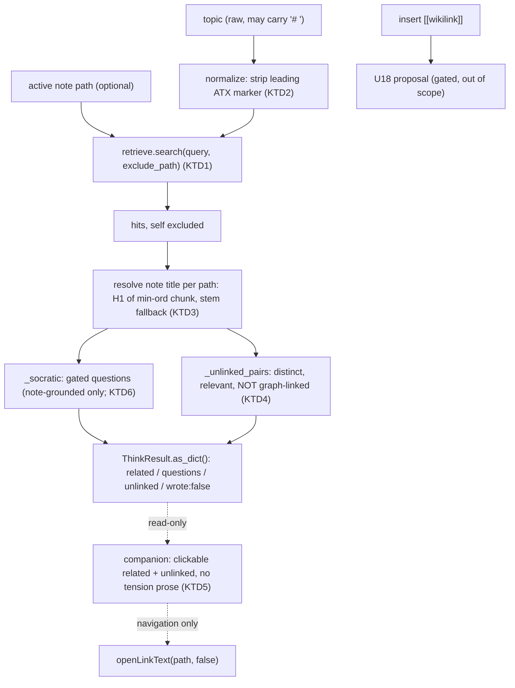

# fix: think-surface quality — meaningful, navigable recall

**Target repo:** `hypermnesic` (this repo, repo root). All `**Files:**` paths are repo-relative.

This is an **engine-side** companion to the Phase-2.5 plan family. Plan 1 (`docs/plans/2026-06-02-006-feat-phase-2-5-engine-deployment-plan.md`, U26–U34) shipped the engine deployment surface; Plan 2 (`docs/plans/2026-06-02-007-feat-phase-2-5-obsidian-companion-plan.md`, U35–U41) is the plugin redesign and explicitly scopes the engine out, *rendering* whatever `think` returns (its U39). Neither plan fixes the **quality** of `think`'s output — that is the original U20 heuristic, revealed broken by dogfooding. This plan owns that fix and continues the shared U-numbering at **U42**.

---

## Summary

The `think` surface renders meaningless output: questions and "tensions" built from the active note matching *itself*, from chunk **section headings** ("Now", "Entries", "Fiche rapide") mistaken for note identities, from a raw `# ` heading marker leaking into the topic, and from a prose template that labels any two co-retrieved-but-unlinked notes a "tension." This plan makes the surface honest and navigable: exclude the active note from its own results, strip the topic's leading `#`, use note-level titles instead of section headings, replace the baked-prose `tensions: list[str]` with a structured `unlinked` list carrying `{a_path, a_title, b_path, b_title}` so the companion can render **clickable** links to both notes, and gate the Socratic `questions` so only note-grounded prompts survive. Navigation stays read-only (`wrote: false`); actually inserting a `[[wikilink]]` remains on the gated U18 proposal path.

---

## Problem Frame

Tracing the panel's gibberish — *"'Urban planning insights session' and 'Now' both surface here but aren't linked — tension, or a missing connection?"* — to source reveals four compounding garbage-in defects feeding fixed templates in `src/hypermnesic/think.py` (`_socratic`, `_tensions`), which are heuristic by design ("no LLM"):

1. **Self-inclusion.** The `think` MCP tool takes only `topic` (no note path), and `retrieve.search` has no self-exclusion, so a note is its own #1 hit for its own title. `_socratic`'s third question and every `_tensions` pair are seeded from `hits[0]` — the note being written. (The old `search` path in `obsidian-plugin/main.ts` *does* filter `h.path !== activePath`; the `think` path never had it.)
2. **Raw topic.** `_socratic` interpolates `{topic}` verbatim and the tool echoes it back, so `topic = "# Urban planning insights session"` leaks the ATX marker into the panel header and every question.
3. **Section heading mistaken for identity.** `Hit.heading` is the matched chunk's *nearest preceding section heading* (`src/hypermnesic/ingest.py`), so structural notes surface their section labels ("Now" = a backlog README's `## Now`, "Entries" = a LOG section, "Fiche rapide" = an artifact section). `_socratic`/`_tensions` treat these as concepts.
4. **Unearned "tension" framing.** `_tensions` emits one entry for *every* unlinked pair among the top-4 hits with no relevance gate and no conflict test — "both surface here but aren't linked" is trivially true of almost any two results. It even discards the real paths it computes one line above the prose string, so the client has nothing to navigate to.

It is not a regression — `think.py` has a single commit. The heuristic is static; its inputs degrade as the vault accumulates structural/index notes, so it *feels* like it is getting dumber. The valuable kernel ("here are related notes — go look") survives; the fix keeps the signal, drops the unearned prose, and makes it navigable.

---

## Requirements

**Retrieval correctness**

- R1. The active note is excluded from its own `think` results — it never appears in `related`, in a question, or in an `unlinked` pair. (origin R10)
- R2. After self-exclusion `think` still returns up to `k` related notes when that many distinct matches exist (over-fetch absorbs the dropped self).

**Honest, navigable surfacing**

- R3. The echoed `topic` and all generated prose are free of a leading Markdown ATX marker (`#`–`######`). (origin R10)
- R4. Note identity in questions and pairs uses a **note-level title** (the note's H1, with a de-kebabbed path-stem fallback), never a matched chunk's section heading. (origin R10)
- R5. The prose `tensions` list is replaced by a structured `unlinked` list; each entry carries `{a_path, a_title, b_path, b_title}` for two **distinct, relevant, non-graph-linked** notes, so a client can render clickable navigation to both. (origin R10)
- R6. The "tension" framing is removed — the surface presents these as related-but-not-yet-linked notes, not asserted conceptual conflicts. (origin R10)
- R9. The Socratic `questions` are gated to note-grounded prompts: the two ungrounded generic templates (`"What would change your mind about {topic}?"`, `"Where does {topic} break down…"`) are dropped, and the note-referencing prompt (`"How do 'A' and 'B' inform each other?"`) survives only when ≥2 distinct, relevant, self-excluded related notes exist — using resolved titles (R4). `questions` may legitimately be empty (degrades gracefully). (origin R10)

**Read-only invariant (unchanged)**

- R7. `think` stays structurally read-only: `wrote: false`, no `commit_note`/`propose` in its import surface, the MCP `think` tool keeps `readOnlyHint=True`. Inserting a `[[wikilink]]` is never done here — it stays on the gated U18 path. (origin R11, R15; KD1)

**Client rendering**

- R8. The companion renders `related` and `unlinked` as clickable links that open existing notes (read-only navigation via `openLinkText(..., false)`), shows the cleaned topic and the `wrote: false` badge, and renders no "tension" prose. (origin R8, R10, R11)

---

## Key Technical Decisions

- KTD1 — Self-exclusion lives in `retrieve.search` via an optional `exclude_path`, threaded from `think(topic, ..., path=...)` and surfaced as an optional `path` on the `think` MCP tool and `--path` on the CLI. Rationale: `search` is the only layer that sees all candidates; it already over-fetches (`candidate_k=50` ≫ `k`), so dropping one path preserves `k`; the plugin already knows the active note (`view.file?.path`). Reusable beyond `think`. (R1, R2)

- KTD2 — Topic normalization in `think()` (strip a leading `#{1,6}\s+` ATX marker and surrounding whitespace), so both the CLI and the MCP tool benefit and the echoed `topic` is clean. Idempotent for already-clean topics — `topic == "Hetzner"` stays `"Hetzner"`, preserving the existing CLI-shape and round-trip tests. Only a *leading heading* marker is stripped; an inline `#tag` is left intact. (R3)

- KTD3 — Note title = the note's **first level-1 heading** (`# `), with a de-kebabbed path-stem fallback (strip a leading ISO-date prefix; `-`/`_` → spaces) when the note has no H1. Resolution must be **H1-level-specific**: the index stores chunk `heading` *text* without its level (`src/hypermnesic/ingest.py`), so the lowest-`ord` chunk heading of a structural note that opens with `## Now` (no H1) is `"Now"` — which would reproduce the exact defect this plan fixes. Resolve the real H1 either by recording the heading level at ingest (a small index field) or by matching `^# ` against the note body (no schema change); treat an H2-first / no-H1 note as "no H1" so it takes the stem fallback. Rationale: a chunk `heading` is a section label, not identity. (R4)

- KTD4 — `tensions: list[str]` becomes `unlinked: list[dict]` of `{a_path, a_title, b_path, b_title}`. Pairs are drawn from the top-N relevant hits *after self-exclusion*, are distinct notes, and are **not** graph-neighbors (`graph.neighbors`); capped at 3. Rationale: keep the genuinely useful "related but not yet linked" signal, drop the unearned "tension" label, and carry the paths the old code computed and threw away so the client can navigate. This is a deliberate contract change consumed by plan 007's U39. (R5, R6)

- KTD5 — The renderer is **navigation-only**; writes stay on U18. Clicking a title opens the existing note (`openLinkText(path, "", false)`); the `wrote: false` invariant and the static read-only assertion in `tests/test_obsidian_plugin.py` hold. (R7, R8)

- KTD6 — Socratic `questions` must earn their place, same as `unlinked` pairs. The two ungrounded generic templates are dropped (they reference nothing the retrieval found and read as boilerplate — the same "unearned prose" defect as the old tensions); only the note-grounded prompt survives, gated on ≥2 distinct relevant related notes and rendered with resolved titles. Rationale: applying one honesty bar across the whole surface, rather than fixing pairs while leaving the questions generic. An LLM-generated questions surface stays explicitly out of scope. (R9)

---

## High-Level Technical Design

Data flow after the fix — one normalization at entry, self-exclusion at retrieval, title resolution and a relevance-gated pair builder before the read-only result:



Contract change in `ThinkResult.as_dict()` (the shape plan 007's U39 renders):

```text
before: { topic, wrote, related, context, questions, tensions: [ "<prose string>", ... ], degraded_lexical_only, note }
after:  { topic, wrote, related, context, questions, unlinked: [ {a_path,a_title,b_path,b_title}, ... ], degraded_lexical_only, note }
```

The contract change is **two-part**, both deliberate and both consumed by plan 007 U39: (1) `tensions: list[str]` → `unlinked: list[dict]`; and (2) each `related` entry gains a `title` field (note identity, distinct from the chunk `heading`) — `{ path, heading, title, score, channels, snippet, recency }`. Directional guidance, not implementation specification — prose is authoritative where it and the diagram disagree.

---

## Implementation Units

Execution posture: **test-first** throughout (global TDD rule; the engine units sit in the Python behavioral suite). The TypeScript renderer (U46) is covered by the static read-only assertion in `tests/test_obsidian_plugin.py` plus manual Obsidian load, consistent with plan 007's posture.

### U42. Active-note exclusion (retrieve + think + tool + CLI)

- **Goal:** A note never matches itself; the active note is absent from all `think` output.
- **Requirements:** R1, R2; origin R10.
- **Dependencies:** none.
- **Files:** `src/hypermnesic/retrieve.py`, `src/hypermnesic/think.py`, `src/hypermnesic/mcp_server.py`, `src/hypermnesic/cli.py`, `tests/test_retrieve.py`, `tests/test_think.py`.
- **Approach:** Add `exclude_path: str | None = None` to `retrieve.search`; skip hits whose `path == exclude_path` while building the candidate list (before the truncation to `k`), so the `candidate_k`-deep pool keeps `k` intact. Add `path: str | None = None` to `think()`, forwarded as `exclude_path`. Add an optional `path` argument to the `think` MCP tool (`src/hypermnesic/mcp_server.py`) and a `--path` flag to CLI `think` (`src/hypermnesic/cli.py`). The one-hop `build_context` anchor becomes the top *non-self* hit (which, post-exclusion, is just `res.hits[0]`).
- **Execution note:** test-first; assert the exclusion against the existing `make_corpus`/`fake_embedder` fixtures.
- **Patterns to follow:** the client-side `h.path !== activePath` filter in `obsidian-plugin/main.ts`; the `Hit`/`SearchResult` construction loop in `retrieve.search`.
- **Test scenarios:**
  - Covers R1. `think(idx, "<a note's title>", path="<that note>.md")` → that path is absent from `related`, from every `questions` entry, and from every `unlinked` pair.
  - Covers R2. With `exclude_path` set and more than `k` other matches present, exactly `k` related are returned (self-exclusion does not shrink below `k`).
  - `retrieve.search(..., exclude_path=p)` omits `p`; with `exclude_path=None` results are byte-for-byte unchanged (regression guard for existing `test_retrieve.py` cases).
  - `build_context` anchors on the top non-self hit.
  - No-write boundary holds: git HEAD and `idx.all_paths()` unchanged after `think`.
- **Verification:** `uv run pytest tests/test_retrieve.py tests/test_think.py` green.

### U43. Topic normalization (strip leading ATX marker)

- **Goal:** The `#` heading marker never reaches the echoed topic or any question.
- **Requirements:** R3; origin R10.
- **Dependencies:** none (independent of U42).
- **Files:** `src/hypermnesic/think.py`, `tests/test_think.py`.
- **Approach:** Normalize `topic` at the top of `think()` — strip a leading `#{1,6}` plus following whitespace and surrounding whitespace — and use the cleaned value both in `ThinkResult.topic` and in `_socratic`. Leave inline `#` (e.g. a `#tag` mid-sentence) untouched; only a leading heading marker is removed.
- **Execution note:** test-first.
- **Patterns to follow:** the ATX-heading regex already used in `src/hypermnesic/ingest.py` (`^\s{0,3}#{1,6}\s+`).
- **Test scenarios:**
  - Covers R3. `topic="# Urban planning insights session"` → `result.topic == "Urban planning insights session"`; no `"#"` appears in any `questions` string.
  - `"## "` / `"###"` leading markers also stripped.
  - Idempotent: `topic="Hetzner"` stays `"Hetzner"` (preserves `test_cli_think_matches_tool_shape` and `test_think_as_dict_round_trips`).
  - An inline `"see #urbanism"` retains its `#` (only the leading heading marker is stripped).
- **Verification:** `uv run pytest tests/test_think.py tests/test_cli.py` green.

### U44. Note-title resolution (identity, not section heading)

- **Goal:** Questions and pairs name notes by their title, never by a matched chunk's section heading.
- **Requirements:** R4; origin R10.
- **Dependencies:** U42 (operates on self-excluded hits).
- **Files:** `src/hypermnesic/think.py`, `tests/test_think.py` (and a read-only helper read against `src/hypermnesic/index.py`'s `chunks_for_path`/`get_chunk` if one is added).
- **Approach:** Add a `_title(idx, path)` helper that resolves the note's **first level-1 heading** (`# `) — NOT merely the lowest-`ord` chunk `heading`, which carries no level and would return a section label like `"Now"` for an H2-first / no-H1 structural note (the exact defect being fixed). Detect the H1 by recording the heading level at ingest (a small index field) or by matching `^# ` against the note body (no schema change). When the note has no H1, fall back to a de-kebabbed path-stem (strip a leading `YYYY-MM-DD` prefix; replace `-`/`_` with spaces). Use it for the two notes named in `_socratic`'s third question and for the `unlinked` pairs (U45). Also add a `title` field to each `related` entry — a deliberate, named extension of the `think` `related` contract (see the contract block in High-Level Technical Design); the companion renders `title` as the link label, falling back to the chunk `heading` when `title` is empty.
- **Execution note:** test-first; cover both the H1 branch and the stem fallback.
- **Patterns to follow:** `_doc_surface`'s `title = headings[0] if headings else Path(path).stem.replace("-", " ")` in `src/hypermnesic/ingest.py`; the `chunks_for_path` / `get_chunk` accessors in `src/hypermnesic/index.py`.
- **Test scenarios:**
  - Covers R4. A note whose matched chunk sits under a `## Now`-style section resolves its title to the note's H1, not `"Now"`.
  - Covers R4. A structural note whose **first heading is an H2** (`## Now`, no H1 anywhere) resolves to the de-kebabbed stem, NOT `"Now"` — guards the level-specific resolution against the original defect.
  - Fallback: a note with no H1 resolves to the de-kebabbed stem; a `2026-06-03-foo-bar.md` stem yields `"foo bar"` (date prefix stripped).
  - The third question (`"How do 'A' and 'B' inform each other?"`) uses resolved titles, not section headings.
  - Each `related` entry carries a non-empty `title`.
- **Verification:** `uv run pytest tests/test_think.py` green.

### U45. Structured `unlinked` pairs replace prose tensions

- **Goal:** Replace `_tensions` prose with relevance-gated, self-excluded, navigable pairs; rename the field; drop the "tension" framing.
- **Requirements:** R5, R6; origin R10.
- **Dependencies:** U42 (self-exclusion), U44 (titles).
- **Files:** `src/hypermnesic/think.py` (`_tensions` → `_unlinked_pairs`, `ThinkResult.tensions` → `unlinked`, `as_dict`), `src/hypermnesic/cli.py` (the non-JSON `think` text path consumes `r.tensions` — see Approach), `src/hypermnesic/mcp_server.py` (verify pass-through), `tests/test_think.py`, `tests/test_cli.py`.
- **Approach:** `_unlinked_pairs(idx, graph, hits)` iterates distinct unordered pairs `(a, b)` among the top-N relevant hits (after self-exclusion); emits `{a_path, a_title, b_path, b_title}` (titles via U44) for pairs where `b not in graph.neighbors(a)`; caps at 3. Keep the heuristic but gate on relevance — the hits are already relevance-ordered, so "top-N" is the gate; require `a_path != b_path`. Rename `ThinkResult.tensions` → `unlinked`; the `as_dict()` key becomes `unlinked` and the old `tensions` key is dropped. Update **every** consumer that names `tensions` — notably `src/hypermnesic/cli.py`'s `_cmd_think` non-JSON branch, which today does `for q in r.questions + r.tensions:` and will `AttributeError` after the rename (and cannot simply swap to `r.unlinked` — those are dicts, not strings); render the unlinked pairs as their own lines (e.g. `~ {a_title} ↔ {b_title}`). (Note: `tests/test_mcp_server.py` does not reference the key today, so the live attribute consumer is `cli.py`, not that test.)
- **Execution note:** test-first; this is the contract change — write the new `as_dict` shape assertion before editing.
- **Patterns to follow:** the existing `_tensions` pair loop and `graph.neighbors` usage in `src/hypermnesic/think.py`; the mutually-wikilinked `hetzner.md`/`net.md` corpus in `tests/test_think.py`.
- **Test scenarios:**
  - Covers R5. Two relevant, non-graph-linked notes (self excluded) → one `unlinked` entry with all four fields populated and `a_path`/`b_path` resolvable.
  - Covers R5. A graph-linked pair (the mutually-linked `hetzner.md`/`net.md`) produces **no** `unlinked` entry.
  - Covers R6. `as_dict()` has key `unlinked` (list of dicts), has **no** `tensions` key, and is JSON-serialisable.
  - With `path` set, the active note never appears as `a` or `b`.
  - Degenerate input (≤1 non-self hit) → `unlinked == []`, `wrote is False`.
  - Covers R5. The non-JSON CLI path (`hypermnesic think <repo> <topic>` without `--json`) runs without error after the rename and prints the unlinked-pair titles — a regression guard for the `cli.py` consumer that the old `r.tensions` access would otherwise break.
- **Verification:** `uv run pytest tests/test_think.py tests/test_cli.py` green; the `as_dict` round-trip and CLI `think` shape tests updated for `unlinked`.

### U46. Companion renders clickable related + unlinked (navigation-only)

- **Goal:** Render `related` and `unlinked` as clickable links opening existing notes; show cleaned topic + `wrote: false`; render no "tension" prose; introduce no write affordance.
- **Requirements:** R8; origin R8, R10, R11.
- **Dependencies:** Conditional on the live-renderer resolution (see Open Questions). If plan 007 U39 lands first → U46 depends on U39 and is **rendering-shape only** (no `think` wiring, no allowlist touch). If U46 lands first → U46 also wires the `think` call, adds `think` to the allowlist, and updates the static allowlist assertion in lockstep. Always depends on U45 (the new contract).
- **Files:** `obsidian-plugin/main.ts`, `tests/test_obsidian_plugin.py` (static read-only scan must stay green).
- **Approach:** Render each `related` entry and each `unlinked` pair as read-only links via `openLinkText(path, "", false)` — the same navigation the current related list already uses; render the `wrote: false` badge and the cleaned `topic`; render no "tension"/"missing connection" string. **Rendering spec (so this unit and plan 007 U39 render the contract identically):** section label `"Related — not yet linked"` (no "tension" framing); when `unlinked == []`, omit the section entirely (no empty placeholder); render each pair on one row as two inline links separated by a neutral connector (`↔`), each link individually keyboard-focusable; the link label is the `related`/pair `title` (U44), falling back to the chunk `heading` when `title` is empty. **Navigation vs. write:** the links open notes read-only and there is deliberately **no** "link these" / "open as proposal" affordance on the unlinked surface — inserting a `[[wikilink]]` is a U18 write, out of scope; if any cue is needed it is a tooltip clarifying "opens the note", never a write control. **Coordination:** plan 007's U39 is the unit that adds `think` to the plugin allowlist and the thinking-mode command. If U39 lands first, fold this rendering (and the rendering spec above) into it; if this unit lands first, U39 consumes the `unlinked` key and the `related[].title` field. Touch the `think` allowlist + the static allowlist assertion **only** if this unit is the one wiring the `think` call — otherwise leave the allowlist to U39. The no-vault-write static assertion holds either way. (Full accessibility/aria-live and the interaction-state machine remain plan 007 U41's scope; this unit only sets the pair-link focus model it introduces.)
- **Execution note:** keep the static read-only assertion green; navigation-only (`openLinkText`), never create/modify a note.
- **Patterns to follow:** the existing `openLinkText(h.path, "", false)` related-list rendering and `parseToolResult` in `obsidian-plugin/main.ts`; plan 007 U39's thinking-mode rendering spec.
- **Test scenarios:**
  - Covers R8. (static + manual) Related and unlinked links call `openLinkText` with `create=false`; no `vault.create/modify/append/trash` / `adapter.write` is introduced (the static no-vault-write scan in `tests/test_obsidian_plugin.py` still passes).
  - No `"tension"` / `"missing connection"` literal remains in the rendered think view.
  - The `wrote: false` badge renders; the topic shows with no leading `#`.
  - If `think` is wired in this unit: the allowlist includes `think` and the static allowlist assertion is updated in lockstep (otherwise this scenario is owned by plan 007 U39).
- **Verification:** `uv run pytest tests/test_obsidian_plugin.py` green; manual Obsidian load shows clickable related + unlinked pairs and no tension prose.

### U47. Gate the Socratic questions to note-grounded prompts

- **Goal:** Stop emitting ungrounded boilerplate questions; keep only the note-grounded prompt, behind the same relevance bar as `unlinked`.
- **Requirements:** R9; origin R10.
- **Dependencies:** U42 (self-exclusion), U44 (titles). Engine-side — lands with U42–U45, ahead of the U46 renderer.
- **Files:** `src/hypermnesic/think.py` (`_socratic`), `tests/test_think.py`.
- **Approach:** Rewrite `_socratic` to drop the two ungrounded generic templates (`"What would change your mind about {topic}?"`, `"Where does {topic} break down…"`) and keep only the note-referencing prompt (`"How do 'A' and 'B' inform each other?"`), emitted only when ≥2 distinct, relevant, self-excluded related notes exist, using resolved titles (U44) rather than chunk section headings. The result is allowed to be an empty list — `think` already degrades gracefully when nothing relevant is found.
- **Execution note:** test-first.
- **Patterns to follow:** the relevance/self-exclusion bar used by `_unlinked_pairs` (U45) — apply the same gate so questions and pairs are consistent.
- **Test scenarios:**
  - Covers R9. With ≥2 distinct relevant related notes (self excluded), `questions` contains exactly the one note-grounded prompt, naming resolved titles (not section headings) and never the active note.
  - Covers R9. With <2 distinct relevant related notes, `questions == []` (graceful) — no generic boilerplate emitted.
  - Neither ungrounded generic template string (`"change your mind"`, `"break down"`) appears in any `questions` entry.
  - The existing no-side-effects test still holds (`wrote is False`; HEAD and index unchanged); update its `len(questions) >= 1` expectation to match the gated behavior on the test corpus.
- **Verification:** `uv run pytest tests/test_think.py` green; the gated `_socratic` emits only grounded prompts.

---

## Risks & Dependencies

- **Contract change consumed downstream.** The two-part contract change (`tensions` → `unlinked`, plus `related[].title`) is rendered by plan 007's U39, which is `status: active` but not yet implemented. Plan 007 U39 currently names the `tensions` key in **three places** — its Goal, its Approach render description, and its "Patterns to follow" engine-contract line — all of which must flip to `unlinked` (and pick up `related[].title`). Treat updating those three references as a **hard precondition** of U46, not advisory. The brainstorm's R10/AE3 wording ("tensions") is informational, not a binding contract. Mitigation: land this plan's engine units (U42–U45) and U46 together so the shipped contract and its renderer agree.
- **Live-renderer discrepancy (open).** The dogfooding screenshot renders Questions/Related/Tensions with a `wrote: false` badge, but the committed `obsidian-plugin/main.ts` renders only a flat `search` list — it does not call `think`. The integration target for U46 is therefore unconfirmed (committed `main.ts` vs an unmerged think-rendering build vs plan 007's U39). Resolve before starting U46. Mitigation: U46 is scoped to the rendering *shape* and explicitly defers the `think` allowlist wiring to whichever unit owns it.
- **Self-exclusion vs. result count.** Dropping the active note must not shrink results below `k`. Low risk — `retrieve.search` already builds a `candidate_k=50` pool before truncating to `k`. Mitigation: R2 test asserts `k` is preserved.
- **Title fallback quality.** The de-kebabbed, date-stripped path stem is imperfect for notes without an H1; the H1 path (KTD3) covers the common case. Acceptable for a heuristic identity label; revisit only if fallbacks prove noisy.
- **Dependency (Plan 1 — shipped).** The `think` MCP tool, `READ_TOOL_NAMES = {search, build_context, think}`, and the per-`Hit` `recency` field are merged to `main` and available; this plan touches `think`'s payload, not its registration.

---

## Scope Boundaries

### Deferred to follow-up work

- The full calm-surface companion redesign — shared retrieval core, forgetting-curve ranking, status-bar/gutter surfaces, capability handshake, interaction-state machine — is **plan 007** (U35–U41), not this plan.
- Inserting a `[[wikilink]]` for the user ("open as a proposal" / connection-accept) is a **write** and stays on the gated U18 proposal path (KD1); only navigation is in scope here.

### Outside this product's identity

- The companion never writes the vault and never merges — navigation only (`openLinkText`, `create=false`).
- `think` stays heuristic and read-only — no LLM-generated questions or pairs (an LLM thinking pass is a separate product decision, explicitly out of scope), and no `commit_note`/`propose` in the import surface.

---

## Open Questions / Deferred to Implementation

- Which renderer is the live integration target for U46 (committed `main.ts` vs an unmerged think build vs plan 007 U39)? — confirm before U46 (see Risks).
- The exact relevance gate for `unlinked` pairs — top-N only vs. an additional score band/threshold; start with top-N over self-excluded hits and tune against the real vault. Note the gate interacts with KTD3: if structural/index notes remain in the top-N, the unlinked surface can re-create the "meaningless pair" problem under a new label.
- Whether to also expose `exclude_path` on the public `search` MCP tool (not only `think`) — deferred; `think` is the consumer that needs it now.
- Title resolution mechanism — recording the heading level at ingest vs. matching `^# ` against the note body (KTD3); either resolves the H2-first defect without a per-path `title` column. Also confirm `_title` is stable across re-ingests (the resolved H1 should not flip if chunk `ord` ordering changes).
- `related[].title` link-label fallback and whether `_title` should live as a shared `index` helper (reused by plan 007 U39) rather than private to `think.py`.

---

## Sources / Research

- Think surface and its heuristics: `src/hypermnesic/think.py` (`_socratic`, `_tensions`, `ThinkResult.as_dict`).
- Retrieval and the `Hit` shape: `src/hypermnesic/retrieve.py` (`search`, `Hit`, `candidate_k=50` pool, `collapse_duplicates`).
- Chunk `heading` is a section label, and the doc-surface `title` derivation: `src/hypermnesic/ingest.py`.
- The `think` MCP tool contract and read-only split: `src/hypermnesic/mcp_server.py` (`READ_TOOL_NAMES`, `readOnlyHint=True`).
- Existing tests and fixtures to extend: `tests/test_think.py` (no-write boundary, `as_dict` round-trip, mutually-linked `hetzner.md`/`net.md` corpus), `tests/test_retrieve.py`, `tests/test_obsidian_plugin.py` (static read-only + allowlist scan).
- Current renderer and read-only navigation: `obsidian-plugin/main.ts` (`openLinkText(..., false)`, `parseToolResult`, `READ_ONLY_TOOLS`).
- Origin: `docs/brainstorms/2026-06-02-obsidian-companion-plugin-redesign-requirements.md` (R10–R12 thinking-mode). Sibling plans: `docs/plans/2026-06-02-006-feat-phase-2-5-engine-deployment-plan.md` (engine), `docs/plans/2026-06-02-007-feat-phase-2-5-obsidian-companion-plan.md` (plugin; U39 renders this contract).
