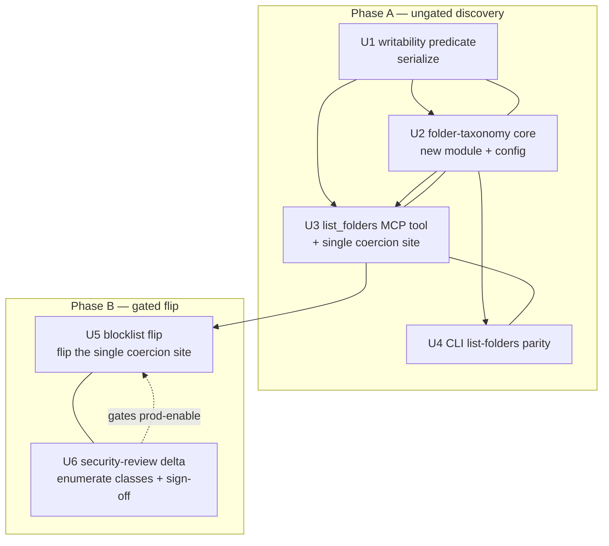

# Vault-folder discovery tool + blocklist write model

## Summary

Add a read-scoped `list_folders` tool (MCP + CLI) that walks the vault's content-folder taxonomy —
drill-down by `root`, optional bounded `depth` — returning each folder's writability, protected
reason, and recursive note count, derived from the committed-HEAD index. Single-source the
writability rule out of the existing write guard so discovery can never disagree with what
`commit_note` accepts. Then flip `commit_note`'s default writable surface from the 4-prefix
allowlist to a blocklist (protected-path refusal as the sole bound), behind an operator-signed
security-review delta that **enumerates and decides the newly-writable governance classes**. Ships
in two phases: the read-only discovery tool first (ungated), the write-model flip second (gated).

---

## Problem Frame

Agents writing via `commit_note` must guess a repo-relative path with no way to discover the vault's
folder taxonomy or which locations are writable, so notes land inconsistently — and the current
4-prefix write allowlist refuses the operator's real content folders (`projects/`, `people/`,
`companies/`, `meetings/`) outright. Full motivation and the security reconciliation are in the
origin requirements doc (see Sources & References).

Plan-specific framing surfaced in research and review:
- The blocklist behavior already exists at the guard level (`serialize.check(allowlist=None)` permits `projects/` today); what gates it is the server coercing `None → DEFAULT_WRITE_ALLOWLIST` before calling `commit_note`. That coercion happens at **two cascading sites** (`build_cloud_server` pre-coerces, then `build_server` coerces again), so the flip must collapse them to one site.
- The effective write surface is not currently visible to read-tool closures, so the discovery tool's writability flag requires threading it into the read path.
- The flip widens the write surface to *everything under the content root except the protected classes* — which includes governance/CI/non-`.md` files (`Dockerfile`, `*.yml`, lockfiles, `node_modules/x.md`) that the 4-prefix allowlist refused only **by exclusion**, never by `protected_reason()`. This is the V1 "missed governance-file class" residual, amplified; the security delta (U6) must own it.

---

## Requirements

**Discovery tool — read surface**
- R1. New read-scoped `list_folders` tool in `READ_TOOL_NAMES`, available to every read client and mirrored on the CLI; converges to HEAD and carries `manual_reindex_recommended` like the other read tools.
- R2. Takes `root` (repo-relative prefix; empty = vault root) and optional `depth` (default 1); returns child folders under `root` to `depth` levels.
- R3. Each folder entry carries: repo-relative path, `writable` boolean, protected reason (string or null), and a note count.
- R4. Output is bounded (max node cap + `truncated` signal + omitted count) and deterministically sorted (sort applied before the cap, so truncation drops a deterministic tail).
- R5. Taxonomy is derived from the committed-HEAD index (`index.Index.all_paths()`), structurally limited to folders containing indexed markdown.
- R6. Typed MCP `outputSchema` (TypedDict) mirroring the existing tool outputs.

**Writable awareness — discovery ↔ write parity**
- R7. The `writable` flag is computed from the install's effective write configuration (single-sourced from the guard), evaluated so it matches what `commit_note` would accept for a file written **directly into** that folder; discovery never advertises a folder `commit_note` would refuse.
- R8. Protected folders that contain indexed notes (e.g. `skills/`, `views/`, and *nested* ones like `projects/scripts/`) appear, marked non-writable with a reason — not hidden.
- R9. The protected classification reuses the guard's existing rule — no second implementation.

**Blocklist write model — coupled change**
- R10. `commit_note`'s default writable surface flips from the 4-prefix allowlist to a blocklist (everything under the content surface except the protected classes, subject to the U6 governance-fence decision).
- R11. Reuses the existing guard machinery (`serialize.check` with `allowlist=None`); no new write tool/path.
- R12. A narrowed allowlist (e.g. `--allowlist captures/`) remains an explicit operator opt-in escape hatch; no longer the default.
- R13. The flip weakens no other control (per-tool `write` scope, operator-consent gate, protected-path refusal, diff-or-die, server-set actor, audit log, git-revertability).

**Security sign-off gate**
- R14. The flip ships behind a fresh, operator-signed security-review delta amending the 2026-06-03 write-anywhere review; not enabled in production until signed, with the gate enforced (not advisory).

**Origin actors:** A1 (writing agent), A2 (read-only cloud connector), A3 (operator / sign-off), A4 (the engine)
**Origin flows:** F1 (discover-then-place), F2 (bounded descent), F3 (see-but-avoid protected), F4 (sign-off gate), F5 (re-narrowed install)
**Origin acceptance examples:** AE1 (covers R2, R4), AE2 (covers R7, R10), AE3 (covers R7, R12), AE4 (covers R8, R9), AE5 (covers R5), AE6 (covers R10, R14), AE7 (covers R6)

---

## Scope Boundaries

### Deferred for later
*(carried from origin — product sequencing)*
- An optional taxonomy hint in `commit_note`'s refusal (recovery aid when an agent still guesses wrong).
- Folder metadata beyond writable / protected / note count (last-modified, salience).

### Outside this effort's identity
*(carried from origin — positioning rejection)*
- A "suggest-a-path-for-this-note" helper that infers placement from a note's content — the inference `commit_note` deliberately refuses.
- A scope-gated full-vs-writable exposure split (a third "privileged" scope).
- Exposing anything beyond the content surface (governance / dot / binary dirs).

### Deferred to Follow-Up Work
*(plan-local — non-blocking)*
- A `docs/solutions/` learning capture ("allowlist→blocklist write-guard flip: protected-path refusal as sole bound, plus the governance-fence decision") via `/ce-compound` after merge. Post-merge, does not block any phase.

---

## Context & Research

### Relevant Code and Patterns
- Read-tool registration + TypedDict `outputSchema` + `backend.converge()` + `manual_reindex_recommended`: the `resolve` tool in `src/hypermnesic/mcp_server.py`; `READ_TOOL_NAMES`/`WRITE_TOOL_NAMES` at the bottom of that file.
- Write guard: `src/hypermnesic/serialize.py::check` (within-repo/absolute/traversal checks → `protected_reason` → `if allowlist is not None:` narrowing — `None` already = blocklist) and `protected_reason` (checks `parts[:-1]` + `parts[0]`, deliberately excluding the leaf); `commit_note` threads `allowlist` straight through in `src/hypermnesic/commit_note.py` and enforces **no `.md` suffix** on the path.
- Effective-allowlist coercion (`None → DEFAULT_WRITE_ALLOWLIST`) lives at TWO cascading sites: `build_cloud_server` (pre-coerces, then passes a non-`None` list into `build_server`) and inside `build_server`'s `if write_enabled:` block, both in `src/hypermnesic/mcp_server.py`.
- Taxonomy source: `src/hypermnesic/index.py::Index.all_paths()` (returns an unordered `set[str]` of file paths; no folder/prefix derivation exists anywhere).
- CLI read subcommand to mirror: `_cmd_resolve` + its subparser wiring in `src/hypermnesic/cli.py`; `--allowlist` flag (`action="append", default=None`) on `serve`/`serve-cloud`; `_cmd_retrieve` already shows the `manual_reindex_recommended` surfacing fix (was previously dropped).
- Config tunables: `src/hypermnesic/config.py` `CONVERGE_*` constants; `CONVERGE_MAX_DELTA_FILES = 200` → `manual_reindex_recommended` is the existing "cap + emit a signal" precedent to mirror for truncation.
- Test harness: `tests/conftest.py` (`make_corpus(files, *, git=True)`, `fake_embedder`); `tests/test_mcp_server.py` (`_call(srv, name, args)` via `srv.call_tool`, `built_index` fixture, `TAILNET_IP = "100.64.0.1"`, `_set_principal`/`_write_server`, the three exact-equality assertions, `test_each_read_tool_converges` which invokes only `search`/`build_context`/`think`); `tests/test_serialize.py` (`test_protected_paths_refused`, `test_writable_paths_allowed`, `test_allowlist_enforced`); `tests/test_auth_cloud.py` (`_cloud_call_as(srv, scopes, name, args)`, `RES`/`PUBLIC`, `test_cloud_server_defaults_to_write_anywhere_under_guards`); `tests/test_cli.py` (`_neutralize_key`, `cli.main([...])`, `_capture_build`).

### Institutional Learnings
- `docs/2026-06-03-unified-write-anywhere-security-review.md`: the prior allowlist-widening cleared a signed-off G3 review. **Caveat surfaced in review:** that review's "the only widened dimension is the allowlist" proof reasoned about a strictly narrower delta — `captures/` → the 4-prefix master surface, where *every path on both sides was already a note zone*. The blocklist flip widens to the whole content surface, so the prior proof is **not** a free re-use: governance/CI/non-`.md` classes become writable that the allowlist refused by exclusion. The U6 delta must re-derive the argument for the wider surface, not cite the old one.
- `docs/threat-model-commit-note.md` (V1): keep the guard **rule-based** (file class), not a fixed enumeration. V1's mitigation explicitly leaned on the now-removed backstop — *"Prefer a deny-by-default / allowlist posture for content paths where feasible."* Removing it leaves only the rule-based denylist the threat model already flagged as having a "missed governance-file class" residual. (V14): `commit_note` must keep self-enforcing the `write` scope; the new read tool registers read-only and never inherits write capability. (V6): the within-repo/traversal check in `check` is not redundant — it guards raw caller-supplied write paths and must stay in `check` (the extracted predicate is path-only, no repo context).
- `docs/solutions/design-patterns/surgical-scalar-set-frontmatter-byte-preservation.md`: when a fix legitimately changes an outcome a test pinned, **relocate** the test to keep covering the invariant — don't flip or delete. Applies to the test the flip genuinely changes (the Phase-A `projects/`-non-writable assertion), not to the protected-path test (which is allowlist-independent and stays green).
- `docs/plans/2026-06-03-001-feat-unified-oauth-endpoint-and-setup-plan.md` (KD4): CLI-for-engine-host-local / MCP-for-remote — the CLI `list-folders` reads the on-disk index with no OAuth, surfacing `manual_reindex_recommended`.

### External References
- None — local patterns and institutional learnings fully cover this work.

---

## Key Technical Decisions

- **Single-source the writability rule, evaluated on a file under the folder.** Extract a pure predicate from `serialize.check` (returns the refusal reason or `None`); `check` wraps it (behavior-preserving) and the folder classifier reuses it. **A folder's writability is evaluated by probing a representative file directly inside it** (e.g. `prefix + "__probe__.md"`), NOT by calling the predicate on the bare folder prefix — because `protected_reason` checks `parts[:-1]` (excludes the leaf), so a bare prefix like `projects/scripts/` would wrongly read as writable while `commit_note` refuses every file under it. The probe makes "folder writable" mean exactly "a direct write here is accepted." Rationale: R7/R8/R9 + KD6; this is the fix for the discovery-lies-about-`projects/scripts/` failure mode.
- **The flip is a single-coercion-site change.** `serialize.check(allowlist=None)` already does blocklist mode; the gate is the `None → DEFAULT_WRITE_ALLOWLIST` coercion, which today happens at two cascading sites. U3 collapses them: `build_cloud_server` stops pre-coercing and passes `write_allowlist` (including `None`) straight through to `build_server`, where a single `_effective_write_surface(write_allowlist)` helper is the *sole* coercion site, consumed by both the write path (`commit_note`) and the read flag (`list_folders`). Only then does "flip in one place / in sync by construction" actually hold.
- **The blocklist's bound is a security decision, not just a default change.** Flipping to blocklist exposes governance/CI/non-`.md` classes (`Dockerfile`, `Makefile`, `*.yml` CI configs, lockfiles, dot-config files, `node_modules/x.md`, `__pycache__/x.md`) that the 4-prefix allowlist refused by exclusion and that `protected_reason()` does **not** refuse — and `commit_note` enforces no `.md` suffix, so these are writable arbitrary-code/credential targets. U6 must enumerate these and decide whether to add a **positive content-surface fence** (e.g. `.md`-only, or an explicit governance-extension denylist) rather than relying solely on `_PROTECTED_DIRS`. See Open Questions.
- **Sanitize `root`.** `list_folders`/`derive_folders` normalize and validate the caller-supplied `root` (reject absolute paths and `..` traversal; normalize to a trailing-slash prefix) before any prefix-filtering. The extracted writability predicate is only ever called on index-derived or sanitized paths; `check` remains the sole entry for raw write paths (V6).
- **Note count is recursive** (notes at/under a folder prefix), not direct-children. Folder keys are normalized to **trailing-slash** prefixes and matched with `startswith(prefix)` (reusing `check`'s `a.rstrip("/") + "/"` convention) so `projects/` does not over-count `projects-archive/`.
- **Bounding via a node cap + signal**, mirroring `CONVERGE_MAX_DELTA_FILES`: new `config.py` constants; sort deterministically **before** the cap; truncation drops to a `truncated` flag + omitted count; drilling deeper is done by narrowing `root` (no cursor pagination in v1). `depth` is clamped to a max.
- **Phased delivery with an enforced gate.** Phase A (read-only discovery) ships first; Phase B (the flip) is gated on the signed delta. "Not enabled in production" is enforced as **merge discipline** — U5 is not merged to `main` before U6 is signed — backed by a recommended CI check that fails if `_effective_write_surface` returns `None` while the delta lacks a signed-off frontmatter field. Because both paths read the same helper, the discovery flag flips with the write path when Phase B lands.

---

## Open Questions

### Resolved During Planning
- Folder writability classification → evaluate via a probe file under the prefix (not the bare prefix), so it matches `commit_note`'s `parts[:-1]` semantics.
- Cloud coercion → collapse to a single `_effective_write_surface` site (remove `build_cloud_server`'s pre-coercion).
- `root` handling → normalize + reject `..`/absolute before filtering.
- Note count → recursive, trailing-slash-normalized prefix match; sort before cap.
- Bounding constants → `config.py` `LIST_FOLDERS_MAX_NODES` (start 200) and `LIST_FOLDERS_MAX_DEPTH` (clamp, start 6).
- Output shape → `ListFoldersOutput` + `FolderEntry` TypedDicts.
- Tool/verb name → `list_folders` (MCP), `list-folders` (CLI).
- Gate enforcement → merge discipline ("not enabled" = "not merged before U6 signed") + a CI check on the delta's signed-off frontmatter.

### Resolve Before Phase B (security decisions — owned by U6)
- **Governance-write fence** [User/operator decision]: should the blocklist add a positive content-surface fence (`.md`-only write, or an explicit governance-extension denylist) rather than relying solely on `_PROTECTED_DIRS`, given that the allowlist's by-exclusion refusal of `Dockerfile`/`*.yml`/lockfiles/dotfiles is being removed? U6 enumerates the exposed classes and records the decision.
- **Case-folding guard fix** [Technical, with a behavior-change decision]: `protected_reason` matches dirs case-sensitively (`Scripts/` ≠ `scripts/`) but instruction-files case-insensitively. On a case-insensitive filesystem (operator's macOS) `Scripts/evil.sh` lands in the protected `scripts/` dir yet is reported writable — inert under the allowlist, reachable under the blocklist. Decide whether to case-fold the dir comparison (a one-line `check` behavior change, so it needs its own characterization decision, not the U1 behavior-preserving constraint).
- **Phase-A writable-flag sequencing** [Product/sequencing]: during Phase A the flag honestly shows `projects/`/`people/`/`meetings/` as non-writable (4-prefix), which routes agents *away* from the folders the tool exists to route them toward. Decide: accept the short-lived intermediate cost (Phase B follows promptly), OR ship Phase A's taxonomy + note counts while withholding the `writable` flag until Phase B (the flag is the only field that's misleading pre-flip).

### Deferred to Implementation
- Exact normalization of empty `root` ("" vs "." ) and the `FolderEntry.path` representation (trailing-slash form).
- Whether to retire `DEFAULT_WRITE_ALLOWLIST` or keep it as a named escape-hatch reference once it is no longer the default.
- Whether to expose a direct-child count alongside the recursive count (only if a consumer needs it).

---

## High-Level Technical Design

> *This illustrates the intended approach and is directional guidance for review, not implementation specification. The implementing agent should treat it as context, not code to reproduce.*

**Output shape (illustrative; final field names settled in implementation):**

```
FolderEntry        = { path: str (repo-relative, trailing-slash),
                       writable: bool, protected_reason: str|null, note_count: int }
ListFoldersOutput  = { root: str, depth: int, folders: [FolderEntry],
                       truncated: bool, omitted: int, manual_reindex_recommended: bool }
```

**Writability is single-sourced AND evaluated on a file under the folder:**

```
writable_reason(rel_path, allowlist):       # extracted from serialize.check; check() wraps it
    r = protected_reason(rel_path)          # allowlist-INDEPENDENT class refusal — the real bound
    if r: return r
    if allowlist is not None and not matches_prefix(rel_path, allowlist):
        return "not in writable allowlist"
    return None

folder writable  ⇔  writable_reason(folder_prefix + "__probe__.md", effective_surface) is None
                    # probe a file UNDER the prefix so parts[:-1] matches the write path
                    # (bare prefix would mis-read projects/scripts/ as writable)
effective_surface = _effective_write_surface(write_allowlist)   # SOLE coercion site; None ⇒ blocklist (Phase B)
```

**root sanitization (before any prefix-filter):** reject absolute / `..`; normalize to trailing-slash prefix.

**Unit dependency / phase graph:**



---

## Implementation Units

### U1. Writability predicate — single-source the guard rule

**Goal:** Extract the "is this path writable, and if not why" decision out of `serialize.check` into a reusable pure predicate, so the discovery tool and the write path share one source of truth. Behavior-preserving for `check`.

**Requirements:** R7, R9

**Dependencies:** None

**Files:**
- Modify: `src/hypermnesic/serialize.py`
- Test: `tests/test_serialize.py`

**Approach:**
- Add a pure function (e.g. `writable_reason(rel_path, *, allowlist) -> str | None`) that runs `protected_reason()` first, then the allowlist-prefix narrowing only when `allowlist is not None` — the exact two-step logic currently inline in `check`. Returns `None` when writable, else the refusal reason.
- Refactor `check` to call it and raise `WriteGuardError(reason)` on a non-None result, **keeping the within-repo resolution + absolute/traversal checks in `check`, ahead of the predicate** (the predicate is path-only and has no repo context — V6 must stay in `check`).

**Execution note:** Characterization-first — this touches the security-critical guard. Lock current `check` behavior with tests before refactoring, then assert the new predicate independently. Note: "behavior-preserving for `check`" ≠ "the widened surface is tested" — the governance-class coverage lives in U5.

**Patterns to follow:** The existing `protected_reason` / `check` structure; keep the rule class-based (threat-model V1).

**Test scenarios:**
- Happy path: `writable_reason("notes/a.md", allowlist=None)` → `None`; `writable_reason("projects/x/y.md", allowlist=None)` → `None`.
- Edge case: `writable_reason("skills/s.md", allowlist=None)` → protected-dir reason; `writable_reason("notes/AGENTS.md", allowlist=None)` → instruction-file reason; `writable_reason("projects/scripts/n.md", allowlist=None)` → protected-dir reason (nested).
- Blocklist governance classes (pin the predicate's blocklist behavior independently of the server default): `writable_reason("Dockerfile", allowlist=None)`, `writable_reason("node_modules/x.md", allowlist=None)`, `writable_reason(".gitlab-ci.yml", allowlist=None)` — assert current behavior so the U6 fence decision has a documented baseline.
- Allowlist mode: `writable_reason("concepts/a.md", allowlist=["notes/"])` → "not in writable allowlist"; `writable_reason("notes/a.md", allowlist=["notes/"])` → `None`.
- Characterization: existing `check` cases (`test_protected_paths_refused`, `test_writable_paths_allowed`, `test_allowlist_enforced`) pass unchanged after the refactor.

**Verification:** `check` behavior is unchanged (existing serialize tests green); the new predicate is independently tested across protected / nested-protected / blocklist-governance / allowlist cases.

---

### U2. Folder-taxonomy derivation core

**Goal:** A pure module that turns the index's path set into bounded, sorted folder entries (path, writable, protected reason, recursive note count) under a sanitized `root`/`depth`/effective-surface, with a truncation signal — unit-testable without a server.

**Requirements:** R3, R4, R5, R7, R8

**Dependencies:** U1

**Files:**
- Create: `src/hypermnesic/folders.py`
- Modify: `src/hypermnesic/config.py`
- Test: `tests/test_folders.py`

**Approach:**
- A pure function (e.g. `derive_folders(paths, *, root, depth, effective_surface, max_nodes, max_depth)`) that: normalizes/validates `root` (reject `..`/absolute; trailing-slash); filters `paths` to those under `root`; derives folder prefixes at each level from `root` to `min(depth, max_depth)`; for each folder computes `writable`/`protected_reason` via `serialize.writable_reason(prefix + "__probe__.md", allowlist=effective_surface)` (U1 — probe a file under the prefix) and a recursive note count (paths at/under the trailing-slash prefix); **sorts deterministically, then** caps at `max_nodes`, returning a `truncated` flag + omitted count.
- Add `LIST_FOLDERS_MAX_NODES` and `LIST_FOLDERS_MAX_DEPTH` to `config.py` in the `CONVERGE_*` style.
- Input is `all_paths()` (already content-only — `.git`/`.obsidian`/`node_modules`/`__pycache__`/non-`.md` never appear), so R5's structural limit is inherited. Note this means `node_modules/`/`__pycache__` are never *discovered* even though they are writable by the guard — the divergence is the basis for the U6 governance-fence discussion, not a discovery concern.

**Patterns to follow:** `config.py` `CONVERGE_MAX_DELTA_FILES` (cap + signal); the trailing-slash prefix convention in `serialize.check`'s allowlist match; `sorted(idx.all_paths())` in `nav_surface.py`.

**Test scenarios:**
- Happy path: corpus `{projects/acme/a.md, projects/hermes/b.md, people/x.md, notes/n.md}`, `root=""`, `depth=1` → top-level folders writable (blocklist surface) with correct recursive counts; `projects/` count = 2.
- Drill-down: `root="projects/"`, `depth=1` → `projects/acme/`, `projects/hermes/`, each writable, count 1.
- Covers AE4. Edge case (top-level protected): `scripts/r.md`, `views/v.md` → those folders appear non-writable with the protected-dir reason.
- Edge case (NESTED protected — the parity-lie guard): corpus `{projects/scripts/x.md}` → `projects/scripts/` appears marked **non-writable** (probe-file classification), proving discovery agrees with `commit_note`'s refusal of `projects/scripts/*`.
- Count correctness: corpus `{projects/a.md, projects-archive/b.md}` → `projects/` count = 1 (does not bleed into `projects-archive/`).
- Covers AE5. Edge case: a corpus where `.obsidian/x.md` exists does not surface `.obsidian/` (never in `all_paths()`) — assert via building the index.
- Covers AE1. Bounding: a corpus exceeding `LIST_FOLDERS_MAX_NODES` child folders → capped, `truncated=True`, omitted > 0, deterministic (sorted) order, truncation drops a deterministic tail.
- Edge case: `depth` above `LIST_FOLDERS_MAX_DEPTH` clamped; empty `root` lists vault-root folders; a `root` with no descendants returns an empty list.
- Security: `root="../etc"` or an absolute `root` is rejected/normalized — no paths outside the vault root are returned.
- Allowlist mode: `effective_surface=["notes/"]` → `notes/` writable, `projects/` non-writable ("not in writable allowlist").

**Verification:** Derivation is correct, bounded, deterministic, traversal-safe, count-accurate, and every folder's flag matches `serialize.writable_reason` for a file under it — with no server/git dependency in the unit tests.

---

### U3. `list_folders` MCP read tool + single coercion site

**Goal:** Register the `list_folders` read tool with a typed `outputSchema`, collapse the cloud double-coercion into one `_effective_write_surface` site, and thread that effective surface into the read path so each folder's writability is accurate; converge to HEAD first.

**Requirements:** R1, R2, R6, R7, R8

**Dependencies:** U1, U2

**Files:**
- Modify: `src/hypermnesic/mcp_server.py`
- Test: `tests/test_mcp_server.py`

**Approach:**
- Add `FolderEntry` + `ListFoldersOutput` TypedDicts at module top.
- Introduce `_effective_write_surface(write_allowlist)` as the single coercion (Phase A: `None → DEFAULT_WRITE_ALLOWLIST`, current behavior). **Remove `build_cloud_server`'s `cloud_allowlist = ... else DEFAULT_WRITE_ALLOWLIST` pre-coercion** and pass `write_allowlist` (including `None`) straight through to `build_server`, so the helper is the sole coercion site. Call it from the `if write_enabled:` write block AND capture it in the new read closure. Confirm the empty-allowlist startup refusal (which fires only on an explicit non-`None` empty list) is still reached when the cloud lane passes a real empty `--allowlist`.
- Register `list_folders(root: str = "", depth: int = 1) -> ListFoldersOutput` with `readOnlyHint=True`: normalize/validate `root` at the tool boundary, `cr = backend.converge()` first, call `folders.derive_folders(backend.idx.all_paths(), root=..., depth=..., effective_surface=<captured>, ...)`, return entries + `truncated`/omitted + `manual_reindex_recommended`.
- Add `list_folders` to `READ_TOOL_NAMES`.
- Update the two exact-equality assertions (`test_only_read_tools_no_write_tool`, `test_every_tool_advertises_an_output_schema`). For convergence, **add a dedicated `test_list_folders_is_read_tool_and_converges`** (mirroring `test_resolve_is_read_tool_and_converges`); if also touching `test_each_read_tool_converges`, add a `_call(srv, "list_folders", ...)` invocation to its body before bumping its `== 3` count (it only exercises 3 of the 4 read tools today, so changing the number without adding the call would fail).

**Technical design:** *(directional)* Compute `effective_surface = _effective_write_surface(write_allowlist)` once near `backend = _Backend(...)`; capture in the `list_folders` closure and reuse in the write block. Phase A returns the 4-prefix value for `None`; U5 changes only the helper body.

**Patterns to follow:** The `resolve` tool registration; `built_index` + `_call` + `TAILNET_IP = "100.64.0.1"`; `test_resolve_is_read_tool_and_converges`.

**Test scenarios:**
- Covers AE7. Happy path: `_call(srv, "list_folders", {"root": "", "depth": 1})` returns folders with `path`/`writable`/`protected_reason`/`note_count` + `truncated` + `manual_reindex_recommended`; `test_every_tool_advertises_an_output_schema` includes `list_folders`.
- Registration: `list_folders` in `READ_TOOL_NAMES`, listed read-only; updated set assertions pass.
- Convergence (new dedicated test): a folder created by a fresh commit appears after convergence.
- Single coercion site: `build_cloud_server(..., write_allowlist=None)` → the `list_folders` writability flag for a path equals `commit_note`'s acceptance for a file written there (cloud-constructor parity test).
- Covers AE4. Nested protected: a corpus with `projects/scripts/x.md` → `projects/scripts/` returned non-writable.
- `root` sanitization: a traversal/absolute `root` is rejected or normalized (no out-of-vault leakage).
- Bounded: a wide corpus yields `truncated=True` + omitted count.

**Verification:** `list_folders` is a converging, read-only, schema-advertising tool; there is exactly one coercion site feeding both write and read; the writability flag matches `commit_note` (including nested-protected and cloud-constructor cases); the traversal guard holds; all updated assertions pass.

---

### U4. CLI `list-folders` parity

**Goal:** Expose the same taxonomy via a `list-folders` CLI subcommand reading the on-disk index directly (no OAuth), surfacing `manual_reindex_recommended`.

**Requirements:** R1 (CLI parity), R7 + R12 (allowlist-preview escape hatch verifiable from the CLI)

**Dependencies:** U2

**Files:**
- Modify: `src/hypermnesic/cli.py`
- Test: `tests/test_cli.py`

**Approach:**
- Add `_cmd_list_folders` mirroring `_cmd_resolve`: resolve `db`; open `index.Index(db)`; lazy embedder (degrade on except); `converge_mod.converge(repo, idx, embedder, debounce_seconds=(0 if args.now else None))`; call `folders.derive_folders(idx.all_paths(), ...)`; `idx.close()`; emit `--json` or a human tree.
- Subparser: positional `repo`, flags `--root`, `--depth`, `--index-db`, `--now`, `--json`, and `--allowlist` (append/None). The `--allowlist` flag lets an operator **preview** writability under a narrowed surface — this is the CLI-side verification of R7/AE3 ("discovery and the guard agree under a narrowed install"), not a write-config change. With no `--allowlist`, the effective surface is the engine default.
- Surface `manual_reindex_recommended` in both JSON and human output (avoid the known CLI `retrieve` drop).

**Patterns to follow:** `_cmd_resolve` + subparser wiring; `_neutralize_key` + `cli.main([...])` + `capsys` JSON-shape test in `tests/test_cli.py`.

**Test scenarios:**
- Happy path: `cli.main(["list-folders", str(repo), "--json"])` returns the folder list with flags/counts and includes `manual_reindex_recommended`.
- Drill-down: `--root projects/ --depth 1` returns the `projects/` children.
- Parity: the CLI result for a corpus matches the MCP `list_folders` shape.
- Covers AE3. Allowlist preview: `--allowlist notes/` marks `projects/` non-writable in the CLI output (discovery agrees with a narrowed guard).

**Verification:** `list-folders` works offline, mirrors the MCP tool's shape, surfaces the reindex signal, and previews narrowed-surface writability.

---

### U5. Blocklist write-model flip *(Phase B — gated on U6)*

**Goal:** Flip the default writable surface from the 4-prefix allowlist to a blocklist by changing the single `_effective_write_surface` site so `None` passes through as `None` (subject to the U6 governance-fence decision), propagating to both `commit_note` and the `list_folders` flag.

**Requirements:** R10, R11, R12, R13, R14

**Dependencies:** U3 (the single `_effective_write_surface` site)

**Files:**
- Modify: `src/hypermnesic/mcp_server.py`
- Test: `tests/test_mcp_server.py`, `tests/test_auth_cloud.py`

**Approach:**
- Change `_effective_write_surface`: when `write_allowlist is None`, return `None` (blocklist) instead of `list(DEFAULT_WRITE_ALLOWLIST)`; an explicit non-empty list still narrows. (If U6 selects a positive fence, apply it here as the blocklist's content-surface bound.)
- Preserve the empty-allowlist refusal (explicit empty list only) and `write_enabled ⇒ auth-required`. Update `--allowlist` help text in `cli.py`. Decide `DEFAULT_WRITE_ALLOWLIST`'s fate per the deferred question.
- **Gate enforcement:** do not merge U5 to `main` before U6's delta is signed. Add (recommended) a CI check that fails if `_effective_write_surface` returns `None` while `docs/2026-06-03-blocklist-write-surface-security-review.md` lacks a `signed_off:` frontmatter value.
- **Test framing (corrected):** the protected-path test (`test_write_anywhere_still_refuses_protected_paths_inside_allowed_dirs`) is allowlist-independent and **stays green unchanged** — keep it as the invariant guard, do not relocate it. The work is *additive*: add a positive assertion that `projects/acme/note.md` commits under the default cloud/master server (no `--allowlist`). The test that genuinely changes is the U3 Phase-A `projects/`-non-writable flag scenario — relocate/re-point that to assert the post-flip writable state (per the byte-preservation learning).

**Execution note:** Test-first — write the new blocklist-default assertions (and re-point the Phase-A flag test) before changing the coercion.

**Patterns to follow:** `_cloud_call_as` in `tests/test_auth_cloud.py`; `_set_principal`/`_write_server` in `tests/test_mcp_server.py`; `test_cloud_server_defaults_to_write_anywhere_under_guards` as the additive-assertion neighbor.

**Test scenarios:**
- Covers AE2. Happy path: cloud default (no `--allowlist`), `_cloud_call_as(srv, ["read","write"], "commit_note", {"path": "projects/acme/note.md", ...})` → committed; `notes/x.md` still commits.
- Governance-class behavior under the blocklist default (currently refused only by the server coercion, so previously untested): assert the U6-decided outcome for `Dockerfile`, `.gitlab-ci.yml`, `Makefile`, `node_modules/x.md` — refused if a fence is adopted, or explicitly accepted-and-documented if not. These assertions encode the U6 decision.
- Covers AE3. Escape hatch: `write_allowlist=["captures/"]` → `projects/acme/note.md` refused; `captures/c.md` commits.
- Protected invariant (unchanged): `notes/AGENTS.md`, `sources/.github/x.md`, `projects/scripts/x.md` still refused under the blocklist default, HEAD unchanged.
- Unchanged controls: read-scoped principal still denied `commit_note`; empty `--allowlist` still refused at startup; `write_enabled ⇒ auth-required` holds.
- Parity: after the flip, `list_folders` (default config) reports `projects/` writable — the discovery flag tracks the write change through the shared helper.
- Gate: a test (or CI check) asserts the flip is not active while the delta is unsigned.

**Verification:** The default write surface is blocklist per the U6 decision (new content folders writable; governance classes handled deliberately), the escape hatch and every other control are intact, discovery matches `commit_note`, and the gate is enforced, not advisory.

---

### U6. Security-review delta artifact *(Phase B — the sign-off gate; load-bearing)*

**Goal:** Produce the operator-signable security-review delta that re-derives the safety argument for the *wider* blocklist surface (not a re-use of the narrower prior proof), enumerates and decides the newly-writable governance classes, and gates production enablement of U5.

**Requirements:** R14

**Dependencies:** None (gates U5's production rollout; can be drafted in parallel)

**Files:**
- Create: `docs/2026-06-03-blocklist-write-surface-security-review.md` (delta amending `docs/2026-06-03-unified-write-anywhere-security-review.md`; carry a `signed_off:` frontmatter field for the CI gate)
- Modify: `docs/threat-model-commit-note.md` (record V1's allowlist→blocklist posture reversal and the re-audit outcome)

**Approach:**
- **Re-derive, don't re-cite.** State that the prior review's "only the allowlist widened" proof covered `captures/ → 4 note zones` (all note zones); the blocklist widens to the whole content surface, so the argument must be re-made for the wider blast radius.
- **Enumerated re-audit (the load-bearing deliverable, falsifiable):** for each protected class in `_PROTECTED_DIRS` / `_INSTRUCTION_FILES`, show a worked example nested under a content folder (`projects/acme/.github/ci.yml`, `people/bob/scripts/x`, `meetings/2026/.cursorrules`) and confirm `protected_reason` refuses it. Separately enumerate the classes the blocklist newly exposes that `protected_reason` does **not** refuse — `Dockerfile`, `Makefile`, `*.yml`/`*.yaml` CI configs, `.pre-commit-config.yaml`, lockfiles, `.npmrc`/`.env`/dot-config at root, `node_modules/`/`__pycache__` (writable though never discovered), and the no-`.md`-suffix fact — and record the decision: add a positive content-surface fence (`.md`-only and/or a governance-extension denylist) or accept-with-rationale.
- Name **case-folding** (case-sensitive dir match vs case-insensitive instruction-file match) as an in-scope item; carry the decision from Open Questions.
- Re-validate each control under the wider surface (per-tool `write` scope, protected-path refusal as the allowlist-independent bound, operator-consent gate, audit, git-revertability, `write_enabled ⇒ auth-required`).
- Carry the operator sign-off block; the `signed_off:` value is what the U5 CI gate checks.

**Execution note:** Documentation/gate artifact — verification is operator sign-off, not a test. Covers AE6 operationally: U5 is not enabled in production (not merged) until this delta is signed.

**Patterns to follow:** `docs/2026-06-03-unified-write-anywhere-security-review.md` structure (delta table, control re-validation, residual-risk dispositions, sign-off block).

**Test scenarios:** Test expectation: none — gate artifact. The governance-class decision it records is *encoded as assertions* in U5's tests.

**Verification:** The delta re-derives the safety argument for the wider surface, enumerates the exposed governance classes with a recorded fence decision, names case-folding, re-validates each control, and carries a signed-off field; U5 is not merged/enabled before sign-off.

---

## System-Wide Impact

- **Interaction graph:** `list_folders` joins the converge-first read path; `_effective_write_surface` becomes the single shared seam between the write path (`commit_note`) and the read writability flag — collapsing the prior two cascading coercion sites.
- **Error propagation:** Read tool degrades like its siblings (non-blocking convergence, skip-on-busy; dense channel absent → still returns); a bad/empty/invalid `root` yields an empty list or a normalized prefix, never out-of-vault results.
- **State lifecycle risks:** None new — the tool is read-only over the index projection; the flip changes only the single value the server hands the existing `commit_note` guard, gated by sign-off.
- **API surface parity:** MCP and CLI both gain the tool; the read-only Obsidian companion's "allowlisted read tools" settings list needs the new tool added (additive, absence-tolerant). Future server variants MUST route writes through `_effective_write_surface` or the discovery flag will disagree with the guard.
- **Integration coverage:** convergence-before-serve, the cloud-constructor parity test, and the nested-protected-folder parity test prove behavior mocks alone won't — that a freshly committed folder is discoverable and that discovery never advertises a path `commit_note` refuses.
- **Unchanged invariants:** `serialize.check`'s observable behavior (U1 behavior-preserving); per-tool `write` scope (V14); `write_enabled ⇒ auth-required`; diff-or-die; protected-path refusal; the within-repo/traversal check (V6) stays in `check`; audit log; git-revertability.

---

## Risks & Dependencies

| Risk | Mitigation |
|------|------------|
| Blocklist exposes governance/CI/non-`.md` classes (code-exec/credential write) the allowlist refused by exclusion | U6 enumerates them and decides a positive content-surface fence (`.md`-only / governance denylist) or accept-with-rationale; U5 encodes the decision as tests. The single most important pre-Phase-B item. |
| Discovery lies about writability for nested protected dirs (`projects/scripts/`) | Classify folders by probing a file *under* the prefix (matches `commit_note`'s `parts[:-1]`); parity test uses a nested protected corpus, not just top-level. |
| "Flip in one place" fails because the cloud lane pre-coerces `None` | U3 removes `build_cloud_server`'s pre-coercion; a single `_effective_write_surface` site feeds both paths; cloud-constructor parity test pins it. |
| Caller-supplied `root` enables traversal / info disclosure | Normalize + reject `..`/absolute before filtering; predicate only ever sees index-derived/sanitized paths; `check` remains the sole write entry (V6). |
| U6 gate is advisory and U5 ships unsigned (e.g. staging on the prod vault) | Merge discipline ("not enabled" = "not merged before signed") + recommended CI check on the delta's `signed_off:` field. |
| Case-folding on a case-insensitive FS routes `Scripts/` into protected `scripts/` while reported writable | Named in U6 re-audit; decision on a one-line `check` case-fold (own behavior-change decision). |
| Characterization tests pass but don't cover the widened classes | U1 pins `writable_reason(<governance>, allowlist=None)` baselines; U5 adds blocklist-default assertions for the governance classes. |
| Phase A's writable flag routes agents away from the intended folders | Open Question: accept the short-lived intermediate cost (Phase B prompt) or withhold the flag in Phase A. |
| Large vault returns an unbounded payload | `LIST_FOLDERS_MAX_NODES` cap + `truncated` signal; sort-before-cap; narrow-the-root drilling. |

---

## Phased Delivery

### Phase A — discovery tool (ungated)
- U1, U2, U3, U4. Read-only; no security gate. **Honest but with a known cost:** the writability flag reflects the current 4-prefix model, so `projects/`/`people/`/`meetings/` show non-writable until Phase B — which routes agents *away* from the folders the tool exists to serve. This is the intermediate-state cost in the Open Question; resolve whether to accept it (Phase B follows promptly) or ship Phase A's taxonomy + counts while withholding the `writable` flag until Phase B.

### Phase B — blocklist flip (gated)
- U6 (the signed delta, with the enumerated governance-class decision) gates U5 (the flip), enforced by merge discipline + CI. On sign-off, the default write surface becomes blocklist per the U6 decision and the discovery flag flips with it through the shared helper. Phase B should follow Phase A promptly — the operator sign-off is the long pole.

---

## Alternative Approaches Considered
- **Duplicate the writability rule inside the discovery tool** (no `serialize` refactor): rejected — a divergent re-implementation would let discovery disagree with `commit_note`; the small characterization-tested extraction (U1) is safer.
- **Blocklist bound = `_PROTECTED_DIRS` only, no positive fence**: this is the naive flip; review showed it exposes `Dockerfile`/CI/lockfiles as writable code-exec targets. Whether to add a `.md`-only / governance-extension fence is an explicit U6 decision rather than a silent default — recorded as an Open Question, not pre-decided here.
- **Single gated PR for both deliverables** (no phasing): viable and matches the origin's coupling intent at the doc level; rejected as the default because the read-only tool carries no security gate. The plan keeps both coupled in one document while phasing delivery. Revisit if the operator prefers to ship together.
- **Broaden the explicit allowlist** to enumerate `projects/`, `people/`, etc.: rejected upstream in the brainstorm (breaks on every new top-level folder); recorded as considered-and-closed.

---

## Documentation / Operational Notes
- Update the Obsidian companion's in-settings "allowlisted read tools" list to include `list_folders` (additive).
- U6 updates `docs/threat-model-commit-note.md` (V1 posture reversal + re-audit outcome) and adds the security-review delta; the operator sign-off (a `signed_off:` frontmatter value) is the production-enable gate for U5, checked by CI.
- Post-merge: capture a `docs/solutions/` learning on the flip + the governance-fence decision via `/ce-compound` (Deferred to Follow-Up Work; non-blocking).

---

## Sources & References
- **Origin document:** [2026-06-03-vault-structure-discovery-and-blocklist-write-model-requirements.md](docs/brainstorms/2026-06-03-vault-structure-discovery-and-blocklist-write-model-requirements.md)
- Prior security review (to amend): `docs/2026-06-03-unified-write-anywhere-security-review.md`
- Threat model: `docs/threat-model-commit-note.md`
- Shipped contract: `src/hypermnesic/mcp_server.py` (`READ_TOOL_NAMES`, `resolve`, `build_server`/`build_cloud_server` coercion sites), `src/hypermnesic/serialize.py` (`check`/`protected_reason`), `src/hypermnesic/index.py` (`all_paths`), `src/hypermnesic/cli.py` (`_cmd_resolve`, `_cmd_retrieve`), `src/hypermnesic/config.py` (`CONVERGE_*`)
- Test harness: `tests/conftest.py`, `tests/test_mcp_server.py`, `tests/test_serialize.py`, `tests/test_auth_cloud.py`, `tests/test_cli.py`
- Note: the working tree is ~105 commits behind `origin/main`; all references are to the `origin/main` contract — implement from a branch cut off `origin/main`, not this worktree.
