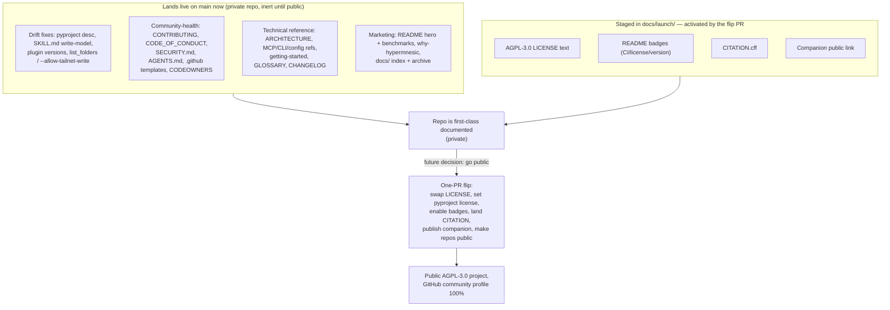
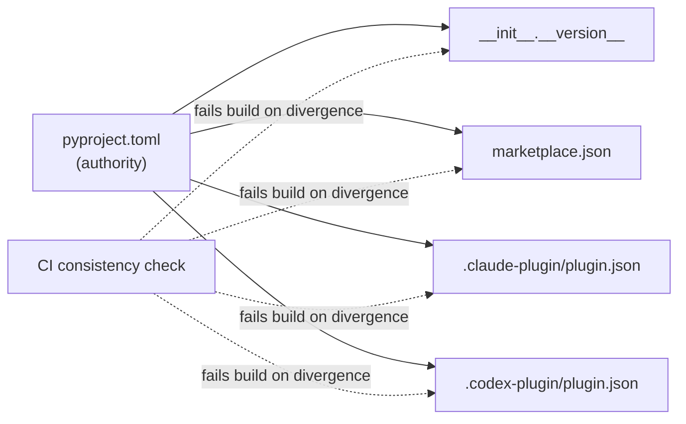

# docs: First-class documentation & public-launch readiness

## Summary

Make `hypermnesic` first-class documented and ready to flip to a public,
AGPL-3.0 open-source project in a single reviewable PR — without going public or
relicensing live. The work proceeds in four phases: correct the doc↔code drift
today's 7 PRs introduced (P0), stage the license + public-switch readiness (P0),
add the community-health and technical-reference documents (P1), and build the
marketing/positioning layer over a minimally-reorganized `docs/` tree (P2). Most
documents land live on `main` now (GitHub only surfaces them on the public flip);
only legally- or visually-public-gated artifacts (the LICENSE swap, README badges,
`CITATION.cff`, the companion's public link) are staged.

---

## Problem Frame

The repository is built faster than its documentation can keep up. The 2026-06-03
PR set (#16–#23) collapsed the serving topology from four lanes to two, retired
the `:8849` auth lane, added an opt-in `--allow-tailnet-write` boundary, shipped a
`list_folders` tool, flipped the write surface from a 4-prefix allowlist to a
blocklist, and bumped the engine to 0.0.5. The README was refreshed (#17) and is
mostly current, but the drift pooled in the untouched surfaces: `pyproject.toml`
still says "tailnet-only MCP server"; the bundled agent skill still teaches the
retired allowlist write model; three plugin manifests still report 0.0.4; and
`--allow-tailnet-write` / `list_folders` are documented nowhere user-facing.

Underneath the drift, the `docs/` tree holds 40+ files that are almost entirely
process exhaust — brainstorms, per-phase plans, gate artifacts, handoffs, dated
security reviews — with no index and none of the documents a serious project is
judged by (no `SECURITY.md`, `CONTRIBUTING.md`, `CODE_OF_CONDUCT.md`,
`CHANGELOG.md`, `ARCHITECTURE.md`, API/CLI/config reference, `.github` templates,
`AGENTS.md`). The single strongest credibility asset — a LongMemEval result of
88.6/89.7 with session recall@10 of 0.949, fully pinned and reproducible — is
buried in `harness/` and absent from the README. And the intended public identity
is not yet coherent: the engine is `Proprietary` while the companion already
shipped GPL-3.0 externally.

This plan closes those gaps so both repos can stay private now and the eventual
flip to public is a small, prepared, reviewable change. Origin requirements:
`docs/brainstorms/2026-06-03-first-class-documentation-requirements.md`.

---

## Key Technical Decisions

- **Land-live-now vs staged — the dividing line.** Community-health and
  reference docs (CONTRIBUTING, CODE_OF_CONDUCT, SECURITY, ARCHITECTURE,
  references, guides, CHANGELOG, templates, CODEOWNERS) commit to `main` now;
  they are inert while the repo is private and GitHub surfaces them automatically
  on the public flip. Only artifacts that are legally meaningful or that break
  while private are **staged** under `docs/launch/`: the AGPL-3.0 LICENSE swap,
  README badges (would 404 on a private repo), `CITATION.cff` (carries a license
  field), and the companion's public link. **Caveat — "inert on the GitHub UI" is
  not "safe to ship":** process docs already on `main` (the `docs/handoff-macbook-*.md`
  set, `docs/handoffs/`, `docs/oauth-as-finding.md`, the deploy runbooks) carry the
  operator's real IP / hostname / token and go public with the repo regardless of
  this dividing line. U8's scan and U21's archive/scrub own scrubbing those — the
  land-live default applies to *net-new* docs authored clean, not to inherited
  process exhaust. (see origin: Key Decisions — "Prepare-for-public-while-private")

- **License is AGPL-3.0 (engine) ↔ GPL-3.0 (companion), staged not flipped.** The
  live `LICENSE` stays proprietary; the AGPL-3.0 text and an exact one-PR flip
  runbook are staged. The flip itself (swap LICENSE, set the `pyproject` license
  field, enable badges, land `CITATION.cff`) is a future PR, not this plan.
  (see origin: Key Decisions — license confirmed AGPL-3.0)

- **The `license_scan.py` "copyleft-free" gate governs *dependencies*, not the
  project's own license.** `LICENSE` already states this; the reconciliation work
  is to mirror that clarification in the README so an AGPL project advertising a
  "zero-AGPL/GPL/SSPL" *dependency* gate does not read as a contradiction. No
  change to the gate's behavior. (see origin: R9)

- **Single-source the version to stop manifest drift.** The three plugin
  manifests drifted to 0.0.4 because the 0.0.5 bump only touched the Python
  package. Establish one authority (`pyproject.toml`) and a CI consistency check
  that fails when any distributed manifest diverges, rather than relying on manual
  multi-file bumps. (see origin: R2, R20)

- **`docs/` reorg is minimal-now.** Add the missing front-door index, consolidate
  security behind a root `SECURITY.md` that indexes the existing dated deltas
  in place, and archive the dead runbooks and stale brainstorms with pointers. A
  full taxonomy relocation of all 40+ files is deferred to follow-up to avoid
  large-churn moves in this plan. (see origin: R33, R34, R35, R36)

- **Documentation effort, not a behavior change.** No engine or product behavior
  changes. The only non-prose files touched are non-behavioral infra: plugin
  version manifests, the CI workflow (consistency + preflight checks), and
  `.env.example`. Each is required by a documentation requirement.

---

## High-Level Technical Design

The load-bearing concept is the **readiness model**: everything is authored now,
but the repository's *public identity* stays inert behind a single future flip.
The diagram shows what lands live on `main` immediately versus what waits in
`docs/launch/` for the flip PR.



The second concept is the **source-of-truth chain for the version** — one
authority, derived/checked everywhere else, so the 0.0.4↔0.0.5 split cannot recur:



---

## Output Structure

New and relocated documentation artifacts (repo-relative; per-unit `Files` lists
are authoritative):

```text
.
├── README.md                     # reworked hero + benchmarks (U18); license note (U7)
├── CHANGELOG.md                  # new (U4)
├── CONTRIBUTING.md               # new (U9)
├── AGENTS.md                     # new (U9)
├── CODE_OF_CONDUCT.md            # new (U10)
├── SECURITY.md                   # new — canonical policy + index (U11)
├── ARCHITECTURE.md               # new + diagram (U12)
├── GLOSSARY.md                   # new (U17)
├── LICENSE                       # unchanged (proprietary) — flip is future
├── .env.example                  # expanded (U15)
├── .github/
│   ├── CODEOWNERS                # new (U10)
│   ├── PULL_REQUEST_TEMPLATE.md  # new (U10)
│   ├── ISSUE_TEMPLATE/           # new bug + feature + config (U10)
│   └── workflows/ci.yml          # + version-consistency + preflight steps (U1, U8)
├── docs/
│   ├── README.md                 # new front-door index (U21)
│   ├── why-hypermnesic.md        # new positioning/comparison (U19)
│   ├── guides/getting-started.md # new (U16)
│   ├── reference/
│   │   ├── mcp-tools.md          # new (U13)
│   │   ├── cli.md                # new (U14)
│   │   └── configuration.md      # new (U15)
│   ├── launch/                   # STAGED — activated by the flip PR
│   │   ├── LICENSE-AGPL-3.0.txt   # (U5)
│   │   ├── public-flip-runbook.md # (U5)
│   │   ├── public-launch-checklist.md # (U8)
│   │   └── CITATION.cff           # (U20)
│   └── archive/                  # superseded docs + pointers (U21)
└── scripts/
    └── preflight_public_scan.py  # new secret/host scrub gate (U8)
```

---

## Requirements Traceability

| Origin R | Covered by | Origin R | Covered by |
|---|---|---|---|
| R1 self-description | U2 | R20 version single-source | U1 |
| R2 manifest versions | U1 | R21 ARCHITECTURE | U12 |
| R3 SKILL write-model | U2 | R22 MCP reference | U13 |
| R4 README write-path | U2 | R23 CLI reference | U14 |
| R5 list_folders catalog | U3 | R24 config reference | U15 |
| R6 --allow-tailnet-write | U3 | R25 getting-started | U16 |
| R7 decision record current | U4 | R26 glossary | U17 |
| R8 stage AGPL license | U5 | R27 README hero | U18 |
| R9 copyleft-free narrative | U6 | R28 surface benchmarks | U18 |
| R10 engine↔companion license | U7 | R29 positioning doc | U19 |
| R11 pre-public checklist/scrub | U8 | R30 visual assets | U12 (+ deferred companion shot) |
| R12 CONTRIBUTING | U9 | R31 badges (staged) | U18 |
| R13 CODE_OF_CONDUCT | U10 | R32 CITATION.cff (staged) | U20 |
| R14 SECURITY.md | U11 | R33 docs index | U21 |
| R15 issue/PR templates | U10 | R34 docs taxonomy (index + archive; full relocation deferred) | U21 |
| R16 CODEOWNERS | U10 | R35 security consolidation | U11 |
| R17 AGENTS.md | U9 | R36 archive superseded | U21 |
| R18 CHANGELOG | U4 | R37 companion pointer | U22 |
| R19 release policy | U4 + U9 | | |

---

## Implementation Units

Phased delivery: **Phase A** (P0 drift) → **Phase B** (P0 license/flip readiness)
→ **Phase C** (P1 community + reference) → **Phase D** (P2 marketing + IA). Within
a phase, units are largely independent and parallelizable unless a dependency is
noted.

### Phase A — Drift correction (P0)

### U1. Single-source the version + sync distributed manifests

- **Goal:** All distributed version strings agree with the engine, and a CI check
  prevents future divergence.
- **Requirements:** R2, R20.
- **Dependencies:** none.
- **Files:**
  - `plugin/.claude-plugin/marketplace.json` (0.0.4 → 0.0.5)
  - `plugin/plugins/hypermnesic/.claude-plugin/plugin.json` (0.0.4 → 0.0.5)
  - `plugin/plugins/hypermnesic/.codex-plugin/plugin.json` (0.0.4 → 0.0.5)
  - `.github/workflows/ci.yml` (add a version-consistency step)
  - `tests/test_version_consistency.py` (new)
- **Approach:** Treat `pyproject.toml` `version` as the authority and
  `src/hypermnesic/__init__.__version__` as the in-package mirror (already synced
  in #23). Sync the three plugin manifests to 0.0.5. Add a check that reads the
  authority and asserts every manifest + `__init__` matches; wire it as a CI step
  and a test. The deferred mechanism question (derive-at-build vs assert-in-CI) is
  resolved here in favor of assert-in-CI — lowest churn, no build-step coupling.
- **Patterns to follow:** the existing single CI job `lint-test-license` in
  `.github/workflows/ci.yml`; existing `tests/` layout and `pytest` conventions.
- **Test scenarios:**
  - Happy path: with all manifests at the authority version, the consistency test
    passes.
  - Failure path: a manifest pinned to a different version fails the test with a
    message naming the diverging file and both versions.
  - Edge: a manifest missing the `version` key fails clearly rather than raising
    an unhandled error.
- **Verification:** `uv run pytest tests/test_version_consistency.py` passes; the
  three manifests and `__init__` all read 0.0.5; the new CI step appears in the
  workflow.

### U2. Correct engine self-description + write-model docs (allowlist → blocklist)

- **Goal:** No user-facing doc describes a retired behavior (tailnet-only serving,
  the 4-prefix allowlist default).
- **Requirements:** R1, R3, R4.
- **Dependencies:** none.
- **Files:**
  - `pyproject.toml` (`[project].description` — drop "tailnet-only", reflect the
    unified public OAuth `/mcp` + tailnet read companion)
  - `src/hypermnesic/__init__.py` (the line-4 module docstring carries the same
    "tailnet-only, read-only MCP server" framing — doubly stale since the gated
    `commit_note` write tool ships; surfaced by `help()`, IDE hovers, PyPI)
  - `plugin/plugins/hypermnesic/skills/hypermnesic-memory/SKILL.md` (the
    "Writable allowlist" section → blocklist / write-anywhere-under-guards: bounded
    by the protected-path class + governance-file fence, named allowlist as opt-in
    narrowing)
  - `README.md` (reconcile the write-path line so it does not frame the allowlist
    as the default guard)
- **Approach:** Ground the corrected language in the actual code — the blocklist
  default lives in `_effective_write_surface` (`src/hypermnesic/mcp_server.py`) and
  the protected-path / governance fence in `src/hypermnesic/serialize.py`. Mirror
  the truth those modules implement; do not invent new policy.
- **Patterns to follow:** the README's own "How it works" blocklist description
  (already correct) as the canonical phrasing to align SKILL.md and pyproject to.
- **Test scenarios:** `Test expectation: none — documentation.` Verification is by
  review against `mcp_server.py` / `serialize.py`.
- **Verification:** a reader of SKILL.md, pyproject, and README gets one
  consistent write model (blocklist default, allowlist as opt-in); no surviving
  "tailnet-only" or "allowlisted by default" claim.

### U3. Document the shipped-but-undocumented surface in existing catalogs

- **Goal:** `list_folders` and `--allow-tailnet-write` are discoverable from the
  user-facing surfaces that enumerate tools/flags.
- **Requirements:** R5, R6.
- **Dependencies:** none (full references come in U13/U14; this is the acute-gap
  fix in existing catalogs).
- **Files:**
  - `plugin/plugins/hypermnesic/skills/hypermnesic-memory/SKILL.md` (add
    `list_folders` to the MCP tool list)
  - `plugin/README.md` (add `list_folders` to the tool enumeration)
  - `README.md` (document `--allow-tailnet-write` and its security semantics:
    tailnet membership as the write boundary, honored only for a CGNAT bind, all
    `commit_note` guards still apply)
- **Approach:** Source the tool set from `READ_TOOL_NAMES` / `WRITE_TOOL_NAMES`
  and the `--allow-tailnet-write` semantics from the `serve` path in
  `src/hypermnesic/cli.py` / `mcp_server.py`. Keep the security framing faithful to
  the #18 threat-model amendment (V15).
- **Patterns to follow:** existing tool-list formatting in `plugin/README.md` and
  `SKILL.md`.
- **Test scenarios:** `Test expectation: none — documentation.`
- **Verification:** every registered read tool (incl. `list_folders`) appears in
  both catalogs; `--allow-tailnet-write` is documented with its CGNAT-only,
  guards-still-apply caveats.

### U4. Establish CHANGELOG + bring the decision record current

- **Goal:** A durable release record exists, backfilled through 0.0.5; the running
  decision log is no longer silently stale.
- **Requirements:** R7, R18, R19.
- **Dependencies:** U9 (Phase C) authors the `## Releasing` section in
  `CONTRIBUTING.md` that R19 points at; U4 stubs the release policy in
  `CHANGELOG.md` so R19 has a Phase-A fallback and does not silently slip.
- **Files:**
  - `CHANGELOG.md` (new — Keep a Changelog; backfill 0.0.5 + the 2026-06-03 PRs)
  - `implementation-notes.md` (append the 2026-06-03 entries — unified endpoint,
    lane collapse, `:8849` retirement, allowlist→blocklist flip — or add a header
    pointer to CHANGELOG as the new system of record)
  - the release/versioning policy: a short `## Releasing` section in
    `CONTRIBUTING.md` (authored in U9) — note the dependency there
- **Approach:** Decide the durable record is `CHANGELOG.md`; keep
  `implementation-notes.md` as historical narrative but stop it asserting a stale
  "current" range by adding a closing pointer. Backfill the changelog from the
  merged-PR history (#1–#23).
- **Patterns to follow:** Keep a Changelog format; pre-1.0 `0.0.x` semantics.
- **Test scenarios:** `Test expectation: none — documentation.`
- **Verification:** `CHANGELOG.md` lists 0.0.5 with the topology/write-model
  changes; `implementation-notes.md` no longer claims a current range it doesn't
  cover.

### Phase B — License & public-switch readiness (P0, staged)

### U5. Stage the AGPL-3.0 license artifacts + flip runbook

- **Goal:** The license flip is a single reviewable PR whose every *non-mechanical*
  prerequisite has already been resolved upstream (the license-scan self-exclusion
  in U6, the git-history strategy below), so the flip itself is mechanical.
- **Requirements:** R8.
- **Dependencies:** U6 (the `license_scan.py` self-exclusion must land before the
  flip, or CI breaks — see U6).
- **Files:**
  - `docs/launch/LICENSE-AGPL-3.0.txt` (new — the full AGPL-3.0 text, staged)
  - `docs/launch/public-flip-runbook.md` (new — the exact ordered flip, step 0:
    **confirm the repo is still private**; then: replace `LICENSE` with the staged
    text, set `pyproject.toml` `license` to `AGPL-3.0-only`, confirm the U6
    self-exclusion is in place so the license gate stays green, swap the README
    license section, enable badges, land `CITATION.cff`, execute the resolved
    git-history strategy, then the visibility flip)
- **Approach:** Keep the live `LICENSE` proprietary. The runbook enumerates every
  file that changes at flip time so the flip diff is mechanical and reviewable, and
  names the two prerequisites that are NOT mechanical and must be resolved before
  the flip: (1) the `license_scan.py` self-exclusion (U6) — without it the flip
  breaks the CI license gate; (2) the **git-history strategy** — the real homelab
  IP `100.64.0.55` and hostname `homelab.<tailnet-host>.ts.net` persist in ~24–25
  historical commit diffs that a public push exposes, so the runbook must record an
  explicit, signed-off decision: `git-filter-repo` redaction (rewrites all SHAs —
  breaks existing clones/forks) vs. a documented accept-as-residual (the node is
  Tailscale-only and non-routable externally). See Open Questions.
- **Patterns to follow:** the existing deploy runbooks
  (`docs/unified-oauth-mcp-deploy-runbook.md`) for the ordered-steps + reverse-op
  shape; the signed-off decision convention in the dated security reviews.
- **Test scenarios:** `Test expectation: none — staged documentation.`
- **Verification:** the staged license text is the canonical AGPL-3.0; the runbook
  lists every flip-time file change AND both non-mechanical prerequisites (U6
  self-exclusion, git-history decision) with no unresolved authoring step.

### U6. Reconcile the "copyleft-free" narrative

- **Goal:** The README no longer reads as if the project itself must avoid
  copyleft, AND the license gate is fixed so it will not reject the engine's own
  AGPL license on the flip.
- **Requirements:** R9.
- **Dependencies:** none. (U5's flip depends on this unit.)
- **Files:**
  - `README.md` (License + Develop sections — mirror the clarification `LICENSE`
    already carries: the scan governs *third-party dependencies*, not the
    project's own intended copyleft license)
  - `scripts/license_scan.py` (**self-exclusion fix, required — not optional**:
    skip the project's own distribution before classifying, keyed on the
    `[project].name` from `pyproject.toml`, plus the docstring clarification that
    the scan is dependency-scoped)
  - `tests/test_license_scan.py` (new or extended — regression test that the scan
    passes when the project's own license is set to `AGPL-3.0-only`)
- **Approach:** Two parts. (1) Documentation: lift the existing `LICENSE` lines
  9–11 wording ("this notice governs hypermnesic's own source… third-party
  dependencies… verified copyleft-free") into the README so the dependency-gate and
  the AGPL plan are visibly non-contradictory. (2) **Behavior fix, load-bearing:**
  `uv sync` installs the root `hypermnesic` project into the env, and
  `license_scan.py` enumerates *all* distributions (`pip-licenses --with-system` /
  `importlib_metadata.distributions()`) with no self-exclusion —
  `classify("AGPL-3.0-only")` returns `AGPL` (a DENY). So the moment the flip sets
  the `pyproject` license to AGPL, the CI license gate FAILS. The scan must exclude
  the project's own distribution (by `[project].name`) before classifying. This is
  why the U5 "one-PR flip" only works if this lands first — the earlier "no
  behavior change to the gate" framing was wrong.
- **Patterns to follow:** the existing `LICENSE` dependency-scope clarification;
  the existing `scripts/license_scan.py` structure for the exclusion + the test.
- **Test scenarios:**
  - Regression: with the project's `pyproject` license set to `AGPL-3.0-only`, the
    scan still exits clean (the project's own dist is excluded; deps unaffected).
  - Guard: a real AGPL/GPL/SSPL *dependency* is still detected (the self-exclusion
    keys on the project name only — it does not weaken the dependency gate).
  - Edge: the exclusion keys on a stable identifier (project name from pyproject),
    not a hardcoded string that drifts.
- **Verification:** README states the scan is dependency-scoped; the scan passes
  with the engine licensed AGPL-3.0; a planted AGPL dependency is still rejected.

### U7. Document the engine ↔ companion license boundary

- **Goal:** A public reader understands the AGPL engine ↔ GPL-3.0 companion
  relationship and that neither is a derivative of the other.
- **Requirements:** R10.
- **Dependencies:** U5 (references the staged license direction).
- **Files:**
  - `README.md` (License section — one paragraph on the arm's-length MCP-wire
    boundary)
  - `obsidian-plugin/README.md` (cross-link the boundary statement)
- **Approach:** State the boundary as **conditional**, not as a bare conclusion:
  the arm's-length claim holds *because* the two are separate processes coupled only
  over the MCP network protocol with no shared or statically-linked code — and name
  the invariant that keeps it true ("the companion MUST NOT vendor, import, or
  statically link engine source"). Reuse the companion README's existing "arm's
  length" language, but add the keep-it-true condition rather than asserting the
  legal conclusion alone. Because this is legally meaningful, flag a brief legal
  sanity-check of the AGPL §13 ↔ GPL-3.0 boundary as a pre-flip item (Open
  Questions).
- **Patterns to follow:** `obsidian-plugin/README.md`'s existing arm's-length
  phrasing; the read-only-invariant scope as the home for the no-linking condition.
- **Test scenarios:** `Test expectation: none — documentation.`
- **Verification:** README and the companion pointer agree on the boundary, state
  the no-vendoring/no-linking invariant, and the legal-review item is recorded.

### U8. Pre-public readiness checklist + secret/host scrub gate

- **Goal:** No to-be-public file *or git-history commit* leaks a private host,
  tailnet IP, token, or consent secret, and the flip has a checklist. The working
  tree, the shipped `src/` and `tests/`, AND git history are all in scope.
- **Requirements:** R11.
- **Dependencies:** none (the scan is standalone; the remediation it forces feeds
  U5's git-history decision and U21's archive scope).
- **Files:**
  - `scripts/preflight_public_scan.py` (new — grep tailnet IP ranges, operator
    hostnames, tokens, consent-secret patterns across **both** the to-be-public
    working-tree file set **and** `git log -p --all`)
  - `src/hypermnesic/cli.py` + the test fixtures (remediation: neutralize the live
    operator hostname — `cli.py:580` help example uses
    `homelab.<tailnet-host>.ts.net`, and ~7 test files hardcode it; replace with a
    documentation placeholder, mirroring the CGNAT-range fix in #21 and the
    existing `tests/test_plugin.py` assertion that the hostname must NOT leak)
  - `docs/launch/public-launch-checklist.md` (new — the human checklist:
    community-profile completeness, working-tree scrub, **git-history decision**,
    src/tests fixture scrub, companion publish, license flip)
  - `.github/workflows/ci.yml` (preflight step wired to fail the build on a hit)
  - `tests/test_preflight_public_scan.py` (new)
- **Approach:** Three realities the original framing missed, all code-verified:
  (1) **Git history**, not just the working tree — `100.64.0.55` appears in ~25
  commits and `homelab.<tailnet-host>.ts.net` in ~24; the #6/#21 scrubs only cleaned the
  tree, so a public push still exposes them via `git log -p`. The scan must cover
  history, and U5's runbook records the rewrite-vs-accept decision. (2) **`src/`
  and `tests/` are in the to-be-public set** — the operator hostname is live in
  `cli.py:580` help text and ~7 test files, so "scan reports clean on the current
  tree" is false today; remediation (placeholder substitution) is real work, not a
  CI toggle. (3) The deny-set EXCLUDES `docs/launch/` and `docs/archive/` only —
  it must still scan everything else, including the handoff/runbook docs (see U21,
  which now scrubs/excludes them). Allowlist the legitimate CGNAT documentation
  range so examples don't false-positive.
- **Patterns to follow:** `scripts/license_scan.py` as the standalone-gate +
  CI-wiring model; the #21 CGNAT doc-range fix and the `tests/test_plugin.py`
  no-leak assertion as the repo's own precedent for this exact concern.
- **Test scenarios:**
  - Happy path: the scan exits clean **after** the src/tests remediation lands
    (NOT on the current unremediated tree).
  - Failure path: a planted tailnet IP / operator hostname / token in a scanned
    working-tree file is detected and reported with file + match.
  - History: the scan flags a known-bad pattern present only in a historical commit
    diff (proves history coverage), or the runbook records the accept-as-residual
    decision and the scan is scoped accordingly.
  - Edge: a to-be-public *test* file containing the operator hostname is caught
    (the exclusion list must not silently exempt `tests/`).
  - Edge: the legitimate CGNAT documentation range is allowlisted and does not
    false-positive; `docs/launch/` and `docs/archive/` are excluded.
- **Verification:** after remediation, `uv run python scripts/preflight_public_scan.py`
  exits clean over the working tree; the history strategy is recorded and executed
  or consciously accepted in the runbook; planted-secret tests fail the scan; the
  checklist enumerates every flip prerequisite including the history decision.

### Phase C — Community-health + technical reference (P1)

### U9. CONTRIBUTING.md + AGENTS.md (contributor + agent contract)

- **Goal:** A new contributor (human or agent) can go from clone to passing local
  gates from the docs alone.
- **Requirements:** R12, R17. Also carries the R19 release policy (`## Releasing`).
- **Dependencies:** none.
- **Files:**
  - `CONTRIBUTING.md` (new — dev setup `uv sync --extra dev`; the three CI gates
    `ruff check .` / `pytest` / `scripts/license_scan.py`; branch strategy;
    commit/PR conventions; running a local endpoint to test against; a
    `## Releasing` section for versioning/tagging per U4)
  - `AGENTS.md` (new — build/test/gate/branch/worktree contract for agent
    contributors; the plan/gate-artifact workflow this repo uses)
- **Approach:** Promote the README's 4-line "Develop" block into a real contract,
  sourced verbatim from `.github/workflows/ci.yml` so documented gates match CI
  exactly. `AGENTS.md` documents the actual agent-driven workflow (worktrees,
  `docs/plans/`, gate artifacts).
- **Patterns to follow:** `.github/workflows/ci.yml` step names; the existing
  `docs/plans/` + `docs/gate-artifacts/` conventions for the AGENTS.md workflow
  description.
- **Test scenarios:** `Test expectation: none — documentation.` Verification:
  the documented gate commands are exactly those in `ci.yml`.
- **Verification:** following `CONTRIBUTING.md` reproduces the CI gates locally;
  `AGENTS.md` names the build/test/gate/branch contract.

### U10. GitHub community files: CODE_OF_CONDUCT + issue/PR templates + CODEOWNERS

- **Goal:** GitHub's community-profile checklist is satisfied on the public flip.
- **Requirements:** R13, R15, R16.
- **Dependencies:** none.
- **Files:**
  - `CODE_OF_CONDUCT.md` (new — Contributor Covenant + enforcement contact)
  - `.github/ISSUE_TEMPLATE/bug_report.md` (new — capturing engine host, client,
    vault size, Tailscale/Funnel state)
  - `.github/ISSUE_TEMPLATE/feature_request.md` (new)
  - `.github/ISSUE_TEMPLATE/config.yml` (new — optional contact links)
  - `.github/PULL_REQUEST_TEMPLATE.md` (new — checklist tying PRs to the CI gates
    and flagging security-surface changes; add a DCO sign-off line if the CLA/DCO
    Open Question resolves that way)
  - `.github/CODEOWNERS` (new — route `src/hypermnesic/auth*`, `mcp_server.py`,
    and the security docs to the owner)
- **Approach:** Standard boilerplate adapted to the project's specifics (the bug
  template's environment fields; the PR template's gate checklist mirroring U9).
- **Patterns to follow:** the U9 CI-gate list for the PR-template checklist.
- **Test scenarios:** `Test expectation: none — documentation.`
- **Verification:** all six files exist and render; the bug template captures the
  deployment-shape fields; CODEOWNERS covers the security-sensitive paths.

### U11. SECURITY.md (root) + security-doc consolidation

- **Goal:** One canonical front door for security: a vuln-reporting policy that
  also indexes the threat model and the dated review deltas.
- **Requirements:** R14, R35.
- **Dependencies:** none.
- **Files:**
  - `SECURITY.md` (new root — a **concrete** private reporting channel: either a
    named security contact in the text, or GitHub private vulnerability reporting
    whose enablement is added as a step to the flip runbook (U5) since it is off by
    default for repos that were private; plus supported versions, disclosure
    expectations, and an index linking the threat model + dated deltas)
  - `docs/threat-model-commit-note.md` (promote to the living threat model the
    root `SECURITY.md` points at; add a "Security deltas (chronological)" index
    section)
- **Approach:** Minimal-now per the docs-reorg decision — create the root policy
  and an index section in the existing threat model; the dated reviews
  (`docs/2026-06-03-unified-write-anywhere-security-review.md`,
  `docs/2026-06-03-blocklist-write-surface-security-review.md`,
  `docs/oauth-as-finding.md`) stay in place as immutable deltas, linked, not moved.
  Their existing `amends:` / `status:` frontmatter provides the chain. For the
  threat-model's stale "tailnet-only MCP server" scope line, do **not** rewrite the
  signed-off original — add a *dated topology-correction amendment* (consistent with
  the doc's existing inline Phase-2 / Phase-B amendments), and let the new
  `SECURITY.md` index state the current two-lane / unified-`/mcp` topology. This
  preserves the signed-off audit chain the Risks section calls out.
- **Patterns to follow:** the `amends:` / `signed_off:` frontmatter already on the
  dated reviews; GitHub's `SECURITY.md` reporting-policy conventions.
- **Test scenarios:** `Test expectation: none — documentation.`
- **Verification:** the reporting channel is *functional* (a contact is named, or
  the runbook enables GitHub private reporting) — not merely that `SECURITY.md`
  exists; the threat model carries a chronological delta index and a dated topology
  amendment (original signed-off text intact).

### U12. ARCHITECTURE.md + architecture diagram

- **Goal:** A reader builds an accurate mental model without reading source; the
  repo ships at least one visual.
- **Requirements:** R21, R30 (minimum visual).
- **Dependencies:** none.
- **Files:**
  - `ARCHITECTURE.md` (new — index/retrieval/read-time convergence/MCP
    server/git-first write path/two serving lanes; the "files are truth, index is
    a disposable projection" invariant)
  - the diagram (inline mermaid in `ARCHITECTURE.md`, and/or
    `docs/assets/architecture.svg`)
- **Approach:** Synthesize from the README "How it works" plus the module map in
  `src/hypermnesic/`; show the source-of-truth fan-out (git tree → disposable
  index) and the two-lane serving topology. This diagram doubles as the R30 visual
  minimum.
- **Patterns to follow:** the README "How it works" section as the prose spine;
  the module boundaries in `src/hypermnesic/`.
- **Test scenarios:** `Test expectation: none — documentation.`
- **Verification:** the doc covers every major subsystem and the disposable-index
  invariant; the diagram renders.

### U13. MCP tool / API reference

- **Goal:** The client contract is documented: every read tool + the gated write
  tool, with shapes, scopes, and read-only annotations.
- **Requirements:** R22.
- **Dependencies:** none.
- **Files:** `docs/reference/mcp-tools.md` (new)
- **Approach:** Enumerate `search`, `build_context`, `think`, `resolve`,
  `list_folders` (read) and `commit_note` (gated write) sourced from the
  `@mcp.tool` registrations and `READ_TOOL_NAMES`/`WRITE_TOOL_NAMES` in
  `src/hypermnesic/mcp_server.py`; document input/output fields, scopes, and
  `readOnlyHint`.
- **Patterns to follow:** the tool decorators + typed output models in
  `mcp_server.py`.
- **Test scenarios:** `Test expectation: none — documentation.` Verification: the
  documented tool set equals the registered set.
- **Verification:** every registered tool is documented with scope + shape; no
  tool is missing or invented.

### U14. CLI reference

- **Goal:** The documented CLI surface matches the registered surface.
- **Requirements:** R23.
- **Dependencies:** none.
- **Files:** `docs/reference/cli.md` (new)
- **Approach:** Enumerate *every* subcommand returned by `build_parser()` in
  `src/hypermnesic/cli.py` (currently 15: `index`, `embed`, `commit-note`,
  `reindex`, `init`, `think`, `retrieve`, `resolve`, `list-folders`, `capture`,
  `converge`, `install-hooks`, `serve`, `install`, `serve-cloud`, `setup`) — not a
  hardcoded subset — with flags and one-line purpose each. Note `list-folders` is
  a CLI subcommand too (pairs with R5/U3), and the currently-undocumented ones are
  `embed`, `reindex`, `capture`, `converge`, `install-hooks`, `install`,
  `serve-cloud`.
- **Patterns to follow:** `cli.py` `add_parser` definitions as the source of truth.
- **Test scenarios:** `Test expectation: none — documentation.` Verification: the
  documented subcommand list equals `build_parser()`'s.
- **Verification:** every registered subcommand + its flags are documented.

### U15. Configuration reference + expand .env.example

- **Goal:** Every user-facing knob is documented in one place.
- **Requirements:** R24.
- **Dependencies:** none.
- **Files:**
  - `docs/reference/configuration.md` (new)
  - `.env.example` (add `HYPERMNESIC_MCP_URL`, `HYPERMNESIC_MCP_TOKEN`, the cloud
    consent token, with comments)
- **Approach:** Document `OPENAI_API_KEY`, the `HYPERMNESIC_*` / consent-secret
  env vars, and the `src/hypermnesic/config.py` tunables (convergence
  budget/debounce/delta, `LIST_FOLDERS_MAX_*`, embed model/dim) with defaults and
  effect.
- **Patterns to follow:** `src/hypermnesic/config.py` constants + comments as the
  source of truth; the existing `.env.example` comment style.
- **Test scenarios:** `Test expectation: none — documentation.` Verification:
  documented tunables match `config.py` names/defaults.
- **Verification:** `.env.example` and the reference cover the full env + tunable
  surface with correct defaults.

### U16. Getting-started / installation guide

- **Goal:** The three usage paths and their failure modes are documented beyond
  the README quick start.
- **Requirements:** R25.
- **Dependencies:** none.
- **Files:** `docs/guides/getting-started.md` (new)
- **Approach:** Expand the README's three paths (self-host the endpoint, connect a
  client, use locally) with prerequisites (Tailscale Funnel), the discovery-chain
  verification, and offline/lexical-only operation. Link from the README.
- **Patterns to follow:** the README "Quick start" structure as the spine.
- **Test scenarios:** `Test expectation: none — documentation.`
- **Verification:** each path has prerequisites + a failure-mode note; the
  discovery-chain verification is documented.

### U17. GLOSSARY.md

- **Goal:** A newcomer can resolve the project's jargon.
- **Requirements:** R26.
- **Dependencies:** none.
- **Files:** `GLOSSARY.md` (new; linked from README + docs index)
- **Approach:** Define convergence, salience, sidecar, MOC, thinking-mode, RRF,
  DCR/PKCE, RFC 8707 audience-binding, "diff-or-die frontmatter gate", consent
  secret, tailnet read lane — one or two sentences each, grounded in how the code
  uses the term.
- **Patterns to follow:** terms as used in README + `src/hypermnesic/`.
- **Test scenarios:** `Test expectation: none — documentation.`
- **Verification:** every flagged term is defined accurately.

### Phase D — Marketing + docs information architecture (P2)

### U18. README hero/positioning rework + surface benchmarks + stage badges

- **Goal:** The README's first screen answers what/who/why/vs-what and surfaces the
  benchmark; badges are staged.
- **Requirements:** R27, R28, R31.
- **Dependencies:** U5 (badge enablement is a flip step). Soft: U19 — link it when
  available, otherwise stub the `docs/why-hypermnesic.md` path. U21 is **not** a
  dependency: the Benchmarks section links `harness/BENCHMARKS.md` directly, not the
  docs index, so U18 can land independently.
- **Files:** `README.md`
- **Approach:** Add a one-line differentiator + target user above the architecture
  detail; add a short "Benchmarks" section with the LongMemEval headline (88.6 /
  89.7; session recall@10 = 0.949) and the honest GPT-4o-judge framing, linking
  `harness/BENCHMARKS.md`; add badge markup in a staged/commented form (or in the
  flip runbook) gated on public + license flip so it does not 404 while private.
- **Patterns to follow:** `harness/BENCHMARKS.md` for the exact numbers + caveats;
  do not overstate (anchor to the matched-judge comparison).
- **Test scenarios:** `Test expectation: none — documentation.`
- **Verification:** the first screen states who/why/vs-what; the benchmark headline
  + link are present; badges are staged, not live-broken.

### U19. Positioning / "why hypermnesic" comparison doc

- **Goal:** The differentiator is argued explicitly against adjacent tools.
- **Requirements:** R29.
- **Dependencies:** none.
- **Files:** `docs/why-hypermnesic.md` (new; linked from README)
- **Approach:** Compare against mem0, Letta/MemGPT, basic-memory, and plain
  Obsidian on the wedge: files-are-truth with a disposable index, git-first writes,
  one OAuth MCP endpoint any client shares, no vendor memory DB. Keep claims
  defensible and sourced.
- **Patterns to follow:** the README's architecture invariants as the basis for
  the differentiators.
- **Test scenarios:** `Test expectation: none — documentation.`
- **Verification:** each competitor is addressed on the named wedge with accurate,
  non-inflated claims.

### U20. Stage CITATION.cff

- **Goal:** The benchmark result is citable on the flip.
- **Requirements:** R32.
- **Dependencies:** U5 (lands with the license flip).
- **Files:** `docs/launch/CITATION.cff` (new, staged)
- **Approach:** Author the CFF with author, title, the headline benchmark numbers,
  and the LongMemEval / Zep paper anchors; carry the AGPL license field so it is
  consistent at flip time. Staged because the license field presumes the public
  license.
- **Patterns to follow:** the Citation File Format spec; `harness/BENCHMARKS.md`
  for the citable result + paper references.
- **Test scenarios:** optional CFF schema validation if a validator is available;
  otherwise `Test expectation: none — staged documentation.`
- **Verification:** the staged CFF is schema-valid and surfaces the headline
  numbers + paper anchors.

### U21. docs/ index + minimal IA + archive superseded

- **Goal:** A reader entering `docs/` is routed to current truth in one hop;
  superseded docs carry pointers.
- **Requirements:** R33, R34 (minimal), R36.
- **Dependencies:** U11 (security index), U12–U17 (reference docs to link).
- **Files:**
  - `docs/README.md` (new — front-door index: durable-reference vs process-history
    map, with current-truth pointers: write model = blocklist, topology = two
    lanes / unified `/mcp`)
  - `docs/archive/` (move with pointer banners: `docs/cloud-oauth-mcp-deploy-runbook.md`
    — already marked superseded; `docs/gate-artifacts/2026-06-02-gate-A-rollout-runbook.md`;
    the two oldest brainstorms describing the retired `captures/`-quarantine /
    4-prefix allowlist model — **verify subject before archiving**:
    `…-deployment-topology-write-model-requirements.md` is in; confirm
    `docs/brainstorms/2026-06-02-cloud-oauth-mcp-mobile-requirements.md` is
    primarily about that retired model, not mobile UX, before moving it)
  - the operator-leaking process docs (`docs/handoff-macbook-*.md`,
    `docs/handoffs/`, `docs/oauth-as-finding.md`, the deploy runbooks) — these
    carry the real IP / hostname / token and are NOT made safe by the minimal
    reorg; coordinate with U8 to scrub or prune-at-flip (do not leave them live and
    unscrubbed)
- **Approach:** Minimal-now: add the index and archive the dead/stale docs; do NOT
  relocate the 40-file tree. The index lists durable refs (README, ARCHITECTURE,
  SECURITY, references, guides, solutions) separately from history (brainstorms,
  plans, gate-artifacts, handoffs, archive). Crucially, "minimal reorg" does not
  mean "the other ~35 docs are safe" — the operator-leaking process docs above are
  caught by U8's scan and must be scrubbed or pruned before the flip, even though a
  full taxonomy relocation is deferred.
- **Patterns to follow:** the existing superseded banner on
  `docs/cloud-oauth-mcp-deploy-runbook.md`.
- **Test scenarios:** `Test expectation: none — documentation.` Verification: a
  link-check passes; each archived doc has a pointer to its replacement.
- **Verification:** `docs/README.md` maps durable vs history and pins current
  truth; the four superseded docs are archived with pointers.

### U22. Companion pointer reconciliation

- **Goal:** The companion pointer reflects reality (external repo private until
  release) and the README notes the separate install/license.
- **Requirements:** R37.
- **Dependencies:** U7 (license boundary).
- **Files:**
  - `obsidian-plugin/README.md` (annotate: the link flips public on the companion's
    first community-directory release; until then it is private)
  - `README.md` (note the companion is a separate, separately-licensed install)
- **Approach:** Keep the pointer shape (correct end state) but correct an **explicit
  false claim**, not just an implication: `obsidian-plugin/README.md` currently
  asserts the companion "now lives in its own public repository", while the repo is
  actually private (per the U9/U10 publishing handoff). Change that to state the
  repo is private until the companion's first community-directory release. Keep the
  URL as the documented end-state target; cross-reference the U7 license boundary.
- **Patterns to follow:** the existing `obsidian-plugin/README.md` pointer.
- **Test scenarios:** `Test expectation: none — documentation.`
- **Verification:** the pointer no longer asserts a live/public repo; it states
  private-until-release; the README acknowledges the separate repo + license.

---

## Scope Boundaries

**In scope:** all 37 origin requirements, authored now — with R30 (visual) and
R34 (docs taxonomy) deliberately partial: R30 ships the architecture diagram now
and defers the companion screenshot; R34 ships the index + archive now and defers
the full taxonomy relocation (both noted in Deferred to Follow-Up). Non-behavioral
infra is touched only where a doc requirement requires it (version manifests, CI
checks, `.env.example`); the license-scan self-exclusion (U6) is a required flip
prerequisite, not optional.

**Outside this plan's identity (not a docs problem):**

- Any engine or product behavior change — the audit is read-only. (see origin:
  Scope Boundaries)
- The live homelab cutover and deployment operations.
- The in-flight gbrain-decommission migration.
- The internals of the companion's external repository.

### Deferred to Follow-Up Work

- **The actual public flip** — executing the license relicense, enabling badges,
  publishing `CITATION.cff`, and making the repos public (a future one-PR change
  driven by `docs/launch/public-flip-runbook.md`).
- **Making the companion repo public** / cutting its first release.
- **Full `docs/` taxonomy relocation** — moving all 40+ files into
  `reference/ security/ history/ archive/`. This plan does the index + archive +
  security front door only; the bulk relocation is deferred to avoid large-churn
  moves. (see origin: R34)
- **Companion screenshot/GIF** — depends on the private companion repo; the
  architecture diagram (U12) satisfies the R30 visual minimum until then.
- **A rendered documentation website / static docs site.**
- **A CI docs-drift guard** (assert documented tool/CLI surface == registered
  surface) — attractive but optional; recorded in Open Questions.

---

## Risks & Dependencies

- **README is edited by several units (U2, U3, U6, U7, U18, U22).** Sequence or
  merge carefully to avoid churn conflicts — treat the README as a shared file and
  land its edits in a coherent order (drift fixes → license note → hero rework).
- **Benchmark claims must stay honest.** U18/U19/U20 surface LongMemEval numbers;
  source them verbatim from `harness/BENCHMARKS.md` with the matched-judge caveat
  to avoid overstating against the GPT-4.1-judged leaderboard.
- **Staged-vs-live discipline.** U5/U8/U20 must keep public-gated artifacts under
  `docs/launch/` so nothing activates the public identity prematurely; the
  preflight scan (U8) is the backstop.
- **The CI version-consistency check (U1) gates future plugin bumps** — ensure the
  message is actionable so a contributor knows exactly which file to sync.
- **Security-doc consolidation (U11) must not lose the signed-off chain** — link
  the dated deltas rather than rewriting them; their `signed_off:` frontmatter is
  the audit trail.

---

## Open Questions (deferred to implementation)

- **Version single-source mechanism final form (U1):** assert-in-CI is the chosen
  default; if the team later prefers derive-at-build (generate manifests from
  `pyproject.toml`), that is a drop-in replacement — decide if the CI assertion is
  enough.
- **`implementation-notes.md` fate (U4):** keep as historical narrative with a
  closing pointer, or fully retire in favor of `CHANGELOG.md` + per-decision
  records under `docs/solutions/`. Resolve when authoring U4.
- **CI docs-drift guard:** whether to add a test asserting the documented MCP/CLI
  surface equals the registered surface (would keep U2/U3/U13/U14 from
  re-drifting). Cheap to add; decide during U13/U14.
- **Badge hosting while private (U18):** confirm whether badges live commented in
  the README or only in the flip runbook — depends on whether shields.io endpoints
  resolve for a private repo's CI.
- **Git-history strategy (U5/U8) — decide before the flip, not at it:** the real
  homelab IP `100.64.0.55` (~25 commits) and hostname `homelab.<tailnet-host>.ts.net`
  (~24 commits) persist in historical commit diffs. Choose `git-filter-repo`
  redaction (rewrites all SHAs — breaks existing clones/forks) vs. a documented
  accept-as-residual (the node is Tailscale-only, non-routable externally). This is
  a genuine judgment call; record the signed-off decision in the flip runbook.
- **Contributor IP — CLA/DCO before the first external PR (U9/U10):** once public
  and AGPL, inbound contributions default to inbound=outbound AGPL, which forecloses
  any future relicensing without tracking down every contributor. Decide now: add a
  DCO sign-off (cheapest, in the PR template) / a lightweight CLA, or consciously
  accept the foreclosure and record it. Authoring `CONTRIBUTING.md` is the moment to
  set this.
- **AGPL §13 ↔ GPL-3.0 companion legal sanity-check (U7):** the arm's-length
  "neither is a derivative" claim is legally meaningful and currently a self-authored
  README assertion resting on the no-vendoring/no-linking invariant. Decide whether a
  brief legal review is in scope before the public flip.

---

## Sources & Research

- **Origin requirements:**
  `docs/brainstorms/2026-06-03-first-class-documentation-requirements.md` (all 37
  R-IDs, key decisions, acceptance examples, scope boundaries).
- **Today's PRs driving the drift:** #16 (unified OAuth `/mcp`, 4→2 lanes, `:8849`
  retired), #17 (setup funnel + README refresh, 0.0.3→0.0.4), #18
  (`--allow-tailnet-write`), #19 (`list_folders`), #21 (allowlist→blocklist flip),
  #22/#23 (0.0.4→0.0.5).
- **CI contract:** `.github/workflows/ci.yml` — one job `lint-test-license`:
  `uv sync --extra dev` → `ruff check .` → `pytest` →
  `scripts/license_scan.py` (zero-AGPL/GPL/SSPL dependency gate).
- **License state:** `LICENSE` (proprietary; already clarifies the scan is
  dependency-scoped — R9 is half-done); companion GPL-3.0 external; AGPL-3.0
  plan-of-record at
  `docs/plans/2026-06-02-010-feat-companion-directory-publishing-plan.md` (R7) +
  the U9 handoff.
- **Code sources of truth for reference docs:** `src/hypermnesic/cli.py`
  (`build_parser`, 15 subcommands), `src/hypermnesic/mcp_server.py`
  (`READ_TOOL_NAMES` = search/build_context/think/resolve/list_folders,
  `WRITE_TOOL_NAMES` = commit_note, `_effective_write_surface` blocklist default),
  `src/hypermnesic/serialize.py` (protected-path + governance fence),
  `src/hypermnesic/config.py` (convergence + list-folders tunables).
- **Benchmark credibility:** `harness/BENCHMARKS.md` (LongMemEval V1 `_s`, 500-Q:
  88.6 / 89.7 GPT-4.1 reader, 83.2 / 86.6 GPT-4o anchor, session recall@10 = 0.949,
  pinned dataset SHA-256, $31.30 Batch API), `harness/PARITY_VERDICT.md`
  (internal gbrain parity — keep internal).
- **House doc conventions:** dated security reviews carry `amends:` / `status:` /
  `signed_off:` frontmatter (chain for U11); `docs/solutions/design-patterns/`
  frontmatter style for decision records; existing deploy runbooks for the
  ordered-steps + reverse-op shape (U5/U8).
