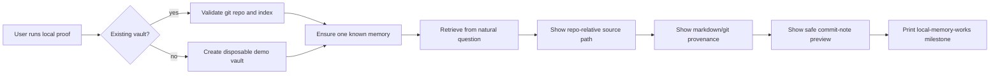

# feat: Local First Value Proof

## Summary

Build the first sprint unit as a local-only proof path that lets a new user create or point at a
small git-backed markdown vault, index or capture one memory, retrieve it with a natural question,
inspect the source file, and see a dry-run write preview before any Tailscale, OAuth, MCP, or
plugin setup enters the path.

---

## Problem Frame

The current quick start leads with endpoint setup. The origin document makes the first product
milestone "local memory works" so users experience the files-as-truth value before they debug
network reach or authorization (see origin: docs/brainstorms/2026-06-04-first-class-product-requirements.md).

---

## Assumptions

*This plan was authored without synchronous user confirmation. The items below are planning-time
inferences that should be reviewed before implementation proceeds.*

- The local proof should be CLI-first, not a new web UI, because the repo already has a mature
  engine-host-local CLI and no existing web app shell.
- The demo vault should live in a temporary or user-selected directory and never point at private
  operator paths in docs, tests, fixtures, or output.
- Dense retrieval should be optional in the proof path; lexical retrieval must be enough for the
  default fixture so the path works offline and in CI.

---

## Requirements

- R1. Provide a local-first path that proves memory value without Tailscale, public HTTPS, OAuth,
  MCP client setup, or remote plugin installation.
- R2. Support both an existing markdown/git vault and a tiny demo vault.
- R3. Create or identify one durable memory, retrieve it from a natural question, and show the
  repo-relative source path.
- R4. Make markdown files and the disposable index model visible.
- R5. Include a safe write demonstration that distinguishes dry-run preview from durable change.
- R6. Explain dense degradation in product language.
- R7. End with a clear "local memory works" milestone and next step to connect remote clients.
- R8. Reorganize README/getting-started so local proof comes before endpoint setup.

**Origin actors:** A1 new self-hosting user, A2 daily operator.
**Origin flows:** F1 local proof before endpoint setup.
**Origin acceptance examples:** AE1 local-first value proof.

---

## Scope Boundaries

### Deferred for later

- Hosted/cloud Hypermnesic.
- A full graphical web app.
- Automatic LLM consolidation of all raw memories.

### Outside this product's identity

- Becoming a hosted memory API.
- Hiding memory provenance behind opaque summaries.

### Deferred to Follow-Up Work

- Remote-client setup and diagnostics are handled by `docs/plans/2026-06-04-002-feat-setup-doctor-status-plan.md`.
- Product proof automation across local and remote flows is handled by `docs/plans/2026-06-04-008-feat-product-proof-launch-readiness-plan.md`.

---

## Context & Research

### Relevant Code and Patterns

- `src/hypermnesic/cli.py` already exposes `init`, `retrieve`, `capture`, `commit-note`,
  `converge`, and JSON output.
- `tests/test_cli.py`, `tests/test_capture.py`, `tests/test_retrieve.py`, and
  `tests/test_portability_probe.py` provide offline CLI and fixture-vault patterns.
- `src/hypermnesic/index.py` keeps `.hypermnesic/` as disposable state under the repo by default.
- `src/hypermnesic/commit_note.py` supports dry-run preview through the CLI wrapper.

### Product Design Lens

- First run should deliver an immediate memory "aha": create/find memory, ask a question, see the
  file path, understand that git owns provenance.
- Output should read as milestone progress and result proof, not as a dump of low-level commands.

### External References

- OpenAI memory controls emphasize user control over review/delete/disable memory:
  https://help.openai.com/en/articles/8590148-memory-in-chatgpt-remembering-what-you-chat-about
- Zep and Mem0 quickstarts lead with add/get/search operations before advanced setup:
  https://help.getzep.com/v2/memory and https://docs.mem0.ai/core-concepts/memory-operations

---

## Key Technical Decisions

- Add a dedicated local proof command rather than overloading `setup`: setup remains remote
  provisioning, while local proof is value education.
- Reuse existing primitives instead of building a parallel runner: initialize/index, capture or
  fixture creation, retrieve, commit-note dry-run, and convergence should stay the proof backbone.
- Keep default proof data deterministic and lexical-matchable so tests do not require external
  embedding calls.
- Make JSON output a first-class contract for agents, while human output stays milestone-oriented.

---

## Open Questions

### Resolved During Planning

- Should the first proof write commit by default? No. The first write demonstration should be a
  dry-run preview by default, with any durable write requiring an explicit flag or separate command.
- Should local proof require a real existing vault? No. The requirements explicitly call for both
  existing-vault and demo-vault paths.

### Deferred to Implementation

- Exact command name and flag spelling: choose the smallest CLI shape that fits existing parser
  conventions after writing tests.
- Whether demo-vault creation should include one commit or two: decide during implementation based
  on the simplest provenance story and test readability.

---

## High-Level Technical Design

> *This illustrates the intended approach and is directional guidance for review, not
> implementation specification. The implementing agent should treat it as context, not code to
> reproduce.*

---

## Implementation Units

### U1. Local Proof Contract and Parser

**Goal:** Define the public CLI contract for the local proof path and make it discoverable.

**Requirements:** R1, R2, R6, R7, R8.

**Dependencies:** None.

**Files:**
- Modify: `src/hypermnesic/cli.py`
- Modify: `docs/reference/cli.md`
- Test: `tests/test_cli.py`

**Approach:**
- Add one local proof command or subcommand that follows existing argparse patterns and supports
  `--json`.
- Include flags for existing vault versus demo vault without requiring remote endpoint inputs.
- Keep all output secret-free and repo-relative.

**Execution note:** Start with failing CLI parser and output-shape tests before adding behavior.

**Patterns to follow:**
- `src/hypermnesic/cli.py` command handlers that return `0/1` and use `_print_json`.
- `tests/test_cli.py` command invocation style.

**Test scenarios:**
- Happy path: invoking the command with a git-backed fixture vault returns exit code 0 and includes
  a local proof milestone.
- Happy path: `--json` returns a structured object with local health, retrieved hit path, degraded
  state, and next step.
- Error path: non-git input returns a non-zero exit with an actionable message and no traceback.
- Edge case: output contains repo-relative paths only and does not include private absolute paths.

**Verification:**
- The command appears in CLI help, reference docs, and returns stable human and JSON output.

### U2. Demo Vault and Existing Vault Flow

**Goal:** Support both a generated tiny demo vault and an existing vault without risking user data.

**Requirements:** R2, R3, R4.

**Dependencies:** U1.

**Files:**
- Create: `src/hypermnesic/local_proof.py`
- Modify: `src/hypermnesic/cli.py`
- Test: `tests/test_local_proof.py`

**Approach:**
- Create a small orchestration module that can validate an existing vault or initialize a demo
  vault with one deterministic markdown note and git commit.
- Use placeholders and neutral sample content that cannot be confused with operator data.
- Return a typed dict-like result used by both human and JSON CLI output.

**Execution note:** Implement new domain behavior test-first.

**Patterns to follow:**
- `tests/conftest.py` fixture repos.
- `tests/test_portability_probe.py` proof-style fixture validation.

**Test scenarios:**
- Covers AE1. Happy path: demo mode creates a git-backed vault, commits one markdown memory, and
  returns its repo-relative path.
- Happy path: existing-vault mode preserves pre-existing files and uses a known note when present.
- Edge case: empty existing vault receives a safe sample note only when the user explicitly asks
  for a demo/sample write.
- Error path: an existing path that is not a git repo fails before any file writes.

**Verification:**
- Demo and existing-vault runs are deterministic, local-only, and do not mutate existing content
  unless explicitly requested.

### U3. Retrieval Proof and Degradation Explanation

**Goal:** Prove recall from a natural question and explain lexical-only degradation clearly.

**Requirements:** R3, R4, R6, R7.

**Dependencies:** U2.

**Files:**
- Modify: `src/hypermnesic/local_proof.py`
- Modify: `src/hypermnesic/cli.py`
- Test: `tests/test_local_proof.py`
- Test: `tests/test_retrieve.py`

**Approach:**
- Reuse `index.build_index` or `init` behavior and `retrieve.search` rather than creating a
  second retrieval path.
- Include the source path, heading/title, snippet, and `degraded_lexical_only` state.
- Translate degradation into product language: memory still works lexically, embeddings improve
  ranking when configured.

**Patterns to follow:**
- `src/hypermnesic/cli.py` retrieval output.
- `tests/test_mcp_server.py` lexical degradation tests.

**Test scenarios:**
- Covers AE1. Happy path: a natural question retrieves the deterministic demo memory and shows its
  source file path.
- Edge case: missing embedding key still returns lexical proof with `degraded_lexical_only: true`.
- Error path: no retrievable hits produces a useful next action, not a false success milestone.
- Integration: after demo-vault creation, index build and retrieval run in sequence with no network.

**Verification:**
- A new user can see "memory works" even when dense embeddings are unavailable.

### U4. Safe Write Preview Demonstration

**Goal:** Add a dry-run write demonstration to show git-first change preview without committing by
default.

**Requirements:** R5, R7.

**Dependencies:** U2.

**Files:**
- Modify: `src/hypermnesic/local_proof.py`
- Modify: `src/hypermnesic/cli.py`
- Test: `tests/test_local_proof.py`
- Test: `tests/test_commit_note.py`

**Approach:**
- Reuse `commit_note.commit_note(..., dry_run=True)` and surface the diff in a bounded way.
- Explicitly label dry-run output as preview-only in human output and structured JSON.
- Keep any durable write opt-in separate and guarded by existing commit_note semantics.

**Patterns to follow:**
- `_cmd_commit_note` in `src/hypermnesic/cli.py`.
- Dry-run tests around `commit_note`.

**Test scenarios:**
- Covers AE1. Happy path: proof output includes a diff preview and `dry_run: true`.
- Edge case: a protected-path preview is refused and explained without modifying the vault.
- Error path: malformed frontmatter in the target preview file surfaces a refusal and does not
  claim local proof completion.
- Integration: git `HEAD` is unchanged after the default proof run.

**Verification:**
- The first write demo teaches safety without creating unexpected memory.

### U5. Local-First Documentation Rewrite

**Goal:** Move docs and README onboarding so local proof is the first practical path.

**Requirements:** R8, R1, R7.

**Dependencies:** U1, U3, U4.

**Files:**
- Modify: `README.md`
- Modify: `docs/guides/getting-started.md`
- Modify: `docs/reference/cli.md`
- Modify: `docs/README.md`
- Modify: `CHANGELOG.md`

**Approach:**
- Make the first milestone "prove local memory works" before remote setup.
- Keep endpoint setup as the second milestone and link to the next sprint plan's diagnostics.
- Include a short "what just happened" explanation of markdown files, git commits, and index
  projection.

**Patterns to follow:**
- `docs/README.md` current-truth pinning discipline.
- Existing quick-start code block style in `README.md`.

**Test scenarios:**
- Test expectation: none for docs prose, but run public-surface preflight and any docs link check
  available in the repo.

**Verification:**
- README and getting-started no longer require OAuth/Tailscale before the first local proof path.

---

## System-Wide Impact

- **Interaction graph:** New command orchestrates existing CLI/index/retrieve/commit-note preview
  primitives; it should not change MCP server behavior.
- **Error propagation:** Local proof must fail honestly when a step fails; no false "works"
  milestone.
- **State lifecycle risks:** Demo vault creation is safe; existing-vault mode must not write sample
  content unless explicit.
- **API surface parity:** JSON output should be stable enough for agents but not exposed over MCP
  unless a later plan deliberately adds it.
- **Unchanged invariants:** Git files remain source of truth; index remains disposable; dry-run
  write preview must not weaken write guard.

---

## Risks & Dependencies

| Risk | Mitigation |
|------|------------|
| Demo path accidentally looks like a toy unrelated to real use | Use the same index/retrieve/commit-note primitives as real vaults |
| Existing vault mode mutates user data unexpectedly | Default to read/index/retrieve plus dry-run only |
| Dense retrieval requirement blocks first run | Fixture content must pass lexical retrieval and explain dense degradation |
| Docs drift from CLI behavior | Update `docs/reference/cli.md`, README, getting-started, and changelog with the implementation |

---

## Documentation / Operational Notes

- Update `README.md`, `docs/guides/getting-started.md`, `docs/reference/cli.md`, `docs/README.md`,
  and `CHANGELOG.md` in the implementation PR.
- Use placeholder paths and hosts only. Do not include operator paths, real hostnames, tokens, or
  private file bodies.

---

## First-Class Validation Gates

This sprint is not complete until every gate below has passing evidence captured in the PR
description, Linear issue comment when available, and final implementation handoff. A reviewer must
be able to rerun the automated gates locally without private operator infrastructure.

- **Evidence matrix gate:** the final handoff must include a requirement-by-requirement evidence
  matrix for R1-R8 and AE1. Each row must name the automated test, manual smoke step, CLI transcript,
  JSON fixture, or docs path that proves the requirement; "covered by implementation" is not
  acceptable evidence.
- **Blocking standard:** these gates are release-blocking, not advisory. If any row in the evidence
  matrix is missing, flaky, ambiguous, or dependent on private operator infrastructure, the sprint
  cannot be marked complete until the plan or implementation is corrected.
- **Contract preservation gate:** every CLI command, JSON field, documented flow, security invariant,
  and public-facing artifact created or changed by this sprint must have an explicit regression
  assertion. Later sprints must rerun these assertions or document an intentional, reviewed contract
  change with matching docs and changelog updates.
- **Proof shape gate:** validation must include at least one happy path, one refusal or safety path,
  one degraded/offline path when applicable, one machine-readable contract check when JSON exists,
  and one docs/current-truth consistency check.
- **AE1 product proof gate:** a clean disposable git-backed vault can complete the local-first path:
  initialize or select vault, index or capture at least one memory, retrieve it with a natural
  language question, display the source markdown path, and show the next remote-client step without
  requiring Tailscale, OAuth, MCP, or a public URL.
- **Onboarding copy gate:** the first-run human output must not lead with OAuth, Tailscale,
  resource-server, Funnel, or MCP concepts. Those terms may appear only after the local value proof
  succeeds or in an explicitly labeled remote-client next step.
- **Agent contract gate:** JSON output for the local proof path must include stable machine-readable
  fields for status, completed milestones, degraded capabilities, source path, next action, and
  actionable error codes. Tests must assert field presence and no secret-bearing values.
- **Retrieval evidence gate:** tests must prove both dense-enabled and lexical-only/degraded paths
  return useful source-grounded output, and the degraded path must explain the capability loss
  without treating the product as broken.
- **Write-safety preview gate:** the dry-run write preview must show exact destination, diff intent,
  guard result, and no commit side effect. Tests must assert no git commit is created in dry-run.
- **Docs gate:** README, docs index, CLI reference, and getting-started material must describe the
  same local-first flow and must not contradict `docs/README.md` current-truth pins.
- **Regression gate:** run and record exact results for the targeted tests added by this sprint,
  `git diff --check`, `uv sync --extra dev`, `uv run ruff check .`,
  `uv run python scripts/check_version_consistency.py`, `uv run pytest`,
  `uv run python scripts/license_scan.py`, `uv run python scripts/preflight_public_scan.py`, and a
  targeted changed-file scan for secrets, private hosts/IPs, token-looking strings, and raw private
  note bodies before claiming the sprint complete. Targeted tests cannot substitute for the full
  gate set.

## Sources & References

- Origin document: [docs/brainstorms/2026-06-04-first-class-product-requirements.md](../brainstorms/2026-06-04-first-class-product-requirements.md)
- Product review: [docs/reports/2026-06-04-hypermnesic-product-design-review.md](../reports/2026-06-04-hypermnesic-product-design-review.md)
- Related code: `src/hypermnesic/cli.py`, `src/hypermnesic/commit_note.py`, `src/hypermnesic/index.py`
- Related tests: `tests/test_cli.py`, `tests/test_capture.py`, `tests/test_retrieve.py`,
  `tests/test_portability_probe.py`
- External docs: https://help.openai.com/en/articles/8590148-memory-in-chatgpt-remembering-what-you-chat-about,
  https://help.getzep.com/v2/memory,
  https://docs.mem0.ai/core-concepts/memory-operations
