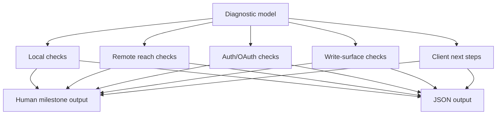

# feat: Setup Doctor Status

## Summary

Turn remote setup from a one-shot provisioning command into a milestone-based setup plus a
non-mutating doctor/status surface that explains local health, remote reach, OAuth discovery, auth
state, write availability, and next corrective action without printing secrets.

---

## Problem Frame

After local proof, users need to connect remote clients without becoming OAuth or Tailscale
debuggers. Existing setup already performs valuable checks, but it requires repeated URL concepts
and has no standalone diagnostic narrative (see origin: docs/brainstorms/2026-06-04-first-class-product-requirements.md).

---

## Assumptions

*This plan was authored without synchronous user confirmation. The items below are planning-time
inferences that should be reviewed before implementation proceeds.*

- `setup` should remain the mutating provisioning surface, while `doctor` or `status` is
  explicitly non-mutating.
- The first implementation should prefer CLI and JSON output over a new local web UI.
- The command should report categories and next actions, not raw command output, so agents and
  humans can act without seeing private values.

---

## Requirements

- R9. Minimize required setup arguments by deriving safe defaults where possible.
- R10. Make setup output milestone-based.
- R11. Provide a non-mutating doctor/status surface.
- R12. Separate local health from remote reach and current degradation state.
- R13. Map failures to user-action categories.
- R14. Never print secrets, token values, private file bodies, or sensitive env values.
- R15. Support JSON mode for agents and CI checks.
- R16. Include client-specific next steps without hardcoded operator hostnames.
- R17. Distinguish local CLI usage from remote MCP usage.
- R18. Fail honestly when Tailscale is absent or unauthenticated and do not manage its lifecycle.
- R19. Include a product-readable "what this means" summary.
- R20. Update troubleshooting docs.
- R21. Preserve write-enabled remote serving security invariants.

**Origin actors:** A1 new self-hosting user, A2 daily operator, A3 remote client user.
**Origin flows:** F2 guided endpoint setup and diagnosis.
**Origin acceptance examples:** AE2 setup/status diagnosis.

---

## Scope Boundaries

### Deferred for later

- Hosted/cloud Hypermnesic.
- Multi-user/team RBAC beyond read/write client grants.
- A full graphical web app.

### Outside this product's identity

- Becoming a hosted memory API.
- Becoming an agent runtime.

### Deferred to Follow-Up Work

- Client grant listing/revoke UI is planned in `docs/plans/2026-06-04-004-feat-consent-client-trust-plan.md`.
- Product smoke automation is planned in `docs/plans/2026-06-04-008-feat-product-proof-launch-readiness-plan.md`.

---

## Context & Research

### Relevant Code and Patterns

- `src/hypermnesic/install.py` contains `setup`, `SetupOps`, `verify_discovery`,
  `funnel_routes`, and fail-closed provisioning.
- `src/hypermnesic/cli.py` currently requires both `--public-url` and `--resource` for setup.
- `tests/test_install.py` has offline setup orchestration tests using `_FakeSetupOps`.
- `docs/guides/getting-started.md` documents setup failure modes in prose.
- `src/hypermnesic/mcp_server.py` enforces write-enabled/auth invariants.

### Product Design Lens

- Users should see a status story: local memory, service, public reach, auth, write, client next
  action.
- The design bar is a calm diagnostic checklist, not a wall of implementation details.

### External References

- MCP/OAuth client expectations are already mediated by existing SDK behavior in this repo; prefer
  local code and tests over adding a new auth abstraction.

---

## Key Technical Decisions

- Add a reusable diagnostic model under `install.py` or a new `doctor.py` module, then have setup
  and doctor render the same milestone vocabulary.
- Make `--resource` optional for setup and default it to `--public-url` when omitted, while keeping
  explicit override.
- Keep doctor/status non-mutating: no service start, no funnel writes, no secret generation, no
  client config mutation.
- Preserve fail-closed setup: if mutating setup cannot complete, it should not leave partial state.

---

## Open Questions

### Resolved During Planning

- Should doctor repair problems automatically? No. The requirements say non-mutating doctor/status.
- Should setup manage Tailscale lifecycle? No. Existing behavior and R18 say it should explain the
  missing precondition and stop.

### Deferred to Implementation

- Exact command naming: `doctor`, `status`, or both as aliases should be settled after checking CLI
  help ergonomics and test expectations.
- Exact local service status probe depth may depend on what is reliably available without
  systemd-user bus access.

---

## High-Level Technical Design

> *This illustrates the intended approach and is directional guidance for review, not
> implementation specification. The implementing agent should treat it as context, not code to
> reproduce.*

---

## Implementation Units

### U1. Diagnostic Result Model

**Goal:** Define the structured milestone/check/result vocabulary shared by setup and doctor.

**Requirements:** R10, R12, R13, R14, R15, R19.

**Dependencies:** docs/plans/2026-06-04-001-feat-local-first-value-proof-plan.md.

**Files:**
- Create: `src/hypermnesic/doctor.py`
- Modify: `src/hypermnesic/install.py`
- Test: `tests/test_doctor.py`
- Test: `tests/test_install.py`

**Approach:**
- Represent each check as category, status, user action, human summary, and machine-readable detail.
- Keep secret-bearing values out of the model entirely.
- Include local, remote, OAuth, write, and degradation categories even when skipped.

**Execution note:** Start with failing result-shape and secret-redaction tests.

**Patterns to follow:**
- `_FakeSetupOps` in `tests/test_install.py`.
- Existing JSON output style in `src/hypermnesic/cli.py`.

**Test scenarios:**
- Covers AE2. Happy path: diagnostic model reports local index, service, funnel, OAuth metadata,
  unauth 401, and write availability as pass/fail/skipped.
- Edge case: a skipped remote check includes a reason and does not mark overall local health failed.
- Error path: a missing API key or Tailscale state maps to a user-action category, not a raw stack.
- Security: model fields never include token values, approval token values, or private file bodies.

**Verification:**
- Setup and doctor can render from the same model without duplicating category logic.

### U2. Non-Mutating Doctor/Status CLI

**Goal:** Add the owner-facing command that checks system state after setup without changing it.

**Requirements:** R11, R12, R13, R14, R15, R17, R18, R19.

**Dependencies:** U1.

**Files:**
- Modify: `src/hypermnesic/cli.py`
- Modify: `src/hypermnesic/doctor.py`
- Test: `tests/test_doctor.py`
- Test: `tests/test_cli.py`

**Approach:**
- Add a doctor/status parser entry that accepts repo, public URL/resource when needed, and `--json`.
- Probe only read-only state: repo git status, index DB existence/freshness, dense availability,
  env-file existence/permissions category, service/funnel discovery when URLs are provided.
- Do not generate secrets, start services, write units, or call funnel set-path operations.

**Patterns to follow:**
- `_cmd_converge` and `_cmd_setup` return-code behavior.
- `SetupOps.verify_discovery` for external discovery checks.

**Test scenarios:**
- Covers AE2. Happy path: doctor on a fixture repo with mocked ops returns healthy local checks.
- Edge case: no public URL provided still reports local health and marks remote checks skipped.
- Error path: missing Tailscale returns "authenticate Tailscale" or "install missing" action.
- Integration: doctor runs twice with the same fixture and leaves files, env file, and funnel calls
  unchanged.

**Verification:**
- Users can diagnose common setup states without rerunning setup.

### U3. Setup Defaults and Milestone Output

**Goal:** Reduce avoidable setup concepts and make mutating setup output use the milestone model.

**Requirements:** R9, R10, R13, R14, R15, R16, R18, R19, R21.

**Dependencies:** U1.

**Files:**
- Modify: `src/hypermnesic/cli.py`
- Modify: `src/hypermnesic/install.py`
- Test: `tests/test_install.py`
- Test: `tests/test_cli.py`

**Approach:**
- Make `--resource` optional and default it to `--public-url`.
- After setup, run or assemble the same milestone model used by doctor.
- Keep existing `_require_public_https_origin`, fail-closed ordering, and auth/write invariants.

**Execution note:** Characterize current setup behavior before changing parser requirements.

**Patterns to follow:**
- Existing fail-closed `setup` tests in `tests/test_install.py`.
- `mcp_server.build_server` write-enabled/auth invariant tests.

**Test scenarios:**
- Happy path: setup with only `--public-url` uses the same value as resource and reports both in
  JSON without duplication confusion.
- Happy path: explicit `--resource` still overrides the default.
- Error path: invalid HTTPS origin still fails before artifacts are written.
- Security: setup output names the env file path but never prints approval token value.
- Regression: write-enabled remote serving still refuses unsafe auth-off non-loopback modes unless
  explicit bounded tailnet opt-in applies.

**Verification:**
- Setup output is milestone-based and requires fewer concepts for the common case.

### U4. Client-Specific Next Actions

**Goal:** Produce copyable next-step guidance for each supported client without hardcoded
operator-specific hosts.

**Requirements:** R16, R17, R19, R20.

**Dependencies:** U1, U2, U3.

**Files:**
- Create: `src/hypermnesic/client_guidance.py`
- Modify: `src/hypermnesic/install.py`
- Modify: `src/hypermnesic/doctor.py`
- Test: `tests/test_client_guidance.py`

**Approach:**
- Centralize guidance for ChatGPT, Claude, Claude Code, Codex, Obsidian, and local CLI.
- Distinguish local CLI usage from remote MCP usage.
- Use placeholders in docs and computed URLs at runtime, with no operator hostnames in committed
  files.

**Patterns to follow:**
- `plugin/README.md` OAuth discovery explanation.
- `docs/guides/getting-started.md` setup instructions.

**Test scenarios:**
- Happy path: each supported client receives a next action with the configured placeholder/public
  URL and appropriate local/remote wording.
- Edge case: no public URL returns local CLI guidance and says remote guidance is unavailable.
- Security: generated guidance does not include token values or static Authorization headers.
- Integration: setup and doctor both consume the same guidance function.

**Verification:**
- Users get one coherent set of next actions instead of scattered README/plugin instructions.

### U5. Troubleshooting and Reference Docs

**Goal:** Update user-facing docs so setup and doctor failure states map to corrective actions.

**Requirements:** R20, R8, R16, R17, R19.

**Dependencies:** U2, U3, U4.

**Files:**
- Modify: `README.md`
- Modify: `docs/guides/getting-started.md`
- Modify: `docs/reference/cli.md`
- Modify: `docs/reference/configuration.md`
- Modify: `docs/README.md`
- Modify: `CHANGELOG.md`

**Approach:**
- Put local proof first, then setup, then doctor/status.
- Add a troubleshooting table keyed by diagnostic categories.
- Avoid copying enumerated implementation details that can drift when generated by the CLI.

**Test scenarios:**
- Test expectation: none for prose, but run public-surface secret/host scan.

**Verification:**
- Docs match the implemented commands and do not include operator-specific values.

---

## System-Wide Impact

- **Interaction graph:** Setup and doctor share diagnostic vocabulary; doctor must not call
  mutating ops.
- **Error propagation:** Failures become action categories and summaries, not raw tracebacks.
- **State lifecycle risks:** Setup still generates secrets and writes units only after preflight
  checks; doctor writes nothing.
- **API surface parity:** Human and JSON output must carry the same statuses.
- **Unchanged invariants:** No secrets printed; remote write serving remains auth-gated except the
  explicit bounded tailnet-write opt-in.

---

## Risks & Dependencies

| Risk | Mitigation |
|------|------------|
| Doctor becomes a second setup with side effects | Keep ops interface read-only in doctor tests and assert no service/funnel/env writes |
| JSON output leaks sensitive values | Redaction tests plus `scripts/preflight_public_scan.py` |
| Client guidance hardcodes operator hosts | Use placeholders in docs and runtime URLs only |
| Setup defaults break advanced resource configs | Preserve explicit `--resource` override |

---

## Documentation / Operational Notes

- Implementation must update CLI reference, configuration docs, getting-started, README, docs
  index if current truth moves, and changelog.
- No deployment is required for planning, but implementation of live remote checks should include
  an offline test seam and a manual smoke checklist.

---

## First-Class Validation Gates

This sprint is not complete until every gate below has passing evidence captured in the PR
description, Linear issue comment when available, and final implementation handoff. The U1 local
value proof must still pass after these changes.

- **Evidence matrix gate:** the final handoff must include a requirement-by-requirement evidence
  matrix for R9-R21 and AE2. Each row must name the automated test, manual smoke step, CLI transcript,
  JSON fixture, or docs path that proves the requirement; "covered by implementation" is not
  acceptable evidence.
- **Blocking standard:** these gates are release-blocking, not advisory. If any row in the evidence
  matrix is missing, flaky, ambiguous, or dependent on private operator infrastructure, the sprint
  cannot be marked complete until the plan or implementation is corrected.
- **Proof shape gate:** validation must include at least one healthy path, one partial/broken setup
  path, one non-mutating side-effect check, one JSON contract check, one secret-hygiene check, and
  one docs/current-truth consistency check.
- **AE2 diagnostic gate:** from a partially configured endpoint fixture, doctor/status output must
  clearly separate local index health, remote service reachability, Funnel/public URL state, OAuth
  discovery, auth state, write availability, and next corrective action.
- **Non-mutating gate:** `status` and `doctor` must never start services, rewrite config, create
  tokens, modify the vault, or create git commits. Tests must assert no filesystem/config/git side
  effects for representative healthy, partial, and broken states.
- **Secret hygiene gate:** diagnostic output, JSON, logs, and test snapshots must not print tokens,
  secrets, private operator hosts, private IPs, `.env` contents, or credential file bodies. Include
  targeted `rg` checks over changed files and fixtures.
- **Actionability gate:** every failing diagnostic item must include a severity, human explanation,
  exact next command or doc pointer, and a machine-readable code. No generic "check configuration"
  failures are acceptable.
- **Setup default gate:** the setup flow must avoid requiring redundant `--resource` input when it
  equals the public URL. Tests must cover defaulting, explicit override, and invalid mismatch cases.
- **Client path gate:** doctor/status must provide distinct next steps for local-only use, Claude or
  Codex plugin use, Obsidian companion use, and generic remote MCP client use.
- **Cumulative product gate:** rerun U1 local proof plus the new doctor/status tests. A user must be
  able to progress from local proof to setup diagnosis without source-code inspection.
- **Regression gate:** run and record exact results for targeted setup/install/CLI tests,
  `git diff --check`, `uv sync --extra dev`, `uv run ruff check .`,
  `uv run python scripts/check_version_consistency.py`, `uv run pytest`,
  `uv run python scripts/license_scan.py`, `uv run python scripts/preflight_public_scan.py`, and a
  targeted changed-file scan for secrets, private hosts/IPs, token-looking strings, and raw private
  note bodies. Targeted tests cannot substitute for the full gate set.

## Sources & References

- Origin document: [docs/brainstorms/2026-06-04-first-class-product-requirements.md](../brainstorms/2026-06-04-first-class-product-requirements.md)
- Product review: [docs/reports/2026-06-04-hypermnesic-product-design-review.md](../reports/2026-06-04-hypermnesic-product-design-review.md)
- Prior setup requirements: [docs/brainstorms/2026-06-03-unified-oauth-endpoint-and-setup-requirements.md](../brainstorms/2026-06-03-unified-oauth-endpoint-and-setup-requirements.md)
- Related code: `src/hypermnesic/install.py`, `src/hypermnesic/cli.py`, `src/hypermnesic/mcp_server.py`
- Related tests: `tests/test_install.py`, `tests/test_cli.py`, `tests/test_mcp_server.py`
