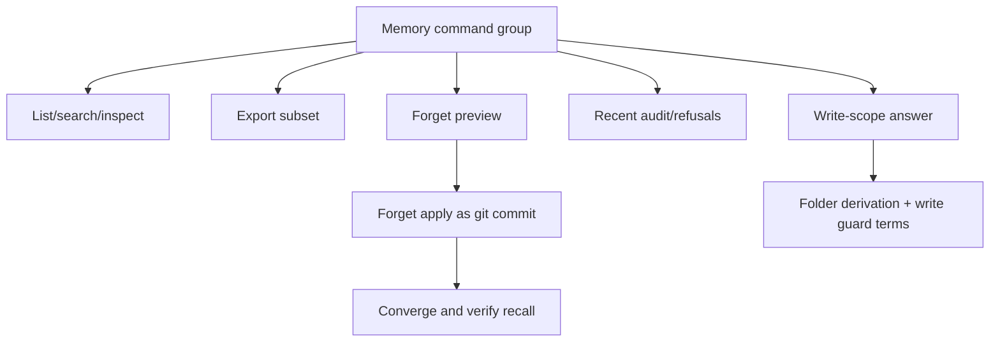

# feat: Memory Control Center

## Summary

Add first-class owner commands to list, inspect, export, preview forget/delete, apply safe
git-backed removal, revert recent writes when git can express it, view recent audit entries and
refusals, and answer "what would this agent be allowed to write?" with the same write-surface
truth used by `list_folders` and `commit_note`.

---

## Problem Frame

Hypermnesic has strong underlying control through files, git, audit logs, protected-path guards,
and OAuth scopes, but a memory product is not first-class until owners can inspect and control
memory without deriving the model from implementation details.

---

## Assumptions

*This plan was authored without synchronous user confirmation. The items below are planning-time
inferences that should be reviewed before implementation proceeds.*

- The first control center should be CLI-first with JSON output, reusing git/files/audit as the
  source of truth.
- Destructive actions should be preview-first and should not rewrite git history.
- "Forget" should mean removing current source content and reconverging recall, while explicitly
  explaining that old commits and old chat contexts may still contain prior mentions.

---

## Requirements

- R22. List remembered files and recently changed memory items.
- R23. Inspect item path, heading/title, snippet, last commit, write actor, and source type when
  known.
- R24. Explain provenance in terms of files and commits.
- R25. Export memory or selected subsets while preserving markdown and provenance metadata.
- R26. Delete/forget through a git-backed auditable flow.
- R27. Include preview before destructive change and verification after.
- R28. Explain source removal versus generated/index state versus old git/chat history.
- R29. Revert a recent memory write through a guided flow when safe.
- R30. View recent writes and refusals in a body-free audit view.
- R31. Filter by folder, writable/protected state, capture status, generated status, and recent
  activity.
- R32. Expose writable folders and protected paths in the same terms as `list_folders` and
  `commit_note`.
- R33. Answer "what would this agent be allowed to write?"
- R34. State dense degradation and manual reindex recommendation.
- R35. Support machine-readable output.
- R36. Teach memory control as a product capability.

**Origin actors:** A2 daily operator, A4 agent client, A5 memory auditor.
**Origin flows:** F4 inspect and control memory.
**Origin acceptance examples:** AE3 memory management.

---

## Scope Boundaries

### Deferred for later

- Multi-user/team RBAC beyond read/write client grants.
- Enterprise compliance programs and organization-wide audit dashboards.
- Full graphical web app.

### Outside this product's identity

- Hiding provenance behind opaque summaries.
- Becoming a note-taking app that competes with Obsidian.

### Deferred to Follow-Up Work

- OAuth client grant list/revoke lives in `docs/plans/2026-06-04-004-feat-consent-client-trust-plan.md`.
- Daily workflow docs that integrate memory control live in `docs/plans/2026-06-04-007-feat-daily-human-workflows-plan.md`.

---

## Context & Research

### Relevant Code and Patterns

- `src/hypermnesic/index.py` exposes indexed paths and hit data.
- `src/hypermnesic/folders.py` and `mcp_server._effective_write_surface` already define writable
  folder truth.
- `src/hypermnesic/audit_log.py` records summary-only write audit entries.
- `src/hypermnesic/commit_note.py` has git-first writes and dry-run preview.
- `src/hypermnesic/rename.py` behavior is covered through `tests/test_rename.py`.
- `tests/test_blocklist_write_gate.py` guards write-surface security.

### Product Design Lens

- Control must be visible as product verbs: inspect, export, preview forget, delete, revert, audit.
- Outputs should answer user questions directly: where is it, who changed it, what can write here,
  and how do I prove the result.

### External References

- OpenAI memory docs emphasize review, delete, clear, disable, and temporary memory-free modes as
  core memory controls: https://help.openai.com/en/articles/8590148-memory-in-chatgpt-remembering-what-you-chat-about

---

## Key Technical Decisions

- Build a `memory` CLI command group or equivalent owner surface rather than scattering commands
  across unrelated verbs.
- Use current git tree plus audit log as control truth; the index remains a projection used for
  search/snippets and stale/degraded signals.
- Implement delete/forget as new commits, not history rewrite.
- Prefer guided preview/apply flows for destructive actions; JSON output must expose both stages.

---

## Open Questions

### Resolved During Planning

- Should memory delete rewrite git history? No. That conflicts with provenance and should be out
  of scope for first-class control.
- Should export create a new proprietary bundle? No. It should preserve markdown files and
  optional provenance metadata.

### Deferred to Implementation

- Exact provenance metadata format for export.
- Exact safe-revert criteria when a recent commit touched multiple files or conflicts with newer
  changes.

---

## High-Level Technical Design

> *This illustrates the intended approach and is directional guidance for review, not
> implementation specification. The implementing agent should treat it as context, not code to
> reproduce.*

---

## Implementation Units

### U1. Memory Listing and Inspection

**Goal:** Let owners list and inspect indexed memories with provenance and source metadata.

**Requirements:** R22, R23, R24, R31, R34, R35.

**Dependencies:** docs/plans/2026-06-04-002-feat-setup-doctor-status-plan.md.

**Files:**
- Create: `src/hypermnesic/memory_control.py`
- Modify: `src/hypermnesic/cli.py`
- Test: `tests/test_memory_control.py`

**Approach:**
- Build a read-only control module over index paths, git metadata, and optional audit data.
- Include repo-relative path, heading/title, snippet when available, last commit, actor when audit
  can associate one, and type hints for captures/generated/authored content.
- Report degraded lexical-only/manual reindex state when available.

**Execution note:** Implement behavior test-first with fixture repos and fake audit logs.

**Patterns to follow:**
- `retrieve.search` hit shape.
- `audit_log.AuditLog.entries`.
- `generated.render` frontmatter conventions for generated surfaces.

**Test scenarios:**
- Covers AE3. Happy path: inspect an agent-written note and see path, title, snippet, last commit,
  actor, and provenance.
- Edge case: item with no audit entry still shows git commit provenance and unknown actor.
- Edge case: generated/captured/source types are inferred only when evidence exists; unknown stays
  explicit.
- Error path: missing path returns a clean not-found result with no private file body.

**Verification:**
- Owners can answer what Hypermnesic remembers and where it lives.

### U2. Filtered Control Views and Write-Surface Answer

**Goal:** Add filters and answer what an agent would be allowed to write.

**Requirements:** R31, R32, R33, R35.

**Dependencies:** U1.

**Files:**
- Modify: `src/hypermnesic/memory_control.py`
- Modify: `src/hypermnesic/cli.py`
- Test: `tests/test_memory_control.py`
- Test: `tests/test_folders.py`

**Approach:**
- Reuse folder derivation and the effective write surface so control views cannot drift from
  `commit_note`.
- Add filters for folder, writable/protected state, generated/captured state, and recent activity.
- Return a write-scope answer using the same terms as `list_folders`.

**Patterns to follow:**
- `src/hypermnesic/folders.py`.
- `_effective_write_surface` in `src/hypermnesic/mcp_server.py`.

**Test scenarios:**
- Happy path: writable filter matches `list_folders` for the same repo and allowlist.
- Edge case: protected paths are labeled with the same protected reason the write guard uses.
- Error path: invalid folder filter does not leak out-of-vault paths.
- Integration: write-scope answer changes when an explicit allowlist narrows the surface.

**Verification:**
- Advertised write permissions match actual write behavior.

### U3. Export Memory Subsets

**Goal:** Provide product-level export for all or filtered memory while preserving markdown and
provenance metadata.

**Requirements:** R25, R35.

**Dependencies:** U1, U2.

**Files:**
- Modify: `src/hypermnesic/memory_control.py`
- Modify: `src/hypermnesic/cli.py`
- Test: `tests/test_memory_control.py`

**Approach:**
- Copy selected markdown files into a destination tree or archive-like directory structure using
  repo-relative layout.
- Write a small provenance manifest with source path, last commit, export time, and filter used.
- Never include `.hypermnesic/` index DB or secrets.

**Patterns to follow:**
- Public-surface secret scanning tests.
- `tests/test_sidecar.py` and other filesystem-output tests for deterministic fixture output.

**Test scenarios:**
- Happy path: export by folder preserves markdown file layout and writes a provenance manifest.
- Edge case: empty selection returns an explicit empty export result.
- Security: export excludes `.env`, `.hypermnesic/index.db`, protected governance files unless the
  user explicitly selected authored docs that are not secrets.
- Error path: destination outside allowed local filesystem semantics fails cleanly if needed.

**Verification:**
- Owners can take their memory out as markdown plus provenance without an opaque database export.

### U4. Forget/Delete Preview and Apply

**Goal:** Add a guided git-backed removal flow with preview, apply, audit, and verification.

**Requirements:** R26, R27, R28, R34, R35.

**Dependencies:** U1, U2.

**Files:**
- Modify: `src/hypermnesic/memory_control.py`
- Modify: `src/hypermnesic/cli.py`
- Test: `tests/test_memory_control.py`
- Test: `tests/test_serialize.py`

**Approach:**
- Implement preview to show target path, current heading/snippet, expected git diff summary, and
  post-apply verification plan.
- Apply removal as a new commit using existing guard/coordination concepts; do not weaken protected
  path checks.
- After apply, converge or signal manual reindex and verify the removed path is absent from current
  index/search results when possible.

**Execution note:** Add failing destructive-flow tests before implementation.

**Patterns to follow:**
- `commit_note` dry-run/apply split.
- `serialize.check` protected-path behavior.
- `audit_log.AuditLog.append`.

**Test scenarios:**
- Covers AE3. Happy path: preview shows the file to remove, apply creates a commit, audit logs a
  summary, and the current path is no longer indexed after convergence.
- Edge case: deleting generated/index state is explained as different from deleting source files.
- Error path: protected path removal is refused without file changes.
- Error path: dirty tree/head drift refuses apply and leaves working tree intact.
- Integration: recall after deletion does not return the deleted current source file.

**Verification:**
- Forget/delete is auditable, preview-first, and clear about git-history limits.

### U5. Guided Recent Write Revert

**Goal:** Let owners revert a recent memory write when git can safely express the revert.

**Requirements:** R29, R30, R35.

**Dependencies:** U1, U4.

**Files:**
- Modify: `src/hypermnesic/memory_control.py`
- Modify: `src/hypermnesic/cli.py`
- Test: `tests/test_memory_control.py`

**Approach:**
- Use audit entries and git metadata to identify recent single-memory writes.
- Provide preview and apply modes.
- Refuse complex cases rather than silently choosing an unsafe revert strategy.

**Patterns to follow:**
- Git coordination in `commit_note.py`.
- Audit entry shape in `audit_log.py`.

**Test scenarios:**
- Happy path: a recent single-file memory write can be previewed and reverted as a new commit.
- Edge case: multi-file or missing commit metadata is marked unsupported with a clear reason.
- Error path: conflicts or dirty tree refuse apply with no partial state.
- Integration: audit/recent view reflects the revert action.

**Verification:**
- Owners can undo recent bad memory writes without knowing raw git commands.

### U6. Audit and Refusal View

**Goal:** Make recent writes and refusals inspectable without exposing raw note bodies or secrets.

**Requirements:** R30, R35, R36.

**Dependencies:** U1, U4, U5.

**Files:**
- Modify: `src/hypermnesic/audit_log.py`
- Modify: `src/hypermnesic/memory_control.py`
- Modify: `src/hypermnesic/cli.py`
- Test: `tests/test_audit_log.py`
- Test: `tests/test_memory_control.py`

**Approach:**
- Extend the audit/read model only as needed for refusal visibility; if refusals are not currently
  logged, add a summary-only refusal event path without storing raw bodies.
- Render recent actions with actor, verb, path, sha, summary, and refusal category.
- Keep machine-readable and human-readable output aligned.

**Patterns to follow:**
- Existing summary truncation in `audit_log.py`.
- MCP write refusal behavior in `mcp_server.py`.

**Test scenarios:**
- Happy path: recent write view shows summaries and commit shas without note bodies.
- Happy path: refusal view shows category and path without body/secrets.
- Security: long body text and token-like values do not appear in audit output.
- Edge case: absent audit file returns an empty, healthy view.

**Verification:**
- Memory auditors can inspect recent memory actions without reading raw private content.

### U7. Memory Control Documentation

**Goal:** Teach memory control as a first-class product capability.

**Requirements:** R36, R24, R28.

**Dependencies:** U1-U6.

**Files:**
- Create: `docs/guides/memory-control.md`
- Modify: `README.md`
- Modify: `docs/guides/getting-started.md`
- Modify: `docs/reference/cli.md`
- Modify: `docs/README.md`
- Modify: `CHANGELOG.md`

**Approach:**
- Document list, inspect, export, preview forget, apply forget, revert, audit, and write-scope
  answer.
- Explain provenance and limits: source removal, index/generated state, git history, and old chat
  contexts are distinct.
- Link to consent/client trust work once the next sprint lands.

**Test scenarios:**
- Test expectation: none for prose, but run public-surface secret/host scan.

**Verification:**
- A user can answer "what does Hypermnesic remember and how do I remove it?" from docs.

---

## System-Wide Impact

- **Interaction graph:** New owner surface reads index/git/audit and applies destructive changes
  through guarded git commits.
- **Error propagation:** Destructive actions must refuse cleanly on dirty tree, protected paths,
  and coordination failures.
- **State lifecycle risks:** Forget/delete and revert affect current source truth; index must
  converge or report manual reindex.
- **API surface parity:** CLI JSON output should be usable by agents; MCP exposure can remain
  deferred unless implementation finds a narrow read-only need.
- **Unchanged invariants:** No history rewrite; no write guard weakening; no raw bodies/secrets in
  audit output.

---

## Risks & Dependencies

| Risk | Mitigation |
|------|------------|
| Forget semantics are misunderstood as total erasure from git history | Explicit preview/docs language and verification output |
| Control view drifts from actual write guard | Reuse `folders.py` and `_effective_write_surface`; add parity tests |
| Revert causes data loss in complex histories | Support only safe cases and refuse otherwise |
| Audit view leaks body content | Summary-only tests and public scan |

---

## Documentation / Operational Notes

- Implementation must update docs and changelog because this is user-visible behavior.
- Security-sensitive changes around delete/revert/write guard should cite `SECURITY.md` and
  `docs/threat-model-commit-note.md` in the implementation PR.

---

## Sources & References

- Origin document: [docs/brainstorms/2026-06-04-first-class-product-requirements.md](../brainstorms/2026-06-04-first-class-product-requirements.md)
- Product review: [docs/reports/2026-06-04-hypermnesic-product-design-review.md](../reports/2026-06-04-hypermnesic-product-design-review.md)
- Related code: `src/hypermnesic/audit_log.py`, `src/hypermnesic/commit_note.py`,
  `src/hypermnesic/folders.py`, `src/hypermnesic/mcp_server.py`
- Related tests: `tests/test_audit_log.py`, `tests/test_blocklist_write_gate.py`,
  `tests/test_folders.py`, `tests/test_mcp_server.py`
- External docs: https://help.openai.com/en/articles/8590148-memory-in-chatgpt-remembering-what-you-chat-about
