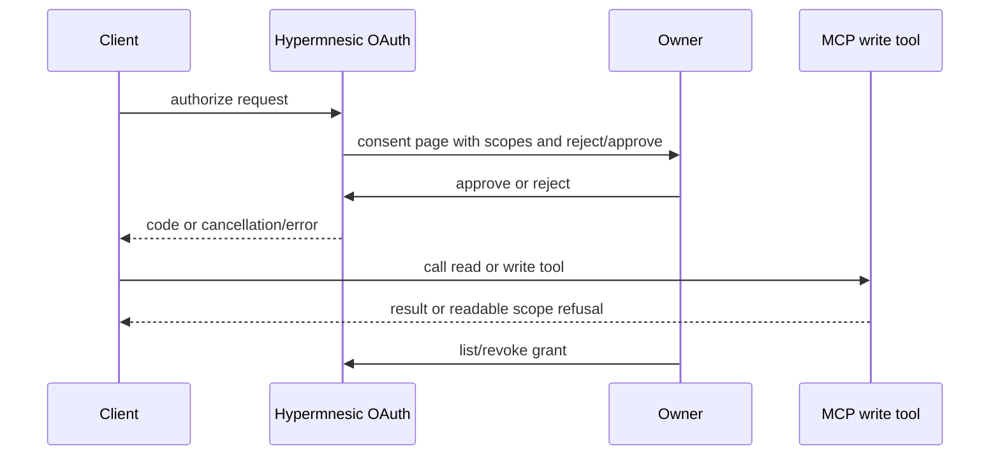

# feat: Consent Client Trust

## Summary

Upgrade OAuth consent from a basic approval form into a small trust flow: plain-language read/write
scope explanations, explicit reject/cancel, unfamiliar-client warnings, post-approval
confirmation, client/grant listing when truthful, revoke actions, and clearer insufficient-scope
refusals for both owners and agents.

---

## Problem Frame

The public endpoint is write-capable once authorized. Existing security primitives are strong, but
the consent experience should help the owner understand what is being granted, how to reject it,
and how to revoke it later.

---

## Assumptions

*This plan was authored without synchronous user confirmation. The items below are planning-time
inferences that should be reviewed before implementation proceeds.*

- The first version can remain a plain server-rendered no-script page; visual polish should improve
  hierarchy and trust without adding JavaScript.
- Client/grant management should expose only metadata the auth provider can truthfully persist.
- Revocation should use existing RFC 7009 provider behavior rather than a parallel token store.

---

## Requirements

- R37. Explain read and write scopes in plain language before approval.
- R38. Offer approve read, approve write when requested, and reject/cancel.
- R39. Show client name, redirect origin, requested scopes, and warning for unfamiliar/generic
  identity.
- R40. Tell the user how to revoke access.
- R41. Show confirmation state after approval.
- R42. List currently known clients/grants when auth state supports it.
- R43. Revoke a client/grant through a product-level action.
- R44. Distinguish read-only clients from write clients.
- R45. Return understandable insufficient-scope refusal.
- R46. Explain write approval does not bypass guards.
- R47. Never display operator approval token after creation or encourage copying tokens into chat.
- R48. Keep consent accessible, plain, keyboard-friendly, script-free, and distraction-free.

**Origin actors:** A2 daily operator, A3 remote client user, A4 agent client, A5 memory auditor.
**Origin flows:** F3 connect and authorize a client.
**Origin acceptance examples:** AE4 consent and revoke/control surface.

---

## Scope Boundaries

### Deferred for later

- Multi-user/team RBAC beyond read/write client grants and owner controls.
- Enterprise legal review workflows and organization-wide audit dashboards.
- Full graphical web app.

### Outside this product's identity

- Hiding memory provenance behind opaque summaries.
- Becoming a hosted memory API.

### Deferred to Follow-Up Work

- Plugin/hook status is planned in `docs/plans/2026-06-04-005-feat-plugin-hook-observability-plan.md`.
- Product proof of revocation is planned in `docs/plans/2026-06-04-008-feat-product-proof-launch-readiness-plan.md`.

---

## Context & Research

### Relevant Code and Patterns

- `src/hypermnesic/auth_cloud.py` implements DCR, pending consent, access/refresh tokens,
  refresh rotation, and revoke.
- `src/hypermnesic/mcp_server.py` renders consent HTML and enforces write scope in `commit_note`.
- `tests/test_auth_cloud.py` covers consent, metadata, revoke, pending expiry, and cloud server
  wiring.
- `tests/test_mcp_server.py` covers write-enabled scope/refusal behavior.
- `docs/threat-model-commit-note.md` and `SECURITY.md` define write-path threat constraints.

### Product Design Lens

- Consent is a trust moment: the user must understand client identity, redirect origin, requested
  scope consequences, reject path, and later revocation.
- The UI should be deliberately plain and accessible, not decorative.

### External References

- OpenAI memory controls emphasize review/delete/disable and user control:
  https://help.openai.com/en/articles/8590148-memory-in-chatgpt-remembering-what-you-chat-about
- OAuth revocation behavior is already implemented through the provider; prefer native provider
  primitives over a hand-rolled token adapter.

---

## Key Technical Decisions

- Keep consent server-rendered and script-free, improving markup, copy, actions, and accessibility
  while preserving CSP/no-store/anti-clickjacking headers.
- Persist grant/client metadata only if needed to list grants truthfully after restart; if the
  current in-memory provider cannot truthfully list post-restart grants, the UI must say so until
  persistence is implemented.
- Add product-level client/grant commands through CLI first, reusing auth provider state or a small
  secret-free metadata store.
- Improve insufficient-scope refusal at the write tool boundary without changing the scope gate.

---

## Open Questions

### Resolved During Planning

- Should approving write bypass protected-path/frontmatter/dirty-tree guards? No. R46 explicitly
  says write consent grants access to request `commit_note`, not permission to bypass guards.
- Should the approval token be shown again to help users copy it? No. R47 forbids this.

### Deferred to Implementation

- Whether grant metadata can be persisted with the current provider shape or needs a small
  provider-backed metadata file.
- Exact client warning heuristics for unfamiliar/generic names.

---

## High-Level Technical Design

> *This illustrates the intended approach and is directional guidance for review, not
> implementation specification. The implementing agent should treat it as context, not code to
> reproduce.*

---

## Implementation Units

### U1. Consent Copy, Layout, and Reject Flow

**Goal:** Redesign the consent page as a clear, accessible, script-free authorization decision.

**Requirements:** R37, R38, R39, R40, R47, R48.

**Dependencies:** docs/plans/2026-06-04-002-feat-setup-doctor-status-plan.md.

**Files:**
- Modify: `src/hypermnesic/mcp_server.py`
- Test: `tests/test_auth_cloud.py`
- Test: `tests/test_mcp_server.py`

**Approach:**
- Replace the minimal consent HTML with scope explanations and separate actions for reject/cancel
  and approve.
- Keep existing escaping, CSP, no-store, and form-action logic.
- Warn when client name is missing/generic or redirect origin looks unfamiliar.

**Execution note:** Add failing HTML/content/header tests before changing rendering.

**Patterns to follow:**
- `_render_consent` and `_consent_headers` security behavior.
- Existing no-reflection test coverage in `tests/test_auth_cloud.py`.

**Test scenarios:**
- Covers AE4. Happy path: write-scope request renders plain-language read/write consequences and
  an approve action.
- Happy path: page includes reject/cancel action and revocation guidance.
- Edge case: missing client name triggers a generic-client warning.
- Security: unknown pending ID is not reflected; redirect/client fields are escaped.
- Accessibility: form controls have labels and actions are keyboard-submit friendly.

**Verification:**
- Consent page helps the owner decide without weakening headers or escaping.

### U2. Consent Final States and Cancellation Semantics

**Goal:** Show post-approval confirmation and handle rejection/cancel without consuming trust in a
confusing way.

**Requirements:** R38, R40, R41.

**Dependencies:** U1.

**Files:**
- Modify: `src/hypermnesic/auth_cloud.py`
- Modify: `src/hypermnesic/mcp_server.py`
- Test: `tests/test_auth_cloud.py`

**Approach:**
- Add explicit rejection/cancel handling that returns the OAuth-appropriate denial path without
  issuing a code.
- Add confirmation state after successful approval where the server route can show what was
  granted before redirecting or after redirect when practical.
- Keep code issuance single-use and pending TTL/failure caps intact.

**Patterns to follow:**
- `CloudAuthProvider.finalize_consent`.
- Existing pending expiry and wrong-token tests.

**Test scenarios:**
- Covers AE4. Happy path: successful approval records and displays granted scopes.
- Happy path: reject/cancel does not issue an authorization code.
- Error path: expired pending shows a safe restart message.
- Security: wrong approval token failure cap still drops pending after configured attempts.

**Verification:**
- Approval, rejection, and expired states are distinguishable and safe.

### U3. Grant Metadata and Client Listing

**Goal:** Expose known client/grant state truthfully for owner review.

**Requirements:** R42, R44, R47.

**Dependencies:** U2.

**Files:**
- Modify: `src/hypermnesic/auth_cloud.py`
- Create: `src/hypermnesic/client_control.py`
- Modify: `src/hypermnesic/cli.py`
- Test: `tests/test_auth_cloud.py`
- Test: `tests/test_client_control.py`

**Approach:**
- Determine whether in-memory provider state is enough for initial list support; if not, add a
  secret-free metadata persistence surface with client id/name, redirect origin, scopes, grant
  timestamps, and revocation state, never raw tokens.
- Add CLI list command with JSON output.
- Clearly mark unavailable post-restart visibility if persistence is intentionally deferred.

**Execution note:** Characterize current provider state before adding persistence.

**Patterns to follow:**
- `CloudAuthProvider._clients`, `_access`, `_refresh`, and sibling revoke mapping.
- Secret-free config patterns in `install.py`.

**Test scenarios:**
- Happy path: after a read grant, client listing shows client identity and read-only scope.
- Happy path: after a write grant, listing distinguishes write-capable grant.
- Security: list output contains no access token, refresh token, approval token, or hashes.
- Edge case: expired tokens are not reported as active after sweep.

**Verification:**
- Owners can tell which known clients can read or write when state supports it.

### U4. Revoke Client/Grant Action

**Goal:** Provide a product-level revoke action backed by existing grant revocation behavior.

**Requirements:** R40, R42, R43, R44.

**Dependencies:** U3.

**Files:**
- Modify: `src/hypermnesic/client_control.py`
- Modify: `src/hypermnesic/cli.py`
- Test: `tests/test_auth_cloud.py`
- Test: `tests/test_client_control.py`

**Approach:**
- Reuse `CloudAuthProvider.revoke_token` semantics and metadata mapping to revoke a grant without
  exposing token values.
- Include preview/confirmation semantics if the action is destructive.
- Return machine-readable result showing grant was revoked and what the client can no longer do.

**Patterns to follow:**
- `test_revocation_kills_the_whole_grant_incl_refresh` in `tests/test_auth_cloud.py`.

**Test scenarios:**
- Covers AE4. Happy path: revoking a write grant removes both access and refresh capability.
- Edge case: revoking an already-revoked or expired grant is idempotent and clear.
- Error path: unknown grant id returns not found without revealing tokens.
- Integration: client listing reflects revoked state after the action.

**Verification:**
- Owners can revoke client access without handling tokens manually.

### U5. Write-Scope Refusal Language

**Goal:** Make insufficient write scope understandable to owners and agents.

**Requirements:** R45, R46, R47.

**Dependencies:** U1.

**Files:**
- Modify: `src/hypermnesic/mcp_server.py`
- Modify: `docs/reference/mcp-tools.md`
- Test: `tests/test_mcp_server.py`

**Approach:**
- Keep the scope check at the `commit_note` boundary.
- Return a refusal that says write scope is required, how to authorize/reconnect, and that scope
  does not bypass write guards.
- Avoid token details and avoid suggesting static Authorization headers.

**Patterns to follow:**
- Existing `commit_note` refusal shape.
- Existing read/write tool schema tests.

**Test scenarios:**
- Happy path: read-scoped principal calling `commit_note` receives `committed: false` and a clear
  write-scope refusal.
- Security: refusal contains no token or approval secret.
- Regression: write-scoped principal still passes to existing guard/frontmatter checks.

**Verification:**
- Agents can explain missing write capability without prompting users to paste secrets.

### U6. Consent and Client Trust Docs

**Goal:** Document consent, scopes, revoke, and guard boundaries.

**Requirements:** R40, R46, R47, R48.

**Dependencies:** U1-U5.

**Files:**
- Create: `docs/guides/consent-and-clients.md`
- Modify: `README.md`
- Modify: `docs/guides/getting-started.md`
- Modify: `docs/reference/cli.md`
- Modify: `docs/reference/mcp-tools.md`
- Modify: `docs/README.md`
- Modify: `CHANGELOG.md`

**Approach:**
- Explain read versus write grants, reject/cancel, revoke, and what write cannot bypass.
- Update getting-started to direct users to client control after first authorization.
- Keep docs free of operator hostnames and token values.

**Test scenarios:**
- Test expectation: none for prose, but run public-surface secret/host scan.

**Verification:**
- Users can understand client access and revocation before approving write.

---

## System-Wide Impact

- **Interaction graph:** OAuth consent, auth provider state, MCP write refusal, and CLI client
  control become linked product surfaces.
- **Error propagation:** Rejection, expired pending, insufficient scope, and revoked grant should
  be distinct.
- **State lifecycle risks:** Grant metadata must not store raw tokens; revocation must kill refresh
  siblings.
- **API surface parity:** Consent UI, CLI client control, and MCP refusals should use the same
  read/write language.
- **Unchanged invariants:** Approval token remains secret; write guards remain independent of OAuth
  scope; CSP/no-store/anti-clickjacking remain in force.

---

## Risks & Dependencies

| Risk | Mitigation |
|------|------------|
| Client list implies persistence that does not exist | Either implement secret-free persistence or state the limitation explicitly |
| Consent UI weakens security headers | Header and escaping tests remain required |
| Revocation leaves refresh token alive | Reuse and test existing whole-grant revoke semantics |
| UX encourages token copying into chat | Docs and UI must forbid token exposure and use browser/OAuth flow language |

---

## Documentation / Operational Notes

- Security-sensitive implementation must cite `SECURITY.md` and `docs/threat-model-commit-note.md`.
- No production secrets or operator hostnames should appear in fixtures, docs, or tests.

---

## First-Class Validation Gates

This sprint is not complete until every gate below has passing evidence captured in the PR
description, Linear issue comment when available, and final implementation handoff. U1-U3 product
proofs must remain green.

- **Evidence matrix gate:** the final handoff must include a requirement-by-requirement evidence
  matrix for R37-R48 and AE4. Each row must name the automated test, manual browser/smoke step, HTTP
  transcript, grant-state fixture, refusal fixture, security-header assertion, or docs path that
  proves the requirement; "covered by implementation" is not acceptable evidence.
- **Blocking standard:** these gates are release-blocking, not advisory. If any row in the evidence
  matrix is missing, flaky, ambiguous, or dependent on private operator infrastructure, the sprint
  cannot be marked complete until the plan or implementation is corrected.
- **Contract preservation gate:** every CLI command, JSON field, documented flow, security invariant,
  and public-facing artifact created or changed by this sprint must have an explicit regression
  assertion. Later sprints must rerun these assertions or document an intentional, reviewed contract
  change with matching docs and changelog updates.
- **Proof shape gate:** validation must include at least one approve path, one reject/cancel path,
  one malformed or expired request path, one revoked-client path, one write-scope refusal path, one
  accessibility/security-header check, one secret-hygiene check, and one docs/current-truth
  consistency check.
- **AE4 consent gate:** a new write-capable client request must show a consent page where the owner
  can tell what write permits, what path scope applies, which client is requesting access, and how
  to reject safely or approve intentionally.
- **Reject/cancel safety gate:** reject, browser close, timeout, malformed request, and cancelled
  authorization must leave no usable grant, no refresh token, no partial client trust record, and a
  clear final state for the human and client.
- **Grant inventory gate:** approved clients must be listable with client identity, granted scopes,
  write availability, issue/update time, and revocation affordance. The listing must not expose raw
  bearer tokens, refresh tokens, consent secrets, or credential file bodies.
- **Revoke gate:** revocation must invalidate the whole grant path used by the client, including
  refresh behavior where applicable. Tests must prove a revoked client cannot write and receives
  actionable insufficient-scope/revoked-state language.
- **Write-scope refusal gate:** write attempts without the required scope must fail closed before
  commit_note mutation, include the exact missing capability and next trust action, and avoid
  implying that local files or index state are at fault.
- **Security regression gate:** OAuth discovery, token audience/resource handling, refresh rotation,
  consent CSP, and existing write-gate tests must remain green for changed surfaces.
- **Cumulative product gate:** U1-U4 must compose: a reviewer can prove local value, diagnose remote
  setup, inspect/control memory, approve a client, revoke it, and verify write refusal afterward.
- **Regression gate:** run and record exact results for targeted auth/OAuth/MCP/write-scope tests,
  `git diff --check`, `uv sync --extra dev`, `uv run ruff check .`,
  `uv run python scripts/check_version_consistency.py`, `uv run pytest`,
  `uv run python scripts/license_scan.py`, `uv run python scripts/preflight_public_scan.py`, and a
  targeted changed-file scan for secrets, private hosts/IPs, token-looking strings, and raw private
  note bodies. Targeted tests cannot substitute for the full gate set.

## Sources & References

- Origin document: [docs/brainstorms/2026-06-04-first-class-product-requirements.md](../brainstorms/2026-06-04-first-class-product-requirements.md)
- Product review: [docs/reports/2026-06-04-hypermnesic-product-design-review.md](../reports/2026-06-04-hypermnesic-product-design-review.md)
- Related code: `src/hypermnesic/auth_cloud.py`, `src/hypermnesic/mcp_server.py`
- Related tests: `tests/test_auth_cloud.py`, `tests/test_mcp_server.py`
- External docs: https://help.openai.com/en/articles/8590148-memory-in-chatgpt-remembering-what-you-chat-about
