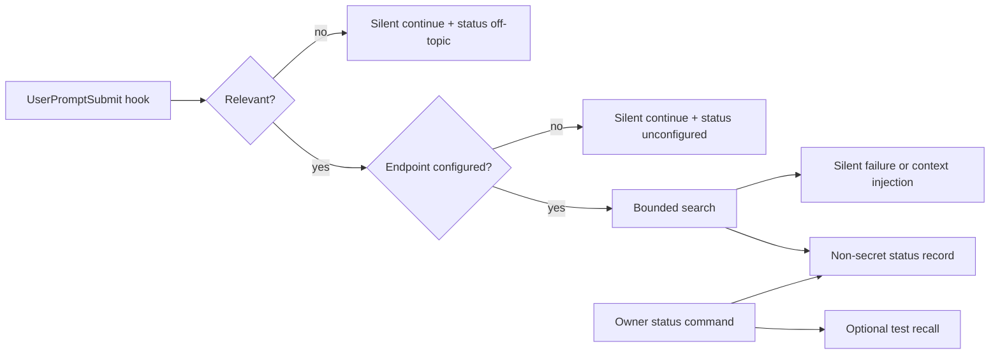

# feat: Plugin Hook Observability

## Summary

Make proactive memory recall observable without making it noisy: add status and test-recall
surfaces for the plugin/hook that report endpoint configuration, credential category, last recall
time, last outcome, degraded state, enabled/disabled state, and per-host disable controls while
preserving the hook's silent non-blocking behavior during normal agent use.

---

## Problem Frame

The auto-recall hook is intentionally silent on off-topic prompts, missing config, auth failures,
timeouts, and no hits. That is good for agent flow, but owners need a separate way to inspect why
recall did or did not happen.

---

## Assumptions

*This plan was authored without synchronous user confirmation. The items below are planning-time
inferences that should be reviewed before implementation proceeds.*

- Hook status should be a separate owner-invoked surface, not prompt injection.
- Status should be local file or command based so it works across Claude Code, Codex, and local
  hosts without a shared service.
- The hook should record categories and metadata, never full prompts, tokens, or raw private
  retrieved content.

---

## Requirements

- R49. Show configured endpoint, auth/token availability category, last recall time, last outcome,
  and enabled state.
- R50. Distinguish off-topic, unconfigured endpoint, missing credential, timeout, 401/expired auth,
  no hits, degraded lexical-only recall, and successful recall.
- R51. Keep hook silent/non-blocking during normal use, but inspectable on demand.
- R52. Allow disable per host or plugin installation without uninstalling.
- R53. Provide test recall with bounded non-secret output.
- R54. Explain MCP tool wiring, auto-recall hook wiring, local CLI, and remote OAuth differences.
- R55. Avoid claiming static token is required for MCP tool path.
- R56. Debug failures without reading hook source code and without polluting prompts.

**Origin actors:** A2 daily operator, A4 agent client.
**Origin flows:** F5 agent recall with observable hook behavior.
**Origin acceptance examples:** AE5 hook status diagnosis.

---

## Scope Boundaries

### Deferred for later

- Full graphical web app.
- Organization-wide observability dashboard.
- Automatic LLM consolidation of hook findings.

### Outside this product's identity

- Becoming an agent runtime.
- Replacing Honcho or other behavioural/session memory layers.

### Deferred to Follow-Up Work

- Taxonomy and agent guidance updates are planned in `docs/plans/2026-06-04-006-feat-memory-taxonomy-agent-guidance-plan.md`.
- Product proof of hook status is planned in `docs/plans/2026-06-04-008-feat-product-proof-launch-readiness-plan.md`.

---

## Context & Research

### Relevant Code and Patterns

- `plugin/plugins/hypermnesic/hooks/scripts/hypermnesic_agent_hook.py` implements relevance-gated
  recall and silent failure.
- `tests/test_plugin_hook.py` and `tests/test_hermes_plugin_hook.py` cover hook behavior.
- `plugin/README.md` explains the skill, OAuth MCP wiring, and hook exception for token/tailnet
  read route.
- `.mcp.json` wiring is OAuth-discovery-only and intentionally omits static auth headers.

### Product Design Lens

- Normal prompts should stay clean; owner-invoked diagnostics should be rich.
- Status needs familiar outcome categories rather than "it returned None".

### External References

- LangGraph memory docs distinguish short-term state and long-term memory, reinforcing that hook
  observability should not become session-memory storage:
  https://langchain-ai.github.io/langgraph/concepts/memory

---

## Key Technical Decisions

- Keep hook runtime silent and bounded; write only a small status record with non-secret metadata.
- Add a plugin-local status command/script that can read the status record and run test recall.
- Implement disable controls through environment/config flags the hook already reads or can read
  without new dependencies.
- Avoid static token guidance for MCP wiring; distinguish optional hook token from OAuth tool path.

---

## Open Questions

### Resolved During Planning

- Should hook diagnostics inject debug text into prompts? No. R51 and R56 require silent normal use
  and separate owner inspection.
- Should missing token be treated as always broken? No. The current tailnet read route can be
  token-free; status should classify auth route, not blindly error.

### Deferred to Implementation

- Exact status file location inside plugin state or user config.
- Exact per-host disable config shape for Claude Code and Codex.

---

## High-Level Technical Design

> *This illustrates the intended approach and is directional guidance for review, not
> implementation specification. The implementing agent should treat it as context, not code to
> reproduce.*

---

## Implementation Units

### U1. Hook Outcome Classification

**Goal:** Classify hook decisions into owner-understandable categories without changing normal
prompt behavior.

**Requirements:** R49, R50, R51, R56.

**Dependencies:** docs/plans/2026-06-04-004-feat-consent-client-trust-plan.md.

**Files:**
- Modify: `plugin/plugins/hypermnesic/hooks/scripts/hypermnesic_agent_hook.py`
- Test: `tests/test_plugin_hook.py`
- Test: `tests/test_hermes_plugin_hook.py`

**Approach:**
- Refactor internal hook logic enough to return outcome categories for status recording while
  preserving output contract.
- Distinguish off-topic, disabled, unconfigured endpoint, missing credential where relevant,
  timeout/failure, 401/expired auth when detectable, no hits, degraded lexical-only, and success.
- Do not store full prompt text.

**Execution note:** Add characterization tests that current output remains silent before adding
status behavior.

**Patterns to follow:**
- Existing fixture-based hook tests using `HYPERMNESIC_HOOK_FIXTURE`.
- `_search_hits` bounded network failure behavior.

**Test scenarios:**
- Covers AE5. Happy path: successful recall records success while still injecting only bounded
  context.
- Happy path: off-topic prompt records off-topic and injects nothing.
- Error path: fixture timeout/failure records timeout/failure and injects nothing.
- Error path: 401-like fixture records expired/unauth category when detectable.
- Security: status record never includes token, Authorization header, full prompt, or raw large
  snippets.

**Verification:**
- Hook behavior remains non-blocking and silent except for successful bounded injection.

### U2. Status Record and Reader

**Goal:** Persist and read a small hook status record across owner checks.

**Requirements:** R49, R50, R51, R56.

**Dependencies:** U1.

**Files:**
- Create: `plugin/plugins/hypermnesic/hooks/scripts/hypermnesic_hook_status.py`
- Modify: `plugin/plugins/hypermnesic/hooks/scripts/hypermnesic_agent_hook.py`
- Test: `tests/test_plugin_hook.py`

**Approach:**
- Write a status JSON file in a user/plugin state location with last outcome, timestamp, endpoint
  category, credential category, host, enabled state, and degraded state when known.
- Make writes best-effort and never block hook output.
- Provide a reader mode that prints human and JSON status.

**Patterns to follow:**
- Existing standalone hook script style.
- Secret-free env handling in tests.

**Test scenarios:**
- Happy path: status reader reports endpoint configured, token present/absent category, last
  outcome, and host.
- Edge case: missing status file reports "never run" rather than error.
- Error path: unwritable status path does not block the hook.
- Security: status JSON excludes token values and raw prompt.

**Verification:**
- Owners can inspect last hook behavior without reading source code.

### U3. Disable Controls

**Goal:** Allow owners to disable proactive recall per host or installation without uninstalling.

**Requirements:** R52, R51.

**Dependencies:** U1, U2.

**Files:**
- Modify: `plugin/plugins/hypermnesic/hooks/scripts/hypermnesic_agent_hook.py`
- Modify: `plugin/plugins/hypermnesic/hooks/scripts/hypermnesic_hook_status.py`
- Test: `tests/test_plugin_hook.py`

**Approach:**
- Keep existing `HYPERMNESIC_HOOK_DISABLE_LOOKUP` support and add a status-visible config path if
  needed for persistent disable.
- Support host argument so disabling can be host-specific.
- Status should say disabled and explain how to re-enable.

**Patterns to follow:**
- Current hook environment gate.

**Test scenarios:**
- Happy path: disable flag causes relevant prompt to inject nothing and status says disabled.
- Edge case: disabling one host does not imply another host is disabled unless global config says
  so.
- Security: disable config does not include endpoint tokens.

**Verification:**
- Owners can pause proactive recall without uninstalling the plugin or removing MCP tools.

### U4. Test Recall Surface

**Goal:** Add owner-invoked test recall with bounded non-secret output.

**Requirements:** R53, R49, R50, R56.

**Dependencies:** U1, U2.

**Files:**
- Modify: `plugin/plugins/hypermnesic/hooks/scripts/hypermnesic_hook_status.py`
- Test: `tests/test_plugin_hook.py`

**Approach:**
- Provide a test mode that runs the same bounded search path with an explicit query.
- Return hit count and sanitized path/heading/snippet preview, not tokens or headers.
- Update the status record with the test outcome but mark it as test-initiated.

**Patterns to follow:**
- `_search_hits` fixture path and timeout behavior.

**Test scenarios:**
- Covers AE5. Happy path: test recall over fixture hits returns bounded sanitized preview.
- Error path: missing endpoint returns unconfigured next action.
- Error path: no hits returns no-hits status, not failure.
- Security: token is used only in header and never printed.

**Verification:**
- Owners can prove hook recall wiring from a command/script.

### U5. Plugin Docs and MCP/Hook Distinction

**Goal:** Explain plugin memory surfaces without misleading users about static tokens.

**Requirements:** R54, R55, R56.

**Dependencies:** U1-U4.

**Files:**
- Modify: `plugin/README.md`
- Modify: `plugin/plugins/hypermnesic/skills/hypermnesic-memory/SKILL.md`
- Modify: `docs/guides/getting-started.md`
- Modify: `docs/reference/cli.md`
- Modify: `docs/README.md`
- Modify: `CHANGELOG.md`

**Approach:**
- Explain MCP tool wiring, auto-recall hook wiring, local CLI use, remote OAuth use, optional hook
  token, and tailnet read route.
- Document status/test/disable commands.
- Link to memory taxonomy plan after it lands.

**Test scenarios:**
- Test expectation: none for prose, but run public-surface secret/host scan.

**Verification:**
- Users can debug plugin recall without opening hook source code.

---

## System-Wide Impact

- **Interaction graph:** Hook runtime, plugin docs, owner status command, and client setup guidance
  become linked.
- **Error propagation:** Hook failures remain silent to agent prompts but become visible in status.
- **State lifecycle risks:** Status writes are best-effort and non-secret; they must not create a
  memory record in the vault.
- **API surface parity:** Claude Code, Codex, and Hermes hook behavior should preserve existing
  tests or intentionally document differences.
- **Unchanged invariants:** No token echo, no hardcoded endpoint, no SessionStart/PreToolUse
  expansion, no blocking prompt flow.

---

## Risks & Dependencies

| Risk | Mitigation |
|------|------------|
| Observability pollutes prompts | Keep status out-of-band and preserve hook output tests |
| Status stores sensitive prompt text | Store categories and bounded metadata only |
| Static token guidance regresses OAuth discovery | Docs explicitly separate MCP OAuth tool path from optional hook read path |
| Per-host disable is confusing | Status output must name global versus host-specific state |

---

## Documentation / Operational Notes

- Implementation touches plugin behavior and docs; run plugin tests and version consistency if
  manifests change.
- No real endpoints, tokens, or hostnames should be added to fixtures or docs.

---

## First-Class Validation Gates

This sprint is not complete until every gate below has passing evidence captured in the PR
description, Linear issue comment when available, and final implementation handoff. U1-U4 product
proofs must remain green.

- **Evidence matrix gate:** the final handoff must include a requirement-by-requirement evidence
  matrix for R49-R56 and AE5. Each row must name the automated test, hook-status fixture, plugin
  transcript, test-recall artifact, docs path, or bounded manual smoke step that proves the
  requirement; "covered by implementation" is not acceptable evidence.
- **Blocking standard:** these gates are release-blocking, not advisory. If any row in the evidence
  matrix is missing, flaky, ambiguous, or dependent on private operator infrastructure, the sprint
  cannot be marked complete until the plan or implementation is corrected.
- **Contract preservation gate:** every CLI command, JSON field, documented flow, security invariant,
  and public-facing artifact created or changed by this sprint must have an explicit regression
  assertion. Later sprints must rerun these assertions or document an intentional, reviewed contract
  change with matching docs and changelog updates.
- **Proof shape gate:** validation must include every required hook outcome code, enabled and
  disabled states, at least one auth failure, one timeout/degraded/no-hit case, one successful test
  recall, one prompt/body redaction check, one machine-readable status check, and one docs/current-
  truth consistency check.
- **AE5 hook diagnosis gate:** when auto-recall is not injecting context, hook status must
  distinguish off-topic, disabled, unconfigured endpoint, missing credential, unauthenticated,
  timeout, degraded retrieval, no hits, and successful injection.
- **Outcome taxonomy gate:** every hook run must map to one stable machine-readable outcome code and
  a concise human explanation. Tests must assert code stability and prevent ambiguous catch-all
  success/failure buckets from hiding product problems.
- **No secret logging gate:** hook status records, plugin logs, snapshots, and docs must not include
  raw prompts beyond bounded safe snippets, bearer tokens, auth headers, private hosts, private IPs,
  or environment file contents.
- **Disable-control gate:** the user can intentionally disable the hook and later see that disabled
  state as distinct from failure. Disable state must not be reported as misconfiguration.
- **Test-recall gate:** a local test recall command or equivalent surface must prove endpoint
  reachability, auth state, retrieval result/degradation, and injection eligibility without waiting
  for a real agent hook event.
- **Docs distinction gate:** plugin docs must clearly separate MCP server capability, plugin skill
  guidance, hook auto-recall behavior, and troubleshooting/status surfaces.
- **Cumulative product gate:** U1-U5 must compose: after consent and setup, a reviewer can install
  or fixture the plugin, run test recall, explain a non-injection result, and fix the next action
  without source-code inspection.
- **Regression gate:** run and record exact results for targeted plugin hook tests, auth-relevant
  tests touched by the status path, `git diff --check`, `uv sync --extra dev`,
  `uv run ruff check .`, `uv run python scripts/check_version_consistency.py`, `uv run pytest`,
  `uv run python scripts/license_scan.py`, `uv run python scripts/preflight_public_scan.py`, and a
  targeted changed-file scan for secrets, private hosts/IPs, token-looking strings, and raw private
  note bodies. Targeted tests cannot substitute for the full gate set.

## Sources & References

- Origin document: [docs/brainstorms/2026-06-04-first-class-product-requirements.md](../brainstorms/2026-06-04-first-class-product-requirements.md)
- Product review: [docs/reports/2026-06-04-hypermnesic-product-design-review.md](../reports/2026-06-04-hypermnesic-product-design-review.md)
- Related code: `plugin/plugins/hypermnesic/hooks/scripts/hypermnesic_agent_hook.py`,
  `plugin/README.md`
- Related tests: `tests/test_plugin_hook.py`, `tests/test_hermes_plugin_hook.py`
- External docs: https://langchain-ai.github.io/langgraph/concepts/memory
