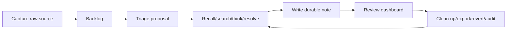

# feat: Daily Human Workflows

## Summary

Assemble Hypermnesic's existing human-surface primitives into a coherent daily loop: capture now,
triage later, recall during work, expand context, write durable notes, review generated surfaces
and recent changes, then clean up/export/revert through the memory control center.

---

## Problem Frame

The repo already has capture, triage, thinking-mode, salience, navigation surfaces, and Obsidian
companion direction. This sprint turns those ingredients into named workflows and recipes so a
daily operator experiences a product loop rather than isolated tools.

---

## Assumptions

*This plan was authored without synchronous user confirmation. The items below are planning-time
inferences that should be reviewed before implementation proceeds.*

- The first daily workflow surface can be CLI/docs/generated-markdown focused, with Obsidian
  integration staying read-only.
- Existing capture/triage/nav/salience modules should be extended before inventing a new workflow
  engine.
- Cleanup actions should link to the memory control center from sprint unit 3 rather than duplicate
  destructive behavior.

---

## Requirements

- R67. Define capture -> triage -> recall -> write -> review -> clean-up as a product workflow.
- R68. Position capture as low-friction raw-source action.
- R69. Position triage as later review-gated placement/connections/questions, not silent moves.
- R70. Teach direct search, context expansion, thinking mode, and entity resolution.
- R71. Review recent writes, generated surfaces, capture backlog, and suggested connections in a
  coherent owner-facing view or document set.
- R72. Connect clean-up to git-backed delete, revert, export, and audit behavior.
- R73. Align Obsidian companion docs with the daily loop while preserving read-only boundary.
- R74. Include degraded/offline behavior.
- R75. Add recipes for common jobs.

**Origin actors:** A2 daily operator, A3 remote client user, A4 agent client.
**Origin flows:** F7 daily capture, triage, recall, and review.
**Origin acceptance examples:** AE7 capture now, triage later.

---

## Scope Boundaries

### Deferred for later

- Full graphical web app.
- Automatic LLM consolidation of all raw memories.
- Hosted/cloud Hypermnesic.

### Outside this product's identity

- Becoming a note-taking app that competes with Obsidian.
- Replacing Honcho or behavioural memory.
- Becoming an agent runtime.

### Deferred to Follow-Up Work

- Launch readiness smoke checks are planned in `docs/plans/2026-06-04-008-feat-product-proof-launch-readiness-plan.md`.

---

## Context & Research

### Relevant Code and Patterns

- `src/hypermnesic/capture.py` already implements raw capture and deferred triage proposal.
- `src/hypermnesic/think.py`, `src/hypermnesic/expand.py`, and `src/hypermnesic/graph.py` support
  recall expansion and entity context.
- `src/hypermnesic/nav_surface.py` and `src/hypermnesic/salience.py` produce generated dashboards.
- `docs/brainstorms/2026-06-02-obsidian-companion-first-class-ui-requirements.md` scopes the
  read-only companion polish.
- `tests/test_capture.py`, `tests/test_think.py`, `tests/test_nav_surface.py`, and
  `tests/test_salience.py` cover the ingredients.

### Product Design Lens

- The workflow should have one clear owner-facing loop with recipes, not a list of capabilities.
- Daily surfaces should be scan-friendly and operational, not marketing-style.

### External References

- LangGraph memory concepts help explain retrieval/update strategy and short-term versus long-term
  boundaries: https://langchain-ai.github.io/langgraph/concepts/memory

---

## Key Technical Decisions

- Introduce a daily workflow guide and, where useful, a generated owner dashboard that composes
  existing capture backlog, recent writes, salience digest, and nav surface links.
- Keep triage review-gated and non-mutating with respect to raw capture placement.
- Route cleanup to memory control commands from sprint unit 3.
- Preserve Obsidian companion read-only boundary and avoid turning Hypermnesic into a note-taking
  app.

---

## Open Questions

### Resolved During Planning

- Should triage silently move captures into final folders? No. R69 and existing `capture.py`
  require suggestions without silent moves.
- Should daily workflow require embeddings? No. R74 requires degraded/offline behavior.

### Deferred to Implementation

- Exact command shape for generating a daily review surface.
- Whether the owner-facing review surface should be one generated markdown document or a small set
  of linked generated documents.

---

## High-Level Technical Design

> *This illustrates the intended approach and is directional guidance for review, not
> implementation specification. The implementing agent should treat it as context, not code to
> reproduce.*

---

## Implementation Units

### U1. Daily Workflow Guide and Recipes

**Goal:** Document the complete daily loop and common jobs in product language.

**Requirements:** R67, R68, R69, R70, R72, R74, R75.

**Dependencies:** docs/plans/2026-06-04-006-feat-memory-taxonomy-agent-guidance-plan.md.

**Files:**
- Create: `docs/guides/daily-workflows.md`
- Modify: `README.md`
- Modify: `docs/guides/getting-started.md`
- Modify: `docs/README.md`
- Modify: `CHANGELOG.md`

**Approach:**
- Write recipes for remembering a project decision, finding prior context, connecting a client,
  revoking a client, forgetting a bad memory, recovering from stale index, and capture now/triage
  later.
- Link each recipe to CLI/reference commands and memory taxonomy/control docs.
- Include degraded/offline notes.

**Test scenarios:**
- Test expectation: none for prose, but run public-surface secret/host scan.

**Verification:**
- A daily operator can follow a workflow without discovering commands from source.

### U2. Capture Backlog and Triage View

**Goal:** Make raw captures and triage proposals visible as a workflow stage.

**Requirements:** R68, R69, R71, R74.

**Dependencies:** U1.

**Files:**
- Modify: `src/hypermnesic/capture.py`
- Modify: `src/hypermnesic/cli.py`
- Test: `tests/test_capture.py`

**Approach:**
- Add a list/backlog view for captured raw sources under the existing `sources/` convention.
- Surface triage status when proposals exist, without moving raw files.
- Include degraded/offline behavior when `think` cannot use dense embeddings.

**Execution note:** Add tests around "not moved/mutated" before changing triage/backlog behavior.

**Patterns to follow:**
- Existing `capture.capture` and `capture.triage`.
- `tests/test_capture.py` no-auto-move assertions.

**Test scenarios:**
- Covers AE7. Happy path: capture creates a raw source, backlog lists it, triage proposal links to
  placement/connections/questions.
- Edge case: capture with no close neighbours still gets an "undetermined" triage suggestion.
- Error path: missing captured path returns not found without creating a proposal.
- Integration: raw capture bytes are unchanged after triage.

**Verification:**
- The user can capture now and return later to review placement suggestions.

### U3. Recall Mode Education in CLI/Docs

**Goal:** Teach and expose the differences between search, build_context/expand, think, and
resolve for daily use.

**Requirements:** R70, R75.

**Dependencies:** U1.

**Files:**
- Modify: `docs/guides/daily-workflows.md`
- Modify: `docs/reference/cli.md`
- Modify: `docs/reference/mcp-tools.md`
- Modify: `plugin/plugins/hypermnesic/skills/hypermnesic-memory/SKILL.md`
- Test: `tests/test_plugin.py`

**Approach:**
- Add short recipes and decision guidance for each recall mode.
- Ensure agent skill mirrors the same vocabulary.

**Test scenarios:**
- Happy path: skill/docs name when to use search, build_context, think, and resolve.
- Edge case: resolve guidance says ambiguous/missing returns null and agents should not guess.

**Verification:**
- Humans and agents choose the right recall primitive for the job.

### U4. Owner Review Surface

**Goal:** Create a coherent owner-facing review document or command that links recent writes,
generated surfaces, capture backlog, and suggested connections.

**Requirements:** R71, R74.

**Dependencies:** U2, U3.

**Files:**
- Create: `src/hypermnesic/daily_review.py`
- Modify: `src/hypermnesic/nav_surface.py`
- Modify: `src/hypermnesic/cli.py`
- Test: `tests/test_daily_review.py`
- Test: `tests/test_nav_surface.py`

**Approach:**
- Compose existing audit log, capture backlog, salience digest, nav surface, and connection
  suggestions into a generated markdown surface.
- Demarcate generated content and avoid mutating source notes.
- Use review-gated proposal patterns where the surface writes into the vault.

**Patterns to follow:**
- `nav_surface.nav_proposal`.
- `salience.digest_proposal`.
- `generated.render`.

**Test scenarios:**
- Happy path: review surface includes recent writes, capture backlog, and links to generated
  surfaces when present.
- Edge case: no captures/recent writes renders an empty-state section rather than failing.
- Error path: missing index or graph reports degraded/partial review state.
- Integration: generated review proposal is idempotent when content is unchanged.

**Verification:**
- Daily operator has one scan-friendly entry point for review.

### U5. Cleanup Workflow Integration

**Goal:** Connect daily cleanup to memory control commands without duplicating destructive logic.

**Requirements:** R72, R75.

**Dependencies:** U4 and `docs/plans/2026-06-04-003-feat-memory-control-center-plan.md`.

**Files:**
- Modify: `docs/guides/daily-workflows.md`
- Modify: `docs/guides/memory-control.md`
- Modify: `src/hypermnesic/daily_review.py`
- Test: `tests/test_daily_review.py`

**Approach:**
- Link cleanup actions in daily review to inspect/export/forget/revert/audit flows from the memory
  control center.
- Do not add a second delete implementation.

**Test scenarios:**
- Happy path: daily review includes cleanup next actions referencing memory-control commands.
- Edge case: if memory-control commands are unavailable in docs/tests, review surface marks cleanup
  as follow-up rather than pretending it can apply destructive changes.

**Verification:**
- Cleanup is part of the loop without creating a parallel destructive path.

### U6. Obsidian Companion Alignment

**Goal:** Align Obsidian companion docs with the daily loop while preserving read-only boundaries.

**Requirements:** R73.

**Dependencies:** U1, U4.

**Files:**
- Modify: `docs/brainstorms/2026-06-02-obsidian-companion-first-class-ui-requirements.md`
- Modify: `obsidian-plugin/README.md`
- Modify: `docs/guides/daily-workflows.md`

**Approach:**
- Document how Obsidian is a read/review surface for capture backlog, generated dashboards, and
  memory navigation.
- Preserve companion write boundaries; write/cleanup stays in CLI/MCP git-first paths unless a
  future companion plan explicitly changes it.

**Test scenarios:**
- Test expectation: none for prose, but run public-surface secret/host scan.

**Verification:**
- Obsidian docs reinforce the daily loop without expanding write scope.

---

## System-Wide Impact

- **Interaction graph:** Capture, triage, think/search/resolve, generated dashboards, memory
  control, and Obsidian docs become one workflow.
- **Error propagation:** Degraded/offline states should appear as partial workflow capability, not
  total failure.
- **State lifecycle risks:** Generated review surfaces must be demarcated and review-gated.
- **API surface parity:** CLI/docs/plugin skill should use matching recall-mode vocabulary.
- **Unchanged invariants:** Raw capture is preserved; triage does not silently move; Obsidian
  companion remains read-only.

---

## Risks & Dependencies

| Risk | Mitigation |
|------|------------|
| Workflow surface duplicates existing tools poorly | Compose existing primitives and link rather than reimplement |
| Daily review becomes cluttered | Keep sections scan-friendly with empty states and links |
| Triage starts silently organizing user notes | Preserve no-auto-move tests |
| Obsidian docs imply write support | Explicitly preserve read-only boundary |

---

## Documentation / Operational Notes

- This sprint should update docs and changelog in the same PR because it changes user-visible
  workflows.
- If implementation touches Obsidian companion files, confirm any separate licensing/repo boundary
  before moving code.

---

## First-Class Validation Gates

This sprint is not complete until every gate below has passing evidence captured in the PR
description, Linear issue comment when available, and final implementation handoff. U1-U6 product
proofs must remain green.

- **Evidence matrix gate:** the final handoff must include a requirement-by-requirement evidence
  matrix for R67-R75 and AE7. Each row must name the automated test, workflow transcript, generated
  review artifact, recipe/docs path, Obsidian-boundary check, or bounded manual smoke step that
  proves the requirement; "covered by implementation" is not acceptable evidence.
- **Blocking standard:** these gates are release-blocking, not advisory. If any row in the evidence
  matrix is missing, flaky, ambiguous, or dependent on private operator infrastructure, the sprint
  cannot be marked complete until the plan or implementation is corrected.
- **Contract preservation gate:** every CLI command, JSON field, documented flow, security invariant,
  and public-facing artifact created or changed by this sprint must have an explicit regression
  assertion. Later sprints must rerun these assertions or document an intentional, reviewed contract
  change with matching docs and changelog updates.
- **Proof shape gate:** validation must include the full capture -> triage -> recall -> write ->
  review -> cleanup loop, a raw-source preservation check, a protected/refused destination check, a
  degraded/offline behavior check, an Obsidian read-only boundary check, and a docs/current-truth
  consistency check.
- **AE7 daily-loop gate:** a reviewer can capture raw text during work, return later, see a triage
  path, receive suggested placement/links/questions, and confirm that raw source was not silently
  moved or deleted.
- **Workflow completeness gate:** the documented and surfaced loop must cover capture, triage,
  recall, write, owner review, cleanup, and Obsidian companion read-only alignment. No step may be
  an unexplained jump to implementation internals.
- **Review-gated mutation gate:** any workflow step that writes, moves, deletes, or rewrites memory
  must use preview/review semantics and the git-first write path. Tests must prove raw capture
  preservation and refusal on protected destinations.
- **Human ergonomics gate:** command names, output labels, and docs must use the same product verbs
  as the control center. The user should not need to know index internals, sqlite tables, or MCP
  transport details to complete the daily loop.
- **Obsidian alignment gate:** companion guidance must remain read-only unless a separate approved
  plan changes that boundary. Docs must not imply Obsidian can bypass server-side consent or write
  guards.
- **Cleanup gate:** cleanup must distinguish archive, forget/delete, revert, and triage completion.
  Tests or checklist evidence must show the user can verify the post-cleanup memory state.
- **Cumulative product gate:** U1-U7 must compose into a daily operator walkthrough from local proof
  through capture/triage/recall/write/review/cleanup, including diagnosis and trust controls.
- **Regression gate:** run and record exact results for targeted capture/triage/control docs or CLI
  tests, `git diff --check`, `uv sync --extra dev`, `uv run ruff check .`,
  `uv run python scripts/check_version_consistency.py`, `uv run pytest`,
  `uv run python scripts/license_scan.py`, `uv run python scripts/preflight_public_scan.py`, and a
  targeted changed-file scan for secrets, private hosts/IPs, token-looking strings, and raw private
  note bodies. Targeted tests cannot substitute for the full gate set.

## Sources & References

- Origin document: [docs/brainstorms/2026-06-04-first-class-product-requirements.md](../brainstorms/2026-06-04-first-class-product-requirements.md)
- Product review: [docs/reports/2026-06-04-hypermnesic-product-design-review.md](../reports/2026-06-04-hypermnesic-product-design-review.md)
- Companion requirements: [docs/brainstorms/2026-06-02-obsidian-companion-first-class-ui-requirements.md](../brainstorms/2026-06-02-obsidian-companion-first-class-ui-requirements.md)
- Related code: `src/hypermnesic/capture.py`, `src/hypermnesic/nav_surface.py`,
  `src/hypermnesic/salience.py`, `src/hypermnesic/think.py`
- Related tests: `tests/test_capture.py`, `tests/test_nav_surface.py`, `tests/test_salience.py`,
  `tests/test_think.py`
- External docs: https://langchain-ai.github.io/langgraph/concepts/memory
