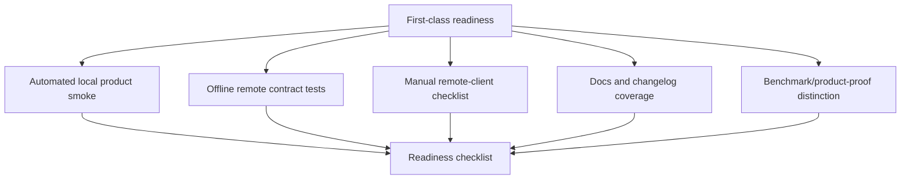

# feat: Product Proof Launch Readiness

## Summary

Create the proof layer that justifies calling Hypermnesic first-class: local product smoke,
remote-client smoke checklist, consent/read/write/refusal/revoke evidence, recall-after-change
evidence, docs coverage, launch readiness checklist, and clear separation between benchmark
quality and product operability.

---

## Problem Frame

Benchmarks show retrieval quality, but first-class product readiness also needs proof that a user
can operate the product: capture, retrieve, write, inspect, forget/revert, connect clients,
authorize/revoke, and understand docs without seeing secrets or operator-specific infrastructure.

---

## Assumptions

*This plan was authored without synchronous user confirmation. The items below are planning-time
inferences that should be reviewed before implementation proceeds.*

- Local product proof should be automated in CI where deterministic and offline.
- Remote OAuth/client proof should be partly automated through mocked/offline tests and partly a
  documented manual smoke checklist, because real browser/client flows depend on external apps.
- First-class readiness should block on docs and security scans, not only pytest.

---

## Requirements

- R76. Ship a product smoke path proving capture, retrieve, write, inspect, delete/forget or
  revert, and recall-after-change on a small fixture vault.
- R77. Ship a remote-client smoke checklist for OAuth discovery, read access, write refusal without
  scope, write success with scope, and revocation when supported.
- R78. Distinguish benchmark quality from product operability.
- R79. Surface benchmark results and product proof flows without overstatement.
- R80. Add a first-class readiness checklist.
- R81. Update `CHANGELOG.md` under `[Unreleased]` as user-visible behavior lands.
- R82. Docs index links to review report, requirements, getting-started, memory control guide,
  memory taxonomy, and relevant reference docs.
- R83. No first-class claim ships until automated checks, local smoke, and docs updates pass.

**Origin actors:** A1 new self-hosting user, A2 daily operator, A3 remote client user, A5 memory auditor, A6 planner/implementer agent.
**Origin flows:** F1 local proof, F2 setup diagnosis, F3 client authorization, F4 memory control, F5 hook observability, F6 taxonomy decision, F7 daily loop.
**Origin acceptance examples:** AE8 first-class readiness proof.

---

## Scope Boundaries

### Deferred for later

- Hosted/cloud Hypermnesic.
- Enterprise compliance programs and organization-wide audit dashboards.
- Full graphical web app.

### Outside this product's identity

- Becoming a hosted memory API.
- Becoming an agent runtime.
- Hiding provenance behind opaque summaries.

### Deferred to Follow-Up Work

- Actual public license flip remains governed by `docs/launch/` and is not part of this product
  readiness plan unless the user explicitly asks for launch execution.

---

## Context & Research

### Relevant Code and Patterns

- `tests/test_portability_probe.py` already proves portable local behavior.
- `tests/test_auth_cloud.py`, `tests/test_install.py`, and `tests/test_mcp_server.py` cover
  offline OAuth/setup/server contracts.
- `scripts/preflight_public_scan.py`, `scripts/check_version_consistency.py`, and
  `scripts/license_scan.py` are existing gates.
- `harness/BENCHMARKS.md` and `README.md` contain benchmark claims.
- `docs/launch/` contains public flip staging and launch checklist context.

### Product Design Lens

- Product proof should be a user story with evidence, not an internal checklist only.
- Readiness copy must avoid overstating benchmarks as product operability.

### External References

- OpenAI memory controls set user expectations around inspect/delete/disable:
  https://help.openai.com/en/articles/8590148-memory-in-chatgpt-remembering-what-you-chat-about
- Zep/Mem0 quickstarts show that add/search/get proof is part of memory product confidence:
  https://help.getzep.com/v2/memory and https://docs.mem0.ai/core-concepts/memory-operations

---

## Key Technical Decisions

- Split proof into automated local smoke, offline remote-contract tests, and manual remote-client
  checklist.
- Make product proof use disposable fixture vaults and placeholder hosts only.
- Add readiness checklist as a durable docs artifact that future releases can run before claiming
  first-class status.
- Keep benchmark claims adjacent to, but distinct from, product proof claims.

---

## Open Questions

### Resolved During Planning

- Should all remote-client proof run in CI? No. Real ChatGPT/Claude/client browser flows depend on
  external state, so CI should cover contracts and docs should cover manual smoke.
- Should LongMemEval be treated as first-class product proof? No. It proves retrieval quality, not
  end-to-end operability.

### Deferred to Implementation

- Exact boundary between automated smoke command and manual checklist after prior sprint units
  land.
- Whether to add a single `hypermnesic smoke product` command or keep smoke as a script.

---

## High-Level Technical Design

> *This illustrates the intended approach and is directional guidance for review, not
> implementation specification. The implementing agent should treat it as context, not code to
> reproduce.*

---

## Implementation Units

### U1. Local Product Smoke

**Goal:** Automate a disposable fixture-vault smoke path that proves the core product loop.

**Requirements:** R76, R83.

**Dependencies:** all prior sprint-unit plans.

**Files:**
- Create: `scripts/product_smoke.py`
- Modify: `tests/test_smoke.py`
- Test: `tests/test_smoke.py`

**Approach:**
- Use a disposable git-backed fixture vault.
- Prove capture, retrieve, safe write/apply where appropriate, inspect through memory control,
  forget/delete or revert, and recall-after-change.
- Avoid real network, real hosts, and real private data.

**Execution note:** Start with failing smoke test expectations after prior sprint units are in
place.

**Patterns to follow:**
- `tests/test_portability_probe.py`.
- `tests/conftest.py` fixture repos.

**Test scenarios:**
- Covers AE8. Happy path: local smoke passes capture -> retrieve -> write -> inspect -> forget or
  revert -> recall-after-change.
- Edge case: lexical-only mode still passes local smoke with degraded state called out.
- Error path: if a smoke stage fails, output identifies the failing stage and no later stage is
  falsely marked passed.
- Security: smoke output contains no absolute private paths, hostnames, or secrets.

**Verification:**
- CI can prove the local first-class product loop on a small fixture.

### U2. Remote-Contract Smoke Coverage

**Goal:** Cover OAuth discovery, read/write scope behavior, and revoke contracts in offline tests.

**Requirements:** R77, R83.

**Dependencies:** `docs/plans/2026-06-04-004-feat-consent-client-trust-plan.md`.

**Files:**
- Modify: `tests/test_auth_cloud.py`
- Modify: `tests/test_mcp_server.py`
- Modify: `tests/test_install.py`
- Create: `tests/test_product_remote_smoke.py`

**Approach:**
- Use existing provider/server test seams to prove discovery metadata, read access shape, write
  refusal without scope, write success with scope, and revocation semantics.
- Keep real connector/browser testing in the manual checklist.

**Patterns to follow:**
- `_FakeSetupOps` and `_unified` helper patterns in existing tests.

**Test scenarios:**
- Covers AE8. Happy path: discovery metadata points at correct issuer/resource and read tools list.
- Happy path: read-scoped client can call read tools and cannot write.
- Happy path: write-scoped client can call `commit_note` and still hits write guard refusals.
- Happy path: revocation invalidates access/refresh grant.
- Error path: invalid/missing auth state returns meaningful refusal.

**Verification:**
- Remote contracts are covered without hitting external services.

### U3. Manual Remote-Client Smoke Checklist

**Goal:** Provide the operator-facing checklist for real ChatGPT, Claude, Claude Code, Codex, and
Obsidian connections.

**Requirements:** R77, R79, R80, R83.

**Dependencies:** U2.

**Files:**
- Create: `docs/guides/remote-client-smoke-checklist.md`
- Modify: `docs/guides/getting-started.md`
- Modify: `docs/README.md`

**Approach:**
- Checklist covers OAuth discovery, first read authorization, write refusal without write scope,
  write success after write approval, revoke when supported, and reconnect behavior.
- Use placeholder hostnames and no real tokens.
- Distinguish manual evidence from automated gate evidence.

**Test scenarios:**
- Test expectation: none for prose, but run public-surface secret/host scan.

**Verification:**
- A reviewer can run the real remote-client smoke without reading source.

### U4. Readiness Checklist

**Goal:** Create a durable first-class readiness checklist that gates future claims.

**Requirements:** R80, R81, R82, R83.

**Dependencies:** U1, U2, U3.

**Files:**
- Create: `docs/launch/first-class-product-readiness-checklist.md`
- Modify: `docs/README.md`
- Modify: `CHANGELOG.md`

**Approach:**
- Include required automated gates, local product smoke, remote-client smoke checklist, docs
  coverage, memory taxonomy/control docs, consent/client trust docs, plugin status docs, and
  public-surface scan.
- Make the checklist explicit that first-class claim is blocked until evidence is current.

**Test scenarios:**
- Test expectation: none for prose, but run public-surface secret/host scan.

**Verification:**
- Future releases have an authoritative checklist for first-class product claims.

### U5. Benchmark and Product Proof Copy

**Goal:** Keep benchmark quality claims and product operability proof distinct.

**Requirements:** R78, R79.

**Dependencies:** U1, U4.

**Files:**
- Modify: `README.md`
- Modify: `harness/BENCHMARKS.md`
- Modify: `docs/guides/getting-started.md`
- Modify: `docs/launch/first-class-product-readiness-checklist.md`

**Approach:**
- Update copy so LongMemEval claims are framed as retrieval quality, while smoke/checklist proof is
  framed as operability and control.
- Avoid overclaiming benchmark rows as evidence of setup/control readiness.

**Test scenarios:**
- Test expectation: none for prose, but review docs for overclaiming and run public-surface scan.

**Verification:**
- Readers understand what each evidence source proves.

### U6. Docs Index and Cross-Link Completion

**Goal:** Ensure the docs index links all first-class product artifacts.

**Requirements:** R81, R82, R83.

**Dependencies:** U1-U5.

**Files:**
- Modify: `docs/README.md`
- Modify: `README.md`
- Modify: `CHANGELOG.md`

**Approach:**
- Link review report, requirements, getting-started, memory control guide, memory taxonomy, remote
  smoke checklist, and reference docs.
- Keep process-history versus current-truth distinction intact.

**Test scenarios:**
- Test expectation: none for prose, but run public-surface secret/host scan and any docs link check
  available.

**Verification:**
- Docs navigation supports first-class readiness review.

---

## System-Wide Impact

- **Interaction graph:** Smoke paths exercise CLI, memory control, auth provider/server contracts,
  docs, and launch readiness.
- **Error propagation:** Smoke failures must identify the failing stage and not hide partial
  success.
- **State lifecycle risks:** Fixture vaults must be disposable and not depend on operator state.
- **API surface parity:** Product proof should cover local CLI and remote MCP contracts.
- **Unchanged invariants:** No secrets, no real operator hosts, no production remote side effects
  in CI.

---

## Risks & Dependencies

| Risk | Mitigation |
|------|------------|
| Smoke becomes flaky by depending on real external clients | Keep CI smoke local/offline and make real clients manual checklist |
| Product proof overstates benchmark quality | Separate benchmark and operability sections |
| Fixture data leaks operator context | Use generated disposable data and public scan |
| Readiness checklist drifts | Link it from docs index and require updates when user-visible behavior changes |

---

## Documentation / Operational Notes

- Implementation must update `CHANGELOG.md` and docs index.
- Run at least public scan, targeted smoke tests, and full gate set before claiming first-class
  readiness in a later execution session.

---

## First-Class Validation Gates

This sprint is not complete until every gate below has passing evidence captured in the PR
description, Linear issue comment when available, and final implementation handoff. This is the
release-blocking proof for the whole U1-U8 sequence.

- **AE8 end-to-end gate:** the product proof checklist must show passing evidence for local value,
  setup diagnosis, remote connection, consent approval/rejection, write refusal/success, memory
  inspection, export, removal/forget, revert or recovery, hook diagnosis, taxonomy routing, daily
  workflow, docs coverage, and launch readiness.
- **Automated smoke gate:** CI or a documented local command must run a deterministic local product
  smoke over a fixture vault that exercises capture/index, retrieve with source path, dry-run write,
  doctor/status JSON, memory inspection/control, and degraded retrieval messaging.
- **Remote-contract gate:** remote-client behavior must be covered by automated contract tests where
  local infrastructure can simulate it. Manual remote-client evidence is allowed only for true
  external-client UX checks and must be separately labeled.
- **First-class checklist gate:** `docs/launch/first-class-product-readiness-checklist.md` must be
  created and must require current evidence, command output, responsible reviewer, date, and pass/fail
  state for every U1-U8 product outcome.
- **Claim-control gate:** README, launch docs, changelog, and release notes must not claim
  first-class readiness unless the checklist is current and all blocking automated gates pass.
- **Security/public-surface gate:** public scan, targeted secret/operator-host scans, license scan,
  auth/write-guard tests, and docs scans must pass over all changed files and fixtures.
- **Benchmark-positioning gate:** benchmark docs must clearly separate retrieval-quality evidence
  from product-readiness evidence. LongMemEval or similar benchmark results cannot substitute for
  product smoke, consent, memory control, or docs proof.
- **Full-suite release gate:** run the full `AGENTS.md` gate set: `uv sync --extra dev`,
  `uv run ruff check .`, `uv run python scripts/check_version_consistency.py`, `uv run pytest`,
  `uv run python scripts/license_scan.py`, `uv run python scripts/preflight_public_scan.py`, plus
  `git diff --check` and targeted secret scans.

## Sources & References

- Origin document: [docs/brainstorms/2026-06-04-first-class-product-requirements.md](../brainstorms/2026-06-04-first-class-product-requirements.md)
- Product review: [docs/reports/2026-06-04-hypermnesic-product-design-review.md](../reports/2026-06-04-hypermnesic-product-design-review.md)
- Related docs: `harness/BENCHMARKS.md`, `docs/launch/`, `docs/README.md`
- Related tests: `tests/test_smoke.py`, `tests/test_portability_probe.py`,
  `tests/test_auth_cloud.py`, `tests/test_mcp_server.py`, `tests/test_install.py`
- External docs: https://help.openai.com/en/articles/8590148-memory-in-chatgpt-remembering-what-you-chat-about,
  https://help.getzep.com/v2/memory,
  https://docs.mem0.ai/core-concepts/memory-operations
