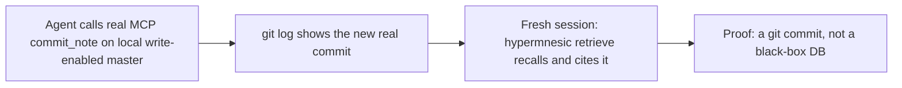
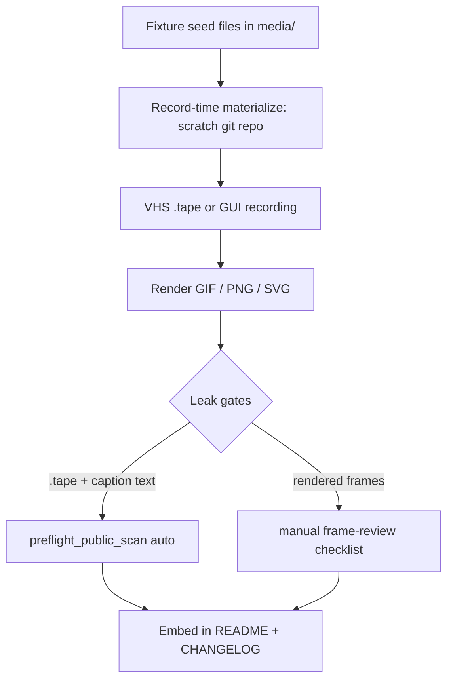

# feat: Launch demo assets for hypermnesic engine + companion

## Summary

Produce a receipts-first launch-asset set for both already-public repos. Ship a shared
production foundation plus the complete engine set first (hero "receipt loop" GIF,
destructive-recovery GIF, benchmark chart, Claude Code client shot, per-community
carousels, README embeds), then the companion set for the Obsidian audience. Assets are
scripted and reproducible where the medium allows, run against committed disposable
fixture vaults, and pass a two-gate leak check before publish.

## Problem Frame

Both repos are public but unpromoted, launching into a crowded, skeptical "AI memory" / MCP
space where the first reaction to any memory tool is "is this just a vector DB with a
wrapper, or is the data actually mine?" hypermnesic has one answer no competitor can show:
the memory is plain markdown in git, so its history is a real `git log`. The campaign
succeeds only if that proof leads — before the reader finishes the tagline — and fails if
it is buried behind an architecture diagram, a chatbot "I remember you" demo, or a long
narrated video. (See origin: `docs/brainstorms/2026-06-15-launch-demo-assets-requirements.md`.)

Research surfaced three constraints that shape the build: the `local-proof` CLI write is
dry-run, so the hero's *real* commit must go through the MCP `commit_note` tool; `docs/launch/`
is excluded from the leak scanner, so assets need a home that stays in scope; and the
license gate means the benchmark chart ships as a committed SVG with no new dependency.

---

## Key Technical Decisions

- **The hero's real commit goes through the MCP `commit_note` tool, not the CLI.** The
  `commit-note` CLI is a dry-run preview (`src/hypermnesic/local_proof.py`) and
  `scripts/product_smoke.py` also writes `dry_run=True` — neither produces a real commit.
  Only the MCP `commit_note` tool does. The hero therefore runs a **loopback** write-enabled
  master (`hypermnesic serve --enable-write 127.0.0.1`), which needs no auth — localhost binds
  are exempt from the write⇒auth invariant (`src/hypermnesic/mcp_server.py`, `_LOCALHOST_BINDS`)
  — so no OAuth issuer URL or consent screen can appear on screen. A tiny loopback MCP-client
  helper drives the write; the MCP SDK's `streamablehttp_client` is already a transitive
  dependency, so no license-gate risk. Fallback: if the helper proves brittle, fold the hero
  into the Claude Code client shot (U7) — but this **forfeits R10 (scripted re-recordability)
  for the hero**, since a GUI recording is not a `.tape`. See U4 and the Risks section.
- **Assets live in a new top-level `media/`, never `docs/launch/`.** `docs/launch/` is
  unconditionally excluded from `scripts/preflight_public_scan.py`, so assets placed there
  would bypass the leak gate the brainstorm requires. `media/` is a non-`docs/` path and is
  scanned by default. `.tape` sources and captions sit beside their rendered output.
- **Fixture vaults ship as seed files plus a record-time materialize step, not nested git
  repos.** A nested `.git` inside the repo is awkward; instead the seed lives as plain files
  and the recording materializes it into a scratch git repo at record time, mirroring
  `local-proof`'s deterministic committer identity (`local-proof@example.invalid`).
- **The benchmark chart is a committed SVG with no new dependency.** A plotting library would
  risk the copyleft license gate (`scripts/license_scan.py`); the chart is hand-authored or
  one-off-rendered to a committed SVG. Numbers are transcribed from `harness/BENCHMARKS.md`,
  the single source of truth, and must stay consistent with it.
- **Leak prevention is two-gate.** `scripts/preflight_public_scan.py` scans tracked `.tape`
  and caption text under `media/` automatically (locked by a regression test); rendered
  GIF/PNG frames cannot be machine-scanned (regex-over-bytes can't read frames), so a manual
  frame-review checklist is the mandatory second gate for binaries.
- **Companion recordings are Obsidian-GUI, not VHS.** They are partly manual and less
  reproducible than terminal tapes; the setup is documented instead of fully scripted.
  Companion marketplace deliverables (README + screenshots) target the separate
  `hypermnesic-companion` repo.

---

## High-Level Technical Design

The engine hero proves the git-native claim in one loop:



Every asset flows through the same production-and-gate pipeline. The two leak gates are not
interchangeable — text and frames fail differently:



---

## Output Structure

```text
media/
  README.md                         # convention: placeholders only, what is scanned
  engine/
    demo-vault-seed/                # dev-flavored seed files (no nested .git)
    materialize-demo-vault          # record-time helper: seed -> scratch git repo (U2)
    hero-receipt-loop.tape          # scripted terminal hero
    hero-receipt-loop.gif
    index-recovery.tape
    index-recovery.gif
    benchmark-longmemeval.svg
    claude-code-client.gif          # GUI screen recording
    connector-montage/              # placeholder-URL stills
    carousel-selfhosted/            # 3-5 stills
    carousel-localllama/
    carousel-hn/
  companion/
    demo-vault-seed/                # PKM-flavored seed files
    RECORDING.md                    # Obsidian + companion recording setup
    companion-hero.gif
    read-only-refusal.gif
    obsidianmd-still.png
```

The tree is a scope declaration; per-unit `**Files:**` are authoritative. Companion
marketplace screenshots land in the `hypermnesic-companion` repo (U12), not here.

---

## Requirements Traceability

| Origin requirement | Implementation unit(s) |
|---|---|
| R1, R2, R12, AE1 (hero receipt loop, above-fold) | U2, U4, U9 |
| R3, AE3 (benchmark chart, judge-axis labeled) | U6, U9 |
| R4, AE4 (destructive recovery) | U2, U5 |
| R5 (Claude Code client + connector montage) | U7 |
| R6 (per-community carousels) | U8 |
| R7 (companion live-note hero) | U10, U11 |
| R8, AE5 (companion read-only proof on screen) | U11 |
| R9 (marketplace-conforming companion assets) | U12 |
| R10 (scripted, re-recordable) | U1 (convention), U4, U5 (engine `.tape` recordings); companion GUI recordings (U10, U11) exempt by medium — RECORDING.md (U10) is the reproducibility substitute |
| R11, AE2 (disposable fixture vaults, placeholders) | U1, U2, U10 |
| R13, AE2 (pre-publish leak scan) | U1, U3 |

---

## Implementation Units

### Phase A — Shared production foundation

### U1. Establish the committed assets home and conventions
- **Goal:** Create `media/` as the home for rendered assets, `.tape` sources, and captions, kept inside the leak-scan scope, and document the placeholder/scan convention.
- **Requirements:** R10, R11, R13.
- **Dependencies:** none.
- **Files:** `media/README.md`, `media/engine/` and `media/companion/` (directory scaffolding).
- **Approach:** Top-level `media/` (not `docs/launch/`, which the scanner excludes). The README states: captions and `.tape` files are placeholder-only and machine-scanned; binaries get manual frame review; `<your-host>.ts.net`, `/path/to/your/vault`, and redacted tokens are the only allowed stand-ins.
- **Patterns to follow:** mirror the placeholder vocabulary already used in `docs/guides/remote-client-smoke-checklist.md`.
- **Test expectation:** none — directory and convention scaffolding, no behavior.
- **Verification:** a tracked text file under `media/` is included in `scripts/preflight_public_scan.py` scope (confirmed by U3's test); `media/README.md` renders.

### U2. Author the engine demo fixture vault
- **Goal:** A small, committed, dev-flavored seed vault that the engine recordings materialize and drive — multi-note, deterministic, placeholders only.
- **Requirements:** R1, R4, R11.
- **Dependencies:** U1.
- **Files:** `media/engine/demo-vault-seed/` (e.g., `projects/`, `decisions/`, `people/` notes with frontmatter and `[[wikilinks]]`), `media/engine/materialize-demo-vault` (record-time helper that copies seed → scratch dir, `git init`, commits initial history).
- **Approach:** Content is dev-flavored (a couple of project notes, a decision note, a person note) — enough to show source-grounded recall and wikilink resolution. The materialize helper sets the scratch repo's `user.email` and `user.name` explicitly to a fixture identity (e.g., `local-proof@example.invalid` / `hypermnesic demo`), mirroring `src/hypermnesic/local_proof.py` — it must NOT fall back to the operator's global git config, whose real name/email would otherwise appear in the `git log` the hero GIF displays. No nested `.git` in the repo.
- **Patterns to follow:** seed layout and the explicit committer-identity calls in `src/hypermnesic/local_proof.py` (`_prepare_demo`, `_ensure_sample_note`).
- **Test expectation:** none — fixture content and a deterministic helper with no product behavior.
- **Verification:** materialize produces a clean git repo whose `git log` shows the fixture identity and never the operator's real name/email; `hypermnesic init` + `hypermnesic retrieve` over it returns the expected source-grounded hit; leak scan clean on seed text.

### U3. Lock asset text into the leak scan and add a frame-review checklist
- **Goal:** Guarantee `media/` `.tape`/caption text is leak-scanned (including the macOS paths the current deny-set misses), and add the manual frame-review gate for rendered binaries that regex-over-bytes cannot inspect.
- **Requirements:** R13, AE2.
- **Dependencies:** U1.
- **Files:** `tests/test_preflight_public_scan.py` (failing test first), `scripts/preflight_public_scan.py` (extend the deny-set), `docs/guides/demo-asset-frame-review-checklist.md` (manual gate), `media/.review-log.md` (per-asset sign-off table).
- **Approach:** `media/` text is already in default scan scope; lock that with a regression test. The deny-set, however, only matches Linux `/home/<user>/` — it misses macOS `/Users/<name>/` and `/var/folders/...` scratch paths (the operator is on macOS), so extend it. The frame-review checklist enumerates what a reviewer scrubs every rendered GIF/PNG for: real endpoint URL, operator host/IP, absolute home paths, OAuth secrets/tokens, private note bodies (AE2), plus GUI-recording leak surfaces — a shell prompt showing real username/hostname, the Claude Code account badge/avatar, window-title bars with real paths, and Obsidian vault names. Recording discipline (sanitized `PS1='demo$ '`, a clean profile or cropped chrome) is documented in the engine and companion `RECORDING.md`. Each published asset gets a row in `media/.review-log.md` (asset, reviewer, date, pass/fail); optionally OCR each GIF (`tesseract`) and grep the output against the deny-set, recording the result.
- **Execution note:** Test-first — write the failing scan test (a planted macOS path / secret in a synthetic `tmp_path` `.tape` fixture, NOT a committed `media/` file) before touching `scripts/preflight_public_scan.py`. This script is a security gate; changes are CODEOWNERS-sensitive.
- **Patterns to follow:** existing synthetic-fixture assertions in `tests/test_preflight_public_scan.py` (`scan_text`/`in_scope`); deny-set in `scripts/preflight_public_scan.py`.
- **Test scenarios:**
  - Covers AE2. A synthetic `.tape` fixture containing a fake `sk-...` key, an operator host, a `/home/<user>/` path, OR a `/Users/<name>/` path is flagged by the scan.
  - A `/var/folders/...` scratch path in a synthetic `.tape` fixture is flagged.
  - A synthetic caption `.md` containing a planted JWT is flagged.
  - A synthetic `.tape` with only placeholders (`<your-host>.ts.net`, `/path/to/your/vault`) passes.
  - Regression: `docs/launch/` stays excluded and the durable `docs/` allowlist is unchanged.
- **Verification:** `uv run pytest tests/test_preflight_public_scan.py` green (including the macOS-path cases); `uv run python scripts/preflight_public_scan.py` passes on placeholder-only assets; checklist and sign-off log published. U1 is not complete until this test is green — the `media/` scaffold is not a deliverable without the scanner lock.

### Phase B — Engine assets

### U4. Hero "receipt loop" GIF
- **Goal:** The engine hero — an agent writes a memory via the real MCP `commit_note` tool, `git log --oneline` shows the resulting real commit, and a fresh session recalls and cites it. Silent, looping, ≤20s.
- **Requirements:** R1, R2, R10, R12, AE1.
- **Dependencies:** U1, U2.
- **Files:** `media/engine/hero-receipt-loop.tape`, `media/engine/hero-receipt-loop.gif`, a small loopback MCP-client helper under `media/engine/`.
- **Approach:** The tape materializes the fixture into a scratch repo (committer identity set explicitly per U2 — never the operator's global git identity), starts a loopback write-enabled master (`hypermnesic serve --enable-write 127.0.0.1`, no auth), drives a real `commit_note` write via the helper, shows `git log --oneline` with the new commit, then runs `hypermnesic retrieve` as a "fresh session" to recall and cite the note. The first ~5 seconds must show the write producing the commit (AE1) — no architecture diagram, no chatbot "I remember." Dark VHS theme, ~100 columns, deliberate sleeps so results land before the next command.
- **Technical design (directional):** the loopback bind exempts the master from the write⇒auth invariant (`src/hypermnesic/mcp_server.py`, `_LOCALHOST_BINDS`), so no OAuth issuer/consent appears on screen. The helper uses the SDK's `streamablehttp_client` (already a transitive dependency). Per KTD1, if the helper proves brittle, fold the write into U7 and accept the R10 forfeit for the hero.
- **Patterns to follow:** `scripts/product_smoke.py`'s flow shape (capture/index → retrieve-with-source → recall) — but note its write stage is `dry_run=True`, so it is NOT a real-write template; the real write is the loopback MCP `commit_note` call.
- **Test expectation:** none — recorded asset.
- **Verification:** GIF ≤20s, <5MB, ~15fps, legible at mobile width; first 5s shows the real commit (AE1); the `git log` shows the fixture committer identity, never the operator's real name/email; `.tape` re-renders deterministically; leak scan (text) and frame-review (binary) both clean.

### U5. Destructive-recovery GIF
- **Goal:** Prove files-are-truth — delete the index, show markdown survives, rebuild from `HEAD`.
- **Requirements:** R4, R10, AE4.
- **Dependencies:** U2.
- **Files:** `media/engine/index-recovery.tape`, `media/engine/index-recovery.gif`.
- **Approach:** `ls` the vault and `.hypermnesic/`, delete the index, `ls` again to show the markdown intact (AE4), then `hypermnesic reindex`/`init` to rebuild and a `retrieve` to show recall restored. Whether this is standalone or a tail of U4 is an open question (see Open Questions).
- **Test expectation:** none — recorded asset.
- **Verification:** shows the index removed with files present and a successful rebuild (AE4); size and leak/frame gates pass.

### U6. Benchmark chart (committed SVG)
- **Goal:** A static chart of the LongMemEval result with reader and judge models labeled in-frame, on the comparable judge axis only.
- **Requirements:** R3, AE3.
- **Dependencies:** none.
- **Files:** `media/engine/benchmark-longmemeval.svg`, optional `media/engine/benchmark-data.md` (transcribed source with attribution).
- **Approach:** Hand-author or one-off-render a committed SVG (no new dependency — license gate). Show the comparable `gpt-4o-2024-08-06`-judge axis: no-memory 60.2, Zep 71.2, Mastra 84.2, hypermnesic 83.2 (GPT-4o reader) and 88.6 (GPT-4.1 reader). Label reader · judge in-frame. Either visually separate or footnote-exclude the non-comparable GPT-4.1-judge rows (OMEGA 95.4, Mastra 94.9) so the 88.6 cell can't be mistaken for a GPT-4.1-graded number (AE3). Numbers must match `harness/BENCHMARKS.md`.
- **Patterns to follow:** the attribution convention (reader · judge · dataset release) in `harness/BENCHMARKS.md`.
- **Test expectation:** none — static asset.
- **Verification:** every number matches `harness/BENCHMARKS.md`; reader and judge labeled in-frame; a reader cannot mistake it for a GPT-4.1-judged leaderboard (AE3); crisp at README width.

### U7. Multi-client shot (Claude Code hero + connector montage)
- **Goal:** Claude Code calling the live MCP read/write tools, plus a short "same endpoint, other clients" montage using plugin/connector config with a placeholder URL — no live hosted-client recording.
- **Requirements:** R5.
- **Dependencies:** U2.
- **Files:** `media/engine/claude-code-client.gif`, `media/engine/connector-montage/` (placeholder-URL stills).
- **Approach:** Screen-record Claude Code (GUI) against a loopback write-enabled master over the fixture vault; show `search`/`think` and a real `commit_note`. The recording uses a sanitized environment — no real account badge, avatar, window-title path, or hostname on screen (crop or use a clean profile per the U3 checklist). The connector montage is plugin/connector config screenshots with `<your-host>.ts.net`. This unit is the fallback home for the hero's real write if U4's terminal-tape MCP drive proves brittle (KTD1) — at the cost of R10 for the hero.
- **Test expectation:** none — recorded asset.
- **Verification:** shows real tool calls; placeholder URLs only; leak/frame gates pass.

### U8. Per-community carousels
- **Goal:** Tailored 3–5 still sets per target sub.
- **Requirements:** R6.
- **Dependencies:** U2 (required); U4 and U6 are preferred frame sources but not blockers — the r/selfhosted and r/LocalLLaMA stills can start from U2 directly.
- **Files:** `media/engine/carousel-selfhosted/`, `media/engine/carousel-localllama/`, `media/engine/carousel-hn/`.
- **Approach:** r/selfhosted — local vault files, `ls -la`, no cloud; r/LocalLLaMA — two clients sharing one endpoint; r/programming + HN — the receipt-loop stills. Reuse frames from U4/U5/U7 where available. Each carousel proves one claim.
- **Test expectation:** none — stills.
- **Verification:** each set is 3–5 stills on a single message; leak/frame gates pass.

### U9. README embeds and CHANGELOG entry
- **Goal:** Embed the hero GIF above the fold and the chart in the Benchmarks section; record the user-visible change in the changelog.
- **Requirements:** R2, R3 (plus doc-no-drift).
- **Dependencies:** U6, and whichever unit produces the hero GIF (U4, or U7 if the hero folds there per KTD1).
- **Files:** `README.md`, `CHANGELOG.md`.
- **Approach:** Hero GIF immediately after the H1/tagline (above the fold, around `README.md:9`); chart in the existing `## Benchmarks` section (`README.md:210`). Add a dated `[Unreleased]` CHANGELOG entry (the README change is user-visible). Keep chart numbers consistent with `harness/BENCHMARKS.md`.
- **Patterns to follow:** Keep a Changelog format already used in `CHANGELOG.md`; the doc-no-drift table in `AGENTS.md`.
- **Test expectation:** none — documentation.
- **Verification:** README renders the GIF above the fold and the chart in Benchmarks; markdown links valid; CHANGELOG has the `[Unreleased]` entry; all six gates green.

### Phase C — Companion assets

### U10. Companion demo vault and Obsidian recording setup
- **Goal:** A PKM-flavored committed seed vault for the companion, plus documented Obsidian recording setup (GUI, not scriptable).
- **Requirements:** R7, R11.
- **Dependencies:** U1.
- **Files:** `media/companion/demo-vault-seed/` (daily notes, people, ideas, wikilinks that produce a meaningful graph), `media/companion/RECORDING.md` (Obsidian + companion plugin setup, placeholders only).
- **Approach:** Richer note bodies than the engine vault — the graph view is the proof, so the seed must yield visible structure. Document setup because companion recordings are GUI/manual and cannot be `.tape`-scripted (the "re-recordable from a committed script" goal is weaker here).
- **Test expectation:** none — fixture content and setup doc.
- **Verification:** vault opens in Obsidian with a structured graph; leak scan clean on seed/text.

### U11. Companion hero and read-only proof
- **Goal:** Show an agent-written note appearing live in the vault with the graph updating (R7), and prove the companion cannot write (R8, AE5).
- **Requirements:** R7, R8, AE5.
- **Dependencies:** U10.
- **Files:** `media/companion/companion-hero.gif`, `media/companion/read-only-proof.gif`.
- **Approach:** Split-view — an agent (Claude Code) calls `commit_note` against the master, the note appears in the Obsidian vault and a graph edge is added. For the read-only proof: the companion is read-only by construction (its tool allowlist is `search`/`build_context`/`think` only; it has no write control to press), so stage the refusal as the server-side guard rejecting an *agent* `commit_note` to a protected path, with the companion shown alongside as the passive read surface that has no write affordance (AE5 — shown, not captioned). Do not stage a companion-initiated write; there is none to film.
- **Test expectation:** none — recorded asset.
- **Verification:** note appears live with the graph updating; the guard refusal is visible on screen and the companion exposes only read controls (AE5); leak/frame gates pass.

### U12. Companion marketplace screenshots and r/ObsidianMD still
- **Goal:** Marketplace-conforming README screenshots plus a vault+graph still for r/ObsidianMD.
- **Requirements:** R9.
- **Dependencies:** U10, U11.
- **Target repo:** `hypermnesic-companion` (separate repo) for the README and marketplace screenshots; the r/ObsidianMD still may live in engine `media/companion/`.
- **Files:** companion repo `README.md` (screenshots + demo GIF per Obsidian community-directory conventions); `media/companion/obsidianmd-still.png`.
- **Approach:** Follow Obsidian community-directory README conventions (screenshots + a demo GIF). The r/ObsidianMD still shows the vault, graph, and the agent-written note together. Prerequisite: confirm the `hypermnesic-companion` repo gates are accessible and green before starting; if not, defer U12 to a follow-up plan targeting that repo.
- **Test expectation:** none — documentation and stills.
- **Verification:** companion README has conforming screenshots; the still shows graph + note; leak/frame gates pass on any text committed to the engine repo.

---

## Scope Boundaries

**Deferred for later** (from origin)
- The ~100s narrated cinematic video (HyperFrames composition) — a second wave once the receipts set is live.
- A live ChatGPT/Claude hosted-client OAuth + tool-call recording — once the flow is clean and redaction is proven.
- A fuller companion asset set beyond marketplace minimums.

**Outside this set's identity** (from origin)
- Hermes as a public-facing client — internal tool the launch audience does not know.
- Autonomous / agent-driven "wander and capture" demos — precision is the point.
- Consumer-app-style UI mockups (memory-count badges, pastel "your memories" timelines).

**Deferred to follow-up work** (plan-local)
- Capturing the production decisions (VHS theme, file locations, leak-scan invocation) as a `docs/solutions/` learning after assets ship — the distilled "how we make demo media" entry does not exist yet.
- OCR-assisted automated frame scanning — the manual frame-review checklist (U3) is the gate for now.

---

## Risks & Dependencies

**Dependencies / prerequisites**
- VHS (charmbracelet) installed locally for terminal tapes (MIT-licensed Go binary; one-line install; a hard blocker for every `.tape` unit until installed).
- A loopback (`127.0.0.1`) write-enabled `hypermnesic` master plus a small MCP-client helper for the real `commit_note` write (no auth, no OAuth issuer — localhost bind is exempt from write⇒auth).
- Obsidian + the companion plugin (public, released) for Phase C GUI recordings.
- HyperFrames is NOT required for this plan (cinematic video is deferred).

**Risks & mitigations**
- Driving a real MCP `commit_note` from a terminal tape may be brittle → the loopback no-auth master + SDK `streamablehttp_client` helper (KTD1, U4) is the primary path; the fallback folds the write into the Claude Code shot (U7) but forfeits R10 for the hero.
- The hero `git log` could show the operator's real name/email → the materialize helper sets the scratch repo's committer identity explicitly to a fixture value, never the global git config (U2).
- GUI recordings (U7, U11) leak more than tapes — hostname, username, account badge, window-title paths, vault names → sanitized recording environment plus the U3 frame-review checklist items and a per-asset sign-off log.
- A leak could ride inside a rendered frame past the text scanner → the manual frame-review checklist (U3), with a committed sign-off log, is a mandatory pre-publish gate, not optional.
- Benchmark chart numbers drifting from `harness/BENCHMARKS.md` → transcribe once, cite BENCHMARKS.md as source, verify in U6 and U9.
- GIF exceeds the 5 MB README budget → crop to ~100 columns, 15 fps, ≤20s; store oversized variants in Releases, not the tree.
- Companion GUI recordings are not reproducible from a script → accepted; `media/companion/RECORDING.md` (U10) documents the setup to re-record by hand.

---

## System-Wide Impact

- README gains user-visible media → a dated `[Unreleased]` CHANGELOG entry is required (doc-no-drift, `AGENTS.md`).
- Benchmark figures on the chart must stay consistent with `harness/BENCHMARKS.md` (single source of truth).
- All six gates must stay green: `ruff`, `check_version_consistency.py`, `pytest`, `license_scan.py`, `preflight_public_scan.py`, and the build. No new dependency that fails the license scan.
- Commits need DCO sign-off (`git commit -s`); branch off `main`, never commit to `main`.
- U12 touches a second repo (`hypermnesic-companion`); its README change follows that repo's own conventions and gates.

---

## Open Questions (deferred to implementation)

- Whether destructive-recovery (U5) is a standalone GIF or a tail segment of the hero loop (U4).
- Exact VHS theme and window chrome (e.g., Dracula / Tokyo Night, font size, padding).
- Carousel frame counts and per-subreddit captions.
- Whether companion recording infra and seed live in engine `media/companion/` or the companion repo.

---

## Sources & Research

- **Origin:** `docs/brainstorms/2026-06-15-launch-demo-assets-requirements.md` (receipts-first, hero choice, fixtures, leak scan, deferred scope, clichés to avoid).
- **Hero write is dry-run-bound:** `src/hypermnesic/local_proof.py` (`_prepare_demo`, `_ensure_sample_note`, `_preview_write`) — CLI write is preview-only; real commit needs the MCP `commit_note` tool.
- **Asset location / leak scope:** `scripts/preflight_public_scan.py` (excludes `docs/launch/`; scans tracked text but skips binary frames on `UnicodeDecodeError`); `README.md:1-31` (hero embed point) and `README.md:210` (Benchmarks section).
- **Benchmark numbers and attribution:** `harness/BENCHMARKS.md` (88.6 / 83.2 on the `gpt-4o-2024-08-06` judge axis; comparison set 60.2 / 71.2 / 84.2; non-comparable GPT-4.1-judge rows 95.4 / 94.9; `recall_all@10` = 0.949).
- **Conventions / gates:** `AGENTS.md` (doc-no-drift, six gates, native-primitives, test-first, DCO); `docs/plans/2026-06-04-008-feat-product-proof-launch-readiness-plan.md` (disposable-fixture-vault + placeholder-host convention; `scripts/product_smoke.py` choreography to reuse).
- **External (via origin):** VHS is the consensus scripted-GIF tool; GitHub autoplays GIFs not MP4 (<5MB target); the `git log` proof is the open visual angle no competitor shows; clichés to avoid — "never forgets," chatbot "I remember you," box-architecture diagrams, memory-count badges, consumer-app aesthetics.
