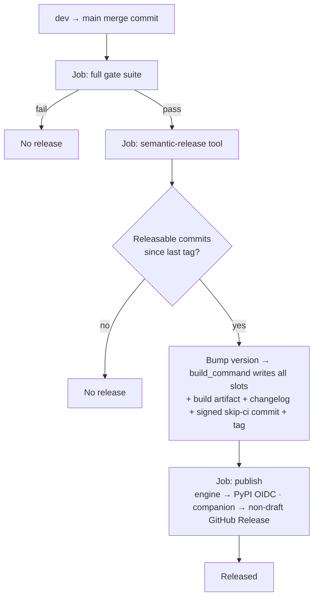
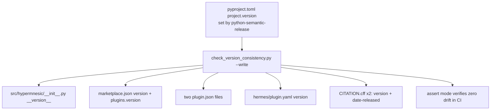

# feat: Automated CD — release + publish on merge to main

## Summary

Replace the manual tag-and-bump ritual in both repos with two fully-automatic
continuous-delivery pipelines. A `dev → main` merge derives the next version from
Conventional Commits, writes every version-carrying file, generates the changelog,
tags, and publishes — engine to PyPI, companion to a GitHub Release the Obsidian
directory consumes — with no human approval step. The Conventional Commits convention
is documented and CI-enforced in each repo's governance files.

This is a **Deep**, cross-repo plan delivered in three phases: A (engine CD), B
(companion CD), C (governance + docs). The engine work lives in this repo; **Phase B
targets the separate `hypermnesic-companion` repository** (paths in Phase B are
relative to that repo's root).

## Problem Frame

Both repos are public and already publish from *tags*: the engine has a tag-triggered
PyPI workflow (live — `v0.1.0` is on PyPI via OIDC Trusted Publishing), the companion a
tag-triggered *draft* GitHub Release. What is manual is everything that *produces* the
tag — choosing the version, editing every version slot, promoting the changelog, and
creating the tag.

That ritual is friction and a defect source. The engine must keep nine version slots in
lockstep or `scripts/check_version_consistency.py` fails the build. The companion has no
such gate and has already drifted: `package.json` is `0.3.0` while `manifest.json` /
`versions.json` are `0.3.2`. The two repos are different ecosystems with different tag
conventions (engine `v0.1.0`; companion bare `0.3.2`).

The goal: a `dev → main` merge is the only action a maintainer takes; the pipeline does
the rest, and the automated gate suite is the safety net that replaces the (removed)
human checkpoint.

---

## Key Technical Decisions

- KTD1. **Native release tool per ecosystem.** python-semantic-release (PSR, 10.x) for
  the engine; semantic-release (Node, 24.x) for the companion. PSR is Python-native (the
  engine has no Node toolchain); semantic-release is the documented Obsidian-plugin path.
  No shared/monorepo tooling. (see origin: `docs/brainstorms/2026-06-19-automated-cd-release-publish-requirements.md` — KD "two independent pipelines")

- KTD2. **The multi-file bump reuses the consistency gate as its writer.** PSR cannot
  natively update nested JSON (`plugins[].version`), nested YAML, or `.cff` files, and its
  regex `version_variables` is unsafe on `marketplace.json` (multiple `version` keys). So
  `scripts/check_version_consistency.py` gains a `--write` mode that stamps every slot from
  the authority; PSR's `build_command` calls it, then `uv build`. One enumerator of the
  slot list — the gate — so the writer and the asserter can never disagree. The companion
  analogue is semantic-release `exec` `prepareCmd` running the adapted `version-bump.mjs`.

- KTD3. **Publish in the same workflow run.** A bot pushing a tag with the default
  `GITHUB_TOKEN` does not trigger any downstream workflow, so a separate `on: push: tags`
  publish workflow would silently never fire. The release workflow therefore bumps, tags,
  builds, and publishes within one run — no GitHub App token or PAT required. Release-loop
  avoidance is doubled: `[skip ci]` in the bump commit message **and** the
  `GITHUB_TOKEN`-no-retrigger rule.

- KTD4. **No-gate PyPI safety is structural.** Full gate suite → build → OIDC publish, in
  one run; `id-token: write` only on the publish job; build and publish are separate jobs;
  PEP 740 attestations on; a metadata/`twine check` step and `skip-existing` before upload.
  The `pypi` GitHub environment is kept (audit trail + optional wait-timer) but its
  required-reviewers rule is removed.

- KTD5. **`main` + `dev` topology with squash-into-dev, merge-into-main.** Feature PRs
  squash-merge into `dev` so the PR title becomes one Conventional Commit; `dev → main` is
  a merge commit that preserves the underlying commits so the bump is computed across the
  batch. The PR title is validated by `amannn/action-semantic-pull-request` (the squash
  subject is the only message that survives, so the title is the right enforcement point).

- KTD6. **Rulesets differ by branch.** `dev`: required status checks (CI + PR-title lint),
  squash-only, zero required reviews. `main`: required status checks, **merge commits
  allowed** (linear-history would block the `dev → main` merge), and a bypass entry for the
  release bot so it can push the bump commit + tag. (see origin Dependencies — branch
  protection is net-new; neither repo has any today.)

- KTD7. **Pre-1.0 policy, and its cross-repo asymmetry.** Engine: `allow_zero_version =
  true` with `major_on_zero = false`, so `feat`→minor / `fix`→patch and breaking changes
  stay in `0.x` (minor) until an explicit `1.0`. Companion: Node semantic-release does not
  special-case `0.x` — `feat`→minor / `fix`→patch work, but a `BREAKING CHANGE` graduates it
  to `1.0.0`. The two repos therefore diverge on breaking changes pre-1.0; this is a
  documented behavior, not a bug.

- KTD8. **DCO sign-off lives in the release-commit template.** Neither tool runs `git
  commit -s`; the `Signed-off-by:` trailer (identity matching the committer) and `[skip ci]`
  are embedded in PSR's `commit_message` / semantic-release's `@semantic-release/git`
  `message`.

- KTD9. **The companion gains an engine-style version-consistency gate**, covering
  `package.json` / `manifest.json` / `versions.json` (and the `versions.json →
  minAppVersion` map), plus a one-time drift correction (`package.json` `0.3.0 → 0.3.2`).

- KTD10. **Changelogs become tool-generated.** Both tools generate the changelog from
  Conventional Commits at release time; the engine retires manual `[Unreleased]` curation.
  Commit bodies must carry the detail that used to live in curated entries. The engine
  governance rules that assume manual versioning/changelog are reconciled in the same PR
  (origin R11).

---

## High-Level Technical Design

Release run on `dev → main` (engine shown; companion identical in shape, different
publish target):

Version-slot fan-out — one authority, one writer (the gate), many slots:

---

## Requirements Traceability

| Origin requirement | Units |
|---|---|
| R1 release on push to main, only when bump exists | U3, U7 |
| R2 version from Conventional Commits | U2, U6 |
| R3 no releasable commits → no release | U2, U6 |
| R4 repos version independently | KTD1 (no version lock) |
| R5 main+dev topology | U4, U8 |
| R6 squash into dev / merge into main | U4, U8, KTD5 |
| R7 dev→main batches one release | U3, U7, KTD5 |
| R8 conventions documented | U9, U10 |
| R9 conventions enforced in CI | U4, U8 |
| R10 companion gains governance; engine formalized | U9, U10 |
| R11 reconcile manual-versioning governance rows | U9 |
| R12 atomic multi-file bump | U1, U2, U6 |
| R13 companion consistency gate | U5 |
| R14 versions.json map maintained | U5, U6 |
| R15 release gated on full suite | U3, U7 |
| R16 no approval step | U3, KTD4 |
| R17 bot commit DCO-signed, no loop | U2, U6, KTD8 |
| R18 PyPI via OIDC, no token, no approval env | U3, KTD4 |
| R19 publish actually fires (bot-tag gotcha) | U3, KTD3 |
| R20 companion non-draft release, no-v tag, assets | U7 |
| R21 release notes + attestations preserved | U7 |
| R22 auto-generated changelog | U2, U6, U9 |

---

## Implementation Units

### Phase A — Engine CD (this repo, `hypermnesic`)

### U1. Version-sync writer (extend the consistency gate)

- **Goal:** Add a `--write` (sync-to-authority) mode to the version gate that stamps every
  version slot from `pyproject.toml`, so an automated bump can update all of them through
  one enumerator.
- **Requirements:** R12; enables R2, R22.
- **Dependencies:** none.
- **Files:** `scripts/check_version_consistency.py`, `tests/test_version_consistency.py`.
- **Approach:** Add a `write(version)` path that reuses the existing `MANIFESTS` /
  `CITATION_FILES` / `INIT` enumeration. Use structure-aware writers: `json` for the flat
  `plugin.json` files and for `marketplace.json` (top-level `version` **and** every
  `plugins[].version`); `ruamel.yaml` (already a dependency) for `hermes/plugin.yaml` and
  both `CITATION.cff` files; regex substitution for `__init__.py` `__version__`. For
  `CITATION.cff`, also set `date-released` to the release date (default today; accept an
  override). Default invocation reads `authority_version()` (the value PSR just wrote to
  `pyproject.toml`) so the writer takes no version argument in the normal path. Assert mode
  stays the default; `--write` is additive and idempotent.
- **Patterns to follow:** existing `collect()` enumeration and the importlib script-loading
  test pattern in `tests/test_version_consistency.py`.
- **Test scenarios:**
  - Covers AE4. After `--write`, assert mode reports zero drift across all slots.
  - `marketplace.json` nested `plugins[].version` is updated, not just the top-level key.
  - Both `CITATION.cff` files get the new `version` **and** an updated `date-released`.
  - Re-running `--write` is idempotent (no diff on the second run).
  - Guard still bites: a hand-edited drifted slot is still flagged by assert mode after the
    change (the writer didn't weaken the asserter).
- **Verification:** `uv run python scripts/check_version_consistency.py --write` followed by
  the assert run passes; `uv run pytest tests/test_version_consistency.py` green.

### U2. python-semantic-release config + first-release migration

- **Goal:** Configure PSR to derive the version, write files via U1, generate the changelog,
  and make a signed `[skip ci]` release commit + tag; migrate the engine's pending
  hand-curated `[Unreleased]` content into the first generated release.
- **Requirements:** R1, R2, R3, R22; advances R12, R17.
- **Dependencies:** U1.
- **Files:** `pyproject.toml` (`[tool.semantic_release]`), `CHANGELOG.md` (insertion flag +
  migration), `pyproject.toml` `[project.optional-dependencies].dev` (add PSR for local dry-run).
- **Approach:** `version_toml = ["pyproject.toml:project.version"]` (PSR stamps the
  authority); `build_command = "python scripts/check_version_consistency.py --write && uv
  build"` (sync all other slots from the freshly-bumped authority, then build);
  `commit_message` carrying `chore(release): {version} [skip ci]` plus a `Signed-off-by:`
  trailer matching the committer identity; `tag_format = "v{version}"`; `allow_zero_version =
  true`; `major_on_zero = false`; changelog generation in `update` mode with an insertion
  flag. Migration: add the insertion flag above the existing released history and fold the
  current `[Unreleased]` prose into the first automated release's section (or cut a
  controlled first release) so no curated content is lost and PSR appends cleanly thereafter.
- **Technical design (directional, not spec):** `[tool.semantic_release]` with the keys
  above; `[tool.semantic_release.changelog]` `mode = "update"`, `insertion_flag`. Resolve
  exact flag text against the current `CHANGELOG.md` layout during implementation.
- **Patterns to follow:** the changelog header already names `pyproject.toml` as the version
  authority and points at the gate — keep that framing.
- **Test scenarios:**
  - `Test expectation: configuration + migration` — validated by a no-op dry run:
    `semantic-release version --print` computes the expected next version from a sample
    commit range without writing.
  - `build_command` produces `dist/` artifacts and leaves the consistency gate green.
- **Verification:** a local dry run prints the next version; `uv build` via `build_command`
  yields sdist+wheel with all slots consistent.

### U3. Engine release workflow (push-to-main, publish in-run)

- **Goal:** Replace the tag-triggered release workflow with a push-to-`main` CD workflow
  that gates, releases, and publishes to PyPI in one run with no approval step.
- **Requirements:** R1, R15, R16, R17, R18, R19.
- **Dependencies:** U1, U2.
- **Files:** `.github/workflows/release.yml`, `.github/workflows/ci.yml` (keep the gate job
  as the required check; reference its job name in rulesets at U4).
- **Approach:** `on: push: branches: [main]` (retain `workflow_dispatch` for manual
  recovery). Job `gate` runs the five-gate suite. Job `release` (`needs: gate`) runs the PSR
  action (bump, `build_command`, changelog, signed `[skip ci]` commit, `v*` tag, GitHub
  release; expose `released` / `version` / `tag` outputs) and uploads the `dist/` artifact.
  Job `pypi` (`needs: release`, `if: released == 'true'`) has job-level `id-token: write`,
  `environment: { name: pypi }` (no reviewers), downloads `dist/`, runs a metadata/`twine
  check`, then `pypa/gh-action-pypi-publish` with attestations and `skip-existing`. Remove
  the `on: push: tags` trigger and the environment's required-reviewers.
- **Patterns to follow:** the existing build/publish job split and OIDC setup in the current
  `release.yml`; the gate sequence in `ci.yml`.
- **Test scenarios:**
  - Covers AE1. A chore/docs-only `dev → main` merge produces no tag, release, or publish.
  - Covers AE2. A `feat` (plus `fix`) batch produces one minor release with all slots bumped
    and the package on PyPI.
  - `Test expectation: workflow` otherwise — validated end-to-end on a staging run.
- **Verification:** a `feat` merged to `main` yields a PyPI version and a GitHub release with
  zero human steps; a chore-only merge yields nothing.

### U4. Engine branch model, rulesets, PR-title enforcement

- **Goal:** Create `dev`, route feature PRs into it, and enforce Conventional Commits +
  squash-merge via rulesets and a required PR-title check.
- **Requirements:** R5, R6, R9.
- **Dependencies:** coordinate required-check names with U3/`ci.yml`.
- **Files:** `.github/workflows/pr-title.yml` (new), `.github/CODEOWNERS` (already routes
  `.github/**` to the owner — no change but note the review path), repository rulesets
  (applied via API/UI; capture the intended JSON in the PR description or a docs note).
- **Approach:** create `dev`; set it as the default PR base; enable squash-merge and "default
  to PR title for squash commits". Ruleset on `dev`: required checks (`lint-test-license`,
  `PR Title Lint`), squash-only, zero required reviews. Ruleset on `main`: same required
  checks, merge commits allowed, `bypass_actors` entry for the release bot. PR-title workflow
  uses `amannn/action-semantic-pull-request` on `pull_request_target` into `dev`, with the
  allowed type list (`feat`, `fix`, `chore`, `docs`, `refactor`, `perf`, `test`, `build`,
  `ci`).
- **Technical design (directional):** the rulesets API may reject `allowed_merge_methods`;
  fall back to repo merge-method settings plus `required_linear_history` on `dev` only.
- **Test scenarios:**
  - Covers AE5. A PR into `dev` with a non-conventional title fails the required check and
    cannot merge.
  - A conforming title passes; squash produces a single conventional commit on `dev`.
- **Verification:** a deliberately bad-title PR is blocked; a good one merges as one
  conventional commit.

### Phase B — Companion CD

**Target repo: `hypermnesic-companion` (separate repository). Paths below are relative to
its root.**

### U5. Companion version-consistency gate + drift fix

- **Goal:** Add an engine-style consistency gate over the companion's version files and
  correct the existing drift.
- **Requirements:** R13, R14.
- **Dependencies:** none.
- **Files:** `scripts/check-version-consistency.mjs` (new), `test/version-consistency.test.ts`
  (new), `package.json` (drift fix `0.3.0 → 0.3.2`), `.github/workflows/ci.yml` (add gate
  step).
- **Approach:** the script asserts `package.json` / `manifest.json` / `versions.json` agree
  and that `versions.json` maps the current version to `manifest.minAppVersion`; non-zero
  exit on drift. Add a CI step running it. Set `package.json` to `0.3.2` so the tree is
  consistent before automation starts (semantic-release uses git tags, where `0.3.2` already
  exists, as its baseline).
- **Patterns to follow:** the engine `check_version_consistency.py` shape; the companion
  `test/read-only.test.ts` guard-bites pattern and its existing `manifest.json`
  well-formedness assertions.
- **Test scenarios:**
  - All three files agreeing → pass.
  - Synthetic drift (`package.json` ≠ `manifest.json`) → fail.
  - `versions.json` missing the current version's mapping → fail.
  - Guard bites on a deliberately broken fixture.
- **Verification:** gate green after the drift fix; `npm test` green.

### U6. Companion semantic-release config + bump adapter

- **Goal:** Configure semantic-release to derive the version, write the companion's version
  files, generate the changelog, and prepare a non-draft release.
- **Requirements:** R1, R2, R3, R22; advances R12, R14, R17.
- **Dependencies:** U5.
- **Files:** `.releaserc.json` (new), `package.json` (devDeps + config), `version-bump.mjs`
  (accept a version argument; also update `package.json`; keep the `versions.json` map logic).
- **Approach:** `tagFormat: "${version}"` (no `v`). Plugins in order: `commit-analyzer`,
  `release-notes-generator`, `changelog`, `exec` (`prepareCmd: node version-bump.mjs
  ${nextRelease.version}` — writes `manifest.json`, `versions.json`, `package.json`), `git`
  (assets `manifest.json` / `versions.json` / `package.json` / `package-lock.json` /
  `CHANGELOG.md`; message `chore(release): ${nextRelease.version} [skip ci]` + `Signed-off-by:`),
  `github` (non-draft release; assets `main.js` / `manifest.json` / `styles.css`). Document
  the 0.x asymmetry from KTD7 (no `major_on_zero` equivalent here).
- **Patterns to follow:** the existing `version-bump.mjs` (extend, don't replace, the
  `versions.json` mapping behavior).
- **Test scenarios:**
  - `version-bump.mjs` given a version updates all three files and adds the `versions.json`
    mapping; idempotent on re-run.
  - Config dry run (`semantic-release --dry-run`) computes the expected next version.
- **Verification:** dry run prints the next version; the bump script leaves the consistency
  gate green.

### U7. Companion release workflow (push-to-main, attest, non-draft)

- **Goal:** Replace the tag-triggered draft-release workflow with a push-to-`main` CD
  workflow that builds, attests provenance, and publishes a non-draft release.
- **Requirements:** R1, R15, R20, R21.
- **Dependencies:** U5, U6.
- **Files:** `.github/workflows/release.yml`.
- **Approach:** `on: push: branches: [main]` (retain `workflow_dispatch`). Gate job:
  typecheck/test/lint/build + the consistency gate, on Node 24 (keep the pin). Then build
  `main.js`; run `actions/attest-build-provenance` on `main.js` + `styles.css` (build before
  semantic-release so the assets exist and can be attested); then run semantic-release
  (analyze → `exec` writes version files → changelog → signed `[skip ci]` commit → no-`v`
  tag → **non-draft** GitHub release uploading `main.js` / `manifest.json` / `styles.css`).
  Preserve the attestation-verification note in the generated release notes. Permissions:
  `contents: write`, `id-token: write`, `attestations: write`.
- **Patterns to follow:** the current companion `release.yml` attestation step and the
  CHANGELOG-extraction release-notes approach (now superseded by the generator, but keep the
  attestation footer).
- **Test scenarios:**
  - Covers AE6. The release tag equals the manifest version with no `v` prefix.
  - Covers AE1, AE2. Chore-only merge → no release; `feat` → one release with three assets.
  - `Test expectation: workflow` — validated end-to-end on a staging run.
- **Verification:** a `feat` merged to `main` yields a non-draft release with the three
  assets and provenance attestations; the Obsidian directory picks it up.

### U8. Companion branch model, rulesets, PR-title enforcement, CODEOWNERS

- **Goal:** Mirror the engine's branch model and enforcement in the companion, which has
  none today.
- **Requirements:** R5, R6, R9.
- **Dependencies:** coordinate required-check names with U7.
- **Files:** `.github/workflows/pr-title.yml` (new), `.github/CODEOWNERS` (new — companion
  has none), repository rulesets.
- **Approach:** identical shape to U4 (create `dev`, default base, squash + PR-title-default,
  rulesets for `dev`/`main`, release-bot bypass on `main`, PR-title workflow). Add a
  `CODEOWNERS` routing changes to the owner so `.github/**` edits are reviewed.
- **Test scenarios:**
  - Covers AE5. Bad-title PR into `dev` is blocked.
- **Verification:** bad-title PR blocked; good one merges as one conventional commit.

### Phase C — Governance & docs

### U9. Engine governance + changelog reconciliation

- **Goal:** Document and enforce-by-reference the Conventional Commits convention, and
  reconcile the governance rules that currently assume manual versioning/changelog.
- **Requirements:** R8, R10 (engine), R11, R22.
- **Dependencies:** documents what U2/U3/U4 introduce.
- **Files:** `AGENTS.md` (`CLAUDE.md` is a symlink — editing `AGENTS.md` suffices),
  `CONTRIBUTING.md`, `CHANGELOG.md` (header), `docs/launch/pypi-publication-decision.md`
  (dated supersession note).
- **Approach:** add a Conventional Commits section to `AGENTS.md` (type→bump table, `!` /
  `BREAKING CHANGE`, scopes, "PR title into `dev` is the release-driving message", "`dev →
  main` is a merge commit", DCO still required, the pre-1.0 policy and its cross-repo
  asymmetry). Update the "documentation must not drift" version-bump row (the writer now
  syncs slots automatically — keep the "point to the gate" framing) and replace the
  `[Unreleased]` rule with "write a Conventional Commit; the changelog is generated". Rewrite
  the `CONTRIBUTING.md` Releasing section from the manual ritual to the automated flow. Add a
  dated note to `pypi-publication-decision.md` that the manual-approval environment is
  superseded (append-only; do not rewrite the signed-off memo).
- **Test scenarios:** `Test expectation: none — documentation.` Validated by the version-
  consistency and preflight gates staying green and a `ce-doc-review` pass.
- **Verification:** no stale `[Unreleased]`/manual-bump instructions remain; CI green.

### U10. Companion governance file (net-new)

- **Goal:** Author the companion's first governance document carrying the same conventions.
- **Requirements:** R8, R10 (companion).
- **Dependencies:** none.
- **Files (companion repo):** `AGENTS.md` (new; optionally a `CLAUDE.md` symlink),
  `README.md` (cross-link).
- **Approach:** mirror the engine's conventions in the companion's GPL-3.0 context: type→bump
  mapping, DCO sign-off, `main`+`dev` model, squash + PR-title rule, the no-`v` tag /
  manifest-version requirement, the Node 24 pin, and the version-consistency gate. Link it
  from the README.
- **Test scenarios:** `Test expectation: none — documentation.`
- **Verification:** the file exists, is accurate to the shipped flow, and is linked from the
  README.

---

## Scope Boundaries

### Carried from origin — deferred for later

- MCP Registry entry auto-update on engine release.
- The Obsidian community directory *first* submission (separate effort, LS-1795 / LS-1796);
  CD only produces the GitHub Release the directory consumes.

### Carried from origin — outside this change

- Any human approval gate or draft-then-promote step.
- Monorepo consolidation; license/public-flip (both repos already public; engine already
  AGPL-3.0-only); retroactive release of past versions; publishing the git-distributed
  Claude/Codex plugin (only its version is bumped, via U1).

### Deferred to follow-up work (plan-local)

- Replacing the engine's literal `__version__` with `importlib.metadata` to remove one slot
  (drift-reduction; not needed once U1 writes it).
- A GitHub App token — only if a future downstream workflow must be triggered by the bot's
  tag/commit (same-run publish makes it unnecessary now).
- A shared reusable release workflow across the two repos.

---

## Alternatives Considered

- **release-please (release-PR model)** instead of semantic-release: rejected — it
  reintroduces a human "merge the Release PR" step, contradicting the no-gate / `dev → main`
  decision.
- **Node semantic-release for both repos:** rejected — the engine has no Node toolchain; PSR
  is the native Python primitive and integrates with `uv build` + OIDC.
- **A separate tag-triggered publish workflow + GitHub App token to re-trigger it:** rejected
  in favor of same-run publish (fewer moving parts, least privilege). The App-token path is
  retained as a deferred option if a future downstream trigger is needed.
- **A standalone version-writer script** separate from the gate: rejected for DRY — a parallel
  slot list is exactly the drift the gate exists to prevent.

---

## Risk Analysis & Mitigation

- **Partial publish (tag created, PyPI upload fails).** The next run sees the tag, computes
  no new version, and the burned number can't be re-uploaded. Mitigation: build+publish in one
  run after gates; `twine check` + `skip-existing`; keep `workflow_dispatch` as a recovery
  path; watch the first few releases.
- **First-run changelog/version migration (engine `[Unreleased]`).** Mitigation: U2 folds the
  curated content into the first generated release / adds the insertion flag; do a controlled
  first release and verify before relying on automation.
- **Malformed commit history mis-bumps or skips a release.** Mitigation: required PR-title
  check (U4/U8); confirm the analyzer ignores the non-conventional `dev → main` merge commit
  and reads the full range since the last tag.
- **Bot push to `main` blocked by the ruleset.** Mitigation: `bypass_actors` for the release
  bot on `main` (KTD6).
- **Release loop.** Mitigation: `[skip ci]` in the bump commit + `GITHUB_TOKEN`-no-retrigger.
- **PyPI environment mismatch after removing reviewers.** The GitHub environment name and the
  PyPI trusted-publisher environment field must agree. Mitigation: operator aligns both (see
  Prerequisites).
- **Companion `0.x` breaking change jumps to `1.0.0`.** Mitigation: avoid `BREAKING CHANGE`-
  typed commits on the companion pre-1.0, or accept the graduation; documented in U10/KTD7.
- **Node 24 pin.** The new companion workflow must use Node 24 (lockfile resolution); keep it.

---

## Dependencies / Prerequisites (operator actions, not code)

- **PyPI:** align the trusted-publisher environment field with the workflow (keep the `pypi`
  environment, ensure the PyPI side matches), and remove the GitHub environment's required-
  reviewers rule.
- **Both repos:** create the `dev` branch; set it as the default PR base; enable squash-merge
  and "default to PR title for squash commits"; set merge-method allowances (`dev` squash-only,
  `main` allows merge commits).
- **Both repos:** apply the rulesets with a release-bot bypass on `main`.
- **Confirm** the `github-actions[bot]` identity/email used for the DCO sign-off trailer.
- No GitHub App is required (same-run publish).

---

## Documentation Plan

- U9 reconciles all engine governance + changelog rules in the same PR (origin R11 + the
  "documentation must not drift" rule).
- U10 creates the companion's first governance file and links it from the README.
- Any README install/quickstart lines that describe the manual release flow are updated in the
  same PRs.

---

## Open Questions (deferred to implementation)

- Exact PSR changelog insertion-flag placement against the current `CHANGELOG.md` structure.
- Whether to retain `workflow_dispatch` for manual recovery (leaning yes, for partial-publish
  recovery).
- Exact ruleset JSON, given the rulesets API may reject `allowed_merge_methods` (fallback:
  repo merge settings + `required_linear_history` on `dev` only).
- Companion attestation ordering: build in a workflow step before semantic-release (so assets
  exist to attest) vs inside `exec` (leaning build-step-first).

---

## Sources & Research

- Origin requirements: `docs/brainstorms/2026-06-19-automated-cd-release-publish-requirements.md`.
- Engine: `scripts/check_version_consistency.py`, `tests/test_version_consistency.py`,
  `.github/workflows/ci.yml`, `.github/workflows/release.yml`, `AGENTS.md`, `CONTRIBUTING.md`,
  `CHANGELOG.md`, the version slots under `plugin/` and the two `CITATION.cff` files,
  `docs/launch/pypi-publication-decision.md`, `docs/handoffs/2026-06-02-companion-directory-publishing-U9-U10-handoff.md`.
- Companion: `package.json`, `version-bump.mjs`, `manifest.json`, `versions.json`, `.npmrc`,
  `.github/workflows/{ci,release}.yml`, `test/read-only.test.ts`.
- External (2026): python-semantic-release 10.x (`version_toml` / `version_variables` /
  `build_command` limits; `allow_zero_version` / `major_on_zero`; it does not publish to PyPI);
  semantic-release 24.x + `@semantic-release/{exec,git,github,changelog}` (`tagFormat`, asset
  upload, non-draft); GitHub docs (`GITHUB_TOKEN` does not re-trigger workflows; repository
  rulesets); `pypa/gh-action-pypi-publish` + PyPI Trusted Publishing (OIDC, attestations,
  environment matching); Obsidian release requirements (no-`v` tag = manifest version, required
  assets, non-draft); `amannn/action-semantic-pull-request`.
