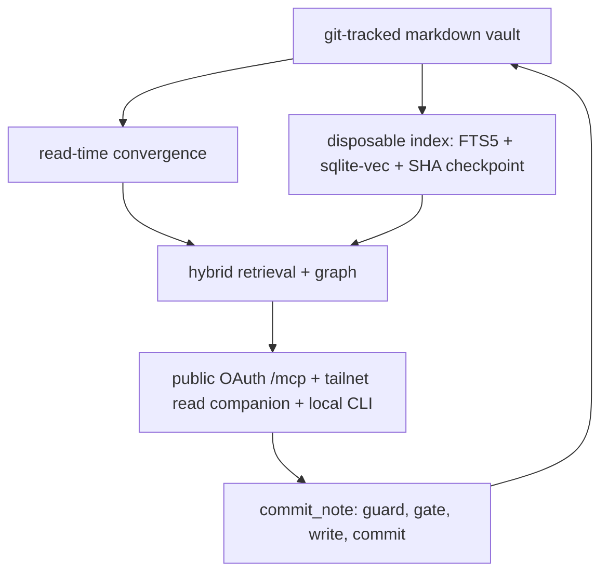

# Architecture Overview

## The one invariant

> **The git-tracked markdown files are the single source of truth. The search index is a
> disposable, rebuildable projection of the committed tree.**

There is no separate database of record. Everything below is a consequence of that
sentence, and the cheapest way to evaluate any proposed change to this system is to ask
whether it still holds afterwards.

Two properties follow immediately:

- **A reindex can never lose a committed write.** Writes go to git *first*, and the index
  is rebuilt *from* git. Deleting the index destroys nothing — it only costs the time to
  rebuild. There are no index backups to keep, because there is nothing in the index that
  is not already in the tree.
- **The system is safe to drop into any repository.** The corpus is ordinary markdown that
  a human can read, diff, and edit without the engine present.

Everything the engine adds — ranking, graph edges, embeddings, dashboards — is derived
state. If derived state and the tree disagree, the tree is right.

## The layers

Note the shape of the cycle: writes enter through git, not through the index, and the index
is only ever downstream. Nothing in the serving layer can mutate the corpus except through
`commit_note`.

### 1. Source of truth

A git repository of markdown notes. Wikilinks in note bodies (`[[target]]`) are the graph
edges; frontmatter carries note metadata. That is the entire storage format.

### 2. The disposable index

Markdown is walked and chunked, then projected into SQLite: an FTS5 table for the lexical
channel, a sqlite-vec virtual table for dense KNN, and a checkpoint slot holding the commit
SHA the projection corresponds to. The checkpoint is what makes convergence possible — it
tells the engine exactly how far behind `HEAD` the projection is. See
[Retrieval and Indexing](retrieval-and-indexing.md).

### 3. The read path

Every read runs convergence first: delta-replay the lexical index up to `HEAD`, invalidate
vectors for changed files, and close a *bounded* slice of the dense lag. Then hybrid
retrieval fuses the lexical and dense rankings and the wikilink graph answers context
expansion and entity resolution. A just-committed note is recall-able on the next read with
no manual reindex — that is the guarantee that lets the index stay a pure projection instead
of drifting into a cache nobody trusts. See [Read-Time Convergence](read-time-convergence.md).

The dense channel is optional at runtime. With no embedding provider reachable, reads still
return lexical and graph results, explicitly flagged as degraded rather than silently
thinned.

### 4. The git-first write path

`commit_note` is the single sanctioned write. It is ordered: write guard, then frontmatter
gate, then file write, then `git commit` (and push), then the index follows as a projection,
then an append-only audit entry. The agent never merges. A refusal returns an explicit
refusal result — never a silent success, never a partial write. See
[Git-First Write Path](git-first-write-path.md) and
[Write Guard and Security Model](write-guard-and-security-model.md).

## Serving: two lanes

1. **Public OAuth `/mcp`** — the sole network lane for every remote client, whether that is
   a chat connector, the coding-agent plugin, or a companion app. OAuth 2.1 with Dynamic
   Client Registration and PKCE, an operator-consent gate, audience-bound revocable tokens,
   and HTTPS via Tailscale Funnel. Read tools are always present; the `commit_note` write
   tool requires the `write` scope.
2. **Tailnet read companion** — an auth-off, **read-only** server for tailnet devices, where
   tailnet membership is itself the boundary. A write-enabled serve requires auth unless a
   bounded, explicitly-opted-in exception applies on a CGNAT bind.

Older descriptions of a "tailnet-only" system or of four lanes are superseded. The server
binds a specific interface at the socket level and refuses `0.0.0.0` at construction, so a
misconfiguration fails loudly instead of exposing a vault. See
[Serving Topology and Authentication](serving-and-authentication.md).

The **CLI** is the third surface and the only one that skips the network entirely: it
operates the index, retrieval, write, and serve paths directly on the engine host. See
[CLI Surface](cli-surface.md).

## Module map

`src/hypermnesic/` is flat by design — one module per responsibility, no package layers to
navigate.

| Concern | Modules | What they own |
|---|---|---|
| Retrieval | `ingest.py`, `index.py`, `embed.py`, `retrieve.py`, `graph.py`, `expand.py` | Walk and chunk markdown; the SQLite projection; pinned embeddings; RRF fusion; the wikilink graph; optional query expansion |
| Convergence | `converge.py` | The one shared catch-up step every read calls first |
| Write path | `commit_note.py`, `serialize.py`, `frontmatter_gate.py`, `audit_log.py` | The single write; the path guard and locks; the diff-or-die frontmatter gate; the body-free audit log |
| Serving | `mcp_server.py`, `auth.py`, `auth_cloud.py` | Tool registration and typed outputs; resource-server auth; the public Authorization Server |
| Local surface | `cli.py` | The engine-host-local command surface |
| Provisioning and config | `install.py`, `config.py`, `client_guidance.py` | Host roles and the convergence hook; pinned tunables and credential resolution; client-specific next actions |
| Diagnostics | `doctor.py`, `local_proof.py` | Non-mutating setup diagnosis; the local-first proof before any endpoint exists |
| Control surfaces | `memory_control.py`, `client_control.py` | Inspect/export/forget/revert/audit; secret-free OAuth grant listing and revocation |
| Capture and thinking | `capture.py`, `think.py`, `folders.py`, `sidecar.py` | Frictionless capture; read-only thinking mode; folder discovery; content-addressed extraction |
| Review and navigation | `salience.py`, `connect.py`, `nav_surface.py`, `propose.py`, `generated.py`, `daily_review.py` | Spaced-review digest; serendipity proposals; generated MOCs and dashboards; the proposal queue; the GENERATED demarcation; the daily loop surface |

The package exposes a single console entry point, `hypermnesic`, and pins its own version in
`__init__.py` — one of several version slots a release gate keeps in agreement (see
[Testing and Release Gates](testing-and-release-gates.md)).

Runtime dependencies are deliberately few and all permissive: the sqlite-vec extension, the
OpenAI client, the MCP SDK, and a round-trip-preserving YAML parser for the frontmatter gate.
Each carries an upper version bound, because the lockfile is not shipped in the wheel and a
fresh install would otherwise resolve whatever the index offers that day.

## Reading order

If you are new: [Quickstart](quickstart.md) → this page →
[Retrieval and Indexing](retrieval-and-indexing.md) →
[Git-First Write Path](git-first-write-path.md).

If you are about to change something security-sensitive — the guard, the gate, auth, or the
tool surface — read [Write Guard and Security Model](write-guard-and-security-model.md) and
[Serving Topology and Authentication](serving-and-authentication.md) first.
