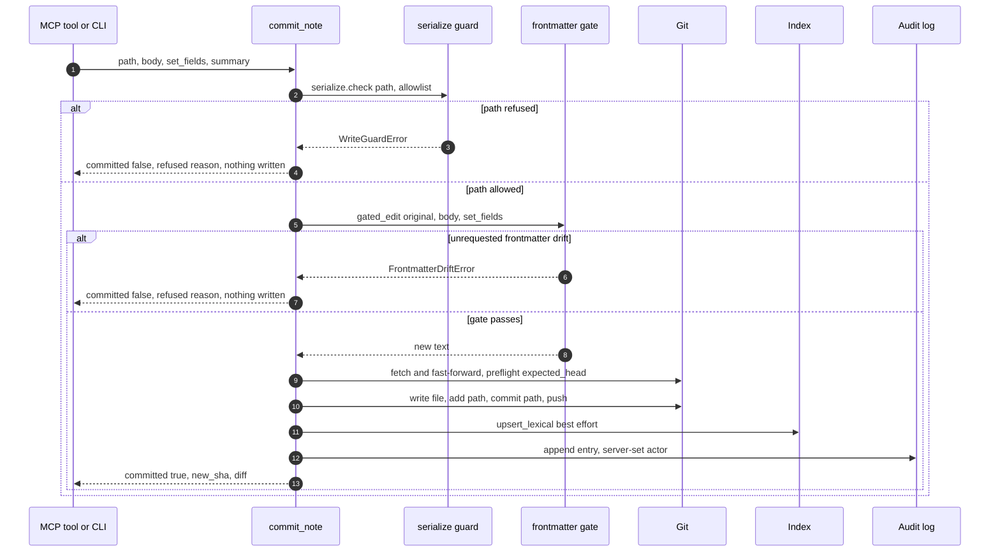

# Git-First Write Path

`commit_note()` (`src/hypermnesic/commit_note.py`) is the **one** sanctioned way to change the
corpus. The MCP write tool and the CLI call it directly; capture's free-append fast path calls it;
anything that needs review becomes a proposal branch instead. There is no second write lane, and in
particular no database-first lane the index could win: git is the commitment, the index is a
projection that follows it.

Owner-initiated removal and revert are the one deliberate exception. `memory_control` reuses the same
guard, the same single-writer lock and the same git-first ordering (`serialize.check` → clean-tree
preflight → `git rm` / `git revert` → index → audit) but not this module, because those operations
never edit frontmatter and so never need the gate — see
[Memory and Client Control](../operations/memory-and-client-control.md).

## The order, and why the order is the security property

```
guard  →  frontmatter gate  →  write file  →  git add/commit  →  push  →  index projection  →  audit
```

Read left to right and note what each step buys:

1. **The path guard runs first**, before the file is read and before the body is touched. A refused
   path is refused *before* any content work happens, so a protected path cannot be reached by a
   clever body or a frontmatter trick. The default surface is blocklist mode (`allowlist=None`): the
   protected-path refusal plus the governance-file fence are the sole bound, and an explicit
   allowlist only *narrows* it. See
   [Write Guard and Security Model](write-guard-and-security-model.md).
2. **The frontmatter gate runs before anything is written.** It computes the new text in memory and
   raises on drift, so a gate abort leaves the working tree, `HEAD`, the index, and the log
   untouched.
3. **The durable unit is a real commit, not a staged change.** The write does
   `fpath.write_text(new_text)` → `git add -- <rel>` → `git commit -q -m <msg> -- <rel>`. That is a
   deliberate deviation from the original "stage only" plan (recorded in `implementation-notes.md`):
   a committed tree is what makes the write recoverable from `HEAD` alone by the audit reconciler
   and the index checkpoint.
4. **Push, when there is a remote, is the last irreversible step before anything derived is
   touched.**
5. **The index projection comes after the commit and is best-effort**, because by then the commit
   exists and cannot be unmade.
6. **The audit entry records the git write**, so it must not depend on whether the index projection
   succeeded.

A process-local single-writer lock (a `flock` on `.hypermnesic/index.lock` via
`serialize.index_write_lock`) is held around the locked section, so a broad writer cannot interleave
with a note write. It provides no cross-process exclusion between committers — the path-scoped git
operations below are what isolate one writer's commit from another's.



*One write end to end. Both refusal branches exit before the file write, so a refusal can never leave a partial write.*

## The frontmatter gate: diff-or-die

**A write may change only the lines it was asked to change.** `frontmatter_gate.gated_edit()` parses
frontmatter with a round-trip-preserving YAML implementation (`ruamel.yaml` in round-trip mode, quotes
preserved, never line-wrapped) so untouched keys stay byte-identical: a scalar date stays
`2026-05-02` instead of becoming an ISO timestamp, key order survives, and Tolaria `_`-prefixed
properties survive. Then it **diffs** the before/after frontmatter and raises
`FrontmatterDriftError` — carrying the offending keys and a unified diff — if any key changed that
the caller did not request.

Change detection is deliberately strict. Frontmatter is compared as per-key line blocks, so an
addition, a removal, or a **reordering** all count as drift. Reordering included, because a tool that
silently reorders your frontmatter is a tool that will eventually rewrite it.

Two edit strategies exist, and the preferred one exists to cut false aborts:

- **Surgical line edit** — for a set of pure scalar values on existing top-level keys, only those
  value tokens are replaced in place. Every other byte is untouched, so a block list elsewhere in the
  frontmatter cannot reflow and trip the gate. A key that is absent, holds a block/multi-line value,
  or carries a trailing comment is not surgically editable and falls back.
- **Structural round-trip** — used to add or delete keys, or for list and block scalar values. This
  is the general path, and its output still goes through the same drift assertion.

A document written in a different YAML style therefore **aborts rather than churns**. That is the
intended failure mode: a refusal you can see beats a silent reformat of someone's notes.

A body-only edit cannot perturb frontmatter at all. A file with **no** frontmatter accepts a body
replacement, but asking to set or delete frontmatter fields on one raises
`ValueError("no frontmatter to edit")` rather than implicitly creating a block. That input-shape
error is refused like a guard: the MCP tool catches `ValueError` alongside the guard and gate errors
and returns a clean `{committed: false, refused: ...}` instead of a raw tool traceback.

## Idempotence and no-ops

A write whose result is byte-identical to the existing content is a **no-op**: nothing is committed
and nothing is logged. The same is true if, after staging, git reports nothing staged for that path
(`git diff --cached --quiet -- <rel>`). Both return a `CommitResult` with `noop=True` — the first
carrying the current `HEAD` as `new_sha`, the second the pre-write base — instead of a fabricated
commit. Over MCP the tool reports `committed: not noop`, so an idempotent re-request is visible as
"nothing to do", not as an error.

Note that the staged-nothing check is path-scoped: an unrelated file staged by another committer does
not turn this note's idempotent edit into a commit.

## Multi-host coordination

When the vault has a git remote (preferring `origin`, else the first remote), the write path
converges with it **before** writing:

1. `fetch` the remote and `merge --ff-only` the local branch to its tip. A divergence that cannot be
   fast-forwarded is a refusal — never a merge, because the agent never merges. A remote that has no
   such branch yet is fine; the push creates it.
2. `serialize.preflight(repo, expected_head=base)` re-checks `HEAD` against the base captured when
   this write started. A mismatch is a `HeadDriftError` **head-drift refusal**, so an edit computed
   against a stale base aborts cleanly instead of clobbering another writer's change. Drift is
   resolved by the fetch+ff that precedes it; preflight detects only the unresolved case.
3. Write, stage, and commit — then push, retrying a non-fast-forward by fetching and rebasing the
   single commit onto the advanced tip. Retries are bounded (`_PUSH_MAX_ATTEMPTS`, module-level so
   tests can shrink it) because contention on a single-note write is brief.
4. The new SHA is re-read **after** the push, because a retry rebase rewrites the commit id.

If the push cannot succeed — a conflicting change, an auth or network failure, a rejecting hook, or
exhausted retries — the code fetches and `reset --hard`s to the remote tip so the local-ahead commit
is **dropped**, then raises `GitCoordinationError`. This matters: an un-pushed local commit would
wedge every fast-forward-only puller on that checkout, so the refusal is louder than the risk.

With no remote configured, coordination is skipped entirely and the write is a local commit.

> **Every git operation is path-scoped.** Staging, the "did anything actually stage" check and the
> commit itself all name this note's path explicitly. On a shared checkout another committer may have
> unrelated changes staged; a `git commit` without a pathspec would sweep them into this commit and
> push them. The pathspec — not the process-local lock — is the isolation mechanism.
> `rename_note` scopes its commit to the moved pair for the same reason.

Rejections and drift stop *before* the file is written; a stalled remote never becomes a
half-applied edit.

## The refusal contract

> **A refusal is never a silent success, and never leaves a partial write.**

Every refusal class behaves the same way: nothing is written. At the **library** boundary a refusal
is a raised exception — `serialize.WriteGuardError` (protected path, governance fence, traversal,
allowlist miss), `frontmatter_gate.FrontmatterDriftError`, `serialize.HeadDriftError`,
`commit_note.GitCoordinationError`, and `ValueError` for gate input-shape problems. At the **client**
boundary the MCP write tool converts each of them into an explicit
`{"committed": false, "refused": "<reason>"}` payload. It builds that payload as a hand-constructed
`CallToolResult` rather than relying on FastMCP's schema materialization, precisely so a refusal
reaches remote clients cleanly (including over Streamable HTTP) instead of failing output
validation. See [MCP Tool Surface](../surfaces/mcp-tool-surface.md).

On any refusal: no file content, no commit, no index row, and **no audit entry**. The tests assert
that directly — a gate abort leaves the file byte-identical and `HEAD` unmoved, a protected path is
never created, and a failing push leaves no audit entry and no local-ahead commit.

Over MCP there is one more refusal that happens even earlier: **insufficient scope**. When auth is
enabled, the write tool self-enforces the `write` scope from the authenticated principal,
independently of the transport's global `required_scopes` (which cannot separate read clients from
write clients on one endpoint). Its message tells the client to reconnect and approve write access,
and states explicitly that write approval only allows the client to *request* `commit_note` — it does
not bypass protected-path, frontmatter, dirty-tree, head-drift, audit, or git-coordination guards.
See [Serving Topology and Authentication](../surfaces/serving-and-authentication.md).

A note on the guard family: `commit_note` itself calls preflight for **head drift only** and is happy
to commit its own path in an otherwise dirty tree. The stricter `require_clean=True` preflight
belongs to the broad/destructive memory-control operations (forget, revert), not to the note write.

## Degraded success: the commit landed but the index did not

Once the commit has landed it **cannot be unmade** — the write is in the object graph either way, and
the only way back is a history rewrite. So a failure to project it into the index is reported as a
*degraded success*, not an error: `CommitResult` carries the real `new_sha` together with
`index_degraded=True` and a stable `degraded_reason` (`index_write_failed: <sqlite error>` or
`index_error: <ExceptionType>: <message>`).

This distinction is not pedantry. Raising there would tell the calling agent that nothing was
written, and a well-behaved agent would then write the same note somewhere else — duplicating
content in response to a purely cosmetic failure. The tool description says it outright: if
`index_degraded` is set the commit still landed, so keep the returned `new_sha` and do **not** write
the note again. The index is disposable and a reindex restores it — see
[Architecture Overview](overview.md).

The projection that runs synchronously is **lexical only**: the path's chunks and full-text rows are
replaced and its doc-surface vector is invalidated. Embedding is explicitly **asynchronous** and
never blocks a write, so a new note is findable lexically immediately and its dense vectors catch up
through [read-time convergence](read-time-convergence.md).

The audit entry is written regardless of whether the projection succeeded, because it records the git
write, not the index state.

## The audit log

Every landed write appends one structured JSONL entry to `.hypermnesic/audit.jsonl`:
`{ts, actor, verb, path, old_sha, new_sha, summary}`, with `verb` being `create` or `edit` for a note
write, and `rename` for a move.

- **Summaries only — never page bodies.** This is a deliberate scar: a private-content leak through a
  diagnostic output is exactly what the constraint prevents. Summaries are truncated to a bounded
  length by contract, and the raw log file never contains a full body.
- **The actor is server-set.** It is derived from a verified Tailscale node identity or a fixed
  server sentinel, and a caller-supplied actor is *ignored*, never trusted — so an MCP caller cannot
  poison attribution.
- **The log is append-only.** Each append opens the file in append mode and prior lines are never
  rewritten; the audit view reads it back with the summary re-sanitized.
- **Refusal events are a separate, body-free shape.** `AuditLog.append_refusal()` exists for a
  `verb: "refusal"` entry carrying `attempted_verb`, `category` and a summary whose token-shaped
  strings are redacted before writing, and the owner-facing audit view renders it next to writes —
  see [Memory and Client Control](../operations/memory-and-client-control.md). It is *not* invoked by
  `commit_note`: a refused write emits no entry at all, which is why a refusal can never be mistaken
  for a write in the history.
- **A reconciler back-fills gaps.** `AuditLog.reconcile(repo)` walks the commits between the last
  logged `new_sha` and `HEAD` and records the unlogged ones as `verb: "reconcile"` entries, so a
  crash between commit and append is recoverable rather than permanent. It is an explicit engine
  operation, not a side effect of every write.

## Renames

`rename_note()` is the atomic move surface: `git mv` plus an index re-key, with no
re-materialization of the old path (a move is the same content at a new path — no re-embed, no
resurrection of the old slug). The guard runs on **both** ends, so neither the source nor the
destination can escape it.

An optional content edit in the same move goes through the frontmatter gate **first**, so a gate
abort means no git operation happens at all. Ordering inside the move is deliberate:

1. Gate the optional content edit (abort here → nothing else runs).
2. Invoke the optional **tombstone sink** with the neutral repo-relative *old* path. After the gate,
   so an abort leaves no orphan tombstone; before the removing git operation, so a crash mid-move
   cannot leave an un-tombstoned orphan. The sink defaults to `None` (no-op): the engine owns no
   external path or format and takes on no dependency on any companion system that might be restoring
   files from elsewhere.
3. `git mv`, re-write the new file if the edit changed it, then commit only the moved pair.
4. Re-key the index (vectors preserved), re-project content if it changed, and append a `rename`
   audit entry.

An index failure in step 4 is the same degraded success as a note write: the SHA and the audit entry
survive.

## Entry points

| Surface | Behavior |
|---|---|
| MCP `commit_note` | Registered only on a write-enabled server; requires the `write` scope; wires the audit log and the server's effective write surface. |
| CLI `hypermnesic commit-note` | **Dry-run preview by default** — it computes and prints the diff with no file, commit, index or log effect. `--commit` performs the real guarded write and wires the index projection when `<repo>/.hypermnesic/index.db` exists. `--json` reports `new_sha`. |
| `propose` / capture free-append | A new file in an immutable append zone is committed straight to `HEAD` by calling `commit_note`; everything else is gated and committed on a `hypermnesic/proposals/<slug>` branch in an isolated worktree for review, surfaced as a PR when `gh` is available, never merged. |
| `memory forget` / `memory revert` | Owner surfaces that reuse the guard, the lock and the clean-tree preflight but perform their own path-scoped `git rm` / `git revert` and audit verbs (`forget`, `revert`); preview-then-apply, and refusing rather than guessing on anything more complex than a single-file markdown change. |

Dry-run is not a weaker guard: the preview path still runs the path guard and still runs the gate, so
a protected path is refused and a drift abort still raises during a preview. A preview of a *new*
file renders the frontmatter the real write would create and reports `created: true`,
`new_sha: null`, with nothing on disk.

The `CommitResult` dataclass is the library-level result contract: `path`, `created`, `new_sha`,
`diff` (a preview diff, or `git show --format= --patch <sha>` for a landed commit), plus the
`noop`, `dry_run`, `index_degraded` and `degraded_reason` flags.

Only the MCP tool wires the audit log. A commit landed through the CLI or the library is a real
commit but carries no inline audit entry; because the log's reconciler works from `HEAD`, such a gap
is back-fillable rather than lost.

## Operating and extending the path

- **State lives under `.hypermnesic/`** in the target repo: `index.lock` (single-writer lock),
  `audit.jsonl` (append-only log), `index.db` (the projection). The engine ignores its own state dir
  via `.git/info/exclude`, never by editing the vault's `.gitignore`.
- **Everything is injected, not global**: `commit_note(repo, path, body=, set_fields=, summary=,
  idx=, log=, allowlist=, dry_run=)` takes the index handle, the audit log, the write surface and the
  dry-run flag from the caller; `rename_note` additionally takes `tombstone_fn`. `idx=None` or
  `log=None` skips that step, which is how the CLI and tests compose the path.
- **Retry depth is a module constant** (`_PUSH_MAX_ATTEMPTS`) rather than a config knob, so the
  contention bound is testable and does not grow an operator surface.

## Changing this code

Changes to `commit_note.py`, `serialize.py` or `frontmatter_gate.py` are **security-sensitive**: they
are the write guard itself, routed to the owner by `.github/CODEOWNERS`, and any PR touching them
must move [`SECURITY.md`](../../SECURITY.md) and
[`docs/threat-model-commit-note.md`](../../docs/threat-model-commit-note.md) in the **same PR** —
the threat model is the artifact of record for this surface, and its dated deltas are append-only.
The repository's doc-drift table makes the same demand of `ARCHITECTURE.md`'s write-path section and
the write-model pins in `docs/README.md`. Any user-visible behavior change here also needs a dated
`CHANGELOG.md` entry.

The tests that pin this behavior are the ones to run (and extend) when touching it:

| Test | Pins |
|---|---|
| `tests/test_commit_note.py` | new-note write + commit + audit + diff; no-op idempotence; gate abort with zero effects; protected-path refusal; dry-run side-effect freedom; remote coordination happy path, head drift, non-ff exhaustion, push rejection, path-scoping, degraded success |
| `tests/test_frontmatter_gate.py` | byte preservation, scalar dates, `_`-props, drift including reorder, surgical vs structural edit paths, abort diff payload |
| `tests/test_serialize.py` | protected-path and governance fence classes, allowlist narrowing, traversal, lock semantics, head-drift and dirty-tree preflight |
| `tests/test_blocklist_write_gate.py` | the enforced sign-off gate: the blocklist write surface must not go live unless the dated security-review delta is signed off |
| `tests/test_mcp_server.py` | the tool contract: refusals survive HTTP output validation, scope enforcement, coordination refusal mapping, reindex-keeps-the-write |
| `tests/test_rename.py` | `git mv` + re-key with no resurrection, gate-before-tombstone ordering, path-scoped rename commit |
