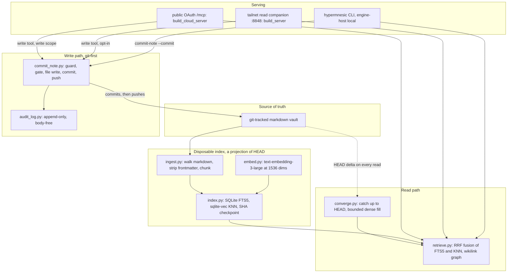

# Architecture Overview

## The one invariant

> **The git-tracked markdown files are the single source of truth. The search/graph index
> is a disposable, rebuildable projection of the committed tree.**

There is no separate database of record, and every other section on this page is a
consequence of that sentence. The cheapest review of any proposed change is to ask whether
the invariant still holds at the end of it.

Two properties follow immediately, and they are what make the system operable:

- **A reindex can never lose a committed write.** Writes land in git *first* and the index is
  rebuilt *from* git, so a rebuild is a function of the committed tree rather than a copy of
  state that only exists in SQLite. There is nothing in the index that is not already
  committed.
- **Deleting the index destroys nothing.** `.hypermnesic/` holds derived state only; delete
  the database, rebuild it (`hypermnesic reindex`, or `reindex --isolated`), and recall
  returns. The cost is rebuild time and embedding calls, not data, and there are no index
  backups to keep.

Two smaller properties follow from the same place. The engine is safe to drop into a
repository it has never seen, because the corpus is ordinary markdown a human can read,
diff, and edit without the engine present. And when derived state and the tree disagree,
**the tree wins** — ranking, graph edges, vectors, dashboards, and the audit trail are all
downstream artifacts.

The index state itself is deliberately unobtrusive: `<repo>/.hypermnesic/` (state dir
`0700`, database `0600`), ignored by appending to `.git/info/exclude` — the engine never
edits the tracked `.gitignore` or any tracked file to install itself
(`src/hypermnesic/index.py`).

## The layer cycle



*One pass around the cycle: writes enter through git, the projection is rebuilt from
committed content, every read converges before it serves, and no surface mutates the corpus
except through `commit_note`.*

## The four layers

### 1. Source of truth

A git repository of markdown notes. Wikilinks in note bodies (`[[target]]`) are the graph
edges — frontmatter `related_to:`/`belongs_to:` are deliberately *not* edges, and because
`ingest.py` strips frontmatter before chunking, the graph never sees them. Frontmatter
carries note metadata. See
[The Note Contract: Frontmatter, Paths, Links, Provenance](../concepts/note-contract.md).

### 2. The disposable index

Markdown is walked, frontmatter-stripped, and chunked (`ingest.py`), then projected into a
single SQLite file: an FTS5 table for the lexical channel, sqlite-vec virtual tables for
dense KNN, a per-document surface lane, and a `meta` slot holding the **commit SHA the
projection corresponds to**. That checkpoint is what makes convergence possible: it states
exactly how far behind `HEAD` the projection is. Only the projection's own rows are derived
— nothing in the layer is authoritative. Mechanics, tables, fusion, and the pinned model live
in [Retrieval and Indexing](retrieval-and-indexing.md).

### 3. The read path

Every read calls **one shared convergence step first** (`converge.py`): delta-replay the
lexical and graph projection up to `HEAD`, reapply the authoring host's uncommitted overlay
(lexical only, checkpoint untouched), and close a *bounded* slice of the dense lag. Then
`retrieve.py` fuses the lexical and dense rankings with Reciprocal Rank Fusion and the
wikilink graph answers context expansion and entity resolution. The result is the property
the whole design leans on: **a just-committed note is recall-able on the next read with no
manual reindex**, so the index can stay a pure projection instead of drifting into a cache
nobody trusts. See [Read-Time Convergence](read-time-convergence.md).

The dense channel is optional at runtime and degrades by design. With no embedding provider
reachable, reads still return lexical and graph results explicitly flagged as degraded
(`degraded_lexical_only`), never silently thinned; a convergence pass that cannot embed still
advances the checkpoint. Convergence also *signals* a manual reindex when `HEAD` has jumped
far past the checkpoint, rather than replaying an unbounded delta inline.

### 4. The git-first write path

`commit_note()` (`src/hypermnesic/commit_note.py`) is the single sanctioned write, and MCP's
write tool, the CLI, capture's free-append fast path, and the proposal queue all route
through it or its primitives. The order is the security property:

```
guard  →  frontmatter gate  →  write file  →  git add/commit  →  push  →  index projection  →  audit
```

The durable effect is the file write plus the commit; the index projection *follows* the
commit and is best-effort, so an index failure after a landed commit is reported as a
degraded success carrying the SHA (never as a failure that would make an agent write the note
again somewhere else). A refusal is always an explicit result — `committed: false` with a
reason — never a silent success and never a partial write. A no-op edit neither commits nor
logs. Full detail in [Git-First Write Path](git-first-write-path.md); the guard classes,
within-repo resolution, serialization, and the accepted-risk model are in
[Write Guard and Security Model](write-guard-and-security-model.md).

## Serving: two lanes and one local surface

1. **Public OAuth `/mcp`** (`mcp_server.build_cloud_server`) — the sole network lane for
   every remote client: chat connectors, the coding-agent plugin, the Obsidian companion.
   OAuth 2.1 with Dynamic Client Registration + PKCE, an operator-consent gate that mints the
   code, audience-bound (RFC 8707) revocable tokens, exposed over HTTPS via Tailscale Funnel.
   Read tools are always available; the `commit_note` tool additionally requires the `write`
   scope.
2. **Tailnet read companion** (`mcp_server.build_server`, port `8848`, auth-off,
   **read-only**) — for tailnet devices, where tailnet membership *is* the boundary. It is
   read-only structurally: with `write_enabled=False` no write tool is registered at all, so
   a read-only server cannot reach a write path even by accident. A write-enabled serve
   requires auth on any non-loopback bind, unless the operator explicitly opts into
   `--allow-tailnet-write`, which is bounded to the Tailscale CGNAT range.
3. **The CLI** (`hypermnesic`, `src/hypermnesic/cli.py`) — the engine-host-local surface, the
   only one that skips the network entirely. It converges, retrieves, writes, diagnoses, and
   serves directly against the local index.

Both network lanes share one implementation: `build_cloud_server` calls `build_server` with
`write_enabled=True` plus the cloud Authorization Server provider, so the tools, guards,
allowlist, and audit path are identical and only the auth wiring differs. Construction is
where misconfiguration fails loudly — the server refuses `0.0.0.0` outright, refuses a
write-enabled serve without auth on a non-loopback bind, refuses a half-configured auth
surface, and refuses an effectively empty allowlist on a write-enabled serve. See
[Serving and Authentication](../surfaces/serving-and-authentication.md) and
[MCP Tool Surface](../surfaces/mcp-tool-surface.md).

## Module map

`src/hypermnesic/` is flat by design: one module per responsibility, no package layers to
navigate.

| Concern | Modules | What they own |
|---|---|---|
| Retrieval and projection | `ingest.py`, `index.py`, `embed.py`, `retrieve.py`, `graph.py`, `expand.py` | Walk, frontmatter-strip, and chunk markdown plus per-document surfaces; the SQLite projection (FTS5, sqlite-vec, SHA checkpoint) and its delta-replay; the pinned embedder and its cooldown; RRF fusion, dedup, and per-hit git recency; the body-wikilink graph and `build_context`; optional multi-query expansion |
| Convergence | `converge.py` | The one shared catch-up step every read calls first: debounce, non-blocking single-indexer lock, bounded dense fill, host-aware overlay, oversized-delta signal |
| Write path | `commit_note.py`, `serialize.py`, `frontmatter_gate.py`, `audit_log.py` | The single write and its rename surface; the blocklist path guard, within-repo resolution, and file locks; the diff-or-die frontmatter gate; the append-only, body-free audit log with its reconciler |
| Serving | `mcp_server.py`, `auth.py`, `auth_cloud.py` | Tool registration with typed output schemas, bind/auth invariants, and the two lanes; the resource-server token verifier (RFC 8707 audience + expiry, fail-closed); the public Authorization Server with DCR, PKCE, and the operator consent gate |
| Local surface | `cli.py` | The engine-host-local command surface and the `hypermnesic` entry point |
| Configuration | `config.py` | The pinned embedding model/dimension, the `CONVERGE_*` read-time tunables, the immutable append-zone list, and credential resolution (env or a gitignored `.env`, never echoed) |
| Provisioning and client wiring | `install.py`, `client_guidance.py` | Role provisioning (`single`/`master`/`client`), service units, the opt-in post-merge convergence hook, and the fail-closed public-endpoint setup that verifies the live discovery chain; per-client next actions |
| Proof and diagnostics | `local_proof.py`, `doctor.py` | The local-first proof (git validation, projection, recall, dry-run write preview; provisions nothing); non-mutating `doctor`/`status` diagnostics that separate index health, remote reach, OAuth discovery, and write availability |
| Owner control | `memory_control.py`, `client_control.py` | List/inspect/export/forget/revert/audit over the same guard and git-first ordering; secret-free OAuth grant metadata listing and revocation |
| Capture, discovery, and thinking | `capture.py`, `folders.py`, `think.py`, `sidecar.py` | Free-append capture into `sources/` with deferred triage; folder taxonomy and writability derived from the guard; read-only thinking mode that structurally cannot write; content-addressed markdown sidecars for non-markdown sources |
| Review, proposals, and navigation | `propose.py`, `generated.py`, `salience.py`, `connect.py`, `nav_surface.py`, `daily_review.py` | The review-gated proposal queue (branch + PR, never auto-merged); the `generated_by` + managed-block demarcation; salience digest; connection/serendipity proposals (`connect.py` is the connection module, despite the name); generated MOCs and Bases dashboards; the daily review artifact |

The package exposes one console entry point, `hypermnesic`, and pins its own version in
`src/hypermnesic/__init__.py` — one of several version slots that
`scripts/check_version_consistency.py` keeps in agreement, so no mirror is ever
hand-enumerated. Runtime dependencies stay few, permissive, and upper-bounded, because the
lockfile is not shipped in the wheel.

## Where a change lands

Two rules govern architectural change here, and both are enforced outside the code:

- **Documentation is part of the change.** A change is not done until every document it
  affects is corrected in the same PR, and each subsystem has a named doc it must keep in
  step (MCP tool surface, CLI, config, write guard, auth topology, retrieval/convergence).
  The pins in `docs/README.md` win over older process history — notably the write model is a
  **blocklist** with the legacy allowlist as opt-in narrowing, and the serving topology is
  **two lanes**.
- **Some files are security-sensitive by routing.** `serialize.py`, `frontmatter_gate.py`,
  `auth*.py`, and `mcp_server.py` are CODEOWNERS-routed and must cite `SECURITY.md` and the
  threat model when they move. Dated signed-off reviews are append-only: amend, never
  rewrite.

## Reading order

Start with [Quickstart](../quickstart.md), then read the layer that matches your question:

- How markdown becomes ranked hits, and why the projection is disposable →
  [Retrieval and Indexing](retrieval-and-indexing.md).
- How reads stay fresh while the index stays a projection →
  [Read-Time Convergence](read-time-convergence.md).
- How a write actually lands, and what a refusal looks like →
  [Git-First Write Path](git-first-write-path.md).
- What the guard protects and why the model is a blocklist →
  [Write Guard and Security Model](write-guard-and-security-model.md).
- Who can reach the endpoint, and with which scope →
  [Serving and Authentication](../surfaces/serving-and-authentication.md).
- What a note *is* — frontmatter keys, path zones, links, provenance →
  [The Note Contract](../concepts/note-contract.md).

If you are changing something security-sensitive, read the guard and serving pages before
touching code.
