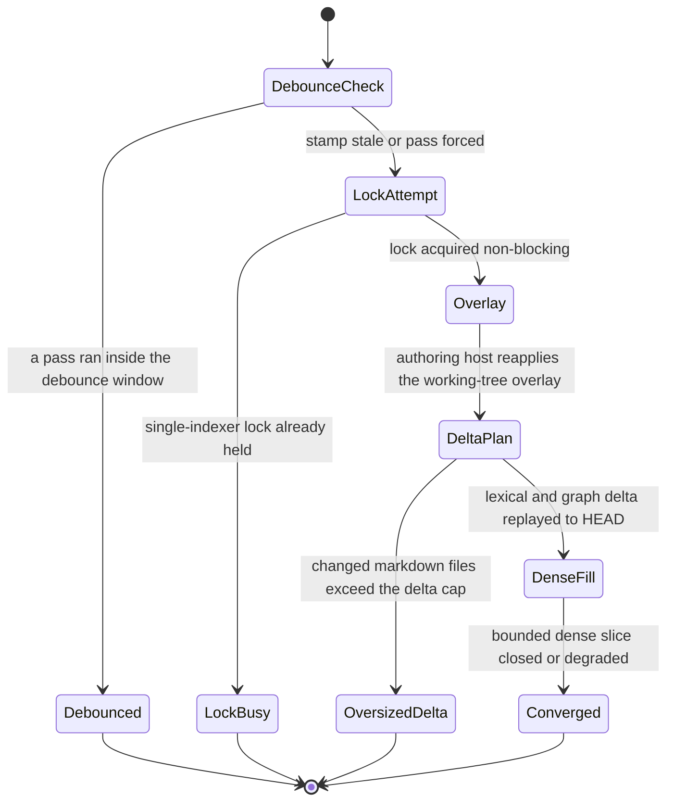

# Read-Time Convergence

`converge()` (`src/hypermnesic/converge.py`) is the one step that lets the index stay a pure
projection of the committed tree while reads still look fresh. Every read runs it first — every
MCP read tool through `_Backend.converge()` (`src/hypermnesic/mcp_server.py`) and every read verb
on the CLI (`retrieve`, `think`, `resolve`, `list-folders`, `memory`) — so it is one shared
implementation, not a per-caller re-creation of freshness logic.

The property it buys is the one the whole design leans on: **a note committed a moment ago is
recall-able on the next read, with no manual reindex.** The pass therefore never rebuilds
anything; it delta-replays the lexical and graph projection up to `HEAD`, closes a *bounded*
slice of the dense lag, and returns a structured outcome. See
[Architecture Overview](overview.md) for the invariant this depends on and
[Retrieval and Indexing](retrieval-and-indexing.md) for what the projection contains.

*One `converge()` pass and the four terminal statuses it can reach; only the two right-hand paths
write a debounce stamp.*

## What one pass does, in order

1. **Debounce check, before any lock.** A recent convergence (a timestamp in the index state
   directory) returns immediately.
2. **Take the single-indexer lock, non-blocking.** If a writer or another converger holds it, the
   pass stops and the read serves the current state.
3. **Re-apply the authoring-host overlay**, when the caller says this host authors.
4. **Size the delta** between the index checkpoint and `HEAD`, without mutating anything.
5. **Replay the delta lexically and graphically**, then advance the checkpoint to `HEAD`.
6. **Close a bounded slice of the dense lag** for both the chunk lane and the doc-surface lane.
7. **Write the debounce stamp** and return a `ConvergeResult`.

Convergence writes only the `.hypermnesic/` projection — the database and the stamp. It never
writes the repository.

## The four outcomes

`ConvergeResult.status` is the discriminator, and each value means something operationally
different (`src/hypermnesic/converge.py`):

| Status | Meaning |
|---|---|
| `converged` | A pass ran — possibly a no-op, when the checkpoint already equalled `HEAD`. |
| `debounced` | Skipped: a pass ran within the debounce window. |
| `lock_busy` | Skipped: another holder owns the index lock. |
| `oversized_delta` | Replay skipped; a manual reindex is recommended. |

Around the status the result carries `replayed`, `chunks_embedded`, `docs_embedded`, `degraded`
(serialized as `degraded_lexical_only`) with `degraded_reason`, `manual_reindex_recommended`,
`overlay_paths`, the `head` it saw, and `checkpoint_advanced`.

### Debounce: a stamp, not a cache

The stamp lives at `<repo>/.hypermnesic/converge.stamp`. It is checked before the lock is taken,
so a burst of reads inside the window costs one `stat` and no contention. It is written at the end
of a pass that actually ran — `converged` **and** `oversized_delta` — and deliberately *not*
written on `debounced` or `lock_busy`. That asymmetry matters: a pass skipped because the lock
was busy does not suppress the next read's attempt, so contention delays convergence by one read
rather than by a whole window.

Callers can force a pass with `debounce_seconds=0`, which is exactly what `--now` on the CLI
verbs does: it catches a self-write committed inside the window in a single command
(`src/hypermnesic/cli.py`). Tests use the same lever to make every path deterministic.

### The lock: non-blocking, and never a stall

The pass takes `serialize.index_write_lock(repo)` — a `flock` on `.hypermnesic/index.lock` —
**non-blocking**. `LockBusyError` becomes `status="lock_busy"` with the index and the checkpoint
left exactly as they were, because the holder (a `commit_note` write, a rename, or a broad
reindex) is already advancing the projection. A read must never wait for that; the invariant is
that the index is a projection of the committed tree, so serving a slightly older consistent
projection is always safe.

The lock is held for the whole pass — overlay, replay, and dense fill. The dense fill therefore
calls `index.embed_stale_locked`, not the public `index.embed_stale`: the public wrapper acquires
the same lock on its own file descriptor, which would self-conflict.

### Sizing the delta, then replaying it

`index.changes_since_checkpoint(idx, repo)` is pure: no lock, no mutation. It returns
`(head, cp, have_cp, changes)`, where `head` is `None` outside a git repo and `changes` is `None`
when the index is already current. A stored checkpoint is only trusted after
`git cat-file -t <cp>` reports `commit`; when it is missing or unknown, the delta becomes **every
markdown file at `HEAD`** (a full `ls-tree -r`), not a diff.

`index.replay_changes(...)` — called with `embedder=None`, so replay is purely lexical and
graphical — then walks the change set:

- a `D` status removes every row for the path;
- an `A`/`M` status reads the content **from the commit** (`git show HEAD:path`), re-chunks it, and
  replaces the path's lexical rows via `upsert_lexical`;
- the checkpoint is set to `HEAD`.

Detection uses `git -c core.quotepath=false diff --name-status <cp>..<head>`, so a path with
accented or CJK characters is not octal-escaped into a silent drop, and a rename is decomposed
into a delete plus an add. The change set is filtered to markdown outside the ingest skip
directories.

## Reading from the commit, not the working tree

Replay reads `HEAD`'s content, never the file on disk. That is what keeps the projection a
projection of the committed tree rather than of whatever happens to be in the working tree, and
it is why convergence needs no dirty-tree preflight (the write path does — see
[Git-First Write Path](git-first-write-path.md)).

Two failure behaviours follow from it, and both are tested:

- **A transient `git show` failure does not blank a page.** When the content fetch fails — object
  pruned, corrupt, transient — the path's existing index rows are left intact instead of being
  replaced with empty chunks.
- **The doc-surface lane is recomputed from the commit too** (`index._doc_surface_for_projection`),
  so a dirty working tree cannot leak an uncommitted body into the vector table. The test that
  pins this edits a file on disk after committing a different version and asserts the *committed*
  text is what gets embedded.

## The bounded dense fill

The dense lane lags by design: the write path and the lexical replay are synchronous, embeddings
are not. Convergence closes a bounded slice of that lag per pass:

- at most `CONVERGE_EMBED_BUDGET` chunks with no vector, and at most the same number of paths
  whose doc-surface vector is missing, per read;
- chunk text comes from the index, doc surfaces are re-derived from the commit;
- only *missing* rows are processed, so capping stays idempotent and resumable: successive reads
  drain the remainder and never re-embed what is already there.

Two independent freshness measures therefore coexist. The **checkpoint** tracks the lexical and
graph projection and moves during replay; the **stale-vector gap** (`index.stale_chunk_ids()`,
`index.paths_missing_doc_vector()`) tracks dense coverage. That split is why a dense failure after
a successful replay is a degradation rather than a rollback — the checkpoint has already advanced.

## Graceful dense degradation

Convergence never raises on the read path. If the embedder is absent, or fails — provider down, a
dimension disagreement, a rate limit — the lexical and graph catch-up still completes and the
checkpoint still advances; only the dense slice is skipped, and the result is flagged degraded
with a named reason (`missing_embedder` for a `None` embedder, otherwise the
`EmbeddingError.reason`, e.g. `rate_limited` or `cooldown` from the in-process embedding cooldown,
falling back to `embedding_error`).

Vector writes only happen once the provider has returned vectors for a batch, so a partial pass
leaves **real vectors or none** — never zero placeholders that would silently rank. The test for
this asserts that a failed embed leaves the new chunks absent from the vector table (still
"stale", i.e. eligible for the next pass) while being lexically findable.

## Oversized delta: signalling a manual reindex is not performing one

When the change set exceeds `CONVERGE_MAX_DELTA_FILES`, the delta is **not** replayed inline. The
pass serves the current consistent projection, sets `manual_reindex_recommended`, and leaves the
checkpoint where it was.

The reasoning is worth keeping, because "just replay part of it" is the tempting wrong answer: a
*partial* replay cannot advance the checkpoint to `HEAD`, so the next read would recompute the
same oversized delta and redo the same work forever, with no progress. Serving an older but
consistent projection and saying so is strictly better. The guard also fires on an index whose
checkpoint is missing, because then the delta is every markdown file at `HEAD` — a first
convergence against a large vault recommends a reindex rather than streaming the whole tree
inline.

That signal is advisory and nothing else:

- It never triggers a rebuild. `converge()` never calls `index.reindex_isolated`; the test suite
  monkeypatches that function to raise if it is ever reached. Full reindex stays a manual,
  explicit operation (`hypermnesic reindex`, with `--isolated` for the worktree-plus-atomic-swap
  path) — a read path that could start an unbounded rebuild is a read path that can exhaust memory
  at a moment nobody chose.
- It reaches the caller. Every MCP read tool includes `manual_reindex_recommended` in its result
  (the CLI's `retrieve --json` and `list-folders --json` do the same, and the human
  `list-folders` output prints a note), so a client sees that the projection is behind rather than
  silently trusting a thin result. See [MCP Tool Surface](../surfaces/mcp-tool-surface.md).

The field name is reused elsewhere with a different derivation: `doctor` computes
`manual_reindex_recommended` from missing chunk/doc vectors, and `memory_control` from the
checkpoint disagreeing with `HEAD`. Same name, different evidence — read it as "the projection is
behind", not as "convergence tripped".

## The authoring-host overlay

A replica projects committed SHAs only. An authoring host additionally wants its own
in-progress edits findable before they are committed, so when the caller passes
`authoring_host=True` the pass first re-applies the working-tree overlay
(`index.apply_working_tree_overlay`): it reads `git status --porcelain`, re-indexes the
tracked-modified and untracked markdown from disk, and drops rows for paths that no longer exist
on disk. Two constraints keep this from contaminating the projection:

- **It is lexical only.** Overlay paths are passed to the dense fill as `exclude_paths`, so
  uncommitted text never reaches the chunk or doc-surface vector tables.
- **It never advances the checkpoint.** A replica projecting the same committed SHA sees none of
  it, which preserves the rule that the index represents committed state.

The overlay is also best-effort: any failure (no git, a transient error) is swallowed and the pass
continues with no overlay rather than failing the read.

It is **off by default everywhere**. `converge(authoring_host=False)`,
`build_server(authoring_host=False)`, and no `authoring_host` argument at all in
`build_cloud_server` — so both network lanes are replicas by construction. The overlay is
reachable through `hypermnesic converge <repo> --authoring-host` and through a programmatic
`build_server(..., authoring_host=True)`; the CLI `serve`/`serve-cloud` commands and the rendered
service units and docker compose files never set it.

## Tunables and how each one fails

The three `CONVERGE_*` constants in `src/hypermnesic/config.py` are the whole knob surface, with
defaults and the canonical table on
[Configuration and Tunables](../operations/configuration-and-tunables.md). The failure modes are
the part that matters when changing them:

- **`CONVERGE_EMBED_BUDGET`** — how many stale chunks, and at most as many missing doc surfaces, a
  converging read embeds. Lower it and dense coverage falls further behind lexical for longer:
  reads stay fast but semantic recall is thin until later passes drain the lag. Raise it far past
  one embedding batch and the read that pays absorbs several API round-trips, so first-read latency
  and cost climb exactly when the corpus just changed.
- **`CONVERGE_DEBOUNCE_SECONDS`** — how long a completed pass suppresses the next one. Too low and
  every read in a burst pays full convergence cost. Too high and a just-committed note stays
  invisible for that long; the mitigation is that callers can force a pass (`--now`,
  `debounce_seconds=0`), which is why the window can be generous without being a correctness
  problem.
- **`CONVERGE_MAX_DELTA_FILES`** — the oversized-delta threshold. Too low and ordinary merges trip
  the guard, so operators get nagged for reindexes they do not need and the projection stays
  stale until they run one. Too high and a single read may absorb a very large inline replay,
  making read latency unpredictable precisely when the repository changed a lot.

All three are injectable per call (`debounce_seconds`, `embed_budget`, `max_delta_files`), which
is how tests force a specific path.

## Where the pass runs

- **Every MCP read tool.** `_Backend.converge()` runs before the tool answers, and clears the
  cached wikilink graph when the pass replayed paths or applied an overlay, so `build_context`
  reflects freshly replayed pages.
- **The CLI read verbs**, each of which converges before reading and accepts `--now` to force a
  non-debounced pass.
- **`hypermnesic converge <repo>`** — a manual pre-warm and the post-merge hook's entrypoint. It
  prints or JSON-serializes the `ConvergeResult.as_dict()`.
- **The opt-in post-merge git hook** (`hypermnesic install-hooks`, also installed by
  `install`/`setup`). It runs the same command as a managed block inside `post-merge`, quoted and
  terminated with `|| true`, precisely because lazy read-time convergence is the correctness
  guarantee and the hook only warms the cache: a convergence hiccup must never fail a `git pull`.
- **`doctor`** points at `hypermnesic converge <repo> --now --json` when a key is configured but
  vectors are stale or absent.

Two neighbours are worth keeping distinct. The **write path** holds the same index lock for its
whole locked section, so a converge call during a write reports `lock_busy` and the read serves
the pre-write projection; the write's own best-effort lexical upsert still makes the note findable
on the index it wrote into, while the checkpoint catches up on the next pass. And the
**analytical lane** deliberately does not use this bounded pass: salience scoring and connection
proposals call `index.ensure_full_coverage`, which runs an *unbounded* `embed_stale(budget=None)`
under the same lock and reports `coverage_complete: false` rather than computing centrality on a
half-embedded corpus.

## Focused tests

`tests/test_converge.py` is the spec for the pass, and it forces `debounce_seconds=0` so each
behaviour is observable in one call:

| Behaviour | Test focus |
|---|---|
| Debounce short-circuits, lock never taken | a second immediate pass returns `debounced` with zero work |
| Catch-up + bounded embed | replayed count, checkpoint equals `HEAD`, new content lexically findable, `docs_embedded` for an edited doc surface |
| Working tree is not a source | a dirty edit after a commit embeds the committed text, never the dirty text |
| Lock contention | another holder → `lock_busy`, checkpoint unchanged, path absent from the index |
| Oversized delta | a cap below the change count → `oversized_delta`, `replayed == 0`, checkpoint unchanged |
| Degradation | a dim-correct but dead embedder completes the lexical catch-up, advances the checkpoint, and leaves the new chunks stale rather than zero-vectorized |
| Authoring host vs replica | overlay path findable with `chunks_embedded == 0` and an unchanged checkpoint; a non-authoring pass never indexes it |
| Never a full reindex | `reindex_isolated` monkeypatched to raise, pass still converges |
| Data-loss regressions | non-ASCII paths replayed; a failed `git show` does not blank the path |
| Forced pass | `--now` / `debounce_seconds=0` catches a self-write inside the window while the default path skips it |

Around it: `tests/test_index_projection.py` covers the delta-replay and overlay primitives
(deleted paths, absent checkpoints, the replica-not-seeing-uncommitted rule),
`tests/test_index.py` covers the budget/resume behaviour and the tunables' sanity,
`tests/test_cli.py` covers CLI convergence plus the `--now` and manual-reindex surfacing,
`tests/test_mcp_server.py` covers per-read-tool convergence and the signal reaching the caller,
and `tests/test_reindex_isolated.py` covers the manual rebuild that convergence deliberately never
invokes — including that the long build phase does not hold the live lock.
