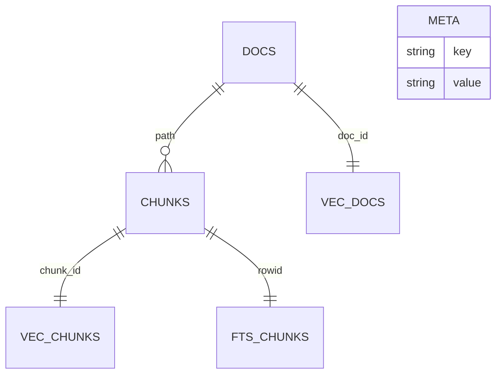
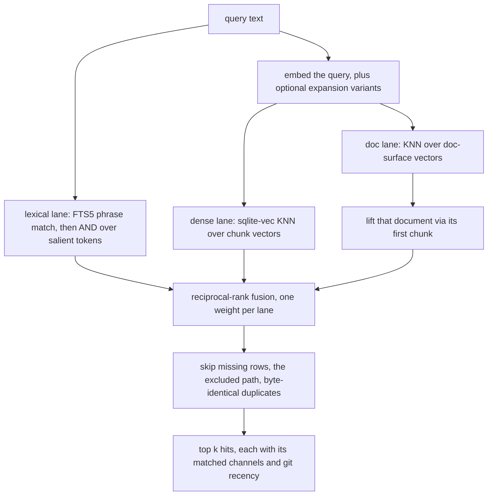

# Retrieval and Indexing

This is the read half of the system: how committed markdown becomes a queryable projection,
and how a query becomes a ranked list. The projection lives in `ingest.py`, `index.py`,
`embed.py`, `retrieve.py`, `expand.py`, and `graph.py`, and it holds **derived state only** —
no row in it is authoritative. The authoritative copy of every note is the git tree, which is
why the database can be deleted and rebuilt, and why the SHA checkpoint it carries matters more
than its contents. See [Architecture Overview](overview.md) for that invariant and
[Read-Time Convergence](read-time-convergence.md) for the pass that keeps the projection moving
toward `HEAD`.

The vocabulary used here follows [The Note Contract](../concepts/note-contract.md) (what a note
is: frontmatter, path, links) and the tunables live in
[Configuration and Tunables](../operations/configuration-and-tunables.md).

## Ingestion and chunking

`ingest.iter_chunks(repo)` walks markdown in **sorted path order** so rebuilds are reproducible,
and skips the skip-directory set (`ingest._SKIP_DIRS`: git, the engine's own state dir, and the
usual editor and tooling directories). Files are read with `errors="replace"`, so one bad byte in
one note cannot fail a build.

Two transformations happen before anything is embedded or indexed, and both have consequences
beyond ingestion:

- **YAML frontmatter is stripped** (`ingest.strip_frontmatter`) before chunking. The graph never
  sees frontmatter at all, so `related_to:` / `belongs_to:` cannot become graph edges even by
  accident.
- **Note identity is resolved separately** (`ingest.note_title`): frontmatter `title:`, else the
  first level-1 heading, else a de-kebabbed path stem with a leading ISO date removed. The rule is
  level-specific on purpose — a note that opens with a `## Section` falls through to the stem
  rather than returning a section label as its own name.

Bodies are split on blank lines into blocks, grouped into chunks under a hard character cap
(`ingest.MAX_CHARS`), with the nearest preceding heading carried on each chunk. The cap sits well
under the pinned model's input ceiling — a deliberate margin after a real build that died on an
oversized input — and a single block larger than the cap is split, preferring line boundaries and
falling back to a hard character slice for content with no usable whitespace (a giant table row, an
encoded blob). Chunk ordinals follow block order, so a rebuild over the same commit produces the
same chunk set.

A second, document-level surface is derived per file by `ingest.doc_surface`: title plus every
section heading plus the lead paragraph, bounded to the same cap. It is a deterministic proxy for
a compiled document summary and exists to align "what is this document about" queries with whole
documents. `ingest.chunks_for_text` exposes the same chunker for a single document's raw text — the
write path uses it so a newly committed note is chunked identically to how a rebuild would chunk it
(`commit_note._upsert_index_best_effort`).

## What the projection holds

One SQLite file, `<repo>/.hypermnesic/index.db` (`index.STATE_DIRNAME`, `index.state_dir_for`).
The state directory is created `0700` and the database `0600`, both re-asserted on build.

*The tables `index.create_schema` installs: one `chunks` row per chunk, its FTS row and its vector, one `docs` row and one doc-surface vector per indexed path, and the `meta` key/value slot. Treat `index.py` as the schema definition — this diagram shows the shape, not the full column set.*

Every table is derived from committed markdown, so deleting the file costs rebuild time and
embedding calls and nothing else. Three design choices are worth separating from the mechanics:

- **Dense retrieval uses the sqlite-vec KNN query shape** (`Index.KNN_SQL`: `embedding MATCH ? AND
  k = ?`), never a brute-force `ORDER BY vec_distance_*`. The brute-force form is orders of
  magnitude slower at scale and is explicitly fenced out by a test that asserts the SQL contains
  `MATCH` and `k = ?` and not `vec_distance`.
- **The engine never edits a tracked file to install itself.** `index.ensure_ignored` appends the
  state dir to `.git/info/exclude`; `.gitignore` byte-stability is asserted by test.
- **The lexical projection can self-heal.** FTS content is versioned by a slot in `meta`
  (`index._FTS_TEXT_VERSION`, alongside the FTS text shape built by `index._fts_text`), and
  `Index.__init__` rebuilds `fts_chunks` from the already-indexed `chunks` rows when the open index
  carries an older version. The repair needs no embeddings, so degraded lexical recall fixes itself
  on open with no API key. Bump the version constant whenever the indexed text shape changes;
  forgetting to means old indexes keep serving the older recall characteristics.

The `meta` table also holds the **`checkpoint_sha`** slot (`Index.set_checkpoint` /
`Index.get_checkpoint`): the commit the projection corresponds to. That single value is what makes
convergence possible — it is a claim about how far behind `HEAD` the projection is, and it is only
trusted after git confirms the value is a real commit (`index.changes_since_checkpoint`).

One lifecycle detail is easy to miss and matters for long-lived servers: `reindex_isolated` installs
a rebuilt database with `os.replace`, which unlinks the inode a boot-time `Index` handle was opened
on. `Index.conn` therefore stats the file per operation and reopens when the file identity changed
(`st_dev`/`st_ino`), so a long-lived MCP server neither serves a frozen snapshot nor fails writes
with "attempt to write a readonly database" after a swap. A *missing* file is deliberately not
treated as a swap (an in-flight rebuild must not make the holder reopen onto nothing), and neither
is an open transaction.

## Embeddings

The model and dimension are pinned in `config.py` as `config.EMBED_MODEL` / `config.EMBED_DIM`
(held equal to the parity baseline's pinned config, so a comparison isolates the architecture rather
than the model), and `config.assert_embedder_agrees` fails fast — at build, reindex, and dense-fill
entry — when an embedder's `dim` disagrees. The dimension is also baked into the schema: the
`vec0` tables declare `float[config.EMBED_DIM]`, so changing that constant invalidates every
existing index and requires a rebuild, not a migration.

`embed.OpenAIEmbedder` sends the dimension to the provider **explicitly** and validates every
returned vector against it, so a silent provider-side change cannot land short vectors in the
table. Failures are never swallowed and never zero-filled: a zero vector would silently rank, which
is strictly worse than a missing one, so a failed batch leaves real vectors or none.

Three operational behaviours ride on the same class:

- **Failure classification** (`_embedding_failure_reason`): a rate limit is distinguished from a
  generic API error and from a local configuration error, and the classification is carried on
  `EmbeddingError.reason` all the way into the retrieval result.
- **A rate-limit cooldown** (`config.EMBED_FAILURE_COOLDOWN_SECONDS`): after a 429 the embedder
  refuses further calls for the cooldown window with `reason="cooldown"`, so repeated reads keep
  serving lexical and graph results instead of hammering a throttled provider.
- **A startup smoke embed** (`embed.smoke_embed_or_die`, called by `init`/`reindex` and by the
  harnesses): it embeds one vector and refuses to proceed on any failure. Its point is to confirm
  the key is actually *read by the SDK*, not merely present in the environment — scar tissue from a
  long silent failure. Credential resolution is `config.get_api_key` (process env, then a gitignored
  `.env`); the key is never written to the index, the audit log, or any structured output, which a
  test asserts by scanning the database bytes and the `stats()` payload for a sentinel token.

## Building, replaying, and draining the lag

Three operations maintain the projection, and only one of them is on the read path:

**Full build** — `index.build_index(repo, embedder)` takes the single-indexer lock
(`serialize.index_write_lock` → `flock` on `.hypermnesic/index.lock`), destroys the old database
only once the lock is held, streams chunks through the embedder in batches (`index._BATCH`), builds
the doc lane from `ingest.iter_doc_surfaces`, and records `HEAD` as the checkpoint. Passing
`state_dir` keeps the state entirely outside the indexed repository, which is how a read-only
external corpus is indexed without writing to it. `index.reindex_isolated` is the broad-rebuild
variant: it builds in a detached `git worktree` at `HEAD` against its *own* state dir, so the long
phase never holds the live lock, then takes the live lock only for the atomic `os.replace` swap;
without git it falls back to an in-place locked rebuild.

**Delta replay** — `index.catch_up` / `index.replay_changes` walk the change set from the
checkpoint to `HEAD`: a `D` status drops every row for the path, an `A`/`M` status reads the content
**from the commit** (`git show HEAD:path`), re-chunks it, and replaces the path's lexical rows, and
the checkpoint advances to `HEAD`. Replay is lock-taking in `catch_up` and lock-assuming in
`replay_changes`, because convergence already holds the lock for the whole pass. A transient
`git show` failure leaves the path's existing rows intact rather than blanking them. The details of
when this runs, and its failure statuses, belong to
[Read-Time Convergence](read-time-convergence.md).

**Dense fill** — `index.embed_stale` is the async follow-up that closes the gap between lexical and
dense coverage (a new row is lexically findable immediately but has no vector yet). It only ever
touches rows that have *no* vector (`Index.stale_chunk_ids`, `Index.paths_missing_doc_vector`), so it
is idempotent and resumable: a `budget` caps how many stale chunks and how many missing doc surfaces
one call processes and the next call drains the remainder without re-embedding anything.
Chunk text comes from the index; doc surfaces are re-derived from the commit
(`index._doc_surface_for_projection`), so a dirty working tree cannot leak an uncommitted body into
the vector table. `index.ensure_full_coverage` is the unbudgeted analytical variant: salience scoring
and connection proposals call it first so centrality is never computed over a half-embedded corpus,
and it reports `False` (local degradation, no exception) when coverage could not be completed.

Two invalidation rules keep the dense lane honest without re-embedding:

- `Index.upsert_lexical` replaces a path's chunk/FTS rows, carries no embeddings, and **invalidates
  that path's doc-surface vector** while preserving its `docs` row — so a changed document becomes
  one of the paths the next fill must refresh, and unchanged documents are not re-embedded.
- `Index.rekey_path` re-keys a moved document in place: chunk ids and their embeddings survive,
  because a move is the same content at a new path. A rename is therefore not a delete plus an
  embed.

The authoring-host overlay (`index.apply_working_tree_overlay`) is the one writer of uncommitted
content: it re-indexes tracked-modified and untracked markdown lexically and drops rows for paths
that no longer exist on disk, **without advancing the checkpoint**, so a replica projecting the same
SHA never sees those edits.

## From query to ranked hits

`retrieve.search(idx, query, embedder=..., k=..., candidate_k=...)` is the single entry point. Its
product callers are the MCP `search` / `hypermnesic_search` tools, `think`, and the CLI `retrieve`
verb — each of which catches the projection up to `HEAD` first (through `converge()` on the network
and CLI surfaces, through `index.catch_up` in the local proof) — plus the benchmark harnesses, which
search a freshly built index.

*One hybrid search: three lanes vote on the same candidate pool, fusion ranks it, and the post-fusion filters trim it to `k`.*

**Lexical (`Index.lexical_search`).** The query is phrase-matched against FTS5, which is precise for
exact and proper-noun queries and gracefully returns nothing for free-form natural-language
questions — the dense channel carries those. This is measured, not assumed: an OR-of-terms query
floods the candidate pool with weak common-term matches and *degrades* fused ranking. When the exact
phrase misses there is exactly one fallback — an explicit AND over the query's salient tokens with
stopwords dropped (`index._LEXICAL_FALLBACK_STOPWORDS`) — which is what lets lexical-only degraded
mode still recall hyphenated or non-contiguous identifiers. Both passes order by
`bm25(fts_chunks)`. The tokenizer folds diacritics, which is why an accented query still matches
unaccented content.

**Dense (`Index.dense_search`).** The query is embedded and matched against chunk vectors by KNN.

**Doc lane (`Index.doc_dense_search`).** One embedding per document, matched against doc surfaces. A
doc-surface match lifts that document through its **first chunk id**, which is what aligns
"tell me about this document" questions with the right note even when no single body chunk matches.
`retrieve.search` checks `Index.has_doc_lane()` first, so an index built before the lane existed (or
one whose `vec_docs` is empty) simply skips it.

**Fusion.** Each lane contributes `1 / (k0 + rank)` — reciprocal rank fusion, with the rank taken
from that lane's own ordering. RRF is parameter-light and scale-free, which is the point: it needs
no comparable raw scores across a BM25 lane and a distance lane, and a rank-based vote cannot be
swamped by one lane's score distribution. Per-lane weights default to equal and are exposed on
`search` only for the parity harness (`weights=(lexical, dense, doc)`); no product surface passes
them. Hits carry the set of lanes that matched them in `Hit.channels`.

**Candidate pool.** `candidate_k` (default 50) is the fusion and filtering headroom; `k`
(default 10) is the answer size. The pool is what absorbs later filters, so dropping a path or a
duplicate does not shrink the result below `k` while other matches exist.

**Optional expansion** (`expand`, `expander`, `expand.OpenAIExpander`). Up to `expand` alternative
phrasings are generated and their **dense** results fused alongside the original, so a document that
answers the question from several angles accumulates fusion mass and rises. Lexical deliberately
runs on the original query only, because phrase-matching paraphrases is noisy. Expansion is opt-in
and graceful: any expander failure falls back to the un-expanded query. The doc lane also uses the
original query vector only.

**Optional rerank.** `rerank(query, hits)` reorders the top-`k` window and preserves membership at
`k`. It exists so the parity harness can equalize the rerank level against its baseline without
pulling a proprietary reranker into the product path; the default is un-reranked.

## After fusion: dedup, exclusion, recency, orphans

- **Byte-identical duplicate collapse** (on, `collapse_duplicates=False` to opt out) drops a hit
  whose chunk text hashes equal to a higher-ranked hit's, keeping the highest-ranked copy. Corpora
  routinely mirror the same document at two paths; without this those copies consume result slots
  and crowd out distinct documents.
- **Self-exclusion** (`exclude_path`) drops hits at one caller-supplied path before truncation,
  which is how `think` stops a note matching itself.
- **Write recency** (`Hit.recency`, `retrieve.git_commit_recency`) attaches epoch seconds of the
  most recent commit touching the hit's path, or `None` for an untracked path. Git commit time is
  canonical because the index is a projection of git; **it has no ranking effect here**, and
  consumers derive their own forgetting curve from it. The path→time map is built by a single
  `git log` pass on first lookup, not one subprocess per hit — `\x1f`-sentinel timestamp lines keep a
  digit-only filename from being misread as a timestamp, and `core.quotepath=false` keeps non-ASCII
  paths raw so they match.
- **Orphan tolerance.** If a fused candidate's chunk row has disappeared (a concurrent projection
  update can leave stale FTS or vector candidates briefly visible), `search` skips that candidate
  instead of raising. The committed tree is still the source of truth; an orphaned index row is not
  a reason to break recall.

## The degradation contract

Dense retrieval is optional at runtime and the result says exactly what happened, because a silently
thinned answer is worse than a flagged one:

| Signal | Meaning |
|---|---|
| `SearchResult.dense_used` / `degraded` | The dense channel did or did not contribute. `SearchResult.lexical_used` is always true — the lexical lane runs unconditionally. |
| `SearchResult.degraded_reason` | `None` when dense contributed; otherwise `missing_embedder` (no embedder configured) or the classified `EmbeddingError.reason` (`rate_limited`, `cooldown`, `api_error`, `configuration`, `embedding_error`), falling back to `embedding_error`. |
| `Hit.channels` | Which lanes matched this hit: `lexical`, `dense`, `doc`, and `graph` for graph-derived results that never went through search. |
| `manual_reindex_recommended` | Set by convergence, not by search; every read surface forwards it. |

Callers merge their own condition into the flag: the MCP tools and the CLI report
`res.degraded or cr.degraded`, and `think` propagates `degraded_reason` into `ThinkResult`. Naming
the reason is what lets an operator separate "no key configured" from "provider is throttling" from
"the index is damaged", and it is what lets the parity harness **void** a run that silently degraded
to lexical-only rather than scoring it as a failure — see
[Benchmarks and Evaluation](../testing/benchmarks-and-evaluation.md).

## The body-wikilink graph

`graph.Graph` is built from page bodies (`Graph.from_repo` for a working tree, `Graph.from_index`
for the projection). Edges are **body `[[wikilinks]]` only**; frontmatter relation fields are
deliberately not edges and, since ingestion strips frontmatter before chunking, the graph never sees
them. A link target is normalized by dropping a `|display` alias and a `#anchor`, then resolved by
exact path (`.md`-stripped), `.md`-suffixed path, or unambiguous stem — case-insensitively. An
ambiguous stem (shared by more than one page) or a missing target resolves to nothing and is
tolerated as a dead link.

Two roles, one matcher:

- **Context expansion** — `graph.build_context(graph, start, depth)` walks both incoming and
  outgoing edges to a bounded depth, is cycle-safe via a visited set, excludes the start page, and
  returns a sorted list so results are reproducible. This backs the MCP `build_context` tool and the
  context section of `think`.
- **Entity resolution** — `Graph.resolve(name)` exposes the *same* matcher as a public verb (the
  MCP `resolve` tool), so resolving a name binds exactly what writing that wikilink would bind to.
  Returning null rather than guessing is the important half: a wrong wikilink target silently
  connects two unrelated notes and both people and agents will believe it.

The graph is also the structural input to the analytical surfaces: link degree in
`salience.score_notes`, the "already linked, so not novel" filter in `connect.candidate_pairs`, the
related-but-unlinked pairs in `think`, and the MOC/dashboard generators in `nav_surface`. Those
consumers cache or rebuild the graph and must handle it being stale — `_Backend.converge` drops its
cached graph whenever a pass replayed paths or applied an overlay, so graph reads follow the
projection rather than trailing it.

## Changing this safely

- **Nothing here is authoritative.** Any new state the projection needs (a cache, a counter, a
  vector table) belongs in `.hypermnesic/` and must be reconstructible from the committed tree.
  Deleting the database must never lose information, and a rebuild from the same commit must be
  reproducible (`test_index.py::test_rebuild_from_same_commit_is_identical`).
- **The index is read by paths that are not retrieval.** `Index.all_paths()` is the membership set
  behind the MCP `read_note` tool (`mcp_server._read_indexed_note`), and it is derived from `chunks`
  — so a file that produces no chunks (empty body, frontmatter only) is not a readable note. Any
  change to what gets chunked changes that boundary too.
- **Ranking knobs are harness-only.** `weights`, `rerank`, `expand`/`expander`, and
  `collapse_duplicates` are parameters of `retrieve.search`; product surfaces call it with defaults
  (plus `recency_fn` and, for `think`, `exclude_path`). If a knob should reach users, it belongs in
  `config.py` and, for network surfaces, in the MCP tool schema.
- **Changing the pinned dimension is a rebuild, not a migration.** `config.EMBED_DIM` appears in the
  `vec0` table declarations, so an index built under the old value cannot be read under the new one,
  and `assert_embedder_agrees` will refuse a mismatched embedder before any work starts. The same
  applies to the FTS text shape: bump `index._FTS_TEXT_VERSION` so existing indexes self-heal.
- **Keep the degradation contract intact.** Any new failure path in the embedding or index layers
  must resolve to either a real vector or a named `degraded_reason`, and a partial dense fill must
  leave real vectors or none.

Operationally, the projection is rebuilt with `hypermnesic init` (drop-in, in-place) or
`hypermnesic reindex [--isolated]`, both of which run the startup smoke embed first
(`src/hypermnesic/cli.py`). `doctor` reports chunk/doc vector coverage read-only and derives its own
`manual_reindex_recommended` from missing vectors (`doctor._vector_coverage`), which is a different
derivation from convergence's delta-based signal — read that field as "the projection is behind", not
as "convergence tripped".

## Focused tests

| Behaviour | Test focus |
|---|---|
| Chunk cap and oversized blocks | `test_index.py::test_oversized_block_is_split_under_limit` — one outsized paragraph becomes multiple bounded chunks |
| Pinned dim agreement | `test_index.py::test_model_dim_mismatch_fails_fast`, `test_vec_table_declared_1536` |
| KNN query shape | `test_index.py::test_knn_query_shape_uses_match_and_k` — `MATCH` and `k = ?`, never `vec_distance` |
| Rebuild reproducibility | `test_index.py::test_rebuild_from_same_commit_is_identical` (same checkpoint, same dense ranking) |
| Unobtrusive state | `test_index.py::test_gitignore_byte_identical_after_index`, `test_index_file_permissions_are_0600` |
| No credential leakage | `test_index.py::test_openai_key_never_in_index_or_output` |
| Dense lag and resume | `tests/test_embed_stale.py` (lexical-ahead-of-dense, idempotence, only-missing, doc-lane backfill, invalidated doc surfaces, budget resume) and `test_index.py::test_embed_stale_budget_caps_and_resumes_without_duplicates` |
| Delta replay vs. working tree | `tests/test_index_projection.py` (changed-file replay, delete, overlay without checkpoint advance, replica does not see uncommitted, absent checkpoint → full scan) |
| Fusion and lane behaviour | `tests/test_retrieve.py` (RRF over three lanes, expansion fan-out, doc-lane lift, rerank membership) |
| Degradation | `test_retrieve.py::test_graceful_degradation_when_embedding_down`, `test_degraded_reason_surfaces_rate_limit` |
| Lexical fallback and self-heal | `test_retrieve.py::test_degraded_lexical_search_handles_hyphenated_noncontiguous_terms`, `test_degraded_lexical_search_repairs_old_body_only_fts_projection` |
| Post-fusion filters | `test_retrieve.py` dedup, `exclude_path` preserving `k`, orphaned candidate skip |
| Recency | `test_retrieve.py::test_recency_uses_a_single_git_pass_not_one_per_hit`, non-ASCII path resolution, `None` for untracked paths |
| Graph semantics | `tests/test_graph.py` (frontmatter is not an edge, dead links, in+out traversal, cycle termination, resolve null-over-guess, display/anchor stripping) |
| Swap safety | `tests/test_reindex_isolated.py` (build phase never holds the live lock, a long-lived handle writes and reads after the swap, a missing file does not force a reopen) |

Index mechanics are tested with the deterministic `FakeEmbedder` in `tests/conftest.py` — identical
text yields an identical unit vector — so dimension invariants, KNN shape, and rebuild
reproducibility are exercised without network or spend. The live provider path is covered by the
smoke embed and the benchmark harnesses instead.
