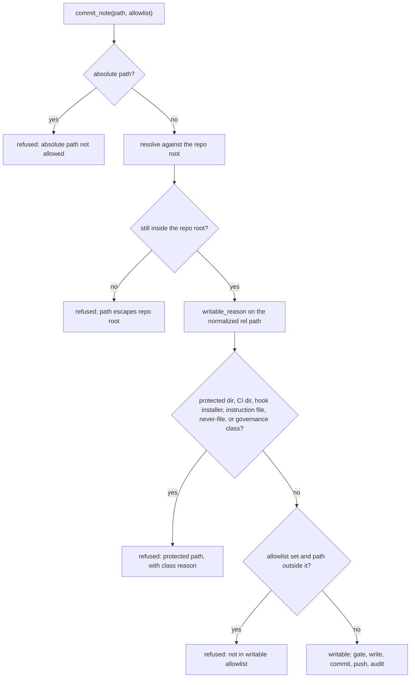

# Write Guard and Security Model

The write surface is the highest-value target in this system, and it is bounded by rules about
file classes rather than by trust in the caller. [Git-First Write Path](git-first-write-path.md)
traces the write itself end to end (`guard → frontmatter gate → commit → push → index → audit`);
this page covers what the guard actually refuses, what protects the perimeter around it, and which
risks are consciously accepted.

Two invariants are pinned here, because older prose in the repository contradicts both:

1. **The write model is a blocklist.** A note may land anywhere under the content root *except*
   the protected classes. Anything describing "allowlist by default" or a `captures/`-quarantine is
   superseded; the legacy four-prefix allowlist survives only as an opt-in narrowing.
2. **Serving is two lanes.** One public OAuth `/mcp` endpoint carries every remote client, alongside
   a tailnet read companion (`:8848`, read-only). The `:8849` client-credentials lane is retired.
   Anything describing a tailnet-only write surface is superseded. The wire details live in
   [Serving and Authentication](../surfaces/serving-and-authentication.md); this page cares about
   which lane can write and under what scope.

## The write model: blocklist, with the allowlist as narrowing

`mcp_server._effective_write_surface()` is the **sole coercion** of an operator's `--allowlist`
into an effective write surface. `None` passes straight through, which *is* blocklist mode: the
protected-path refusal plus the governance fence in `serialize.py` are the only bound. An explicit
list narrows. Because both the write tool and the read-side discovery flag consume that one value,
the two cannot disagree — discovery never advertises a path that `commit_note` would refuse
([MCP Tool Surface](../surfaces/mcp-tool-surface.md)).

`DEFAULT_WRITE_ALLOWLIST = ("notes/", "sources/", "dashboards/", "captures/")` is the old
note-zone-only surface. It is **no longer the default**; it is kept as a named escape hatch an
operator can pass to restore the narrower write surface. Read the guard module and
`_effective_write_surface`, not the older docstrings in `mcp_server.py`, for the live default.

Two construction-time refusals protect the model from misconfiguration on a write-enabled serve:

- An explicit but effectively empty allowlist is refused before any disk or backend work, because
  it would permit no writes at all — a silent brick rather than a half-open server.
- A write-capable serve with auth misconfigured (settings without a verifier, both verifiers, or
  neither) is refused at construction, so auth cannot be half-wired.

## The protected classes

`serialize.protected_reason(rel_path)` returns a refusal reason or `None`. The distinction that
makes it durable is that it encodes **file classes as rules**, not a fixed list of paths: the same
guard holds when the engine is dropped into an arbitrary repository it has never seen. The classes
are refused unconditionally, regardless of caller and **independently of any allowlist** — that
independence is the property that makes an otherwise-wide write surface safe.

| Class | Members | Why it is refused |
|---|---|---|
| Protected directories, matched anywhere in the path | `.git`, `.github`, `.obsidian`, `.claude`, `.codex`, `views`, `scripts`, `bin`, `hooks`, `skills`, `.hypermnesic` | Writing version-control internals, editor/agent config, or executable directories turns a note write into corruption or code execution. |
| CI workflow directories | any path containing both `.github` and `workflows` | A writable workflow is arbitrary code execution on the project's infrastructure. |
| Git-hook installers | files whose name starts with `install-git-hooks` | Installing a hook is execution on the next git operation. |
| Agent-instruction files, matched **anywhere including nested** | `claude.md`, `agents.md`, `gemini.md`, `.cursorrules`, `copilot-instructions.md` | Privilege escalation: whoever writes the instructions steers every future agent. |
| Never-write metadata files | `.gitignore`, `.gitattributes`, `.gitmodules` | Changing ignore/attribute rules changes what the engine can see and what git will track. |
| Governance / code-exec / build / credential class | container and build files (`dockerfile`, `makefile`, `containerfile`, `setup.py`, `setup.cfg`), package manifests (`package.json`, `package-lock.json`), credential dotfiles (`.npmrc`, `.netrc`, `.env`, `.env.*`), and the `.yml` / `.yaml` / `.lock` / `.toml` extensions | Refused **positively, by class**, because the blocklist removed the accidental exclusion that used to cover them. |

Two ordering and matching details carry real weight:

- **Directory matching is case-insensitive** (`part.lower() in _PROTECTED_DIRS`). On a
  case-insensitive filesystem `Scripts/evil.sh` lands in the protected `scripts/` directory on disk,
  so a case-sensitive comparison would report it writable. That hole was inert under the old
  allowlist and reachable under the blocklist, so it was closed when the default flipped. The
  never-write files remain case-sensitive — a logged, accepted residual rather than a fix.
- **The directory checks run before the governance fence**, so the more informative reason wins: a
  workflow file inside `.github/` is reported as a protected directory, not as a generic extension
  class. A reason never interpolates the caller's full relative path (it names only the offending
  component or class), which is what lets the folder-discovery surface echo it verbatim.

### Why a positive fence exists

An allowlist blocks dangerous classes only *by exclusion*: it refuses a `Dockerfile` because
`Dockerfile` is not one of four note prefixes, not because it recognized the file as dangerous.
Making content folders writable removed that accidental backstop, and `commit_note` enforces no
`.md` suffix, so the newly exposable classes were real code-execution and credential write targets.
The response was to refuse them by name and extension — a governance-extension denylist — matched
case-insensitively and applied after the directory checks. The exact enumerated list is signed off
in the dated review; the guard module is the authority, and the *rule* is the class rather than the
list.

*Accepted residual:* a denylist is not exhaustive, so a dangerous extension that is not on the list
could be written (for example a shell script outside a protected directory). The enumerated list is
the single extension point, and common execution directories are already protected. `node_modules/`
and `__pycache__/` content stays writable at the predicate level but is never surfaced by discovery,
because the index skips it — an agent can only reach it by guessing the literal path.

## Within-repo resolution

Classification answers *what* a path is; resolution answers *where* it is. `serialize.check()` needs
repository context for the second question, and it refuses before the file is ever read:

1. An **absolute path** (posix or native) is refused outright.
2. The path is **resolved** against the resolved repository root, and the result must be relative to
   that root. Because this is real resolution rather than string inspection, `..` traversal **and a
   symlink escape** are both caught: a symlink pointing outside the repository resolves outside it
   and is refused like any other escape.
3. The normalized repo-relative posix path is returned, so callers write to the canonical form.

It then delegates the class and allowlist decision to `writable_reason()` and re-derives its error
message from the returned reason, which preserves two distinct refusals for callers: `refused
protected path … : <reason>` versus `path … not in writable allowlist`. A sentinel value marks the
allowlist miss so the predicate itself stays path-clean.

*The guard's decision order. Resolution precedes classification and classification precedes the allowlist, so a protected path inside an allowed prefix is still refused — with the protected reason, not the allowlist one.*

## One rule for discovery and the write path

`serialize.writable_reason()` is the single source of truth for "is this path writable": protected
class refusal first, then optional allowlist narrowing. Two other surfaces consume it rather than
re-implementing it:

- **Folder discovery.** `folders.derive_folders()` classifies each folder by probing a synthetic
  `__probe__.md` **under** the prefix with the same predicate. The probe is deliberately a note,
  because that is what an agent would write, and comparing a file *under* the prefix is what keeps a
  nested protected directory (`projects/scripts/`) from being mis-reported as writable. The
  consequence is intentional and documented: a content folder can be `writable: true` for notes
  while a governance file at the same level is refused, because the fence is a per-file class bound,
  orthogonal to folder-level note placement.
- **Owner-facing write-scope answers.** `memory_control.write_scope()` derives the listing from the
  same function, and each listed memory carries a `writable` flag and `protected_reason` from
  `writable_reason()`. `hypermnesic memory` therefore answers what an agent may write using the same
  guard as `commit_note`, and the CLI `list-folders` preview reuses
  `mcp_server._effective_write_surface` so a preview cannot drift from the live surface.

## Serialization and preflight

Concurrent writers are the classic way to corrupt a projection, so the guard side ships with locks
and preflight checks:

- `FileLock` is an advisory exclusive `flock` that conflicts **across descriptors even within one
  process**, which is what makes it useful against an in-process second writer. Acquisition is
  non-blocking by default and raises `LockBusyError` instead of queueing.
- Two granularities exist: `index_write_lock()` — the single-indexer lock for broad writers, held at
  `.hypermnesic/index.lock` — and `path_lock()`, a per-path lock keyed by a hash of the relative path
  under `.hypermnesic/locks/`, so distinct paths proceed concurrently. `commit_note` and
  `rename_note` hold the index lock around their locked section.
- The process-local lock is **not** cross-process exclusion between committers. What isolates one
  writer's commit from another's staged work on a shared checkout is the path-scoped git operation
  (`git add -- <rel>`, `git commit -- <rel>`), not the lock.
- `preflight()` returns `HEAD` and raises `HeadDriftError` when `HEAD` moved out from under the base
  the caller read, and `DirtyTreeError` for broad writers on an unclean tree. Callers fetch and
  fast-forward first, so preflight sees the unresolved case. The engine's own `.hypermnesic/` state
  directory is ignored via `.git/info/exclude` (never by editing the vault's `.gitignore`), so it
  never registers as a dirty change.
- `branch_commit_transaction()` extends the same posture to multi-file changes: it lands a set of
  files as one atomic commit on a fresh branch inside a temporary worktree, leaving the owner's live
  `HEAD` untouched, and rolls back both the worktree and the half-built branch on any failure so no
  orphan ref survives. Callers gate content *before* calling, so a gate abort never creates a branch.

## Who may write

The guard bounds *where* a write may land; auth bounds *whether* a caller may write at all.

- **`write_enabled ⇒ auth-required` on any non-loopback bind.** A write-enabled serve refuses to
  start without a configured verifier, mirroring the unconditional `0.0.0.0`/wildcard refusal that
  always fires first. A loopback bind is exempt, because it is reachable only by the local user —
  the same trust boundary the CLI write path already has.
- **The tailnet opt-in is explicit and bounded.** Passing `--allow-tailnet-write` (engine
  `trust_tailnet_write=True`) accepts tailnet membership itself as the write boundary, but only when
  the bind is a literal Tailscale CGNAT address (`100.64.0.0/10`). Any other non-loopback host is
  refused with a distinct error, so the opt-in can never open an auth-off write on a public or LAN
  address. Default-off, so other deployments stay safe by default.
- **The write tool is registered only when writing is enabled.** `write_enabled` gates registration
  of `commit_note`, so a read-only serve is structurally incapable of writing.
- **The `write` scope is enforced per-tool, inside the tool.** The SDK's auth middleware applies one
  `required_scopes` list to *all* tools, so it cannot separate read clients from write clients on a
  single endpoint. `commit_note` therefore reads the authenticated principal from
  `get_access_token()` and refuses a token lacking the `write` scope **before any write**, returning
  `insufficient_scope` with an explicitly guard-preserving message: write approval allows the client
  to *request* `commit_note` and does not bypass the protected-path, frontmatter, dirty-tree,
  head-drift, audit, or git-coordination guards. A read-scoped principal leaves no file and no new
  commit.
- **Operator consent gates the `write` scope on the public lane.** Dynamic client registration lets
  any internet client register, so `authorize()` never mints a code: it stashes the request and
  redirects the browser to an operator-authenticated consent page, and only `finalize_consent()` with
  the operator's approval token issues a code. The approval token is held only as a hash and compared
  with `hmac.compare_digest`; pending requests are bounded by `PENDING_TTL_SECONDS` (600),
  `MAX_CONSENT_FAILURES` (5 wrong attempts drops the pending), `MAX_PENDING` (256), and the token
  must meet `MIN_APPROVAL_TOKEN_LEN` (24). See
  [Serving and Authentication](../surfaces/serving-and-authentication.md) for the full consent page
  and revocation surface.
- **Token verification fails closed.** The resource-server verifier returns `None` — which the
  transport turns into a 401 — on any raw-validation exception, a `None` result, an expired token, or
  a token whose audience does not include this resource server. Absence of an audience cannot be
  bound, so it is rejected too. Tokens are never logged.
- **A refusal is never a silent success.** Guard, gate, drift, coordination and input-shape failures
  all return `committed: false` with a `refused` reason instead of a raw traceback, and no audit
  entry is written when no commit reached the shared remote.

## What never leaves the process

Credentials and operator-private coordinates are read from the environment or gitignored state only,
and are never written to the index, the audit log, or any output. The discipline is enforced per
surface rather than asserted once:

- **The credential read path** is the environment or a gitignored `.env` (repo-root first, then the
  working directory). A missing key raises `ConfigError` naming only the *source categories* it
  checked; `api_key_status()` returns the same secret-free metadata — a configured flag, a source
  category, and the categories checked — never a path or a value. The key is never logged or echoed.
- **The audit log** is append-only JSONL carrying `{ts, actor, verb, path, old_sha, new_sha,
  summary}`. It records **summaries only, never page bodies**, truncating at `MAX_SUMMARY`; refusal
  entries pass through a token-shaped-string redaction before being written; the log file's history
  is never rewritten (an append leaves prior lines byte-identical). The **actor is server-set** from
  the verified node identity with a fixed sentinel fallback, and a caller-supplied actor is ignored
  outright. A reconciler back-fills entries for commits that reached `HEAD` without being logged, so
  a crash between commit and append is recoverable rather than lost.
- **`local_proof`** redacts bearer tokens, key-shaped strings, approval-token assignments, and
  operator home paths from anything it echoes, so the first-run proof can show real diffs without
  real secrets.
- **`doctor`** inspects the consent-secret file by existence and by file mode, never by value: the
  check passes only at owner-only permissions and otherwise warns with a chmod repair action.
- **The public OAuth lane's runtime state** (registered clients, codes, access/refresh tokens,
  grants) is persisted to an owner-only `0600` file, `.hypermnesic/cloud-oauth-state.json`, written
  through a temp file and `os.replace` so refresh survives restarts. The owner-facing grant store is
  a separate, deliberately **secret-free** artifact: `client_control` writes only an allowlisted set
  of metadata keys (client name, redirect origin, scopes, expiry, status) and drops anything else, so
  `hypermnesic clients` can list and revoke without ever handling credentials.
- **Folder discovery** sanitizes root-local instruction content before returning it to a remote
  client, replacing endpoint URLs and host-local absolute paths with `<endpoint-url>` and
  `<local-path>` placeholders. Guidance stays useful; host coordinates do not ship.
- **`scripts/preflight_public_scan.py`** is the enforced public-surface leak gate. It scans
  git-tracked files for operator-specific identifiers and credential material, masks every matched
  value before printing (so the gate never re-prints a secret into a console or CI log), and exits
  non-zero on a hit. It always excludes the launch-staging directory and its own script and test; in
  default mode it defers the inherited process-history docs and reports how many it deferred, while
  `--strict` scans all of `docs/` (including the archive) and `--history` adds an informational scan
  of commit diffs. Read the gate's own deny set when you need the list — citing it here would make
  this page a copy that drifts. CI runs the default gate alongside lint, tests, and the license scan.
  Write placeholders (`<your-host>.ts.net`, the `100.64.0.0/10` range) in docs and fixtures, never
  real operator values.

## The threat model, and what is accepted

`docs/threat-model-commit-note.md` is the threat model of record for this surface: a signed-off,
living root document whose vectors map to the live modules, carrying dated topology amendments.
Every subsequent review is an **immutable delta** with `amends:` / `signed_off:` frontmatter, so the
set forms an audit chain. The vectors it enumerates:

- **Write-surface vectors** — protected-path escalation, prompt injection through ingested content,
  frontmatter clobbering/churn, actor spoofing and repudiation, audit-log content leak, path
  traversal and write-outside-repo, `.gitignore`/tracked-file side effects, concurrent-writer
  corruption, credential exposure, and crash/partial-write recovery.
- **Resource-server vectors**, added when authentication moved into scope — token-validation bypass
  and the `write_enabled ⇒ auth-required` invariant, audience/issuer confusion across resource
  servers, authorization-server compromise and availability blast radius, the inverted failure mode
  where an auth bug *opens* the write tool (V14, answered by per-tool scope enforcement and a
  fail-closed verifier), and the bounded tailnet-trust write opt-in.

Two entries shape how you integrate:

- **Prompt injection is bounded, not solved.** The engine treats retrieved content as **data, not
  instructions** — it never auto-acts on retrieved text, and every write is an explicit,
  authenticated call. Even a successful injection cannot reach the protected classes, because the
  path guard bounds the blast radius. But the engine does **not** sanitize content for injection, and
  that is an explicitly accepted risk: a downstream agent harness must treat retrieved content as
  untrusted. It is stated as an integration assumption rather than left implicit.
- **Frontmatter churn is treated as corruption**, so the write aborts and surfaces the offending
  diff instead of silently reserializing someone's notes — see
  [Git-First Write Path](git-first-write-path.md).

Accepted risks, named plainly rather than implied:

| Residual | Disposition |
|---|---|
| A prompt-injected, operator-approved LLM can write a note into any content folder, not only the note zones | Accepted — this is the purpose of the widening. Mitigated in depth: protected and governance classes are unreachable, `write` needs explicit consent, every write is single-note, audited, and git-revertable, and the note-zone-only surface is still one `--allowlist` away. |
| The governance fence is a denylist, so an unlisted dangerous extension could be written | Accepted, with the enumerated list as the single extension point. |
| `_NEVER_FILES` matching stays case-sensitive (a differently cased ignore file on a case-insensitive filesystem) | Accepted as low severity — not an execution or credential vector. |
| No application-layer rate limiting on `/register`, `/authorize`, `/consent` | Accepted as an edge/funnel concern; pending caps, consent-failure caps, and consent-gating of DCR bound the app-layer exposure. |

Out of scope, deliberately: a malicious operator (the owner owns the corpus), multi-tenant
authorization, and dependency supply chain (covered by the license gate plus ordinary hygiene, not
by anything specific to the write surface).

## Changing or reviewing this surface

The files that implement this model are **security-sensitive and CODEOWNERS-routed to the
maintainer**: `src/hypermnesic/serialize.py`, `src/hypermnesic/frontmatter_gate.py`,
`src/hypermnesic/commit_note.py`, `src/hypermnesic/audit_log.py`, `src/hypermnesic/auth.py`,
`src/hypermnesic/auth_cloud.py`, and `src/hypermnesic/mcp_server.py` — together with `SECURITY.md`,
the threat model, the license and public-scan scripts, and `.github/`. A change to any of them must
cite `SECURITY.md` and the threat model, and the repository's doc-drift table requires the
write-guard change to move `SECURITY.md`, `docs/threat-model-commit-note.md`, the write-path section
of `ARCHITECTURE.md`, the write-model pins in `docs/README.md`, the write-guard bullet in
`AGENTS.md`, and `README.md`'s "How it works" in the **same PR** — the same rule applies to auth and
serving changes touching `auth*.py` / `mcp_server.py`.

Two governance rules make the audit chain real rather than decorative:

- **Dated signed-off reviews are append-only.** Each carries `amends:` / `signed_off:` frontmatter;
  a new finding is a **new dated review**, never an edit to an existing one. A signed-off review that
  can be rewritten is not evidence of anything.
- **The blocklist flip is gated by a test, not by convention.** While `_effective_write_surface(None)`
  returns `None` (the blocklist default is live), the dated blocklist review delta must exist and
  carry a non-empty, non-`PENDING` `signed_off:` value; otherwise the gate test fails and blocks
  merge/enable of the flip. Removing the sign-off frontmatter is a failing build, not a silent
  regression.

Security problems are reported **privately** — email or GitHub private vulnerability reporting, never
a public issue — and a report must not contain live tokens, hostnames, or addresses. Only the latest
released version is supported; there are no backports.

The tests that pin this behavior are the ones to run, and extend, when touching it:

| Test | Pins |
|---|---|
| `tests/test_serialize.py` | protected-path and governance-fence classes, case-insensitive directory matching, allowlist narrowing and its precedence behind the protected refusal, traversal and absolute-path refusal, rule generalization to unseen repos, lock semantics, head-drift and dirty-tree preflight |
| `tests/test_blocklist_write_gate.py` | the enforced sign-off gate: the blocklist default must not be live unless the dated review delta is signed off |
| `tests/test_auth_cloud.py` | the public lane's blocklist behavior end to end — content folders writable, governance and protected classes refused, and a read-scoped principal denied `commit_note` |
| `tests/test_mcp_server.py` | the tool contract: per-tool write-scope enforcement, actionable refusal text that leaks no credential, guard preservation (no file, no new commit) |
| `tests/test_audit_log.py` | summaries-only entries with truncation, caller-supplied actor ignored, append-only history, reconciler back-fill |
| `tests/test_preflight_public_scan.py` | the public-surface leak gate: deny-set detection, masking, scope and exclusion behavior |

## Where to look next

- [Git-First Write Path](git-first-write-path.md) — the ordered write itself, the frontmatter gate,
  and the refusal contract.
- [MCP Tool Surface](../surfaces/mcp-tool-surface.md) — the tools, including the discovery flag that
  shares the guard.
- [Serving and Authentication](../surfaces/serving-and-authentication.md) — the two lanes, consent,
  scopes, and revocation.
- [Memory and Client Control](../operations/memory-and-client-control.md) — the owner-facing
  inspect/export/forget/revert surfaces built on the same guard.
- [`SECURITY.md`](../../SECURITY.md) and
  [`docs/threat-model-commit-note.md`](../../docs/threat-model-commit-note.md) — reporting policy and
  the threat model of record.
