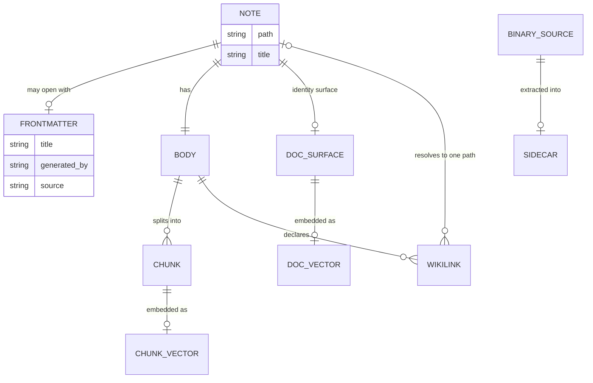

# The Note Contract: Frontmatter, Paths, Links, Provenance

Hypermnesic has one data model, and every subsystem — capture, the write path, the index, the
graph, the proposal queue, the sidecar extractor — reads and writes it. A **note** is a markdown
file at a repo-relative path inside the vault git repository, optionally opening with a YAML
frontmatter block, followed by a markdown body. The file is the durable truth; chunks, vectors,
graph edges, folder listings and dashboards are all derived from it and can be rebuilt.

This page owns the shared vocabulary of that model: frontmatter keys, path zones, generated
markers, and trust tags. Terms are defined here once and other pages link back rather than
restating them. `GLOSSARY.md` is the upstream wording source for the project's terms, and
[Architecture Overview](../architecture/overview.md) places the model inside the wider system.

**Handoffs.** The mechanics of changing a note live in
[Git-First Write Path](../architecture/git-first-write-path.md); what may never be written lives
in [Write Guard and Security Model](../architecture/write-guard-and-security-model.md); how notes
become ranked hits lives in [Retrieval and Indexing](../architecture/retrieval-and-indexing.md);
capture, triage and sidecar flows live in
[Capture and Thinking Workflows](../workflows/capture-and-thinking.md); the generated review
surfaces live in [Review and Navigation Workflows](../workflows/review-and-navigation.md).

## The shape of a note

*A note and its projections. Frontmatter and body are the durable inputs; chunks, vectors and wikilink edges are index-side projections of them, and a sidecar is one kind of note generated from a binary source.*

- **Frontmatter is optional.** `frontmatter_gate.split_frontmatter()` splits a note into the inner
  YAML and the body, and the two reconstruct the file exactly as `"---\n" + fm + "---\n" + body`.
  A note with no frontmatter block is a valid note: a body replacement is allowed, while asking to
  set or delete frontmatter fields on it raises `ValueError("no frontmatter to edit")` instead of
  silently creating a block.
- **The body is what gets indexed.** `ingest.strip_frontmatter()` removes frontmatter before
  chunking, so no frontmatter text ever reaches chunk rows, the FTS projection or the wikilink
  graph. Frontmatter influences search only through the separately computed **doc surface**
  (title + all headings + lead paragraph) that feeds the doc-level embedding lane.
- **The path is the universal key.** Chunk rows, the docs lane, wikilink edges, audit entries,
  proposals, guard verdicts and folder listings all join on the same repo-relative posix path.
  Renaming a note is a re-key of the same content, not a new note.

### Display identity versus path

The path identifies a note to the machine; a **title** identifies it to a reader. Title resolution
is one fixed precedence chain in `ingest.note_title()`: frontmatter `title:` first, then the first
level-1 ATX heading, then the path stem de-kebabbed and with a leading ISO date removed. A section
heading (`## …`) is never mistaken for identity. `title:` is therefore the one frontmatter key the
engine reads as note identity; the only other frontmatter keys any engine code inspects are the
sidecar's own provenance keys, by the extraction hash gate.

## Frontmatter: who owns which key

Frontmatter is not a free-form scratch pad: each key has an owner, and a write may only touch the
keys it was asked to touch.

| Key | Owner | Contract |
|---|---|---|
| `title` | caller (`set_fields`) or a generated writer | The only engine-read key of note identity: display title and the head of the doc surface. |
| `type` | generated writers (`dashboard`, `triage`) | Descriptive metadata for humans and Obsidian/Bases — no engine code reads `type:`. |
| `generated_by` | forced by `generated.render()`; also set in the `.base` YAML | The demarcation marker. `is_generated()` detects exactly `generated_by: hypermnesic`. |
| `generated_at` | generated writers, only when a timestamp is passed in | Records when the surface was rendered. |
| `source` | `sidecar` only (`source: sidecar`) | The trust tag marking extracted, untrusted-origin content. |
| `extracted_from`, `extracted_at`, `source_sha256`, `extractor`, `extractor_version`, `_extraction_quality` | `sidecar` only | Content-addressed provenance: what was extracted, from which bytes, by which extractor at which version, and at what fidelity (`ok`/`partial`/`low`). |
| `related_to`, `belongs_to` | caller | Frontmatter links. Deliberately **not** graph edges — see below. |
| `_`-prefixed properties (e.g. `_organized`, `_icon`) | Obsidian/Tolaria plugins | Preserved byte-identically by the frontmatter gate; the engine interprets none of them, apart from writing its own `_extraction_quality`. |
| `tags`, `status`, `created`, `sources`, and any other key | caller, only when explicitly requested | Authoring metadata. Never re-serialized unless it was requested. |
| `salience` | nobody | No score is ever written into a source note's frontmatter; the ranking lives only in the generated digest. |

The caller-owned surface is `set_fields` — a YAML mapping of fields to set or merge, passed to
`commit_note` (and to the MCP write tool with the same name). A **new** file is rendered from
exactly that mapping, so a brand-new note can legitimately carry no frontmatter at all: that is
precisely how a raw capture lands.

`propose` owns no key of its own. It routes a change to one of two places — the free-append
commit for a new file in an append zone, or a gated branch commit for everything else — and in both
cases the frontmatter in the resulting note is exactly what the caller (or a generated writer)
supplied.

### The frontmatter edit rules

These are contract invariants, not implementation detail — the mechanics are on
[Git-First Write Path](../architecture/git-first-write-path.md):

- **Only requested keys may change.** `changed_keys()` compares frontmatter as per-key line blocks,
  so an addition, a removal, or a **reordering** of top-level keys all count as drift;
  `assert_only_changed()` then raises `FrontmatterDriftError` carrying the offending keys and a
  unified diff. The abort happens before the file is written, so a refusal leaves the tree, `HEAD`,
  the index and the audit log untouched.
- **Untouched bytes stay untouched.** Editing one key leaves scalar dates scalar (not ISO),
  preserves key order, and preserves `_`-prefixed properties — the property that makes
  review-gated maintenance safe and stops whole-file frontmatter churn.
- **A body-only edit cannot perturb frontmatter**, and a document written in an unfamiliar YAML
  style **aborts rather than churns**: a visible refusal beats a silent reformat of someone's
  notes.

## Wikilinks are the graph edges

The knowledge graph is built from **body** wikilinks only. Frontmatter links are not edges, and
because frontmatter is stripped before chunking the graph never sees it at all.

- A link is `[[target]]` or `[[target|display]]`; `|display` aliases and `#anchor` fragments are
  stripped before resolution.
- Resolution matches the normalized path with or without a `.md` suffix, case-insensitively; a bare
  name is accepted only when exactly one page shares its stem. An ambiguous or missing target
  resolves to `None` — a tolerated **dead link**, never a guess and never an error. Self-links are
  dropped.
- `Graph.resolve()` is the public entity-resolution verb and uses the same matcher, so resolving an
  entity can never produce a wikilink the graph would not bind. A `None` result means "do not
  guess".
- `build_context()` traverses both incoming and outgoing edges to a bounded depth, excludes the
  start note, terminates on cycles, and returns a deterministic (sorted) path list.

The practical consequence for authors: a link only becomes an edge when its target exists at the
path or unique stem it names, and a link that stops resolving (for example after a move) degrades
to a dead link instead of breaking retrieval.

## The folder taxonomy and path zones

`folders.derive_folders()` turns the index's path set into a bounded, sorted listing —
`{root, depth, folders, truncated, omitted}` — where each folder carries
`{path, writable, protected_reason, note_count}` and the note count is recursive.

Two properties make the listing trustworthy:

- **Writability is single-sourced from the write guard.** The flag is the guard's own verdict on a
  synthetic `__probe__.md` placed **under** the prefix, so discovery cannot advertise a folder that
  a note write would refuse — a nested protected directory such as `projects/scripts/` is correctly
  reported non-writable even though its parent is writable.
- **Paths come from the index**, so skip directories (`.git`, `.hypermnesic`, `node_modules`,
  `__pycache__`, `.obsidian`) are structurally undiscoverable rather than filtered by a second
  rule.

The listing is bounded by the config-owned `LIST_FOLDERS_MAX_NODES` and `LIST_FOLDERS_MAX_DEPTH`
(see [Configuration and Tunables](../operations/configuration-and-tunables.md)), sorted **before**
the cap so truncation drops a deterministic tail and reports `truncated` plus an `omitted` count.
A caller-supplied `root` is normalized to a repo-relative trailing-slash prefix; an absolute path
or `..` traversal is rejected outright.

### Path zones

| Zone | Tier | Written by | Contract |
|---|---|---|---|
| `sources/` (including `sources/captures/`, where `capture` lands `sources/captures/<stamp>-<sha6>.md`) | Immutable free-append | `capture`, and the `propose` fast path | A **new** file is committed straight to `HEAD` with no proposal friction; an existing file here is never overwritten. |
| `sidecars/` | Curated, generated | `sidecar` | One content-addressed extraction per non-markdown source at `sidecars/<source_rel>.md`, approved through the proposal queue. |
| `dashboards/` | Curated, generated | `nav_surface`, `salience`, `connect`, `daily_review`, `capture.triage` | Generated surfaces, proposed with the scope `dashboards/`. Chosen deliberately, because the guard-protected `views/` cannot host them. |
| `notes/`, `projects/`, `people/`, and other content folders | Curated | agents via `commit_note` | Free-form authored notes. Placement is the author's choice except for the protected classes. |
| `.git/`, `.github/`, `views/`, `scripts/`, `bin/`, `hooks/`, `skills/`, `.obsidian/`, `.hypermnesic/`, agent-instruction and governance files | Refused | nobody | Not a zone but a refusal class — see [Write Guard and Security Model](../architecture/write-guard-and-security-model.md). |

### Immutable append zones

`IMMUTABLE_APPEND_ZONES` in `config.py` is an **explicit path-prefix list**, not a heuristic, and
it is configuration-owned: read the value and its consequence on
[Configuration and Tunables](../operations/configuration-and-tunables.md). `capture` depends on the
tier existing, so the list is a dependency of the capture workflow rather than a tuning detail.

The routing rule is strict in both directions:

- The free-append fast path applies only when **every** change in a proposal is a **new** file
  (absent at `HEAD`) inside an append zone. Those files are committed straight to `HEAD` by the
  same gated write primitive, so a capture is durable immediately.
- Anything else — an existing file in an append zone, or any curated path — becomes a gated
  proposal branch for review. A curated change can never reach the fast path.

## Generated artifacts are demarcated twice

A generated note must be unmistakable as generated, in an editor and in a rendered reading view
where frontmatter is collapsed. So `generated.render()` produces both:

1. `generated_by: hypermnesic` in the frontmatter, and
2. a visible **managed block** — an Obsidian callout reading
   `> [!hypermnesic] generated — edits below this marker are overwritten`, closed by the marker
   `<!-- /hypermnesic:generated -->`.

The region between the markers is the part regeneration overwrites; the honest contract is that
hand edits inside it will not survive. The generated `.base` view config, which cannot carry a
callout, instead carries `generated_by` in its YAML plus a leading comment line stating that edits
are overwritten.

Note kind is **derived, never registered**: `is_generated()` detects the marker, and the owner
surfaces classify a memory as `generated` (marker present), `captured` (path under `sources/`) or
`authored` (everything else). There is no enforced note-type schema; `type:` is descriptive.

Generated surfaces are produced as proposals, never applied directly. The current set of paths is
fixed by the modules that render them — the MOC and Bases dashboard, the salience digest, the
connection suggestions, the daily review, and capture triage notes (a generated
`dashboards/triage-<slug>.md` carrying `type: triage`) — and the approval mechanics are on
[Review and Navigation Workflows](../workflows/review-and-navigation.md). The one related invariant
worth stating here: **no derived score is ever written back into a source note's frontmatter.**
Salience rankings live in the digest, not in the notes they rank.

## Sidecar provenance and the trust tag

Non-markdown sources (PDF, DOCX, XLSX, PPTX, images) become retrievable through a **sidecar**: a
generated markdown note at `sidecars/<source_rel>.md` (so `docs/report.pdf` yields
`sidecars/docs/report.pdf.md`) whose frontmatter is the provenance record:

- `source: sidecar` — the trust tag;
- `generated_by: hypermnesic` — the demarcation marker;
- `extracted_from`, `extracted_at`, `source_sha256` — which source and which exact bytes;
- `extractor`, `extractor_version` — which tooling produced the text;
- `_extraction_quality` — an honest fidelity flag of `ok`, `partial` or `low`.

Two rules follow from that shape:

- **Re-extraction is hash-gated.** A sidecar is built only when there is no sidecar yet, when the
  source's content hash no longer matches `source_sha256`, or when the extractor version is bumped.
  An unchanged source is never re-extracted, so there is no churn.
- **A sidecar is never silently overwritten.** A changed source becomes a review-gated
  re-extraction proposal, and the one-time cold start over a whole corpus is a single batched
  proposal rather than a pull request per file.

`sidecar.trust_tag()` classifies a note as `sidecar` — by the `sidecars/` path convention or by a
`source: sidecar` frontmatter key — and everything else as `source`. This is the SEC-001
untrusted-content boundary marker: sidecar text comes from arbitrary binaries and is readable by
write-capable agents, so the tag exists to let a future phase restrict those chunks from write
tools. The accepted posture today is *accept* (owner corpus, tailnet); no index column stores the
tag yet, so no query can filter on it.

## What belongs in durable memory

The note contract says what a note *is*; the memory taxonomy says what is worth making one out of
(`docs/guides/memory-taxonomy.md`). Classify a candidate on five dimensions before writing:
duration (does it outlive the session?), type, scope, update strategy (append-only evidence versus
curated current state versus generated summary), and retrieval mode (which paths, headings and
wikilinks make it findable).

**Durable project memory** — semantic facts, episodic/source evidence, procedural/policy rules,
generated summaries that cite their sources, raw captures, and current-state mirrors of external
reality.

**Not durable project memory by default** — behavioural preferences such as "user likes terse
replies" (an adjacent session/behavioural layer such as Honcho), in-flight session state, transient
inferences about a person, secrets and credentials, unreviewed sensitive personal material, and
workarounds for a guard refusal. A guard refusal is a control signal, not an obstacle.

Evidence first: preserve the raw capture before summarising it. A generated summary cites source
paths, labels itself as generated, and never silently replaces a raw capture; removing or correcting
a source is a new git event through the memory-control preview/apply flow, with audit context,
rather than an edit that erases history.

## Invariants worth knowing

- Frontmatter and body are the durable truth; every other structure on this page is rebuildable.
- A write changes only the frontmatter keys it requested — anything else aborts with a diff.
- A note may have no frontmatter; asking to set fields on one is refused, not guessed.
- A wikilink that does not resolve to exactly one note is a dead link, never an error and never a
  guess.
- Discovery and the write path share one writability rule, so the two cannot disagree.
- A path in an immutable append zone accepts a new file and never an overwrite.
- A generated artifact is marked twice (frontmatter and visible marker) so it cannot be confused
  with an authored note, and its marked region is regenerated.
- A sidecar is regenerated only on a source-hash or extractor-version change, and always through the
  proposal queue.
