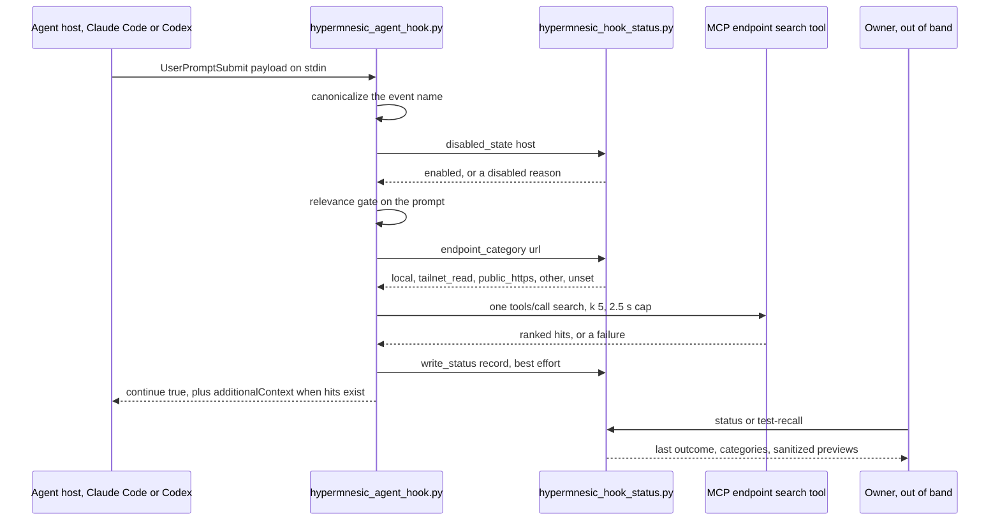
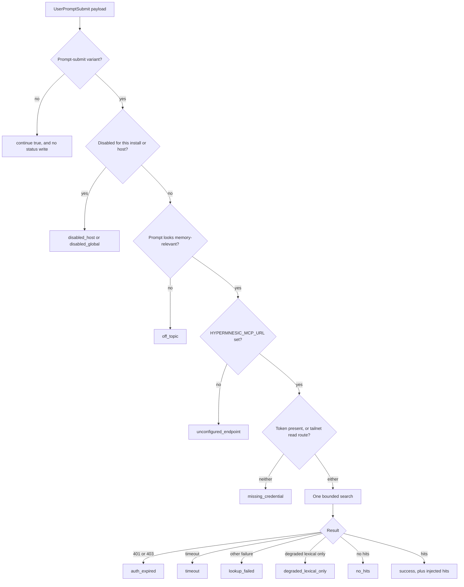

# Agent Plugins, Hooks, and Companions

The engine is a server plus a CLI. Everything on this page is about how *client* agents reach
it without an operator hand-wiring each one. Three surfaces exist, and they are deliberately
not one thing:

| Surface | Lives in | Transport | How it is loaded |
|---|---|---|---|
| Claude Code + Codex pack | `plugin/plugins/hypermnesic/` | MCP over HTTP, OAuth 2.1 | marketplace install |
| Hermes Agent pack | `plugin/hermes/` | the local `hypermnesic` CLI | `register(ctx)` |
| Obsidian companion | a separate repository | read-only MCP wire | Obsidian |

Only the first two live in this repository. The Hermes pack does **not** consume the
Claude/Codex manifests or their MCP wiring, and the Obsidian companion is not here at all —
keeping them separate is what lets the license boundary hold (`repo://plugin/README.md`,
`repo://obsidian-plugin/README.md`).

## The Claude Code + Codex pack

```text
plugin/
  .claude-plugin/marketplace.json          # local-directory marketplace listing
  plugins/hypermnesic/
    .claude-plugin/plugin.json             # Claude manifest (skills path only)
    .codex-plugin/plugin.json              # Codex manifest (skills + interface)
    .mcp.json                              # OAuth-discovery MCP wiring
    skills/hypermnesic-memory/SKILL.md     # the skill: when and how to use memory
    hooks/hooks.json                       # exactly one UserPromptSubmit hook
    hooks/scripts/hypermnesic_agent_hook.py     # the hook
    hooks/scripts/hypermnesic_hook_status.py    # status + test-recall helper
```

**The skill is the primary surface.** Its description is always discoverable, so the agent
reaches for `search`, `build_context`, `think`, `resolve`, `list_folders`, and `commit_note`
when memory is actually relevant — an on-demand path with no per-turn cost. The hook below is
strictly an optional addition on top of it. See
[MCP Tool Surface](../surfaces/mcp-tool-surface.md) for those tools' contracts and
[The Note Contract](../concepts/note-contract.md) for what a note is.

Two marketplace manifests exist on purpose. Claude Code only discovers `marketplace.json` at a
checkout *root*, never in a subdirectory, so the repository carries one at
`.claude-plugin/marketplace.json` — which is what makes the no-checkout install work:

```sh
claude plugin marketplace add leonardsellem/hypermnesic
claude plugin install hypermnesic@hypermnesic
```

— alongside `plugin/.claude-plugin/marketplace.json`, the source used when adding an in-repo
`plugin/` directory instead (`claude plugin marketplace add <path>/plugin`). The root
manifest's plugin entry points its `source` at `./plugin/plugins/hypermnesic` and declares no
`version` or `description`; those live solely in the plugin manifest, so a version bump touches
one file and the two listings cannot drift (`repo://plugin/README.md#L90-L111`,
`repo://.claude-plugin/marketplace.json#L11-L18`).

The Claude manifest deliberately declares **only** a skills path. Claude Code auto-discovers
`hooks/hooks.json` and `skills/`, so the manifest must not re-reference the standard hook file:
a duplicate hooks file fails the *entire* plugin load — skill and hooks both go dead. That
regression is pinned by a test, so the manifest stays silent about hooks on purpose
(`repo://plugin/plugins/hypermnesic/.claude-plugin/plugin.json#L1-L11`,
`repo://tests/test_plugin.py#L67-L80`).

The Codex manifest declares the same shared skills directory plus an `interface` block that
points at the same `hooks/hooks.json` and declares `--host codex` as its host flag — the host
identity the hook script accepts and records
(`repo://plugin/plugins/hypermnesic/.codex-plugin/plugin.json#L9-L13`).

Plugin manifests carry a version, and every version slot in the repository must agree with the
authority `[project].version` in `pyproject.toml` and the mirror in
`src/hypermnesic/__init__.py`. Do not enumerate the slots from memory:
`scripts/check_version_consistency.py` names every one it checks and fails the build on drift,
reporting both the diverging file and both versions
(`repo://scripts/check_version_consistency.py#L1-L23`).

## The MCP wiring carries no token, on purpose

`.mcp.json` declares one `streamable-http` server whose URL is templated from the environment:

```json
{ "mcpServers": { "hypermnesic": {
  "type": "streamable-http",
  "url": "${HYPERMNESIC_MCP_URL:-https://YOUR-HYPERMNESIC-HOST/mcp}" } } }
```

There is **no `auth` block, no `token_env`, and no static `Authorization` header**, and that
omission is load-bearing: a static header would suppress the OAuth discovery the host performs
from `{type, url}` alone. On first connect the host discovers the Authorization Server, opens a
browser once for the operator to authorize — read by default, `write` explicitly approved at
the consent page to enable `commit_note` — then stores and silently refreshes the token. See
[Serving Topology and Authentication](../surfaces/serving-and-authentication.md).

The wiring is also distribution-generic: no operator hostname, no tailnet address, no absolute
home path, no token value. Tests scan the whole published plugin tree for committed secrets and
operator-specific values, and assert the wiring keeps the env-templated URL, stays free of
`auth`/`token_env`/`Authorization`/`Bearer`, and never inlines a token
(`repo://tests/test_plugin.py#L104-L116`, `repo://tests/test_plugin.py#L124-L153`).

## The auto-recall hook

`hooks/hooks.json` wires exactly **one** event — `UserPromptSubmit` — to the hook script with a
6-second host timeout:

```text
${CLAUDE_PLUGIN_ROOT}/hooks/scripts/hypermnesic_agent_hook.py --host claude
```

There is no `SessionStart` preamble and no Bash interception: the hook does one thing
(`repo://plugin/plugins/hypermnesic/hooks/hooks.json#L1-L15`). The single event is asserted by a
test, not left to convention (`repo://tests/test_plugin_hook.py#L78-L84`).



*A prompt becomes injected context through one bounded search, while the owner inspects the decision out of band.*

### The gate ladder, and the outcome each rung reports

Order matters: every gate before the network call is cheap, so an off-topic or unconfigured
prompt costs nothing and the hook can never become a per-turn latency tax.



*Every run lands on exactly one stable outcome code, whether or not it injected anything.*

The relevance gate is the only heuristic in the path, and it is deliberately blunt: memory-ish
phrasing (`remember`, `recall`, `memory`, `context`, `what do we know`, `last time`,
`decision`, …) **or** a multi-word capitalised proper noun, which is a cheap bet on "this prompt
names an entity we might have a note about"
(`repo://plugin/plugins/hypermnesic/hooks/scripts/hypermnesic_agent_hook.py#L44-L69`).

The lookup itself is one JSON-RPC `tools/call` for `search` with `k=5` and a 2.5-second cap. At
most five hits are rendered as `path: heading — snippet`, snippets flattened to one line and
trimmed to 200 characters, and the newline flattening is applied to `path` and `heading` too —
so a stored note cannot forge extra lines in the injected block
(`repo://plugin/plugins/hypermnesic/hooks/scripts/hypermnesic_agent_hook.py#L107-L138`,
`repo://plugin/plugins/hypermnesic/hooks/scripts/hypermnesic_hook_status.py#L172-L217`,
`repo://tests/test_plugin_hook.py#L214-L226`).

### Why the hook can never block a turn

Silence is the default and the contract. Every path through `handle()` returns
`{"continue": true}`; context is added only through
`hookSpecificOutput.additionalContext`. A payload that is not valid JSON prints a diagnostic to
stderr and still emits a clean `{"continue": true}` on stdout with exit code 0. Any event that
is not a prompt-submit variant (`messagepreprocessed`, `messagereceived`, or an absent event
name are treated as variants) is inert and does not even write a status record
(`repo://plugin/plugins/hypermnesic/hooks/scripts/hypermnesic_agent_hook.py#L141-L173`,
`repo://tests/test_plugin_hook.py#L178-L191`).

### Why the hook has its own credential path

The hook **cannot** ride the app's OAuth login. Claude Code exposes no stored MCP OAuth token
to hook subprocesses — the `UserPromptSubmit` payload carries no credential — so the working
remote path is the retained tailnet read route: an auth-off read companion reachable from any
tailnet device, which needs only a URL.

So `HYPERMNESIC_MCP_TOKEN` is **optional**, used only to build an `Authorization` header, and
never written to stdout, stderr, or the injected text. When no token is set and the configured
endpoint is *not* a tailnet read route, the hook stops at `missing_credential` rather than
sending an unauthenticated request. The token-free case is identified structurally: a URL whose
host parses as an IP in the `100.` CGNAT range is classified `tailnet_read`
(`repo://plugin/plugins/hypermnesic/hooks/scripts/hypermnesic_agent_hook.py#L1-L19`,
`repo://plugin/plugins/hypermnesic/hooks/scripts/hypermnesic_hook_status.py#L62-L86`,
`repo://tests/test_plugin_hook.py#L127-L169`).

This is the **one documented exception** to "no token". The MCP tool wiring stays
OAuth-discovery-only; only the hook's own bounded read may need a credential.

## Observing a hook that is silent by design

A silent hook is ambiguous: it injects nothing whether the prompt was off-topic, the endpoint
was unreachable, or the token expired. So every run records a small non-secret status record
**out of band**, and an owner diagnoses recall without reading hook source and without polluting
a prompt.

`last_outcome` is one of a fixed, stable set, each mapped to a plain-language explanation:

| Outcome | Meaning |
|---|---|
| `never_run` | no status file exists yet |
| `off_topic` | the prompt did not look memory-relevant, so no lookup ran |
| `disabled_global` | auto-recall is disabled for this plugin install |
| `disabled_host` | auto-recall is disabled for this host |
| `unconfigured_endpoint` | no hook endpoint URL is configured |
| `missing_credential` | the configured route appears to require a credential |
| `auth_expired` | the credential was refused or has expired |
| `timeout` | the lookup timed out before returning context |
| `lookup_failed` | the lookup failed before returning usable results |
| `no_hits` | the lookup completed and found nothing relevant |
| `degraded_lexical_only` | recall worked, in lexical-only degraded mode |
| `success` | recall returned bounded context |

The record holds **categories, not values**: `endpoint_category`
(`local` / `tailnet_read` / `public_https` / `other` / `unset`) and `credential_category`
(`token_present` / `not_required_tailnet` / `missing`), plus the host, enabled state and
disabled reason, `endpoint_configured`, hit count, degraded flag, `test_initiated`, and
timestamps. The full prompt, the endpoint URL, the token, the `Authorization` header, and raw
large snippets are never stored — asserted, not just intended
(`repo://plugin/plugins/hypermnesic/hooks/scripts/hypermnesic_hook_status.py#L20-L35`,
`repo://plugin/plugins/hypermnesic/hooks/scripts/hypermnesic_hook_status.py#L101-L160`,
`repo://tests/test_plugin_hook.py#L229-L263`).

Two robustness rules make the status surface safe to depend on. Writes are **best-effort and
atomic** — the record is merged over the previous one (preserving the last successful
`last_recall_at`), written to a temp file, and renamed; the whole operation is wrapped so an
unwritable path can never block the hook, and that case is tested. And a **missing** file reads
back as `never_run` with live environment state layered in, not as an error
(`repo://plugin/plugins/hypermnesic/hooks/scripts/hypermnesic_hook_status.py#L117-L160`,
`repo://tests/test_plugin_hook.py#L311-L342`).

The status file defaults to `${HYPERMNESIC_HOOK_STATUS_FILE}` when set, otherwise
`$XDG_STATE_HOME/hypermnesic/hook-status.json` (i.e. `~/.local/state/...` by default)
(`repo://plugin/plugins/hypermnesic/hooks/scripts/hypermnesic_hook_status.py#L42-L48`).

The helper script is not a `hypermnesic` CLI subcommand — it ships inside the plugin and is run
from the installed plugin checkout:

```sh
hooks/scripts/hypermnesic_hook_status.py status --json --host claude
hooks/scripts/hypermnesic_hook_status.py test-recall "Project Atlas" --json --host claude
```

`status` prints the stored record. `test-recall` runs the *same* bounded lookup path for an
explicit query, prints sanitized path/heading/snippet previews (capped at 240/160/200
characters), and marks the record `test_initiated` so a diagnostic run is distinguishable from
real traffic (`repo://docs/reference/cli.md#L189-L209`,
`repo://tests/test_plugin_hook.py#L344-L390`).

Proactive recall can be paused without uninstalling anything, and both switches are checked
*before* the relevance gate, so a disabled hook does no work at all:

```sh
export HYPERMNESIC_HOOK_DISABLE_LOOKUP=1          # this plugin install
export HYPERMNESIC_HOOK_DISABLED_HOSTS=codex      # one host, comma-separated
```

They affect auto-recall only: MCP tools remain available through OAuth discovery and local CLI
use is untouched (`repo://plugin/README.md#L113-L138`,
`repo://docs/guides/getting-started.md#L257-L265`,
`repo://tests/test_plugin_hook.py#L266-L293`).

## The Hermes pack

Hermes talks to the **local CLI**, not to MCP. `plugin/hermes/plugin.yaml` declares the plugin,
the `pre_llm_call` hook it provides, and the one environment variable it requires —
`HYPERMNESIC_REPO`, explicitly marked non-secret
(`repo://plugin/hermes/plugin.yaml#L1-L9`).

`register(ctx)` is the whole entrypoint. It **always** registers the namespaced skill
`hypermnesic-memory`, and registers the `pre_llm_call` recall hook **only** when
`HYPERMNESIC_HERMES_RECALL` is truthy (`1`, `true`, `yes`, `on`) — proactive recall here is
opt-in, the opposite default from the Claude/Codex pack
(`repo://plugin/hermes/__init__.py#L34-L35`,
`repo://plugin/hermes/__init__.py#L118-L121`,
`repo://tests/test_hermes_plugin.py#L64-L108`).

When enabled, the hook shells out to
`hypermnesic retrieve <repo> <query> --k 3 --now --json` (appending `--index-db` when
`HYPERMNESIC_INDEX_DB` is set) under a 3-second timeout, and returns at most three hits capped
at 1400 characters total, with a 500-character query cap, paths cleaned to 180, headings to 120,
and snippets to 280 characters. Every failure returns `None`, which is silence: an irrelevant
message, an unset `HYPERMNESIC_REPO`, a missing CLI, a non-zero exit, unparseable JSON, no hits,
or a timeout. Its relevance gate is weaker than the Claude/Codex gate — an 8-character minimum
plus a term list, with no proper-noun branch
(`repo://plugin/hermes/__init__.py#L15-L31`,
`repo://plugin/hermes/__init__.py#L59-L115`,
`repo://tests/test_hermes_plugin_hook.py#L45-L132`).

Two structural facts matter more than the code:

- **Hermes skills are namespaced**, so the registered skill shows up as
  `hypermnesic:hypermnesic-memory` and is *not* part of the flat available-skills prompt index.
  For stronger automatic visibility an operator can copy the optional flat export at
  `plugin/hermes/flat-skill/hypermnesic-memory/` into their ordinary Hermes skills directory. A
  test requires the flat copy to stay byte-identical to the namespaced skill, so the two cannot
  drift (`repo://plugin/hermes/README.md#L26-L38`,
  `repo://tests/test_hermes_plugin.py#L123-L124`).
- **The pack is independent by construction.** Tests assert the Hermes package contains no MCP
  transport assumptions and no Claude/Codex loader assumptions — no `.mcp.json`, no MCP CLI
  commands, no `HYPERMNESIC_MCP_TOKEN`, no `Authorization`/`Bearer`, no `UserPromptSubmit`, no
  `.claude-plugin`/`.codex-plugin` references, and no operator-specific values or secrets. Its
  write story is the CLI's: `capture` for raw intake, `commit-note --commit` for a guarded
  durable write, and no implicit writes from plugin enablement or proactive recall
  (`repo://tests/test_hermes_plugin.py#L127-L161`,
  `repo://plugin/hermes/skills/hypermnesic-memory/SKILL.md#L46-L61`).

## The Obsidian companion boundary

The companion is **not in this repository**. `obsidian-plugin/README.md` is a pointer to its own
public repository, [`leonardsellem/hypermnesic-companion`](https://github.com/leonardsellem/hypermnesic-companion),
whose first release is **0.3.0**. It builds, tests, and ships from there under
**GPL-3.0-or-later**, while the engine here is **AGPL-3.0-only**.

The two communicate only at arm's length over the read-only MCP wire (`search` /
`build_context` / `think`), as separate processes with no shared or statically linked code, so
neither is a derivative of the other. That reasoning is conditional and worth restating in the
form it is enforced: it holds **only while the companion does not vendor, import, or statically
link engine source** — the read-only-over-the-wire invariant. The companion enforces it with a
static read-only invariant scan in its own suite (`test/read-only.test.ts`, ported from the
former `tests/test_obsidian_plugin.py` in this repo, which no longer exists)
(`repo://obsidian-plugin/README.md#L1-L23`, `repo://README.md#L379-L385`).

In the daily loop, Obsidian is a **review and navigation** surface: capture backlog, generated
dashboards, daily-loop notes, and source paths. Write, cleanup, revoke, forget/delete, and
revert stay in the git-first CLI/MCP surfaces. A read-only client cannot bypass consent, write
scope, protected-path refusals, or any server-side guard — see
[Write Guard and Security Model](../architecture/write-guard-and-security-model.md).

## What keeps these packs honest

The plugin trees are configuration and prose consumed by *host* harnesses rather than by the
engine runtime, so their correctness properties are checked **statically** in the offline test
suite, and a live install on both hosts is the separate manual verification
(`repo://tests/test_plugin.py#L1-L9`):

- `tests/test_plugin.py` — the marketplace entry resolves to the real plugin directory, both
  manifests parse with required fields, the Claude manifest does not re-declare the auto-loaded
  hook file, the skill frontmatter parses and names only real engine tools, the skill stays
  user-neutral (no migration steering, no operator endpoint) and teaches the disk-first model,
  no secret is committed in the tree, the MCP wiring stays discovery-only, and no
  operator-specific value appears anywhere under `plugin/`.
- `tests/test_plugin_hook.py` — one wired event; injection on a relevant prompt; silence on
  off-topic, malformed, unconfigured, auth-failure, timeout, and no-hit paths; the token-free
  tailnet read route; `Authorization` present only when a token exists and never echoed;
  newline sanitization; the recorded outcome code for each gate; the unwritable-status-path
  guarantee; and `test-recall` boundedness and redaction.
- `tests/test_hermes_plugin.py` and `tests/test_hermes_plugin_hook.py` — the Hermes manifest and
  skill contracts, opt-in hook registration, bounded CLI invocation, silence on every failure,
  the flat-skill identity, and the no-MCP/no-token independence invariants.

## Related pages

- [MCP Tool Surface](../surfaces/mcp-tool-surface.md) — what the skill teaches the agent to call.
- [Serving Topology and Authentication](../surfaces/serving-and-authentication.md) — the public
  OAuth lane and the tailnet read companion the hook rides.
- [Provisioning and Diagnostics](../operations/provisioning-and-diagnostics.md) — getting a host
  working and proving it works.
- [The Note Contract](../concepts/note-contract.md) — the data model behind every hit.
