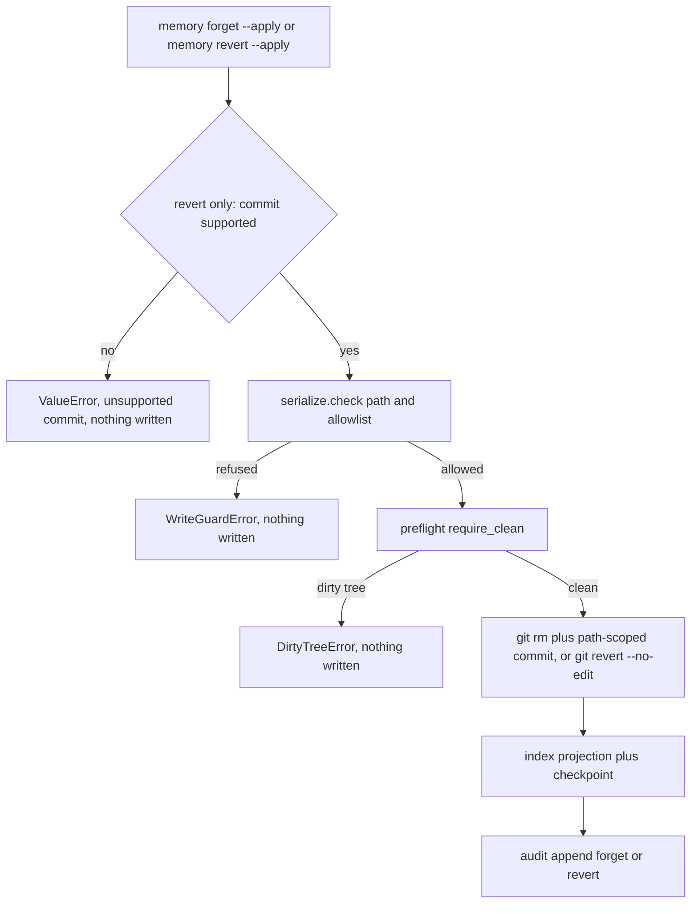
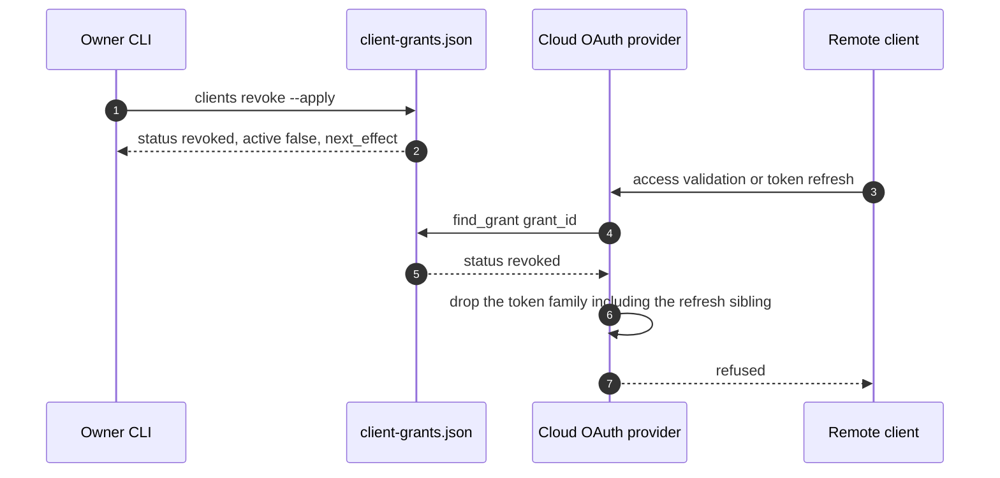

# Memory and Client Control

Two owner questions — *what does this system remember about me?* and *who is allowed to reach
it?* — are answered by two engine-host CLI groups, `hypermnesic memory` and `hypermnesic clients`.
Both are **owner surfaces**: neither is exposed as an MCP tool, so a connected client cannot list
its own grant, revoke a peer, or delete a memory. See
[MCP Tool Surface](../surfaces/mcp-tool-surface.md) for what a client *can* call.

What makes these surfaces trustworthy is that they add no new store of record. `memory_control.py`
and `client_control.py` are read-and-act layers over objects that already exist — the vault's git
tree, the disposable index, the append-only audit log, and a secret-free grant metadata file.
`memory_control`'s module docstring states the rule directly: the markdown/git tree remains the
source of truth and this module "does not introduce a second memory store."

**Handoffs.** Guard semantics (which paths are refused, and why) live in
[Write Guard and Security Model](../architecture/write-guard-and-security-model.md). The write those
guards bound is traced in [Git-First Write Path](../architecture/git-first-write-path.md). Note
anatomy and frontmatter vocabulary are in [The Note Contract](../concepts/note-contract.md). The
consent page, scopes, the two serving lanes, and the live-token state file are covered by
[Serving and Authentication](../surfaces/serving-and-authentication.md); this page covers the
owner-side control of grants, not the OAuth provider's own machinery.

## What backs an answer

| Backing object | Role for these surfaces |
|---|---|
| Vault git worktree | The truth about what exists and what changed. Presence, `last_commit`, commit history, and every destructive effect are git outcomes. |
| Disposable index (`<repo>/.hypermnesic/index.db`) | Membership (`all_paths()`), the snippet text, and the two degradation flags. Rebuildable, never authoritative. |
| Append-only audit log (`<repo>/.hypermnesic/audit.jsonl`) | Who wrote what, and the recent-history view. Summaries only, never bodies. |
| Grant metadata store (`<repo>/.hypermnesic/client-grants.json`) | The client listing and revocation marker. Secret-free by construction. |

Each path is overridable: `--index-db`, `--audit-log` and `--grant-store` exist precisely so the
control surfaces can be pointed at a non-default layout. Every stored object lives under the
engine's own state directory, which is excluded from git via `.git/info/exclude` — so audit history
and grant metadata are *not* themselves committed content, and no control action ever stages them.

## Reading memory back

### `memory list` and `memory inspect`

One function assembles the record both verbs return: `memory_control._item()` resolves the path
against the index, then derives each field from its own source rather than from a stored summary.

| Field | Where it comes from |
|---|---|
| `path` | The index's repo-relative path set — index membership *is* the boundary for what can be inspected. |
| `title` (`heading` carries the same value) | Frontmatter `title:` → first level-1 heading → de-kebabbed path stem (`ingest.note_title`); never blank. |
| `snippet` | The first indexed chunk for that path, cut to 220 characters. |
| `last_commit`, `last_commit_subject` | `git log -1 --format=%H -- <rel>`, then that commit's subject. |
| `actor`, `audit_verb` | The most recent audit entry whose `path` matches, else the literal `unknown`. |
| `source_type` | File evidence, see below. |
| `writable`, `protected_reason` | `serialize.writable_reason(rel, allowlist=...)` — the same predicate the write path enforces. |
| `provenance` | `{source: "git-file", path, last_commit}` — provenance stated in file-and-commit terms. |

Source types are derived from evidence in the file, not from a stored label:

| `source_type` | Evidence |
|---|---|
| `generated` | The text carries the shared generated demarcation (`generated_by: hypermnesic`). |
| `captured` | The path lives under the raw-capture prefix `sources/`. |
| `authored` | Anything else — ordinary markdown source content. |

Derivation reads the file when it exists; a path known only to the index (the file is gone from the
worktree) falls through to `authored` rather than to a "missing evidence" label, which is one more
reason the degradation flags below belong next to the listing.

Where attribution is missing the surface says so instead of inventing it: an item with no matching
audit entry reports `actor: "unknown"`, and a path that is not in the index is a `not_found`
result (`error: "memory_not_found"`) rather than an empty record. Reading the note itself is a
deliberately separate act — the inspect record carries a bounded snippet and **no full-body
field**, which is what lets an owner review provenance without the control surface becoming a
content-read endpoint.

`list` filters on the same record: `--folder` (normalized to a trailing-slash prefix, so
`projects/` cannot accidentally match a sibling), `--source-type {authored|captured|generated}`,
`--writable`, `--protected`, and `--recent` (reorders by last commit, newest first). Two flags in
the response report honest degradation rather than hiding it: `degraded_lexical_only` (the index
holds chunks with no dense vector yet — see
[Read-Time Convergence](../architecture/read-time-convergence.md)) and
`manual_reindex_recommended` (the index checkpoint is not at `HEAD`).

Before any of these reads, the `memory` command group runs convergence against the index so the
listing reflects the tree; `--now` forces a non-debounced pass instead of waiting out the debounce
window. The dense embedder is optional here exactly as elsewhere: with no key, the surface answers
from lexical and structural state and reports the degradation.

### `memory write-scope`

`memory_control.write_scope()` answers "what would an agent be allowed to write?" by deriving the
folder listing from the index's path set (`folders.derive_folders`) and marking each folder with the
recursive note count, a `writable` flag, and the `protected_reason` when it is refused.

The load-bearing property is that the folder flag is computed by probing a synthetic note **under**
the prefix through the very predicate `commit_note` enforces (`serialize.writable_reason`). The
answer therefore cannot disagree with what the write path accepts — one rule, two consumers. Probe
files rather than bare prefixes matter for nested cases: a `projects/scripts/` folder is reported
non-writable because a note placed there would be refused, even though `projects/` itself is
writable. The classes that bound the answer are enumerated in
[Write Guard and Security Model](../architecture/write-guard-and-security-model.md); nothing about
them is restated or re-implemented here.

Two modes are reported explicitly in `summary.mode`:

- `blocklist` — `--allowlist` was omitted, so the protected-path refusals and governance fence are
  the sole bound, matching the engine default.
- `allowlist` — an explicit `--allowlist` narrows the surface further. Narrowing only ever removes
  reach; it can never re-open a protected class.

The listing is bounded the way folder discovery is bounded (`LIST_FOLDERS_MAX_NODES`,
`LIST_FOLDERS_MAX_DEPTH`), and truncation is reported as `truncated` plus `omitted` rather than
silently dropping folders. The CLI's `list-folders` preview routes through
`mcp_server._effective_write_surface` so a preview cannot drift from the live server surface; for
`write-scope` the same value arrives as `--allowlist`, and `None` means the same thing in both
places (`None` is blocklist mode). `--root` and `--depth` scope the answer to a subtree.

### `memory export`

`export_memories()` copies selected markdown into a destination directory, rebuilding the relative
layout, and writes a manifest next to it.

- **Selection** is either an explicit `--path` (repeatable) or a `--folder` listing; with explicit
  paths, each one is inspected first and a path that is not in the index is skipped rather than
  fabricated. Items whose file is missing on disk are skipped at copy time.
- **The manifest** (`hypermnesic-export-manifest.json`) carries `version`, `exported_at`, the
  `filter` that produced the selection, and one entry per copied file with `path`, `last_commit`,
  `actor` and `source_type`.
- **Status** is `exported` when at least one file was copied and `empty` otherwise — an empty export
  is a reported outcome, not a silent success.

This is a **markdown-and-provenance export, not an index export**. Only content files move; the
disposable index and the rest of `.hypermnesic/` are never copied, which is the right shape because
the index is rebuildable from the files it came from.

## Destructive control: forget and revert

Both destructive verbs are **preview by default**, and both land their effect as a **git commit** —
never a bare delete. Applying is always an explicit `--apply`, and the refusal ordering is what
makes the previews trustworthy: the guard runs before anything is touched, and the clean-tree
preflight runs before the first git mutation, so a refusal leaves no partial file, index row, or
audit entry behind.

Caption: the apply path for both destructive verbs — every refusal branch is reached before the
first git mutation, and the effect is a commit followed by an index projection and one audit entry.

### `memory forget`

The preview names the target (through the same inspect record as `memory inspect`), states
`will_create_commit: true`, describes the intent (`delete <rel> from the current git tree`), reports
the guard verdict, lists a verification plan, and **states its own limits** in the returned payload
rather than leaving them for the operator to infer.

Applying does exactly this, in order: guard check → clean-tree preflight → take the single-indexer
lock → `git rm -- <rel>` → `git commit -m "forget: <rel>" -- <rel>` (path-scoped so a shared
checkout's other staged work is never swept in) → drop the path's index rows and advance the
checkpoint → append one `forget` audit entry with the old and new SHAs. The lock is released in a
`finally`, so a failure mid-operation cannot leave the engine wedged.

The result then reports verification facts, not assurances: whether the source file still exists,
whether the index still contains the path, and a `manual_reindex_recommended` flag. What forget
*means* is narrow and the payload says so — the current source content is gone from the tree as a
new commit; git history may still hold prior content, generated/index state is disposable, and
old chat contexts outside the vault are untouched. Rewriting history is a different operation with
different consequences, and this surface will not pretend to have done it.

Refusals: a protected path raises before any read or write of content; a missing file raises
`FileNotFoundError`; a dirty tree raises before the git operation.

### `memory revert`

`preview_revert()` answers one question — **is this commit supported?** A commit that cannot be
resolved as a commit reports `commit_not_found` with `supported: false`. Otherwise it lists the
markdown paths that commit changed and supports the revert only when there is exactly one. Complex
cases (multi-file commits, missing metadata) are reported unsupported with the reason stated
plainly, and `apply_revert()` raises instead of attempting a best-effort partial revert.

When supported, applying preflights a clean tree, runs `git revert --no-edit`, and **aborts the
revert on failure** before raising, so no half-finished revert state survives. It then re-projects
the affected path — upserting the lexical chunks if the file now exists again, removing the path
rows if it does not — advances the checkpoint, and appends one `revert` audit entry. Verification
reports which paths are present after the revert. The design choice is deliberate: a control surface
over someone's memory should refuse an ambiguous case rather than guess, because a wrong revert is
not repaired by re-running the command.

## Audit history: `memory audit`

`memory_control.audit_view()` reads the append-only log and projects each entry onto a fixed safe
shape — `ts`, `actor`, `verb`, `attempted_verb`, `path`, `old_sha`, `new_sha`, `summary`,
`category` — so the view cannot be widened into a body dump by whatever happens to be in the file.
`--limit N` returns the last N entries; a missing log file is an empty history, not an error.

Three properties of that log are worth knowing when reading it:

- **Summaries only, and re-redacted on read.** Summaries are capped at `MAX_SUMMARY` (280
  characters) when written, and every summary is passed through `_safe_summary` *again* on display,
  which replaces token-shaped strings with `[redacted]`. Redaction therefore applies to every verb,
  not just refusals, so an accidentally long or token-shaped summary cannot surface credential
  material through the audit view.
- **The actor is server-set.** Caller-supplied actors are ignored: the log sets the actor itself
  from the verified Tailscale node identity, or a fixed server sentinel when Tailscale is
  unavailable. An "actor" here is attestation by the engine, not a claim by the writer.
- **Gaps are recoverable, not permanent.** `AuditLog.reconcile()` walks commits between the log's
  last recorded `new_sha` and `HEAD` and back-fills a `reconcile` entry for each, which is what makes
  a crash between commit and append auditable instead of invisible. Those entries appear in
  `memory audit` alongside writes.

The verbs an operator will see are the write-path verbs (`create`, `edit`, `rename`), the owner
verbs (`forget`, `revert`), and `reconcile`. Refusal entries are a supported shape — `verb:
"refusal"` with `attempted_verb` and a `category`, body-free by construction — and the audit view
renders them alongside writes. One gap is worth stating plainly rather than papering over: in this
codebase `append_refusal` has no production caller, so a refusal history is only as complete as
whatever appends to it. The write path returns a refusal to its caller (the MCP `committed: false`
result) instead of logging one, and only the test suite writes refusal entries directly. An operator
reading an audit view with no refusals should read "nothing recorded a refusal", not "nothing was
ever refused".

## Client control: `clients list` and `clients revoke`

### The grant store is secret-free metadata

The live OAuth provider owns bearer and refresh tokens, their expiry, and revocation semantics.
`client_control.py` owns **none of that**. It stores reviewable metadata only, and it enforces that
by construction rather than by discipline:

- Every read and every write of the store passes each grant through `_safe()`, which projects the
  grant onto a fixed allowlist of keys (`grant_id`, `client_id`, `client_name`, `redirect_uri`,
  `redirect_origin`, `scopes`, `write_enabled`, `issued_at`, `updated_at`, `access_expires_at`,
  `refresh_expires_at`, `status`, `active`, `revoked_at`). A field outside that set **cannot be
  persisted even if a caller supplies it** — so no bearer token, refresh token, approval credential,
  client secret, or token hash can land in this file through the module's own API, and an owner can
  list and review grants without ever handling a credential.
- Writes are atomic: the new content is written to a `.tmp` sibling and moved into place with
  `os.replace`, so a crash mid-write cannot truncate the store. Grants are kept in a stable sort
  order (`issued_at`, then `grant_id`), so the file stays diffable.
- A store whose shape is wrong is refused loudly (`invalid client grant store: <path>`) rather than
  reported as zero grants. A corrupt store is a failure, not an empty listing.
- `upsert_grant()` requires a `grant_id` and replaces by that id, which is what makes the provider
  and the owner CLI safe co-writers of one file.

The provider writes this file at issuance and on every status change
(`auth_cloud._persist_grant` → `client_control.upsert_grant`), including through the same
`_mark_grant` path used for expiry and provider-side revocation. So the store is not a copy the
owner has to reconcile: it is the provider's own grant ledger, minus everything secret.

Live token material lives in a **different** file (`cloud-oauth-state.json`, owner-only
permissions) that exists for restart survivability and is not a listing surface. The separation, and
why browser-login-once clients need it, is covered in
[Serving and Authentication](../surfaces/serving-and-authentication.md).

### Listing and revoking

`clients list` returns a `status`, a `count`, and the projected grants (grant id, client name and
id, redirect URI and origin, scopes, whether write is enabled, issue/update times, access and
refresh expiry, status, active flag, revocation time). `clients revoke <grant_id>` **previews by
default**, reporting the grant, its client, its scopes, and whether write was enabled with
`would_revoke: true`; `--apply` writes the revocation marker.

Three outcomes are handled explicitly rather than as errors: an unknown grant id returns
`not_found`, an already-revoked grant returns `already_revoked`, and a successful apply returns
`status: "revoked"`, `active: false`, and a `next_effect` string naming the consequence. Revocation
is therefore idempotent — a repeated attempt is not mistaken for a failure — and the answer never
claims to have cut access it did not cut.

Marking the metadata is one half of revocation; the other half is the provider acting on it:

Caption: an out-of-band revocation reaching a running server — the provider consults the owner's
metadata store on token validation and refresh, then drops the whole access/refresh pair.

The mechanism is worth restating precisely because it determines when a revoked client actually
stops: `auth_cloud` re-checks the store on each access-token validation and each refresh
(`_stored_revoked`), and again on the provider's sweep, which runs with authorize, consent and
grant-listing operations. A grant marked revoked out of band is honoured on the next validation
rather than only at the next restart, and the token family is dropped whole — access token and
refresh sibling together — so a revoked client cannot recover by refreshing. Provider-level
revocation (RFC 7009 at the `revocation_endpoint`) reaches the same state.

### Where write access is actually granted

Nothing on this page grants write. A client gains it only when the owner approves the `write` scope
on the consent page, and **write approval is not a bypass**: `commit_note` still runs the
protected-path guard, the frontmatter gate, dirty-tree and head-drift preflights, audit logging, git
coordination, and any allowlist narrowing. A client without the scope that calls the write tool gets
an explicit `insufficient_scope` refusal that says exactly this. The operator-side default of which
scopes a scope-less dynamic client asks for (`read` by default, `--default-client-scopes read write`
or `HYPERMNESIC_DEFAULT_CLIENT_SCOPES=read,write`) changes only what the consent page requests — it
auto-approves nobody. Consent flow, scope semantics, and the refusal text are owned by
[Serving and Authentication](../surfaces/serving-and-authentication.md) and
[MCP Tool Surface](../surfaces/mcp-tool-surface.md).

### Client next actions (guidance, not control)

`client_guidance.client_next_actions()` is the discovery complement to the grant listing: a
secret-free list of the supported client surfaces — local CLI, generic remote MCP client, Claude
Code/Codex plugin, read-only Obsidian companion — each with its `mode`, `available` flag, endpoint
URL when one exists, a one-line summary, and a next action. Availability is derived from whether the
install has a public URL, so an unconfigured deployment is told to run setup instead of being handed
a URL that does not exist, and the output never contains a token, an `Authorization` header, or an
approval secret. `doctor`/`status` and `setup` embed the same mapping, which is why diagnosis can
hand an operator the next client step without a second source of truth. See
[Provisioning and Diagnostics](provisioning-and-diagnostics.md).

## Operational behaviour worth knowing

- **Wiring.** `_cmd_memory` builds the index (`<repo>/.hypermnesic/index.db` by default), converges,
  then constructs the audit log (`<repo>/.hypermnesic/audit.jsonl` by default) and dispatches one of
  seven subcommands: `list`, `inspect`, `write-scope`, `export`, `forget`, `revert`, `audit`.
  `_cmd_clients` touches no index at all — it operates on the grant store, whose default is
  `<repo>/.hypermnesic/client-grants.json`. Every command supports `--json`; human output is a
  compact rendering of the same payload, so a script and an operator cannot read different facts.
- **Failure surface.** The `memory` group translates `FileNotFoundError`, `ValueError`,
  `WriteGuardError`, `DirtyTreeError` and `HeadDriftError` into a single stderr line
  (`memory <verb> failed: <reason>`) and exit code 1, which is the path most refusals take. Not every
  failure is translated: a busy single-writer lock (`LockBusyError`) and a git-level revert failure
  (`RuntimeError` from `apply_revert`) are not in that set and surface as unhandled errors. An
  unsupported revert, by contrast, is a `ValueError` and therefore a clean refusal. `clients`
  translates `OSError` and `ValueError` — which is what a corrupt store raises — and exits 1.
- **No remote coordination on forget or revert.** Unlike `commit_note`, which fetches, fast-forwards
  and pushes, `apply_forget` and `apply_revert` only commit locally (`git rm` + commit, or
  `git revert`). On a shared-remote deployment the owner is responsible for publishing the new
  commit; the control surfaces do not coordinate the push. This is a real asymmetry between the
  agent write path and the owner control path, not an omission in the prose.
- **Locking is asymmetric between the two destructive verbs.** `apply_forget` takes the engine's
  single-indexer lock around the git removal and the index update; `apply_revert` relies on the
  clean-tree preflight and path-scoped `git revert` instead. Both effects are single-path git events.
- **Bounded output everywhere.** Snippets are 220 characters, audit summaries 280, folder listings
  node- and depth-capped, and the forget payload carries its own "this does not do X" limits rather
  than leaving the operator to infer them. The control surface is designed to be safe to read from a
  terminal, a log, or an agent.

## What pins this behaviour

| Test | What it holds down |
|---|---|
| `tests/test_memory_control.py` | Provenance fields without body leakage; filters and `write-scope` agreeing with the write guard; export layout plus manifest and no state directory; forget preview being side-effect-free, apply committing and verifying, protected/dirty refusals leaving `HEAD` and the file untouched; single-file revert; refusal and redaction behavior of the audit view; the CLI JSON contract. |
| `tests/test_audit_log.py` | Entry shape with both SHAs, caller-supplied actor ignored, summary truncation with no body in the file, append-only history preserved, reconciler back-filling exactly the unlogged commits. |
| `tests/test_client_control.py` | Secret-free listing (no `access_token` / `refresh_token` / `approval` anywhere in the payload), idempotent revocation through preview → apply → `already_revoked`, and a clear `not_found` for an unknown grant. |
| `tests/test_client_guidance.py` | Local versus remote client guidance, local-first behavior with no public URL, and secret-free next actions. |

## Where to look next

- [Git-First Write Path](../architecture/git-first-write-path.md) — the ordered write these controls
  sit beside, and why owner removal/revert reuses the guard and git-first ordering without the
  frontmatter gate.
- [Write Guard and Security Model](../architecture/write-guard-and-security-model.md) — the classes
  `write-scope`, `list` and `export` derive their answers from.
- [Serving and Authentication](../surfaces/serving-and-authentication.md) — consent, scopes,
  revocation semantics, and the owner-only live-token state file.
- [CLI Surface](../surfaces/cli-surface.md) — the full command inventory these two groups belong to.
