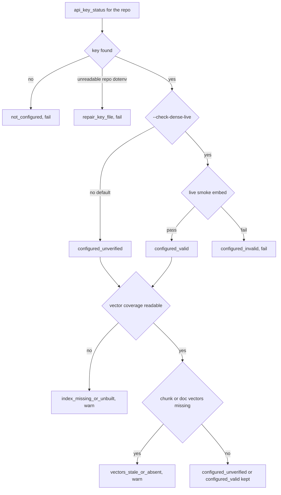
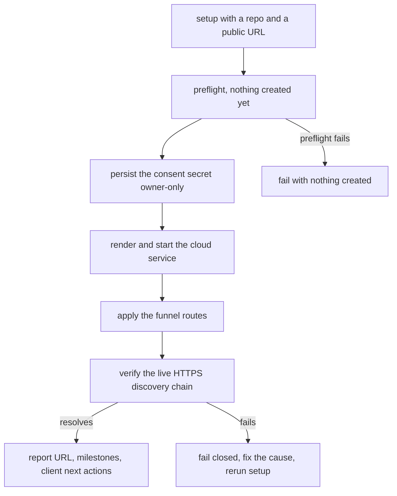

# Provisioning and Diagnostics

Five commands carry a host from "nothing installed" to "reachable and diagnosable", and they are
meant to be run **in this order**:

| Step | Command | What it may change |
|---|---|---|
| 1. Prove local recall | `hypermnesic local-proof <vault>` | Only the disposable index projection. No content, no commit. |
| 2. Diagnose | `hypermnesic doctor <vault>` (alias `status`) | Nothing at all. |
| 3. Bring up the public endpoint | `hypermnesic setup <vault> --public-url …` | Service unit, consent secret, funnel routes. Fail-closed. |
| 4. Provision a role | `hypermnesic install <vault> --role single\|master\|client` | Rendered service artifacts, role config, the post-merge hook. |
| 5. Warm the index after a pull | `hypermnesic install-hooks <vault>` | One delimited block inside `.git/hooks/post-merge`. |

The ordering is the argument, not a convention. **Local recall is proven before any endpoint, role,
or client concept enters the flow**, because a remote failure is far easier to diagnose once you
already know the vault, the projection, and retrieval are sound. `local-proof` is read-only, needs
no API key, and provisions nothing — its module docstring states that it "deliberately does not
provision endpoints, clients, or services".

**Handoffs.** What the public lane and the consent page *are* is
[Serving and Authentication](../surfaces/serving-and-authentication.md); every flag and env var is
[Configuration and Tunables](configuration-and-tunables.md); command-by-command flags are
[CLI Surface](../surfaces/cli-surface.md); why a warm index is never a correctness requirement is
[Read-Time Convergence](../architecture/read-time-convergence.md); the agent-host side of reaching an
endpoint is [Agent Plugins and Hooks](../integrations/agent-plugins-and-hooks.md). A short
orientation lives in [Quickstart](../quickstart.md).

## Prove local recall first

### What the proof does

`local-proof` is a thin orchestration over primitives that already exist — git validation, the index
projection, retrieval, and a `commit_note` dry run (`local_proof.run_local_proof`). It runs in one of
two modes, selected by the argument shape:

| Mode | Selected by | Behavior |
|---|---|---|
| `existing` | a repo path | Validates the vault is a git repo, projects committed markdown, answers a question, previews a write. Creates **no** sample content unless `--seed-sample` is passed explicitly. |
| `demo` | `--demo-dir DIR` | Builds a tiny dedicated git-backed vault at `DIR` (`git init -b main`, local commit identity, one sample note committed at `memory/local-proof-memory.md`). Refuses a non-empty directory that is not already a git repo, so the proof cannot overwrite data. |

Exactly one of the two must be given: both is `ambiguous_target`, neither is `missing_target`, and
neither is ever a stack trace — each failure raises a `LocalProofError` carrying a stable **code**, a
message, and a concrete **next action**.

Against an existing vault, "read-only by default" is precise: no markdown file is created, no commit
is made, `HEAD` is unchanged, and no `memory/local-proof-preview.md` appears. The proof does build
the disposable projection at `<repo>/.hypermnesic/index.db` (state dir created `0700`, database
`0600`, with a `.hypermnesic/` entry added to `.git/info/exclude` so it never enters git), and it
projects **committed** content only.

The question defaults sensibly when `--query` is omitted: demo mode uses a fixed demo question; an
existing vault scans its committed `.md` files for a `Question answered:` line, falls back to the
first line of at least three words (truncated to 160 characters), and finally to the demo question.
Retrieval takes the top hit at `k=3` with git-commit recency. The dense channel is **opt-in**
(`--dense`); the default proof runs lexical-only, which is why it needs no API key. If the embedder
fails mid-projection the catch-up is retried lexically rather than failing the proof.

### The result contract

`--json` emits a stable, agent-facing contract rather than prose:

| Field | Meaning |
|---|---|
| `status` | `local_memory_works`, or `needs_action` on a structured failure. |
| `mode` | `existing` or `demo`. |
| `completed_milestones` | The ordered vocabulary: `git_vault_confirmed`, `markdown_memory_found`, `index_projected`, `natural_question_retrieved`, `source_path_shown`, `dry_run_write_previewed`. |
| `source_path` | The **repo-relative** markdown path that answered the question. |
| `retrieval` | The question plus the hit: path, heading, a ≤280-character snippet, the channels that matched, and the score. |
| `write_preview` | `dry_run: true`, the destination, `created` / `noop`, `guard: "passed"`, `commit_created: false`, and the diff. |
| `index` | `state_path` (`.hypermnesic/index.db`), `disposable_projection: true`, and the catch-up status. |
| `degraded_capabilities` | `degraded_lexical_only` plus a product-language message. |
| `files_are_source_of_truth` | Always `true` — the contract states the invariant, it does not merely imply it. |
| `next_action`, `error` | A concrete next step, and `null` (or `{code, message}`) on failure. |

On failure the same contract degrades honestly: `status: "needs_action"`, an empty milestone list,
`source_path: null`, and an `error.code` from `{ambiguous_target, missing_target, not_git_repo,
demo_dir_not_empty, no_retrieval_hit, write_preview_refused}` with a `next_action` that names the
remedy — "add a markdown note containing the answer, rerun with `--query`, or use `--demo-dir`".
The human surface prints `Local memory works` on success and, on failure, `local-proof failed: …`
plus `next: …` on stderr with exit code 1. The JSON/human split is deliberate for agents: the first
printed lines name only local value, never `oauth`, `tailscale`, `funnel`, or `mcp` — a test asserts
exactly that.

Making the preview a real write path call (with `dry_run=True`) is what makes the milestone
meaningful: a protected destination such as `AGENTS.md` is refused by the same guard the live write
path uses, and the proof reports `write_preview_refused` instead of claiming a preview it cannot make.

### Nothing secret leaves the proof

Every string the proof echoes — heading, snippet, and any free text in the contract — passes through
a redaction pass first: `Bearer`-shaped tokens, `sk-`-shaped keys, an approval-token assignment, and
operator home paths are replaced with `[redacted-token]` / `[redacted-path]`. Paths are reported
repo-relative, and a test asserts the vault's absolute path never appears anywhere in the output.
A diagnostic that leaks a credential is worse than no diagnostic.

### Failure modes at this step

| Situation | What you see | What to do |
|---|---|---|
| Path is not a git repo | `not_git_repo` | `git init` the vault and commit markdown, or use `--demo-dir`. |
| Empty vault, no query hit | `no_retrieval_hit` | Add a note containing the answer, rerun with `--query`, or seed the sample with `--seed-sample`. |
| `--demo-dir` points at a populated non-repo directory | `demo_dir_not_empty` | Choose an empty directory. |
| Lexical-only | `degraded_lexical_only: true` with "still works from exact text in your markdown files" | Nothing is broken; configure `OPENAI_API_KEY` when you want dense ranking and fuzzier recall. |

## `doctor` and `status`: non-mutating diagnostics

`doctor` and `status` are one command behind two parser names, so their payloads are identical (a test
compares the two check lists). They are strictly non-mutating: they do not start services, rewrite
configuration, create tokens, change routes, touch the vault, or create a commit. The unit test for
this watches the git `HEAD`, the vault's file list, the absence of the `--env-file` file, and the
count of mutating `SetupOps` calls, all of which must be unchanged after a run.

They also **always exit 0**. The exit code says "the diagnostic ran"; the verdict lives in the
payload as `status`, so a script should read the JSON rather than the shell status.

### The check set

Each check carries an `id`, a `category` (`local`, `remote`, `oauth`, `auth`, `write`), a `status`
(`pass`, `warn`, `skipped`, `fail`), a derived `severity` (`info`, `warning`, `error`), a human
summary, and a `next_action` with a stable `code`, a summary, an optional `command`, and a doc
pointer.

| `id` | Category | What it actually reads | Non-`pass` states |
|---|---|---|---|
| `local_git_repo` | local | `git rev-parse --is-inside-work-tree` in the vault | `fail` → `initialize_git` |
| `local_index` | local | Presence of `<repo>/.hypermnesic/index.db` and its stored checkpoint versus `HEAD` | `warn` when the DB exists but may lag `HEAD`; `fail` when missing → `initialize_index` |
| `dense_retrieval` | local | `config.api_key_status(repo)`, optional live smoke embed, and read-only vector coverage over the index DB | See below; `configure_key`, `repair_key`, `repair_key_file`, `initialize_index`, `refresh_vectors` |
| `consent_secret_file` | auth | Only the `--env-file` path's existence and mode — the value is never read | `skipped` → `provide_env_file`; `warn` when absent → `rerun_setup`; `warn` when broader than `0600` → `repair_secret_permissions` |
| `tailscale` | remote | `tailscale status --json` `BackendState == Running`, via the injectable `SetupOps` | `fail` → `authenticate_tailscale`; `skipped` → `provide_public_url` |
| `service_unit` | remote | Presence of `<repo>/.hypermnesic/hypermnesic-cloud.service` | `warn` → `rerun_setup`; `skipped` → `provide_public_url` |
| `oauth_discovery` | oauth | Real HTTP: RFC 9728 protected-resource metadata and RFC 8414 AS metadata (with a `token_endpoint`) | `fail` → `repair_funnel`; `skipped` → `provide_public_url` |
| `auth_challenge` | auth | An unauthenticated POST to the resource must answer `401` | `fail` → `repair_auth`; `skipped` → `provide_public_url` |
| `write_availability` | write | Whether the whole discovery verification returned `ok` | `fail` → `request_write_scope`; `skipped` → `provide_public_url` |
| `remote_url` | remote | Nothing — it is the placeholder that says the remote half was not evaluated | Only ever `skipped` → `provide_public_url` |

Two structural facts follow from the table. Without `--public-url`, every remote, OAuth, auth, and
write check is reported as **skipped with its reason** rather than silently passing, and no HTTP call
is made at all; local diagnosis works with no network. And the remote checks exist **only** when a
public URL is supplied, which is also the only case in which `SetupOps.verify_discovery` runs.

### What "ready" does and does not mean

The overall `status` is `needs_attention` if **any** check is `fail`, and `ready` otherwise. That
makes `warn` and `skipped` non-blocking by construction: an index that lags `HEAD`, a service unit
not found in local state, or a remote half that was never evaluated all still read `ready`, and the
accompanying `what_this_means` says so plainly ("Local memory is healthy enough to use, and any
configured remote endpoint checks did not find a blocking failure"). When something fails,
`what_this_means` names the first failing check's summary instead of a generic error.

The honest counterpart: `dense_retrieval` is a `fail` when no key is discovered at all, so a
perfectly usable lexical-only vault reports `needs_attention` — with a summary that says lexical
recall still works. Treat the status as "is there anything an operator should decide about", not as
"is the vault broken".

The `local_index` check is deliberately three-way rather than binary: it separates a missing
projection (`fail`, "build it") from one that exists but may lag `HEAD` (`warn`, "converge or
reinspect") from one that is current enough, and it includes the raw `fresh` boolean in `detail`.
A vault with no commits yet cannot be compared, and is reported as not-stale rather than failing.

### A configured key is not a healthy projection

This is the most useful distinction `doctor` draws, and it is easy to get wrong by hand. The dense
check reports `key_configured`, `key_source`, `dense_state`, `live_check`, a `vector_coverage` block,
and optionally a `key_error` — all secret-free — and derives the state in a fixed order:



What that flow encodes, and why it matters:

- The default is offline-friendly: a discovered key is reported `configured_unverified` and no API
  call is spent. Only `--check-dense-live` runs a real smoke embedding and distinguishes
  `configured_valid` from `configured_invalid`, without ever printing the key.
- Discovery answers "is a key there", nothing more. When the index exists and its chunk or doc
  vectors are missing, the projection state **replaces** the credential state with
  `vectors_stale_or_absent`; when the coverage cannot be read at all (no index DB), it becomes
  `index_missing_or_unbuilt`. A valid key therefore tells you nothing about projection health.
- `configured_invalid` is preserved rather than overwritten: a key that failed its live check is the
  finding, not the vector lag behind it.
- The remedies are different by state, which is the operational point: `index_missing_or_unbuilt`
  points at building the projection (`hypermnesic local-proof /path/to/vault`), while
  `vectors_stale_or_absent` points at `hypermnesic converge /path/to/vault --now --json`, because
  convergence — not a full reindex — is the normal answer.
- `repo_dotenv_unreadable` short-circuits the ladder as a `fail` with `repair_key_file`: a present but
  unreadable key file is a permissions problem someone must fix, not a warning.

Credential lookup itself is repo-scoped: process environment first, then the target repo's gitignored
`.env`, and no working-directory fallback when an explicit repo is known — which is why
`hypermnesic doctor /path/to/vault` reads the *vault's* key from any directory. The lookup order and
the full `dense_state` table are detailed in
[Configuration and Tunables](configuration-and-tunables.md).

### Checking a secret without reading it

Given `--env-file PATH`, the consent-secret check reports exactly two things: whether the file exists,
and whether its permissions are owner-only (`0600`). Anything broader is a warning with a concrete
`chmod 600 <cloud env file>` command. The file's contents are never read or printed, and the check
carries no path in its output. Omitting the path yields a skipped check whose next action
(`provide_env_file`) explains what passing it would buy. The same rule holds for the whole payload:
a test asserts an approval-token value, a note body, the env-file path, and operator home paths never
appear in `doctor` output.

### Client next actions: what each state implies

Both `setup` and `doctor` answer "so what do I do now?" inside the diagnostic, from one shared,
secret-free map (`client_guidance.client_next_action_map`). Doctor returns it as `next_actions`;
setup returns the same map as `client_next_actions` (plus prose `next_steps`). Both human outputs
print it, doctor only for entries whose `available` is true.

| `id` | Mode | `available` | Next action |
|---|---|---|---|
| `local_cli` | local | always | Run local-proof first, then use `retrieve` / `think` / `resolve` on the engine host. |
| `remote_mcp` | remote | only when a public URL is known | Use that URL as the MCP server URL; the browser OAuth flow follows. |
| `claude_codex_plugin` | remote | only when a public URL is known | Install the plugin and set `HYPERMNESIC_MCP_URL` to the endpoint. |
| `obsidian_companion` | tailnet_read | always | Point the companion at the tailnet read route `http://<tailnet-ip>:8848/mcp`. |

Availability is honest rather than optimistic: without a public URL the two remote entries report
`available: false` and tell you to run setup with `--public-url` first, instead of printing
instructions that cannot work yet. The local CLI entry is always available because it needs no remote
setup, and the Obsidian companion is always available because tailnet membership — not OAuth — is its
boundary.

## `setup`: the public endpoint, fail-closed

`setup` brings the unified public OAuth endpoint online in one idempotent command: render and install
the service, persist the operator consent secret, configure the tunnel routes for the MCP mount and
the discovery well-knowns, verify the live HTTPS discovery chain, and return the URL, milestones, and
login instructions.

### The order is the mechanism



**Preflight, before any side effect** (`install.setup`):

1. Resolve the access-token TTL (`config.cloud_token_ttl_seconds`) and fail loudly on a non-positive
   or non-integer value.
2. Refuse a `--public-url` or `--resource` that is not an HTTPS **DNS** origin. A plain-HTTP or
   bare-IP issuer/resource is undiscoverable over the RFC 9728 → RFC 8414 chain, so it is rejected up
   front rather than half-served (`mcp_server._require_public_https_origin`).
3. Normalize the default client scopes and fail loudly on an unsupported one
   (`mcp_server.normalize_default_client_scopes`; supported set is `read`, `write`).
4. Confirm the target is a git repo.
5. Confirm the engine credential is discoverable (`config.get_api_key`).
6. Confirm the tunnel prerequisite is installed and authenticated (`SetupOps.tailscale_ready`). `setup`
   never manages Tailscale's own lifecycle — it checks, then fails actionably.

Any preflight failure raises an `InstallError` — "raised before any artifact is written so a failed
install never leaves a half-provisioned host" — so a missing key or a logged-out node leaves no
service, route, or secret behind. Tests assert exactly that for the Tailscale case (zero funnel and
zero service calls).

**Side effects, in order:** the consent secret is persisted to an owner-only env file; the cloud unit
is rendered and installed+started; the funnel routes are applied.

**After the routes exist:** the real HTTPS discovery chain is verified — RFC 9728 protected-resource
metadata, RFC 8414 AS metadata with a `token_endpoint`, and an unauthenticated POST that must be
`401`. Verification checks **real output, not an exit code**, which is what guards the silent-404 that
broke the first cloud deploy. If a well-known does not resolve to this service, the command fails with
the discovery detail, telling you to fix the route or the service and rerun. A failure at this stage
is the one case where state exists: the service and routes are in place but only converge once the
cause is fixed. Preflight failures never reach it.

### What the side effects create

| Artifact | Detail |
|---|---|
| Consent secret | `HYPERMNESIC_CLOUD_APPROVAL_TOKEN` in an owner-only (`0600`) env file, default `~/.config/hypermnesic-cloud/cloud.env`. Generated with 32 bytes of `secrets.token_urlsafe` and required to clear `auth_cloud.MIN_APPROVAL_TOKEN_LEN` (24) characters. |
| Service unit | `<repo>/.hypermnesic/hypermnesic-cloud.service`, then copied to `~/.config/systemd/user/` and `enable --now`-ed, running `serve-cloud` on a loopback bind behind the tunnel. |
| Funnel routes | The MCP mount, plus the two **root** discovery well-knowns the chain resolves at. Each mount has its **own** target — a shared target does not work. |
| Verification bundle | `milestones` (reusing the shared setup/doctor vocabulary), `what_this_means`, `client_next_actions`, and `next_steps`. |

The unit references `EnvironmentFile=-<repo>/.env` and the owner-only cloud env file and names its
secrets without inlining them, so the approval token and `OPENAI_API_KEY` values never appear in a
rendered artifact. The unsuffixed host-root
`/.well-known/oauth-authorization-server` (no `/mcp`) is **intentionally absent** from the routes:
claiming it would collide with a co-tenant, and exposing it is a tunnel follow-up rather than a
missing engine route.

One live trap is encoded rather than documented away: route application always shells out to
`tailscale funnel --set-path`, never `tailscale serve`. `serve --set-path` silently clears the funnel
allowance and drops public reach, so `_tailscale_funnel_cmd` is the single place that builds the
command and a test asserts `serve` never appears in it.

### Idempotence: what a second run converges

| Concern | Behavior |
|---|---|
| Consent secret | Reused untouched when present at or above the entropy floor; regenerated only when absent or weak. The result reports `secret_generated` and `converged: not generated`. |
| Service unit | Re-rendered on every run, so a changed `--token-ttl` (or a newly resolved default) lands. This is how an existing unit that still bakes an old `--token-ttl` gets updated after a deploy. |
| Funnel routes | A declarative, de-duplicated set re-applied per run; `--set-path` on the same mounts is a no-op convergence, and the two runs return the same route list. |

The rendered knobs are the same ones the serving lane exposes: `--token-ttl` (default `172800` / 48 h,
env `HYPERMNESIC_TOKEN_TTL_SECONDS`; refresh stays 30 days), `--default-client-scopes` (default
`read`; `read write`, or `HYPERMNESIC_DEFAULT_CLIENT_SCOPES=read,write`, makes newly registered clients
*request* write as well), and a repeatable `--allowlist` to narrow the write surface. `--resource`
defaults to `--public-url` and needs an explicit value only when the OAuth resource identifier
differs. Requesting write changes nothing about enforcement: the consent page still requires the
operator approval token, and every write guard still applies.

## Role provisioning with `install`

Where `setup` targets the public endpoint, `install` provisions a **host into a role**
(`single`, `master`, `client`) and is deliberately pure, offline, and idempotent: it verifies the
environment, renders service artifacts, writes the role config, and installs the convergence hook.
The host-specific side effects come back as `manual_steps` instead of being run.

| Role | What it means | Engine + index | Write |
|---|---|---|---|
| `single` | Local drop-in on the engine host | Yes | Renders the write-enabled serve bound to `127.0.0.1`. |
| `master` | Always-on tailnet server | Yes | Renders the write-enabled serve on an explicit tailnet bind; `--bind` is required. |
| `client` | A client wired to an existing master | **No** — the client role writes no index and no role config | None; it emits MCP client configuration only. |

An unknown role is rejected against the known set rather than guessed at, and every failure mode
shares one contract: `InstallError` is "raised before any artifact is written so a failed install
never leaves a half-provisioned host". The CLI mirrors it with exit code 1 and an `install failed: …`
line on stderr — no traceback.

### Engine roles: preflight, artifacts, manual steps

The order inside `install.install` is again the point:

1. **Credential first.** `config.get_api_key(repo=repo)` is a presence check whose value is discarded;
   without it an engine role raises before anything is written.
2. **Bind rules.** `single` forces `127.0.0.1`; `master` requires `--bind`; a wildcard bind
   (`0.0.0.0`, `::`, empty) is refused outright.
3. **Service flavor.** `systemd` or `docker`; anything else is rejected.
4. **Git before artifacts.** A missing `.git` fails here, because the hook step needs it and failing
   later would orphan a unit or a role config.
5. **Artifacts.** For `systemd`, `<repo>/.hypermnesic/hypermnesic.service`; for `docker`,
   `<repo>/.hypermnesic/Dockerfile` plus `compose.yaml`; then `<repo>/.hypermnesic/config.json` with
   `role`, `bind`, `port`, `path`, `write_enabled`, `service`; then the post-merge hook.
6. **Manual steps.** `hypermnesic init <repo>` to build the index, and either the `cp` +
   `systemctl --user daemon-reload && systemctl --user enable --now hypermnesic` pair or
   `docker compose up -d`.

Two invariants make the rendered unit startable and non-leaky. The `ExecStart` executable is resolved
to an **absolute** path — `shutil.which` first, then the console script next to the running
interpreter, then the bare name — because `systemctl --user` runs the unit without the project venv on
`PATH`; a test asserts the rendered path exists. And neither unit flavor ever inlines the embedding
key: systemd references `EnvironmentFile=-<repo>/.env`, Docker passes `env_file: .env`, and the
credential's value is never echoed into the result either.

Role provisioning renders a **write-enabled** serve (`--enable-write`, `write_enabled: true`). The
engine enforces the matching invariant at startup, not at render time: a write-enabled serve on a
non-loopback bind **must** have auth configured, or it must carry the explicit, CGNAT-bounded
`--allow-tailnet-write` opt-in; a loopback bind is exempt as the local drop-in. A `master` artifact
rendered without `--auth-issuer-url` / `--auth-resource-url` therefore refuses to start until the
operator supplies auth flags (systemd flavor) or that opt-in. When the auth flags are supplied they are
rendered onto `ExecStart` (shlex-quoted, with repeatable `--required-scope`), and the resource-server
introspection credentials stay in the environment rather than the unit.

### Client role: configuration only

`install --role client` requires `--master-url` and `--mcp-config`, and does no more than upsert one
entry into an MCP client config, preserving any other servers already present and resetting a
malformed `mcpServers` map to a dict rather than raising. Without auth parameters the entry is the
bare `{"type": "streamable-http", "url": …}` shape; with `--auth-issuer-url` /
`--auth-resource-url` / `--required-scope` it becomes OAuth2-aware, carrying the issuer discovery
reference, the resource audience, the requested scopes, and — instead of any token — a
`token_env` **pointer** to `HYPERMNESIC_MCP_TOKEN`, whose value lives in the host's environment or
secret store. The manual step it returns says which of the two auth boundaries applies: OAuth2 via
that env var, or tailnet membership.

## The post-merge convergence hook

Read-time convergence is the correctness guarantee for a fresh index. The git hook is only an
**accelerator** that moves the cost of a warm index earlier — it pre-warms after a pull, so the next
read does not pay for the delta. That is why the installed command ends in `|| true`: a convergence
hiccup must never fail a `git pull`.

### What it writes

The hook is `post-merge`, managed as one clearly delimited block inside `.git/hooks/`:

```sh
# >>> hypermnesic managed block (do not edit inside markers) >>>
# hypermnesic U33: pre-warm the index after a pull. Lazy read-time convergence
# is the correctness guarantee (FR-R38); this only warms the cache.
'<resolved hypermnesic executable>' converge '<repo>' >/dev/null 2>&1 || true
# <<< hypermnesic managed block <<<
```

Both the executable path and the repo path are `shlex`-quoted, so a repo path containing shell
metacharacters cannot break out of the hook and run on every pull. The hook set is a tuple
(`HOOK_NAMES`, currently `post-merge`) so related events can be added without changing the contract.

### Install and uninstall semantics

| Property | Behavior |
|---|---|
| Opt-in | Nothing installs the hook implicitly except role provisioning (see below); `hypermnesic install-hooks <repo>` is the explicit path. |
| Idempotent | Re-running leaves **exactly one** managed block: an existing block is replaced, not appended to. |
| Non-destructive | Operator content before and after the block is preserved; a hook that does not exist is created with a `#!/bin/sh` shebang. |
| Executable | The hook is chmod-ed executable for user, group, and other on install. |
| Uninstall | `--uninstall` removes **only** the managed block. If nothing but a bare shebang remains, the file is removed entirely rather than left as a stub. |
| Read-once | Uninstall reads the hook once (`no TOCTOU re-read`) before deciding. |
| Corrupt block | A managed block with a `BEGIN` and no `END` keeps its content instead of deleting trailing operator lines. |

One nuance worth stating because it is easy to misread elsewhere: engine-role provisioning calls the
same `install_hooks` internally, so `hypermnesic install <repo> --role master|single` installs the
managed hook as part of provisioning. `setup` does **not** install hooks — it renders the cloud unit
and the routes only. On the serving lanes the same convergence also runs lazily before every read, so
a host without the hook is not stale, merely slower on first read after a pull.

## Keeping provisioning artifacts honest

Two repository-wide gates constrain anything you change here, and both are cheap to run:

- **Version consistency.** `pyproject.toml` `[project].version` is the single source of truth;
  `scripts/check_version_consistency.py` names every mirror that must agree. Do not hand-enumerate
  the mirrors — run the gate, which reports the diverging file and both versions, or
  `--json` for machine consumption. It is one of the six gates a change must pass.
- **Placeholder-only public surface.** `scripts/preflight_public_scan.py` fails on operator tailnet
  names, homelab IPs, credential material, inline token values, and operator home paths. Use
  placeholders — `<your-host>.ts.net`, `http://<tailnet-ip>:8848/mcp`, and the `100.64.0.0/10` CGNAT
  range — in every command, unit example, and fixture.

Neither gate is about provisioning correctness, and both exist because a setup document is where an
operator's real host, secret, or version drift leaks into a repository.

## Focused tests

| File | What it pins |
|---|---|
| `tests/test_local_proof.py` | Demo vault creation and retrieval; existing-vault read-only default (`HEAD` unchanged, no preview file); automatic query selection; empty-vault failure with no writes; non-git refusal before writes; lexical degradation in product language; the dense path not marked degraded; a protected preview refused; repo-relative-only output; secret-like value redaction; index reuse. |
| `tests/test_cli.py` | The local-proof JSON contract and its first-lines-are-local human output; the demo path; an actionable non-git error with exit code 1 and no traceback; hook install idempotence, operator-content preservation, and uninstall; convergence catch-up via `converge`; `install` role routing and fail-loud exit codes. |
| `tests/test_doctor.py` | The full check set with categories and action codes; local/remote separation without a public URL (no HTTP call made); Tailscale mapping; non-mutation (git `HEAD`, file list, no mutating ops, no env file created); secret-free output; repo-`.env` resolution from a different working directory; process-env precedence; vector coverage detail; missing index versus missing key; stale vectors pointing at `converge`; live dense failure; `doctor`/`status` JSON parity; `--check-dense-live`; actionable human output. |
| `tests/test_install.py` | Rendered master unit/config/hook; OAuth flags rendered when given and absent otherwise; the docker flavor; client config writes, preservation, and malformed-map reset; the OAuth2-aware secret-free entry; `single` bound to localhost only; engine role without a key failing with no artifacts; `master` requiring a bind; idempotence; unknown-role rejection; non-git failure before artifacts; shlex quoting and executable resolution; the rendered `ExecStart` being an absolute, existing path. Also the whole `setup` set: the secret-free cloud unit and its `--token-ttl`, default-scope rendering, `--resource` default and override, consent-secret generation/permissions/entropy floor, reuse versus weak-secret regeneration, no partial state when Tailscale is not ready, failure when discovery does not resolve, per-mount funnel targets, and `funnel`-never-`serve`. |
| `scripts/product_smoke.py` | The deterministic local product loop ends with a `doctor_status` stage, so the diagnostic contract is exercised by the readiness smoke as well as by unit tests. |
