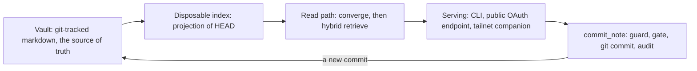

# Quickstart

## What this is

hypermnesic is a **git-native memory layer**. A vault of plain markdown files in a git
repository you host becomes durable, searchable memory that every assistant — chat clients,
coding agents, an editor companion — reads and writes through **one endpoint**. Every memory is a
real git commit: reviewable, revertible, and yours.

## The one invariant — and the one write

Two statements answer most design questions in this repository before you read any code:

> **Files are the source of truth. The search index is a disposable, rebuildable projection of
> the committed tree.**

> **`commit_note` is the one sanctioned write** — git-first, guarded, gated, and audited.
> Nothing else mutates the corpus without an owner approving a proposal.



The layer cycle: the vault projects into a disposable index, reads converge against `HEAD`,
serving exposes both the read tools and the gated write, and every write returns to the vault as
a commit. The full derivation, module map, and reading order are in
[Architecture Overview](architecture/overview.md).

## The gates that define done

CI's `lint-test-license` job runs exactly these five commands after syncing dev extras, so
passing locally and passing CI are the same event:

```sh
uv sync --extra dev                                   # setup, not a gate
uv run ruff check .
uv run python scripts/check_version_consistency.py
uv run pytest
uv run python scripts/license_scan.py
uv run python scripts/preflight_public_scan.py
```

All five must pass before a change is done. `CONTRIBUTING.md`'s ballpark is under five minutes
total on a Linux runner, with the suite the only step measured in minutes; `AGENTS.md` warns the
I/O-bound suite can take ~15 minutes and should never be mistaken for a hang. A second CI job
installs the built wheel with no lockfile to prove a user's install still starts — see
[Testing and Release Gates](testing/testing-and-release-gates.md).

## Prove local recall in one command

```sh
uv tool install hypermnesic
hypermnesic local-proof /path/to/your/vault              # existing vault
hypermnesic local-proof --demo-dir /tmp/hypermnesic-demo # or a tiny generated demo vault
```

Against an existing markdown git repository this validates the vault, builds the projection,
answers a natural question, shows the repo-relative source path the answer came from, and
previews a write as a **dry-run diff with no commit**. It is read-only with respect to your
corpus — it creates the disposable index and nothing else — provisions no endpoints or clients,
and works with no API key. Add `--query`, `--seed-sample`, or `--json` (for agents) as needed.

That ordering is deliberate: **prove local memory before any endpoint concept enters the
picture.** Only then bring up the shared endpoint
(`hypermnesic setup <vault> --public-url https://<your-host>.ts.net/mcp`) and diagnose it with
`hypermnesic doctor`. See
[Provisioning and Diagnostics](operations/provisioning-and-diagnostics.md).

`local-proof` is only one verb of the engine-host-local surface. The full command inventory —
what each verb delegates to, the conventions they share, and the CLI↔MCP twin pairs a change
must keep in step — is in [CLI Surface](surfaces/cli-surface.md).

## House rules worth knowing up front

- **Test-first.** No new production behaviour without a failing test first, and a red test is
  fixed or filed — never dismissed as "pre-existing."
- **Branch off `dev`, PR into `dev`.** `main` is the release branch and takes only `dev`; never
  commit directly to either. A tag on `main` publishes; merging publishes nothing.
- **Documentation is part of the change** — every document a change affects is corrected in the
  same pull request.
- **Permissive dependencies only**, each with an upper version bound; **never echo secrets**, and
  use placeholder hosts in anything committed.
- **Respect the write guard.** Guard, gate, auth, and server changes are security-sensitive and
  route to the owner.

The long form lives in `AGENTS.md` and `CONTRIBUTING.md`; the mechanics are in
[Testing and Release Gates](testing/testing-and-release-gates.md).

## Version and license

`pyproject.toml` `[project].version` is the single source of truth — currently **0.3.0** —
mirrored by `src/hypermnesic/__init__.py`'s `__version__` and the plugin manifests. Do not
hand-enumerate the mirrors: `uv run python scripts/check_version_consistency.py` names every slot
that must match.

The engine is licensed **AGPL-3.0-only** (`pyproject.toml` `license`, the root `LICENSE`, and the
[`docs/README.md`](../../docs/README.md) pin), and the Obsidian companion ships from a separate
**GPL-3.0** repository that talks to the engine only over the wire. Some current governance prose
still carries pre-flip wording ("planned-AGPL", "currently private / pre-release"); the pins and
`pyproject.toml` win.

## Where everything is documented

| Group | Page | What it answers |
|---|---|---|
| Architecture | [Architecture Overview](architecture/overview.md) | The whole mental model: invariant, layers, serving lanes, module map. Start here. |
| Architecture | [Retrieval and Indexing](architecture/retrieval-and-indexing.md) | How a query becomes ranked hits, and why the projection is disposable. |
| Architecture | [Read-Time Convergence](architecture/read-time-convergence.md) | How reads stay fresh while the index stays a pure projection. |
| Architecture | [Git-First Write Path](architecture/git-first-write-path.md) | The one write traced end to end, plus the refusal contract. |
| Architecture | [Write Guard and Security Model](architecture/write-guard-and-security-model.md) | What the blocklist protects, and what never leaves the process. |
| Concepts | [The Note Contract: Frontmatter, Paths, Links, Provenance](concepts/note-contract.md) | The shared data model: frontmatter ownership, paths, wikilinks, provenance. |
| Surfaces | [MCP Tool Surface](surfaces/mcp-tool-surface.md) | The client contract for every MCP tool. |
| Surfaces | [CLI Surface](surfaces/cli-surface.md) | Every subcommand grouped by role, what each handler delegates to, and the CLI↔MCP twin pairs. |
| Surfaces | [Serving Topology and Authentication](surfaces/serving-and-authentication.md) | The two lanes, OAuth, consent, and the bind invariants. |
| Workflows | [Capture and Thinking Workflows](workflows/capture-and-thinking.md) | Capture, triage, thinking mode, folder discovery, sidecar extraction. |
| Workflows | [Review and Navigation Workflows](workflows/review-and-navigation.md) | Proposals, the generated marker, digests, connections, the daily loop. |
| Operations | [Configuration and Tunables](operations/configuration-and-tunables.md) | Every knob and the consequence of changing it. |
| Operations | [Provisioning and Diagnostics](operations/provisioning-and-diagnostics.md) | Local proof first, doctor states, fail-closed setup, roles, the hook. |
| Operations | [Memory and Client Control](operations/memory-and-client-control.md) | Inspect, export, forget, revert, audit, and grant revocation. |
| Integrations | [Agent Plugins, Hooks, and Companions](integrations/agent-plugins-and-hooks.md) | How agent hosts reach the endpoint, and the auto-recall hook. |
| Testing | [Testing and Release Gates](testing/testing-and-release-gates.md) | The suite, the gates, the branches, and how a release happens. |
| Testing | [Benchmarks and Evaluation](testing/benchmarks-and-evaluation.md) | How retrieval quality is measured and reported honestly. |

## A note on reading the repository's own docs

The `docs/` tree separates **durable reference** from **process history** — plans, brainstorms,
handoffs, and gate artifacts record how the project got here and are not maintained as reference.
When a process-history document conflicts with the documentation index's current-truth pins,
**the pins win**. Two self-descriptions in particular were corrected once already and may still
appear in older material: the write model is a **blocklist**, not an allowlist, and the serving
topology is **two lanes**, not tailnet-only.
