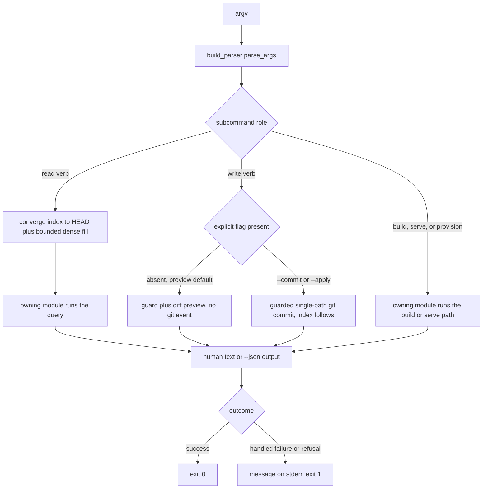

# CLI Surface

`hypermnesic` is the **engine-host-local** surface: it runs on the host that owns the vault and the
disposable index, skips the network entirely, and calls the same domain modules the MCP server calls.
Nothing connects *to* the CLI — there is no listener, no protocol, and no client. The authority is
`build_parser()` and `main()` in `src/hypermnesic/cli.py#L752-L1123`; `docs/reference/cli.md` is the
durable per-flag reference, and where the two disagree the parser wins.

This page owns the inventory, the ownership map, and the twin-pair obligations. Mechanics live
elsewhere: bind and auth refusals in [Serving Topology and Authentication](serving-and-authentication.md),
tool contracts in [MCP Tool Surface](mcp-tool-surface.md), guard classes in
[Write Guard and Security Model](../architecture/write-guard-and-security-model.md), knobs in
[Configuration and Tunables](../operations/configuration-and-tunables.md), and the write ordering in
[Git-First Write Path](../architecture/git-first-write-path.md).

## Invocation, dispatch, and the version slot

```sh
hypermnesic --version
hypermnesic <subcommand> [args] [flags]
```

The console entry point is `hypermnesic = "hypermnesic.cli:main"` (`pyproject.toml#L55-L56`).
`main()` parses argv, prints help and returns `0` when no subcommand was given, and otherwise returns
the int that `args.func(args)` produced (`src/hypermnesic/cli.py#L1117-L1123`) — a dispatch table built
by `set_defaults(func=...)` on every leaf parser. Each `_cmd_*` handler therefore *returns* an exit
code (0 normally, 1 on a handled failure) rather than calling `sys.exit`, which is what makes the
suite able to call `cli.main([...])` in-process.

`--version` prints `hypermnesic {__version__}`, read from the in-package mirror in
`src/hypermnesic/__init__.py#L11` (`cli.py#L15`, `cli.py#L754`). That slot is **not** the authority:
`pyproject.toml [project].version` is, and `scripts/check_version_consistency.py` fails the build when
the mirror, the plugin manifests, or the citation metadata diverge from it. Bump versions through the
script's list, never by hand in one file.

## The command inventory, grouped by role

The parser registers exactly **22** top-level subcommands. The grouping below is by role, because
commands in one group share a posture (read-only, preview-gated, provisioning) even when their flags
differ.

| Role | Subcommands |
|---|---|
| Local proof | `local-proof` |
| Projection builds | `index`, `embed`, `reindex`, `init`, `converge` |
| Reading | `retrieve`, `think`, `resolve`, `list-folders` |
| Writing | `commit-note`, `capture`, `daily-review` |
| Memory control | `memory list\|inspect\|write-scope\|export\|forget\|revert\|audit` |
| Client control | `clients list\|revoke` |
| Hooks | `install-hooks` |
| Diagnostics | `doctor`, `status` |
| Serving and provisioning | `serve`, `serve-cloud`, `setup`, `install` |

### Local proof — `local-proof`

One verb, and the only one whose output contract is deliberately sanitized: it validates a markdown
git repo, projects committed files, answers a question, shows the repo-relative source path, and
previews a write as a `commit_note` dry run — creating the disposable projection and nothing else
(`cli.py#L213-L252`). It needs no API key, provisions no endpoint, and never commits. Its structured
failures (`LocalProofError`) are printed to stderr as `local-proof failed: …` plus a `next:` line and
return 1, never a traceback. Full behavior, the two modes, and the milestone contract:
[Provisioning and Diagnostics](../operations/provisioning-and-diagnostics.md).

### Projection builds — `index`, `embed`, `reindex`, `init`, `converge`

Shared posture: these verbs write **only the disposable projection** (`<repo>/.hypermnesic/`, or an
external `--state-dir`) and never touch the corpus. They also share a fail-loud rule —
`embed.smoke_embed_or_die` proves the embedding credential is actually *read* by the SDK before any
indexing work, so a missing key is an error here rather than a silent zero-vector index. `converge` is
the exception inside the group: it is the read-time warm, so it degrades to lexical instead of failing,
and returns `{"status": "no-index"}` with exit 0 when there is no index yet
(`cli.py#L400-L428`). `reindex --isolated` builds in a worktree and swaps atomically; `init` is the
zero-infra drop-in that indexes a repo in place.

### Reading — `retrieve`, `think`, `resolve`, `list-folders`

Shared posture: read-only, and each one **converges the index before serving**
(`cli.py#L172-L341`). Shared mechanism: the dense channel is optional — an embedder is constructed
with the repo as its anchor so credential lookup targets the vault being read, and a missing or dead
key becomes `degraded_lexical_only` on the result rather than an error. `retrieve`, `resolve`, and
`list-folders` also take `--now`, which forces a non-debounced convergence so a self-write committed
inside the debounce window is visible in a single command; `think` takes the default, debounced path.
What each of these reads means (convergence, freshness, folder derivation) belongs to
[Read-Time Convergence](../architecture/read-time-convergence.md) and
[Retrieval and Indexing](../architecture/retrieval-and-indexing.md).

### Writing — `commit-note`, `capture`, `daily-review`

The only verbs that can produce a git event in the vault, and they share the ordering "git is the
commitment, the index follows as a projection".

- `commit-note <repo> <path>` is **preview by default**: without `--commit` it computes the guard and
  the diff and returns `new_sha: null` with zero side effects; `--commit` lands a guarded single-path
  commit and push (`cli.py#L73-L99`). Body comes from `--body` or `--body-file`; `--summary` sets the
  commit message.
- `capture <repo> <text>` is the **deliberate exception** to preview-by-default: it commits raw text
  into the `sources/` free-append zone immediately, with no preview flag. It reaches git through
  `propose.propose`, whose fast path routes a *new file in an immutable append zone* straight to
  `commit_note` with no proposal branch (`src/hypermnesic/capture.py#L24-L37`,
  `src/hypermnesic/propose.py#L223-L228`).
- `daily-review <repo>` renders the capture → triage → recall → cleanup dashboard and emits it as a
  **review-gated proposal** under `dashboards/daily-review.md` — a proposal branch, never a change to
  source notes. It is also the one index-touching read path that does **not** converge: it uses the
  index when `<repo>/.hypermnesic/index.db` exists and otherwise degrades to files plus audit log
  (`cli.py#L361-L397`).

### Memory control — `memory list|inspect|write-scope|export|forget|revert|audit`

One parser with seven leaves, sharing: converge-before-read (with `--now`), `--index-db`, `--audit-log`
(default `<repo>/.hypermnesic/audit.jsonl`), `--allowlist` to preview scope under a narrowed surface,
and `--json`. Mutating leaves are preview-by-default behind `--apply` — `memory forget` and
`memory revert` both print a plan first. A guard, dirty-tree, or head-drift refusal exits 1 with
`memory <verb> failed: …` on stderr. What each verb answers, the export manifest, and the audit surface:
[Memory and Client Control](../operations/memory-and-client-control.md).

### Client control — `clients list|revoke`

Two leaves over the **secret-free** grant metadata store (`client_control`), default
`<repo>/.hypermnesic/client-grants.json`. They do not open the index and do not converge. `revoke` is
preview by default and marks the grant revoked with `--apply`; a running server sharing that store
refuses the grant on its next validation. Semantics and the revocation caveats:
[Memory and Client Control](../operations/memory-and-client-control.md).

### Hooks — `install-hooks`

Opt-in, idempotent, non-destructive: it writes a delimited managed block into `.git/hooks/post-merge`
so a pull warms the index, and `--uninstall` removes only that block, preserving operator content
(`cli.py#L431-L443`). The block's command is `hypermnesic converge`, so this verb and the projection
group are one feature. See [Provisioning and Diagnostics](../operations/provisioning-and-diagnostics.md).

### Diagnostics — `doctor` and `status`

The same parser and the same handler, registered in a loop (`for name in ("doctor", "status")`,
`cli.py#L1018-L1030`), so the alias can never drift. Both are **non-mutating**: `doctor.run_doctor`
writes no files, services, secrets, or commits, and `--env-file` is checked for existence and
permissions only, never printed. The set of check states and the next actions they imply is owned by
[Provisioning and Diagnostics](../operations/provisioning-and-diagnostics.md).

### Serving and provisioning — `serve`, `serve-cloud`, `setup`, `install`

The only subcommands that reach beyond the vault's own git, and the only two with **no `--json`**,
because they never return: `serve` and `serve-cloud` end in
`srv.run(transport="streamable-http")` (`cli.py#L480`, `cli.py#L543`). Both refuse to start on a bad
configuration with a one-line stderr message and exit 1 rather than leaving a half-open server;
`serve-cloud` additionally refuses to start without an approval token in the environment, and refuses
a weak one (`cli.py#L511-L544`). `install` is offline and pure: it renders service artifacts, writes
role config, installs the hook, and returns `manual_steps` for the host-specific actions (service
enable/start, index build) rather than performing them (`src/hypermnesic/install.py#L596-L660`).
`setup` is the one idempotent bring-up, and it is fail-closed. Flags and refusal conditions for all
four belong to [Serving Topology and Authentication](serving-and-authentication.md) and
[Provisioning and Diagnostics](../operations/provisioning-and-diagnostics.md).

## Ownership map: which handler delegates to which module

Every `_cmd_*` in `cli.py` is thin — argument shaping, one call, and output formatting. The domain
logic lives in the module named below.

| Subcommand | Handler → owning module / entrypoint |
|---|---|
| `index` | `_cmd_index` → `embed.smoke_embed_or_die`, `index.build_index` (`cli.py#L36-L52`) |
| `embed` | `_cmd_embed` → `index.embed_stale` (`cli.py#L55-L70`) |
| `reindex` | `_cmd_reindex` → `index.reindex_isolated` or `index.build_index` (`cli.py#L102-L116`) |
| `init` | `_cmd_init` → `index.build_index` in-repo (`cli.py#L119-L135`) |
| `converge` | `_cmd_converge` → `converge.converge` (`cli.py#L400-L428`) |
| `retrieve` | `_cmd_retrieve` → `converge.converge` + `retrieve.search` (`cli.py#L172-L210`) |
| `think` | `_cmd_think` → `converge`, `graph.Graph.from_index`, `think.think` (`cli.py#L138-L169`) |
| `resolve` | `_cmd_resolve` → `converge`, `graph.Graph.from_index` → `Graph.resolve` (`cli.py#L255-L285`) |
| `list-folders` | `_cmd_list_folders` → `converge`, `mcp_server._effective_write_surface`, `folders.derive_folders`, `folders.agent_instruction_for_root` (`cli.py#L288-L341`) |
| `commit-note` | `_cmd_commit_note` → `commit_note.commit_note` (`cli.py#L73-L99`) |
| `capture` | `_cmd_capture` → `capture.capture` → `propose.propose` fast path (`cli.py#L344-L358`) |
| `daily-review` | `_cmd_daily_review` → `daily_review.review_proposal` → `propose.propose` (`cli.py#L361-L397`) |
| `memory …` | `_cmd_memory` → `memory_control.list_memories / inspect_memory / write_scope / export_memories / preview_forget / apply_forget / preview_revert / apply_revert / audit_view` (`cli.py#L608-L676`) |
| `clients …` | `_cmd_clients` → `client_control.list_grants / revoke_grant` (`cli.py#L679-L699`) |
| `install-hooks` | `_cmd_install_hooks` → `install.install_hooks / uninstall_hooks` (`cli.py#L431-L443`) |
| `doctor`, `status` | `_cmd_doctor` → `doctor.run_doctor` (`cli.py#L579-L605`) |
| `local-proof` | `_cmd_local_proof` → `local_proof.run_local_proof` (`cli.py#L213-L252`) |
| `serve` | `_cmd_serve` → `auth.make_auth_settings` + `mcp_server.build_server` (`cli.py#L446-L481`) |
| `serve-cloud` | `_cmd_serve_cloud` → `mcp_server.build_cloud_server` (`cli.py#L511-L544`) |
| `setup` | `_cmd_setup` → `install.setup` (`cli.py#L547-L576`) |
| `install` | `_cmd_install` → `install.install` (`cli.py#L484-L508`) |

Two consequences worth knowing before editing:

- **One coercion site.** `list-folders` calls `mcp_server._effective_write_surface(args.allowlist)` and
  passes the result into `folders.derive_folders` (`cli.py#L312-L315`) instead of re-implementing
  surface resolution. The CLI's writability preview therefore cannot disagree with the server's, which
  is why `list-folders --allowlist` is a legitimate way to verify a narrowed write surface.
- **No verb calls `propose` directly.** The proposal/PR queue is reached only through `capture` (fast
  path) and `daily-review` (proposal branch), so adding a proposal-producing verb means extending
  `cli.py` *and* deciding which tier it belongs to.

## CLI-to-MCP twin pairs

Five CLI verbs are deliberate twins of an MCP tool: they call the same module and must keep their
result shape in step. Both surfaces converge first, so both carry the convergence outcome on the
result.

| CLI verb | MCP tool | Shared shape |
|---|---|---|
| `retrieve <repo> <query>` | `search(query, k)` | Identical hit projection: `path`, `heading`, `score` rounded to 6 places, sorted `channels`, a 280-character `snippet`, `recency`; plus `degraded_lexical_only`, `degraded_reason`, `manual_reindex_recommended` (`cli.py#L193-L203` vs `mcp_server.py#L444-L459`) |
| `list-folders <repo>` | `list_folders(root, depth)` | The exact same JSON key set — `root`, `depth`, `folders`, `truncated`, `omitted`, `manual_reindex_recommended`, `agent_instruction` — pinned by a test that asserts set equality against the MCP output shape |
| `think <repo> <topic>` | `think(topic, k, depth, path)` | Same `think.as_dict()` payload (`topic`, `wrote`, `related`, `context`, `questions`, `unlinked`, degradation, `note`) |
| `resolve <repo> <name>` | `resolve(name)` | Same `name` / `resolved` / `slug` triple; `null` on ambiguous or missing, never a guess |
| `commit-note <repo> <path>` | `commit_note(path, body, set_fields, summary)` | Same `commit_note` primitive and guard chain, but **different defaults**: the CLI verb is a dry-run preview unless `--commit` is passed, while the MCP tool has no preview parameter and always commits |

The two twins are not yet byte-identical in their convergence fields: CLI `think` prints
`think.as_dict()` verbatim and CLI `resolve` prints only `name`/`resolved`/`slug`, whereas the MCP
tools append `manual_reindex_recommended` (and, for `think`, the convergence `degraded_reason`). A
change to either side should decide explicitly whether that gap stays.

Groups with **no MCP counterpart** are the `memory` and `clients` groups — owner-facing control over
files, git, audit, and grant metadata that deliberately stays off the agent-facing wire — plus
`capture`, `local-proof`, `daily-review`, the projection-build verbs, `install-hooks`, `doctor`/`status`,
and `serve`/`serve-cloud`/`setup`/`install`. Conversely, `build_context`, `read_note`, and the
`hypermnesic_search` alias are MCP-only; the CLI has no twin for them.

## Conventions every subcommand shares

These are the properties a caller or a script may rely on. They come from the module docstring's
contract and from the handlers (`src/hypermnesic/cli.py#L1-L6`).

1. **Reads converge before serving.** `retrieve`, `think`, `resolve`, `list-folders`, and every
   `memory` leaf call `converge.converge(...)` before the query, so a note that has just been committed
   is recall-able by a read. The default pass is **debounced** (a recent convergence stamp short-cuts);
   `--now` forces a non-debounced pass, which is the flag to reach for when a self-write from seconds
   ago must be visible. `daily-review` is the one index-reading verb outside this rule.
2. **`--json` on 20 of 22 subcommands.** Output goes through `_print_json`, which is
   `json.dumps(obj, ensure_ascii=False, indent=2)` (`cli.py#L20-L21`) — non-ASCII content is preserved
   rather than escaped. The two exceptions are `serve` and `serve-cloud`, which never return. Each
   command then has a separate human rendering; the JSON and the human text are two views of one
   result dict, and a new field is added to the dict, not formatted inline.
3. **Preview by default, one explicit flag to land.** `commit-note` is read-only until `--commit`;
   `memory forget`, `memory revert`, and `clients revoke` are read-only until `--apply`. The flag is
   named per verb, not unified. `capture` is the intentional exception — its value depends on
   frictionless landing in the free-append zone.
4. **Credential values are never echoed.** The CLI reads keys from the environment or a gitignored
   repo `/.env` and never prints them; `serve-cloud`'s approval token is read from the environment and
   never accepted as a flag, because a flag would leak through the process table. `--env-file` is
   checked for existence and permissions, never dumped.
5. **A failure or refusal exits non-zero instead of printing a success shape.** Handled failures print
   a one-line message to stderr and return 1: `local-proof`, `list-folders` (bad `--root`), `serve`
   (empty allowlist on a write-enabled serve, missing auth counterpart), `serve-cloud` (missing or
   weak approval token), `setup`, `install`, every `memory` leaf (guard, dirty-tree, head-drift), and
   `clients`. `commit-note` has no handler-level `except`: a guard refusal propagates as an exception,
   which still exits non-zero — but without the tidy stderr line the others produce.
6. **Reads degrade, builds fail loud.** A missing or dead embedding credential degrades the read verbs
   to lexical/graph results and reports it in the payload; the projection-build verbs run a startup
   smoke embed and refuse to proceed.

## Where the vault and the derived state land

The vault is named by the `repo` positional (optional only where a mode replaces it: `local-proof`
takes `--demo-dir`, `install` may be a client-role install, `serve`/`serve-cloud` take `--index-db`
plus an optional `--repo`). The **derived** state is named separately, which is what lets the index
stay a disposable projection rather than corpus content.

| State | Selected by | Default |
|---|---|---|
| Index database | `--index-db` on the read verbs, `embed`, `converge`, `memory`, `daily-review`; `--state-dir` on `index`/`reindex` | `<repo>/.hypermnesic/index.db` (`index.state_dir_for`, `index.py#L35-L36`) |
| External state | `--state-dir DIR` on `index`/`reindex` | omitted → in-repo `.hypermnesic/`, added to `.git/info/exclude` so it never enters git |
| Audit log | `--audit-log PATH` on `memory` and `daily-review` | `<repo>/.hypermnesic/audit.jsonl` |
| Client grants | `--grant-store PATH` on `clients` | `<repo>/.hypermnesic/client-grants.json` (`client_control.grant_store_path`) |

Two asymmetries are deliberate and easy to trip over:

- `commit-note` and `capture` accept **no** `--index-db`/`--state-dir`. They open only the in-repo
  `<repo>/.hypermnesic/index.db`, and when it does not exist they still commit and simply skip the
  projection (`cli.py#L81-L88`, `cli.py#L348-L349`) — the write is the commitment, the index is
  catch-up work.
- `serve` and `serve-cloud` require `--index-db`. When `--repo` is omitted, `build_server` derives the
  vault from the index-db's grandparent, so a non-standard index location must be accompanied by
  `--repo` — otherwise the vault is guessed and dense credential lookup can point at an unrelated
  parent directory.

## The command lifecycle



*One CLI invocation: parse and dispatch, converge-to-HEAD before any read, the owning module doing the
real work, and a single result dict rendered as human text or `--json` — with the write path branching
into a dry-run preview or an explicit flag that lands a guarded commit.*

## What the CLI cannot do

- **It is not a network surface.** No client connects to it and it speaks no protocol of its own. Two
  subcommands *start* the network lanes, but the contract there is the MCP surface, not a
  CLI-shaped API.
- **It provisions nothing by itself.** `local-proof` provisions no endpoint. `install` renders
  artifacts, writes role config, and installs the hook, then returns `manual_steps` for the
  host-specific actions instead of performing them.
- **It cannot widen the write surface.** `--allowlist` narrows; every write verb still passes through
  `serialize.check` and the protected-path class rules, and the guard is caller-independent, so no
  flag combination reaches a protected path.
- **It is not the only surface for writes, but it is the only local one.** The MCP `commit_note` tool
  is the agent-facing equivalent; the CLI exists so an engine host can operate the same paths without
  a client, an OAuth token, or a daemon.

## Tests that pin this surface

`tests/test_cli.py` is the primary pin, and its docstring states the theme: read entrypoints converge
before serving, run fully offline, and match the MCP hit shape.

- **Converge-before-serving** — `test_retrieve_converges_to_head_before_serving` commits a file after
  the index build and asserts `retrieve` still returns it; `test_think_converges_to_head_before_serving`
  does the same for `think` (and asserts `wrote is False`).
- **The lexically degraded hit shape** — `test_retrieve_matches_search_hit_shape` neutralizes the key,
  then asserts `degraded_lexical_only is True` and that each hit carries
  `path`/`heading`/`score`/`channels`/`snippet`.
- **Freshness knobs** — `test_retrieve_now_forces_fresh_self_write_within_debounce` proves the default
  path misses a self-write inside the debounce window and `--now` catches it;
  `test_converge_now_forces_pass_within_debounce` and
  `test_retrieve_json_surfaces_manual_reindex_on_oversized_delta` pin the same semantics on `converge`
  and the surfaced `manual_reindex_recommended`.
- **Twin parity** — `test_list_folders_cli_json_shape_matches_mcp` asserts set equality with the MCP
  `ListFoldersOutput` shape, and `test_list_folders_cli_allowlist_preview_narrows` proves the
  `--allowlist` preview agrees with the narrowed guard.
- **Preview-by-default** — `test_commit_note_cli_commits_only_with_commit_flag` asserts HEAD and the
  filesystem are untouched by the preview (`new_sha is None`) and that `--commit` lands the commit.
- **Refusal and exit status** — `test_serve_empty_allowlist_write_enabled_fails_loud`,
  `test_serve_issuer_without_resource_refused`, `test_serve_cloud_requires_approval_token_env`,
  `test_serve_cloud_refuses_weak_approval_token`, `test_setup_cli_fails_loud_on_install_error`, and
  `test_local_proof_cli_non_git_error_is_actionable` all pin exit 1 plus a stderr message with no
  traceback.
- **The subcommand set itself** — `test_retired_as_commands_are_gone` asserts `serve-auth` and
  `auth-add-client` are absent from the parser while `serve`, `serve-cloud`, and `setup` remain: the
  inventory is a contract, not an implementation detail.
- `tests/test_memory_control.py` pins the `memory` group's JSON contract, and
  `tests/test_hermes_plugin.py` pins that a CLI-first agent host teaches exactly the CLI verbs
  `retrieve`, `think`, `resolve`, `list-folders`, `capture`, and `commit-note` — so renaming one of
  those is a cross-surface change.
