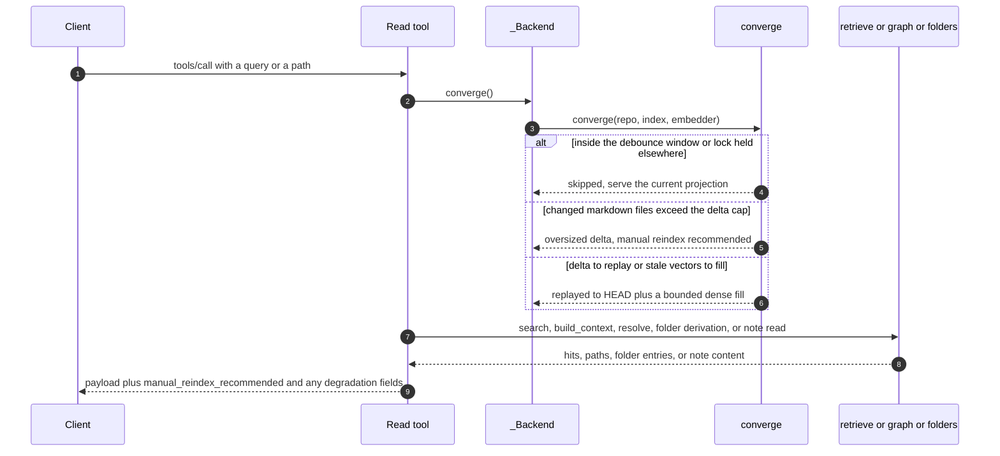
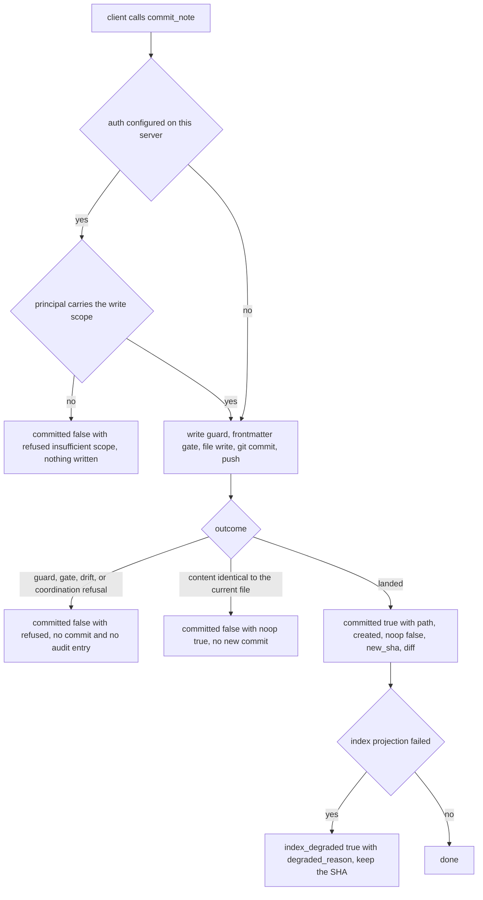

# MCP Tool Surface

This is what a client codes against: which tools exist, what they accept, what shape their result
has, and what a result means when the engine is running degraded. The authority is the `@mcp.tool`
registrations that `build_server()` performs in `src/hypermnesic/mcp_server.py` — a prose reference
can drift, the registrations cannot, and the test suite pins the difference.

## The registered set

`build_server()` registers **seven read tools unconditionally** and the write tool inside an
`if write_enabled:` branch. That branch is the structural property, not a courtesy: a read-only
server has no write path to reach, so no client can talk it into a write.

| Tool | Kind | Scope | Registered |
|---|---|---|---|
| `search` | read (`readOnlyHint: true`) | read | always |
| `hypermnesic_search` | read (`readOnlyHint: true`) | read | always |
| `build_context` | read (`readOnlyHint: true`) | read | always |
| `think` | read (`readOnlyHint: true`) | read | always |
| `resolve` | read (`readOnlyHint: true`) | read | always |
| `list_folders` | read (`readOnlyHint: true`) | read | always |
| `read_note` | read (`readOnlyHint: true`) | read | always |
| `commit_note` | write (`readOnlyHint: false`) | `write` | **only on a write-enabled server** |

`READ_TOOL_NAMES` and `WRITE_TOOL_NAMES` publish that set as data, and `tests/test_mcp_server.py`
asserts the live registration set equals exactly `READ_TOOL_NAMES` on a read-only server and
`READ_TOOL_NAMES | WRITE_TOOL_NAMES` on a write-enabled one. A renamed tool or an unlisted
addition fails the suite instead of silently widening the contract. Every tool also advertises an
`outputSchema` generated from a `TypedDict` result model declared in the server module, and every
input parameter carries a description, both of which tests pin.

### `commit_note` is the one conditional tool

It is registered **only when the server is started write-enabled**. Concretely:

- The public OAuth `/mcp` lane (`build_cloud_server`) always builds write-enabled, so remote
  clients (ChatGPT/Claude connectors, the Claude Code / Codex plugin) do see `commit_note`.
- A tailnet read companion — `build_server` with the default `write_enabled=False`, or
  `hypermnesic serve` without `--enable-write` — does not expose it at all, so "the tool is
  missing from `tools/list`" is the durable, intended signal that a lane is read-only.

Registration is **per server, not per caller**. On a write-enabled lane every client's `tools/list`
includes `commit_note`, including a client holding only the `read` scope, whose call is refused at
call time by the tool's own scope check. A write-enabled serve bound to a tailnet address also
refuses to start without auth configured (a loopback bind and the explicit, CGNAT-bounded
`--allow-tailnet-write` opt-in are the only exemptions), so on the network lanes a registered write
tool implies a configured auth boundary. See
[Serving Topology and Authentication](serving-and-authentication.md).

## Every read converges before it answers

Each read tool calls `_Backend.converge()` as its first statement, before the tool-specific query.
The index catches up to `HEAD`, a bounded slice of the dense lag is closed, and the caller receives
the outcome as **fields on the result**, never as an exception. `_Backend` itself is lazy: the
index, the graph, and the embedder are constructed on first use, and a missing embedding credential
becomes dense degradation rather than a server-start failure.

*One read tool call: convergence runs first, and its outcome rides back to the client as payload
fields.* The pass itself — its four statuses, debounce, non-blocking lock, and bounded dense fill —
belongs to [Read-Time Convergence](../architecture/read-time-convergence.md).

## The read tools

Daily recall uses them together: `search` for direct recall, `build_context` to expand around a
known hit, `think` for related notes and open questions, `resolve` before wikilinking an entity,
`list_folders` before placing a write, and `read_note` to pull a located note's body.

### `search(query, k=10)` and `hypermnesic_search(query, k=10)`

Both names call **one shared internal function**, so their inputs, behavior, and result shape cannot
diverge — a test asserts the two `outputSchema`s are identical. `hypermnesic_search` exists only for
clients that auto-prefix tool names with the server id, for which the bare name is unreachable;
prefer `search` otherwise.

The result is `{ query, degraded_lexical_only, degraded_reason, manual_reindex_recommended,
hits }`, and each hit carries:

- `path` — the repo-relative markdown path, the value to feed back into the other read tools;
- `heading` — the matched section heading;
- `score` — the fused score, rounded for transport;
- `channels` — the sorted set of retrieval lanes that matched this hit (`lexical`, `dense`, `doc`);
- `snippet` — a bounded prefix of the matched chunk text (at most 280 characters);
- `recency` — epoch seconds of the most recent commit touching that path, resolved from a single
  `git log` pass, or `null` when the path is untracked.

Fusion, the lanes, and the candidate pool are documented in
[Retrieval and Indexing](../architecture/retrieval-and-indexing.md).

### `build_context(path, depth=1)`

Pages reachable from `path` through **body `[[wikilinks]]`**, following both incoming and outgoing
edges up to `depth` hops. The traversal is cycle-safe and the returned `context` list is sorted, so
results are reproducible; it excludes the start page. Returns `{ start, depth, context,
manual_reindex_recommended }`. Use it as the expansion move after a `search` hit.

### `resolve(name)`

Entity resolution: a name to an existing page path, or **`null` when ambiguous or missing** — never
a wrong guess, because a wrong wikilink silently connects two unrelated things and both a human and
an agent will believe it. Matching is the same exact-path / `.md`-suffix / unambiguous-stem logic
that body wikilinks use, including stripping a `|display` alias and a `#anchor`. Returns
`{ name, resolved, slug, manual_reindex_recommended }`, where `slug` is the `.md`-stripped target
the caller puts inside `[[…]]`.

### `think(topic, k=8, depth=1, path=null)`

Thinking-mode: related notes, one note-grounded Socratic prompt, graph context, and pairs of notes
that surface together but are not yet linked. It is **read-only by construction** — the module
imports only read surfaces and cannot reach the write path — and `wrote` is always `false`, which is
the observable assertion of that boundary.

Pass the active note's repo-relative `path` to exclude it from its own results. When that exclusion
removes every retrieval hit, `think` falls back to the note's explicit graph neighbourhood and
returns those neighbours as low-confidence `graph`-channel related notes (score `0.0`) rather than a
blank thinking surface. Returns `{ topic, wrote, related, context, questions, unlinked,
degraded_lexical_only, degraded_reason, note, manual_reindex_recommended }`; `note` carries the
"nothing relevant yet" message when there is no related material.

### `list_folders(root="", depth=1)`

Folder taxonomy and writable locations, so an agent can discover where a note may land before
attempting the write. Returns `{ root, depth, folders, truncated, omitted, agent_instruction,
manual_reindex_recommended }`, where each folder entry is `{ path, writable, protected_reason,
note_count }` with a recursive `note_count`.

**The `writable` flag is single-sourced with the write path.** `build_server` computes the effective
write surface once and hands the same value to `commit_note` and to folder discovery, which
classifies each folder by probing a synthetic note *under* the prefix through the write guard. A
bare prefix would mis-read a folder like `projects/scripts/` as writable, so the probe is what makes
discovery and the write path agree — including for nested protected directories. Full write-guard
semantics are in [Write Guard and Security Model](../architecture/write-guard-and-security-model.md).

Bounds follow the same "cap plus a signal" precedent as the delta cap: entries are sorted *before*
the node cap, so truncation always drops a deterministic tail, and `truncated` with `omitted` tells
the caller to narrow `root` for more. `depth` is clamped to a ceiling. A malformed root — absolute
or containing `..` traversal — does **not** raise: the tool returns an empty, leak-free listing with
`agent_instruction: null`, so a bad request cannot be used to probe for out-of-vault paths through
error messages.

`agent_instruction` is the requested root's **direct** instruction file: `AGENTS.md` when present,
falling back to `CLAUDE.md` only when `AGENTS.md` is absent at that same root. Descendant instruction
files are deliberately not aggregated into a parent listing — narrow `root` to the child to read its
guidance. The content is sanitized before it leaves the read surface: host-local absolute paths are
replaced with a `<local-path>` placeholder and private/tailnet endpoint URLs (including any `/mcp`
URL) with `<endpoint-url>`, while repo-relative paths and public URLs survive intact.

### `read_note(path)`

The full markdown body of one note, typically by a `path` returned from `search`, `resolve`, or
`build_context`. **Index membership is the security boundary:** only committed, in-vault markdown
notes appear in the index's path set, so a `../` traversal, an absolute path, or a non-note file
such as `.env` or anything under `.git/` is simply absent and returns `found: false` with
`content: null` — not an error, and never a read outside the vault. A resolved-within-repo check on
top of the membership test adds defence in depth. Returns `{ path, found, content,
manual_reindex_recommended }`.

## Degradation and manual reindex: contract, not errors

Read results are honest about a partially working engine. These fields are part of the contract, and
a client that renders only `hits` will silently present lexical-only answers as the full product.

| Field | Meaning |
|---|---|
| `degraded_lexical_only` | `true` when the dense channel did not contribute, so the answer came from lexical (and graph) evidence. |
| `degraded_reason` | `null` when dense contributed; otherwise names the provider or configuration state — `missing_embedder`, `configuration`, `rate_limited`, `cooldown`, `api_error`, or `embedding_error`. |
| `manual_reindex_recommended` | `true` only when convergence skipped an oversized delta and served the current projection; a signal to the owner, never something the tool acts on. |

`search` and `think` are the two tools that carry the degradation pair; `build_context`, `resolve`,
`list_folders`, and `read_note` carry only `manual_reindex_recommended`. `search` reports
`degraded_lexical_only` when *either* the query embedding or the convergence dense fill degraded,
and prefers the convergence reason when both are set; `think` merges the convergence reason into its
own. The reason vocabulary comes from the embedder and the convergence pass — a missing key is
`missing_embedder`, a rejected credential is `configuration`, a provider 429 is `rate_limited`, the
in-process cooldown that follows one reports `cooldown` (default 300 s,
`EMBED_FAILURE_COOLDOWN_SECONDS`), any other provider status is `api_error`, and everything else
falls back to `embedding_error`. Tunables and their defaults are in
[Configuration and Tunables](../operations/configuration-and-tunables.md).

The distinction matters operationally: "the index is broken" and "your provider is throttling you"
produce the same empty-looking symptom but different next actions. A 429 in particular is not an
outage — reads keep answering from lexical and graph evidence while the cooldown holds, and the
dense lag drains later. Consumers that branch on these fields include the per-prompt recall hook,
which reports `degraded_lexical_only` as its own outcome rather than as a failure — see
[Agent Plugins and Hooks](../integrations/agent-plugins-and-hooks.md).

## The gated write tool

### `commit_note(path, body=None, set_fields=None, summary=None)`

The one sanctioned write. It is git-first: the file is written, committed, and pushed, and the index
follows as a projection; the agent never merges. Git-first ordering, the guards, and the audit log
are documented in [Git-First Write Path](../architecture/git-first-write-path.md); what follows is
the client-visible contract.

`body` is the full markdown body to commit; omit it to only set frontmatter fields on an existing
note. `set_fields` is a YAML mapping to set or merge. `summary` is an optional commit-message
summary. A write with no net content change is not an error.

*The gated write: registration decides whether the tool exists, the scope check and the guards
decide whether the write lands, and a degraded index is a success rather than a refusal.*

**The tool self-enforces the `write` scope per call**, independently of the transport's global
required-scope list. The SDK middleware applies one scope list to every tool, which cannot separate
read clients from write clients on a single endpoint — so the tool checks the caller's scopes itself
and refuses a read-scoped token before any write is attempted. The refusal tells the client to
reconnect and approve write access, and says explicitly that write approval does not bypass
protected-path, frontmatter, dirty-tree, head-drift, audit, or git coordination guards. When no auth
is configured (a loopback serve, or the explicit tailnet-trust opt-in) there is no principal and no
scope check; the guards below still apply.

**The result is a union**, and its branches mean materially different things:

| Branch | Fields | Meaning |
|---|---|---|
| Success | `committed: true`, `path`, `created`, `noop: false`, `new_sha`, `diff` | The write landed as a real commit. |
| Refusal | `committed: false`, `refused` | **Nothing was written.** A protected-path / governance / allowlist refusal, a frontmatter-drift abort, a head-drift / dirty-tree / coordination refusal, or an insufficient-scope rejection. No partial write, no audit entry. |
| No-op | `committed: false`, `noop: true`, `new_sha` at the unchanged `HEAD`, empty `diff` | The content was already identical (or nothing staged for that path), so no new commit was created. |
| Degraded success | `committed: true`, `index_degraded: true`, `degraded_reason` | **The commit landed**; only its index projection failed. Keep the SHA and do not write the note again somewhere else. |

Never conflate the refusal branch with the degraded-success branch: a refusal wrote nothing, while a
degraded success wrote everything and merely lags in recall. The tool returns an explicit structured
`CallToolResult` rather than letting the framework materialize absent union fields as nulls, so a
remote client sees only the branch that actually applies — an HTTP regression test covers exactly
that, because a refusal used to reach clients as a schema-validation error instead of a clean
refusal payload.

Refusals are control signals. A client should surface the refusal text and stop, not retry the same
content at a different path or over a different transport.

## What the tool descriptions promise

For an agent the descriptions *are* the documentation, so they are part of the contract and carry
their own guidance: that read tools converge first, that `resolve` returns null rather than
guessing, that `think` never writes, that `list_folders` should be consulted when the destination is
unclear and that its `writable` flag matches what `commit_note` accepts, that a degraded write means
"keep the returned SHA and do not rewrite the note", and that read results degrade to lexical rather
than failing. Tests assert those descriptions stay substantive (purpose, retrieval model, return
shape) instead of collapsing back to one-liners.

## Changing the surface

The documented rule is that documentation is part of the change: adding, removing, renaming a tool,
or changing its arguments requires `docs/reference/mcp-tools.md`, the tool list in `README.md`, and
`ARCHITECTURE.md` (when the serving picture moves) in the **same PR** — the non-negotiable
"Documentation must not drift" rule in `AGENTS.md`.

The mechanics are pinned by tests, so follow them rather than discovering them:

- a new read tool belongs in `READ_TOOL_NAMES`, is annotated `readOnlyHint: True`, returns a
  `TypedDict` result model declared in the server module, and calls `backend.converge()` first;
- a tool that accepts arguments must describe each one, for the parameter-schema dimension;
- the `hypermnesic_search` alias must stay schema-identical to `search`;
- the plugin SKILL may name only real engine tools, which `tests/test_plugin.py` enforces, so a
  renamed tool that skips the plugin prose is a broken instruction for the agents reading it.
