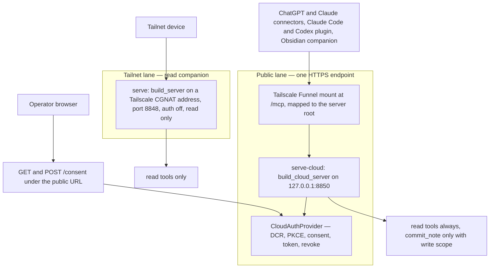
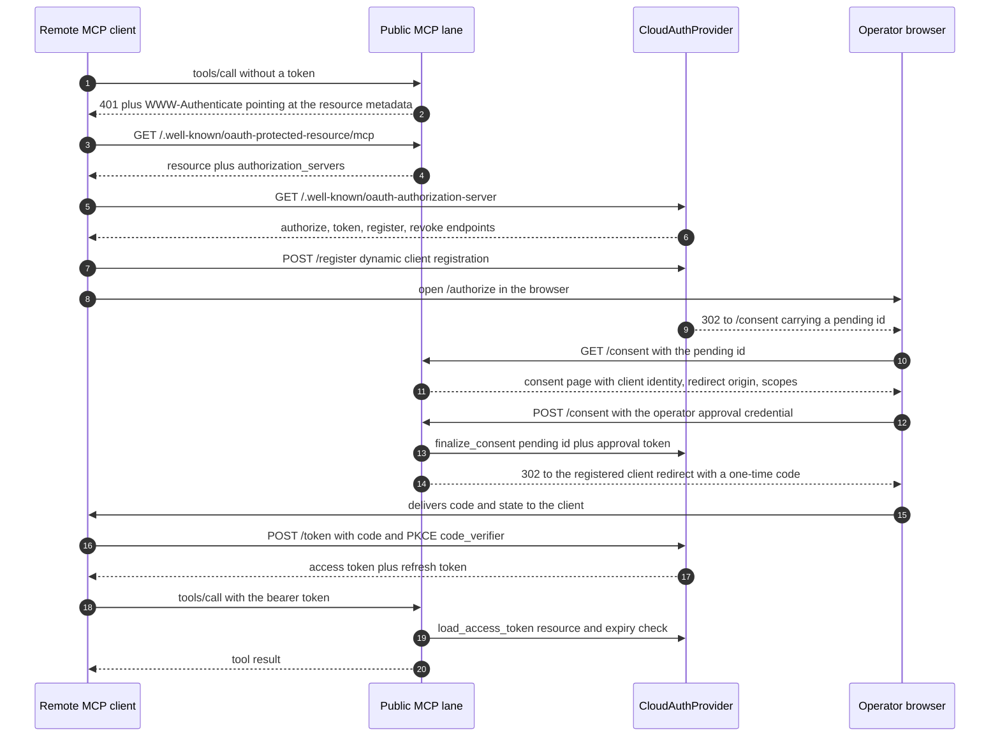

# Serving Topology and Authentication

Everything a remote client can reach passes through one of **two network lanes**, and
`src/hypermnesic/mcp_server.py` is the single place both are constructed. The separation is
deliberate: the public lane carries every untrusted client behind full OAuth 2.1, and the
tailnet lane stays a plain, read-only companion that trusts network membership rather than
credentials.

| Lane | Constructor | Auth | Tools |
|---|---|---|---|
| Public OAuth `/mcp` | `mcp_server.build_cloud_server` | OAuth 2.1: DCR + PKCE + operator consent; RFC 8707 audience-bound tokens | Read tools always; `commit_note` only with the `write` scope |
| Tailnet read companion | `mcp_server.build_server` (`hypermnesic serve`, port `8848`) | None — tailnet membership is the boundary | Read tools only, structurally |

`build_cloud_server` is not a second server implementation: it calls `build_server` with
`write_enabled=True`, an `auth_server_provider`, and matching `AuthSettings`, then adds the
`/consent` route and the metadata patch. Tools, write guards, allowlist coercion, and the audit
path are therefore identical on both lanes, and only the auth wiring differs.

*The two lanes: one public Funnel'd OAuth endpoint serving every remote client, plus a
read-only tailnet companion that shares the same tool implementation under a different auth
boundary.*

The retired lanes are worth naming because older material still describes them: the `:8849`
tailnet `client_credentials` AS service and the `:8851` auth-on write master were folded into
the unified `/mcp` endpoint. The resource-server verification code path in `auth.py` remains
built and tested — `hypermnesic serve --auth-issuer-url … --auth-resource-url …` still enables
it — but the live tailnet lane is the auth-off read companion.

## Construction invariants: fail loud, no half-open server

Every invariant below is checked in `build_server` **before** a `FastMCP` object exists, so a
misconfigured deployment exits non-zero rather than starting something subtly wrong. The CLI
catches the resulting `ValueError` and prints `serve failed: …` (exit 1).

- **A wildcard bind is refused.** `0.0.0.0`, `::`, and an empty host raise at construction;
  "tailnet-only" is a socket-level binding invariant, never the absence of a public DNS record.
  This check runs *first*, so it also fires when auth is correctly configured.
- **Auth is configured as a pair.** `AuthSettings` plus **exactly one** of a `token_verifier`
  (resource server only, the tailnet lane) or an `auth_server_provider` (AS + RS, the public
  lane). Settings without a validator, a validator without settings, and both validators at once
  are each refused.
- **`write_enabled ⇒ auth-required`** on any non-loopback bind. A write-enabled tailnet master
  cannot start without auth, mirroring the `0.0.0.0` refusal so a unit re-render or a rollback
  can never silently serve `commit_note` unauthenticated. A loopback bind is exempt — it is
  reachable only by the local user, the boundary the CLI write path already has.
- **`trust_tailnet_write` is the one bounded opt-out.** It accepts tailnet membership as the
  write boundary, but only for a literal address inside the Tailscale CGNAT range
  (`100.64.0.0/10`); a non-tailnet host is refused with an explicit "that would be a public
  write hole, not a tailnet one" error, and the wildcard refusal still fires.
- **An explicitly empty `--allowlist` on a write-enabled serve is refused** — it would narrow
  writes to nothing, a silent brick rather than a bounded surface.
- **The public lane must advertise an HTTPS public origin.** `public_url` and `resource` are
  both rejected if they are plain HTTP or a bare IP literal, because such an endpoint is
  undiscoverable over the RFC 9728 → 8414 chain — the original defect that forced a separate
  public lane to exist.
- **Behind a TLS-terminating Funnel, the public host is trusted.** When the caller declares its
  public host(s) (derived from `public_url` and `resource`), DNS-rebinding protection stays on
  but the allowlist widens from loopback-only to include that host — otherwise every proxied
  `/mcp` call would return `421 Invalid Host header` on the loopback bind.

## The public lane: authorization code, DCR, PKCE, consent

*The authorization-code flow on the public lane: discovery, dynamic registration, an
operator-authenticated consent step, a PKCE-protected single-use code, then audience-bound
tokens used for tool calls.*

### Why consent must authenticate the operator

This is the load-bearing reasoning of the whole lane. The endpoint is public,
internet-reachable, and **write-capable**, and Dynamic Client Registration lets any internet
client register itself. The only thing between the open internet and write access to the
operator's memory is therefore the consent step — so `authorize()` never mints a code: it
stashes the request and redirects the browser to `<public_url>/consent`, and only
`finalize_consent()` with the operator's approval token issues one.

The approval token is held as a SHA-256 hash and compared with `hmac.compare_digest`, is read
**only** from `HYPERMNESIC_CLOUD_APPROVAL_TOKEN` (never a CLI flag, which would leak through the
process table or shell history), and must clear `MIN_APPROVAL_TOKEN_LEN` (24 characters) or
`serve-cloud` refuses to start. `setup` generates it with 32 bytes of `secrets.token_urlsafe`
into an owner-only (`0600`) env file and reuses a still-valid secret on later runs.

The pending pool is bounded on three axes so an anonymous endpoint cannot be turned into a
resource sink: an unconsented `/authorize` request expires after `PENDING_TTL_SECONDS` (600), a
pending is dropped after `MAX_CONSENT_FAILURES` (5) wrong approval-token attempts — no
indefinite online brute force against a fixed pending id — and the total pending count is capped
at `MAX_PENDING` (256), oldest-first. `pending_details()` returns `None` for an unknown or
expired id, and its result is what the consent page shows the operator **before** approving:
client name, redirect origin, and requested scopes. Reject and cancel consume the pending
without issuing a code, redirect with `error=access_denied`, and create no grant state at all.

### The consent page

Plain, script-free, and not cached. It escapes every client-supplied field (DCR `client_name`,
redirect URI), renders a **generic** error page for an unknown pending id instead of reflecting
attacker input (the reflected-XSS sink), and warns when the client identity is generic or
missing. Headers are `X-Frame-Options: DENY`, `Cache-Control: no-store`,
`Referrer-Policy: no-referrer`, and a CSP of `default-src 'none'` with
`frame-ancestors 'none'`.

One subtlety is encoded because getting it wrong produces a baffling bug: CSP `form-action` is
enforced against **redirect targets** too, so a bare `form-action 'self'` makes the browser
silently drop the post-consent 302 to the OAuth client's cross-origin callback — the grant is
consumed server-side while the app never receives the code, presenting as "the first Approve
does nothing, and the retry says expired". The policy therefore allows `'self'` plus that one
registered client origin and nothing else. The form posts to `<public_url>/consent`, a
root-absolute action would miss the Funnel's path mount, and the redirect carries only the
authorization code — never the approval token.

### Metadata and public clients

`CloudAuthProvider.metadata()` publishes the RFC 8414 document the discovery chain resolves:
`authorize`, `token`, `register`, and `revoke` endpoints, `authorization_code` and
`refresh_token` grants, `S256` challenges, and `scopes_supported`. Both
`token_endpoint_auth_methods_supported` and `revocation_endpoint_auth_methods_supported` list
`none` alongside the client-secret methods, because app connectors and Codex-style hosts
routinely register without a client secret; PKCE `S256` is what protects those public clients'
code exchange, and the SDK's token handler validates the `code_verifier`. Because the SDK's own
generated metadata route hard-codes confidential-client methods, `build_cloud_server` inserts a
first-match route serving `provider.metadata()` at the process-root
`/.well-known/oauth-authorization-server`, leaving the SDK's token, registration, revocation,
and protected-resource routes intact.

### Scopes, and why the write scope is checked per tool

`scopes_supported` defaults to `("read", "write")`. A dynamically registered client that omits
`scope` receives the configured `default_client_scopes` (default `["read"]`, from
`--default-client-scopes` or `HYPERMNESIC_DEFAULT_CLIENT_SCOPES`); the list is normalized,
de-duplicated, and refused loudly if any value falls outside `scopes_supported` — a
misconfiguration never silently lands in the advertised metadata. A client's requested scopes
are intersected with the supported set, falling back to the defaults when the intersection is
empty.

The public lane sets `required_scopes=None` on its `AuthSettings` on purpose: the SDK's auth
middleware applies **one** scope list to *all* tools, so it cannot separate read clients from
write clients on a single endpoint. The `write` scope is instead enforced inside `commit_note`,
which reads the authenticated principal from `get_access_token()` and refuses a token lacking it
**before any write**, returning `committed: false` with an `insufficient_scope` message that
states write approval does not bypass the protected-path, frontmatter, dirty-tree, head-drift,
audit, or git-coordination guards. See
[MCP Tool Surface](mcp-tool-surface.md) for the tool registrations themselves and
[Write Guard and Security Model](../architecture/write-guard-and-security-model.md) for the
guards a write-scoped client still faces.

## The tailnet lane: resource-server auth (opt-in)

`auth.py` is the glue for running the engine as a pure **Resource Server** validating tokens a
separate Authorization Server issued — the write-master shape rather than the read companion.
`StrictResourceTokenVerifier` wraps an injected raw validation strategy and adds the engine's two
non-negotiables:

- **RFC 8707 strict audience binding.** The token's audience is collected from the `resource`
  field and any JWT `aud` claim (string or array), normalized for trailing slashes. A
  structurally valid token minted for a *different* resource server on the same host is
  rejected, and a token with **no** audience is rejected too — absence cannot be bound.
- **Expiry**, evaluated against the verifier's clock (`now`, injectable for tests).

It **fails closed**: any raw-validation exception, a `None` result, an expired token, or a
wrong audience returns `None`, which the transport turns into a 401 — never a 500, never an
allow, and the token is never logged.

The production raw strategy validates **opaque** tokens by RFC 7662 introspection, because the
upstream homelab AS issues no JWKS. The introspection endpoint is **discovered** from the issuer
over RFC 8414 (path-aware and suffix well-known forms are tried in turn), and the resource
server's own introspection client credentials come from the environment only
(`HYPERMNESIC_RS_CLIENT_ID` / `HYPERMNESIC_RS_CLIENT_SECRET`) — never a committed config. If the
AS exposes no `introspection_endpoint`, or the credential pair is missing, the strategy raises
`ResourceAuthError` with an actionable message rather than degrading to trusting the token.
Auth stays opt-in and additive: a read-only serve with no auth flags keeps the Phase-1
tailnet-only build, and `make_auth_settings` requires both `--auth-issuer-url` and
`--auth-resource-url` (a malformed URL becomes a `ResourceAuthError`).

## Token lifetime, rotation, and revocation

| Value | Default | Where it is set |
|---|---|---|
| Access-token TTL | 48 h (`172800` s) | `config.cloud_token_ttl_seconds`; `serve-cloud --token-ttl` / `HYPERMNESIC_TOKEN_TTL_SECONDS` |
| Refresh-token TTL | 30 days | `CloudAuthProvider(refresh_ttl_seconds=30 * 24 * 3600)` |
| Authorization-code TTL | 300 s | `CloudAuthProvider(code_ttl_seconds)` |
| Pending `/authorize` TTL | 600 s | `PENDING_TTL_SECONDS` |

The 48-hour default is not arbitrary: an overnight idle plus the next morning's digest must not
401, because `mcp-remote` 0.1.38 reacts to a 401 by wiping local credentials instead of calling
`exchange_refresh_token` — a longer access TTL keeps that client off a browser-hang path. The
resolver's precedence is **explicit argument > env > 48 h**, and a non-integer or non-positive
value raises `ConfigError` instead of silently falling back. Only the access token moves: code
and pending TTLs are unchanged and refresh stays 30 days. One operational trap follows from
`setup` baking the resolved value into the rendered unit — an existing unit that still carries
`--token-ttl 3600` keeps issuing one-hour tokens after an upgrade until the flag is updated or
removed. The full knob table lives in
[Configuration and Tunables](../operations/configuration-and-tunables.md#the-access-token-ttl-override).

Tokens are **opaque** and audience-bound: access tokens carry the `hmcloud_at_` prefix, refresh
tokens `hmcloud_rt_`, codes `hmcloud_code_`, and each access token is minted with
`resource=<our resource>` plus an `aud` claim so the RS-side check passes. Refresh **rotates** —
exchanging a refresh token invalidates the consumed one, and the grant id is carried forward.

Access and refresh tokens of one authorization are linked as **siblings under a single grant**,
and that linkage is the point: `revoke_token` (RFC 7009) kills the whole grant — the presented
token, its sibling, and every grant index entry — even though the old access token would
otherwise have kept its remaining TTL. The owner-facing `revoke_grant(grant_id)` does the same
and marks the grant `revoked`. Revocation also works **out of band**: both `load_access_token`
and `load_refresh_token` re-check the on-disk grant store for the token's grant on every
validation, so a grant marked revoked by `hypermnesic clients revoke --apply` is honoured by an
already-running server sharing that store on its next request instead of at the next restart,
and a revoked client cannot recover by refreshing.
`_sweep()` runs on each authorize/consent/list/revoke call, evicting expired pendings, codes,
and tokens, dropping the oldest pendings past the cap, and reconciling grant status to `expired`
when its token pair is gone.

## Two state files, deliberately separate

| File | Contents | Role |
|---|---|---|
| `<repo>/.hypermnesic/client-grants.json` | Secret-free reviewable metadata only | The **owner control surface**: listing and revocation |
| `<repo>/.hypermnesic/cloud-oauth-state.json` | DCR client registrations, access/refresh tokens, sibling and grant indexes | **Restart survivability** for refresh across deploys |

`client_control` persists grants through a key whitelist (`_SAFE_KEYS`: grant id, client id/name,
redirect URI and origin, scopes, `write_enabled`, timestamps, expiry times, status, `active`,
`revoked_at`) and writes with a temp file plus `os.replace`. Bearer tokens, refresh tokens,
approval credentials, client secrets, and token hashes never reach it — a property tests assert
by dumping the whole listing and checking the live token strings and secrets are absent. Its
default path is `client_control.grant_store_path(repo)` and `--grant-store` overrides it.

The OAuth state file is the opposite kind of object and is kept separate so an owner can inspect
and revoke without ever handling credential material. It is written `0600` outside committed
content, carries a `version` field (`OAUTH_STATE_VERSION = 1`) and refuses to load an
unrecognized version rather than guessing at the format, holds the client registrations plus
live bearer/refresh material and the sibling/grant indexes, and is written atomically
(temp file, `chmod 0600`, `os.replace`). It must not be committed, logged, or shared; it is
**not** a listing surface.

## Configuration and operations

| Surface | Purpose |
|---|---|
| `hypermnesic serve --index-db … --host <tailnet-ip>` | The tailnet lane. `--host` is required; `--enable-write` registers `commit_note`; `--auth-issuer-url` + `--auth-resource-url` (+ repeatable `--required-scope`) switch it into RS mode; `--allow-tailnet-write` is the bounded write opt-out |
| `hypermnesic serve-cloud --index-db … --public-url https://<your-host>.ts.net/mcp --resource …` | The public lane: loopback bind (`127.0.0.1`, default port `8850`) behind the Funnel, write-enabled, with the consent route; `--token-ttl`, `--default-client-scopes`, `--allowlist` |
| `hypermnesic setup <repo> --public-url …` | One idempotent command: consent secret, cloud unit, Funnel routes, live HTTPS discovery verification |
| `hypermnesic clients list <repo>` / `clients revoke <repo> <grant-id> [--apply]` | Owner-side grant inspection and revocation over the secret-free store |
| `hypermnesic doctor` / `status [--public-url …]` | Non-mutating diagnostics, including whether the endpoint challenges unauthenticated requests |

Serving-specific environment variables: `HYPERMNESIC_CLOUD_APPROVAL_TOKEN` (the consent secret,
environment **only**), `HYPERMNESIC_DEFAULT_CLIENT_SCOPES`, `HYPERMNESIC_TOKEN_TTL_SECONDS`, and
the RS pair `HYPERMNESIC_RS_CLIENT_ID` / `HYPERMNESIC_RS_CLIENT_SECRET`. Every value is read
from the environment or a gitignored `.env` and is never written to the index, the audit log, or
any output. Deployment mechanics — the Funnel mounts and their per-mount targets, the
fail-closed ordering, the verification bundle, and idempotence — belong to
[Provisioning and Diagnostics](../operations/provisioning-and-diagnostics.md) and to
`docs/unified-oauth-mcp-deploy-runbook.md`; owner control of grants is covered in
[Memory and Client Control](../operations/memory-and-client-control.md).

## What a change here must touch

Auth and serving changes are security-sensitive and doc-coupled rather than self-contained:
`auth*.py` and `mcp_server.py` are code-owner-routed, and the repository's own drift table
requires the **same PR** to update the `ARCHITECTURE.md` serving section, the serving-topology
pin in `docs/README.md`, `docs/unified-oauth-mcp-deploy-runbook.md`, `README.md`, and
`SECURITY.md` — whose "current security posture" restates the two-lane topology, the
`write_enabled ⇒ auth-required` invariant, and the split between owner-only OAuth runtime state
and the secret-free grant metadata. New or changed knobs also move
`docs/reference/configuration.md`.

Committed configuration and docs carry **placeholders only** (`https://<your-host>.ts.net/mcp`,
the `100.64.0.0/10` CGNAT range) — never a real operator host, IP, token, or key. That is
enforced by `scripts/preflight_public_scan.py`, which scans git-tracked files for the operator's
host/IP, credential classes (API keys, JWTs, PEM private keys, inline token values), and
operator home paths, and masks any match in its own output so the gate never re-prints a secret.

## Focused tests

- `tests/test_auth.py` pins the RS invariants directly, with the raw validator and the
  introspection POST injected (no network): valid/invalid/expired tokens, exception →
  fail-closed, wrong or missing audience rejected, `aud` as a string list, trailing-slash
  insensitivity, async validators, and the assertion that a token string never appears on stdout
  or stderr.
- `tests/test_auth_cloud.py` pins the AS behavior: `authorize` routes to consent rather than
  minting a code, approval-token gating with the failure cap, pending expiry, reject/cancel
  leaving no grant, single-use resource-bound codes with the PKCE challenge preserved, TTL
  defaults and overrides in issued tokens, refresh rotation, whole-grant revocation including
  the refresh sibling, restart survival of OAuth state, consent-page escaping and CSP, unified-lane
  metadata and HTTPS-origin refusals, proxy-host trust, and the per-tool write-scope refusal.
- `tests/test_mcp_server.py` pins the construction invariants: the wildcard refusal (even with
  auth configured), the auth-pair rules, `write_enabled ⇒ auth-required` with the loopback
  exemption, the CGNAT-bounded `trust_tailnet_write` opt-in, and the empty-allowlist refusal.
- `tests/test_cli.py` pins the operational contract: the approval token comes from the
  environment (refused when absent or too short), `--token-ttl` and its env override are plumbed
  through, default client scopes resolve from flag then environment, and a missing-token
  `serve-cloud` exits 1.

## Related pages

- [Architecture Overview](../architecture/overview.md) — where the lanes sit in the layer map.
- [MCP Tool Surface](mcp-tool-surface.md) — the tools a client codes against, and the
  registration that makes a read-only lane structurally read-only.
- [Write Guard and Security Model](../architecture/write-guard-and-security-model.md) — what
  write approval does *not* bypass.
- [Memory and Client Control](../operations/memory-and-client-control.md) — the owner-side
  grant listing and revocation surface.
- [Provisioning and Diagnostics](../operations/provisioning-and-diagnostics.md) — `setup`,
  `doctor`, the Funnel routes, and the discovery verification bundle.
- [Agent Plugins and Hooks](../integrations/agent-plugins-and-hooks.md) — how client wiring
  discovers this endpoint without a static token.
