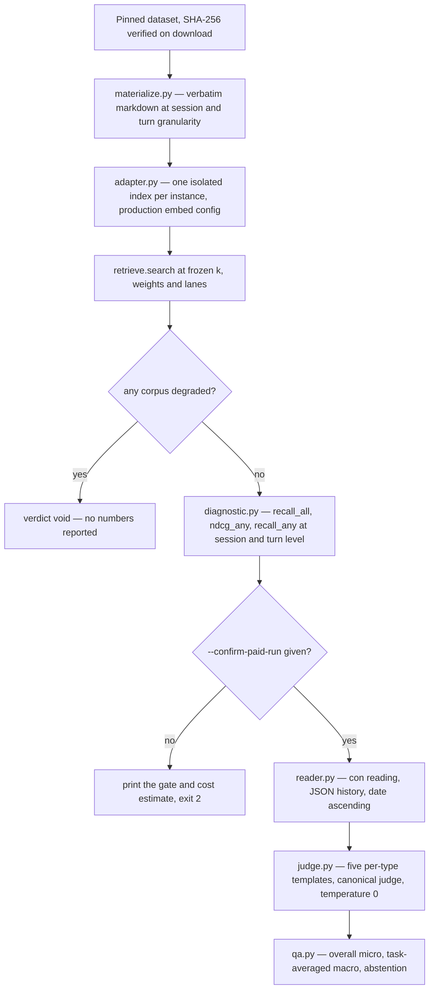
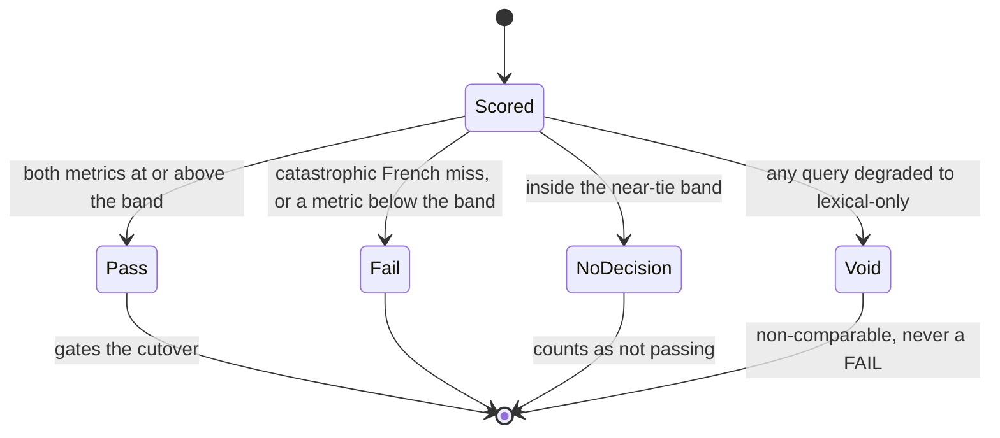

# Benchmarks and Evaluation

Retrieval quality in this repository is measured by a re-runnable harness under `harness/`, not
asserted. Nothing under `harness/` is shipped engine code — the subpackage is importable as
`longmemeval` by stem and is deliberately not part of the installed wheel — and the harness
consumes the **shipped read path** rather than a benchmark-specific variant of it
([`harness/longmemeval/__init__.py`](../../harness/longmemeval/__init__.py),
[`tests/conftest.py`](../../tests/conftest.py) puts `harness/` on `sys.path`).

Two independent evidence streams meet here, and they are never allowed to stand in for each
other: LongMemEval measures **retrieval quality**, while product claims also require local
product smoke, offline remote contracts and the readiness checklist (see
[What benchmarks do not prove](#what-benchmarks-do-not-prove)).

The discipline of this page is inherited from the harness itself: a score is meaningless without
the exact conditions that produced it. `harness/BENCHMARKS.md` is the public verdict document and
the **single source of truth for every measured number**; this page explains the machinery and the
rules, and quotes numbers only with their reader, judge and dataset labels attached.

## The comparability envelope

> A LongMemEval score is only comparable to another score that shares **three** axes: the reader
> model, the judge model, and the dataset release. The field's published headline numbers differ on
> all three.

| Axis | This harness measures | Not comparable to |
|---|---|---|
| Benchmark | LongMemEval **V1**, `_s` variant | LongMemEval V2 (multimodal, different metric) |
| Judge | `gpt-4o-2024-08-06` — the canonical judge | rows graded by a **GPT-4.1 judge**, which is more lenient |
| Dataset release | `cleaned-2025-09`, pinned by content hash | rows reported on the **original** release |
| Ingestion | raw verbatim, RAG-style | distilled / fact-extraction systems' best rows |

The judge axis is the one that most often gets conflated with memory quality. The
`gpt-4o-2024-08-06` snapshot is pinned not as a preference but as a comparability requirement: the
official aggregator hard-asserts it, so a non-`gpt-4o`-judged column would be rejected, and a
GPT-4.1-*judged* column is deliberately out of scope
([`harness/longmemeval/manifest.py`](../../harness/longmemeval/manifest.py),
[`harness/longmemeval/judge.py`](../../harness/longmemeval/judge.py)). Because reader strength also
moves the headline, the harness publishes **both** reader columns under that one shared judge, so
the gap between them is a clean reader effect rather than a mixed reader-plus-judge artifact.

Every cited external row is attributed per **reader · judge · dataset release**, and that discipline
has already caught a real error: an ~84-point GPT-4o-judge figure attributed in planning to one
system actually belongs to another that publishes no GPT-4o-judge row at all. The correction is
recorded in the verdict document's log rather than quietly fixed
([`harness/BENCHMARKS.md`](../../harness/BENCHMARKS.md)).

## The two phases



*Phase 1 is embeddings-only and unscored unless every corpus stayed embed-quiescent; Phase 2 repeats only the reader pass, behind an explicit paid-run gate.*

**Phase 1 — the retrieval diagnostic** (`manifest.py` → `materialize.py` → `adapter.py` →
`diagnostic.py`) costs embeddings and nothing else. Each instance's sessions are materialized
**verbatim** — no summarization or fact extraction between the dataset and the index — at two
granularities: one note per session (the QA corpus) and one note per *user-turn round* (the turn
diagnostic corpus). The session date is written into the note **body**, not frontmatter, because
frontmatter is stripped before indexing and both retrieval and the reader need the date inline. File
names and bytes are a pure function of the instance, so re-materializing yields byte-identical
files; gold is reconstructed from `answer_session_ids` at session level and from the rounds carrying
`has_answer` at turn level, and the `_abs` (abstention) instances carry **no** retrieval gold at
either granularity, matching the official runner
([`harness/longmemeval/materialize.py`](../../harness/longmemeval/materialize.py)).

Each instance then gets its **own isolated index**, built with a state directory outside the corpus
and discarded afterwards, using the production embedding configuration unchanged
(`config.EMBED_MODEL` / `config.EMBED_DIM`) and fusion parameters frozen from the manifest. Ranked
chunk hits are collapsed to unique unit ids, so several chunks of one session or round count once
([`harness/longmemeval/adapter.py`](../../harness/longmemeval/adapter.py),
[`harness/longmemeval/manifest.py`](../../harness/longmemeval/manifest.py)). The metrics are the
official ones: `recall_all@k` (1.0 only if *every* gold unit is in the top-k), `ndcg_any@k` (binary
relevance, ideal-DCG normalized), session level at @5/@10 and turn level at @5/@10/@50, plus a
turn→session derived session ranking that shows whether evidence missed by the session ranking was
reachable at all ([`harness/longmemeval/diagnostic.py`](../../harness/longmemeval/diagnostic.py)).
These are deliberately **distinct** from the parity harness's fractional `recall_at_k` — the two
harnesses do not share a metric definition.

**Phase 2 — end-to-end QA** (→ `reader.py` → `judge.py` → `qa.py`) retrieves once and shares the
retrieved context across reader columns; only the reader pass repeats, and both columns are graded
by the same judge. The reader answers with the official `con` (chain-of-note) convention: the
retrieved units are presented as a JSON history sorted **ascending by date**, the question's
`Current Date` is threaded through, and `has_answer` is never present (the materializer writes clean
verbatim bodies), so the model cannot see which turn is the evidence. Context that exceeds the
budget — `model_max − gen_length − 1000` — is truncated from the **oldest** unit, which is why the
GPT-4o column truncates where GPT-4.1's 1M window fits `_s` untruncated
([`harness/longmemeval/reader.py`](../../harness/longmemeval/reader.py)).
The judge selects one of the five official per-`question_type` templates — default, temporal
tolerance, knowledge-update ("latest wins"), preference rubric, and abstention — from the normalized
question type plus the `_abs` flag, decodes at `temperature=0` / `max_tokens=10`, and parses the
label with the official substring rule `'yes' in text.lower()`, replicated exactly so an official
aggregator would accept the labels ([`harness/longmemeval/judge.py`](../../harness/longmemeval/judge.py)).

Scoring, per reader column, matches the official `print_qa_metrics.py`: **overall** (micro),
**task-averaged** (macro over the question-type buckets, abstention excluded — the headline metric),
and **abstention** reported separately and never folded into the buckets. Two deliberate details
keep a partial outage from masquerading as a low score: an empty bucket set reports `None` rather
than a misleading `0.0`, and reader/judge error counts are surfaced alongside the numbers
([`harness/longmemeval/qa.py`](../../harness/longmemeval/qa.py)).

The paid 500-question run is a **gated** step. `qa.py` refuses to spend without an explicit
`--confirm-paid-run`, printing the gate and the Phase-1 embedding ceiling estimate and exiting
non-zero; retrieval is then routed through the OpenAI **Batch API** (50% cheaper), with one reader
batch **per model** — the Batch API rejects a batch that mixes models — plus one judge batch over
the reader answers. The batch transport is transport-only and fully injectable, raises on a
non-completed terminal state or timeout, and surfaces per-request errors instead of fabricating
answers ([`harness/longmemeval/qa.py`](../../harness/longmemeval/qa.py),
[`harness/longmemeval/batch.py`](../../harness/longmemeval/batch.py)).

## Reporting rules baked into the harness

These are not conventions layered on top of the code; they are enforced by it, which is why the
numbers can be trusted to mean what they say.

- **Frozen parameters, no tune-to-pass.** `k`, the fusion weights, the lanes and near-dup collapse
  are frozen at manifest values *before* any run. The diagnostic does retrieve a deep candidate list
  (`adapter.SEARCH_DEPTH`, 200) so that @50 is reportable, but that is a *measurement* depth, not a
  tuned fusion parameter — changing it would change what is measurable, not what is ranked. Any
  parameter change belongs in the corrections log.
- **The embed-quiescence void.** `embed.smoke_embed_or_die()` runs before scoring, and an
  `EmbeddingError` during index build or search is caught and surfaced as `degraded` with an empty
  ranking. If **any** corpus degraded to lexical-only, the whole run is **voided** — no numbers are
  reported — because a degraded run is non-comparable, not a failing score. The same rule governs
  the parity harness, where the verdict becomes `void` rather than a false `fail`.
- **`recall_any` beside `recall_all` where ordering is the real variable.** The engine applies no
  date-aware ranking, so for the date-sensitive abilities (knowledge-update, temporal-reasoning) the
  diagnostic also reports `recall_any@k` and the gold-set-size distribution. That localizes a
  sub-unity `recall_all` to retrieval *ordering* — a known, addressable ranking gap — rather than
  letting it read as missing coverage or a reader failure.
- **Headline labeling.** A run is stamped headline-eligible only when it covers the full set with no
  `--limit` (and, for QA, exactly the two published reader columns). Subset or smoke runs carry
  `headline: false`, so a synthetic number can never be substituted for the headline.
- **Aggregates only.** The downloaded dataset, the materialized corpus, per-question outputs and the
  embedding cache are gitignored; so are the private-corpus parity fixtures (frozen query set,
  baseline, results, review files). What is committed is the manifest, the synthetic smoke subset,
  and aggregate/per-ability tables ([`.gitignore`](../../.gitignore)).
- **A corrections log in the open.** Every methodology correction, parameter change, killed and
  resumed run, and failed batch attempt is recorded in the verdict document — including a first
  Phase-2 attempt that failed provider validation at **$0** and the single-model-batch regression
  test added afterwards.
- **Contamination disclosed.** The dataset is public, so reader pre-training may have seen it, which
  can inflate the end-to-end QA number. That is stated rather than hidden, and it is part of why the
  retrieval diagnostic — unaffected by reader pre-training — is treated as the higher-confidence
  signal.
- **Doc no-drift.** `harness/BENCHMARKS.md` is the single source of truth, and every transcription of
  its numbers (the benchmark chart and its data file, the README benchmark section) is required to
  move in the same change. The failure mode is real: the README benchmark figure's alt text still
  restates the superseded 2026-06-02 GPT-4o column (83.2) while the prose beneath it carries the
  current 83.6 ([`media/engine/benchmark-data.md`](../../media/engine/benchmark-data.md),
  [`README.md`](../../README.md)).

## What the recorded numbers are, and where they live

The tables below are transcriptions of `harness/BENCHMARKS.md` (the 2026-06-13 rerun over the full
`_s` set) and are reproduced here only with their reader · judge labels attached. They are **not**
maintained on this page: if a change moves a measured number, `harness/BENCHMARKS.md` moves first,
in the same change, and this page follows.

| Recorded result | Reader | Judge | Value |
|---|---|---|---|
| Phase 1 session retrieval | — (embeddings only) | — | `recall_all@10` 0.949 |
| Phase 2 lead column | GPT-4.1 (`gpt-4.1-2025-04-14`) | `gpt-4o-2024-08-06` | 88.6 overall / 90.2 task-averaged |
| Phase 2 anchor column | GPT-4o (`gpt-4o-2024-08-06`) | `gpt-4o-2024-08-06` | 83.6 overall / 87.1 task-averaged |
| Comparable external anchors | GPT-4o | `gpt-4o` | 84.2 / 71.2 / 60.2 (original release) |
| GPT-4.1-judged rows — not this measurement | GPT-4.1 | GPT-4.1 (more lenient) | 95.4 / 94.9 |

The honest reading is the matched GPT-4o-reader / GPT-4o-judge axis, where the anchor column sits on
par with the strongest GPT-4o-judged anchor and clearly above the no-memory full-context floor; the
lead column isolates reader strength at a fixed judge. Neither column is the GPT-4.1-*judged* 95%
row, and the gap to it is judge leniency, not memory quality. Cost is recorded too: the Phase-1
embedding ceiling is derived from stated assumptions rather than a magic constant, and the comparable
Batch API Phase-2 run cost $31.30 against a $50 budget. The harness itself records correctness and
error counts, not current-run billing.

## Reproducing a run

Everything needed is pinned in `harness/longmemeval/manifest.json`: dataset URL, SHA-256, release and
variant; the embedding model and dimension read from `hypermnesic.config` (so the manifest can never
drift from production); the reader and judge snapshots; the frozen retrieval parameters; the prompt
template version; the seed; and the cost assumptions. The manifest is generated from
`manifest.py`/`default_manifest()` and never reads or serializes the API key, so a credential cannot
leak into a committed artifact. The download streams to a temporary file, hashes it, and installs it
**only** on a match with the pinned digest; a divergent download raises `DatasetIntegrityError` and
leaves no corpus behind, while an empty expected hash means capture mode (`verified: false`) — a
headline run must pass a pinned hash (`harness/longmemeval/manifest.py`).

```bash
# 0. The paid reader path needs the `bench` extra — tiktoken is not in the default/dev install.
uv sync --extra dev --extra bench

# 1. Fetch the pinned dataset by hash (fails loud on mismatch; nothing written on divergence).
PYTHONPATH=harness uv run python -c "from longmemeval import manifest as m; \
  m.download_dataset('harness/longmemeval/longmemeval_s_cleaned.json', \
  expected_sha256=m.DATASET_SHA256)"

# 2. Phase 1 — retrieval diagnostic (embeddings only; content-hash cached).
PYTHONPATH=harness uv run python harness/longmemeval/diagnostic.py \
  --dataset harness/longmemeval/longmemeval_s_cleaned.json \
  --out harness/longmemeval/results/diagnostic.json

# 3. Phase 2 — end-to-end QA headline (GATED; both reader columns; shared judge).
#    Without --confirm-paid-run the runner prints the gate and cost estimate and refuses to spend.
PYTHONPATH=harness uv run python harness/longmemeval/qa.py \
  --dataset harness/longmemeval/longmemeval_s_cleaned.json \
  --out harness/longmemeval/results/qa.json --batch --confirm-paid-run
```

Two constraints on that path are load-bearing. Benchmark-only dependencies are **permissive only** —
the `bench` extra is `tiktoken` (MIT) and the license gate must stay clean with it installed — and
the reader's token counter is **injectable**, so the offline suite exercises the whole prompt-assembly
path with a lambda instead of tiktoken. The tiktoken-backed counter therefore lives behind a lazy
import and a skip guard, and CI installs only `--extra dev`, runs the full offline suite, and **never**
runs a paid benchmark ([`pyproject.toml`](../../pyproject.toml),
[`tests/test_longmemeval_harness.py`](../../tests/test_longmemeval_harness.py),
[`.github/workflows/ci.yml`](../../.github/workflows/ci.yml)).

The embedding **content-hash cache** is what makes a re-run cheap: vectors are keyed by
`(model, dim, text)`, the default store is in-process, and the SQLite store persists across processes
with packed float64 blobs so a cached vector is byte-for-byte what the embedder returned — a cached
run must reproduce a fresh one exactly. That is also why a killed run can resume for free, and why a
critic re-run re-embeds nothing (`harness/longmemeval/adapter.py`).

## Judge labels and label review

The parity harness needs relevance labels that do not depend on either system, so the fixture pipeline
is explicitly staged: `build_query_set.py` derives a provisional known-item query set (default 18
French / 14 English, stratified across directories, noise channels skipped) from real corpus documents
with agent-proposed labels, expanded to their equivalence classes; the gbrain baseline is captured once
as a frozen fixture; and `judge_labels.py` then re-derives the labels by pooling the candidates from
**both** systems, stripping every rank and source tag, shuffling in a deterministic content-independent
order, and asking an LLM which candidates are genuinely relevant **on content alone**. Because the
judge never learns which engine retrieved a document or where it ranked, the labels stay independent
of the ranking under test, so "at least as good as the baseline" is not circular. An empty judge
result keeps the prior labels rather than wiping them — a failed judgment degrades to a conservative
label set, never to silent label loss.

Two judges are available and their difference is a spend boundary, not a quality claim: `CodexJudge`
drives `codex exec` on a ChatGPT login and consumes no API key, while `OpenAIJudge` uses the API key.
Either way the labels are LLM-judged and system-blind — stronger than agent titles, not human-judged,
which is exactly why `label_review.py` exists. Its `build` step writes a checkbox file over the union
of both systems' top-k with each document's rank on each side and a snippet, pre-checking the current
labels; `apply` parses the ticks back into the frozen query set, marks the set `human-reviewed` (in
the `method` field), keeps labels unchanged when nothing was ticked, and warns in the change report.
The review file, the frozen query set and the baseline are all gitignored, because they quote a
private corpus.

## The adjacent harnesses

**Retrieval parity** (`harness/parity_harness.py`) is the Phase-0 quality gate: it scores this engine
against the frozen baseline on the frozen query set, both sides un-reranked, with all metrics computed
in **equivalence-class space** so a content mirror or a same-event meeting/source pair found by one
side but not the other is not a spurious miss. A pass requires being at or above the baseline on both
aggregate `recall@10` and MRR outside a ±0.02 near-tie band **and** no catastrophic French miss.



*The four verdicts `run_parity` can emit; only `pass` advances the gate.*

A near-tie returns `no_decision`, and `no_decision` counts as not passing. The "catastrophic French
miss" is calibrated to its intent — the engine **wholly whiffs** a French query the baseline answered
(hyp recall 0 while the baseline is above 0) — so it does not fire merely because a document ranked
just below the cutoff while other relevant documents were found. The CLI exits non-zero on anything
but `pass`. The same module computes the composite **cut-over verdict** (`safe_to_cut_over`), which
combines three signals: retrieval parity is a clean `pass`, entity resolution is at or above the
baseline with **zero** false wikilink targets (a miss returning nothing is acceptable; a wrong link is
not), and a freshly committed delta is recall-able through
[read-time convergence](../architecture/read-time-convergence.md) alone with no baseline index step.
Any failing signal blocks the cutover with a named reason — the gate a test enforces.

**Corpus equivalence** (`harness/corpus_equivalence.py`) exists so parity scoring is fair: an exact
content mirror (identical frontmatter-stripped body at two paths) or a same-event representation
(a meeting note and its source transcript sharing a dated slug after a trailing source-id suffix is
stripped). The date is kept in the key, so two different events that merely share a title are never
merged; the two notions are pinned by `tests/test_corpus_equivalence.py`.

**Portability probe** (`harness/portability_probe.py`) validates `clone && init` over additional
operator-controlled repositories with no per-repo infrastructure: does the index build, do `search`
and `build_context` answer, and does initialization leave the target's tracked files byte-identical
with only the gitignored state directory appearing. An overall pass needs every target to pass **and**
both a coding and a markdown repository among them. Its framing is deliberately narrow: because
build-vs-trim was settled on product grounds, a poor result drives onboarding rework, not abandonment.
Its trust boundary is stated in the module — the engine does not sanitize ingested content for prompt
injection, and the index is a retrieval-poisoning vector noted in the threat model, so probe targets
must be operator-controlled or well-known repositories.

**Dogfood preview** (`harness/dogfood_commit_note.py`) dry-runs `commit_note` per operator-supplied
input, so the diff-or-die gate and the protected-path guard execute exactly as live while nothing is
written, committed, indexed or logged. Each input is classified `ok`, `refused`, `gate-abort`,
`missing` or `error`, and the rollup is `safe_to_cut_over` with a count of blocked inputs; pointing it
at a live vault is safe precisely because it is read-only, and the live cutover is out of scope.
**Gate audit** (`harness/gate_audit.py`) is the other read-only pre-cutover probe: it measures how
often a no-op frontmatter field write aborts the gate on a real corpus (the practical usability signal
for the write kernel) and confirms that governance files are refused while ordinary notes are not.
See [Write Guard and Security Model](../architecture/write-guard-and-security-model.md).

**Product smoke** (`scripts/product_smoke.py`) is not a benchmark at all, which is the point. It runs
a deterministic seven-stage local loop — capture, retrieve, write preview, memory inspect, forget
preview, recall after change, doctor status — against a disposable fixture vault with a deterministic
local embedder, and its output is intentionally path-relative and secret-free. A failure stops the
loop and names the stage, and the degraded-capability note is explicit (`lexical-only`). Focused tests
assert the stage list, the fail-stop behavior, and that no evidence value is an absolute path
([`tests/test_smoke.py`](../../tests/test_smoke.py)).

## What benchmarks do not prove

LongMemEval measures retrieval quality. It says nothing about whether setup works, whether consent and
scopes behave, whether memory control does what it claims, whether the plugin hook is observable, or
whether a remote client can actually connect. Product readiness is gated **separately** by:

- the deterministic local product smoke script,
- the offline remote-contract tests (`tests/test_product_remote_smoke.py`),
- the manual [remote-client smoke checklist](../../docs/guides/remote-client-smoke-checklist.md),
- and the [first-class product readiness checklist](../../docs/launch/first-class-product-readiness-checklist.md).

Those documents are explicit that the checklist complements rather than replaces the automated gates,
and that a benchmark score is not a substitute for any of them. See
[Testing and Release Gates](testing-and-release-gates.md) for the gate set CI mirrors and
[Provisioning and Diagnostics](../operations/provisioning-and-diagnostics.md) for what a failing or
degraded deployment looks like in practice.

## Focused tests

The offline suite is the executable half of this page: it runs with no network, no API key and no
spend, with a deterministic fake embedder, an injected fake batch client, and injected fake
reader/judge callables. `tests/test_longmemeval_harness.py` covers the whole pipeline — manifest pins
and hash-verified download, byte-identical re-materialization, per-instance index isolation, the
embedding cache, the void gate at both the adapter and scorer boundaries, the metric definitions, the
date-sensitive `recall_any` companion, reader context assembly and truncation, the five judge
templates and label parsing, the three scoring numbers, error-count surfacing, the paid-run gate, and
the single-model-per-batch requirement. `tests/test_parity_harness.py` covers the verdict set and the
cut-over gate, `tests/test_judge_labels.py` and `tests/test_label_review.py` cover labeling and the
review round-trip, and `tests/test_portability_probe.py`, `tests/test_dogfood.py`, `tests/test_gate_audit.py`
and `tests/test_smoke.py` cover the adjacent harnesses. CI runs that suite with `--extra dev`; the
paid runs live outside it by construction.
