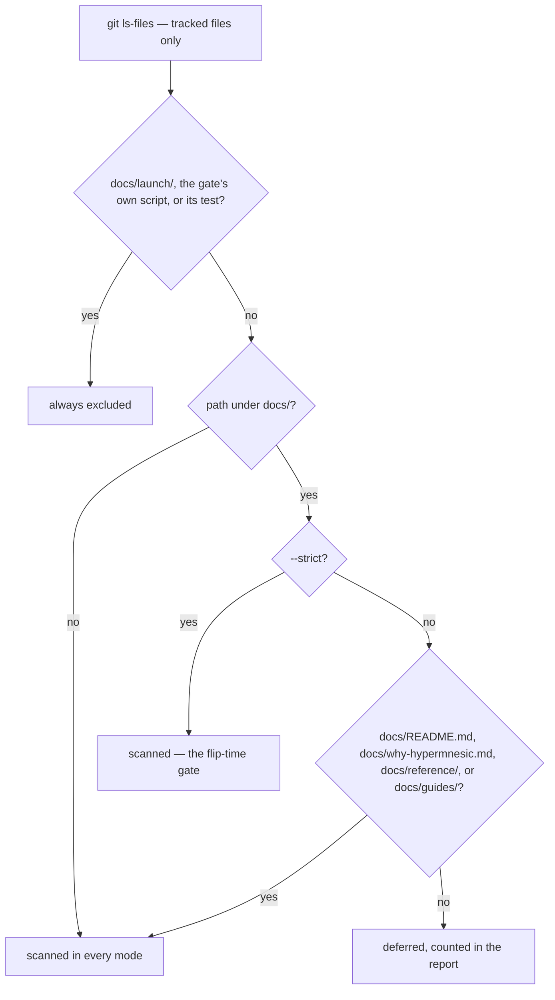
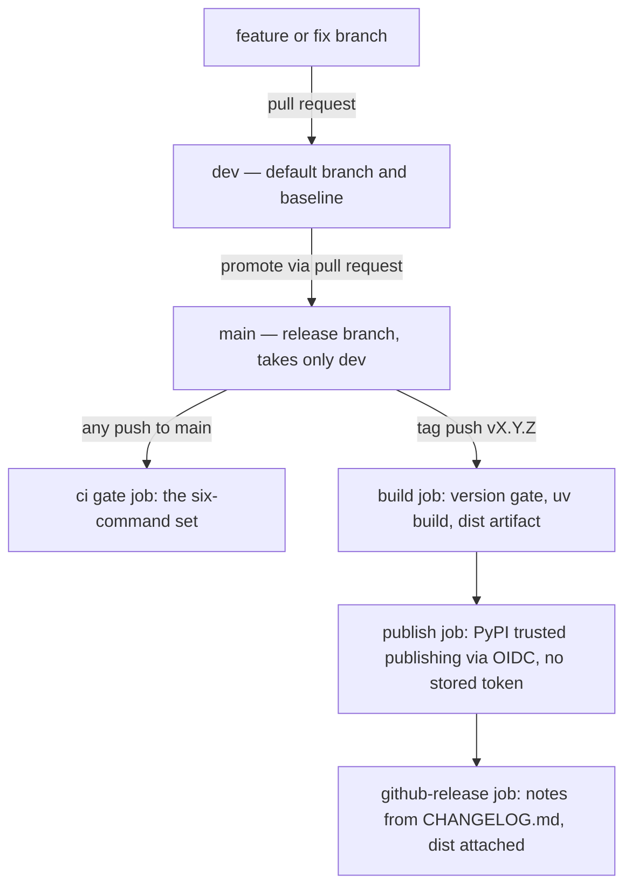

# Testing and Release Gates

Two contracts are documented here, and they are deliberately separate. **What "done" means** is a
set of gates that run on every push and pull request and that a contributor can run locally to
produce the same verdict. **What ships** is a tag on `main` that builds, publishes to PyPI, and
announces a GitHub Release whose notes are extracted from the changelog.

Both contracts live in files, not in habit: [`.github/workflows/ci.yml`](../../.github/workflows/ci.yml)
defines the gates, [`.github/workflows/release.yml`](../../.github/workflows/release.yml) defines the
<!-- openwiki: broken internal link [../../scripts] file "../../scripts" does not exist. Fix the href or restore the target, then delete this comment. -->
publish, and [`scripts/`](../../scripts) holds the gate scripts they run. The rule that keeps
this page honest is the repository's own anti-drift rule: where a gate already pins a truth, point at
the gate instead of copying its list into prose
<!-- openwiki: broken internal link [../../AGENTS.md#L121-L134] heading anchor "L121-L134" does not exist in "../../AGENTS.md". Fix the href or restore the target, then delete this comment. -->
([`AGENTS.md`](../../AGENTS.md#L121-L134)).

| Concern | Enforced or produced by | Automated? |
|---|---|---|
| Lint | `uv run ruff check .` | Yes |
| Version agreement | [`scripts/check_version_consistency.py`](../../scripts/check_version_consistency.py) | Yes |
| Behaviour | `uv run pytest` | Yes |
| Copyleft dependencies | [`scripts/license_scan.py`](../../scripts/license_scan.py) | Yes |
| Operator secrets/hosts | [`scripts/preflight_public_scan.py`](../../scripts/preflight_public_scan.py) | Yes |
| What a user's install resolves | `fresh-install` CI job + [`tests/test_dependency_bounds.py`](../../tests/test_dependency_bounds.py) | Yes |
| Release notes | [`scripts/changelog_section.py`](../../scripts/changelog_section.py) | Yes |
| User-visible behaviour recorded | `[Unreleased]` entry in [`CHANGELOG.md`](../../CHANGELOG.md) | Review |
| Operability evidence | first-class product readiness checklist | Review, release-blocking |

## The gate set: local commands are CI steps

CI runs one gate job, `lint-test-license`, whose steps are exactly the commands the governance docs
require before a change is done — so passing locally and passing CI are the same event rather than
<!-- openwiki: broken internal link [../../AGENTS.md#L44-L59] heading anchor "L44-L59" does not exist in "../../AGENTS.md". Fix the href or restore the target, then delete this comment. -->
two hopeful approximations ([`AGENTS.md`](../../AGENTS.md#L44-L59),
<!-- openwiki: broken internal link [../../CONTRIBUTING.md#L39-L50] heading anchor "L39-L50" does not exist in "../../CONTRIBUTING.md". Fix the href or restore the target, then delete this comment. -->
[`CONTRIBUTING.md`](../../CONTRIBUTING.md#L39-L50)):

```sh
uv sync --extra dev
uv run ruff check .
uv run python scripts/check_version_consistency.py
uv run pytest
uv run python scripts/license_scan.py
uv run python scripts/preflight_public_scan.py
```

`uv sync --extra dev` is the setup step (the other five are what CI runs after its own sync), and
<!-- openwiki: broken internal link [../../.github/PULL_REQUEST_TEMPLATE.md#L8-L14] heading anchor "L8-L14" does not exist in "../../.github/PULL_REQUEST_TEMPLATE.md". Fix the href or restore the target, then delete this comment. -->
[`.github/PULL_REQUEST_TEMPLATE.md`](../../.github/PULL_REQUEST_TEMPLATE.md#L8-L14) repeats the five
checks as a checklist so a PR cannot claim the gates without them.

Two configuration facts are worth holding, because they are the parts a reader would otherwise
misremember: `ruff` is configured with `select = ["E", "F", "I", "UP", "B"]` at line length 100, and
CI installs **only** the `dev` extra — the `sidecar` and `bench` extras are not part of the gate
environment, which is why the heavy extractor libraries are imported lazily and the suite injects
fake extraction functions instead ([`pyproject.toml`](../../pyproject.toml#L31-L74),
[`src/hypermnesic/sidecar.py`](../../src/hypermnesic/sidecar.py#L8-L10),
[`tests/test_sidecar.py`](../../tests/test_sidecar.py#L1-L6)).

CI itself runs on pushes to `main` and `dev` and on every pull request, in two jobs: the gate job and
`fresh-install` ([`.github/workflows/ci.yml`](../../.github/workflows/ci.yml#L1-L35)).

## The test suite: offline, deterministic, test-first

The suite lives in `tests/`, runs with `--import-mode=importlib`, and is configured entirely from
[`pyproject.toml`](../../pyproject.toml#L72-L74).

Determinism is structural rather than incidental, and it comes from two fixtures in
[`tests/conftest.py`](../../tests/conftest.py):

- **`FakeEmbedder`** hashes text into a unit vector of exactly `EMBED_DIM` floats, so identical text
  yields an identical vector and different text yields a different one. A chunk is therefore its own
  nearest neighbour — retrieval assertions are stable — and rebuilds are bit-reproducible, which is
  what makes an index-reproducibility test meaningful instead of flaky. Because the vector width is
  the production width, the dimension invariants under test are real ones
  ([`tests/conftest.py`](../../tests/conftest.py#L26-L56)).
- **`make_corpus`** builds a small markdown repository, optionally git-initialized with a
  deterministic commit, so tests that need real git history get it without a network or an external
  checkout ([`tests/conftest.py`](../../tests/conftest.py#L64-L86)).

`conftest.py` also puts `harness/` on `sys.path`, which is how the suite imports the benchmark and
probe tools that are deliberately not part of the installed package — see
[Benchmarks and Evaluation](benchmarks-and-evaluation.md).

**The suite is offline because the embedding credential is neutralized, not because it is mocked
away.** Tests delete `OPENAI_API_KEY` and repoint `config._DOTENV_PATHS` at a path that does not
exist, so a developer's real repo-root `.env` cannot leak in and retrieval degrades to lexical-only;
the assertions then check that degradation explicitly (`degraded_lexical_only` is `True`), which
means the offline mode is asserted rather than assumed
([`tests/test_cli.py`](../../tests/test_cli.py#L21-L46)). The same discipline is used in the other
direction: a test asserts the fail-loud path (`embed.smoke_embed_or_die()` raising with
`OPENAI_API_KEY` named) rather than reaching a provider
([`tests/test_index.py`](../../tests/test_index.py#L129-L134)). The live provider path is covered
<!-- openwiki: broken internal link [../../CONTRIBUTING.md#L19-L22] heading anchor "L19-L22" does not exist in "../../CONTRIBUTING.md". Fix the href or restore the target, then delete this comment. -->
separately, outside the suite ([`CONTRIBUTING.md`](../../CONTRIBUTING.md#L19-L22)).

**Test-first is a rule, not a preference.** New production behaviour arrives with a failing test
first, and a red test is either fixed in the change or filed as a tracked issue — never dismissed or
<!-- openwiki: broken internal link [../../AGENTS.md#L61-L66] heading anchor "L61-L66" does not exist in "../../AGENTS.md". Fix the href or restore the target, then delete this comment. -->
deleted ([`AGENTS.md`](../../AGENTS.md#L61-L66)). The suite is the slow part of the loop: budget
minutes, not seconds, and do not mistake a low-CPU, I/O-bound run for a hang — it spends most of its
wall-clock time blocked on git subprocesses and index I/O
<!-- openwiki: broken internal link [../../AGENTS.md#L219-L224] heading anchor "L219-L224" does not exist in "../../AGENTS.md". Fix the href or restore the target, then delete this comment. -->
<!-- openwiki: broken internal link [../../CONTRIBUTING.md#L24-L37] heading anchor "L24-L37" does not exist in "../../CONTRIBUTING.md". Fix the href or restore the target, then delete this comment. -->
([`AGENTS.md`](../../AGENTS.md#L219-L224), [`CONTRIBUTING.md`](../../CONTRIBUTING.md#L24-L37)).

## The scanning gates

Three scripts encode invariants that were each paid for by a real defect. Their failure output is
designed to be actionable without investigation, and each one has its own test in `tests/` — so the
gate mechanics are falsifiable rather than trusted
([`tests/test_version_consistency.py`](../../tests/test_version_consistency.py),
[`tests/test_license_scan.py`](../../tests/test_license_scan.py),
[`tests/test_preflight_public_scan.py`](../../tests/test_preflight_public_scan.py)).

### Version consistency → `scripts/check_version_consistency.py`

[`pyproject.toml`](../../pyproject.toml#L1-L3) `[project].version` is the **single source of truth**.
The script collects every distributed version slot — the in-package `__version__`, each plugin
manifest (both the top-level `version` and every `plugins[].version`, so a marketplace listing's
nested entry is covered) and any citation metadata that exists — and fails on any divergence. A
manifest that declares **no** version slot is reported as such rather than passing silently, and a
failure names the diverging file and both versions.

The gate asserts in CI rather than deriving the manifests at build time: the script's own docstring
records that as the chosen lowest-churn default, with manifest generation noted as a drop-in
replacement if the team ever prefers it
([`scripts/check_version_consistency.py`](../../scripts/check_version_consistency.py#L1-L23)). The
enumerated list lives in that script's `MANIFESTS` / `CITATION_FILES` tuples and is intentionally
**not** restated here: run the gate, and it names what must change
([`scripts/check_version_consistency.py`](../../scripts/check_version_consistency.py#L36-L49)).

This gate exists because a release once bumped only the Python package and let the plugin manifests
drift; that same split is why the version row of the doc-sync table points at the gate instead of
<!-- openwiki: broken internal link [../../AGENTS.md#L96-L115] heading anchor "L96-L115" does not exist in "../../AGENTS.md". Fix the href or restore the target, then delete this comment. -->
listing slots ([`AGENTS.md`](../../AGENTS.md#L96-L115)).

### Copyleft → `scripts/license_scan.py`

The license gate scans the **resolved dependency tree of the active environment** and fails on
strong copyleft — AGPL, GPL, SSPL — matching against the human license string. LGPL is reported
informationally and does not fail the build, and a dependency whose metadata declares no license at
all is not denied: the gate fails only on a license string that matches the deny set
([`scripts/license_scan.py`](../../scripts/license_scan.py#L40-L67)). Its evidence source is
`pip-licenses --format=json --with-system`, with a fallback that reads `License` metadata directly
from installed distributions, so the gate still runs where `pip-licenses` is absent
([`scripts/license_scan.py`](../../scripts/license_scan.py#L70-L95)).

Two properties of this gate are load-bearing:

- **It is dependency-scoped, not project-scoped.** `uv sync` installs the root project into the
  environment, so its own distribution appears in the scan; the gate excludes it *before*
  classification, keyed on the PEP 503-normalized `[project].name`. Without that, flipping the
  engine's own license to `AGPL-3.0-only` would make the gate reject the project itself — a false
  failure ([`scripts/license_scan.py`](../../scripts/license_scan.py#L96-L142),
  [`pyproject.toml`](../../pyproject.toml#L6)).
- **The exclusion keys on the name only, so a real copyleft dependency is still denied.** The tests
  pin both directions: the project's own AGPL distribution is excluded, while a planted AGPL / GPL /
  SSPL dependency is still rejected, and the exclusion survives a differently-cased name
  ([`tests/test_license_scan.py`](../../tests/test_license_scan.py#L38-L85)).

Practically: a new dependency must keep this gate green, and the permitted set is what the gate
<!-- openwiki: broken internal link [../../CONTRIBUTING.md#L57-L59] heading anchor "L57-L59" does not exist in "../../CONTRIBUTING.md". Fix the href or restore the target, then delete this comment. -->
accepts, not a list maintained in prose ([`CONTRIBUTING.md`](../../CONTRIBUTING.md#L57-L59)).

### Operator secrets and hosts → `scripts/preflight_public_scan.py`

The preflight scan inspects the tracked tree for operator-private identifiers and credential
material so none of it can ship in a public surface. Its behaviour is a scope decision plus a
masking rule:



*How a tracked path is scoped by the preflight scan; only untracked (gitignored) data is excluded by
construction rather than by this decision tree.*

The properties worth knowing, in the order they surprise people:

- **Only git-tracked files are scanned**, so the gitignored corpus and private data are out of scope
  by construction; unreadable or binary files are skipped rather than failed
  ([`scripts/preflight_public_scan.py`](../../scripts/preflight_public_scan.py#L123-L156)).
- **`docs/launch/` and the gate's own script and test are always excluded.** The launch staging area
  documents the very secrets and decisions being prepared, and the scanner's own files necessarily
  contain the deny patterns — scanning them would self-trip
  ([`scripts/preflight_public_scan.py`](../../scripts/preflight_public_scan.py#L73-L85)).
- **Default mode is the CI gate and it defers, but never silently drops.** Code, config, root docs,
  and the durable docs are scanned; inherited process-exhaust documents (handoffs, plans,
  brainstorms, gate artifacts, runbooks, dated reviews) are deferred and the run **reports how many
  it deferred**. `--strict` is the flip-time gate that scans all tracked docs — including
  `docs/archive/`, deliberately, so archiving a document can never hide a leak from that gate. A
  history scan over commit diffs exists too, is informational only, and never fails the run
  ([`scripts/preflight_public_scan.py`](../../scripts/preflight_public_scan.py#L1-L38),
  [`tests/test_preflight_public_scan.py`](../../tests/test_preflight_public_scan.py#L93-L123)).
- **Findings are masked.** A hit prints file, line, pattern label, and a truncated value, so the gate
  never re-prints a secret into a console or CI log
  ([`scripts/preflight_public_scan.py`](../../scripts/preflight_public_scan.py#L106-L120)).
- **The deny set targets specific operator values, not generic categories.** The shared CGNAT
  documentation range and empty `VAR=` placeholders must not false-positive, which is exactly why the
  rule for docs, fixtures, and media assets is **use placeholders** — `<your-host>.ts.net`, the CGNAT
  range — never real operator values
  ([`scripts/preflight_public_scan.py`](../../scripts/preflight_public_scan.py#L50-L71),
<!-- openwiki: broken internal link [../../AGENTS.md#L75-L80] heading anchor "L75-L80" does not exist in "../../AGENTS.md". Fix the href or restore the target, then delete this comment. -->
  [`AGENTS.md`](../../AGENTS.md#L75-L80)). The deny-set members live in the script's `_DENY` tuple;
  the pattern classes are documented there, not copied here.

## The fresh-install job: what a user actually gets

The second CI job exists because of a shipped outage, and its reasoning generalizes.

Every other job runs inside `uv.lock` — and the lockfile does **not** travel with the published
distributions (the wheel target packages only `src/hypermnesic`), so an install from the index
resolves dependencies from metadata, the way a user's install does
([`pyproject.toml`](../../pyproject.toml#L58-L63)). No lock-resolved job can therefore see a
dependency resolving to a breaking major. That is exactly how an unbounded `mcp>=1.2` resolved
`mcp` 2.0.0 — which removed `mcp.server.fastmcp`, imported at module level by the server — and every
clean `uv tool install` crash-looped on `ModuleNotFoundError` (LS-2550)
([`.github/workflows/ci.yml`](../../.github/workflows/ci.yml#L28-L58),
<!-- openwiki: broken internal link [../../CHANGELOG.md#L48-L63] heading anchor "L48-L63" does not exist in "../../CHANGELOG.md". Fix the href or restore the target, then delete this comment. -->
[`CHANGELOG.md`](../../CHANGELOG.md#L48-L63)).

The job therefore builds the sdist and wheel, installs the **wheel** into a clean virtual environment
resolved from PyPI with no lockfile, prints the resolved runtime dependencies, and then proves the
package actually starts: importing `mcp_server` (the precise line that failed), printing the version,
and rendering `serve --help`.

[`tests/test_dependency_bounds.py`](../../tests/test_dependency_bounds.py) is the cheap local half of
the same protection, and it is faster than waiting for a dependency to publish a breaking major:

- Every entry in `[project].dependencies` must carry an upper bound (`<`, `~=`, `==`, or `.*`).
  Optional extras are developer-facing and may float; the runtime list is what ships
  ([`tests/test_dependency_bounds.py`](../../tests/test_dependency_bounds.py#L22-L45)).
- A second test requires `mcp<2` **while** `mcp_server.py` imports `from mcp.server.fastmcp`, and
  skips with an instruction to revisit the bound if that import ever disappears — so the bound and
  the code it protects move together ([`tests/test_dependency_bounds.py`](../../tests/test_dependency_bounds.py#L48-L56)).

The dependency table in [`pyproject.toml`](../../pyproject.toml#L19-L29) records the reason inline:
upper bounds are load-bearing precisely because the lockfile protects this repository and no user.

## Branches: `dev` is the baseline, `main` is the release branch

```text
feature/fix branch ──PR──▶ dev ──PR──▶ main ──tag v*.*.*──▶ PyPI + GitHub release
```

`dev` is the default branch and the baseline for all work. `main` is the **release branch**: it
receives `dev` at release time and never a feature branch. Branch off `dev`, PR into `dev`, and let
the PR tool use the repository default rather than passing an explicit base; never commit directly to
<!-- openwiki: broken internal link [../../AGENTS.md#L162-L178] heading anchor "L162-L178" does not exist in "../../AGENTS.md". Fix the href or restore the target, then delete this comment. -->
either branch ([`AGENTS.md`](../../AGENTS.md#L162-L178),
<!-- openwiki: broken internal link [../../CONTRIBUTING.md#L99-L113] heading anchor "L99-L113" does not exist in "../../CONTRIBUTING.md". Fix the href or restore the target, then delete this comment. -->
[`CONTRIBUTING.md`](../../CONTRIBUTING.md#L99-L113)).

If the two drift apart, reconcile by **merging `main` back into `dev`** — never by cherry-picking,
which leaves the same content under two SHAs to untangle at the next release.

Commits use conventional subjects (`feat:`, `fix:`, `docs:`, `chore:`, `test:`, `refactor:`) and
require a `Signed-off-by:` DCO line (`git commit -s`). The DCO is the lightweight provenance
attestation; a contributor licence agreement is deliberately not required
<!-- openwiki: broken internal link [../../CONTRIBUTING.md#L76-L88] heading anchor "L76-L88" does not exist in "../../CONTRIBUTING.md". Fix the href or restore the target, then delete this comment. -->
([`CONTRIBUTING.md`](../../CONTRIBUTING.md#L76-L88)).

Changes to auth, the MCP server, the write path, or the protected-path/governance guard are
**security-sensitive** and routed to the owner through
[`.github/CODEOWNERS`](../../.github/CODEOWNERS#L8-L25) — which also covers the gate scripts and
`/.github/` itself, so edits to the workflows on this page take the same route. They should cite
[`SECURITY.md`](../../SECURITY.md) and the threat model, and never be reported as a public issue
<!-- openwiki: broken internal link [../../CONTRIBUTING.md#L90-L97] heading anchor "L90-L97" does not exist in "../../CONTRIBUTING.md". Fix the href or restore the target, then delete this comment. -->
([`CONTRIBUTING.md`](../../CONTRIBUTING.md#L90-L97)). The write path itself is documented in
[Write Guard and Security Model](../architecture/write-guard-and-security-model.md).

## Releasing: a tag is the only thing that publishes

**Merging to `main` publishes nothing.** `release.yml` triggers only on a `v*.*.*` **tag push** or a
manual `workflow_dispatch`; a branch merge runs `ci.yml` and stops. Publishing is a deliberate act,
never a side effect of merging — so a release that "should have gone out" after a merge did not fail,
it was never triggered ([`.github/workflows/release.yml`](../../.github/workflows/release.yml#L19-L23),
<!-- openwiki: broken internal link [../../CONTRIBUTING.md#L120-L124] heading anchor "L120-L124" does not exist in "../../CONTRIBUTING.md". Fix the href or restore the target, then delete this comment. -->
[`CONTRIBUTING.md`](../../CONTRIBUTING.md#L120-L124)).



*The branch topology and the three dependent release jobs; only a tag on `main` reaches the publish
job.*

The workflow is three dependent jobs, each gated on the last
([`.github/workflows/release.yml`](../../.github/workflows/release.yml#L25-L114)):

1. **Build** — re-runs the version-consistency gate, then `uv build`, then uploads `dist/` as an
   artifact with `if-no-files-found: error`, so a build that produced nothing fails instead of
   publishing nothing quietly.
2. **Publish** — `needs: build`; downloads the artifact and uploads with
   `pypa/gh-action-pypi-publish` under `environment: pypi` (linked to
   `https://pypi.org/p/hypermnesic`) and `permissions: id-token: write`. Trusted Publishing exchanges
   a short-lived GitHub OIDC token for a PyPI upload token at run time, so there is **no stored API
   token**. A consequence worth understanding: a tag pushed from the wrong place cannot be quietly
   undone by rotating a credential, which is precisely why tagging is deliberate.
3. **GitHub release** — `needs: publish`, so nothing is announced that did not actually reach PyPI,
   and `if: startsWith(github.ref, 'refs/tags/v')`, so a manual dispatch publishes without creating a
   release. This job alone escalates `contents: write`; the other jobs stay read-only.

This path requires one-time operator setup on the PyPI side: a trusted publisher naming the owner,
repository, workflow, and the `pypi` environment, which must match the `environment:` in the job
([`.github/workflows/release.yml`](../../.github/workflows/release.yml#L1-L17)). Until that exists,
the publish job cannot succeed no matter how correct the tag is.

### Release notes are derived, not hand-written

The `github-release` job builds its notes **from the changelog**, so they cannot drift from the record
the way a hand-written body does:

```sh
python scripts/changelog_section.py "$GITHUB_REF_NAME" > notes.md
```

[`scripts/changelog_section.py`](../../scripts/changelog_section.py#L26-L59) prints one version's
section body and **exits non-zero** when the section is missing or empty — a release with empty or
wrong notes is worse than a job that stops and says why — and it explicitly refuses to build notes
from `[Unreleased]`, because that is a staging area rather than something that can be released. Its
section boundaries (stop at the next `## [` heading or the link-reference footer) are pinned by
[`tests/test_changelog_section.py`](../../tests/test_changelog_section.py#L55-L98), which also asserts
that the real changelog already has a section for the version in `pyproject.toml`.

The job then prepends an install line, a link to the published version and the full changelog, and
appends a compare link to the previous tag when one exists — found with `git describe`, which is why
the checkout uses `fetch-depth: 0` for tags and history. The release is created with
`gh release create … --verify-tag` and the built `dist/*` artifacts attached
([`.github/workflows/release.yml`](../../.github/workflows/release.yml#L78-L114)).

### Release prep, in order

<!-- openwiki: broken internal link [../../CONTRIBUTING.md#L115-L148] heading anchor "L115-L148" does not exist in "../../CONTRIBUTING.md". Fix the href or restore the target, then delete this comment. -->
The long form lives in [`CONTRIBUTING.md`](../../CONTRIBUTING.md#L115-L148) and
<!-- openwiki: broken internal link [../../AGENTS.md#L180-L199] heading anchor "L180-L199" does not exist in "../../AGENTS.md". Fix the href or restore the target, then delete this comment. -->
[`AGENTS.md`](../../AGENTS.md#L180-L199); the shape is:

1. **Choose the number.** The engine is pre-1.0 and uses `0.x` semantics, but the shape still holds:
   new backwards-compatible functionality — a new MCP tool, new fields on a tool's output — is a
   **minor** bump, and **patch** is reserved for releases that are fixes only. Decide by reading the
   whole pending `[Unreleased]` section, not the last change merged.
2. **Bump the version.** `pyproject.toml` `[project].version` is the single source of truth; run
   [`scripts/check_version_consistency.py`](../../scripts/check_version_consistency.py) rather than
   enumerating the mirrors from memory — it names every slot that must match and fails the release
   build if any disagree.
3. **Cut the changelog.** In [`CHANGELOG.md`](../../CHANGELOG.md), rename `[Unreleased]` to
   `[X.Y.Z] - YYYY-MM-DD`, leave a fresh empty `[Unreleased]` above it, and update the compare links
   at the foot of the file. The release notes come from this section, so anything missing here ships
   undocumented.
4. **Promote `dev` to `main`** via pull request.
5. **Tag `vX.Y.Z` on `main`**, on the exact commit you intend to ship, and push the tag.

One release invariant is **not** automated: the changelog heading date and `date-released` in the
citation files must equal the date the tag is actually pushed, and when release prep lands days ahead
of the tag they must be updated at tag time. The version gate checks versions, not dates; letting
those drift is what let the `0.0.4`/`0.0.5` pair disagree twice
<!-- openwiki: broken internal link [../../AGENTS.md#L197-L199] heading anchor "L197-L199" does not exist in "../../AGENTS.md". Fix the href or restore the target, then delete this comment. -->
<!-- openwiki: broken internal link [../../CONTRIBUTING.md#L145-L148] heading anchor "L145-L148" does not exist in "../../CONTRIBUTING.md". Fix the href or restore the target, then delete this comment. -->
([`AGENTS.md`](../../AGENTS.md#L197-L199), [`CONTRIBUTING.md`](../../CONTRIBUTING.md#L145-L148)).

The Obsidian companion ships from its own repository under GPL-3.0 with its own version and release
cadence; it is not released from here.

## Documentation is part of the change

A change is **not done** until every document it affects is corrected **in the same pull request**.
"Update the docs later" is not permitted, because later does not come and a stale document actively
misleads the next reader. This is paid-for scar tissue: a release that bumped only the Python package
and let the plugin manifests drift, and a whole drift-correction effort spent un-staling
self-descriptions the code had long since moved past
<!-- openwiki: broken internal link [../../AGENTS.md#L90-L134] heading anchor "L90-L134" does not exist in "../../AGENTS.md". Fix the href or restore the target, then delete this comment. -->
([`AGENTS.md`](../../AGENTS.md#L90-L134)).

Three rules give that statement teeth:

- **Point at the enforcing gate; do not re-list the enumerable set.** Versions →
  `check_version_consistency.py`; copyleft → `license_scan.py`; secrets and hosts →
  `preflight_public_scan.py`. A copied list is the next thing to drift, which is why the version and
  preflight sections above name the scripts rather than their contents.
- **The doc-sync table is the map.** A change to the MCP tool surface, the CLI, config/env, the write
  guard, auth/serving topology, retrieval, the version, or the release workflow and branch topology
  names the documents that must move in the same PR — a release-workflow change must update **both**
  `AGENTS.md` and `CONTRIBUTING.md`, because an agent that reads a stale branch rule opens its PR
<!-- openwiki: broken internal link [../../AGENTS.md#L104-L119] heading anchor "L104-L119" does not exist in "../../AGENTS.md". Fix the href or restore the target, then delete this comment. -->
  against the wrong branch ([`AGENTS.md`](../../AGENTS.md#L104-L119)).
- **`docs/README.md` "current truth" is the tie-breaker,** and dated, signed-off security reviews are
  append-only — amend them, do not rewrite them.

Most of this is review-enforced. Three parts are automated: the version gate above,
[`tests/test_product_readiness_docs.py`](../../tests/test_product_readiness_docs.py), which pins that
the readiness and remote-smoke checklists exist, stay operator-runnable, and keep separating
benchmark evidence from product proof, and
[`tests/test_changelog_section.py`](../../tests/test_changelog_section.py#L94-L98), which fails when
the changelog has no section for the version currently declared in `pyproject.toml`.

## Beyond the CI job: operability gates

The gate job is not the whole release contract. Product operability is gated separately from
retrieval quality:
[`scripts/product_smoke.py`](../../scripts/product_smoke.py#L1-L60) runs a deterministic seven-stage
loop — capture, retrieve, write preview, memory inspect, forget preview, recall after change, doctor
status — on a disposable fixture vault with path-relative, secret-free output, and the suite exercises
it in-process ([`tests/test_smoke.py`](../../tests/test_smoke.py#L36-L60)). CI never runs a paid
benchmark; what a benchmark score does and does not prove is
[Benchmarks and Evaluation](benchmarks-and-evaluation.md).

The authoritative operability gate is the
[first-class product readiness checklist](../../docs/launch/first-class-product-readiness-checklist.md):
it is **release-blocking**, every row needs a current recorded result, pass/fail, reviewer, and date,
and missing or stale evidence, a failed command, unreviewed docs drift, a secret-scan finding, or a
failed remote-client smoke all block the claim. The manual remote-client rows come from
[`docs/guides/remote-client-smoke-checklist.md`](../../docs/guides/remote-client-smoke-checklist.md),
whose offline contracts are covered inside the suite by
[`tests/test_product_remote_smoke.py`](../../tests/test_product_remote_smoke.py).

Setting up and diagnosing a host so those rows can be produced is
[Provisioning and Diagnostics](../operations/provisioning-and-diagnostics.md); the platform model
behind both contracts is [Architecture Overview](../architecture/overview.md); the shortest path from
clone to a passing gate loop is [Quickstart](../quickstart.md).
