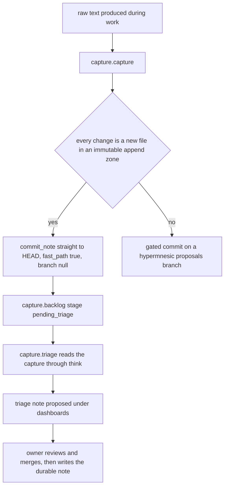
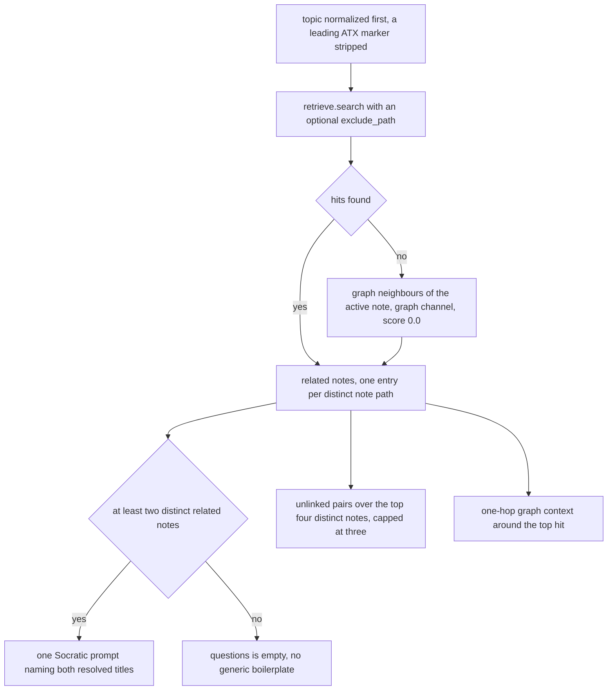
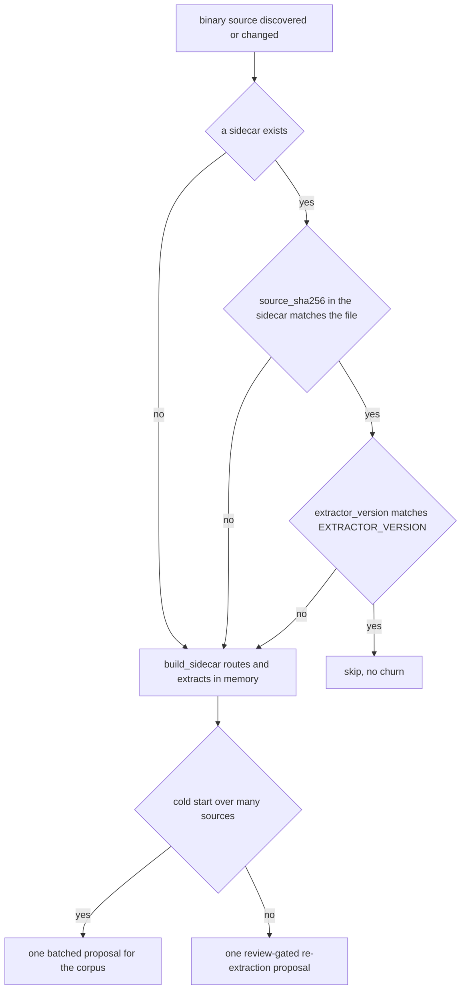

# Capture and Thinking Workflows

The daily loop is **capture -> triage -> recall -> write -> review -> clean up**, and this page owns
the surfaces that run in front of a curated write: raw capture and its deferred triage, thinking mode,
folder discovery, and sidecar extraction — plus the rules for whether something belongs in memory at
all. They exist because two different frictions were being solved as if they were one: *getting
something in* and *turning it into structure*. Splitting them in time is the whole design.

- **Capture is cheap.** Raw text lands under `sources/` immediately, through the immutable free-append
  tier of the write path, with no organization demanded and no proposal in the moment.
- **Curation stays review-gated.** Triage, folder discovery, and sidecar extraction all produce
  proposals or read-only answers. Nothing here decides on the owner's behalf.

**Handoffs.** The shape of a note — frontmatter keys, path zones, generated markers, trust tags — is
owned by [The Note Contract](../concepts/note-contract.md); this page does not restate it. The guard,
the diff-or-die gate, the commit, and the proposal routing are owned by
[Git-First Write Path](../architecture/git-first-write-path.md). The registered tool contracts for
`think` and `list_folders` live in [MCP Tool Surface](../surfaces/mcp-tool-surface.md), the generated
review surfaces in [Review and Navigation Workflows](review-and-navigation.md), and the discovery
bounds and tunables in
[Configuration and Tunables](../operations/configuration-and-tunables.md).



*The intake loop: capture takes the friction-free route into `HEAD`; everything that reorganizes
knowledge is a proposal an owner approves.*

## Capture lands raw text, fast

```sh
hypermnesic capture /path/to/vault "raw meeting note or fleeting project observation"
```

`capture.capture()` builds exactly one change — a body-only note at
`sources/captures/<stamp>-<sha6>.md` — and hands it to `propose()` with `allowlist=["sources/"]`. The
allowlist is the security property: the write cannot reach anywhere else in the vault no matter what
name it was given, because every path is guard-checked against that declared scope before a branch or
a file exists.

Because every change in the proposal is a **new** file inside an append zone, `propose()` routes the
call to the free-append fast path rather than the review queue. That path calls `commit_note()` per
file, so the capture is a real commit at `HEAD` — durable, not a working-tree file — and the result
carries `fast_path=True` with `branch=None`. The CLI reports `{ fast_path, files, commit }`; the index
projection is best-effort and only happens when an `index.db` already exists for the repo.

The name is derived from the content, and that has two consequences worth knowing:

- `stamp` comes from the caller's `now` (the CLI passes none, so it defaults to the literal string
  `capture`), and `sha6` is the first six hex characters of the body's SHA-256. The name is therefore
  deterministic from the text.
- A capture **cannot take the overwrite route.** The free-append fast path applies only when every
  change is a file that does not exist at `HEAD`, so a name that is already taken falls to the review
  queue instead. With the automatic content-derived name, a second capture of identical text
  re-derives the same path and resolves as an idempotent no-op — no branch, no second commit,
  `fast_path` false — while different text hashes to a different name and lands as a new raw file.

**Never rewrite a capture into something cleaner.** Triage proposes; a summary is a *new* note that
cites the raw path. Replacing raw evidence with a cleaned version destroys the thing the whole loop
exists to preserve, and it is not something triage is able to do — see below.

### Entry points

| Surface | Entry point | Notes |
|---|---|---|
| CLI | `hypermnesic capture <repo> <text>` | Engine-host-local; `--json` prints the fast-path result. |
| Library | `capture.capture(repo, text, name=..., now=..., idx=..., log=...)` | `name` and `now` are caller-controlled, which is what makes the deterministic naming testable. |
| MCP | *none* | No capture tool is registered. A remote client's only write path is the `commit_note` tool, which is registered solely on a write-enabled server. |

There is no separate "capture" capability on the remote surface on purpose: the one sanctioned write
tool plus the append zone is what makes a low-friction raw landing possible from a connected client,
and adding a second write tool would create a second thing to audit.

## Triage is a proposal, never a move

Triage happens later, over a capture that already exists. `capture.triage(repo, idx, graph,
captured_rel, ...)`:

1. Reads the captured file. A path that does not exist returns `{"status": "not_found", ...}` and
   creates no branch at all.
2. Runs thinking mode over the capture's text — `think.think(idx, text.strip(), ...)`. The analysis
   step is the read-only path, so it cannot write even by accident.
3. Takes the related note paths, excluding the capture itself, and keeps the first five.
4. Derives a **suggested placement** from the first related note's directory: `` `folder/` `` when it
   has one, `(vault root)` when it has none, and `(undetermined — no close neighbours yet)` when
   there are no related notes at all. An honest "I don't know" beats a confident guess.
5. Picks a **grapple** prompt: the first note-grounded question from thinking mode, or the fixed
   fallback *"What does this capture connect to, and why did it matter?"* when there was none.
6. Renders a generated `dashboards/triage-<safe_slug(captured_rel)>.md` note (title
   `Triage: <capture>`, `type: triage`) containing the placement, the connection wikilinks, and the
   grapple prompt, then proposes it with `allowlist=["dashboards/"]` and `source=captured_rel`.

What it never does: move, rename, rewrite, or delete the capture. The proposal lands on a
`hypermnesic/proposals/<slug>` branch in an isolated worktree, so `HEAD` and the owner's checkout are
untouched. The focused tests assert exactly that — the capture's bytes are identical before and after
triage, `HEAD` has not advanced, and the triage note exists only on the branch.

**The read-only proof travels with the result.** `capture.triage()` copies the thinking step's own
`wrote` value onto the proposal result as `thought_wrote`. A caller therefore does not have to trust a
docstring to know the analysis step wrote nothing: the value it needs is in the object it already
holds.

### Backlog: what is waiting, and how the stage is derived

`capture.backlog(repo)` lists the raw captures without mutating any of them. For each `*.md` under
`sources/` it reports the repo-relative path, a whitespace-collapsed snippet (at most 200 characters),
the byte size, and a stage:

- `triage_proposed` when a `dashboards/triage-<safe_slug(path)>.md` file exists in the **live working
  tree**;
- `pending_triage` otherwise.

That existence check runs against the owner's checkout, not the proposal branch — and proposal
branches are committed in an isolated worktree. The practical consequence is that the stage flips only
once a triage note has actually landed in the checkout, so an unmerged triage proposal still reads
`pending_triage`.

Backlog is a library function with no CLI subcommand of its own; it is composed into the daily-review
surface, which renders it as the "Capture backlog" section of
`dashboards/daily-review.md` (see [Review and Navigation Workflows](review-and-navigation.md)). The
CLI exposes `capture` and `daily-review`; `capture.triage` is reached as a library call.

## Thinking mode never writes, and the caller can check

Thinking mode is the "help me think before you write" surface, and it exists for the moment when
organizing the thought is premature. It is available as the MCP `think` tool and as
`hypermnesic think <repo> <topic> [--path <note>] [--k N]`, both of which return the same shape.

`think` composes hybrid retrieval with wikilink graph context and returns related notes, graph
context, at most one note-grounded Socratic prompt, and candidate missing links — plus an explicit
`wrote: false`.

### What the caller can verify rather than trust

The no-write boundary is asserted three separate ways, from weakest to strongest:

- **A field on the result.** `ThinkResult.wrote` is always `False`, and `as_dict()` publishes it as
  `wrote`. Both the CLI `--json` output and the MCP tool result carry it, and the CLI's human output
  prints `wrote=False` in its header.
- **Propagation into the workflow that used it.** Triage copies it onto the proposal result as
  `thought_wrote`, so the proof is attached to the artifact a later reviewer inspects.
- **A structural property, not a flag.** The module imports only read surfaces (`retrieve`, `graph`,
  `ingest`); it does not import — and therefore cannot reach — `commit_note` or `propose`. A test
  scans the module's import lines for exactly those two names, so the boundary fails loudly if someone
  later widens the import surface.

Beyond the module, the tests also assert the observable absence of side effects: `HEAD` and the
index's path set are unchanged across a `think` call.

### How the result is assembled



*One `think` call: retrieval first, an explicit graph fallback when self-exclusion empties the hits,
and prompts and pairs that only ever reference notes the retrieval actually found.*

The rules that keep the surface honest:

- **Notes, not chunks.** Prompts and pairs reason over distinct note paths. A note with two matching
  chunks cannot double-count itself or emit a duplicate pair.
- **Grounded prompts only.** The prompt fires only when there are at least two distinct related notes
  and names them by resolved title; otherwise `questions` is empty rather than padded with generic
  templates that reference nothing the retrieval found.
- **Unlinked pairs claim nothing.** A pair means "these surfaced together and no wikilink joins
  them" — computed over the top four distinct notes, capped at three, with any pair already connected
  in the graph dropped. Adding the link is a proposal, never a write.
- **Titles are note identity.** A related note is labelled from its own file (title resolution, with a
  stem fallback), never by whichever section heading the matched chunk happened to carry.
- **Self-exclusion is deliberate.** Passing the active note's path keeps it out of its own results,
  and the prompt and pairs derive from the same self-excluded hits.
- **Graph context respects the active note.** When there were no retrieval hits at all, context starts
  from the active note's path and its neighbours become low-confidence `graph`-channel related notes
  at score `0.0` — so a well-linked note does not produce a blank thinking surface.

### Degradation

An empty or meaningless topic on the lexical channel returns no related notes, an empty `questions`
list, and a plain "nothing relevant yet" note — still `wrote: false`. When the dense channel is
unavailable the answer comes from lexical and graph evidence and the result says so through
`degraded_lexical_only` and `degraded_reason`; the reason vocabulary and the merge with the
convergence pass are documented on [MCP Tool Surface](../surfaces/mcp-tool-surface.md).

## Discover the folders before choosing a path

An agent that has decided to write a durable note still has to choose a destination, and the honest
answer to "where does this go" is a question about the vault, not a guess. Folder discovery answers it
before the write is attempted: MCP `list_folders(root, depth)` and the CLI twin
`hypermnesic list-folders <repo> [--root PREFIX] [--depth N] [--allowlist PREFIX] [--now]`.

`folders.derive_folders()` is a pure function over the index's path set, returning
`{root, depth, folders, truncated, omitted}` where each folder carries
`{path, writable, protected_reason, note_count}`.

- **Writability is single-sourced from the write guard.** A folder's flag is the guard's verdict on a
  synthetic `__probe__.md` placed *under* the prefix, so discovery answers the same question
  `commit_note` answers for a real write. Probing a file under the prefix rather than the bare prefix
  is what makes a nested protected directory such as `projects/scripts/` correctly non-writable while
  its parent stays writable — a bare prefix would have read it as writable.
- **One coercion site.** `build_server()` computes the effective write surface once and hands the same
  value to `commit_note`'s allowlist and to folder discovery. The CLI's `--allowlist` preview reuses
  that same coercion, so a preview matches what the live write surface would accept.
- **Bounded and deterministic.** Entries are sorted **before** the node cap, so truncation always
  drops the same tail; the response reports `truncated` plus an `omitted` count, and `depth` is
  clamped to a ceiling. Narrowing `root` is how a caller drills deeper. The caps are
  `LIST_FOLDERS_MAX_NODES` and `LIST_FOLDERS_MAX_DEPTH` — read the values on
  [Configuration and Tunables](../operations/configuration-and-tunables.md).
- **The path set comes from the index**, so skip directories (`.git`, `.obsidian`, `node_modules`,
  `__pycache__`) are structurally undiscoverable rather than filtered by a second rule that could
  drift from the index's own exclusion list.
- **A bad root fails closed.** A caller-supplied root is normalized to a repo-relative
  trailing-slash prefix, and an absolute path or one containing `..` is rejected. The CLI exits
  non-zero with the message; the MCP tool returns an empty, leak-free listing, so a malformed request
  cannot be used to probe for out-of-vault paths through error text.

### Root-local agent guidance, sanitized

When the requested root has one, the listing also carries `agent_instruction`: the direct `AGENTS.md`
at that root, falling back to a direct `CLAUDE.md` only when `AGENTS.md` is absent. Descendant
instruction files are deliberately not aggregated into a parent listing — narrow `root` to the child
to read its guidance.

Because this is a remote read surface, the content is sanitized before it leaves: host-local absolute
paths become `<local-path>` and private or tailnet endpoint URLs (including any `/mcp` URL) become
`<endpoint-url>`, while repo-relative paths and public URLs survive intact. Guidance stays useful
without leaking an operator's coordinates to a connected client.

## Sidecars make non-markdown sources retrievable

A PDF, DOCX, XLSX, PPTX, or image cannot be indexed directly, so it gets a **markdown sidecar** at
`sidecars/<source_rel>.md` that can be. `sidecar.build_sidecar()` is pure assembly — it routes,
extracts, computes the hash and quality, and renders the provenance frontmatter **in memory**; it
never writes. Callers route the result through the proposal queue.

`route()` is keyed on extension and complexity:

| Source | Extractor |
|---|---|
| Images (`.png`, `.jpg`, `.jpeg`, `.tiff`, `.bmp`, `.gif`) | Docling — layout and caption extraction |
| PDF that is scanned, table-dense, or equation-bearing | Docling |
| Simple native PDF | MarkItDown |
| `.docx`, `.pptx`, `.xlsx` | MarkItDown |
| Anything else | MarkItDown (safe permissive default) |

Two properties keep this honest and operable:

- **Permissive dependencies only, by gate.** The extractors (`docling`, `markitdown`) and the probe
  libraries behind the complexity heuristic (`pypdf`, `pdfplumber`) live in the `sidecar` extra; the
  copyleft alternatives are excluded on purpose and the zero-AGPL/GPL/SSPL dependency gate enforces it
  (see [Testing and Release Gates](../testing/testing-and-release-gates.md)).
- **Heavy imports are lazy.** The extractor libraries are imported only inside the extraction
  function, so the routing and hash-gate logic loads and stays testable without them installed; the
  complexity probe is injectable for the same reason.

The complexity probe is permissive and conservative: it reads the first three pages, treats almost no
extractable text as scanned, and looks for tables — returning `scanned: false, table_dense: false,
has_equations: false` if the libraries or the file are unusable. Alongside the provenance, extraction
records an honest fidelity flag: `low` for MarkItDown on a table-dense PDF, `partial` for `.xlsx`
(flattening loses structure), otherwise `ok`.

### The hash gate, and why re-extraction is a proposal



*The content-addressed gate: exactly three conditions cause extraction, and both write paths are
proposals.*

`needs_extraction(source_path, sidecar_text)` returns true in exactly three cases: there is no sidecar
text, the recorded `source_sha256` no longer matches the source bytes, or the recorded
`extractor_version` differs from the module constant. Anything else is skipped, so an unchanged binary
never causes churn. Frontmatter that cannot be parsed is treated as `{}` and therefore as a mismatch —
a corrupted sidecar is re-extracted rather than silently trusted. Bumping `EXTRACTOR_VERSION` is the
deliberate way to force a corpus-wide re-extraction after an extractor improves.

The two write paths are both proposals:

- `cold_start_proposal()` extracts many sources into **one batched proposal**. A pull request per
  binary is not review, it is noise, and the batching is also how the proposal budget stays
  meaningful.
- `reextract_proposal()` emits one review-gated proposal for one changed source. An existing sidecar
  is never silently overwritten: the new text lands on a branch, and the focused test asserts that
  nothing appears under `sidecars/` on `HEAD`.

Generated sidecars live in `sidecars/`, deliberately not in a guard-protected directory (`views/` is
protected and could not host them). These entry points are library-level: no CLI subcommand, MCP tool,
or hook drives cold start or re-extraction yet.

### The untrusted-source trust tag stays visible

Sidecar text originates in arbitrary binaries and reaches write-capable agents through the index — a
prompt-injection surface. So every sidecar carries `source: sidecar` in its frontmatter, and
`sidecar.trust_tag()` derives the same label from either the path convention or that key, returning
`source` for everything else. The current posture **accepts** sidecar content (an owner corpus on a
tailnet), but the tag is present now so a later policy can restrict sidecar-derived chunks from
write-capable tools without re-extracting anything. No code enforces such a restriction today, which
is worth knowing before treating the tag as an active control.

## What belongs in memory at all

Capture being cheap is not a licence to remember everything. The normative taxonomy is
[`docs/guides/memory-taxonomy.md`](../../docs/guides/memory-taxonomy.md); the operational form of it,
which the agent-facing skill repeats, is short:

**It belongs here** when it is durable project memory that future retrieval should surface: a stable
semantic fact, dated episodic/source evidence, a procedural or policy rule, a generated summary that
cites its sources, a raw capture, or a current-state mirror of an external system.

**It does not belong here by default:** behavioural preferences ("the user likes terse replies"),
temporary session state, transient inferences about a person, secrets or credentials of any kind, and
unreviewed sensitive personal material. These do not become durable project memory merely by being
useful — they belong in an adjacent short-term layer. A protected-path or scope refusal is a **control
signal**, not an obstacle to route around by changing paths or transports.

Two rules cut across the workflow:

- **Evidence first.** Preserve the raw capture; cite source paths. Never overwrite a raw capture with
  a cleaned summary — triage is allowed, silent source deletion is not. A genuine removal goes through
  the memory-control preview/apply flow so it becomes a new git event with audit context, not a
  rewrite (see [Memory and Client Control](../operations/memory-and-client-control.md)).
- **Unclear destination means ask.** `list_folders` exists precisely so "where does this go" is
  answered by the vault's own taxonomy and root-local guidance rather than by invention.

The engine only classifies after the fact: `memory list` labels a path under `sources/` as
`captured`, a note carrying the generated marker as `generated`, and everything else as `authored`, so
`--source-type captured` is how an owner reviews raw intake without inspecting paths by hand.

## What the focused tests pin

| Test file | Pins |
|---|---|
| `tests/test_capture.py` | Capture lands immediately on the fast path with no proposal branch and is git-tracked; triage proposes placement and connections without moving or mutating the capture and without advancing `HEAD`; `thought_wrote is False`; the backlog lists without mutating; a missing capture yields `not_found` and no branch; a capture with no neighbours is marked undetermined; the CLI capture reports `fast_path`. |
| `tests/test_think.py` | `wrote is False` with `HEAD` and the index path set unchanged; self-exclusion and the graph fallback; graph context; grounded single prompt, empty with one note, excluding the active note; unlinked pairs structured, deduplicated by note, empty when linked or single-hit; the import surface carries no `commit_note`/`propose`; graceful empty-topic degradation; the MCP tool set is read-only with `think` present and no write tool; the CLI mirrors the tool shape. |
| `tests/test_folders.py` | Recursive counts, protected and nested-protected folders, no prefix bleed, depth clamping, sorted-before-cap truncation with `omitted`, root traversal/absolute rejection, allowlist narrowing, instruction redaction, and that skip directories never surface. |
| `tests/test_sidecar.py` | Provenance fields and sidecar path; the hash gate skipping, re-firing on changed bytes and on an extractor version bump; the routing table; the low-fidelity label; the trust tag; a sidecar being indexed and retrievable; one batched cold-start branch for three files; re-extraction as a proposal that leaves `HEAD` untouched. |

The end-to-end product path — capture, recall, write preview, memory inspect, forget preview, recall
after the change — is exercised by `scripts/product_smoke.py`, which depends on capture having
committed rather than merely written.
.
