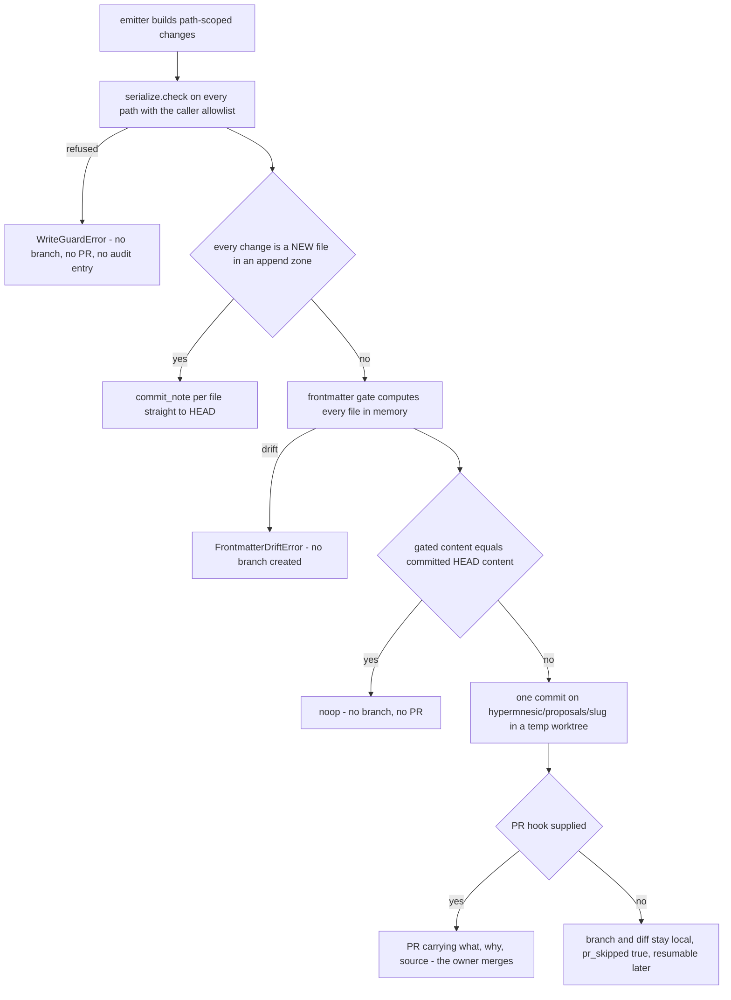
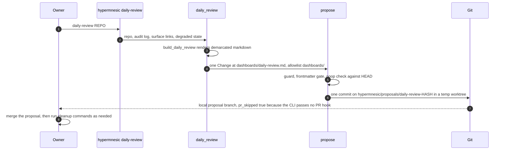

# Review and Navigation Workflows

This page owns the *review* leg of the daily loop — **capture → triage → recall → write → review →
clean up** — plus the generated surfaces that keep a vault navigable and resurfaced. Everything here
obeys one structural rule:

> **An organizing artifact is a proposal. It is never auto-applied, and it never rewrites a source
> note.**

That rule is not agent politeness. The emitters below have no other write path available to them:
they hand path-scoped changes to `propose()` (`src/hypermnesic/propose.py`), which is the single front
door for organizing writes. Direct `commit_note()` is reserved for the free-append zone (capture) and
single-note curated writes.

**Handoffs.** The note's shape, frontmatter ownership, path zones, and the managed-block marker
contract are owned by [The Note Contract](../concepts/note-contract.md); the guard, the diff-or-die
gate, the commit, and the audit log are owned by
[Git-First Write Path](../architecture/git-first-write-path.md); what may never be written is owned by
[Write Guard and Security Model](../architecture/write-guard-and-security-model.md); cleanup,
source-type derivation, and client control are owned by
[Memory and Client Control](../operations/memory-and-client-control.md); capture and triage are owned
by [Capture and Thinking Workflows](capture-and-thinking.md).

## Why everything flows through the proposal queue

A module that organizes the corpus does not commit. It builds `Change` records — a repo-relative
path, a replacement body, and/or `set_fields` — and calls `propose(...)`. Sidecars, the navigation
surface, the salience digest, connection suggestions, capture triage, and the daily review all do
exactly this; none of them holds a write privilege of its own.

Because the entry point is shared, the review guarantee is uniform:

- **The scope is declared, not inferred.** `allowlist` is a **required** keyword argument of
  `propose()`. Every path in the proposal is passed through `serialize.check(repo, path,
  allowlist=...)` before anything else happens, so a change can never reach outside the scope its
  caller declared — this is why every emitter below passes a narrow prefix such as `["dashboards/"]`.
- **The kernel's safety surface is reused, not re-implemented.** Same protected-path guard, same
  diff-or-die frontmatter gate (`frontmatter_gate.gated_edit`), same isolated-worktree commit posture
  (`serialize.branch_commit_transaction`), same append-only audit log. There is no second write lane
  to audit.
- **Ordering is the security property.** The guard runs on *every* path first, then each file's new
  text is computed in memory by the frontmatter gate. Both happen **before any branch exists**, so a
  refused path or a frontmatter-drift abort leaves no branch, no pull request, no commit and no audit
  entry behind — only the raised error.
- **Multi-file proposals are atomic.** The gated contents of all files are computed before the branch
  commit; one abort cancels the whole proposal rather than landing half of it.



*`propose()` control flow: refusal and drift both exit before a branch exists; the commit it creates is
never on the owner's `HEAD`.*

Three details of that flow are easy to get wrong when reading it:

- **The gate's baseline is committed `HEAD` content**, not the working tree
  (`propose._head_content`). A file that does not exist at `HEAD` is rendered fresh from `set_fields`
  plus `body` with no drift check, because there is nothing to drift from; an existing file goes
  through `frontmatter_gate.gated_edit`, and only the keys the caller asked for may change.
- **A proposal is a no-op when the result equals `HEAD`.** `propose()` compares every gated file
  against its committed content and returns a result with no branch and no PR rather than an empty
  diff.
- **The index is not projected from a proposal.** The curated path commits to a side branch, so the
  live index — a projection of `HEAD` — is untouched. Only the free-append fast path, which calls
  `commit_note()` per file, updates the index as a best-effort follow-up.

## What approving a proposal actually does

The heavy lifting already happened before approval. `serialize.branch_commit_transaction()` creates
the branch with `git branch <branch> <base>`, adds a temporary worktree, writes the gated contents,
commits them as **one** commit, and removes the worktree; on any failure it deletes the half-built
branch so no orphan ref remains. The owner's live `HEAD` and the working tree they read in Obsidian
are never touched. Tests assert exactly this: `HEAD` is unchanged before and after a proposal, and the
new content exists only on `hypermnesic/proposals/<slug>`.

Approval is therefore an ordinary, owner-only act on the host: **merge the pull request.** Nothing in
the engine merges. `propose()` calls the `gh_create` hook — `_default_gh_create` shells out to `gh pr
create --head <branch> --base <base>` when `gh` is on `PATH` — and the PR body carries only
what/why/source. `gh` is given no merge verb, and the returned `ProposalResult` exposes `branch`,
`commit_sha`, `pr_url` and `pr_skipped`, never a merge action. A merge is what finally lands the
commit on the base branch, after which the index catches up through normal read-time convergence (or
`hypermnesic converge <repo> --now`, or the opt-in post-merge hook from `hypermnesic install-hooks`).

The mechanics that make the queue tolerant of a real working environment:

- **No PR host is a degraded mode, not a failure.** With `gh_create=None` (or `gh` off `PATH`), the
  branch and its diff still exist locally, `pr_skipped` is true and `pr_url` is `None`. The CLI's
  daily-review path always takes this mode.
- **A ledger makes it resumable.** `.hypermnesic/proposals.json` records `{branch, commit, pr_url}`
  per slug. A later run that finds the branch already present does not create a second branch: with a
  recorded PR URL it returns `noop`; with the PR still missing it retries PR creation on the existing
  branch and updates the ledger.
- **Re-proposing is reconciliation, not duplication.** Identical content re-proposed against an
  existing branch resolves to `noop`. Note the consequence for a **fixed** slug: because an existing
  branch is never re-committed, a channel that reuses one slug cannot open a second proposal while
  that branch (or its ledger PR URL) still exists. The navigation surface and the daily review avoid
  this by deriving a **content-hash slug** — `nav-surface-<sha8>` over the rendered MOC plus `.base`,
  `daily-review-<sha8>` over the rendered review — so unchanged content is a no-op and changed
  content is a fresh proposal. The salience digest and connection suggestions use fixed slugs
  (`salience-digest`, `connection-suggestions`).
- **A budget bounds the cold-start flood.** `ProposalBudget` persists `{cycle, count}` to a JSON file,
  rolls over on a new UTC calendar day, and raises `BudgetExceededError` past the cap. It is charged
  **only when a real branch is created** — after the no-op check and the existing-branch reconcile, so
  no-ops and fast-path commits are free. `budget` is an optional parameter of `propose()`; the
  emitters on this page do not currently pass one, so the cap is available but not yet wired.
- **Slugs are sanitized because they reach `git` and `gh` as arguments.** `safe_slug()` lowercases,
  spaces to dashes, strips `..` before filtering the charset to `[a-z0-9-_/]`, collapses empty
  segments, forbids a leading `-` or `/`, and bounds the length at 60 characters (falling back to
  `proposal`), so a caller-supplied title cannot inject a git option or a ref traversal.
- **The audit entry is summary-only.** A proposal appends `verb="propose"` with the comma-joined
  paths, `old_sha` = base `HEAD`, `new_sha` = the branch commit, and the summary — never page text.

## Two tiers: immutable free-append versus curated

Routing is decided by a strict condition, not a heuristic:

| Tier | Condition | Result |
|---|---|---|
| Immutable free-append | **Every** change is a **new** file (absent at `HEAD`) inside an append zone (`IMMUTABLE_APPEND_ZONES`, i.e. `sources/`) | `commit_note()` per file straight to `HEAD`; `fast_path=True`, `branch=None`, no PR |
| Curated | Everything else — an existing file anywhere, or any non-append-zone path | One gated commit on `hypermnesic/proposals/<slug>`, surfaced as a PR |

A curated path can never reach the fast path, and the fast path never overwrites, because the
existence check is part of the condition. This tier split is what makes frictionless capture possible
without weakening review; see [Capture and Thinking Workflows](capture-and-thinking.md).

## The GENERATED demarcation, and where human edits go

Generated artifacts must be unmistakable as generated — including in a rendered reading view where
frontmatter is collapsed. `generated.render(frontmatter, body)` therefore forces two markers:

1. `generated_by: hypermnesic` into the frontmatter, merged **underneath** the caller's keys
   (`{"generated_by": ..., **frontmatter}`) so a caller can never omit it; and
2. a visible managed block — the callout line
   `> [!hypermnesic] generated — edits below this marker are overwritten`, followed by the body and
   closed by `<!-- /hypermnesic:generated -->`.

The `.base` view configuration cannot carry a callout, so `nav_surface.build_base_config()` writes
`generated_by: hypermnesic` into the YAML plus a leading comment line stating that edits are
overwritten.

`generated.is_generated()` detects the frontmatter marker, and that single predicate is what lets the
owner surfaces classify a note as `generated` rather than guessing — see
[Memory and Client Control](../operations/memory-and-client-control.md) for the derived
`generated` / `captured` / `authored` taxonomy.

**The honest overlap between regeneration and human edits.** Regeneration is whole-file, not
surgical: every builder here renders a complete file with `generated.render()` and proposes it as the
note's replacement body. So when a replacement proposal is merged:

- an edit **inside** the managed region is lost — that is the explicit contract the marker states;
- an edit **outside** the region is lost too, because the renderer does not preserve any of the
  previous file's text; the marker draws the boundary a reader should respect, not a merge rule the
  code implements;
- nothing is lost by *proposing*. Until the owner merges, the current file is exactly as it was; a
  hand edit made in the meantime is a change on the base branch that the merge has to reconcile like
  any other concurrent edit, so review the diff rather than assuming it will apply cleanly.

Practical guidance that follows: hand-author in your own note and link to the generated surface
rather than editing a generated file, and treat a generated dashboard as a view over the corpus
rather than as a place to keep content. Editing a generated file by hand is an ordinary curated
write — same guard, same diff-or-die gate as any other note.

## Salience and the spaced-review digest

`salience.score_notes(idx, graph, audit_log)` scores **every indexed path** from signals already in
hand, with fixed weights so the result is deterministic:

```
score = 0.4 · (link_degree / max_link_degree) + 0.3 · centrality + 0.3 · write_recency
```

- **Link degree** comes from the body-wikilink graph and is normalized by the maximum degree in the
  vault.
- **Centrality** is the mean cosine of a note's stored vector to every other note — a
  representativeness proxy computed from `Index.note_vectors()`, which averages a path's embedded
  chunk vectors. With fewer than two paths, centrality is `0.0`.
- **Write recency** is derived from the audit log and rank-normalized across *distinct* timestamps, so
  it is monotone and scale-free. The audit log records writes only; there is no read or access signal,
  so "recency" means recency of **write**. A path with no audit entry scores `0.0` and is dormant by
  construction.

Scores are sorted by score descending with the path as a stable tiebreak, and a note is flagged
`dormant` when its write recency falls below `dormancy_threshold` (default `0.5`).

Two honesty properties matter operationally:

- **Centrality is computed over a fully embedded corpus, or it says so.** `score_notes` calls
  `index.ensure_full_coverage()` first, which runs an unbudgeted embed pass. The returned
  `SalienceReport` carries `coverage_complete`, which is `False` when the embedder is absent or fails
  mid-fill; scores are still produced, but the partial centrality is labelled rather than presented as
  final. The report is iterable, indexable and sized like the score list it wraps.
- **No score is ever written back into a note.** Deliberately no `salience:` field is added to any
  source note's frontmatter — that churn is exactly what the generated-artifact rules forbid. The
  ranking lives only in the digest note.

The digest surfaces **salient-but-dormant** notes: dormant notes re-ranked by structural importance
only (link degree plus centrality, deliberately **not** recency, which is what made them dormant),
capped at `top_n` (default 10). `dormant_salient()` ranks by raw (unnormalized) link degree plus
centrality, so it is a different ordering from the score list. The rendered note lands at
`dashboards/salience-digest.md` as a `type: dashboard` generated note with the slug
`salience-digest` and the scope `["dashboards/"]`; with nothing dormant it says so instead of
padding.

## Connection and serendipity proposals

`connect.connection_proposals()` answers "these two notes grapple with the same idea but aren't
linked — connect them?". A pair is a candidate when it is similar **and** unlinked:

- cosine similarity at or above the threshold (default `0.83`), and
- strictly below the near-duplicate cutoff (default `0.999`) — shared templates, raw captures and
  boilerplate reach near-identical similarity and are not insight, and
- no existing body-wikilink edge in either direction (`graph.neighbors`), so "already connected" is
  never re-suggested.

Candidates are sorted deterministically by similarity then path and capped per run (default 20). The
whole computation is over vectors and graph edges the engine already has; it is **not** LLM
knowledge-graph extraction. When vectors are derived from the index rather than supplied directly,
`ensure_full_coverage()` runs first so a genuine pair is not missed merely because one note's chunks
were still unembedded.

Two behaviours are worth relying on:

- **No candidates means no artifact.** `connection_proposals()` returns `None` rather than an empty
  proposal — the surface refuses to add noise.
- **The link is never written.** The suggestion is a batched generated note at
  `dashboards/connection-suggestions.md`, carrying `[[a]] ↔ [[b]]` pairs with their similarity. Acting
  on it means the owner edits their own notes.

## Navigation: the MOC and the Bases dashboard

`nav_surface` maintains the always-organized human entry point, and emits both artifacts as **one**
proposal:

- **`dashboards/MOC.md`** — a Map-of-Content note listing every indexed path as a wikilink under
  `## Notes` (or an explicit empty state), a `## Recently changed` section built from up to five
  distinct most-recent paths in the audit log, and three optional link sections — `## Resurfaced
  (salience)`, `## Suggested connections`, `## Daily review` — rendered only when the corresponding
  relative path is passed in. Navigation generation therefore never blocks on the digest or the
  connection surface existing, and it can link the daily review back.
- **`dashboards/overview.base`** — an Obsidian Bases view configuration: one `all:` filter group
  (`file.ext == "md"`) and one table view named `All notes` ordered by `file.name` then `file.mtime`.
  Bases reads frontmatter and file metadata with no plugin code, so the dashboard costs zero plugin
  surface.

Both paths land in `dashboards/`, deliberately a **non-protected** directory — never the
guard-protected `views/`. The scope passed to `propose()` is `["dashboards/"]`, and the slug is the
content hash `nav-surface-<sha8>` computed over the rendered MOC plus `.base`, which is what makes an
unchanged surface a no-op and a changed surface a fresh proposal that reflects the change.

## The daily review

The daily review composes the other surfaces into one scan-friendly artifact at
`dashboards/daily-review.md` (slug `daily-review-<sha8>`, scope `["dashboards/"]`). It is the one
surface in this page wired to a command:

```sh
hypermnesic daily-review /path/to/vault
hypermnesic daily-review /path/to/vault --json
```

What the owner does each day, and which piece performs each step:

| Step | Command / tool | What happens |
|---|---|---|
| 1. Capture a thought | `hypermnesic capture <repo> "raw text"` | Free-append commit to `sources/captures/<stamp>-<sha6>.md`; no proposal, no PR |
| 2. Review the day | `hypermnesic daily-review <repo>` | Renders and proposes `dashboards/daily-review.md` on a `hypermnesic/proposals/` branch |
| 3. Read the review | The branch's file, or the PR that a PR-creating caller opened | Sections: daily loop, capture backlog, recent writes, generated surfaces, recall modes, cleanup, degraded state |
| 4. Approve what is right | Merge the pull request on the host | Owner-only; the engine never merges |
| 5. Clean up | `hypermnesic memory inspect / export / forget / revert / audit <repo> ...` | Preview-first, routed through the memory control center |
| 6. Re-warm the index | `hypermnesic converge <repo> --now`, or the opt-in post-merge hook | Catch the index up to the merged `HEAD` |

What `build_daily_review()` actually puts in the note, and what it does not:

- **Capture backlog** — `capture.backlog(repo)` lists the raw captures under `sources/`, each with its
  stage, `pending_triage` or `triage_proposed` (the latter derived from the existence of a
  `dashboards/triage-<slug>.md` note), plus a whitespace-collapsed 200-character snippet. An empty
  backlog renders an explicit empty state.
- **Recent writes** — up to five audit entries that carry a path, newest first, with their verb and
  summary. `reconcile` entries carry no path and are skipped.
- **Generated surfaces** — the labels supplied by the caller (`navigation`, `salience`, `connections`)
  and their relative paths, as wikilinks.
- **Recall modes** — the reminder of which primitive fits which question, including the resolution
  rule: resolve before wikilinking an entity, and do not guess on `null`.
- **Clean up** — the five memory-control commands, stated as preview-first next actions.
  `daily_review.CLEANUP_ACTIONS` exposes the same list as data and the CLI returns it in `--json`.
- **Offline / degraded** — the caller's degraded notes when supplied, otherwise a statement that
  lexical recall, capture, backlog review and cleanup guidance still work without dense retrieval.

**It does not move, delete, or rewrite anything.** The review reads the capture backlog from the
filesystem and the write history from the audit log; the `idx` and `graph` values the caller passes
are not read when the note is composed, which is why a repo with no `index.db` still produces a
review — the CLI reports
`partial: no index found; review uses files/audit only` in the note and still proposes it. Every
state change the review points at is a separate, previewed, owner-driven command; see
[Memory and Client Control](../operations/memory-and-client-control.md).

The CLI wiring has two behaviours an operator should expect:

- **PR creation is always skipped on this path.** `_cmd_daily_review` calls `review_proposal(...,
  gh_create=None)`, so the result is a local proposal branch with `pr_skipped` true — resumable later
  by a caller that supplies a PR hook. `--json` reports `{generated, files, branch, noop,
  cleanup_actions}` and the human output says `noop` or `proposal`.
- **The linked surfaces are conventions, not existence checks.** `--nav-rel` defaults to
  `dashboards/MOC.md` and `--digest-rel` to `dashboards/salience-digest.md`, so the review links those
  paths whether or not they exist yet; `--connections-rel` defaults to none, so the connections
  section appears only when it is passed.

Today the navigation, digest and connection builders are reached through their library entry points
(`nav_surface.nav_proposal`, `salience.digest_proposal`, `connect.connection_proposals`) rather than a
subcommand of their own; the daily review composes their paths by convention. That is the extension
point for a future command or proposal-inbox surface — the review-gated contract above is what a new
emitter has to honour: build `Change` records, declare a narrow `allowlist`, and let `propose()`
decide between the free-append commit and a proposal branch.



*The daily review end to end: composing costs nothing, proposing touches only a side branch, and
merging is the owner's act.*

## Tests that pin these guarantees

The behaviours on this page are spec-as-tests rather than documentation claims:

- `tests/test_propose.py` — the working branch `HEAD` is untouched by a proposal; a refused path and
  an unrequested-frontmatter-drift abort both leave no branch, no PR call and no audit entry;
  multi-file atomicity; allowlist scope enforcement; free-append fast path versus curated propose; the
  idempotent no-op; gh-unavailable then resumed PR creation on the same branch; the budget raising on
  the second branch; and an audit entry that records the proposal summary without leaking page body.
- `tests/test_nav_surface.py` — an unchanged corpus re-proposes as a no-op on the identical branch,
  adding a note produces a new branch whose MOC contains it, generated files land on a branch under
  `dashboards/` and never on `main`, the `.base` file parses as valid Bases YAML with `generated_by`,
  the MOC can link the daily review, and hand-authored notes stay byte-identical.
- `tests/test_salience.py` — deterministic scoring that ranks linked, recently-written notes above an
  orphan; the digest being a U18 proposal on a dashboard path carrying `generated_by` and the managed
  marker; byte-identical source notes; full embedding before scoring with `coverage_complete` true,
  and partial coverage flagged when the embedder fails; and the empty-state text.
- `tests/test_daily_review.py` — the review composes backlog, recent writes, surface links, cleanup
  commands and the degraded note; the proposal is review-gated with source notes unmutated; and the
  CLI's `--json` output reports the files, `generated: true` and the cleanup action list.
